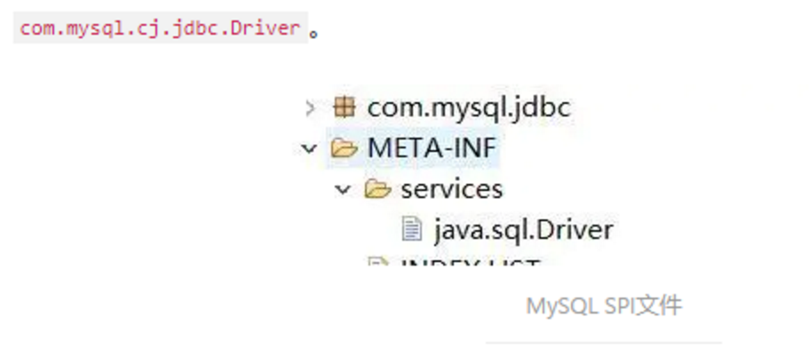

## 一、基础概念

### 1、Dubbo支持的协议

dubbo(默认)：单一长连接和NIO异步通讯，适合大并发小数据量的服务调用，以及消费者远大于提供者。传输协议 TCP，异步，Hessian 序列化;

rmi：采用JDK标准的rmi协议实现，传输参数和返回参数对象需要实现Serializable接口，使用java标准序列化机制，使用阻塞式短连接，传输数据包大小混合，消费者和提供者个数差不多，可传文件，传输协议 TCP。多个短连接，TCP 协议传输，同步传输，适用常规的远程服务调用和 rmi 互操作。在依赖低版本的 Common-Collections包，java 序列化存在安全漏洞;

webservice：基于 WebService 的远程调用协议，集成 CXF 实现，提供和原生 WebService 的互操作。多个短连接，基于 HTTP 传输，同步传输，适用系统集成和跨语言调用;

http：基于 Http 表单提交的远程调用协议，使用Spring的HttpInvoke 实现。多个短连接，传输协议 HTTP，传入参数大小混合，提供者个数多于消费者，需要给应用程序和浏览器 JS 调用;

hessian：集成Hessian 服务，基于HTTP通讯，采用Servlet暴露服务，Dubbo 内嵌 Jetty 作为服务器时默认实现，提供与Hession服务互操作。多个短连接，同步 HTTP 传输，Hessian 序列化，传入参数较大，提供者大于消费者，提供者压力较大，可传文件;

memcache： 基于memcached实现的RPC协议

传入传出参数数据包较小(建议小于100K)，消费者比提供者个数多，单一消费者无法压满提供者，尽量不要用dubbo协议传输大文件或超大字符串。

redis： 基于redis实现的RPC协议


### 2、Dubbo自动重试机

Dubbo在调用服务不成功时，默认会重试2次。Dubbo的路由机制，会把超时的请求路由到其他机器上，而不是本机尝试，所以 dubbo的重试机制也能一定程度的保证服务的质量。


### 3、Dubbo支持的注册中心

**Multicast 注册中心**

Multicast 注册中心不需要任何中心节点，只要广播地址，就能进行服务注册和发现。基于网络中组播传输实现

**Zookeeper 注册中心**

基于分布式协调系统 Zookeeper 实现，采用Zookeeper 的 watch 机制实现数据变更

**redis 注册中心**

基于redis实现，采用key/Map存储，住key存储服务名和类型，Map中key存储服务URL，value 服务过期时间。基于redis 的发布/订阅模式通知数据变更;


### 4、Dubbo集群的负载均衡策略

**随机**

按权重设置随机概率。在一个截面上碰撞的概率高，但调用量越大分布越均匀，而且按概率使用权重后也比较均匀，有利于动态调整提供者权重。(权重可以在dubbo管控台配置)

**轮循**

按公约后的权重设置轮循比率。存在慢的提供者累积请求问题，比如：第二台机器很慢，但没挂，当请求调到第二台时就卡在那，久而久之，所有请求都卡在调到第二台上。

**最少活跃调用数**

相同活跃数的随机，活跃数指调用前后计数差。使慢的提供者收到更少请求，因为越慢的提供者的调用前后计数差会越大。

**一致性Hash**

相同参数的请求总是发到同一提供者。当某一台提供者挂时，原本发往该提供者的请求，基于虚拟节点，平摊到其它提供者，不会引起剧烈变动。


### 5、Dubbo支持哪些序列化方式?

dubbo序列化：阿里尚未开发成熟的高效java序列化实现，阿里不建议在生产环境使用它

hessian2序列化(默认推荐)：hessian是一种跨语言的高效二进制序列化方式。但这里实际不是原生的hessian2序列化，而是阿里修改过的hessian lite，它是dubbo RPC默认启用的序列化方式

json序列化：目前有两种实现，一种是采用的阿里的fastjson库，另一种是采用dubbo中自己实现的简单json库，但其实现都不是特别成熟，而且json这种文本序列化性能一般不如上面两种二进制序列化。

java序列化：主要是采用JDK自带的Java序列化实现，性能很不理想。


### 6、注册中心宕机，服务间是否可以继续通信

可以通信的，启动dubbo时，消费者会从zk拉取注册的生产者的地址接口等数据，缓存在本地。每次调用时，按照本地存储的地址进行调用;

但前提是你没有增加新的服务，如果你要调用新的服务，则是不能办到的。

另外如果服务的提供者全部宕机，服务消费者会无法使用，并无限次重连等待服务者恢复;


### 7、Dubbo的集群容错方案

**Failover Cluster(默认):**

失败自动切换，当出现失败，重试其它服务器。通常用于读操作，但重试会带来更长延迟。

**Failfast Cluster**

快速失败，只发起一次调用，失败立即报错。通常用于非幂等性的写操作，比如新增记录。

**Failsafe Cluster**

失败安全，出现异常时，直接忽略。通常用于写入审计日志等操作。

**Failback Cluster**

失败自动恢复，后台记录失败请求，定时重发。通常用于消息通知操作。

**Forking Cluster**

并行调用多个服务器，只要一个成功即返回。通常用于实时性要求较高的读操作，但需要浪费更多服务资源。可通过 forks="2" 来设置最大并行数。

**Broadcast Cluster**

广播调用所有提供者，逐个调用，任意一台报错则报错 。通常用于通知所有提供者更新缓存或日志等本地资源信息。


### 8、服务提供者暴露一个服务的详细过程：

1.首先provider启动时，先把想要提供的服务暴露在本地。

2.然后再把服务暴露到远程。

3.启动netty服务，建立长连接。

4.连接到注册中心zk上。

5.然后监控zk上的消费服务。


### 9、在 Provider 上可以配置的 Consumer 端的属性有哪些？

1）timeout：方法调用超时 2）retries：失败重试次数，默认重试 2 次 3）loadbalance：负载均衡算法，默认随机 4）actives 消费者端，最大并发调用限制

### 10、Dubbo启动时如果依赖的服务不可用会怎样？

Dubbo 缺省会在启动时检查依赖的服务是否可用，不可用时会抛出异常，阻止 Spring 初始化完成，默认 check="true"，可以通过 check="false" 关闭检查。


### 11、Dubbo如何优雅停机？

Dubbo 是通过 JDK 的 ShutdownHook 来完成优雅停机的，所以如果使用 kill -9 PID 等强制关闭指令，是不会执行优雅停机的，只有通过 kill PID 时，才会执行。

### 12、服务提供者能实现失效踢出是什么原理？

服务失效踢出基于 Zookeeper 的临时节点原理。


### 13、为什么要用 Dubbo

随着服务化的进一步发展，服务越来越多，服务之间的调用和依赖关系也越来越复杂，诞生了面向服务的架构体系(SOA)，也因此衍生出了一系列相应的技术，如对服务提供、服务调用、连接处理、通信协议、序列化方式、服务发现、服务路由、日志输出等行为进行封装的服务框架。就这样为分布式系统的服务治理框架就出现了，Dubbo 也就这样产生了。

### 14、Dubbo 的使用场景有哪些

透明化的远程方法调用：就像调用本地方法一样调用远程方法，只需简单配置，没有任何API侵入。
软负载均衡及容错机制：可在内网替代 F5 等硬件负载均衡器，降低成本，减少单点。
服务自动注册与发现：不再需要写死服务提供方地址，注册中心基于接口名查询服务提供者的IP地址，并且能够平滑添加或删除服务提供者。

### 15、Dubbo 核心功能有哪些

Remoting：网络通信框架，提供对多种NIO框架抽象封装，包括“同步转异步”和“请求-响应”模式的信息交换方式。
Cluster：服务框架，提供基于接口方法的透明远程过程调用，包括多协议支持，以及软负载均衡，失败容错，地址路由，动态配置等集群支持。
Registry：服务注册，基于注册中心目录服务，使服务消费方能动态的查找服务提供方，使地址透明，使服务提供方可以平滑增加或减少机器。

### 16、Dubbo SPI 和 Java SPI 区别？

**JDK SPI：**
JDK 标准的 SPI 会一次性加载所有的扩展实现，如果有的扩展很耗时，但也没用上，很浪费资源。所以只希望加载某个的实现，就不现实了

**DUBBO SPI：**

1、对 Dubbo 进行扩展，不需要改动 Dubbo 的源码
2、延迟加载，可以一次只加载自己想要加载的扩展实现。
3、增加了对扩展点 IOC 和 AOP 的支持，一个扩展点可以直接 setter 注入其它扩展点。
4、Dubbo 的扩展机制能很好的支持第三方 IoC 容器，默认支持 Spring Bean。

### 17、Dubbo 支持分布式事务吗？

目前暂时不支持，可与通过 tcc-transaction 框架实现
介绍：tcc-transaction 是开源的 TCC 补偿性分布式事务框架TCC-Transaction 通过 Dubbo 隐式传参的功能，避免自己对业务代码的入侵。

### 18、Dubbo 可以对结果进行缓存吗？

为了提高数据访问的速度。Dubbo 提供了声明式缓存，以减少用户加缓存的工作量其实比普通的配置文件就多了一个标签 cache=“true”

### 19、Dubbo 必须依赖的包有哪些？

Dubbo 必须依赖 JDK，其他为可选。

### 20、Dubbo 支持哪些序列化方式？

默认使用 Hessian 序列化，还有 Duddo、FastJson、Java 自带序列化。

### 21、Dubbo 在安全方面有哪些措施？

Dubbo 通过 Token 令牌防止用户绕过注册中心直连，然后在注册中心上管理授权。
Dubbo 还提供服务黑白名单，来控制服务所允许的调用方。

### 22、服务调用是阻塞的吗？

默认是阻塞的，可以异步调用，没有返回值的可以这么做。Dubbo 是基于 NIO的非阻塞实现并行调用，客户端不需要启动多线程即可完成并行调用多个远程服务，相对多线程开销较小，异步调用会返回一个 Future 对象。

### 23、服务提供者能实现失效踢出是什么原理？

服务失效踢出基于 zookeeper 的临时节点原理。

### 24、同一个服务多个注册的情况下可以直连某一个服务吗？

可以点对点直连，修改配置即可，也可以通过 telnet 直接某个服务。

### 25、Dubbo 服务降级，失败重试怎么做？

可以通过 dubbo:reference 中设置 mock=“return null”。mock 的值也可以修改为 true，然后再跟接口同一个路径下实现一个 Mock 类，命名规则是“接口名称+Mock” 后缀。然后在 Mock 类里实现自己的降级逻辑

### 26、幂等性解决方案

1、能够在数据库里建一个惟一的索引，插入数据的时候若是惟一索引冲突了就不会插入重复数据；

2、经过redis里放一个惟一id值，而后每次要插入数据，都经过redis判断一下，那个值若是已经存在了，那么就不要插入重复数据了（前提是要知足redis的高可用）

### 27、Dubbo提供了四种实现负载均衡的机制

1. 随机调用法
2. 轮询法
3. 一致性Hash均衡算法
4. 最少活动调用法

**2.1 按照权重随机调用法**

这种方式的思想是为每一台服务器设置一个权值，当有请求到来时就按照大体的权重比例为该请求分配服务器。

每个请求都会按照权重的比例分配到相应的服务器上，如1、2、3号服务器权重分别是100、200、50，若有7个服务陆续发出请求，其中有2个请求将会发送到1号服务器，4个将会发送到2号服务器，1个发送到3号服务器。

而即便是有权重比例，请求还是会随机分配给每一个服务器，只是大体上会按照权重的比例而分配。

**2.2 轮询算法**

这种算法的思想首先要说到轮询，比如说有三台服务器，第一个请求将会分配给1号服务器，第二个请求分给2号服务器，第三个请求将会分配给3号服务器，第四个请求又重新分配给了1号服务器，以此轮询。

而基于加权的轮询算法则是会根据每台服务器的性能为服务器设置一个权值，加权后，每台服务器能够得到的请求数比例，接近或等于他们的权重比。

比如服务器 A、B、C 权重比为 5:2:1。那么在8次请求中，服务器 A 将收到其中的5次请求，服务器 B 会收到其中的2次请求，服务器 C 则收到其中的1次请求。

**2.3 一致性Hash均衡算法**

使用某种hash算法，同一请求总是会hash到同一台机子上。

传统的hash算法，存在当hash区间变化时，同样的值hash后的位置不一样了。

而一致性hash算法把请求，节点都hash后，放到一个圆环上，按照顺时针转动到的第一个节点为结果。这样就减少了结果的变化。还可以通过增加虚拟节点的方式均衡hash后的概率问题，当然增加节点需要交叉增加。

**2.4 最少活动调用法**

这种思想会让每一个服务提供者对应一个Active活跃数，刚开始时每台服务器的Active数均为0，每收到一个请求时，Active就加一，当下一次再有请求过来，就会将该请求分配给Active数较小的服务提供者。

而在实现上还会为每台服务器设置一个权重，当两台服务提供者的Active相同时且是最小时，就按照权重的大小为请求分配服务器。当然如果服务器的处理效率越高，Active数就会越少

## 二、遇到过的坑

### 1、服务调用失败

这问题一般有如下几种原因：

1. Provider服务全部下线，即没有一个存活的Provider服务进程。
2. 存在一个或多个Provider服务，但是**version或者group不匹配**。例如Consumer侧申明version=1.0.0，而Provider侧申明version=2.0.0，或者group不匹配，都会出现这个ERROR。
3. 暴露的IP有问题。例如暴露的是内网IP，但是调用却是通过外网IP；


## 三、架构设计

### 1、Dubbo 核心组件有哪些？


Provider：暴露服务的服务提供方
Consumer：调用远程服务消费方
Registry：服务注册与发现注册中心
Monitor：监控中心和访问调用统计
Container：服务运行容器

### 2、Dubbo 服务器注册与发现的流程？

服务容器Container负责启动，加载，运行服务提供者。
服务提供者Provider在启动时，向注册中心注册自己提供的服务。
服务消费者Consumer在启动时，向注册中心订阅自己所需的服务。
注册中心Registry返回服务提供者地址列表给消费者，如果有变更，注册中心将基于长连接推送变更数据给消费者。
服务消费者Consumer，从提供者地址列表中，基于软负载均衡算法，选一台提供者进行调用，如果调用失败，再选另一台调用。
服务消费者Consumer和提供者Provider，在内存中累计调用次数和调用时间，定时每分钟发送一次统计数据到监控中心Monitor。

### 3、Dubbo 的整体架构设计有哪些分层?


接口服务层（Service）：该层与业务逻辑相关，根据 provider 和 consumer的业务设计对应的接口和实现

配置层（Config）：对外配置接口，以 ServiceConfig 和 ReferenceConfig 为中心

服务代理层（Proxy）：服务接口透明代理，生成服务的客户端 Stub 和 服务端的 Skeleton，以 ServiceProxy 为中心，扩展接口为 ProxyFactory

服务注册层（Registry）：封装服务地址的注册和发现，以服务 URL 为中心，扩展接口为 RegistryFactory、Registry、RegistryService

路由层（Cluster）：封装多个提供者的路由和负载均衡，并桥接注册中心，以Invoker 为中心，扩展接口为 Cluster、Directory、Router 和 LoadBlancce

监控层（Monitor）：RPC 调用次数和调用时间监控，以 Statistics 为中心，扩展接口为 MonitorFactory、Monitor 和 MonitorService

远程调用层（Protocal）：封装 RPC 调用，以 Invocation 和 Result 为中心，扩展接口为 Protocal、Invoker 和 Exporter

信息交换层（Exchange）：封装请求响应模式，同步转异步。以 Request 和Response 为中心，扩展接口为 Exchanger、ExchangeChannel、ExchangeClient 和 ExchangeServer

网络 传输 层（Transport）：抽象 mina 和 netty 为统一接口，以 Message为中心，扩展接口为 Channel、Transporter、Client、Server 和 Codec

数据序列化层（Serialize）：可复用的一些工具，扩展接口为 Serialization、ObjectInput、ObjectOutput 和 ThreadPool


### 4、Dubbo Monitor 实现原理

Consumer 端在发起调用之前会先走 filter 链；provider 端在接收到请求时也是先走 filter 链，然后才进行真正的业务逻辑处理。默认情况下，在 consumer和 provider 的 filter 链中都会有 Monitorfilter。

1、MonitorFilter 向 DubboMonitor 发送数据
2、DubboMonitor 将数据进行聚合后（默认聚合 1min 中的统计数据）暂存到ConcurrentMap statisticsMap，然后使用一个含有 3 个线程（线程名字：DubboMonitorSendTimer）的线程池每隔 1min 钟，调用SimpleMonitorService 遍历发送 statisticsMap 中的统计数据，每发送完毕一个，就重置当前的 Statistics 的 AtomicReference

3、SimpleMonitorService 将这些聚合数据塞入 BlockingQueue queue 中（队列大写为 100000）

4、SimpleMonitorService 使用一个后台线程（线程名为：DubboMonitorAsyncWriteLogThread）将 queue 中的数据写入文件（该线程以死循环的形式来写）

5、SimpleMonitorService 还会使用一个含有 1 个线程（线程名字：DubboMonitorTimer）的线程池每隔 5min 钟，将文件中的统计数据画成图表

### 5、Dubbo 和 Spring Cloud 有什么哪些区别

Dubbo 底层是使用 Netty 这样的 NIO 框架，是基于 TCP 协议传输的，配合以Hession 序列化完成 RPC 通信。
Spring Cloud 是基于 Http 协议 Rest 接口调用远程过程的通信，相对来说Http 请求会有更大的报文，占的带宽也会更多。但是 REST 相比 RPC 更为灵活，服务提供方和调用方的依赖只依靠一纸契约，不存在代码级别的强依赖，这在强调快速演化的微服务环境下，显得更为合适，至于注重通信速度还是方便灵活性，具体情况具体考虑。

### 6、注册中心

Multicast 注册中心：Multicast 注册中心不需要任何中心节点，只要广播地址，就能进行服务注册和发现,基于网络中组播传输实现。

Zookeeper 注册中心：基于分布式协调系统 Zookeeper 实现，采用Zookeeper 的 watch 机制实现数据变更。

Redis 注册中心：基于 Redis 实现，采用 key/map 存储，key 存储服务名和类型，map 中 key 存储服务 url，value 服务过期时间。基于 Redis 的发布/订阅模式通知数据变更。

Simple 注册中心。

推荐使用 Zookeeper 作为注册中心

### 7、Dubbo 的注册中心集群挂掉，发布者和订阅者之间还能通信么？

可以通讯。启动 Dubbo 时，消费者会从 Zookeeper 拉取注册的生产者的地址接口等数据，缓存在本地。每次调用时，按照本地存储的地址进行调用。


## 四、集群

### 1、Dubbo集群提供了哪些负载均衡策略？

Random LoadBalance: 随机选取提供者策略，有利于动态调整提供者权重。截面碰撞率高，调用次数越多，分布越均匀。

RoundRobin LoadBalance: 轮循选取提供者策略，平均分布，但是存在请求累积的问题。

LeastActive LoadBalance: 最少活跃调用策略，解决慢提供者接收更少的请求。

ConstantHash LoadBalance: 一致性 Hash 策略，使相同参数请求总是发到同一提供者，一台机器宕机，可以基于虚拟节点，分摊至其他提供者，避免引起提供者的剧烈变动。

默认为 Random 随机调用。

### 2、Dubbo的集群容错方案有哪些

Failover Cluster：失败自动切换，当出现失败，重试其它服务器。通常用于读操作，但重试会带来更长延迟。

Failfast Cluster：快速失败，只发起一次调用，失败立即报错。通常用于非幂等性的写操作，比如新增记录。

Failsafe Cluster：失败安全，出现异常时，直接忽略。通常用于写入审计日志等操作。

Failback Cluster：失败自动恢复，后台记录失败请求，定时重发。通常用于消息通知操作。

Forking Cluster：并行调用多个服务器，只要一个成功即返回。通常用于实时性要求较高的读操作，但需要浪费更多服务资源。可通过 forks=”2″ 来设置最大并行数。

Broadcast Cluster：广播调用所有提供者，逐个调用，任意一台报错则报错 。通常用于通知所有提供者更新缓存或日志等本地资源信息。

默认的容错方案是 Failover Cluster。


## 五、配置

### 1、Dubbo 配置文件是如何加载到 Spring 中的？

Spring 容器在启动的时候，会读取到 Spring 默认的一些 schema 以及 Dubbo自定义的 schema，每个 schema 都会对应一个自己的 NamespaceHandler，NamespaceHandler 里面通过 BeanDefinitionParser 来解析配置信息并转化为需要加载的 bean 对象！

### 2、说说核心的配置有哪些？


### 3、Dubbo 超时设置有哪些方式？

Dubbo 超时设置有两种方式：

服务提供者端设置超时时间，在Dubbo的用户文档中，推荐如果能在服务端多配置就尽量多配置，因为服务提供者比消费者更清楚自己提供的服务特性。

服务消费者端设置超时时间，如果在消费者端设置了超时时间，以消费者端为主，即优先级更高。因为服务调用方设置超时时间控制性更灵活。如果消费方超时，服务端线程不会定制，会产生警告。

### 4、服务调用超时会怎么样？

dubbo 在调用服务不成功时，默认是会重试两次。

## 六、通信协议

### 1、Dubbo 使用的是什么通信框架?

默认使用 Netty 作为通讯框架。

### 2、Dubbo 支持哪些协议，它们的优缺点有哪些？

Dubbo： 单一长连接和 NIO 异步通讯，适合大并发小数据量的服务调用，以及消费者远大于提供者。传输协议 TCP，异步 Hessian 序列化。 **Dubbo推荐使用dubbo协议 。**

RMI： 采用 JDK 标准的 RMI 协议实现，传输参数和返回参数对象需要实现Serializable 接口，使用 Java 标准序列化机制，使用阻塞式短连接，传输数据包大小混合，消费者和提供者个数差不多，可传文件，传输协议 TCP。 多个短连接 TCP协议传输，同步传输，适用常规的远程服务调用和 RMI 互操作。在依赖低版本的Common-Collections 包，Java 序列化存在安全漏洞。

WebService：基于 WebService 的远程调用协议，集成 CXF 实现，提供和原生 WebService 的互操作。多个短连接，基于 HTTP 传输，同步传输，适用系统集成和跨语言调用。

HTTP： 基于 Http 表单提交的远程调用协议，使用 Spring 的 HttpInvoke 实现。多个短连接，传输协议 HTTP，传入参数大小混合，提供者个数多于消费者，需要给应用程序和浏览器 JS 调用。

Hessian：集成 Hessian 服务，基于 HTTP 通讯，采用 Servlet 暴露服务，Dubbo 内嵌 Jetty 作为服务器时默认实现，提供与 Hession 服务互操作。多个短连接，同步 HTTP 传输，Hessian 序列化，传入参数较大，提供者大于消费者，提供者
压力较大，可传文件。

Memcache：基于 Memcache实现的 RPC 协议。

Redis：基于 Redis 实现的RPC协议。


## 七、设计模式

### 1、Dubbo 用到哪些设计模式？

**工厂模式**

Provider 在 export 服务时，会调用 ServiceConfig 的 export 方法。
ServiceConfig中有个字段：

```java
private static final Protocol protocol=ExtensionLoader.getExtensionLoader(Protocol.class).getAdaptiveExtension();
```

Dubbo 里有很多这种代码。这也是一种工厂模式，只是实现类的获取采用了JDKSPI 的机制。这么实现的优点是可扩展性强，想要扩展实现，只需要在classpath下增加个文件就可以了，代码零侵入。另外，像上面的 Adaptive 实现，可以做到调用时动态决定调用哪个实现，但是由于这种实现采用了动态代理，会造成代码调试比较麻烦，需要分析出实际调用的实现类。


**装饰器模式**

Dubbo 在启动和调用阶段都大量使用了装饰器模式。以 Provider 提供的调用链为例，具体的调用链代码是在 ProtocolFilterWrapper 的buildInvokerChain 完成的，具体是将注解中含有 group=provider 的 Filter实现，按照 order 排序，最后的调用顺序是：

```
EchoFilter -> ClassLoaderFilter -> GenericFilter -> ContextFilter -
>ExecuteLimitFilter -> TraceFilter -> TimeoutFilter -> MonitorFilter -
>ExceptionFilter
```

更确切地说，这里是装饰器和责任链模式的混合使用。例如，EchoFilter 的作用是判断是否是回声测试请求，是的话直接返回内容，这是一种责任链的体现。而像ClassLoaderFilter 则只是在主功能上添加了功能，更改当前线程ClassLoader，这是典型的装饰器模式。

**观察者模式**

Dubbo 的 Provider 启动时，需要与注册中心交互，先注册自己的服务，再订阅自己的服务，订阅时，采用了观察者模式，开启一个 listener。注册中心会每5 秒定时检查是否有服务更新，如果有更新，向该服务的提供者发送一个 notify
消息，provider 接受到 notify 消息后，运行 NotifyListener 的 notify 方法，执行监听器方法。

**动态代理模式**

Dubbo 扩展 JDK SPI 的类 ExtensionLoader 的 Adaptive 实现是典型的动态代理实现。Dubbo 需要灵活地控制实现类，即在调用阶段动态地根据参数决定调用哪个实现类，所以采用先生成代理类的方法，能够做到灵活的调用。生成代
理类的代码是 ExtensionLoader 的 createAdaptiveExtensionClassCode 方法。代理类主要逻辑是，获取 URL 参数中指定参数的值作为获取实现类的key。


## 八、运维管理

### 1、服务上线怎么兼容旧版本？

可以用版本号（version）过渡，多个不同版本的服务注册到注册中心，版本号不同的服务相互间不引用。这个和服务分组的概念有一点类似。

### 2、Dubbo 支持服务降级吗？

以通过 dubbo:reference 中设置 mock=“return null”。mock 的值也可以修改为 true，然后再跟接口同一个路径下实现一个 Mock 类，命名规则是 “接口名称+Mock” 后缀。然后在 Mock 类里实现自己的降级逻辑

### 3、Dubbo 如何优雅停机？

Dubbo 是通过 JDK 的 ShutdownHook 来完成优雅停机的，所以如果使用kill-9 PID 等强制关闭指令，是不会执行优雅停机的，只有通过 kill PID 时，才会执行。


## 九、RPC

### 1、为什么要有RPC

http接口是在接口不多、系统与系统交互较少的情况下，解决信息孤岛初期常使用的一种通信手段；优点就是简单、直接、开发方便。利用现成的http协议进行传输。但是如果是一个大型的网站，内部子系统较多、接口非常多的情况下，
RPC框架的好处就显示出来了，首先就是长链接，不必每次通信都要像http一样去3次握手什么的，减少了网络开销；其次就是RPC框架一般都有注册中心，有丰富的监控管理；发布、下线接口、动态扩展等，对调用方来说是无感知、统一
化的操作。第三个来说就是安全性。最后就是最近流行的服务化架构、服务化治理，RPC框架是一个强力的支撑。

socket只是一个简单的网络通信方式，只是创建通信双方的通信通道，而要实现rpc的功能，还需要对其进行封装，以实现更多的功能。
RPC一般配合netty框架、spring自定义注解来编写轻量级框架，其实netty内部是封装了socket的，较新的jdk的IO一般是NIO，即非阻塞IO，在高并发网站中，RPC的优势会很明显

### 2、什么是RPC

RPC（Remote Procedure Call Protocol）远程过程调用协议，它是一种通过网络从远程计算机程序上请求服务，而不需要了解底层网络技术的协议。简言之，RPC使得程序能够像访问本地系统资源一样，去访问远端系统资源。比较关
键的一些方面包括：通讯协议、序列化、资源（接口）描述、服务框架、性能、语言支持等。


简单的说，RPC就是从一台机器(客户端)上通过参数传递的方式调用另一台机器(服务器)上的一个函数或方法(可以统称为服务)并得到返回的结果。

### 3、PRC架构组件

一个基本的RPC架构里面应该至少包含以下4个组件：
1、客户端（Client）:服务调用方（服务消费者）
2、客户端存根（Client Stub）:存放服务端地址信息，将客户端的请求参数数据信息打包成网络消息，再通过网络传输发送给服务端
3、服务端存根（Server Stub）:接收客户端发送过来的请求消息并进行解包，然后再调用本地服务进行处理
4、服务端（Server）:服务的真正提供者


**具体调用过程：**

1、服务消费者（client客户端）通过调用本地服务的方式调用需要消费的服务；
2、客户端存根（client stub）接收到调用请求后负责将方法、入参等信息序列化（组装）成能够进行网络传输的消息体；
3、客户端存根（client stub）找到远程的服务地址，并且将消息通过网络发送给服务端；
4、服务端存根（server stub）收到消息后进行解码（反序列化操作）；
5、服务端存根（server stub）根据解码结果调用本地的服务进行相关处理；
6、本地服务执行具体业务逻辑并将处理结果返回给服务端存根（server stub）；
7、服务端存根（server stub）将返回结果重新打包成消息（序列化）并通过网络发送至消费方；
8、客户端存根（client stub）接收到消息，并进行解码（反序列化）；
9、服务消费方得到最终结果；

而RPC框架的实现目标则是将上面的第2-10步完好地封装起来，也就是把调用、编码/解码的过程给封装起来，让用户感觉上像调用本地服务一样的调用远程服务。


### 4、RPC和SOA、SOAP、REST的区别

1、REST
可以看着是HTTP协议的一种直接应用，默认基于JSON作为传输格式,使用简单,学习成本低效率高,但是安全性较低。

2、SOAP
SOAP是一种数据交换协议规范,是一种轻量的、简单的、基于XML的协议的规范。而SOAP可以看着是一个重量级的协议，基于XML、SOAP在安全方面是通过使用XML-Security和XML-Signature两个规范组成了WS-Security来实现安
全控制的,当前已经得到了各个厂商的支持 。
它有什么优点？简单总结为：易用、灵活、跨语言、跨平台。

3、SOA
面向服务架构，它可以根据需求通过网络对松散耦合的粗粒度应用组件进行分布式部署、组合和使用。服务层是SOA的基础，可以直接被应用调用，从而有效控制系统中与软件代理交互的人为依赖性。
SOA是一种粗粒度、松耦合服务架构，服务之间通过简单、精确定义接口进行通讯，不涉及底层编程接口和通讯模型。SOA可以看作是B/S模型、XML（标准通用标记语言的子集）/Web Service技术之后的自然延伸。

4、REST 和 SOAP、RPC 有何区别呢?

没什么太大区别，他们的本质都是提供可支持分布式的基础服务，最大的区别在
于他们各自的的特点所带来的不同应用场景 。

### 5、RPC框架需要解决的问题？

1、如何确定客户端和服务端之间的通信协议？
2、如何更高效地进行网络通信？
3、服务端提供的服务如何暴露给客户端？
4、客户端如何发现这些暴露的服务？
5、如何更高效地对请求对象和响应结果进行序列化和反序列化操作？


### 6、RPC的实现基础？

1、需要有非常高效的网络通信，比如一般选择Netty作为网络通信框架；
2、需要有比较高效的序列化框架，比如谷歌的Protobuf序列化框架；
3、可靠的寻址方式（主要是提供服务的发现），比如可以使用Zookeeper来注册服务等等；
4、如果是带会话（状态）的RPC调用，还需要有会话和状态保持的功能；

### 7、RPC使用了哪些关键技术？

1、动态代理
生成Client Stub（客户端存根）和Server Stub（服务端存根）的时候需要用到Java动态代理技术，可以使用JDK提供的原生的动态代理机制，也可以使用开源的：CGLib代理，Javassist字节码生成技术。

2、序列化和反序列化
在网络中，所有的数据都将会被转化为字节进行传送，所以为了能够使参数对象在网络中进行传输，需要对这些参数进行序列化和反序列化操作。
序列化：把对象转换为字节序列的过程称为对象的序列化，也就是编码的过程。
反序列化：把字节序列恢复为对象的过程称为对象的反序列化，也就是解码的过程。
目前比较高效的开源序列化框架：如Kryo、FastJson和Protobuf等。

3、NIO通信
出于并发性能的考虑，传统的阻塞式 IO 显然不太合适，因此我们需要异步的IO，即 NIO。Java 提供了 NIO 的解决方案，Java 7 也提供了更优秀的 NIO.2支持。可以选择Netty或者MINA来解决NIO数据传输的问题。

4、服务注册中心
可选：Redis、Zookeeper、Consul 、Etcd。一般使用ZooKeeper提供服务注册与发现功能，解决单点故障以及分布式部署的问题(注册中心)。

### 8、主流RPC框架有哪些

1、RMI
利用java.rmi包实现，基于Java远程方法协议(Java Remote Method Protocol)和java的原生序列化。

2、Hessian
是一个轻量级的remoting onhttp工具，使用简单的方法提供了RMI的功能。基于HTTP协议，采用二进制编解码。

3、Dubbo
Dubbo是 阿里巴巴公司开源的一个高性能优秀的服务框架，使得应用可通过高性能的 RPC 实现服务的输出和输入功能，可以和 Spring框架无缝集成。

### 9、RPC的实现原理架构图


PS：这张图非常重点，是PRC的基本原理，请大家一定记住！
也就是说两台服务器A，B，一个应用部署在A服务器上，想要调用B服务器上应用提供的函数/方法，由于不在一个内存空间，不能直接调用，需要通过网络来表达调用的语义和传达调用的数据。

比如说，A服务器想调用B服务器上的一个方法：User getUserByName(String userName)

**1、建立通信**

首先要解决通讯的问题：即A机器想要调用B机器，首先得建立起通信连接。主要是通过在客户端和服务器之间建立TCP连接，远程过程调用的所有交换的数据都在这个连接里传输。连接可以是按需连接，调用结束后就断掉，也可以是长连接，多个远程过程调用共享同一个连接。

通常这个连接可以是按需连接（需要调用的时候就先建立连接，调用结束后就立马断掉），也可以是长连接（客户端和服务器建立起连接之后保持长期持有，不管此时有无数据包的发送，可以配合心跳检测机制定期检测建立的连接是否存活
有效），多个远程过程调用共享同一个连接。

**2、服务寻址**

要解决寻址的问题，也就是说，A服务器上的应用怎么告诉底层的RPC框架，如何连接到B服务器（如主机或IP地址）以及特定的端口，方法的名称名称是什么。

通常情况下我们需要提供B机器（主机名或IP地址）以及特定的端口，然后指定调用的方法或者函数的名称以及入参出参等信息，这样才能完成服务的一个调用。

可靠的寻址方式（主要是提供服务的发现）是RPC的实现基石，比如可以采用Redis或者Zookeeper来注册服务等等。


2.1、从服务提供者的角度看：

当服务提供者启动的时候，需要将自己提供的服务注册到指定的注册中心，以便服务消费者能够通过服务注册中心进行查找；
当服务提供者由于各种原因致使提供的服务停止时，需要向注册中心注销停止的服务；

服务的提供者需要定期向服务注册中心发送心跳检测，服务注册中心如果一段时间未收到来自服务提供者的心跳后，认为该服务提供者已经停止服务，则将该服务从注册中心上去掉。

2.2、从调用者的角度看：
服务的调用者启动的时候根据自己订阅的服务向服务注册中心查找服务提供者的地址等信息；
当服务调用者消费的服务上线或者下线的时候，注册中心会告知该服务的调用者；
服务调用者下线的时候，则取消订阅。

**3、网络传输**

3.1、序列化

当A机器上的应用发起一个RPC调用时，调用方法和其入参等信息需要通过底层的网络协议如TCP传输到B机器，由于网络协议是基于二进制的，所有我们传输的参数数据都需要先进行序列化（Serialize）或者编组（marshal）成二进制的
形式才能在网络中进行传输。然后通过寻址操作和网络传输将序列化或者编组之后的二进制数据发送给B机器。

3.2、反序列化
当B机器接收到A机器的应用发来的请求之后，又需要对接收到的参数等信息进行反序列化操作（序列化的逆操作），即将二进制信息恢复为内存中的表达方式，然后再找到对应的方法（寻址的一部分）进行本地调用（一般是通过生成代
理Proxy去调用,通常会有JDK动态代理、CGLIB动态代理、Javassist生成字节码技术等），之后得到调用的返回值。


**4、服务调用**

B机器进行本地调用（通过代理Proxy和反射调用）之后得到了返回值，此时还需要再把返回值发送回A机器，同样也需要经过序列化操作，然后再经过网络传输将二进制数据发送回A机器，而当A机器接收到这些返回值之后，则再次进行
反序列化操作，恢复为内存中的表达方式，最后再交给A机器上的应用进行相关处理（一般是业务逻辑处理操作）。

通常，经过以上四个步骤之后，一次完整的RPC调用算是完成了，另外可能因为网络抖动等原因需要重试等。


## 十、Dubbo线程池模型

DUBBO提供多种线程池策略，选择线程池策略需要在配置文件指定threadpool属性。

```xml
<dubbo:protocol name='dubbo' threadpool='fixed' threads='100' />
<dubbo:protocol name='dubbo' threadpool='cached' threads='100' />
<dubbo:protocol name='dubbo' threadpool='limited' threads='100' />
<dubbo:protocol name='dubbo' threadpool='eager' threads='100' />
```

即，Dubbo的线程模型中可使用4种线程池

- CachedThreadPool
- LimitedThreadPool
- FixedThreadPool
- EagerThreadPool

默认是FixedThreadPool——


Dispatcher

- all 所有消息都派发到线程池，包括请求，响应，连接事件，断开事件，心跳等。
- direct 所有消息都不派发到线程池，全部在 IO 线程上直接执行。
- message 只有请求响应消息派发到线程池，其它连接断开事件，心跳等消息，直接在 IO 线程上执行。
- execution 只请求消息派发到线程池，不含响应，响应和其它连接断开事件，心跳等消息，直接在 IO 线程上执行。
- connection 在 IO 线程上，将连接断开事件放入队列，有序逐个执行，其它消息派发到线程池。

源码如下：

```java
/**
 * ThreadPool
 */
@SPI("fixed")
public interface ThreadPool {
    /**
     * Thread pool
     * @param url URL contains thread parameter
     * @return thread pool
     */
    @Adaptive({THREADPOOL_KEY})
    Executor getExecutor(URL url);
}
```


FixedThreadPool源码如下：

```java
public class FixedThreadPool implements ThreadPool {

    @Override
    public Executor getExecutor(URL url) {
        // String DEFAULT_THREAD_NAME = "Dubbo";
        String name = url.getParameter(THREAD_NAME_KEY, DEFAULT_THREAD_NAME);
        //int DEFAULT_THREADS = 200;
        int threads = url.getParameter(THREADS_KEY, DEFAULT_THREADS);
        //  int DEFAULT_QUEUES = 0;
        int queues = url.getParameter(QUEUES_KEY, DEFAULT_QUEUES);
        //固定200个线程,
        return new ThreadPoolExecutor(threads, threads, 0, TimeUnit.MILLISECONDS,
                queues == 0 ? new SynchronousQueue<Runnable>() :
                        (queues < 0 ? new LinkedBlockingQueue<Runnable>()
                                : new LinkedBlockingQueue<Runnable>(queues)),
                new NamedInternalThreadFactory(name, true), new AbortPolicyWithReport(name, url));
    }

}
```


**服务消费者太多时会出现等待，甚至超时，如何进行线程池优化？**

1、线程池的大小，这个是毋庸置疑的需要扩大一下，考虑到我们是4台provider服务，先以 (200 * 3)进行配置

dubbo.protocol.threads=600

2、线程池的类型

我们业务访问量时高时低，在加上产品一直迭代更新会频繁的部署项目，所以采用cached缓存线程池。线程池的类型选择也应遵循具体业务场景。

如果请求频繁，cached 意义也不会很大，因为线程根本没有空闲后被回收的机会。

如果请求不频繁，fixed 类型的线程池中大量线程空闲在那也浪费资源。

dubbo.protocol.threadpool=cached

3、业务线程池Dispatcher(协议的消息派发模式)：all(默认)、direct、message、execution、connection

一般可以选“message”，即只有请求响应消息派发到线程池，其它连接断开事件、心跳等消息，直接在IO线程上执行。

总体配置（具体根据自己系统业务来进行配置）：

dubbo.protocol.threads=600

dubbo.protocol.threadpool=cached

dubbo.protocol.dispatcher=message


## 十一、SPI

SPI ，全称为 Service Provider Interface，是一种服务发现机制。它通过在ClassPath路径下的META-INF/services文件夹查找文件，自动加载文件里所定义的类。

这一机制为很多框架扩展提供了可能，比如在Dubbo、JDBC中都使用到了SPI机制。我们先通过一个很简单的例子来看下它是怎么用的。

**1、小栗子**

首先，我们需要定义一个接口，SPIService

```java
package com.viewscenes.netsupervisor.spi;
public interface SPIService {
    void execute();
}
```

然后，定义两个实现类，没别的意思，只输入一句话。

```java
package com.viewscenes.netsupervisor.spi;
public class SpiImpl1 implements SPIService{
    public void execute() {
        System.out.println("SpiImpl1.execute()");
    }
}
```

```java
package com.viewscenes.netsupervisor.spi;
public class SpiImpl2 implements SPIService{
    public void execute() {
        System.out.println("SpiImpl2.execute()");
    }
}
```

最后呢，要在ClassPath路径下配置添加一个文件。文件名字是接口的全限定类名，内容是实现类的全限定类名，多个实现类用换行符分隔。

文件路径如下：


SPI配置文件位置

内容就是实现类的全限定类名：

```
com.viewscenes.netsupervisor.spi.SpiImpl1
com.viewscenes.netsupervisor.spi.SpiImpl2
```

**2、测试**

然后我们就可以通过ServiceLoader.load或者Service.providers方法拿到实现类的实例。其中，Service.providers包位于sun.misc.Service，而ServiceLoader.load包位于java.util.ServiceLoader。

```java
public class Test {
    public static void main(String[] args) {    
        Iterator<SPIService> providers = Service.providers(SPIService.class);
        ServiceLoader<SPIService> load = ServiceLoader.load(SPIService.class);

        while(providers.hasNext()) {
            SPIService ser = providers.next();
            ser.execute();
        }
        System.out.println("--------------------------------");
        Iterator<SPIService> iterator = load.iterator();
        while(iterator.hasNext()) {
            SPIService ser = iterator.next();
            ser.execute();
        }
    }
}
```

两种方式的输出结果是一致的：

SpiImpl1.execute() SpiImpl2.execute() 

--------------------------------

SpiImpl1.execute() SpiImpl2.execute()

**二、源码分析**

我们看到一个位于sun.misc包，一个位于java.util包，sun包下的源码看不到。我们就以ServiceLoader.load为例，通过源码看看它里面到底怎么做的。

**1、ServiceLoader**

首先，我们先来了解下ServiceLoader，看看它的类结构。

```java
public final class ServiceLoader<S> implements Iterable<S>
    //配置文件的路径
    private static final String PREFIX = "META-INF/services/";
    //加载的服务类或接口
    private final Class<S> service;
    //已加载的服务类集合
    private LinkedHashMap<String,S> providers = new LinkedHashMap<>();
    //类加载器
    private final ClassLoader loader;
    //内部类，真正加载服务类
    private LazyIterator lookupIterator;
}
```

**2、Load**

load方法创建了一些属性，重要的是实例化了内部类，LazyIterator。最后返回ServiceLoader的实例。

```java
public final class ServiceLoader<S> implements Iterable<S>
    private ServiceLoader(Class<S> svc, ClassLoader cl) {
        //要加载的接口
        service = Objects.requireNonNull(svc, "Service interface cannot be null");
        //类加载器
        loader = (cl == null) ? ClassLoader.getSystemClassLoader() : cl;
        //访问控制器
        acc = (System.getSecurityManager() != null) ? AccessController.getContext() : null;
        //先清空
        providers.clear();
        //实例化内部类 
        LazyIterator lookupIterator = new LazyIterator(service, loader);
    }
}

```

**3、查找实现类**

查找实现类和创建实现类的过程，都在LazyIterator完成。当我们调用iterator.hasNext和iterator.next方法的时候，实际上调用的都是LazyIterator的相应方法。

```java
public Iterator<S> iterator() {
    return new Iterator<S>() {
        public boolean hasNext() {
            return lookupIterator.hasNext();
        }
        public S next() {
            return lookupIterator.next();
        }
        .......
    };
}
```

所以，我们重点关注lookupIterator.hasNext()方法，它最终会调用到hasNextService。

```java
private class LazyIterator implements Iterator<S>{
    Class<S> service;
    ClassLoader loader;
    Enumeration<URL> configs = null;
    Iterator<String> pending = null;
    String nextName = null; 
    private boolean hasNextService() {
        //第二次调用的时候，已经解析完成了，直接返回
        if (nextName != null) {
            return true;
        }
        if (configs == null) {
            //META-INF/services/ 加上接口的全限定类名，就是文件服务类的文件
            //META-INF/services/com.viewscenes.netsupervisor.spi.SPIService
            String fullName = PREFIX + service.getName();
            //将文件路径转成URL对象
            configs = loader.getResources(fullName);
        }
        while ((pending == null) || !pending.hasNext()) {
            //解析URL文件对象，读取内容，最后返回
            pending = parse(service, configs.nextElement());
        }
        //拿到第一个实现类的类名
        nextName = pending.next();
        return true;
    }
}
```

**4、创建实例**

当然，调用next方法的时候，实际调用到的是，lookupIterator.nextService。它通过反射的方式，创建实现类的实例并返回。

```java
private class LazyIterator implements Iterator<S>{
    private S nextService() {
        //全限定类名
        String cn = nextName;
        nextName = null;
        //创建类的Class对象
        Class<?> c = Class.forName(cn, false, loader);
        //通过newInstance实例化
        S p = service.cast(c.newInstance());
        //放入集合，返回实例
        providers.put(cn, p);
        return p; 
    }
}
```

看到这儿，我想已经很清楚了。获取到类的实例，我们自然就可以对它为所欲为了！

**三、JDBC中的应用**

我们开头说，SPI机制为很多框架的扩展提供了可能，其实JDBC就应用到了这一机制。回忆一下JDBC获取数据库连接的过程。在早期版本中，需要先设置数据库驱动的连接，再通过DriverManager.getConnection获取一个Connection。

```java
String url = "jdbc:mysql:///consult?serverTimezone=UTC";
String user = "root";
String password = "root";

Class.forName("com.mysql.jdbc.Driver");
Connection connection = DriverManager.getConnection(url, user, password);
```

在较新版本中(具体哪个版本，笔者没有验证)，设置数据库驱动连接，这一步骤就不再需要，那么它是怎么分辨是哪种数据库的呢？答案就在SPI。

**1、加载**

我们把目光回到DriverManager类，它在静态代码块里面做了一件比较重要的事。很明显，它已经通过SPI机制， 把数据库驱动连接初始化了。

```java
public class DriverManager {
    static {
        loadInitialDrivers();
        println("JDBC DriverManager initialized");
    }
}
```

具体过程还得看loadInitialDrivers，它在里面查找的是Driver接口的服务类，所以它的文件路径就是：META-INF/services/java.sql.Driver。

```java
public class DriverManager {
    private static void loadInitialDrivers() {
        AccessController.doPrivileged(new PrivilegedAction<Void>() {
            public Void run() {
                //很明显，它要加载Driver接口的服务类，Driver接口的包为:java.sql.Driver
                //所以它要找的就是META-INF/services/java.sql.Driver文件
                ServiceLoader<Driver> loadedDrivers = ServiceLoader.load(Driver.class);
                Iterator<Driver> driversIterator = loadedDrivers.iterator();
                try{
                    //查到之后创建对象
                    while(driversIterator.hasNext()) {
                        driversIterator.next();
                    }
                } catch(Throwable t) {
                    // Do nothing
                }
                return null;
            }
        });
    }
}
```

那么，这个文件哪里有呢？我们来看MySQL的jar包，就是这个文件，文件内容为：



**2、创建实例**

上一步已经找到了MySQL中的com.mysql.cj.jdbc.Driver全限定类名，当调用next方法时，就会创建这个类的实例。它就完成了一件事，向DriverManager注册自身的实例。

```java
public class Driver extends NonRegisteringDriver implements java.sql.Driver {
    static {
        try {
            //注册
            //调用DriverManager类的注册方法
            //往registeredDrivers集合中加入实例
            java.sql.DriverManager.registerDriver(new Driver());
        } catch (SQLException E) {
            throw new RuntimeException("Can't register driver!");
        }
    }
    public Driver() throws SQLException {
        // Required for Class.forName().newInstance()
    }
}
```

**3、创建Connection**

在DriverManager.getConnection()方法就是创建连接的地方，它通过循环已注册的数据库驱动程序，调用其connect方法，获取连接并返回。

```java
private static Connection getConnection(
        String url, java.util.Properties info, Class<?> caller) throws SQLException {   
    //registeredDrivers中就包含com.mysql.cj.jdbc.Driver实例
    for(DriverInfo aDriver : registeredDrivers) {
        if(isDriverAllowed(aDriver.driver, callerCL)) {
            try {
                //调用connect方法创建连接
                Connection con = aDriver.driver.connect(url, info);
                if (con != null) {
                    return (con);
                }
            }catch (SQLException ex) {
                if (reason == null) {
                    reason = ex;
                }
            }
        } else {
            println("    skipping: " + aDriver.getClass().getName());
        }
    }
}
```

**4、再扩展**

既然我们知道JDBC是这样创建数据库连接的，我们能不能再扩展一下呢？如果我们自己也创建一个java.sql.Driver文件，自定义实现类MyDriver，那么，在获取连接的前后就可以动态修改一些信息。

还是先在项目ClassPath下创建文件，文件内容为自定义驱动类com.viewscenes.netsupervisor.spi.MyDriver


自定义数据库驱动程序

我们的MyDriver实现类，继承自MySQL中的NonRegisteringDriver，还要实现java.sql.Driver接口。这样，在调用connect方法的时候，就会调用到此类，但实际创建的过程还靠MySQL完成。

```java
package com.viewscenes.netsupervisor.spi

public class MyDriver extends NonRegisteringDriver implements Driver{
    static {
        try {
            java.sql.DriverManager.registerDriver(new MyDriver());
        } catch (SQLException E) {
            throw new RuntimeException("Can't register driver!");
        }
    }
    public MyDriver()throws SQLException {}
    
    public Connection connect(String url, Properties info) throws SQLException {
        System.out.println("准备创建数据库连接.url:"+url);
        System.out.println("JDBC配置信息："+info);
        info.setProperty("user", "root");
        Connection connection =  super.connect(url, info);
        System.out.println("数据库连接创建完成!"+connection.toString());
        return connection;
    }
}
```

