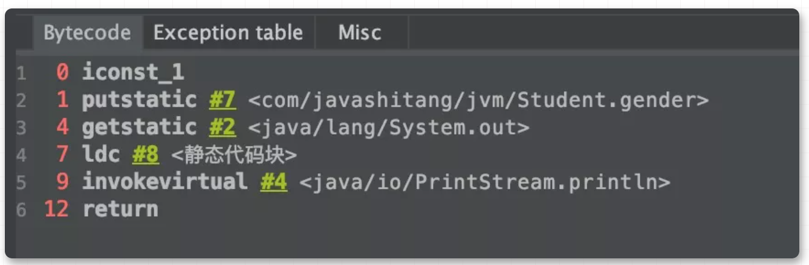

## 一、类加载的过程

### 加载

当我们要使用一个类的时候，要通过ClassLoader将类加载到内存中

**「类加载阶段主要完成如下三件事情」**

1. 通过全类名，获取类的二进制流
2. 解析类的二进制流为方法区内的数据结构
3. 创建一个java.lang.Class类的实例，表示该类型，作为方法区这个类的访问入口


**「通过全类名，获取类的二进制流的方式有很多种」**

1. 从zip压缩包中获取
2. 从网络中获取
3. 运行时计算生成，如动态代理技术
4. ...

**「对于非数组类型的加载阶段，即可以使用Java虚拟机内置的类加载器去完成，也可以使用用户自定义的类加载器去完成」**

### 链接

**「链接这个阶段主要分为3个部分，验证，准备，解析」**

#### 验证

**「验证阶段主要是确保Class文件的格式正确，运行时不会危害虚拟机的安全」**

验证阶段的规则很多，但大致分为如下4个阶段


**「具体详细的内容，我就不详细解释了，可以看《深入理解Java虚拟机》，本篇文章偏向于做一个总结，把握类加载的一个整体流程，而不对细节进行阐述」**

#### 准备

**「准备阶段主要是为类的静态变量分配内存，并将其初始化为默认值」**

常见的数据类型的默认值如下


**「如果类静态变量的字段属性表中存在ConstantValue属性，则直接执行赋值语句」**

那么什么情况下类静态变量的字段属性表中存在ConstantValue属性呢？

1. 类静态变量为基本数据类型，并且被final修饰
2. 类静态变量为String类型，被final修饰，并且以字面量的形式赋值

为了方便查看Class文件的字节码，我在IDEA中下载了一个插件jclasslib Bytecode viewer，非常方便。用如下代码通过字节码的形式验证一下

```java
public class Person {
    private static int age = 10;
    private static final int length = 160;
    private static final String name = "name";
    private static final String loc = new String("loc");
}
```


**「所以length和name属性在准备阶段就会赋值为ConstantValue指定的值」**

**「那么age和loc属性会在哪个阶段赋值呢？是在初始化阶段，后面会详细介绍哈」**


#### 解析

**「将类，接口，字段和方法的符号引用（在常量池中）转为直接引用」**符号引用：用一组符号来描述所引用的目标 直接引用；直接指向指向目标的指针

加入我写了一个如下的类


以字段为例，name和age对应的对象并不是直接指向内存地址，而是用字符串来进行描述（即符号引用）。解析阶段就是将这些描述转为直接指向目标的指针（即直接引用）

### 初始化

**「执行类静态成员变量赋值语句和静态代码块中的语句」**


我们把上面的Student代码改成如下形式

```java
public class Student {

    private String name;
    private int age = 10;
    private static int gender = 1;

    {
        System.out.println("构造代码块");
    }

    static {
        System.out.println("静态代码块");
    }

    public Student() {
        System.out.println("构造函数");
    }

    public String getName() {
        return this.name;
    }
}
```

可以看到字节码中包含了3个方法，getName方法我们知道，<init>和<clinit>方法里面执行了哪些逻辑？


从字节码的角度分析一波

**「<init>方法」**


从字节码可以看到<init>方法的主要逻辑为

1. 调用父类的<init>方法
2. 非静态成员变量赋值
3. 执行构造代码块
4. 执行构造函数


**「<clinit>方法」**



从字节码可以看到<clinit>方法的主要逻辑为

1. 执行静态变量的赋值语句
2. 执行静态代码块中的语句
3. 需要注意的一点是，**「Java虚拟机会保证子类的<client>方法执行前，父类的<client>方法已经执行完毕」**

**「理解<clinit>和<init>方法的作用还是很有必要的，因为经常有些面试题问静态代码块，构造代码块，构造函数的执行顺序。」**

我这里就直接总结一下结论，大家可以写demo验证一下

**「没有继承情况的执行顺序」**

1. 静态代码块和静态成员变量，执行顺序由编写顺序决定（只会执行一次哈）
2. 构造代码块和非静态成员变量，执行顺序由编写顺序决定
3. 构造函数

**「有继承情况的执行顺序」**

1. 父类的静态（静态代码块，静态成员变量），子类的静态（静态代码块，静态成员变量）（只会执行一次哈）
2. 父类的非静态（构造代码块，非静态成员变量），父类的构造函数
3. 子类的非静态（构造代码块，非静态成员变量），子类的构造函数

### 卸载

垃圾收集不仅发生在堆中，方法区上也会发生。但是对方法区的类型数据回收的条件比较苛刻


以下图为例，想回收方法区中的Simple类

1. 需要保证堆中的Sample类及其子类都已经被回收
2. 加载Sample类的MyClassLoader已经被回收
3. Sample类对应的Class对象已经被回收


可以看到对方法区的类型数据回收的条件比较苛刻，但是收效甚微，所以有些垃圾收集器不会对方法区的类型数据进行回收

###  总结

类加载过程


变量的赋值过程


## 二、常用jdk工具


jps（JVM Process Status Tool）:显示指定系统内所有的虚拟机进进程；

jstat(JVM Statistics Monitoring Tool):用于收集虚拟机各方面的运行数据

jinfo(Configuration info forjave):显示虚拟机配置信息；

jmap(Memory Map for java):生成虚拟机的内存转储快照（heapdump文件）；

jstack(Stack Trace forjava):显示虚拟机的线程快照；

jhat(JVM Heap Dump Browser)：用于分析heapdump文件，它会建立一个HTTP/HTML服务器，让用户可以在浏览器上查看分析结果。


## 三、常见面试题


### 1、运行时数据区是什么？

虚拟机在执行 Java 程序的过程中会把它所管理的内存划分为若干不同的数据区，这些区域有各自的用途、创建和销毁时间。

线程私有：程序计数器、Java 虚拟机栈、本地方法栈。

线程共享：Java 堆、方法区。

### 2、程序计数器是什么？

**程序计数器**是一块较小的内存空间，可以看作当前线程所执行字节码的行号指示器。字节码解释器工作时通过改变计数器的值选取下一条执行指令。分支、循环、跳转、线程恢复等功能都需要依赖计数器完成。是唯一在虚拟机规范中没有规定内存溢出情况的区域。

如果线程正在执行 Java 方法，计数器记录正在执行的虚拟机字节码指令地址。如果是本地方法，计数器值为 Undefined。

### 3、Java 虚拟机栈的作用？

**Java 虚拟机栈**来描述 Java 方法的内存模型。每当有新线程创建时就会分配一个栈空间，线程结束后栈空间被回收，栈与线程拥有相同的生命周期。栈中元素用于支持虚拟机进行方法调用，每个方法在执行时都会创建一个栈帧存储方法的局部变量表、操作栈、动态链接和方法出口等信息。每个方法从调用到执行完成，就是栈帧从入栈到出栈的过程。

有两类异常：① 线程请求的栈深度大于虚拟机允许的深度抛出 StackOverflowError。② 如果 JVM 栈容量可以动态扩展，栈扩展无法申请足够内存抛出 OutOfMemoryError（HotSpot 不可动态扩展，不存在此问题）。

### 4、本地方法栈的作用？

**本地方法栈**与虚拟机栈作用相似，不同的是虚拟机栈为虚拟机执行 Java 方法服务，本地方法栈为虚本地方法服务。调用本地方法时虚拟机栈保持不变，动态链接并直接调用指定本地方法。

虚拟机规范对本地方法栈中方法的语言与数据结构无强制规定，虚拟机可自由实现，例如 HotSpot 将虚拟机栈和本地方法栈合二为一。

本地方法栈在栈深度异常和栈扩展失败时分别抛出 StackOverflowError 和 OutOfMemoryError。

### 5、堆的作用是什么？

**堆**是虚拟机所管理的内存中最大的一块，被所有线程共享的，在虚拟机启动时创建。堆用来存放对象实例，Java 里几乎所有对象实例都在堆分配内存。堆可以处于物理上不连续的内存空间，逻辑上应该连续，但对于例如数组这样的大对象，多数虚拟机实现出于简单、存储高效的考虑会要求连续的内存空间。

堆既可以被实现成固定大小，也可以是可扩展的，可通过 `-Xms` 和 `-Xmx` 设置堆的最小和最大容量，当前主流 JVM 都按照可扩展实现。如果堆没有内存完成实例分配也无法扩展，抛出 OutOfMemoryError。

### 6、方法区的作用是什么？

**方法区**用于存储被虚拟机加载的类型信息、常量、静态变量、即时编译器编译后的代码缓存等数据。

JDK8 之前使用永久代实现方法区，容易内存溢出，因为永久代有 `-XX:MaxPermSize` 上限，即使不设置也有默认大小。JDK7 把放在永久代的字符串常量池、静态变量等移出，JDK8 中永久代完全废弃，改用在本地内存中实现的元空间代替，把 JDK 7 中永久代剩余内容（主要是类型信息）全部移到元空间。

虚拟机规范对方法区的约束宽松，除和堆一样不需要连续内存和可选择固定大小/可扩展外，还可以不实现垃圾回收。垃圾回收在方法区出现较少，主要目标针对常量池和类型卸载。如果方法区无法满足新的内存分配需求，将抛出 OutOfMemoryError。

### 7、运行时常量池的作用是什么?

运行时常量池是方法区的一部分，Class 文件中除了有类的版本、字段、方法、接口等描述信息外，还有一项信息是常量池表，用于存放编译器生成的各种字面量与符号引用，这部分内容在类加载后存放到运行时常量池。一般除了保存 Class 文件中描述的符号引用外，还会把符号引用翻译的直接引用也存储在运行时常量池。

运行时常量池相对于 Class 文件常量池的一个重要特征是动态性，Java 不要求常量只有编译期才能产生，运行期间也可以将新的常量放入池中，这种特性利用较多的是 String 的 `intern` 方法。

运行时常量池是方法区的一部分，受到方法区内存的限制，当常量池无法再申请到内存时会抛出 OutOfMemoryError。

### 8、直接内存是什么？

直接内存不属于运行时数据区，也不是虚拟机规范定义的内存区域，但这部分内存被频繁使用，而且可能导致内存溢出。

JDK1.4 中新加入了 NIO 这种基于通道与缓冲区的 IO，它可以使用 Native 函数库直接分配堆外内存，通过一个堆里的 DirectByteBuffer 对象作为内存的引用进行操作，避免了在 Java 堆和 Native堆来回复制数据。

直接内存的分配不受 Java 堆大小的限制，但还是会受到本机总内存及处理器寻址空间限制，一般配置虚拟机参数时会根据实际内存设置 `-Xmx` 等参数信息，但经常忽略直接内存，使内存区域总和大于物理内存限制，导致动态扩展时出现 OOM。

由直接内存导致的内存溢出，一个明显的特征是在 Heap Dump 文件中不会看见明显的异常，如果发现内存溢出后产生的 Dump 文件很小，而程序中又直接或间接使用了直接内存（典型的间接使用就是 NIO），那么就可以考虑检查直接内存方面的原因。

### 9、内存溢出和内存泄漏的区别？

内存溢出 OutOfMemory，指程序在申请内存时，没有足够的内存空间供其使用。

内存泄露 Memory Leak，指程序在申请内存后，无法释放已申请的内存空间，内存泄漏最终将导致内存溢出。

### 10、堆溢出的原因？

堆用于存储对象实例，只要不断创建对象并保证 GC Roots 到对象有可达路径避免垃圾回收，随着对象数量的增加，总容量触及最大堆容量后就会 OOM，例如在 while 死循环中一直 new 创建实例。

堆 OOM 是实际应用中最常见的 OOM，处理方法是通过内存映像分析工具对 Dump 出的堆转储快照分析，确认内存中导致 OOM 的对象是否必要，分清到底是内存泄漏还是内存溢出。

如果是内存泄漏，通过工具查看泄漏对象到 GC Roots 的引用链，找到泄露对象是通过怎样的引用路径、与哪些 GC Roots 关联才导致无法回收，一般可以准确定位到产生内存泄漏代码的具位置置。

如果不是内存泄漏，即内存中对象都必须存活，应当检查 JVM 堆参数，与机器内存相比是否还有向上调整的空间。再从代码检查是否存在某些对象生命周期过长、持有状态时间过长、存储结构设计不合理等情况，尽量减少程序运行期的内存消耗。

### 11、栈溢出的原因？

由于 HotSpot 不区分虚拟机和本地方法栈，设置本地方法栈大小的参数没有意义，栈容量只能由 `-Xss` 参数来设定，存在两种异常：

**StackOverflowError：** 如果线程请求的栈深度大于虚拟机所允许的深度，将抛出 StackOverflowError，例如一个递归方法不断调用自己。该异常有明确错误堆栈可供分析，容易定位到问题所在。

**OutOfMemoryError：** 如果 JVM 栈可以动态扩展，当扩展无法申请到足够内存时会抛出 OutOfMemoryError。HotSpot 不支持虚拟机栈扩展，所以除非在创建线程申请内存时就因无法获得足够内存而出现 OOM，否则在线程运行时是不会因为扩展而导致溢出的。

### 12、运行时常量池溢出的原因？

String 的 `intern` 方法是一个本地方法，作用是如果字符串常量池中已包含一个等于此 String 对象的字符串，则返回池中这个字符串的 String 对象的引用，否则将此 String 对象包含的字符串添加到常量池并返回此 String 对象的引用。

在 JDK6 及之前常量池分配在永久代，因此可以通过 `-XX:PermSize` 和 `-XX:MaxPermSize` 限制永久代大小，间接限制常量池。在 while 死循环中调用 `intern` 方法导致运行时常量池溢出。在 JDK7 后不会出现该问题，因为存放在永久代的字符串常量池已经被移至堆中。

### 13、方法区溢出的原因？

方法区主要存放类型信息，如类名、访问修饰符、常量池、字段描述、方法描述等。只要不断在运行时产生大量类，方法区就会溢出。例如使用 JDK 反射或 CGLib 直接操作字节码在运行时生成大量的类。很多框架如 Spring、Hibernate 等对类增强时都会使用 CGLib 这类字节码技术，增强的类越多就需要越大的方法区保证动态生成的新类型可以载入内存，也就更容易导致方法区溢出。

JDK8 使用元空间取代永久代，HotSpot 提供了一些参数作为元空间防御措施，例如 `-XX:MetaspaceSize` 指定元空间初始大小，达到该值会触发 GC 进行类型卸载，同时收集器会对该值进行调整，如果释放大量空间就适当降低该值，如果释放很少空间就适当提高。

### 14、创建对象的过程是什么？

**字节码角度**

- **NEW：** 如果找不到 Class 对象则进行类加载。加载成功后在堆中分配内存，从 Object 到本类路径上的所有属性都要分配。分配完毕后进行零值设置。最后将指向实例对象的引用变量压入虚拟机栈顶。
- **DUP：** 在栈顶复制引用变量，这时栈顶有两个指向堆内实例的引用变量。两个引用变量的目的不同，栈底的引用用于赋值或保存局部变量表，栈顶的引用作为句柄调用相关方法。
- **INVOKESPECIAL：** 通过栈顶的引用变量调用 init 方法。

**执行角度**

① 当 JVM 遇到字节码 new 指令时，首先将检查该指令的参数能否在常量池中定位到一个类的符号引用，并检查引用代表的类是否已被加载、解析和初始化，如果没有就先执行类加载。

② 在类加载检查通过后虚拟机将为新生对象分配内存。

③ 内存分配完成后虚拟机将成员变量设为零值，保证对象的实例字段可以不赋初值就使用。

④ 设置对象头，包括哈希码、GC 信息、锁信息、对象所属类的类元信息等。

⑤ 执行 init 方法，初始化成员变量，执行实例化代码块，调用类的构造方法，并把堆内对象的首地址赋值给引用变量。

### 15、对象分配内存的方式有哪些？

对象所需内存大小在类加载完成后便可完全确定，分配空间的任务实际上等于把一块确定大小的内存块从 Java 堆中划分出来。

**指针碰撞：** 假设 Java 堆内存规整，被使用过的内存放在一边，空闲的放在另一边，中间放着一个指针作为分界指示器，分配内存就是把指针向空闲方向挪动一段与对象大小相等的距离。

**空闲列表：** 如果 Java 堆内存不规整，虚拟机必须维护一个列表记录哪些内存可用，在分配时从列表中找到一块足够大的空间划分给对象并更新列表记录。

选择哪种分配方式由堆是否规整决定，堆是否规整由垃圾收集器是否有空间压缩能力决定。使用 Serial、ParNew 等收集器时，系统采用指针碰撞；使用 CMS 这种基于清除算法的垃圾收集器时，采用空间列表。

### 16、对象分配内存是否线程安全？

对象创建十分频繁，即使修改一个指针的位置在并发下也不是线程安全的，可能正给对象 A 分配内存，指针还没来得及修改，对象 B 又使用了指针来分配内存。

解决方法：① CAS 加失败重试保证更新原子性。② 把内存分配按线程划分在不同空间，即每个线程在 Java 堆中预先分配一小块内存，叫做本地线程分配缓冲 TLAB，哪个线程要分配内存就在对应的 TLAB 分配，TLAB 用完了再进行同步。

### 17、对象的内存布局了解吗？

对象在堆内存的存储布局可分为对象头、实例数据和对齐填充。

**对象头**占 12B，包括对象标记和类型指针。对象标记存储对象自身的运行时数据，如哈希码、GC 分代年龄、锁标志、偏向线程 ID 等，这部分占 8B，称为 Mark Word。Mark Word 被设计为动态数据结构，以便在极小的空间存储更多数据，根据对象状态复用存储空间。

类型指针是对象指向它的类型元数据的指针，占 4B。JVM 通过该指针来确定对象是哪个类的实例。

**实例数据**是对象真正存储的有效信息，即本类对象的实例成员变量和所有可见的父类成员变量。存储顺序会受到虚拟机分配策略参数和字段在源码中定义顺序的影响。相同宽度的字段总是被分配到一起存放，在满足该前提条件的情况下父类中定义的变量会出现在子类之前。

**对齐填充**不是必然存在的，仅起占位符作用。虚拟机的自动内存管理系统要求任何对象的大小必须是 8B 的倍数，对象头已被设为 8B 的 1 或 2 倍，如果对象实例数据部分没有对齐，需要对齐填充补全。

### 18、对象的访问方式有哪些？

Java 程序会通过栈上的 reference 引用操作堆对象，访问方式由虚拟机决定，主流访问方式主要有句柄和直接指针。

**句柄：** 堆会划分出一块内存作为句柄池，reference 中存储对象的句柄地址，句柄包含对象实例数据与类型数据的地址信息。优点是 reference 中存储的是稳定句柄地址，在 GC 过程中对象被移动时只会改变句柄的实例数据指针，而 reference 本身不需要修改。

**直接指针：** 堆中对象的内存布局就必须考虑如何放置访问类型数据的相关信息，reference 存储对象地址，如果只是访问对象本身就不需要多一次间接访问的开销。优点是速度更快，节省了一次指针定位的时间开销，HotSpot 主要使用直接指针进行对象访问。

### 19、如何判断对象是否是垃圾？

**引用计数：**在对象中添加一个引用计数器，如果被引用计数器加 1，引用失效时计数器减 1，如果计数器为 0 则被标记为垃圾。原理简单，效率高，但是在 Java 中很少使用，因为存在对象间循环引用的问题，导致计数器无法清零。

**可达性分析：**主流语言的内存管理都使用可达性分析判断对象是否存活。基本思路是通过一系列称为 GC Roots 的根对象作为起始节点集，从这些节点开始，根据引用关系向下搜索，搜索过程走过的路径称为引用链，如果某个对象到 GC Roots 没有任何引用链相连，则会被标记为垃圾。可作为 GC Roots 的对象包括虚拟机栈和本地方法栈中引用的对象、类静态属性引用的对象、常量引用的对象。

### 20、Java 的引用有哪些类型？

JDK1.2 后对引用进行了扩充，按强度分为四种：

**强引用：** 最常见的引用，例如 `Object obj = new Object()` 就属于强引用。只要对象有强引用指向且 GC Roots 可达，在内存回收时即使濒临内存耗尽也不会被回收。

**软引用：** 弱于强引用，描述非必需对象。在系统将发生内存溢出前，会把软引用关联的对象加入回收范围以获得更多内存空间。用来缓存服务器中间计算结果及不需要实时保存的用户行为等。

**弱引用：** 弱于软引用，描述非必需对象。弱引用关联的对象只能生存到下次 YGC 前，当垃圾收集器开始工作时无论当前内存是否足够都会回收只被弱引用关联的对象。由于 YGC 具有不确定性，因此弱引用何时被回收也不确定。

**虚引用：** 最弱的引用，定义完成后无法通过该引用获取对象。唯一目的就是为了能在对象被回收时收到一个系统通知。虚引用必须与引用队列联合使用，垃圾回收时如果出现虚引用，就会在回收对象前把这个虚引用加入引用队列。

### 21、有哪些 GC 算法？

**标记-清除算法**

分为标记和清除阶段，首先从每个 GC Roots 出发依次标记有引用关系的对象，最后清除没有标记的对象。

执行效率不稳定，如果堆包含大量对象且大部分需要回收，必须进行大量标记清除，导致效率随对象数量增长而降低。

存在内存空间碎片化问题，会产生大量不连续的内存碎片，导致以后需要分配大对象时容易触发 Full GC。

**标记-复制算法**

为了解决内存碎片问题，将可用内存按容量划分为大小相等的两块，每次只使用其中一块。当使用的这块空间用完了，就将存活对象复制到另一块，再把已使用过的内存空间一次清理掉。主要用于进行新生代。

实现简单、运行高效，解决了内存碎片问题。 代价是可用内存缩小为原来的一半，浪费空间。

HotSpot 把新生代划分为一块较大的 Eden 和两块较小的 Survivor，每次分配内存只使用 Eden 和其中一块 Survivor。垃圾收集时将 Eden 和 Survivor 中仍然存活的对象一次性复制到另一块 Survivor 上，然后直接清理掉 Eden 和已用过的那块 Survivor。HotSpot 默认Eden 和 Survivor 的大小比例是 8:1，即每次新生代中可用空间为整个新生代的 90%。

**标记-整理算法**

标记-复制[算法](https://www.cxyxiaowu.com/suanfa-2)在对象存活率高时要进行较多复制操作，效率低。如果不想浪费空间，就需要有额外空间分配担保，应对被使用内存中所有对象都存活的极端情况，所以老年代一般不使用此[算法](https://www.cxyxiaowu.com/suanfa-2)。

老年代使用标记-整理[算法](https://www.cxyxiaowu.com/suanfa-2)，标记过程与标记-清除[算法](https://www.cxyxiaowu.com/suanfa-2)一样，但不直接清理可回收对象，而是让所有存活对象都向内存空间一端移动，然后清理掉边界以外的内存。

标记-清除与标记-整理的差异在于前者是一种非移动式[算法](https://www.cxyxiaowu.com/suanfa-2)而后者是移动式的。如果移动存活对象，尤其是在老年代这种每次回收都有大量对象存活的区域，是一种极为负重的操作，而且移动必须全程暂停用户线程。如果不移动对象就会导致空间碎片问题，只能依赖更复杂的内存分配器和访问器解决。

### 22、你知道哪些垃圾收集器？

**Serial**

最基础的收集器，使用复制[算法](https://www.cxyxiaowu.com/suanfa-2)、单线程工作，只用一个处理器或一条线程完成垃圾收集，进行垃圾收集时必须暂停其他所有工作线程。

Serial 是虚拟机在客户端模式的默认新生代收集器，简单高效，对于内存受限的环境它是所有收集器中额外内存消耗最小的，对于处理器核心较少的环境，Serial 由于没有线程交互开销，可获得最高的单线程收集效率。

**ParNew**

Serial 的多线程版本，除了使用多线程进行垃圾收集外其余行为完全一致。

ParNew 是虚拟机在服务端模式的默认新生代收集器，一个重要原因是除了 Serial 外只有它能与 CMS 配合。自从 JDK 9 开始，ParNew 加 CMS 不再是官方推荐的解决方案，官方希望它被 G1 取代。

**Parallel Scavenge**

新生代收集器，基于复制[算法](https://www.cxyxiaowu.com/suanfa-2)，是可并行的多线程收集器，与 ParNew 类似。

特点是它的关注点与其他收集器不同，Parallel Scavenge 的目标是达到一个可控制的吞吐量，吞吐量就是处理器用于运行用户代码的时间与处理器消耗总时间的比值。

**Serial Old**

Serial 的老年代版本，单线程工作，使用标记-整理[算法](https://www.cxyxiaowu.com/suanfa-2)。

Serial Old 是虚拟机在客户端模式的默认老年代收集器，用于服务端有两种用途：① JDK5 及之前与 Parallel Scavenge 搭配。② 作为CMS 失败预案。

**Parellel Old**

Parallel Scavenge 的老年代版本，支持多线程，基于标记-整理[算法](https://www.cxyxiaowu.com/suanfa-2)。JDK6 提供，注重吞吐量可考虑 Parallel Scavenge 加 Parallel Old。

**CMS**

以获取最短回收停顿时间为目标，基于标记-清除[算法](https://www.cxyxiaowu.com/suanfa-2)，过程相对复杂，分为四个步骤：初始标记、并发标记、重新标记、并发清除。

初始标记和重新标记需要 STW（Stop The World，系统停顿），初始标记仅是标记 GC Roots 能直接关联的对象，速度很快。并发标记从 GC Roots 的直接关联对象开始遍历整个对象图，耗时较长但不需要停顿用户线程。重新标记则是为了修正并发标记期间因用户程序运作而导致标记产生变动的那部分记录。并发清除清理标记阶段判断的已死亡对象，不需要移动存活对象，该阶段也可与用户线程并发。

缺点：① 对处理器资源敏感，并发阶段虽然不会导致用户线程暂停，但会降低吞吐量。② 无法处理浮动垃圾，有可能出现并发失败而导致 Full GC。③ 基于标记-清除[算法](https://www.cxyxiaowu.com/suanfa-2)，产生空间碎片。

**G1**

开创了收集器面向局部收集的设计思路和基于 Region 的内存布局，主要面向服务端，最初设计目标是替换 CMS。

G1 之前的收集器，垃圾收集目标要么是整个新生代，要么是整个老年代或整个堆。而 G1 可面向堆任何部分来组成回收集进行回收，衡量标准不再是分代，**而是哪块内存中存放的垃圾数量最多，回收受益最大。**

跟踪各 Region 里垃圾的价值，价值即回收所获空间大小以及回收所需时间的经验值，在后台维护一个优先级列表，每次根据用户设定允许的收集停顿时间优先处理回收价值最大的 Region。这种方式保证了 G1 在有限时间内获取尽可能高的收集效率。

G1 运作过程：

- **初始标记：**标记 GC Roots 能直接关联到的对象，让下一阶段用户线程并发运行时能正确地在可用 Region 中分配新对象。需要 STW 但耗时很短，在 Minor GC 时同步完成。
- **并发标记：**从 GC Roots 开始对堆中对象进行可达性分析，递归扫描整个堆的对象图。耗时长但可与用户线程并发，扫描完成后要重新处理 SATB 记录的在并发时有变动的对象。
- **最终标记：**对用户线程做短暂暂停，处理并发阶段结束后仍遗留下来的少量 SATB 记录。
- **筛选回收：**对各 Region 的回收价值[排序]()，根据用户期望停顿时间制定回收计划。必须暂停用户线程，由多条收集线程并行完成。

可由用户指定期望停顿时间是 G1 的一个强大功能，但该值不能设得太低，一般设置为100~300 ms。

### 23、ZGC 了解吗？

JDK11 中加入的具有实验性质的低延迟垃圾收集器，目标是尽可能在不影响吞吐量的前提下，实现在任意堆内存大小都可以把停顿时间限制在 10ms 以内的低延迟。

基于 Region 内存布局，不设分代，使用了读屏障、染色指针和内存多重映射等技术实现可并发的标记-整理，以低延迟为首要目标。

ZGC 的 Region 具有动态性，是动态创建和销毁的，并且容量大小也是动态变化的。

### 24、你知道哪些内存分配与回收策略？

**对象优先在 Eden 区分配**

大多数情况下对象在新生代 Eden 区分配，当 Eden 没有足够空间时将发起一次 Minor GC。

**大对象直接进入老年代**

大对象指需要大量连续内存空间的对象，典型是很长的字符串或数量庞大的数组。大对象容易导致内存还有不少空间就提前触发垃圾收集以获得足够的连续空间。

HotSpot 提供了 `-XX:PretenureSizeThreshold` 参数，大于该值的对象直接在老年代分配，避免在 Eden 和 Survivor 间来回复制。

**长期存活对象进入老年代**

虚拟机给每个对象定义了一个对象年龄计数器，存储在对象头。如果经历过第一次 Minor GC 仍然存活且能被 Survivor 容纳，该对象就会被移动到 Survivor 中并将年龄设置为 1。对象在 Survivor 中每熬过一次 Minor GC 年龄就加 1 ，当增加到一定程度（默认15）就会被晋升到老年代。对象晋升老年代的阈值可通过 `-XX:MaxTenuringThreshold` 设置。

**动态对象年龄判定**

为了适应不同内存状况，虚拟机不要求对象年龄达到阈值才能晋升老年代，如果在 Survivor 中相同年龄所有对象大小的总和大于 Survivor 的一半，年龄不小于该年龄的对象就可以直接进入老年代。

**空间分配担保**

MinorGC 前虚拟机必须检查老年代最大可用连续空间是否大于新生代对象总空间，如果满足则说明这次 Minor GC 确定安全。

如果不满足，虚拟机会查看 `-XX:HandlePromotionFailure` 参数是否允许担保失败，如果允许会继续检查老年代最大可用连续空间是否大于历次晋升老年代对象的平均大小，如果满足将冒险尝试一次 Minor GC，否则改成一次 FullGC。

冒险是因为新生代使用复制[算法](https://www.cxyxiaowu.com/suanfa-2)，为了内存利用率只使用一个 Survivor，大量对象在 Minor GC 后仍然存活时，需要老年代进行分配担保，接收 Survivor 无法容纳的对象。

### 25、你知道哪些故障处理工具？

**jps：虚拟机进程状况工具**

功能和 ps 命令类似：可以列出正在运行的虚拟机进程，显示虚拟机执行主类名称以及这些进程的本地虚拟机唯一 ID（LVMID)。LVMID 与操作系统的进程 ID（PID）一致，使用 Windows 的任务管理器或 UNIX 的 ps 命令也可以查询到虚拟机进程的 LVMID，但如果同时启动了多个虚拟机进程，必须依赖 jps 命令。

**jstat：虚拟机统计信息监视工具**

用于监视虚拟机各种运行状态信息。可以显示本地或远程虚拟机进程中的类加载、内存、垃圾收集、即时编译器等运行时数据，在没有 GUI 界面的服务器上是运行期定位虚拟机性能问题的常用工具。

参数含义：S0 和 S1 表示两个 Survivor，E 表示新生代，O 表示老年代，YGC 表示 Young GC 次数，YGCT 表示 Young GC 耗时，FGC 表示 Full GC 次数，FGCT 表示 Full GC 耗时，GCT 表示 GC 总耗时。

**jinfo：Java 配置信息工具**

实时查看和调整虚拟机各项参数，使用 jps 的 -v 参数可以查看虚拟机启动时显式指定的参数，但如果想知道未显式指定的参数值只能使用 jinfo 的 -flag 查询。

**jmap：Java 内存映像工具**

用于生成堆转储快照，还可以查询 finalize 执行队列、Java 堆和方法区的详细信息，如空间使用率，当前使用的是哪种收集器等。和 jinfo 一样，部分功能在 Windows 受限，除了生成堆转储快照的 -dump 和查看每个类实例的 -histo 外，其余选项只能在 Linux 使用。

**jhat：虚拟机堆转储快照分析工具**

JDK 提供 jhat 与 jmap 搭配使用分析 jmap 生成的堆转储快照。jhat 内置了一个微型的 HTTP/Web 服务器，生成堆转储快照的分析结果后可以在浏览器查看。

**jstack：Java 堆栈跟踪工具**

用于生成虚拟机当前时刻的线程快照。线程快照就是当前虚拟机内每一条线程正在执行的方法堆栈的集合，生成线程快照的目的通常是定位线程出现长时间停顿的原因，如线程间死锁、死循环、请求外部资源导致的长时间挂起等。线程出现停顿时通过 jstack 查看各个线程的调用堆栈，可以获知没有响应的线程在后台做什么或等什么资源。

### 26、Java 程序是怎样运行的？

- 首先通过 Javac 编译器将 `.java` 转为 JVM 可加载的 `.class` 字节码文件。

  Javac 是由 Java 编写的程序，编译过程可以分为： ① 词法解析，通过空格分割出单词、操作符、控制符等信息，形成 token 信息流，传递给语法解析器。② 语法解析，把 token 信息流按照 Java 语法规则组装成语法树。③ 语义分析，检查关键字使用是否合理、类型是否匹配、作用域是否正确等。④ 字节码生成，将前面各个步骤的信息转换为字节码。

  字节码必须通过类加载过程加载到 JVM 后才可以执行，执行有三种模式，解释执行、JIT 编译执行、JIT 编译与解释器混合执行（主流 JVM 默认执行的方式）。混合模式的优势在于解释器在启动时先解释执行，省去编译时间。

- 之后通过即时编译器 JIT 把字节码文件编译成本地机器码。

  Java 程序最初都是通过解释器进行解释执行的，当虚拟机发现某个方法或代码块的运行特别频繁，就会认定其为"热点代码"，热点代码的检测主要有基于采样和基于计数器两种方式，为了提高热点代码的执行效率，虚拟机会把它们编译成本地机器码，尽可能对代码优化，在运行时完成这个任务的后端编译器被称为即时编译器。

- 还可以通过静态的提前编译器 AOT 直接把程序编译成与目标机器指令集相关的二进制代码。

### 27、类加载是什么？

Class 文件中描述的各类信息都需要加载到虚拟机后才能使用。JVM 把描述类的数据从 Class 文件加载到内存，并对数据进行校验、解析和初始化，最终形成可以被虚拟机直接使用的 Java 类型，这个过程称为虚拟机的类加载机制。

与编译时需要连接的语言不同，Java 中类型的加载、连接和初始化都是在运行期间完成的，这增加了性能开销，但却提供了极高的扩展性，Java 动态扩展的语言特性就是依赖运行期动态加载和连接实现的。

一个类型从被加载到虚拟机内存开始，到卸载出内存为止，整个生命周期经历加载、验证、准备、解析、初始化、使用和卸载七个阶段，其中验证、解析和初始化三个部分称为连接。加载、验证、准备、初始化阶段的顺序是确定的，解析则不一定：可能在初始化之后再开始，这是为了支持 Java 的动态绑定。

### 28、类初始化的情况有哪些？

① 遇到 `new`、`getstatic`、`putstatic` 或 `invokestatic` 字节码指令时，还未初始化。典型场景包括 new 实例化对象、读取或设置静态字段、调用静态方法。

② 对类反射调用时，还未初始化。

③ 初始化类时，父类还未初始化。

④ 虚拟机启动时，会先初始化包含 main 方法的主类。

⑤ 使用 JDK7 的动态语言支持时，如果 MethodHandle 实例的解析结果为指定类型的方法句柄且句柄对应的类还未初始化。

⑥ 接口定义了默认方法，如果接口的实现类初始化，接口要在其之前初始化。

其余所有引用类型的方式都不会触发初始化，称为被动引用。被动引用实例：① 子类使用父类的静态字段时，只有父类被初始化。② 通过数组定义使用类。③ 常量在编译期会存入调用类的常量池，不会初始化定义常量的类。

接口和类加载过程的区别：初始化类时如果父类没有初始化需要初始化父类，但接口初始化时不要求父接口初始化，只有在真正使用父接口时（如引用接口中定义的常量）才会初始化。

### 29、类加载的过程是什么？

**加载**

该阶段虚拟机需要完成三件事：① 通过一个类的全限定类名获取定义类的二进制字节流。② 将字节流所代表的静态存储结构转化为方法区的运行时数据区。③ 在内存中生成对应该类的 Class 实例，作为方法区这个类的数据访问入口。

**验证**

确保 Class 文件的字节流符合约束。如果虚拟机不检查输入的字节流，可能因为载入有错误或恶意企图的字节流而导致系统受攻击。验证主要包含四个阶段：文件格式验证、元数据验证、字节码验证、符号引用验证。

验证重要但非必需，因为只有通过与否的区别，通过后对程序运行期没有任何影响。如果代码已被反复使用和验证过，在生产环境就可以考虑关闭大部分验证缩短类加载时间。

**准备**

为类静态变量分配内存并设置零值，该阶段进行的内存分配仅包括类变量，不包括实例变量。如果变量被 final 修饰，编译时 Javac 会为变量生成 ConstantValue 属性，准备阶段虚拟机会将变量值设为代码值。

**解析**

将常量池内的符号引用替换为直接引用。

**符号引用**以一组符号描述引用目标，可以是任何形式的字面量，只要使用时能无歧义地定位目标即可。与虚拟机内存布局无关，引用目标不一定已经加载到虚拟机内存。

**直接引用**是可以直接指向目标的指针、相对偏移量或能间接定位到目标的句柄。和虚拟机的内存布局相关，引用目标必须已在虚拟机的内存中存在。

**初始化**

直到该阶段 JVM 才开始执行类中编写的代码。准备阶段时变量赋过零值，初始化阶段会根据程序员的编码去初始化类变量和其他资源。初始化阶段就是执行类构造方法中的 `<client>` 方法，该方法是 Javac 自动生成的。

### 30、有哪些类加载器？

自 JDK1.2 起 Java 一直保持三层类加载器：

- **启动类加载器**

  在 JVM 启动时创建，负责加载最核心的类，例如 Object、System 等。无法被程序直接引用，如果需要把加载委派给启动类加载器，直接使用 null 代替即可，因为启动类加载器通常由操作系统实现，并不存在于 JVM 体系。

- **平台类加载器**

  从 JDK9 开始从扩展类加载器更换为平台类加载器，负载加载一些扩展的系统类，比如 XML、加密、压缩相关的功能类等。

- **应用类加载器**

  也称系统类加载器，负责加载用户类路径上的类库，可以直接在代码中使用。如果没有自定义类加载器，一般情况下应用类加载器就是默认的类加载器。自定义类加载器通过继承 ClassLoader 并重写 `findClass` 方法实现。


### 31、双亲委派模型是什么？

类加载器具有等级制度但非继承关系，以组合的方式复用父加载器的功能。双亲委派模型要求除了顶层的启动类加载器外，其余类加载器都应该有自己的父加载器。

一个类加载器收到了类加载请求，它不会自己去尝试加载，而将该请求委派给父加载器，每层的类加载器都是如此，因此所有加载请求最终都应该传送到启动类加载器，只有当父加载器反馈无法完成请求时，子加载器才会尝试。

类跟随它的加载器一起具备了有优先级的层次关系，确保某个类在各个类加载器环境中都是同一个，保证程序的稳定性。

### 32、如何判断两个类是否相等？

任意一个类都必须由类加载器和这个类本身共同确立其在虚拟机中的唯一性。

两个类只有由同一类加载器加载才有比较意义，否则即使两个类来源于同一个 Class 文件，被同一个 JVM 加载，只要类加载器不同，这两个类就必定不相等。


### 33、说一下 JVM 的主要组成部分及其作用？


JVM包含两个子系统和两个组件，两个子系统为Class loader(类装载)、Execution engine(执行引擎)；两个组件为Runtime data area(运行时数据区)、Native Interface(本地接口)。

Class loader(类装载)：根据给定的全限定名类名(如：java.lang.Object)来装载class文件到Runtime data area中的methodarea。

Execution engine（执行引擎）：执行classes中的指令。

Native Interface(本地接口)：与native libraries交互，是其它编程语言交互的接口。

Runtime data area(运行时数据区域)：这就是我们常说的JVM的内存。

作用 ：首先通过编译器把 Java 代码转换成字节码，类加载器（ClassLoader）再把字节码加载到内存中，将其放在运行时数据区（Runtime data area）的方法区内，而字节码文件只是 JVM 的一套指令集规范，并不能直接交给底层操作
系统去执行，因此需要特定的命令解析器执行引擎（Execution Engine），将字节码翻译成底层系统指令，再交由 CPU 去执行，而这个过程中需要调用其他语言的本地库接口（Native Interface）来实现整个程序的功能。

下面是Java程序运行机制详细说明

Java程序运行机制步骤
	首先利用IDE集成开发工具编写Java源代码，源文件的后缀为.java；
	再利用编译器(javac命令)将源代码编译成字节码文件，字节码文件的后缀名为.class；
	运行字节码的工作是由解释器(java命令)来完成的。


从上图可以看，java文件通过编译器变成了.class文件，接下来类加载器又将这些.class文件加载到JVM中。

其实可以一句话来解释：类的加载指的是将类的.class文件中的二进制数据读入到内存中，将其放在运行时数据区的方法区内，然后在堆区创建一个java.lang.Class对象，用来封装类在方法区内的数据结构。

### 34、说一下 JVM 运行时数据区

Java 虚拟机在执行 Java 程序的过程中会把它所管理的内存区域划分为若干个不同的数据区域。这些区域都有各自的用途，以及创建和销毁的时间，有些区域随着虚拟机进程的启动而存在，有些区域则是依赖线程的启动和结束而建立和销毁。Java 虚拟机所管理的内存被划分为如下几个区域：


不同虚拟机的运行时数据区可能略微有所不同，但都会遵从 Java 虚拟机规范，Java 虚拟机规范规定的区域分为以下 5 个部分：

程序计数器（Program Counter Register）：当前线程所执行的字节码的行号指示器，字节码解析器的工作是通过改变这个计数器的值，来选取下一条需要执行的字节码指令，分支、循环、跳转、异常处理、线程恢复等基础功能，都需要依赖这个计数器来完成；

Java 虚拟机栈（Java Virtual Machine Stacks）：用于存储局部变量表、操作数栈、动态链接、方法出口等信息；

本地方法栈（Native Method Stack）：与虚拟机栈的作用是一样的，只不过虚拟机栈是服务 Java 方法的，而本地方法栈是为虚拟机调用 Native 方法服务的；

Java 堆（Java Heap）：Java 虚拟机中内存最大的一块，是被所有线程共享的，几乎所有的对象实例都在这里分配内存；

方法区（Methed Area）：用于存储已被虚拟机加载的类信息、常量、静态变量、即时编译后的代码等数据。

### 35、深拷贝和浅拷贝

浅拷贝（shallowCopy）只是增加了一个指针指向已存在的内存地址，
深拷贝（deepCopy）是增加了一个指针并且申请了一个新的内存，使这个增加的指针指向这个新的内存，
使用深拷贝的情况下，释放内存的时候不会因为出现浅拷贝时释放同一个内存的错误。
浅复制：仅仅是指向被复制的内存地址，如果原地址发生改变，那么浅复制出来的对象也会相应的改变。
深复制：在计算机中开辟一块新的内存地址用于存放复制的对象。

### 36、说一下堆栈的区别？

**物理地址**

堆的物理地址分配对对象是不连续的。因此性能慢些。在GC的时候也要考虑到不连续的分配，所以有各种算法。比如，标记-消除，复制，标记-压缩，分代（即新生代使用复制算法，老年代使用标记——压缩）
栈使用的是数据结构中的栈，先进后出的原则，物理地址分配是连续的。所以性能快。

**内存分别**

堆因为是不连续的，所以分配的内存是在 运行期 确认的，因此大小不固定。一般堆大小远远大于栈。
栈是连续的，所以分配的内存大小要在 编译期 就确认，大小是固定的。

**存放的内容**

堆存放的是对象的实例和数组。因此该区更关注的是数据的存储
栈存放：局部变量，操作数栈，返回结果。该区更关注的是程序方法的执行。

PS：
1. 静态变量放在方法区
2. 静态的对象还是放在堆。

**程序的可见度**

堆对于整个应用程序都是共享、可见的。
栈只对于线程是可见的。所以也是线程私有。他的生命周期和线程相同。


### 37、队列和栈是什么？有什么区别？

队列和栈都是被用来预存储数据的。

操作的名称不同。队列的插入称为入队，队列的删除称为出队。栈的插入称为进栈，栈的删除称为出栈。

可操作的方式不同。队列是在队尾入队，队头出队，即两边都可操作。而栈的进栈和出栈都是在栈顶进行的，无法对栈底直接进行操作。

操作的方法不同。队列是先进先出（FIFO），即队列的修改是依先进先出的原则进行的。新来的成员总是加入队尾（不能从中间插入），每次离开的成员总是队列头上（不允许中途离队）。而栈为后进先出（LIFO）,即每次删除（出栈）的总是当前栈中最新的元素，即最后插入（进栈）的元素，而最先插入的被放在栈的底部，要到最后才能删除。

### 38、对象的创建

| Header                             | 解释             |
| ---------------------------------- | ---------------- |
| 使用new关键字                      | 调用了构造函数   |
| 使用Class的newInstance方法         | 调用了构造函数   |
| 使用Constructor类的newInstance方法 | 调用了构造函数   |
| 使用clone方法                      | 没有调用构造函数 |
| 使用反序列化                       | 没有调用构造函数 |

下面是对象创建的主要流程:


虚拟机遇到一条new指令时，先检查常量池是否已经加载相应的类，如果没有，必须先执行相应的类加载。类加载通过后，接下来分配内存。若Java堆中内存是绝对规整的，使用“指针碰撞“方式分配内存；如果不是规整的，就从空闲列表
中分配，叫做”空闲列表“方式。划分内存时还需要考虑一个问题-并发，也有两种方式: CAS同步处理，或者本地线程分配缓冲(Thread Local AllocationBuffer, TLAB)。然后内存空间初始化操作，接着是做一些必要的对象设置(元信息、哈希码…)，最后执行方法。

### 39、为对象分配内存

类加载完成后，接着会在Java堆中划分一块内存分配给对象。内存分配根据Java堆是否规整，有两种方式：

指针碰撞：如果Java堆的内存是规整，即所有用过的内存放在一边，而空闲的的放在另一边。分配内存时将位于中间的指针指示器向空闲的内存移动一段与对象大小相等的距离，这样便完成分配内存工作。

空闲列表：如果Java堆的内存不是规整的，则需要由虚拟机维护一个列表来记录那些内存是可用的，这样在分配的时候可以从列表中查询到足够大的内存分配给对象，并在分配后更新列表记录。

选择哪种分配方式是由 Java 堆是否规整来决定的，而 Java 堆是否规整又由所采用的垃圾收集器是否带有压缩整理功能决定。


### 40、处理并发安全问题

对象的创建在虚拟机中是一个非常频繁的行为，哪怕只是修改一个指针所指向的位置，在并发情况下也是不安全的，可能出现正在给对象 A 分配内存，指针还没来得及修改，对象 B 又同时使用了原来的指针来分配内存的情况。解决这个问题有两种方案：

对分配内存空间的动作进行同步处理（采用 CAS + 失败重试来保障更新操作的原子性）；

把内存分配的动作按照线程划分在不同的空间之中进行，即每个线程在 Java 堆中预先分配一小块内存，称为本地线程分配缓冲（Thread Local Allocation Buffer,TLAB）。哪个线程要分配内存，就在哪个线程的 TLAB 上分配。只有 TLAB 用完并分配新的 TLAB 时，才需要同步锁。通过-XX:+/-UserTLAB参数来设定虚拟机是否使用TLAB。


### 41、对象的访问定位

Java 程序需要通过  JVM  栈上的引用访问堆中的具体对象。对象的访问方式取决于  JVM  虚拟机的实现。目前主流的访问方式有 句柄 和 直接指针 两种方式。

指针： 指向对象，代表一个对象在内存中的起始地址。

句柄： 可以理解为指向指针的指针，维护着对象的指针。句柄不直接指向对象，而是指向对象的指针（句柄不发生变化，指向固定内存地址），再由对象的指针指向对象的真实内存地址。

### 42、句柄访问

Java 堆中划分出一块内存来作为句柄池，引用中存储对象的句柄地址，而句柄中包含了对象实例数据与对象类型数据各自的具体地址信息，具体构造如下图所示：


优势：引用中存储的是稳定的句柄地址，在对象被移动（垃圾收集时移动对象是非常普遍的行为）时只会改变句柄中的实例数据指针，而引用本身不需要修改。

### 43、直接指针

如果使用直接指针访问，引用 中存储的直接就是对象地址，那么 Java 堆对象内部的布局中就必须考虑如何放置访问类型数据的相关信息。


优势：速度更快，节省了一次指针定位的时间开销。由于对象的访问在 Java 中非常频繁，因此这类开销积少成多后也是非常可观的执行成本。HotSpot 中采用的就是这种方式。


### 44、Java会存在内存泄漏吗？请简单描述

内存泄漏是指不再被使用的对象或者变量一直被占据在内存中。理论上来说，Java是有GC垃圾回收机制的，也就是说，不再被使用的对象，会被GC自动回收掉，自动从内存中清除。

但是，即使这样，Java也还是存在着内存泄漏的情况，java导致内存泄露的原因很明确：长生命周期的对象持有短生命周期对象的引用就很可能发生内存泄露，尽管短生命周期对象已经不再需要，但是因为长生命周期对象持有它的引用而导致不能被回收，这就是java中内存泄露的发生场景。

### 45、简述Java垃圾回收机制

在java中，程序员是不需要显示的去释放一个对象的内存的，而是由虚拟机自行执行。在JVM中，有一个垃圾回收线程，它是低优先级的，在正常情况下是不会执行的，只有在虚拟机空闲或者当前堆内存不足时，才会触发执行，扫面那些没有被任何引用的对象，并将它们添加到要回收的集合中，进行回收。

### 46、怎么判断对象是否可以被回收？

垃圾收集器在做垃圾回收的时候，首先需要判定的就是哪些内存是需要被回收的，哪些对象是「存活」的，是不可以被回收的；哪些对象已经「死掉」了，需要被回收。

一般有两种方法来判断：

引用计数器法：为每个对象创建一个引用计数，有对象引用时计数器 +1，引用被释放时计数 -1，当计数器为 0 时就可以被回收。它有一个缺点不能解决循环引用的问题；

可达性分析算法：从 GC Roots 开始向下搜索，搜索所走过的路径称为引用链。当一个对象到 GC Roots 没有任何引用链相连时，则证明此对象是可以被回收的。

### 47、在Java中，对象什么时候可以被垃圾回收

当对象对当前使用这个对象的应用程序变得不可触及的时候，这个对象就可以被回收了。

垃圾回收不会发生在永久代，如果永久代满了或者是超过了临界值，会触发完全垃圾回收(Full GC)。如果你仔细查看垃圾收集器的输出信息，就会发现永久代也是被回收的。这就是为什么正确的永久代大小对避免Full GC是非常重要的原因。

### 48、JVM中的永久代中会发生垃圾回收吗

垃圾回收不会发生在永久代，如果永久代满了或者是超过了临界值，会触发完全垃圾回收(Full GC)。如果你仔细查看垃圾收集器的输出信息，就会发现永久代也是被回收的。这就是为什么正确的永久代大小对避免Full GC是非常重要的原因。请参考下Java8：从永久代到元数据区(译者注：Java8中已经移除了永久代，新加了一个叫做元数据区的native内存区)


### 49、说一下 JVM 有哪些垃圾回收算法？

标记-清除算法：标记无用对象，然后进行清除回收。缺点：效率不高，无法清除垃圾碎片。

复制算法：按照容量划分二个大小相等的内存区域，当一块用完的时候将活着的对象复制到另一块上，然后再把已使用的内存空间一次清理掉。缺点：内存使用率不高，只有原来的一半。

标记-整理算法：标记无用对象，让所有存活的对象都向一端移动，然后直接清除掉端边界以外的内存。

分代算法：根据对象存活周期的不同将内存划分为几块，一般是新生代和老年代，新生代基本采用复制算法，老年代采用标记整理算法。

**标记-清除算法**

标记无用对象，然后进行清除回收。
标记-清除算法（Mark-Sweep）是一种常见的基础垃圾收集算法，它将垃圾收集分为两个阶段：

标记阶段：标记出可以回收的对象。
清除阶段：回收被标记的对象所占用的空间。

标记-清除算法之所以是基础的，是因为后面讲到的垃圾收集算法都是在此算法的基础上进行改进的。
优点：实现简单，不需要对象进行移动。
缺点：标记、清除过程效率低，产生大量不连续的内存碎片，提高了垃圾回收的频率。

标记-清除算法的执行的过程如下图所示


**复制算法**

为了解决标记-清除算法的效率不高的问题，产生了复制算法。它把内存空间划为两个相等的区域，每次只使用其中一个区域。垃圾收集时，遍历当前使用的区域，把存活对象复制到另外一个区域中，最后将当前使用的区域的可回收的对象进行回收。

优点：按顺序分配内存即可，实现简单、运行高效，不用考虑内存碎片。
缺点：可用的内存大小缩小为原来的一半，对象存活率高时会频繁进行复制。

复制算法的执行过程如下图所示


**标记-整理算法**

在新生代中可以使用复制算法，但是在老年代就不能选择复制算法了，因为老年代的对象存活率会较高，这样会有较多的复制操作，导致效率变低。标记-清除算法可以应用在老年代中，但是它效率不高，在内存回收后容易产生大量内存碎片。因此就出现了一种标记-整理算法（Mark-Compact）算法，与标记-整理算法不同的是，在标记可回收的对象后将所有存活的对象压缩到内存的一端，使他们紧凑的排列在一起，然后对端边界以外的内存进行回收。回收后，已用和未用的内存都各自一边。

优点：解决了标记-清理算法存在的内存碎片问题。
缺点：仍需要进行局部对象移动，一定程度上降低了效率。

标记-整理算法的执行过程如下图所示


**分代收集算法**

当前商业虚拟机都采用分代收集的垃圾收集算法。分代收集算法，顾名思义是根据对象的存活周期将内存划分为几块。一般包括年轻代、老年代 和 永久代，如图所示：


### 50、说一下 JVM 有哪些垃圾回收器？

如果说垃圾收集算法是内存回收的方法论，那么垃圾收集器就是内存回收的具体实现。下图展示了7种作用于不同分代的收集器，其中用于回收新生代的收集器包括Serial、PraNew、Parallel Scavenge，回收老年代的收集器包括Serial
Old、Parallel Old、CMS，还有用于回收整个Java堆的G1收集器。不同收集器之间的连线表示它们可以搭配使用。


Serial收集器（复制算法): 新生代单线程收集器，标记和清理都是单线程，优点是简单高效；

ParNew收集器 (复制算法): 新生代并行收集器，实际上是Serial收集器的多线程版本，在多核CPU环境下有着比Serial更好的表现；

Parallel Scavenge收集器 (复制算法): 新生代并行收集器，追求高吞吐量，高效利用 CPU。吞吐量 = 用户线程时间/(用户线程时间+GC线程时间)，高吞吐量可以高效率的利用CPU时间，尽快完成程序的运算任务，适合后台应用等对交互相应要求不高的场景；

Serial Old收集器 (标记-整理算法): 老年代单线程收集器，Serial收集器的老年代版本；

Parallel Old收集器 (标记-整理算法)： 老年代并行收集器，吞吐量优先，Parallel Scavenge收集器的老年代版本；

CMS(Concurrent Mark Sweep)收集器（标记-清除算法）： 老年代并行收集器，以获取最短回收停顿时间为目标的收集器，具有高并发、低停顿的特点，追求最短GC回收停顿时间。

G1(Garbage First)收集器 (标记-整理算法)： Java堆并行收集器，G1收集器是JDK1.7提供的一个新收集器，G1收集器基于“标记-整理”算法实现，也就是说不会产生内存碎片。此外，G1收集器不同于之前的收集器的一个重要特点是：G1回收的范围是整个Java堆(包括新生代，老年代)，而前六种收集器回收的范围仅限于新生代或老年代。


### 51、详细介绍一下 CMS 垃圾回收器？

CMS 是英文 Concurrent Mark-Sweep 的简称，是以牺牲吞吐量为代价来获得最短回收停顿时间的垃圾回收器。对于要求服务器响应速度的应用上，这种垃圾回收器非常适合。在启动 JVM 的参数加上“-XX:+UseConcMarkSweepGC”来指定使用 CMS 垃圾回收器。
CMS 使用的是标记-清除的算法实现的，所以在 gc 的时候回产生大量的内存碎片，当剩余内存不能满足程序运行要求时，系统将会出现 Concurrent ModeFailure，临时 CMS 会采用 Serial Old 回收器进行垃圾清除，此时的性能将会被降低。

### 52、新生代垃圾回收器和老年代垃圾回收器都有哪些？有什么区别？

新生代回收器：Serial、ParNew、Parallel Scavenge
老年代回收器：Serial Old、Parallel Old、CMS
整堆回收器：G1

新生代垃圾回收器一般采用的是复制算法，复制算法的优点是效率高，缺点是内存利用率低；老年代回收器一般采用的是标记-整理的算法进行垃圾回收。

### 53、简述分代垃圾回收器是怎么工作的？

分代回收器有两个分区：老生代和新生代，新生代默认的空间占比总空间的1/3，老生代的默认占比是 2/3。
新生代使用的是复制算法，新生代里有 3 个分区：Eden、To Survivor、From Survivor，它们的默认占比是 8:1:1，它的执行流程如下：

把 Eden + From Survivor 存活的对象放入 To Survivor 区；
清空 Eden 和 From Survivor 分区；
From Survivor 和 To Survivor 分区交换，From Survivor 变 To Survivor，To Survivor 变 From Survivor。

每次在 From Survivor 到 To Survivor 移动时都存活的对象，年龄就 +1，当年龄到达 15（默认配置是 15）时，升级为老生代。大对象也会直接进入老生代。老生代当空间占用到达某个值之后就会触发全局垃圾收回，一般使用标记整理的执行算法。以上这些循环往复就构成了整个分代垃圾回收的整体执行流程。

### 54、简述java内存分配与回收策率以及Minor GC和Major GC

所谓自动内存管理，最终要解决的也就是内存分配和内存回收两个问题。前面我们介绍了内存回收，这里我们再来聊聊内存分配。
对象的内存分配通常是在 Java 堆上分配（随着虚拟机优化技术的诞生，某些场景下也会在栈上分配，后面会详细介绍），对象主要分配在新生代的 Eden 区，如果启动了本地线程缓冲，将按照线程优先在 TLAB 上分配。少数情况下也会直接在老年代上分配。总的来说分配规则不是百分百固定的，其细节取决于哪一种垃圾收集器组合以及虚拟机相关参数有关，但是虚拟机对于内存的分配还是会遵循以下几种「普世」规则：

**对象优先在 Eden 区分配**

多数情况，对象都在新生代 Eden 区分配。当 Eden 区分配没有足够的空间进行分配时，虚拟机将会发起一次 Minor GC。如果本次 GC 后还是没有足够的空间，则将启用分配担保机制在老年代中分配内存。

这里我们提到 Minor GC，如果你仔细观察过 GC 日常，通常我们还能从日志中发现 Major GC/Full GC。

Minor GC  是指发生在新生代的 GC，因为 Java 对象大多都是朝生夕死，所有 Minor GC 非常频繁，一般回收速度也非常快；
Major GC/Full GC  是指发生在老年代的 GC，出现了 Major GC 通常会伴随至少一次 Minor GC。Major GC 的速度通常会比 Minor GC 慢 10 倍以上。

**大对象直接进入老年代**

所谓大对象是指需要大量连续内存空间的对象，频繁出现大对象是致命的，会导致在内存还有不少空间的情况下提前触发 GC 以获取足够的连续空间来安置新对象。

前面我们介绍过新生代使用的是标记-清除算法来处理垃圾回收的，如果大对象直接在新生代分配就会导致 Eden 区和两个 Survivor 区之间发生大量的内存复制。因此对于大对象都会直接在老年代进行分配。

**长期存活对象将进入老年代**

虚拟机采用分代收集的思想来管理内存，那么内存回收时就必须判断哪些对象应该放在新生代，哪些对象应该放在老年代。因此虚拟机给每个对象定义了一个对象年龄的计数器，如果对象在 Eden 区出生，并且能够被 Survivor 容纳，将被移动到 Survivor 空间中，这时设置对象年龄为 1。对象在 Survivor 区中每「熬过」一次 Minor GC 年龄就加 1，当年龄达到一定程度（默认 15） 就会被晋升到老年代。

### 55、简述java类加载机制?

虚拟机把描述类的数据从Class文件加载到内存，并对数据进行校验，解析和初始化，最终形成可以被虚拟机直接使用的java类型。

### 56、描述一下JVM加载Class文件的原理机制

Java中的所有类，都需要由类加载器装载到JVM中才能运行。类加载器本身也是一个类，而它的工作就是把class文件从硬盘读取到内存中。在写程序的时候，我们几乎不需要关心类的加载，因为这些都是隐式装载的，除非我们有特殊
的用法，像是反射，就需要显式的加载所需要的类。

类装载方式，有两种 ：
1.隐式装载， 程序在运行过程中当碰到通过new 等方式生成对象时，隐式调用类装载器加载对应的类到jvm中，
2.显式装载， 通过class.forname()等方法，显式加载需要的类

Java类的加载是动态的，它并不会一次性将所有类全部加载后再运行，而是保程序运行的基础类(像是基类)完全加载到jvm中，至于其他类，则在需要的时候才加载。这当然就是为了节省内存开销。

### 57、什么是类加载器，类加载器有哪些?

实现通过类的权限定名获取该类的二进制字节流的代码块叫做类加载器。
主要有一下四种类加载器:

1. 启动类加载器(Bootstrap ClassLoader)用来加载java核心类库，无法被java程序直接引用。
2. 扩展类加载器(extensions class loader):它用来加载 Java 的扩展库。
Java 虚拟机的实现会提供一个扩展库目录。该类加载器在此目录里面查找并加载 Java 类。
3. 系统类加载器（system class loader）：它根据 Java 应用的类路径（CLASSPATH）来加载 Java 类。一般来说，Java 应用的类都是由它来完成加载的。可以通过 ClassLoader.getSystemClassLoader()来获取它。
4. 用户自定义类加载器，通过继承 java.lang.ClassLoader类的方式实现。

### 58、说一下类装载的执行过程？

类装载分为以下 5 个步骤：
加载：根据查找路径找到相应的 class 文件然后导入；
验证：检查加载的 class 文件的正确性；
准备：给类中的静态变量分配内存空间；
解析：虚拟机将常量池中的符号引用替换成直接引用的过程。符号引用就理解为一个标示，而在直接引用直接指向内存中的地址；
初始化：对静态变量和静态代码块执行初始化工作。

### 59、什么是双亲委派模型？

在介绍双亲委派模型之前先说下类加载器。对于任意一个类，都需要由加载它的类加载器和这个类本身一同确立在 JVM 中的唯一性，每一个类加载器，都有一个独立的类名称空间。类加载器就是根据指定全限定名称将 class 文件加载到JVM 内存，然后再转化为 class 对象。


类加载器分类：

启动类加载器（Bootstrap ClassLoader），是虚拟机自身的一部分，用来加载Java_HOME/lib/目录中的，或者被 -Xbootclasspath 参数所指定的路径中并且被虚拟机识别的类库；
其他类加载器：
扩展类加载器（Extension ClassLoader）：负责加载\lib\ext目录或Java. ext.dirs系统变量指定的路径中的所有类库；
应用程序类加载器（Application ClassLoader）。负责加载用户类路径（classpath）上的指定类库，我们可以直接使用这个类加载器。一般情况，如果我们没有自定义类加载器默认就是用这个加载器。

双亲委派模型：如果一个类加载器收到了类加载的请求，它首先不会自己去加载这个类，而是把这个请求委派给父类加载器去完成，每一层的类加载器都是如此，这样所有的加载请求都会被传送到顶层的启动类加载器中，只有当父加载无法完成加载请求（它的搜索范围中没找到所需的类）时，子加载器才会尝试去加载类。

当一个类收到了类加载请求时，不会自己先去加载这个类，而是将其委派给父类，由父类去加载，如果此时父类不能加载，反馈给子类，由子类去完成类的加载。

### 60、说一下 JVM 调优的工具？

JDK 自带了很多监控工具，都位于 JDK 的 bin 目录下，其中最常用的是
jconsole 和 jvisualvm 这两款视图监控工具。
jconsole：用于对 JVM 中的内存、线程和类等进行监控；
jvisualvm：JDK 自带的全能分析工具，可以分析：内存快照、线程快照、程序死锁、监控内存的变化、gc 变化等。

### 61、常用的 JVM 调优的参数都有哪些？

-Xms2g：初始化推大小为 2g；
-Xmx2g：堆最大内存为 2g；
-XX:NewRatio=4：设置年轻的和老年代的内存比例为 1:4；
-XX:SurvivorRatio=8：设置新生代 Eden 和 Survivor 比例为 8:2；
–XX:+UseParNewGC：指定使用 ParNew + Serial Old 垃圾回收器组合；
-XX:+UseParallelOldGC：指定使用 ParNew + ParNew Old 垃圾回收器组合；
-XX:+UseConcMarkSweepGC：指定使用 CMS + Serial Old 垃圾回收器组合；
-XX:+PrintGC：开启打印 gc 信息；
-XX:+PrintGCDetails：打印 gc 详细信息。


## 四、前沿垃圾收集器

### 1、cms

### 2、G1

### 3、ZGC


## 五、参数

**JVM参数分类**

根据JVM参数开头可以区分参数类型，共三类：“-”、“-X”、“-XX”，

标准参数（-）：所有的JVM实现都必须实现这些参数的功能，而且向后兼容；

例子：-verbose:class，-verbose:gc，-verbose:jni……

非标准参数（-X）：默认jvm实现这些参数的功能，但是并不保证所有jvm实现都满足，且不保证向后兼容；

例子：Xms20m，-Xmx20m，-Xmn20m，-Xss128k……

非Stable参数（-XX）：此类参数各个jvm实现会有所不同，将来可能会随时取消，需要慎重使用；

例子：-XX:+PrintGCDetails，-XX:-UseParallelGC，-XX:+PrintGCTimeStamps……

**堆参数设置**

-Xms 初始堆大小，ms是memory start的简称 ，等价于-XX:InitialHeapSize-Xmx 最大堆大小，mx是memory max的简称 ，等价于参数-XX:MaxHeapSize

注意：在通常情况下，服务器项目在运行过程中，堆空间会不断的收缩与扩张，势必会造成不必要的系统压力。

所以在生产环境中，JVM的Xms和Xmx要设置成大小一样的，能够避免GC在调整堆大小带来的不必要的压力。

-XX:NewSize=n 设置年轻代大小-XX:NewRatio=n 设置年轻代和年老代的比值。

如:-XX:NewRatio=3，表示年轻代与年老代比值为1：3，年轻代占整个年轻代年老代和的1/4，默认新生代和老年代的比例=1:2。-XX:SurvivorRatio=n 年轻代中Eden区与两个Survivor区的比值。

注意Survivor区有两个，默认是8，表示：Eden:S0:S1=8:1:1

如：-XX:SurvivorRatio=3，表示Eden：Survivor=3：2，一个Survivor区占整个年轻代的1/5。

**元空间参数**

**-XX:MetaspaceSize**：Metaspace 空间初始大小，如果不设置的话，默认是20.79M，这个初始大小是触发首次 Metaspace Full GC的阈值。

例如：-XX:MetaspaceSize=256M

**-XX:MaxMetaspaceSize**：Metaspace 最大值，默认不限制大小，但是线上环境建议设置。

例如：-XX:MaxMetaspaceSize=256M

**-XX:MinMetaspaceFreeRatio**：最小空闲比，当 Metaspace 发生 GC 后，会计算 Metaspace 的空闲比，如果空闲比(空闲空间/当前 Metaspace 大小)小于此值，就会触发 Metaspace 扩容。默认值是 40 ，也就是 40%，例如 -XX:MinMetaspaceFreeRatio=40

**-XX:MaxMetaspaceFreeRatio**:最大空闲比，当 Metaspace发生 GC 后，会计算 Metaspace 的空闲比，如果空闲比(空闲空间/当前 Metaspace 大小)大于此值，就会触发 Metaspace 释放空间。默认值是 70 ，也就是 70%，例如 -XX:MaxMetaspaceFreeRatio=70

建议将 MetaspaceSize 和 MaxMetaspaceSize设置为同样大小，避免频繁扩容。

**栈参数设置**

**-Xss**：栈空间大小，栈是线程独占的，所以是一个线程使用栈空间的大小。

例如：-Xss256K，如果不设置此参数，默认值是1M，一般来讲设置成 256K 就足够了。

**收集器参数设置**

Serial垃圾收集器（新生代）

开启：-XX:+UseSerialGC 关闭：-XX:-UseSerialGC //新生代使用Serial  老年代则使用SerialOld

ParNew垃圾收集器（新生代）

开启 -XX:+UseParNewGC 关闭 -XX:-UseParNewGC //新生代使用功能ParNew 老年代则使用功能CMS

Parallel Scavenge收集器（新生代）

开启 -XX:+UseParallelOldGC 关闭 -XX:-UseParallelOldGC //新生代使用功能Parallel Scavenge 老年代将会使用Parallel Old收集器

ParallelOl垃圾收集器（老年代）

开启 -XX:+UseParallelGC 关闭 -XX:-UseParallelGC //新生代使用功能Parallel Scavenge 老年代将会使用Parallel Old收集器

CMS垃圾收集器（老年代）

开启 -XX:+UseConcMarkSweepGC 关闭 -XX:-UseConcMarkSweepGC

G1垃圾收集器

开启 -XX:+UseG1GC 关闭 -XX:-UseG1GC

**GC策略参数配置**

GC停顿时间，垃圾收集器会尝试用各种手段达到这个时间，比如减小年轻代

-XX:MaxGCPauseMillis

堆占用了多少比例的时候触发GC，就即触发标记周期的 Java 堆占用率阈值。默认占用率是整个 Java 堆的 45%

-XX:InitiatingHeapOccupancyPercent=n

新生代可容纳的最大对象,大于则直接会分配到老年代，0代表没有限制。

-XX:PretenureSizeThreshold=1000000 //

进入老年代最小的GC年龄,年轻代对象转换为老年代对象最小年龄值，默认值7

-XX:InitialTenuringThreshol=7

升级老年代年龄，最大值15

-XX:MaxTenuringThreshold

GC并行执行线程数

-XX:ParallelGCThreads=16

禁用 System.gc()，由于该方法默认会触发 FGC，并且忽略参数中的 UseG1GC 和 UseConcMarkSweepGC，因此必要时可以禁用该方法。

-XX:-+DisableExplicitGC

设置吞吐量大小,默认99

XX:GCTimeRatio

打开自适应策略,各个区域的比率，晋升老年代的年龄等参数会被自动调整。以达到吞吐量，停顿时间的平衡点。

XX:UseAdaptiveSizePolicy

设置GC时间占用程序运行时间的百分比

GCTimeRatio

**Dump异常快照**

-XX:+HeapDumpOnOutOfMemoryError

-XX:HeapDumpPath

堆内存出现OOM的概率是所有内存耗尽异常中最高的，出错时的堆内信息对解决问题非常有帮助。

所以给JVM设置这个参数(-XX:+HeapDumpOnOutOfMemoryError)，让JVM遇到OOM异常时能输出堆内信息，并通过（-XX:+HeapDumpPath）参数设置堆内存溢出快照输出的文件地址。

这对于特别是对相隔数月才出现的OOM异常尤为重要。

-Xms10M -Xmx10M -Xmn2M -XX:SurvivorRatio=8 -XX:+HeapDumpOnOutOfMemoryError 

-XX:HeapDumpPath=D:\study\log_hprof\gc.hprof

-XX:OnOutOfMemoryError

表示发生OOM后，运行jconsole.exe程序。

这里可以不用加“”，因为jconsole.exe路径Program Files含有空格。利用这个参数，我们可以在系统OOM后，自定义一个脚本，可以用来发送邮件告警信息，可以用来重启系统等等。

-XX:OnOutOfMemoryError="C:\Program Files\Java\jdk1.8.0_151\bin\jconsole.exe"

**8G内存的服务器该如何设置**

java -Xmx3550m -Xms3550m -Xss128k -XX:NewRatio=4 -XX:SurvivorRatio=4 -XX:MaxPermSize=16m -XX:MaxTenuringThreshold=0

-Xmx3500m 设置JVM最大可用内存为3550M。

-Xms3500m 设置JVM初始内存为3550m。此值可以设置与-Xmx相同，以避免每次垃圾回收完成后JVM重新分配内存。-Xmn2g 设置年轻代大小为2G。

整个堆大小=年轻代大小 + 年老代大小 + 方法区大小

-Xss128k 设置每个线程的堆栈大小。

JDK1.5以后每个线程堆栈大小为1M，以前每个线程堆栈大小为256K。更具应用的线程所需内存大小进行调整。在相同物理内存下，减小这个值能生成更多的线程。但是操作系统对一个进程内的线程数还是有限制的，不能无限生成，经验值在3000~5000左右。

-XX:NewRatio=4 设置年轻代（包括Eden和两个Survivor区）与年老代的比值（除去持久代）。设置为4，则年轻代与年老代所占比值为1：4，年轻代占整个堆栈的1/5 。

-XX:SurvivorRatio=4 设置年轻代中Eden区与Survivor区的大小比值。

设置为4，则两个Survivor区与一个Eden区的比值为2:4，一个Survivor区占整个年轻代的1/6 -XX:MaxPermSize=16m 设置持久代大小为16m。

-XX:MaxTenuringThreshold=0 设置垃圾最大年龄。

如果设置为0的话，则年轻代对象不经过Survivor区，直接进入年老代。对于年老代比较多的应用，可以提高效率。如果将此值设置为一个较大值，则年轻代对象会在Survivor区进行多次复制，这样可以增加对象在年轻代的存活时间，增加在年轻代即被回收的概论。

**项目中，GC日志配置**

比如，我们启动一个user-service项目：

 java  -XX:+PrintGCDetails -XX:+PrintGCDateStamps  -XX:+UseGCLogFileRotation  -XX:+PrintHeapAtGC -XX:NumberOfGCLogFiles=5  -XX:GCLogFileSize=20M   -Xloggc:/opt/user-service-gc-%t.log  -jar user-service-1.0-SNAPSHOT.jar 

参数解释：

 -Xloggc:/opt/app/ard-user/user-service-gc-%t.log  设置日志目录和日志名称

 -XX:+UseGCLogFileRotation      开启滚动生成日志

 -XX:NumberOfGCLogFiles=5      滚动GC日志文件数，默认0，不滚动

 -XX:GCLogFileSize=20M        GC文件滚动大小，需开启UseGCLogFileRotation

 -XX:+PrintGCDetails         开启记录GC日志详细信息（包括GC类型、各个操作使用的时间）,并且在程序运行结束打印出JVM的内存占用情况

 -XX:+ PrintGCDateStamps       记录系统的GC时间      

 -XX:+PrintGCCause          产生GC的原因(默认开启)

**项目中没用过怎么办？**

对于很多没用过的人来说，面试官问项目中这些参数是怎么用？此时，很容易选择妥协，傻傻的回答**没用过**。

偷偷的告诉你，很多面试官也没有用过。

另外，你可以自己搞个小项目，把JVM参数设置小点，使用测试工具JMeter，多线程测试一下。

在代码里可以自己编造以下问题：

内存溢出

内存泄漏

栈溢出

然后使用JVM参数进行调优，或者通过JVM工具和相关命令找到问题，然后解决问题。

[2万字！JVM核心知识总结，赠送18连环炮](http://mp.weixin.qq.com/s?__biz=MzU4MDM3MDgyMA==&mid=2247499790&idx=1&sn=5b1eae8be6ef173b8be416e4a3aa3ceb&chksm=fd5568e5ca22e1f3ee3819e62fa72e040e66cf57e76433a10da24f66f1482e0380f04a20d6ff&scene=21#wechat_redirect)

[JDK自带JVM调优工具，一次性打包讲给你听](http://mp.weixin.qq.com/s?__biz=MzU4MDM3MDgyMA==&mid=2247494186&idx=1&sn=cbe3270ac643fd00232f87834a1687a1&chksm=fd5542c1ca22cbd7859df86c5dc25d2f17cb6dcf9d2246a82518dd86664da5fb3da4021831f7&scene=21#wechat_redirect)

