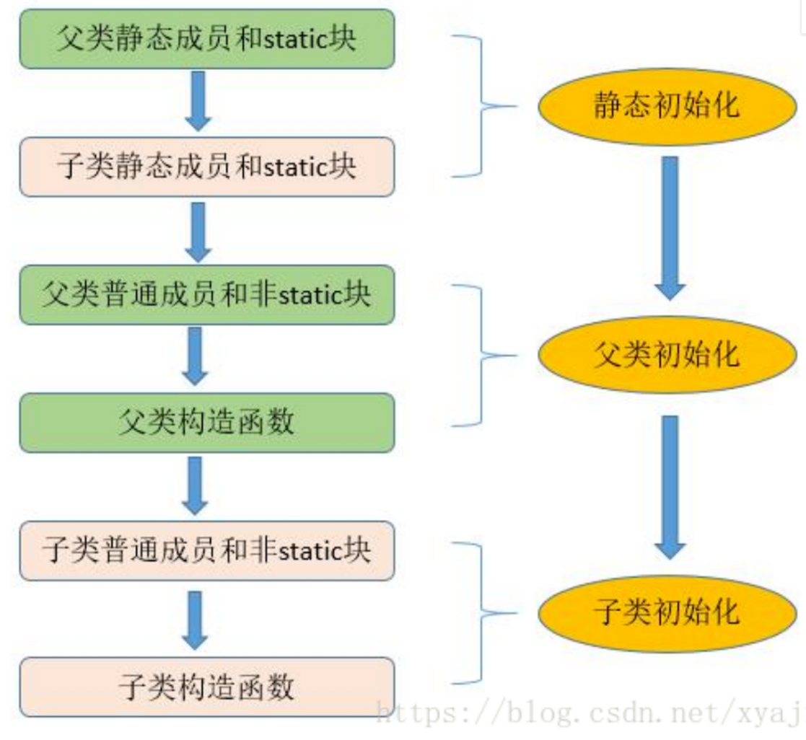

## 一、编程基本概念





### OOA（面向对象分析）、OOD（面向对象设计）、OOP（面向对象编程）


### 子类和父类的实例变量和方法区别


### 重载返回类型不同为什么不可以重载


#### JDK8 新特性有哪些？

lambda 表达式：允许把函数作为参数传递到方法，简化匿名内部类代码。

函数式接口：使用 @FunctionalInterface 标识，有且仅有一个抽象方法，可被隐式转换为 lambda 表达式。

方法引用：可以引用已有类或对象的方法和构造方法，进一步简化 lambda 表达式。

接口：接口可以定义 default 修饰的默认方法，降低了接口升级的复杂性，还可以定义静态方法。

注解：引入重复注解机制，相同注解在同地方可以声明多次。注解作用范围也进行了扩展，可作用于局部变量、泛型、方法异常等。

类型推测：加强了类型推测机制，使代码更加简洁。

Optional 类：处理空指针异常，提高代码可读性。

Stream 类：引入函数式编程风格，提供了很多功能，使代码更加简洁。方法包括 forEach 遍历、count 统计个数、filter 按条件过滤、limit 取前 n 个元素、skip 跳过前 n 个元素、map 映射加工、concat 合并 stream 流等。

日期：增强了日期和时间 API，新的 java.time 包主要包含了处理日期、时间、日期/时间、时区、时刻和时钟等操作。

JavaScript：提供了一个新的 JavaScript 引擎，允许在 JVM上运行特定 JavaScript 应用。

#### 谈一谈你对面向对象的理解

面向过程让计算机有步骤地顺序做一件事，是过程化思维，使用面向过程语言开发大型项目，软件复用和维护存在很大问题，模块之间耦合严重。面向对象相对面向过程更适合解决规模较大的问题，可以拆解问题复杂度，对现实事物进行抽象并映射为开发对象，更接近人的思维。

例如开门这个动作，面向过程是 open(Door door)，动宾结构，door 作为操作对象的参数传入方法，方法内定义开门的具体步骤。面向对象的方式首先会定义一个类 Door，抽象出门的属性（如尺寸、颜色）和行为（如 open 和 close），主谓结构。

面向过程代码松散，强调流程化解决问题。面向对象代码强调高内聚、低耦合，先抽象模型定义共性行为，再解决实际问题。

#### 面向对象的三大特性？

封装是对象功能内聚的表现形式，在抽象基础上决定信息是否公开及公开等级，核心问题是以什么方式暴漏哪些信息。主要任务是对属性、数据、敏感行为实现隐藏，对属性的访问和修改必须通过公共接口实现。封装使对象关系变得简单，降低了代码耦合度，方便维护。

迪米特原则就是对封装的要求，即 A 模块使用 B 模块的某接口行为，对 B 模块中除此行为外的其他信息知道得应尽可能少。不直接对 public 属性进行读取和修改而使用 getter/setter 方法是因为假设想在修改属性时进行权限控制、日志记录等操作，在直接访问属性的情况下无法实现。如果将 public 的属性和行为修改为 private 一般依赖模块都会报错，因此不知道使用哪种权限时应优先使用 private。

继承用来扩展一个类，子类可继承父类的部分属性和行为使模块具有复用性。继承是"is-a"关系，可使用里氏替换原则判断是否满足"is-a"关系，即任何父类出现的地方子类都可以出现。如果父类引用直接使用子类引用来代替且可以正确编译并执行，输出结果符合子类场景预期，那么说明两个类符合里氏替换原则。

多态以封装和继承为基础，根据运行时对象实际类型使同一行为具有不同表现形式。多态指在编译层面无法确定最终调用的方法体，在运行期由 JVM 动态绑定，调用合适的重写方法。由于重载属于静态绑定，本质上重载结果是完全不同的方法，因此多态一般专指重写。


#### 重载和重写的区别？

重载指方法名称相同，但参数类型个数不同，是行为水平方向不同实现。对编译器来说，方法名称和参数列表组成了一个唯一键，称为方法签名，JVM 通过方法签名决定调用哪种重载方法。不管继承关系如何复杂，重载在编译时可以根据规则知道调用哪种目标方法，因此属于静态绑定。

JVM 在重载方法中选择合适方法的顺序：
① 精确匹配。
② 基本数据类型自动转换成更大表示范围。
③ 自动拆箱与装箱。
④ 子类向上转型。
⑤ 可变参数。

重写指子类实现接口或继承父类时，保持方法签名完全相同，实现不同方法体，是行为垂直方向不同实现。

元空间有一个方法表保存方法信息，如果子类重写了父类的方法，则方法表中的方法引用会指向子类实现。父类引用执行子类方法时无法调用子类存在而父类不存在的方法。

重写方法访问权限不能变小，返回类型和抛出的异常类型不能变大，必须加 @Override 。


#### 类之间有哪些关系？

| 类关系 | 描述                           | 权力强侧 | 举例                             |
| ------ | ------------------------------ | -------- | -------------------------------- |
| 继承   | 父子类之间的关系：is-a         | 父类     | 小狗继承于动物                   |
| 实现   | 接口和实现类之间的关系：can-do | 接口     | 小狗实现了狗叫接口               |
| 组合   | 比聚合更强的关系：contains-a   | 整体     | 头是身体的一部分                 |
| 聚合   | 暂时组装的关系：has-a          | 组装方   | 小狗和绳子是暂时的聚合关系       |
| 依赖   | 一个类用到另一个：depends-a    | 被依赖方 | 人养小狗，人依赖于小狗           |
| 关联   | 平等的使用关系：links-a        | 平等     | 人使用卡消费，卡可以提取人的信息 |

#### 

#### Object 类有哪些方法？

equals：检测对象是否相等，默认使用 == 比较对象引用，可以重写 equals 方法自定义比较规则。equals 方法规范：自反性、对称性、传递性、一致性、对于任何非空引用 x，x.equals(null) 返回 false。

hashCode：散列码是由对象导出的一个整型值，没有规律，每个对象都有默认散列码，值由对象存储地址得出。字符串散列码由内容导出，值可能相同。为了在集合中正确使用，一般需要同时重写 equals 和 hashCode，要求 equals 相同 hashCode 必须相同，hashCode 相同 equals 未必相同，因此 hashCode 是对象相等的必要不充分条件。

toString：打印对象时默认的方法，如果没有重写打印的是表示对象值的一个字符串。

clone：clone 方法声明为 protected，类只能通过该方法克隆它自己的对象，如果希望其他类也能调用该方法必须定义该方法为 public。如果一个对象的类没有实现 Cloneable 接口，该对象调用 clone 方抛出一个 CloneNotSupport 异常。默认的 clone 方法是浅拷贝，一般重写 clone 方法需要实现 Cloneable 接口并指定访问修饰符为 public。

finalize：确定一个对象死亡至少要经过两次标记，如果对象在可达性分析后发现没有与 GC Roots 连接的引用链会被第一次标记，随后进行一次筛选，条件是对象是否有必要执行 finalize 方法。假如对象没有重写该方法或方法已被虚拟机调用，都视为没有必要执行。如果有必要执行，对象会被放置在 F-Queue 队列，由一条低调度优先级的 Finalizer 线程去执行。虚拟机会触发该方法但不保证会结束，这是为了防止某个对象的 finalize 方法执行缓慢或发生死循环。只要对象在 finalize 方法中重新与引用链上的对象建立关联就会在第二次标记时被移出回收集合。由于运行代价高昂且无法保证调用顺序，在 JDK 9 被标记为过时方法，并不适合释放资源。

getClass：返回包含对象信息的类对象。

wait / notify / notifyAll：阻塞或唤醒持有该对象锁的线程。

#### 内部类的作用是什么，有哪些分类？

内部类可对同一包中其他类隐藏，内部类方法可以访问定义这个内部类的作用域中的数据，包括 private 数据。

内部类是一个编译器现象，与虚拟机无关。编译器会把内部类转换成常规的类文件，用 $ 分隔外部类名与内部类名，其中匿名内部类使用数字编号，虚拟机对此一无所知。

静态内部类： 属于外部类，只加载一次。作用域仅在包内，可通过 外部类名.内部类名 直接访问，类内只能访问外部类所有静态属性和方法。HashMap 的 Node 节点，ReentrantLock 中的 Sync 类，ArrayList 的 SubList 都是静态内部类。内部类中还可以定义内部类，如 ThreadLoacl 静态内部类 ThreadLoaclMap 中定义了内部类 Entry。

成员内部类： 属于外部类的每个对象，随对象一起加载。不可以定义静态成员和方法，可访问外部类的所有内容。

局部内部类： 定义在方法内，不能声明访问修饰符，只能定义实例成员变量和实例方法，作用范围仅在声明类的代码块中。

匿名内部类： 只用一次的没有名字的类，可以简化代码，创建的对象类型相当于 new 的类的子类类型。用于实现事件监听和其他回调。


#### 子类初始化的顺序

① 父类静态代码块和静态变量。
② 子类静态代码块和静态变量。
③ 父类普通代码块和普通变量。
④ 父类构造方法。
⑤ 子类普通代码块和普通变量。
⑥ 子类构造方法。


#### Java 按值调用还是引用调用

按值调用指方法接收调用者提供的值，按引用调用指方法接收调用者提供的变量地址。

Java 总是按值调用，方法得到的是所有参数值的副本，传递对象时实际上方法接收的是对象引用的副本。方法不能修改基本数据类型的参数，如果传递了一个 int 值 ，改变值不会影响实参，因为改变的是值的一个副本。

可以改变对象参数的状态，但不能让对象参数引用一个新的对象。如果传递了一个 int 数组，改变数组的内容会影响实参，而改变这个参数的引用并不会让实参引用新的数组对象。

#### 浅拷贝和深拷贝的区别？

浅拷贝： 只复制当前对象的基本数据类型及引用变量，没有复制引用变量指向的实际对象。修改克隆对象可能影响原对象，不安全。

深拷贝： 完全拷贝基本数据类型和引用数据类型，安全。

#### 什么是反射？

在运行状态中，对于任意一个类都能知道它的所有属性和方法，对于任意一个对象都能调用它的任意方法和属性，这种动态获取信息及调用对象方法的功能称为反射。缺点是破坏了封装性以及泛型约束。反射是框架的核心，Spring 大量使用反射。

#### 什么是注解？什么是元注解？

注解是一种标记，使类或接口附加额外信息，帮助编译器和 JVM 完成一些特定功能，例如 @Override 标识一个方法是重写方法。

元注解是自定义注解的注解，例如：

@Target：约束作用位置，值是 ElementType 枚举常量，包括 METHOD 方法、VARIABLE 变量、TYPE 类/接口、PARAMETER 方法参数、CONSTRUCTORS 构造方法和 LOACL_VARIABLE 局部变量等。

@Rentention：约束生命周期，值是 RetentionPolicy 枚举常量，包括 SOURCE 源码、CLASS 字节码和 RUNTIME 运行时。

@Documented：表明这个注解应该被 javadoc 记录。

#### 什么是泛型，有什么作用？

泛型本质是参数化类型，解决不确定对象具体类型的问题。泛型在定义处只具备执行 Object 方法的能力。

泛型的好处：
① 类型安全，放置什么出来就是什么，不存在 ClassCastException
。② 提升可读性，编码阶段就显式知道泛型集合、泛型方法等处理的对象类型。
③ 代码重用，合并了同类型的处理代码。

#### 泛型擦除是什么？

泛型用于编译阶段，编译后的字节码文件不包含泛型类型信息，因为虚拟机没有泛型类型对象，所有对象都属于普通类。例如定义 `List<Object> 或 List<String>`，在编译后都会变成 List 。

定义一个泛型类型，会自动提供一个对应原始类型，类型变量会被擦除。如果没有限定类型就会替换为 Object，如果有限定类型就会替换为第一个限定类型，例如 `<T extends A & B>` 会使用 A 类型替换 T。


#### switch 是否能作用在 byte 上，是否能作用在 long 上，是否能作用在 String 上?

在 Java 5 以前，switch(expr)中，expr 只能是 byte、short、char、int。从 Java5 开始，Java 中引入了枚举类型，
expr 也可以是 enum 类型，从 Java 7 开始，expr 还可以是字符串（String），但是长整型（long）在目前所有的版
本中都是不可以的。

#### 用最有效率的方法计算 2 乘以 8

2 << 3（左移 3 位相当于乘以 2 的 3 次方，右移 3 位相当于除以 2 的 3 次方）。

#### Math.round(11.5) 等于多少？Math.round(-11.5)等于多少

Math.round(11.5)的返回值是 12，Math.round(-11.5)的返回值是-11。四舍五入的原理是在参数上加 0.5 然后进行下
取整。

#### 访问修饰符 public,private,protected,以及不写（默认）时的区别

定义：Java中，可以使用访问修饰符来保护对类、变量、方法和构造方法的访问。Java 支持 4 种不同的访问权限。
分类
private : 在同一类内可见。使用对象：变量、方法。 注意：不能修饰类（外部类）
default (即缺省，什么也不写，不使用任何关键字）: 在同一包内可见，不使用任何修饰符。使用对象：类、接口、变
量、方法。
protected : 对同一包内的类和所有子类可见。使用对象：变量、方法。 注意：不能修饰类（外部类）。
public : 对所有类可见。使用对象：类、接口、变量、方法。


#### &和&&的区别？

&运算符有两种用法：(1)按位与；(2)逻辑与。
&&运算符是短路与运算。逻辑与跟短路与的差别是非常巨大的，虽然二者都要求运算符左右两端的布尔值都是true 整
个表达式的值才是 true。&&之所以称为短路运算，是因为如果&&左边的表达式的值是 false，右边的表达式会被直接
短路掉，不会进行运算。
注意：逻辑或运算符（|）和短路或运算符（||）的差别也是如此。

#### final 有什么用？

用于修饰类、属性和方法；
被final修饰的类不可以被继承；
被final修饰的方法不可以被重写；
被final修饰的变量不可以被改变，被final修饰不可变的是变量的引用，而不是引用指向的内容，引用指向的内容是可以改变的；

#### final finally finalize区别？

final可以修饰类、变量、方法，修饰类表示该类不能被继承、修饰方法表示该方法不能被重写、修饰变量表
示该变量是一个常量不能被重新赋值。
finally一般作用在try-catch代码块中，在处理异常的时候，通常我们将一定要执行的代码方法finally代码块
中，表示不管是否出现异常，该代码块都会执行，一般用来存放一些关闭资源的代码。
finalize是一个方法，属于Object类的一个方法，而Object类是所有类的父类，该方法一般由垃圾回收器来调
用，当我们调用System.gc() 方法的时候，由垃圾回收器调用finalize()，回收垃圾，一个对象是否可回收的
最后判断。

#### this关键字的用法

this是自身的一个对象，代表对象本身，可以理解为：指向对象本身的一个指针。
this的用法在java中大体可以分为3种：
1.普通的直接引用，this相当于是指向当前对象本身。
2.形参与成员名字重名，用this来区分：

```java
publicPerson(String name,int age){
    this.name = name;
    this.age = age;
}
```

3.引用本类的构造函数

```java
class Person{
    private String name;
    private int age;
    public Person(){}
    public Person(String name){
        this.name =name;
    }
    public Person(String name,int age){ 
        this(name);
        this.age = age;
    }
}
```

#### super关键字的用法

super可以理解为是指向自己超（父）类对象的一个指针，而这个超类指的是离自己最近的一个父类。
super也有三种用法：
1.普通的直接引用
与this类似，super相当于是指向当前对象的父类的引用，这样就可以用super.xxx来引用父类的成员。
2.子类中的成员变量或方法与父类中的成员变量或方法同名时，用super进行区分

```java
class Person{
    protected String name;
    public Person(String name){
        this.name = name;
    }
}
class StudentextendsPerson{
    private String name;
    public Student(String name, String name1){
        super(name);
        this.name = name1;
    }
    public void getInfo(){       
System.out.println(this.name);//Child       
System.out.println(super.name);//Father
    }
}
public class Test{ 
    public static void main(String[] args){       
        Student s1=newStudent("Father","Child");       
        s1.getInfo();
    }
}
```

3、引用父类构造函数
super（参数）：调用父类中的某一个构造函数（应该为构造函数中的第一条语句）。
this（参数）：调用本类中另一种形式的构造函数（应该为构造函数中的第一条语句）。

#### this与super的区别

- super:　它引用当前对象的直接父类中的成员（用来访问直接父类中被隐藏的父类中成员数据或函数，基类与派生类中有相同
  成员定义时如：super.变量名 super.成员函数据名（实参）
- this：它代表当前对象名（在程序中易产生二义性之处，应使用this来指明当前对象；如果函数的形参与类中的成员数据同名，这时需用this来指明成员变量名）
- super()和this()类似,区别是，super()在子类中调用父类的构造方法，this()在本类内调用本类的其它构造方法。
- super()和this()均需放在构造方法内第一行。
- 尽管可以用this调用一个构造器，但却不能调用两个。
- this和super不能同时出现在一个构造函数里面，因为this必然会调用其它的构造函数，其它的构造函数必然也会有super语句的存在，所以在同一个构造函数里面有相同的语句，就失去了语句的意义，编译器也不会通过。
- this()和super()都指的是对象，所以，均不可以在static环境中使用。包括：static变量,static方法，static语句块。
- 从本质上讲，this是一个指向本对象的指针, 然而super是一个Java关键字。

#### static存在的主要意义

static的主要意义是在于创建独立于具体对象的域变量或者方法。以致于即使没有创建对象，也能使用属性和调用方法！
static关键字还有一个比较关键的作用就是 用来形成静态代码块以优化程序性能。static块可以置于类中的任何地方，类
中可以有多个static块。在类初次被加载的时候，会按照static块的顺序来执行每个static块，并且只会执行一次。
为什么说static块可以用来优化程序性能，是因为它的特性:只会在类加载的时候执行一次。因此，很多时候会将一些只
需要进行一次的初始化操作都放在static代码块中进行。

**static的独特之处**
1、被static修饰的变量或者方法是独立于该类的任何对象，也就是说，这些变量和方法不属于任何一个实例对象，而是

**被类的实例对象所共享。**
怎么理解 “被类的实例对象所共享” 这句话呢？就是说，一个类的静态成员，它是属于大伙的【大伙指的是这个类的多个对象实
例，我们都知道一个类可以创建多个实例！】，所有的类对象共享的，不像成员变量是自个的【自个指的是这个类的单个实例对象】
…我觉得我已经讲的很通俗了，你明白了咩？
2、在该类被第一次加载的时候，就会去加载被static修饰的部分，而且只在类第一次使用时加载并进行初始化，注意这
是第一次用就要初始化，后面根据需要是可以再次赋值的。
3、static变量值在类加载的时候分配空间，以后创建类对象的时候不会重新分配。赋值的话，是可以任意赋值的！
4、被static修饰的变量或者方法是优先于对象存在的，也就是说当一个类加载完毕之后，即便没有创建对象，也可以去
访问。
**static应用场景**
因为static是被类的实例对象所共享，因此如果某个成员变量是被所有对象所共享的，那么这个成员变量就应该定义为静
态变量。
因此比较常见的static应用场景有：
1、修饰成员变量 2、修饰成员方法 3、静态代码块 4、修饰类【只能修饰内部类也就是静态内部类】 5、静态导包
**static注意事项**
1、静态只能访问静态。 2、非静态既可以访问非静态的，也可以访问静态的。


#### 在 Java 中，如何跳出当前的多重嵌套循环

在Java中，要想跳出多重循环，可以在外面的循环语句前定义一个标号，然后在里层循环体的代码中使用带有标号的
break 语句，即可跳出外层循环。例如：

```java
public static void main(String[] args){    
    ok:for(int i =0; i <10; i++){
        for(int j =0; j <10; j++){            
            System.out.println("i="+ i+",j="+ j);
            if(j ==5){
                break ok;
            }
        }
    }
}
```

#### 面向对象和面向过程的区别

**面向过程：**
优点：性能比面向对象高，因为类调用时需要实例化，开销比较大，比较消耗资源;比如单片机、嵌入式开发、
Linux/Unix等一般采用面向过程开发，性能是最重要的因素。
缺点：没有面向对象易维护、易复用、易扩展
**面向对象：**
优点：易维护、易复用、易扩展，由于面向对象有封装、继承、多态性的特性，可以设计出低耦合的系统，使系统更加
灵活、更加易于维护
缺点：性能比面向过程低
面向过程是具体化的，流程化的，解决一个问题，你需要一步一步的分析，一步一步的实现。
面向对象是模型化的，你只需抽象出一个类，这是一个封闭的盒子，在这里你拥有数据也拥有解决问题的方法。需要什
么功能直接使用就可以了，不必去一步一步的实现，至于这个功能是如何实现的，管我们什么事？我们会用就可以了。
面向对象的底层其实还是面向过程，把面向过程抽象成类，然后封装，方便我们使用的就是面向对象了。


#### 面向对象三大特性


**封装**
封装把一个对象的属性私有化，同时提供一些可以被外界访问的属性的方法，如果属性不想被外界访问，我们大可不必
提供方法给外界访问。但是如果一个类没有提供给外界访问的方法，那么这个类也没有什么意义了。
**继承**
继承是使用已存在的类的定义作为基础建立新类的技术，新类的定义可以增加新的数据或新的功能，也可以用父类的功
能，但不能选择性地继承父类。通过使用继承我们能够非常方便地复用以前的代码。
关于继承如下 3 点请记住：

1. 子类拥有父类非 private 的属性和方法。
2. 子类可以拥有自己属性和方法，即子类可以对父类进行扩展。
3. 子类可以用自己的方式实现父类的方法。（以后介绍）。

**多态**

所谓多态就是指程序中定义的引用变量所指向的具体类型和通过该引用变量发出的方法调用在编程时并不确定，而是在
程序运行期间才确定，即一个引用变量到底会指向哪个类的实例对象，该引用变量发出的方法调用到底是哪个类中实现
的方法，必须在由程序运行期间才能决定。
在Java中有两种形式可以实现多态：继承（多个子类对同一方法的重写）和接口（实现接口并覆盖接口中同一方法）。

多态的实现
Java实现多态有三个必要条件：继承、重写、向上转型。
继承：在多态中必须存在有继承关系的子类和父类。
重写：子类对父类中某些方法进行重新定义，在调用这些方法时就会调用子类的方法。
向上转型：在多态中需要将子类的引用赋给父类对象，只有这样该引用才能够具备技能调用父类的方法和子类的方法。
只有满足了上述三个条件，我们才能够在同一个继承结构中使用统一的逻辑实现代码处理不同的对象，从而达到执行不
同的行为。
对于Java而言，它多态的实现机制遵循一个原则：当超类对象引用变量引用子类对象时，被引用对象的类型而不是引用
变量的类型决定了调用谁的成员方法，但是这个被调用的方法必须是在超类中定义过的，也就是说被子类覆盖的方法。


**抽象：**抽象是将一类对象的共同特征总结出来构造类的过程，包括数据抽象和行为抽象两方面。抽象只关注对象有哪些
属性和行为，并不关注这些行为的细节是什么。

#### 面向对象五大基本原则是什么（可选）

**单一职责原则SRP(Single Responsibility Principle)**
一个类只负责一个功能领域中的相应职责。
**开闭原则OCP(Open－Close Principle)**
一个模块对于拓展是开放的，对于修改是封闭的，想要增加功能热烈欢迎，想要修改，哼，一万个不乐意。
**里式替换原则LSP(the Liskov Substitution Principle LSP)**
所有引用基类对象的地方能够透明地使用 其子类的对象。
**依赖倒置原则DIP(the Dependency Inversion Principle DIP)**
抽象不应该依赖于细节，细节应该依赖于 抽象。高层次的模块不应该依赖于低层次的模块，他们都应该依赖于抽象。抽象不应该依赖于具体实现，具体实现应该依赖于抽象。就是你出国要说你是中国人，而不能说你是哪个村子的。比如说中国人是抽象的，下面有具体的xx省，xx市，xx县。你要依赖的抽象是中国人，而不是你是xx村的。
**接口分离原则ISP(the Interface Segregation Principle ISP)**
使用多个专门的接口，而不使用单一的总 接口。设计时采用多个与特定客户类有关的接口比采用一个通用的接口要好。就比如一个手机拥有打电话，看视频，玩游戏等功能，把这几个功能拆分成不同的接口，比在一个接口里要好的多。                 

**合成复用原则**

尽量使用对象组合，而不是继承来达到复 用的目的。

**迪米特法则**

一个软件实体应当尽可能少地与其他实体 发生相互作用。

#### 抽象类和接口的对比

抽象类是用来捕捉子类的通用特性的。接口是抽象方法的集合。
从设计层面来说，抽象类是对类的抽象，是一种模板设计，接口是行为的抽象，是一种行为的规范。

相同点

- 接口和抽象类都不能实例化
- 都位于继承的顶端，用于被其他实现或继承
- 都包含抽象方法，其子类都必须覆写这些抽象方法

不同点


备注：Java8中接口中引入默认方法和静态方法，以此来减少抽象类和接口之间的差异。
现在，我们可以为接口提供默认实现的方法了，并且不用强制子类来实现它。
接口和抽象类各有优缺点，在接口和抽象类的选择上，必须遵守这样一个原则：

- 行为模型应该总是通过接口而不是抽象类定义，所以通常是优先选用接口，尽量少用抽象类。
- 选择抽象类的时候通常是如下情况：需要定义子类的行为，又要为子类提供通用的功能。

#### 普通类和抽象类有哪些区别？

- 普通类不能包含抽象方法，抽象类可以包含抽象方法。
- 抽象类不能直接实例化，普通类可以直接实例化。

#### 抽象类能使用 final 修饰吗？

不能，定义抽象类就是让其他类继承的，如果定义为 final 该类就不能被继承，这样彼此就会产生矛盾，所以 final 不能
修饰抽象类。

#### 在Java中定义一个不做事且没有参数的构造方法的作用

Java程序在执行子类的构造方法之前，如果没有用super()来调用父类特定的构造方法，则会调用父类中“没有参数的构
造方法”。因此，如果父类中只定义了有参数的构造方法，而在子类的构造方法中又没有用super()来调用父类中特定的
构造方法，则编译时将发生错误，因为Java程序在父类中找不到没有参数的构造方法可供执行。解决办法是在父类里加
上一个不做事且没有参数的构造方法。

#### 在调用子类构造方法之前会先调用父类没有参数的构造方法，其目的是？

帮助子类做初始化工作。

#### 一个类的构造方法的作用是什么？若一个类没有声明构造方法，改程序能正确执行吗？为什么？

主要作用是完成对类对象的初始化工作。可以执行。因为一个类即使没有声明构造方法也会有默认的不带参数的构造方
法。

#### 静态变量和实例变量区别

静态变量： 静态变量由于不属于任何实例对象，属于类的，所以在内存中只会有一份，在类的加载过程中，JVM只为静
态变量分配一次内存空间。
实例变量： 每次创建对象，都会为每个对象分配成员变量内存空间，实例变量是属于实例对象的，在内存中，创建几次
对象，就有几份成员变量。

#### 静态变量与普通变量区别

static变量也称作静态变量，静态变量和非静态变量的区别是：静态变量被所有的对象所共享，在内存中只有一个副本，
它当且仅当在类初次加载时会被初始化。而非静态变量是对象所拥有的，在创建对象的时候被初始化，存在多个副本，
各个对象拥有的副本互不影响。
还有一点就是static成员变量的初始化顺序按照定义的顺序进行初始化。

#### == 和 equals 的区别是什么

== : 它的作用是判断两个对象的地址是不是相等。即，判断两个对象是不是同一个对象。(基本数据类型 == 比较的是
值，引用数据类型 == 比较的是内存地址)
equals() : 它的作用也是判断两个对象是否相等。但它一般有两种使用情况：
情况1：类没有覆盖 equals() 方法。则通过 equals() 比较该类的两个对象时，等价于通过“==”比较这两个对象。
情况2：类覆盖了 equals() 方法。一般，我们都覆盖 equals() 方法来两个对象的内容相等；若它们的内容相等，则返回
true (即，认为这两个对象相等)。

说明：
String中的equals方法是被重写过的，因为object的equals方法是比较的对象的内存地址，而String的equals方法比较的是对象的值。
当创建String类型的对象时，虚拟机会在常量池中查找有没有已经存在的值和要创建的值相同的对象，如果有就把它赋给当前引用。如果没有就在常量池中重新创建一个String对象。

#### hashCode 与 equals 

HashSet如何检查重复
两个对象的 hashCode() 相同，则 equals() 也一定为 true，对吗？
hashCode和equals方法的关系
面试官可能会问你：“你重写过 hashcode 和 equals 么，为什么重写equals时必须重写hashCode方法？”
**hashCode()介绍**
hashCode() 的作用是获取哈希码，也称为散列码；它实际上是返回一个int整数。这个哈希码的作用是确定该对象在哈
希表中的索引位置。hashCode() 定义在JDK的Object.java中，这就意味着Java中的任何类都包含有hashCode()函数。
散列表存储的是键值对(key-value)，它的特点是：能根据“键”快速的检索出对应的“值”。这其中就利用到了散列
码！（可以快速找到所需要的对象）
**为什么要有 hashCode**
**我们以“HashSet 如何检查重复”为例子来说明为什么要有 hashCode：**
当你把对象加入 HashSet 时，HashSet 会先计算对象的 hashcode 值来判断对象加入的位置，同时也会与其他已经加
入的对象的 hashcode 值作比较，如果没有相符的hashcode，HashSet会假设对象没有重复出现。但是如果发现有相
同 hashcode 值的对象，这时会调用 equals()方法来检查 hashcode 相等的对象是否真的相同。如果两者相同，
HashSet 就不会让其加入操作成功。如果不同的话，就会重新散列到其他位置。（摘自我的Java启蒙书《Head first
java》第二版）。这样我们就大大减少了 equals 的次数，相应就大大提高了执行速度。
**hashCode()与equals()的相关规定**
如果两个对象相等，则hashcode一定也是相同的
两个对象相等，对两个对象分别调用equals方法都返回true
两个对象有相同的hashcode值，它们也不一定是相等的
**因此，equals 方法被覆盖过，则 hashCode 方法也必须被覆盖**
hashCode() 的默认行为是对堆上的对象产生独特值。如果没有重写 hashCode()，则该 class 的两个对象无论如何都不
会相等（即使这两个对象指向相同的数据)

#### 对象的相等与指向他们的引用相等，两者有什么不同？

对象的相等 比的是内存中存放的内容是否相等而 引用相等 比较的是他们指向的内存地址是否相等。

#### 值传递

当一个对象被当作参数传递到一个方法后，此方法可改变这个对象的属性，并可返回变化后的结
果，那么这里到底是值传递还是引用传递?
是值传递。Java 语言的方法调用只支持参数的值传递。当一个对象实例作为一个参数被传递到方法中时，参数的值就是
对该对象的引用。对象的属性可以在被调用过程中被改变，但对对象引用的改变是不会影响到调用者的。

为什么 Java 中只有值传递？

首先回顾一下在程序设计语言中有关将参数传递给方法（或函数）的一些专业术语。按值调用(call by value)表示方法
接收的是调用者提供的值，而按引用调用（call by reference)表示方法接收的是调用者提供的变量地址。一个方法可
以修改传递引用所对应的变量值，而不能修改传递值调用所对应的变量值。 它用来描述各种程序设计语言（不只是
Java)中方法参数传递方式。
Java程序设计语言总是采用按值调用。也就是说，方法得到的是所有参数值的一个拷贝，也就是说，方法不能修改传递
给它的任何参数变量的内容。

下面通过 3 个例子来给大家说明

example 1

```java
public static void main(String[] args){
    int num1 =10;
    int num2 =20;
    swap(num1, num2);    
    System.out.println("num1 = "+ num1);   
	System.out.println("num2 = "+ num2);
}
public static void swap(int a,int b){
    int temp = a;    
    a = b;    
    b = temp;   
    System.out.println("a = "+ a);    
    System.out.println("b = "+ b);
}
```

结果：
a =20b =10num1 =10num2 =20

解析：


在swap方法中，a、b的值进行交换，并不会影响到 num1、num2。因为，a、b中的值，只是从 num1、num2 的复
制过来的。也就是说，a、b相当于num1、num2 的副本，副本的内容无论怎么修改，都不会影响到原件本身。

通过上面例子，我们已经知道了一个方法不能修改一个基本数据类型的参数，而对象引用作为参数就不一样，请看
example2

```java
public static void main(String[] args){
    int[] arr ={1,2,3,4,5};        
    System.out.println(arr[0]);
    change(arr);       
    System.out.println(arr[0]);
}
public static void change(int[] array){
    // 将数组的第一个元素变为0        
    array[0]=0;
}
```

结果：
10

解析：


array 被初始化 arr 的拷贝也就是一个对象的引用，也就是说 array 和 arr 指向的时同一个数组对象。 因此，外部对引
用对象的改变会反映到所对应的对象上。
通过 example2 我们已经看到，实现一个改变对象参数状态的方法并不是一件难事。理由很简单，方法得到的是对象引
用的拷贝，对象引用及其他的拷贝同时引用同一个对象。
很多程序设计语言（特别是，C++和Pascal)提供了两种参数传递的方式：值调用和引用调用。有些程序员（甚至本书
的作者）认为Java程序设计语言对对象采用的是引用调用，实际上，这种理解是不对的。由于这种误解具有一定的普遍
性，所以下面给出一个反例来详细地阐述一下这个问题。

example 3

```java
public class Test{
    public static void main(String[] args){// TODO Auto-generated method stub        
        Student s1 =newStudent("小张");        
        Student s2 =newStudent("小李");        
        Test.swap(s1, s2);        
        System.out.println("s1:"+ s1.getName());       
        System.out.println("s2:"+ s2.getName());
    }
    public static void swap(Student x, Student y){        
        Student temp = x;        
        x = y;        
        y= temp;        
        System.out.println("x:"+ x.getName());        
        System.out.println("y:"+ y.getName());
    }
}
```

结果：
x:小李y:小张s1:小张s2:小李

解析：
交换之前：


交换之后：


通过上面两张图可以很清晰的看出： 方法并没有改变存储在变量 s1 和 s2 中的对象引用。swap方法的参数x和y被初始
化为两个对象引用的拷贝，这个方法交换的是这两个拷贝。

总结
Java程序设计语言对对象采用的不是引用调用，实际上，对象引用是按值传递的。
下面再总结一下Java中方法参数的使用情况：
一个方法不能修改一个基本数据类型的参数（即数值型或布尔型》
一个方法可以改变一个对象参数的状态。
一个方法不能让对象参数引用一个新的对象。

#### 值传递和引用传递有什么区别

值传递：指的是在方法调用时，传递的参数是按值的拷贝传递，传递的是值的拷贝，也就是说传递后就互不相关了。
引用传递：指的是在方法调用时，传递的参数是按引用进行传递，其实传递的引用的地址，也就是变量所对应的内存空
间的地址。传递的是值的引用，也就是说传递前和传递后都指向同一个引用（也就是同一个内存空间）。

## 二、基本数据类型


#### float f=3.4;是否正确？

不正确。3.4 是双精度数，将双精度型（double）赋值给浮点型（float）属于下转型（down-casting，也称为窄化）
会造成精度损失，因此需要强制类型转换float f =(float)3.4; 或者写成 float f =3.4F;。

#### short s1 = 1; s1 = s1 + 1;有错吗?short s1 = 1; s1 += 1;有错吗?

对于 short s1 = 1; s1 = s1 + 1;由于 1 是 int 类型，因此 s1+1 运算结果也是 int型，需要强制转换类型才能赋值给
short 型。而 short s1 = 1; s1 += 1;可以正确编译，因为 s1+= 1;相当于 s1 = (short(s1 + 1);其中有隐含的强制类型转换。

#### 自动装箱与拆箱

装箱：将基本类型用它们对应的引用类型包装起来；
拆箱：将包装类型转换为基本数据类型；

#### int 和 Integer 有什么区别

Java 是一个近乎纯洁的面向对象编程语言，但是为了编程的方便还是引入了基本数据类型，但是为了能够将这些基本数
据类型当成对象操作，Java 为每一个基本数据类型都引入了对应的包装类型（wrapper class），int 的包装类就是
Integer，从 Java 5 开始引入了自动装箱/拆箱机制，使得二者可以相互转换。
Java 为每个原始类型提供了包装类型：
原始类型: boolean，char，byte，short，int，long，float，double
包装类型：Boolean，Character，Byte，Short，Integer，Long，Float，Double

#### Integer a= 127 与 Integer b = 127相等吗

对于对象引用类型：==比较的是对象的内存地址。
对于基本数据类型：==比较的是值。
如果整型字面量的值在-128到127之间，那么自动装箱时不会new新的Integer对象，而是直接引用常量池中的Integer
对象，超过范围 a1==b1的结果是false。

```java
public static void main(String[] args){    
  Integer a =newInteger(3);    
  Integer b =3;// 将3自动装箱成Integer类型int c =3;   
  System.out.println(a == b);// false 两个引用没有引用同一对象    
  System.out.println(a == c);// true a自动拆箱成int类型再和c比较   
  System.out.println(b == c);// true    
  Integer a1 =128;    
  Integer b1 =128;    
  System.out.println(a1 == b1);// false    
  Integer a2=127;    
  Integer b2 =127;    
  System.out.println(a2 == b2);// true
}
```


## 三、引用类型

- 类(class)
- 接口(interface)
- 数组([])
- String


## 四、异常

#### 1、异常有哪些分类？

所有异常都是 Throwable 的子类，分为 Error 和 Exception。Error 是 Java 运行时系统的内部错误和资源耗尽错误，例如 StackOverFlowError 和 OutOfMemoryError，这种异常程序无法处理。

Exception 分为受检异常和非受检异常，受检异常需要在代码中显式处理，否则会编译出错，非受检异常是运行时异常，继承自 RuntimeException。

受检异常：

① 无能为力型，如字段超长导致的 SQLException。

② 力所能及型，如未授权异常 UnAuthorizedException，程序可跳转权限申请页面。常见受检异常还有 FileNotFoundException、ClassNotFoundException、IOException等。

非受检异常：

① 可预测异常，例如 IndexOutOfBoundsException、NullPointerException、ClassCastException 等，这类异常应该提前处理。

② 需捕捉异常，例如进行 RPC 调用时的远程服务超时，这类异常客户端必须显式处理。

③ 可透出异常，指框架或系统产生的且会自行处理的异常，例如 Spring 的 NoSuchRequestHandingMethodException，Spring 会自动完成异常处理，将异常自动映射到合适的状态码。

## 五、多线程并发


## 六、反射

#### 什么是反射机制？

JAVA反射机制是在运行状态中，对于任意一个类，都能够知道这个类的所有属性和方法；对于任意一个对象，都能够调
用它的任意一个方法和属性；这种动态获取的信息以及动态调用对象的方法的功能称为java语言的反射机制。
静态编译和动态编译
**静态编译：**在编译时确定类型，绑定对象
**动态编译：**运行时确定类型，绑定对象

反射机制优缺点
优点：  运行期类型的判断，动态加载类，提高代码灵活度。
缺点：  性能瓶颈：反射相当于一系列解释操作，通知 JVM 要做的事情，性能比直接的java代码要慢很多。

#### 反射机制的应用场景有哪些？

反射是框架设计的灵魂。
在我们平时的项目开发过程中，基本上很少会直接使用到反射机制，但这不能说明反射机制没有用，实际上有很多设
计、开发都与反射机制有关，例如模块化的开发，通过反射去调用对应的字节码；动态代理设计模式也采用了反射机
制，还有我们日常使用的 Spring／Hibernate 等框架也大量使用到了反射机制。
举例：①我们在使用JDBC连接数据库时使用Class.forName()通过反射加载数据库的驱动程序；②Spring框架也用到很
多反射机制，最经典的就是xml的配置模式。Spring 通过 XML 配置模式装载 Bean 的过程：1) 将程序内所有 XML 或
Properties 配置文件加载入内存中; 2)Java类里面解析xml或properties里面的内容，得到对应实体类的字节码字符串以
及相关的属性信息; 3)使用反射机制，根据这个字符串获得某个类的Class实例; 4)动态配置实例的属性。

#### Java获取反射的三种方法

1.通过new对象实现反射机制 

2.通过路径实现反射机制 

3.通过类名实现反射机制

```java
public class Student{
    private int id;    
    String name;
    protected boolean sex;
    public float score;
}

public class Get{
    //获取反射机制三种方式
    public static void main(String[] args)throws ClassNotFoundException {
        //方式一(通过建立对象)      
        Student stu =newStudent();        
        Class classobj1= stu.getClass();        
        System.out.println(classobj1.getName());
        //方式二（所在通过路径-相对路径）        
        Class classobj2= Class.forName("fanshe.Student");       
        System.out.println(classobj2.getName());
        //方式三（通过类名）        
        Class classobj3= Student.class;       
        System.out.println(classobj3.getName());
    }
}
```


## 七、集合


## 八、注解


## 九、内部类

#### 什么是内部类？

在Java中，可以将一个类的定义放在另外一个类的定义内部，这就是内部类。内部类本身就是类的一个属性，与其他属
性定义方式一致。

#### 内部类的分类有哪些

内部类可以分为四种：成员内部类、局部内部类、匿名内部类和静态内部类。

**静态内部类**

定义在类内部的静态类，就是静态内部类。

```java
public class Outer{
    private static int radius =1;
    static class StaticInner{
        public void visit(){            
            System.out.println("visit outer static variable:"+ radius);
        }
    }
}
```

静态内部类可以访问外部类所有的静态变量，而不可访问外部类的非静态变量；静态内部类的创建方式， new 外部类.静态内部类() ，如下：

```java
Outer.StaticInner inner =newOuter.StaticInner();
inner.visit();
```

**成员内部类**

定义在类内部，成员位置上的非静态类，就是成员内部类。

```java
public class Outer{
    private static int radius =1;
    private int count =2;
    class Inner{
        public void visit(){            
            System.out.println("visitouter static  variable:"+ radius);            
            System.out.println("visit outer   variable:"+ count);
        }
    }
}
```

成员内部类可以访问外部类所有的变量和方法，包括静态和非静态，私有和公有。成员内部类依赖于外部类的实例，它
的创建方式 外部类实例.new 内部类() ，如下：

```java
Outer outer =newOuter();
Outer.Inner inner = outer.newInner();
inner.visit();
```

**局部内部类**

定义在方法中的内部类，就是局部内部类。

```java
public class Outer{
    private int out_a =1;
    private static int STATIC_b =2;
    public void testFunctionClass(){
        int inner_c=3;
        class Inner{
            private void fun(){               
                System.out.println(out_a);                
                System.out.println(STATIC_b);               
			   System.out.println(inner_c);
            }
        }        
        Inner  inner =newInner();        
        inner.fun();
    }
    public static void testStaticFunctionClass(){
        int d=3;
        class Inner{
            private void fun(){
     // System.out.println(out_a); 编译错误，定义在静态方法中的局部类不可以访问外部类的实例变量               
                System.out.println(STATIC_b);                
                System.out.println(d);
            }
        }        
        Inner  inner =newInner();        
        inner.fun();
    }
}
```

定义在实例方法中的局部类可以访问外部类的所有变量和方法，定义在静态方法中的局部类只能访问外部类的静态变量
和方法。局部内部类的创建方式，在对应方法内， new 内部类() ，如下：

```java
public static void testStaticFunctionClass(){
    classInner{}    
    Inner  inner =newInner();
}
```

**匿名内部类**

匿名内部类就是没有名字的内部类，日常开发中使用的比较多。

```java
public class Outer{
    private void test(final int i){
        new Service(){
            public void method(){
                for(int j =0; j < i; j++){                   
					System.out.println("匿名内部类");
                }
            }
        }.method();
    }
}//匿名内部类必须继承或实现一个已有的接口 interfaceService{voidmethod();}
```

除了没有名字，匿名内部类还有以下特点：

- 匿名内部类必须继承一个抽象类或者实现一个接口。

- 匿名内部类不能定义任何静态成员和静态方法。

- 当所在的方法的形参需要被匿名内部类使用时，必须声明为 final。

- 匿名内部类不能是抽象的，它必须要实现继承的类或者实现的接口的所有抽象方法。

  

  匿名内部类创建方式：

  new 类/接口{//匿名内部类实现部分}

#### 内部类的优点

它有以下优点：

- 一个内部类对象可以访问创建它的外部类对象的内容，包括私有数据！
- 内部类不为同一包的其他类所见，具有很好的封装性；
- 内部类有效实现了“多重继承”，优化 java 单继承的缺陷。
- 匿名内部类可以很方便的定义回调。

#### 内部类有哪些应用场景

1. 一些多算法场合
2. 解决一些非面向对象的语句块。
3. 适当使用内部类，使得代码更加灵活和富有扩展性。
4. 当某个类除了它的外部类，不再被其他的类使用时。

#### 局部内部类和匿名内部类访问局部变量的时候，为什么变量必须要加上final？

局部内部类和匿名内部类访问局部变量的时候，为什么变量必须要加上final呢？它内部原理是什么呢？
先看这段代码：

```java
public class Outer{
    void outMethod(){
        final int a =10;
        class Inner{
            void innerMethod(){                
                System.out.println(a);
            }
        }
    }
}
```

以上例子，为什么要加final呢？是因为生命周期不一致， 局部变量直接存储在栈中，当方法执行结束后，非final的局部
变量就被销毁。而局部内部类对局部变量的引用依然存在，如果局部内部类要调用局部变量时，就会出错。加了final，
可以确保局部内部类使用的变量与外层的局部变量区分开，解决了这个问题。

#### 内部类相关，看程序说出运行结果

```java
public class Outer{
    private int age =12;
    class Inner{
        private int age =13;
        public void print(){
            int age =14;            
            System.out.println("局部变量："+ age);           
            System.out.println("内部类变量："+this.age);           
            System.out.println("外部类变量："+Outer.this.age);
        }
    }
    public static void main(String[] args{        
            Outer.Inner in =newOuter().newInner();        
            in.print();
       }
    }
```

运行结果：
局部变量：14内部类变量：13外部类变量：12


## 十、泛型


## 十一、序列化


## 十二、复制


## 十三、动态代理


## 十四、I/O模型

#### 1、java 中 IO 流分为几种?

- 按照流的流向分，可以分为输入流和输出流；
- 按照操作单元划分，可以划分为字节流和字符流；
- 按照流的角色划分为节点流和处理流。

Java Io流共涉及40多个类，这些类看上去很杂乱，但实际上很有规则，而且彼此之间存在非常紧密的联系， Java I0流
的40多个类都是从如下4个抽象类基类中派生出来的。

- InputStream/Reader: 所有的输入流的基类，前者是字节输入流，后者是字符输入流。
- OutputStream/Writer: 所有输出流的基类，前者是字节输出流，后者是字符输出流。

按操作方式结构图：


按操作对象分类结构图：


#### 2、BIO,NIO,AIO 有什么区别?

简答
BIO：Block IO 同步阻塞式 IO，就是我们平常使用的传统 IO，它的特点是模式简单使用方便，并发处理能力低。
NIO：Non IO 同步非阻塞 IO，是传统 IO 的升级，客户端和服务器端通过 Channel（通道）通讯，实现了多路复用。
AIO：Asynchronous IO 是 NIO 的升级，也叫 NIO2，实现了异步非堵塞 IO ，异步 IO 的操作基于事件和回调机制。

详细回答

- BIO (Blocking I/O):  同步阻塞I/O模式，数据的读取写入必须阻塞在一个线程内等待其完成。在活动连接数不是特别高
  （小于单机1000）的情况下，这种模型是比较不错的，可以让每一个连接专注于自己的 I/O 并且编程模型简单，也不用过多考虑系统的过载、限流等问题。线程池本身就是一个天然的漏斗，可以缓冲一些系统处理不了的连接或请求。但是，当面对十万甚至百万级连接的时候，传统的 BIO 模型是无能为力的。因此，我们需要一种更高效的 I/O 处理模型来应对更高的并发量。
- NIO (New I/O):  NIO是一种同步非阻塞的I/O模型，在Java 1.4 中引入了NIO框架，对应 java.nio 包，提供了 Channel ,Selector，Buffer等抽象。NIO中的N可以理解为Non-blocking，不单纯是New。它支持面向缓冲的，基于通道的I/O操作方法。NIO提供了与传统BIO模型中的 Socket 和 ServerSocket 相对应的 SocketChannel 和 ServerSocketChannel 两种不同的套接字通道实现,两种通道都支持阻塞和非阻塞两种模式。阻塞模式使用就像传统中的支持一样，比较简单，但是性能和可靠性都不好；非阻塞模式正好与之相反。对于低负载、低并发的应用程序，可以使用同步阻塞I/O来提升开发速率和更好的维护性；对于高负载、高并发的（网络）应用，应使用 NIO 的非阻塞模式来开发
- AIO (Asynchronous I/O):  AIO 也就是 NIO 2。在 Java 7 中引入了 NIO 的改进版 NIO 2,它是异步非阻塞的IO模型。
  异步 IO 是基于事件和回调机制实现的，也就是应用操作之后会直接返回，不会堵塞在那里，当后台处理完成，操作系统会通知相应的线程进行后续的操作。AIO 是异步IO的缩写，虽然 NIO 在网络操作中，提供了非阻塞的方法，但是 NIO 的 IO 行为还是同步的。对于 NIO 来说，我们的业务线程是在 IO 操作准备好时，得到通知，接着就由这个线程自行进行 IO 操作，IO操作本身是同步的。查阅网上相关资料，我发现就目前来说 AIO 的应用还不是很广泛，Netty 之前也尝试使用过 AIO，不过又放弃了。

#### 3、Files的常用方法都有哪些

Files. exists()：检测文件路径是否存在。
Files. createFile()：创建文件。
Files. createDirectory()：创建文件夹。
Files. delete()：删除一个文件或目录。
Files. copy()：复制文件。
Files. move()：移动文件。
Files. size()：查看文件个数。
Files. read()：读取文件。
Files. write()：写入文件。


### 4、同步/异步/阻塞/非阻塞 IO 的区别？

同步和异步是通信机制，阻塞和非阻塞是调用状态。

同步 IO 是用户线程发起 IO 请求后需要等待或轮询内核 IO 操作完成后才能继续执行。异步 IO 是用户线程发起 IO 请求后可以继续执行，当内核 IO 操作完成后会通知用户线程，或调用用户线程注册的回调函数。

阻塞 IO 是 IO 操作需要彻底完成后才能返回用户空间 。非阻塞 IO 是 IO 操作调用后立即返回一个状态值，无需等 IO 操作彻底完成。

### 5、什么是 BIO？

**BIO** 是同步阻塞式 IO，JDK1.4 之前的 IO 模型。服务器实现模式为一个连接请求对应一个线程，服务器需要为每一个客户端]请求创建一个线程，如果这个连接不做任何事会造成不必要的线程开销。可以通过线程池改善，这种 IO 称为伪异步 IO。适用连接数目少且服务器资源多的场景。

### 6、什么是 NIO？

**NIO** 是 JDK1.4 引入的同步非阻塞 IO。服务器实现模式为多个连接请求对应一个线程，客户端连接请求会注册到一个多路复用器 Selector ，Selector 轮询到连接有 IO 请求时才启动一个线程处理。适用连接数目多且连接时间短的场景。

同步是指线程还是要不断接收客户端连接并处理数据，非阻塞是指如果一个管道没有数据，不需要等待，可以轮询下一个管道。

核心组件：

- **Selector：** 多路复用器，轮询检查多个 Channel 的状态，判断注册事件是否发生，即判断 Channel 是否处于可读或可写状态。使用前需要将 Channel 注册到 Selector，注册后会得到一个 SelectionKey，通过 SelectionKey 获取 Channel 和 Selector 相关信息。

- **Channel：** 双向通道，替换了 BIO 中的 Stream 流，不能直接访问数据，要通过 Buffer 来读写数据，也可以和其他 Channel 交互。

- **Buffer：** 缓冲区，本质是一块可读写数据的内存，用来简化数据读写。Buffer 三个重要属性：position 下次读写数据的位置，limit 本次读写的极限位置，capacity 最大容量。

  - `flip` 将写转为读，底层实现原理把 position 置 0，并把 limit 设为当前的 position 值。
  - `clear` 将读转为写模式（用于读完全部数据的情况，把 position 置 0，limit 设为 capacity）。
  - `compact` 将读转为写模式（用于存在未读数据的情况，让 position 指向未读数据的下一个）。
  - 通道方向和 Buffer 方向相反，读数据相当于向 Buffer 写，写数据相当于从 Buffer 读。

  使用步骤：向 Buffer 写数据，调用 flip 方法转为读模式，从 Buffer 中读数据，调用 clear 或 compact 方法清空缓冲区。

### 7、什么是 AIO？

AIO 是 JDK7 引入的异步非阻塞 IO。服务器实现模式为一个有效请求对应一个线程，客户端的 IO 请求都是由操作系统先完成 IO 操作后再通知服务器应用来直接使用准备好的数据。适用连接数目多且连接时间长的场景。

异步是指服务端线程接收到客户端管道后就交给底层处理IO通信，自己可以做其他事情，非阻塞是指客户端有数据才会处理，处理好再通知服务器。

实现方式包括通过 Future 的 `get` 方法进行阻塞式调用以及实现 CompletionHandler 接口，重写请求成功的回调方法 `completed` 和请求失败回调方法 `failed`。

### 8、序列化和反序列化是什么？

Java 对象 JVM 退出时会全部销毁，如果需要将对象及状态持久化，就要通过序列化实现，将内存中的对象保存在二进制流中，需要时再将二进制流反序列化为对象。对象序列化保存的是对象的状态，因此属于类属性的静态变量不会被序列化。

常见的序列化有三种：

- **Java 原生序列化**

  实现 `Serializabale` 标记接口，Java 序列化保留了对象类的元数据（如类、成员变量、继承类信息）以及对象数据，兼容性最好，但不支持跨语言，性能一般。序列化和反序列化必须保持序列化 ID 的一致，一般使用 `private static final long serialVersionUID` 定义序列化 ID，如果不设置编译器会根据类的内部实现自动生成该值。如果是兼容升级不应该修改序列化 ID，防止出错，如果是不兼容升级则需要修改。

- **Hessian 序列化**

  Hessian 序列化是一种支持动态类型、跨语言、基于对象传输的网络协议。Java 对象序列化的二进制流可以被其它语言反序列化。Hessian 协议的特性：① 自描述序列化类型，不依赖外部描述文件，用一个字节表示常用基础类型，极大缩短二进制流。② 语言无关，支持脚本语言。③ 协议简单，比 Java 原生序列化高效。Hessian 会把复杂对象所有属性存储在一个 Map 中序列化，当父类和子类存在同名成员变量时会先序列化子类再序列化父类，因此子类值会被父类覆盖。

- **JSON 序列化**

  JSON 序列化就是将数据对象转换为 JSON 字符串，在序列化过程中抛弃了类型信息，所以反序列化时只有提供类型信息才能准确进行。相比前两种方式可读性更好，方便调试。

序列化通常会使用网络传输对象，而对象中往往有敏感数据，容易遭受攻击，Jackson 和 fastjson 等都出现过反序列化漏洞，因此不需要进行序列化的敏感属性传输时应加上 transient 关键字。transient 的作用就是把变量生命周期仅限于内存而不会写到磁盘里持久化，变量会被设为对应数据类型的零值。

## 十五、Lanbda表达式与Stream流


## 十六、常用API

### String相关

#### 字符型常量和字符串常量的区别

1. 形式上: 字符常量是单引号引起的一个字符 字符串常量是双引号引起的若干个字符
2. 含义上: 字符常量相当于一个整形值(ASCII值),可以参加表达式运算 字符串常量代表一个地址值(该字符串在内存
中存放位置)
3. 占内存大小 字符常量只占一个字节 字符串常量占若干个字节(至少一个字符结束标志)

#### 什么是字符串常量池？

字符串常量池位于堆内存中，专门用来存储字符串常量，可以提高内存的使用率，避免开辟多块空间存储相同的字符
串，在创建字符串时 JVM 会首先检查字符串常量池，如果该字符串已经存在池中，则返回它的引用，如果不存在，则
实例化一个字符串放到池中，并返回其引用。

#### String有哪些特性

- 不变性：String 是只读字符串，是一个典型的 immutable 对象，对它进行任何操作，其实都是创建一个新的
  对象，再把引用指向该对象。不变模式的主要作用在于当一个对象需要被多线程共享并频繁访问时，可以保证数据
  的一致性。
- 常量池优化：String 对象创建之后，会在字符串常量池中进行缓存，如果下次创建同样的对象时，会直接返
  回缓存的引用。
- final：使用 final 来定义 String 类，表示 String 类不能被继承，提高了系统的安全性。

#### String为什么是不可变的吗？

简单来说就是String类利用了final修饰的char类型数组存储字符，源码如下图所以：

```java
/** The value is used for character storage. */
private final char value[];
```

#### String真的是不可变的吗？

**1) String不可变但不代表引用不可以变**

```java
String str ="Hello";
str = str +" World";
System.out.println("str="+ str);
```

结果：
str=Hello World

解析：
实际上，原来String的内容是不变的，只是str由原来指向"Hello"的内存地址转为指向"Hello World"的内存地址而已，
也就是说多开辟了一块内存区域给"Hello World"字符串。

**2) 通过反射是可以修改所谓的“不可变”对象**

```java
// 创建字符串"Hello World"， 并赋给引用s
String s ="Hello World";
System.out.println("s = "+ s);
// Hello World
// 获取String类中的value字段
Field valueFieldOfString = String.class.getDeclaredField("value");// 改变value属性的访问权限
valueFieldOfString.setAccessible(true);// 获取s对象上的value属性的值
char[] value =(char[]) valueFieldOfString.get(s);// 改变value所引用的数组中的第5个字符
value[5]='_';
System.out.println("s = "+ s);// Hello_World
```

结果：
s = Hello Worlds = Hello_World

解析：
用反射可以访问私有成员， 然后反射出String对象中的value属性， 进而改变通过获得的value引用改变数组的结构。但
是一般我们不会这么做，这里只是简单提一下有这个东西。

#### 是否可以继承 String 类

String 类是 final 类，不可以被继承。

#### String str="i"与 String str=new String(“i”)一样吗？

不一样，因为内存的分配方式不一样。String str="i"的方式，java 虚拟机会将其分配到常量池中；而 String str=new
String(“i”) 则会被分到堆内存中。

#### String s = new String(“xyz”);创建了几个字符串对象

两个对象，一个是静态区的"xyz"，一个是用new创建在堆上的对象。

```java
String str1 ="hello";//str1指向静态区
String str2 =newString("hello");//str2指向堆上的对象
String str3 ="hello";
String str4=newString("hello");
System.out.println(str1.equals(str2));//true
System.out.println(str2.equals(str4));//true
System.out.println(str1== str3);//true
System.out.println(str1 == str2);//false
System.out.println(str2 == str4);//false
System.out.println(str2=="hello");//false
str2 = str1;System.out.println(str2 =="hello");//true
```

#### 如何将字符串反转？

使用 StringBuilder 或者 stringBuffer 的 reverse() 方法。

```java
示例代码：
// StringBuffer reverse
StringBuffer stringBuffer = new StringBuffer();
stringBuffer. append("abcdefg");
System. out.println(stringBuffer. reverse()); 
// gfedcba
// StringBuilder reverse
StringBuilder stringBuilder = new StringBuilder();
stringBuilder.append("abcdefg");
System.out.println(stringBuilder.reverse()); // gfedcba
```

#### 数组有没有 length()方法？String 有没有 length()方法

数组没有 length()方法 ，有 length 的属性。String 有 length()方法。JavaScript中，获得字符串的长度是通过 length
属性得到的，这一点容易和 Java 混淆。

#### String 类的常用方法都有那些？

indexOf()：返回指定字符的索引。
charAt()：返回指定索引处的字符。
replace()：字符串替换。
trim()：去除字符串两端空白。
split()：分割字符串，返回一个分割后的字符串数组。
getBytes()：返回字符串的 byte 类型数组。
length()：返回字符串长度。
toLowerCase()：将字符串转成小写字母。
toUpperCase()：将字符串转成大写字符。
substring()：截取字符串。
equals()：字符串比较

#### 在使用 HashMap 的时候，用 String 做 key 有什么好处？

HashMap 内部实现是通过 key 的 hashcode 来确定 value 的存储位置，因为字符串是不可变的，所以当创建字符串
时，它的 hashcode 被缓存下来，不需要再次计算，所以相比于其他对象更快。

#### String和StringBuffer、StringBuilder的区别是什么？String为什么是不可变的

**可变性**
String类中使用字符数组保存字符串，private　final　char　value[]，所以string对象是不可变的。StringBuilder与
StringBuffer都继承自AbstractStringBuilder类，在AbstractStringBuilder中也是使用字符数组保存字符串，char[]
value，这两种对象都是可变的。
**线程安全性**
String中的对象是不可变的，也就可以理解为常量，线程安全。AbstractStringBuilder是StringBuilder与StringBuffer
的公共父类，定义了一些字符串的基本操作，如expandCapacity、append、insert、indexOf等公共方法。
StringBuffer对方法加了同步锁或者对调用的方法加了同步锁，所以是线程安全的。StringBuilder并没有对方法进行加
同步锁，所以是非线程安全的。
**性能**
每次对String 类型进行改变的时候，都会生成一个新的String对象，然后将指针指向新的String 对象。StringBuffer每
次都会对StringBuffer对象本身进行操作，而不是生成新的对象并改变对象引用。相同情况下使用StirngBuilder 相比使
用StringBuffer 仅能获得10%~15% 左右的性能提升，但却要冒多线程不安全的风险。
**对于三者使用的总结**
如果要操作少量的数据用 = String
单线程操作字符串缓冲区 下操作大量数据 = StringBuilder
多线程操作字符串缓冲区 下操作大量数据 = StringBuffer


## 十七、各版本JDK区别

#### JDK 中常用的包有哪些

java.lang：这个是系统的基础类；
java.io：这里面是所有输入输出有关的类，比如文件操作等；
java.nio：为了完善 io 包中的功能，提高 io 包中性能而写的一个新包；
java.net：这里面是与网络有关的类；
java.util：这个是系统辅助类，特别是集合类；
java.sql：这个是数据库操作的类。

#### import java和javax有什么区别

刚开始的时候 JavaAPI 所必需的包是 java 开头的包，javax 当时只是扩展 API 包来说使用。然而随着时间的推移，
javax 逐渐的扩展成为 Java API 的组成部分。但是，将扩展从 javax 包移动到 java 包将是太麻烦了，最终会破坏一堆
现有的代码。因此，最终决定 javax 包将成为标准API的一部分。
所以，实际上java和javax没有区别。这都是一个名字。


## 十八、语法糖

语法糖(Syntactic Sugar)，也称糖衣语法，是由英国计算机学家 Peter.J.Landin 发明的一个术语，指在计算机语言中添加的某种语法，这种语法对语言的功能并没有影响，但是更方便程序员使用。简而言之，语法糖让程序更加简洁，有更高的可读性。

有意思的是，在编程领域，除了语法糖，还有语法盐和语法糖精的说法，篇幅有限这里不做扩展了。

我们所熟知的编程语言中几乎都有语法糖。作者认为，语法糖的多少是评判一个语言够不够牛逼的标准之一。

很多人说Java是一个“低糖语言”，其实从Java 7开始Java语言层面上一直在添加各种糖，主要是在“Project Coin”项目下研发。尽管现在Java有人还是认为现在的Java是低糖，未来还会持续向着“高糖”的方向发展。

**解语法糖**

前面提到过，语法糖的存在主要是方便开发人员使用。但其实，Java虚拟机并不支持这些语法糖。这些语法糖在编译阶段就会被还原成简单的基础语法结构，这个过程就是解语法糖。

说到编译，大家肯定都知道，Java语言中，javac命令可以将后缀名为.java的源文件编译为后缀名为.class的可以运行于Java虚拟机的字节码。

如果你去看com.sun.tools.javac.main.JavaCompiler的源码，你会发现在compile()中有一个步骤就是调用desugar()，这个方法就是负责解语法糖的实现的。

Java 中最常用的语法糖主要有泛型、变长参数、条件编译、自动拆装箱、内部类等。本文主要来分析下这些语法糖背后的原理。一步一步剥去糖衣，看看其本质。

**糖块一、 switch 支持 String 与枚举**

前面提到过，从Java 7 开始，Java语言中的语法糖在逐渐丰富，其中一个比较重要的就是Java 7中switch开始支持String。

在开始coding之前先科普下，Java中的swith自身原本就支持基本类型。比如int、char等。

对于int类型，直接进行数值的比较。对于char类型则是比较其ascii码。

所以，对于编译器来说，switch中其实只能使用整型，任何类型的比较都要转换成整型。比如byte。short，char(ackii码是整型)以及int。

那么接下来看下switch对String得支持，有以下代码：

```java
public class switchDemoString { 
    public static void main(String[] args) { 
        String str = "world"; 
        switch (str) { 
        case "hello": 
            System.out.println("hello"); 
            break; 
        case "world": 
            System.out.println("world"); 
            break; 
        default: 
            break; 
        } 
    } 
}
```

反编译后内容如下：

```java
public class switchDemoString 
{ 
    public switchDemoString() 
    { 
    } 
    public static void main(String args[]) 
    { 
        String str = "world"; 
        String s; 
        switch((s = str).hashCode()) 
        { 
        default: 
            break; 
        case 99162322: 
            if(s.equals("hello")) 
                System.out.println("hello"); 
            break; 
        case 113318802: 
            if(s.equals("world")) 
                System.out.println("world"); 
            break; 
        } 
    } 
} 
```

看到这个代码，你知道原来字符串的switch是通过equals()和hashCode()方法来实现的。还好hashCode()方法返回的是int，而不是long。

仔细看下可以发现，进行switch的实际是哈希值，然后通过使用equals方法比较进行安全检查，这个检查是必要的，因为哈希可能会发生碰撞。因此它的性能是不如使用枚举进行switch或者使用纯整数常量，但这也不是很差。

**糖块二、 泛型**

我们都知道，很多语言都是支持泛型的，但是很多人不知道的是，不同的编译器对于泛型的处理方式是不同的。

通常情况下，一个编译器处理泛型有两种方式：Code specialization和Code sharing。

C++和C#是使用Code specialization的处理机制，而Java使用的是Code sharing的机制。

Code sharing方式为每个泛型类型创建唯一的字节码表示，并且将该泛型类型的实例都映射到这个唯一的字节码表示上。将多种泛型类形实例映射到唯一的字节码表示是通过类型擦除(type erasue)实现的。

也就是说，对于Java虚拟机来说，他根本不认识Map

类型擦除的主要过程如下：

1.将所有的泛型参数用其最左边界(最***的父类型)类型替换。

2.移除所有的类型参数。

以下代码：

```java
Map<String, String> map = new HashMap<String, String>();   
map.put("name", "hollis");   
map.put("wechat", "Hollis");   
map.put("blog", "www.hollischuang.com"); 
```

解语法糖之后会变成：

```java
Map map = new HashMap();   
map.put("name", "hollis");   
map.put("wechat", "Hollis");   
map.put("blog", "www.hollischuang.com"); 
```

以下代码：

```java
public static <A extends Comparable<A>> A max(Collection<A> xs) { 
    Iterator<A> xi = xs.iterator(); 
    A w = xi.next(); 
    while (xi.hasNext()) { 
        A x = xi.next(); 
        if (w.compareTo(x) < 0) 
            w = x; 
    } 
    return w; 
} 
```

类型擦除后会变成：

```java
public static Comparable max(Collection xs){ 
    Iterator xi = xs.iterator(); 
    Comparable w = (Comparable)xi.next(); 
    while(xi.hasNext()) 
    { 
        Comparable x = (Comparable)xi.next(); 
        if(w.compareTo(x) < 0) 
            w = x; 
    } 
    return w; 
} 
```

虚拟机中没有泛型，只有普通类和普通方法，所有泛型类的类型参数在编译时都会被擦除，泛型类并没有自己独有的Class类对象。比如并不存在List.class或是List.class，而只有List.class。

**糖块三、 自动装箱与拆箱**

自动装箱就是Java自动将原始类型值转换成对应的对象，比如将int的变量转换成Integer对象，这个过程叫做装箱，反之将Integer对象转换成int类型值，这个过程叫做拆箱。参考：一文读懂什么是Java中的自动拆装箱

因为这里的装箱和拆箱是自动进行的非人为转换，所以就称作为自动装箱和拆箱。

原始类型byte, short, char, int, long, float, double 和 boolean 对应的封装类为Byte, Short, Character, Integer, Long, Float, Double, Boolean。

先来看个自动装箱的代码：

```java
public static void main(String[] args) { 
   int i = 10; 
   Integer n = i; 
}
```

反编译后代码如下:

```java
public static void main(String args[]) 
{ 
    int i = 10; 
    Integer n = Integer.valueOf(i); 
} 
```

再来看个自动拆箱的代码：

```java
public static void main(String[] args) { 
    Integer i = 10; 
    int n = i; 
} 
```

反编译后代码如下：

```java
public static void main(String args[]) 
{ 
    Integer i = Integer.valueOf(10); 
    int n = i.intValue(); 
}
```

从反编译得到内容可以看出，在装箱的时候自动调用的是Integer的valueOf(int)方法。而在拆箱的时候自动调用的是Integer的intValue方法。

所以，装箱过程是通过调用包装器的valueOf方法实现的，而拆箱过程是通过调用包装器的 xxxValue方法实现的。

**糖块四 、 方法变长参数**

可变参数(variable arguments)是在Java 1.5中引入的一个特性。它允许一个方法把任意数量的值作为参数。

看下以下可变参数代码，其中print方法接收可变参数：

```java
public static void main(String[] args) 
    { 
        print("Holis", "公众号:Hollis", "博客：www.hollischuang.com", "QQ：907607222"); 
    } 
 
public static void print(String... strs) 
{ 
    for (int i = 0; i < strs.length; i++) 
    { 
        System.out.println(strs[i]); 
    } 
} 
```

反编译后代码：

```java
public static void main(String args[]) 
{ 
    print(new String[] { 
        "Holis", "\u516C\u4F17\u53F7:Hollis", "\u53***\u5BA2\uFF1Awww.hollischuang.com", "QQ\uFF1A907607222" 
    }); 
} 
 
public static transient void print(String strs[]) 
{ 
    for(int i = 0; i < strs.length; i++) 
        System.out.println(strs[i]); 
 
} 
```

从反编译后代码可以看出，可变参数在被使用的时候，他首先会创建一个数组，数组的长度就是调用该方法是传递的实参的个数，然后再把参数值全部放到这个数组当中，然后再把这个数组作为参数传递到被调用的方法中。

**糖块五 、 枚举**

Java SE5提供了一种新的类型-Java的枚举类型，关键字enum可以将一组具名的值的有限集合创建为一种新的类型，而这些具名的值可以作为常规的程序组件使用，这是一种非常有用的功能。参考：Java的枚举类型用法介绍

要想看源码，首先得有一个类吧，那么枚举类型到底是什么类呢?是enum吗?

答案很明显不是，enum就和class一样，只是一个关键字，他并不是一个类。

那么枚举是由什么类维护的呢，我们简单的写一个枚举：

```java
public enum t { 
    SPRING,SUMMER; 
} 
```

然后我们使用反编译，看看这段代码到底是怎么实现的，反编译后代码内容如下：

```java
public final class T extends Enum 
{ 
    private T(String s, int i) 
    { 
        super(s, i); 
    } 
    public static T[] values() 
    { 
        T at[]; 
        int i; 
        T at1[]; 
        System.arraycopy(at = ENUM$VALUES, 0, at1 = new T[i = at.length], 0, i); 
        return at1; 
    } 
 
    public static T valueOf(String s) 
    { 
        return (T)Enum.valueOf(demo/T, s); 
    } 
 
    public static final T SPRING; 
    public static final T SUMMER; 
    private static final T ENUM$VALUES[]; 
    static 
    { 
        SPRING = new T("SPRING", 0); 
        SUMMER = new T("SUMMER", 1); 
        ENUM$VALUES = (new T[] { 
            SPRING, SUMMER 
        }); 
    } 
} 
```

通过反编译后代码我们可以看到，public final class T extends Enum，说明，该类是继承了Enum类的，同时final关键字告诉我们，这个类也是不能被继承的。

当我们使用enmu来定义一个枚举类型的时候，编译器会自动帮我们创建一个final类型的类继承Enum类，所以枚举类型不能被继承。

**糖块六 、 内部类**

内部类又称为嵌套类，可以把内部类理解为外部类的一个普通成员。

内部类之所以也是语法糖，是因为它仅仅是一个编译时的概念。

outer.java里面定义了一个内部类inner，一旦编译成功，就会生成两个完全不同的.class文件了，分别是outer.class和outer$inner.class。所以内部类的名字完全可以和它的外部类名字相同。

```java
public class OutterClass { 
    private String userName; 
 
    public String getUserName() { 
        return userName; 
    } 
 
    public void setUserName(String userName) { 
        this.userName = userName; 
    } 
 
    public static void main(String[] args) { 
 
    } 
 
    class InnerClass{ 
        private String name; 
 
        public String getName() { 
            return name; 
        } 
 
        public void setName(String name) { 
            this.name = name; 
        } 
    } 
}
```

以上代码编译后会生成两个class文件：OutterClass$InnerClass.class 、OutterClass.class 。

当我们尝试使用jad对OutterClass.class文件进行反编译的时候，命令行会打印以下内容：

1. Parsing OutterClass.class... 
2. Parsing inner class OutterClass$InnerClass.class... 
3. Generating OutterClass.jad 

他会把两个文件全部进行反编译，然后一起生成一个OutterClass.jad文件。文件内容如下：

```java
public class OutterClass 
{ 
    class InnerClass 
    { 
        public String getName() 
        { 
            return name; 
        } 
        public void setName(String name) 
        { 
            this.name = name; 
        } 
        private String name; 
        final OutterClass this$0; 
 
        InnerClass() 
        { 
            this.this$0 = OutterClass.this; 
            super(); 
        } 
    } 
 
    public OutterClass() 
    { 
    } 
    public String getUserName() 
    { 
        return userName; 
    } 
    public void setUserName(String userName){ 
        this.userName = userName; 
    } 
    public static void main(String args1[]) 
    { 
    } 
    private String userName; 
} 
```

**糖块七 、条件编译**

—般情况下，程序中的每一行代码都要参加编译。但有时候出于对程序代码优化的考虑，希望只对其中一部分内容进行编译，此时就需要在程序中加上条件，让编译器只对满足条件的代码进行编译，将不满足条件的代码舍弃，这就是条件编译。

如在C或CPP中，可以通过预处理语句来实现条件编译。其实在Java中也可实现条件编译。我们先来看一段代码：

```java
public class ConditionalCompilation { 
    public static void main(String[] args) { 
        final boolean DEBUG = true; 
        if(DEBUG) { 
            System.out.println("Hello, DEBUG!"); 
        } 
 
        final boolean ONLINE = false; 
 
        if(ONLINE){ 
            System.out.println("Hello, ONLINE!"); 
        } 
    } 
} 
```

反编译后代码如下：

```java
public class ConditionalCompilation 
{ 
 
    public ConditionalCompilation() 
    { 
    } 
 
    public static void main(String args[]) 
    { 
        boolean DEBUG = true; 
        System.out.println("Hello, DEBUG!"); 
        boolean ONLINE = false; 
    } 
} 
```

首先，我们发现，在反编译后的代码中没有System.out.println("Hello, ONLINE!");，这其实就是条件编译。

当if(ONLINE)为false的时候，编译器就没有对其内的代码进行编译。

所以，Java语法的条件编译，是通过判断条件为常量的if语句实现的。根据if判断条件的真假，编译器直接把分支为false的代码块消除。通过该方式实现的条件编译，必须在方法体内实现，而无法在正整个Java类的结构或者类的属性上进行条件编译。

这与C/C++的条件编译相比，确实更有局限性。在Java语言设计之初并没有引入条件编译的功能，虽有局限，但是总比没有更强。

**糖块八 、 断言**

在Java中，assert关键字是从JAVA SE 1.4 引入的，为了避免和老版本的Java代码中使用了assert关键字导致错误，Java在执行的时候默认是不启动断言检查的(这个时候，所有的断言语句都将忽略!)。

如果要开启断言检查，则需要用开关-enableassertions或-ea来开启。

看一段包含断言的代码：

```java
public class AssertTest { 
    public static void main(String args[]) { 
        int a = 1; 
        int b = 1; 
        assert a == b; 
        System.out.println("公众号：Hollis"); 
        assert a != b : "Hollis"; 
        System.out.println("博客：www.hollischuang.com"); 
    } 
} 
```

反编译后代码如下：

```java
public class AssertTest { 
   public AssertTest() 
    { 
    } 
    public static void main(String args[]) 
{ 
    int a = 1; 
    int b = 1; 
    if(!$assertionsDisabled && a != b) 
        throw new AssertionError(); 
    System.out.println("\u516C\u4F17\u53F7\uFF1AHollis"); 
    if(!$assertionsDisabled && a == b) 
    { 
        throw new AssertionError("Hollis"); 
    } else 
    { 
        System.out.println("\u53***\u5BA2\uFF1Awww.hollischuang.com"); 
        return; 
    } 
} 
 
static final boolean $assertionsDisabled = !com/hollis/suguar/AssertTest.desiredAssertionStatus(); 
 
 
} 
```

很明显，反编译之后的代码要比我们自己的代码复杂的多。所以，使用了assert这个语法糖我们节省了很多代码。

其实断言的底层实现就是if语言，如果断言结果为true，则什么都不做，程序继续执行，如果断言结果为false，则程序抛出AssertError来打断程序的执行。

-enableassertions会设置$assertionsDisabled字段的值。

**糖块九 、 数值字面量**

在java 7中，数值字面量，不管是整数还是浮点数，都允许在数字之间插入任意多个下划线。这些下划线不会对字面量的数值产生影响，目的就是方便阅读。

比如：

```java
public class Test { 
    public static void main(String... args) { 
        int i = 10_000; 
        System.out.println(i); 
    } 
}
```

反编译后：

```java
public class Test 
{ 
  public static void main(String[] args) 
  { 
    int i = 10000; 
    System.out.println(i); 
  } 
} 
```

反编译后就是把_删除了。也就是说编译器并不认识在数字字面量中的_，需要在编译阶段把他去掉。

**糖块十 、 for-each**

增强for循环(for-each)相信大家都不陌生，日常开发经常会用到的，他会比for循环要少写很多代码，那么这个语法糖背后是如何实现的呢?

```java
public static void main(String... args) { 
    String[] strs = {"Hollis", "公众号：Hollis", "博客：www.hollischuang.com"}; 
    for (String s : strs) { 
        System.out.println(s); 
    } 
    List<String> strList = ImmutableList.of("Hollis", "公众号：Hollis", "博客：www.hollischuang.com"); 
    for (String s : strList) { 
        System.out.println(s); 
    } 
} 
```

反编译后代码如下：

```java
public static transient void main(String args[]) 
{ 
    String strs[] = { 
        "Hollis", "\u516C\u4F17\u53F7\uFF1AHollis", "\u53***\u5BA2\uFF1Awww.hollischuang.com" 
    }; 
    String args1[] = strs; 
    int i = args1.length; 
    for(int j = 0; j < i; j++) 
    { 
        String s = args1[j]; 
        System.out.println(s); 
    } 
 
    List strList = ImmutableList.of("Hollis", "\u516C\u4F17\u53F7\uFF1AHollis", "\u53***\u5BA2\uFF1Awww.hollischuang.com"); 
    String s; 
    for(Iterator iterator = strList.iterator(); iterator.hasNext(); System.out.println(s)) 
        s = (String)iterator.next(); 
 
} 
```

代码很简单，for-each的实现原理其实就是使用了普通的for循环和迭代器。

**糖块十一 、 try-with-resource**

Java里，对于文件操作IO流、数据库连接等开销非常昂贵的资源，用完之后必须及时通过close方法将其关闭，否则资源会一直处于打开状态，可能会导致内存泄露等问题。

关闭资源的常用方式就是在finally块里是释放，即调用close方法。比如，我们经常会写这样的代码：

```java
public static void main(String[] args) { 
    BufferedReader br = null; 
    try { 
        String line; 
        br = new BufferedReader(new FileReader("d:\\hollischuang.xml")); 
        while ((line = br.readLine()) != null) { 
            System.out.println(line); 
        } 
    } catch (IOException e) { 
        // handle exception 
    } finally { 
        try { 
            if (br != null) { 
                br.close(); 
            } 
        } catch (IOException ex) { 
            // handle exception 
        } 
    } 
} 
```

从Java 7开始，jdk提供了一种更好的方式关闭资源，使用try-with-resources语句，改写一下上面的代码，效果如下：

```java
public static void main(String... args) { 
    try (BufferedReader br = new BufferedReader(new FileReader("d:\\ hollischuang.xml"))) { 
        String line; 
        while ((line = br.readLine()) != null) { 
            System.out.println(line); 
        } 
    } catch (IOException e) { 
        // handle exception 
    } 
} 
```

看，这简直是一大福音啊，虽然我之前一般使用IOUtils去关闭流，并不会使用在finally中写很多代码的方式，但是这种新的语法糖看上去好像优雅很多呢。

反编译以上代码，看下他的背后原理：

```java
public static transient void main(String args[]) 
    { 
        BufferedReader br; 
        Throwable throwable; 
        br = new BufferedReader(new FileReader("d:\\ hollischuang.xml")); 
        throwable = null; 
        String line; 
        try 
        { 
            while((line = br.readLine()) != null) 
                System.out.println(line); 
        } 
        catch(Throwable throwable2) 
        { 
            throwable = throwable2; 
            throw throwable2; 
        } 
        if(br != null) 
            if(throwable != null) 
                try 
                { 
                    br.close(); 
                } 
                catch(Throwable throwable1) 
                { 
                    throwable.addSuppressed(throwable1); 
                } 
            else 
                br.close(); 
            break MISSING_BLOCK_LABEL_113; 
            Exception exception; 
            exception; 
            if(br != null) 
                if(throwable != null) 
                    try 
                    { 
                        br.close(); 
                    } 
                    catch(Throwable throwable3) 
                      { 
                        throwable.addSuppressed(throwable3); 
                    } 
                else 
                    br.close(); 
        throw exception; 
        IOException ioexception; 
        ioexception; 
    } 
} 
```

其实背后的原理也很简单，那些我们没有做的关闭资源的操作，编译器都帮我们做了。

所以，再次印证了，语法糖的作用就是方便程序员的使用，但最终还是要转成编译器认识的语言。

**糖块十二、Lambda表达式**

关于lambda表达式，有人可能会有质疑，因为网上有人说他并不是语法糖。其实我想纠正下这个说法。

Labmda表达式不是匿名内部类的语法糖，但是他也是一个语法糖。实现方式其实是依赖了几个JVM底层提供的lambda相关api。

先来看一个简单的lambda表达式。遍历一个list：

```java
public static void main(String... args) { 
    List<String> strList = ImmutableList.of("Hollis", "公众号：Hollis", "博客：www.hollischuang.com"); 
 
    strList.forEach( s -> { System.out.println(s); } ); 
} 
```

为啥说他并不是内部类的语法糖呢，前面讲内部类我们说过，内部类在编译之后会有两个class文件，但是，包含lambda表达式的类编译后只有一个文件。

反编译后代码如下:

```java
public static /* varargs */ void main(String ... args) { 
    ImmutableList strList = ImmutableList.of((Object)"Hollis", (Object)"\u516c\u4f17\u53f7\uff1aHollis", (Object)"\u535a\u5ba2\uff1awww.hollischuang.com"); 
    strList.forEach((Consumer<String>)LambdaMetafactory.metafactory(null, null, null, (Ljava/lang/Object;)V, lambda$main$0(java.lang.String ), (Ljava/lang/String;)V)()); 
} 
 
private static /* synthetic */ void lambda$main$0(String s) { 
    System.out.println(s); 
} 
```

可以看到，在forEach方法中，其实是调用了java.lang.invoke.LambdaMetafactory#metafactory方法，该方法的第四个参数implMethod指定了方法实现。可以看到这里其实是调用了一个lambda$main$0方法进行了输出。

再来看一个稍微复杂一点的，先对List进行过滤，然后再输出：

```java
public static void main(String... args) { 
    List<String> strList = ImmutableList.of("Hollis", "公众号：Hollis", "博客：www.hollischuang.com"); 
 
    List HollisList = strList.stream().filter(string -> string.contains("Hollis")).collect(Collectors.toList()); 
 
    HollisList.forEach( s -> { System.out.println(s); } ); 
} 
```

反编译后代码如下：

```java
public static /* varargs */ void main(String ... args) { 
    ImmutableList strList = ImmutableList.of((Object)"Hollis", (Object)"\u516c\u4f17\u53f7\uff1aHollis", (Object)"\u535a\u5ba2\uff1awww.hollischuang.com"); 
    List<Object> HollisList = strList.stream().filter((Predicate<String>)LambdaMetafactory.metafactory(null, null, null, (Ljava/lang/Object;)Z, lambda$main$0(java.lang.String ), (Ljava/lang/String;)Z)()).collect(Collectors.toList()); 
    HollisList.forEach((Consumer<Object>)LambdaMetafactory.metafactory(null, null, null, (Ljava/lang/Object;)V, lambda$main$1(java.lang.Object ), (Ljava/lang/Object;)V)()); 
} 
 
private static /* synthetic */ void lambda$main$1(Object s) { 
    System.out.println(s); 
} 
 
private static /* synthetic */ boolean lambda$main$0(String string) { 
    return string.contains("Hollis"); 
}
```

两个lambda表达式分别调用了lambda$main$1和lambda$main$0两个方法。

所以，lambda表达式的实现其实是依赖了一些底层的api，在编译阶段，编译器会把lambda表达式进行解糖，转换成调用内部api的方式。

**可能遇到的坑**

泛型——当泛型遇到重载

```java
public class GenericTypes { 
 
    public static void method(List<String> list) {   
        System.out.println("invoke method(List<String> list)");   
    }   
 
    public static void method(List<Integer> list) {   
        System.out.println("invoke method(List<Integer> list)");   
    }   
} 
```

上面这段代码，有两个重载的函数，因为他们的参数类型不同，一个是List另一个是List，但是，这段代码是编译通不过的。因为我们前面讲过，参数List和List编译之后都被擦除了，变成了一样的原生类型List，擦除动作导致这两个方法的特征签名变得一模一样。

**泛型——当泛型遇到catch**

泛型的类型参数不能用在Java异常处理的catch语句中。因为异常处理是由JVM在运行时刻来进行的。由于类型信息被擦除，JVM是无法区分两个异常类型MyException和MyException的

**泛型——当泛型内包含静态变量**

```java
public class StaticTest{ 
    public static void main(String[] args){ 
        GT<Integer> gti = new GT<Integer>(); 
        gti.var=1; 
        GT<String> gts = new GT<String>(); 
        gts.var=2; 
        System.out.println(gti.var); 
    } 
} 
class GT<T>{ 
    public static int var=0; 
    public void nothing(T x){} 
} 
```

以上代码输出结果为：2!由于经过类型擦除，所有的泛型类实例都关联到同一份字节码上，泛型类的所有静态变量是共享的。

**自动装箱与拆箱——对象相等比较**

```java
public static void main(String[] args) { 
    Integer a = 1000; 
    Integer b = 1000; 
    Integer c = 100; 
    Integer d = 100; 
    System.out.println("a == b is " + (a == b)); 
    System.out.println(("c == d is " + (c == d))); 
} 
```

输出结果：

1. a == b is false 
2. c == d is true 

在Java 5中，在Integer的操作上引入了一个新功能来节省内存和提高性能。整型对象通过使用相同的对象引用实现了缓存和重用。

适用于整数值区间-128 至 +127。

只适用于自动装箱。使用构造函数创建对象不适用。

**增强for循环**

```java
for (Student stu : students) {     
    if (stu.getId() == 2)      
        students.remove(stu);     
}
```

会抛出ConcurrentModificationException异常。

Iterator是工作在一个独立的线程中，并且拥有一个 mutex 锁。 Iterator被创建之后会建立一个指向原来对象的单链索引表，当原来的对象数量发生变化时，这个索引表的内容不会同步改变，所以当索引指针往后移动的时候就找不到要迭代的对象，所以按照 fail-fast 原则 Iterator 会马上抛出java.util.ConcurrentModificationException异常。参考：一不小心就让Java开发者踩坑的fail-fast是个什么鬼?

所以 Iterator 在工作的时候是不允许被迭代的对象被改变的。但你可以使用 Iterator 本身的方法remove()来删除对象，Iterator.remove() 方法会在删除当前迭代对象的同时维护索引的一致性。

**总结**

前面介绍了12种Java中常用的语法糖。所谓语法糖就是提供给开发人员便于开发的一种语法而已。

但是这种语法只有开发人员认识。要想被执行，需要进行解糖，即转成JVM认识的语法。

当我们把语法糖解糖之后，你就会发现其实我们日常使用的这些方便的语法，其实都是一些其他更简单的语法构成的。

有了这些语法糖，我们在日常开发的时候可以大大提升效率，但是同时也要避免过渡使用。使用之前***了解下原理，避免掉坑。
