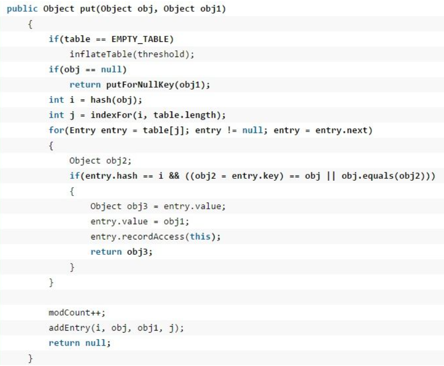
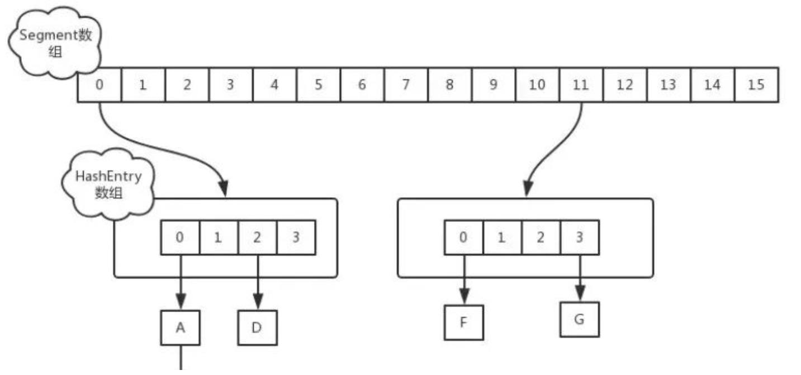
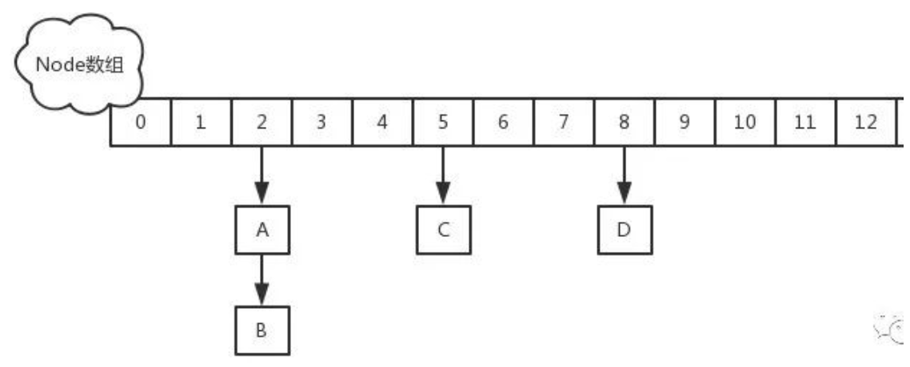

## 一、HashMap

### 1、HashMap 有什么特点？

JDK8 之前底层实现是数组 + [链表](https://www.cxyxiaowu.com/16044.html)，JDK8 改为数组 + [链表](https://www.cxyxiaowu.com/16044.html)/[红黑树](https://www.cxyxiaowu.com/15707.html)，节点类型从Entry 变更为 Node。主要成员变量包括存储数据的 table 数组、元素数量 size、加载因子 loadFactor。

table 数组记录 HashMap 的数据，每个下标对应一条[链表](https://www.cxyxiaowu.com/16044.html)，所有哈希冲突的数据都会被存放到同一条[链表](https://www.cxyxiaowu.com/16044.html)，Node/Entry 节点包含四个成员变量：key、value、next 指针和 hash 值。

HashMap 中数据以键值对的形式存在，键对应的 hash 值用来计算数组下标，如果两个元素 key 的 hash 值一样，就会发生哈希冲突，被放到同一个[链表](https://www.cxyxiaowu.com/16044.html)上，为使查询效率尽可能高，键的 hash 值要尽可能分散。

HashMap 默认初始化容量为 16，扩容容量必须是 2 的幂次方、最大容量为 1<< 30 、默认加载因子为 0.75。

### 2、HashMap 相关方法的源码？

**JDK8 之前**

**hash：计算元素 key 的散列值**

① 处理 String 类型时，调用 `stringHash32` 方法获取 hash 值。

② 处理其他类型数据时，提供一个相对于 HashMap 实例唯一不变的随机值 hashSeed 作为计算初始量。

③ 执行异或和无符号右移使 hash 值更加离散，减小哈希冲突概率。

**indexFor：计算元素下标**

将 hash 值和数组长度-1 进行与操作，保证结果不会超过 table 数组范围。

**get：获取元素的 value 值**

① 如果 key 为 null，调用 `getForNullKey` 方法，如果 size 为 0 表示[链表](https://www.cxyxiaowu.com/16044.html)为空，返回 null。如果 size 不为 0 说明存在[链表]()，遍历 table[0] [链表](https://www.cxyxiaowu.com/16044.html)，如果找到了 key 为 null 的节点则返回其 value，否则返回 null。

② 如果 key 为 不为 null，调用 `getEntry` 方法，如果 size 为 0 表示[链表](https://www.cxyxiaowu.com/16044.html)为空，返回 null 值。如果 size 不为 0，首先计算 key 的 hash 值，然后遍历该[链表](https://www.cxyxiaowu.com/16044.html)的所有节点，如果节点的 key 和 hash 值都和要查找的元素相同则返回其 Entry 节点。

③ 如果找到了对应的 Entry 节点，调用 `getValue` 方法获取其 value 并返回，否则返回 null。

**put：添加元素**

① 如果 key 为 null，直接存入 table[0]。

② 如果 key 不为 null，计算 key 的 hash 值。

③ 调用 `indexFor` 计算元素存放的下标 i。

④ 遍历 table[i] 对应的[链表](https://www.cxyxiaowu.com/16044.html)，如果 key 已存在，就更新 value 然后返回旧 value。

⑤ 如果 key 不存在，将 modCount 值加 1，使用 `addEntry` 方法增加一个节点并返回 null。

**resize：扩容数组**

① 如果当前容量达到了最大容量，将阈值设置为 Integer 最大值，之后扩容不再触发。

② 否则计算新的容量，将阈值设为 `newCapacity x loadFactor` 和 `最大容量 + 1` 的较小值。

③ 创建一个容量为 newCapacity 的 Entry 数组，调用 `transfer` 方法将旧数组的元素转移到新数组。

**transfer：转移元素**

① 遍历旧数组的所有元素，调用 `rehash` 方法判断是否需要哈希重构，如果需要就重新计算元素 key 的 hash 值。

② 调用 `indexFor` 方法计算元素存放的下标 i，利用头插法将旧数组的元素转移到新数组。

**JDK8**

**hash：计算元素 key 的散列值**

如果 key 为 null 返回 0，否则就将 key 的 `hashCode` 方法返回值高低16位异或，让尽可能多的位参与运算，让结果的 0 和 1 分布更加均匀，降低哈希冲突概率。

**put：添加元素**

① 调用 `putVal` 方法添加元素。

② 如果 table 为空或长度为 0 就进行扩容，否则计算元素下标位置，不存在就调用 `newNode` 创建一个节点。

③ 如果存在且是[链表](https://www.cxyxiaowu.com/16044.html)，如果首节点和待插入元素的 hash 和 key 都一样，更新节点的 value。

④ 如果首节点是 TreeNode 类型，调用 `putTreeVal` 方法增加一个树节点，每一次都比较插入节点和当前节点的大小，待插入节点小就往左子树查找，否则往右子树查找，找到空位后执行两个方法：`balanceInsert` 方法，插入节点并调整平衡、`moveRootToFront` 方法，由于调整平衡后根节点可能变化，需要重置根节点。

⑤ 如果都不满足，遍历[链表](https://www.cxyxiaowu.com/16044.html)，根据 hash 和 key 判断是否重复，决定更新 value 还是新增节点。如果遍历到了[链表](https://www.cxyxiaowu.com/16044.html)末尾则添加节点，如果达到建树阈值 7，还需要调用 `treeifyBin` 把[链表](https://www.cxyxiaowu.com/16044.html)重构为[红黑树](https://www.cxyxiaowu.com/15707.html)。

⑥ 存放元素后将 modCount 加 1，如果 `++size > threshold` ，调用 `resize` 扩容。

**get ：获取元素的 value 值**

① 调用 `getNode` 方法获取 Node 节点，如果不是 null 就返回其 value 值，否则返回 null。

② `getNode` 方法中如果数组不为空且存在元素，先比较第一个节点和要查找元素的 hash 和 key ，如果都相同则直接返回。

③ 如果第二个节点是 TreeNode 类型则调用 `getTreeNode` 方法进行查找，否则遍历[链表](https://www.cxyxiaowu.com/16044.html)根据 hash 和 key 查找，如果没有找到就返回 null。

**resize：扩容数组**

重新规划长度和阈值，如果长度发生了变化，部分数据节点也要重新排列。

**重新规划长度**

① 如果当前容量 `oldCap > 0` 且达到最大容量，将阈值设为 Integer 最大值，return 终止扩容。

② 如果未达到最大容量，当 `oldCap << 1` 不超过最大容量就扩大为 2 倍。

③ 如果都不满足且当前扩容阈值 `oldThr > 0`，使用当前扩容阈值作为新容量。

④ 否则将新容量置为默认初始容量 16，新扩容阈值置为 12。

**重新排列数据节点**

① 如果节点为 null 不进行处理。

② 如果节点不为 null 且没有next节点，那么通过节点的 hash 值和 `新容量-1` 进行与运算计算下标存入新的 table 数组。

③ 如果节点为 TreeNode 类型，调用 `split` 方法处理，如果节点数 hc 达到6 会调用 `untreeify` 方法转回[链表](https://www.cxyxiaowu.com/16044.html)。

④ 如果是[链表](https://www.cxyxiaowu.com/16044.html)节点，需要将[链表](https://www.cxyxiaowu.com/16044.html)拆分为 hash 值超出旧容量的[链表](https://www.cxyxiaowu.com/16044.html)和未超出容量的[链表](https://www.cxyxiaowu.com/16044.html)。对于`hash & oldCap == 0` 的部分不需要做处理，否则需要放到新的下标位置上，新下标 = 旧下标 + 旧容量。

### 3、HashMap 为什么线程不安全？

JDK7 存在死循环和数据丢失问题。

**数据丢失：**

- **并发赋值被覆盖：** 在 `createEntry` 方法中，新添加的元素直接放在头部，使元素之后可以被更快访问，但如果两个线程同时执行到此处，会导致其中一个线程的赋值被覆盖。
- **已遍历区间新增元素丢失：** 当某个线程在 `transfer` 方法迁移时，其他线程新增的元素可能落在已遍历过的哈希槽上。遍历完成后，table 数组引用指向了 newTable，新增元素丢失。
- **新表被覆盖：** 如果 `resize` 完成，执行了 `table = newTable`，则后续元素就可以在新表上进行插入。但如果多线程同时 `resize` ，每个线程都会 new 一个数组，这是线程内的局部对象，线程之间不可见。迁移完成后`resize` 的线程会赋值给 table 线程共享变量，可能会覆盖其他线程的操作，在新表中插入的对象都会被丢弃。

**死循环：** 扩容时 `resize` 调用 `transfer` 使用头插法迁移元素，虽然 newTable 是局部变量，但原先 table 中的 Entry [链表](https://www.cxyxiaowu.com/16044.html)是共享的，问题根源是 Entry 的 next 指针并发修改，某线程还没有将 table 设为 newTable 时用完了 CPU 时间片，导致数据丢失或死循环。


### 4、**hashMap底层？为什么jdk1.8要用红黑树实现？什么时候会出现线程不安全？怎么解决线程不安全？默认初始容量是16，如果我改成7，容量会变成7么？？为什么？**

在JDK1.6，JDK1.7中，HashMap采用位桶+链表实现，即使用链表处理冲突，同一hash值的链表都存储在一个链表里。但是当位于一个桶中的元素较多，即hash值相等的元素较多时，通过key值依次查找的效率较低。而JDK1.8中，HashMap采用位桶+链表+红黑树实现，当链表长度超过阈值（8）时，将链表转换为红黑树，**这样大大减少了查找时间。**

**不安全原因：**

(1) 在put的时候，因为该方法不是同步的，假如有两个线程A,B它们的put的key的hash值相同，不论是从头插入还是从尾插入，假如A获取了插入位置为x，但是还未插入，此时B也计算出待插入位置为x，则不论AB插入的先后顺序肯定有一个会丢失

**以下是put方法**



(2) 在扩容的时候，jdk1.8之前是采用头插法，当两个线程同时检测到hashmap需要扩容，在进行同时扩容的时候有可能会造成链表的循环，主要原因就是，采用头插法，新链表与旧链表的顺序是反的，在1.8后采用尾插法就不会出现这种问题，同时1.8的链表长度如果大于8就会转变成红黑树。

**默认容量为16的原因：**

关于这个默认容量的选择，JDK并没有给出官方解释，笔者也没有在网上找到关于这个任何有价值的资料。（如果哪位有相关的权威资料或者想法，可以留言交流）

根据作者的推断，这应该就是个**经验值（Experience Value）**，既然一定要设置一个默认的2^n 作为初始值，那么就需要在效率和内存使用上做一个权衡。这个值既不能太小，也不能太大。

太小了就有可能频繁发生扩容，影响效率。太大了又浪费空间，不划算。

所以，16就作为一个经验值被采用了。


JDK8 在 `resize` 方法中完成扩容，并改用尾插法，不会产生死循环，但并发下仍可能丢失数据。可用 ConcurrentHashMap 或 `Collections.synchronizedMap` 包装成同步集合。

hashmap组成

寻找算法

扩容算法

put get过程

红黑树二叉树 B+树的区别


## 二、Arraylist

### 1、说一说 ArrayList

**ArrayList** 是容量可变的非线程安全列表，使用数组实现，集合扩容时会创建更大的数组，把原有数组复制到新数组。支持对元素的快速随机访问，但插入与删除速度很慢。ArrayList 实现了 RandomAcess 标记接口，如果一个类实现了该接口，那么表示使用索引遍历比迭代器更快。

**elementData**是 ArrayList 的数据域，被 transient 修饰，序列化时会调用 writeObject 写入流，反序列化时调用 readObject 重新赋值到新对象的 elementData。原因是 elementData 容量通常大于实际存储元素的数量，所以只需发送真正有实际值的数组元素。

**size** 是当前实际大小，elementData 大小大于等于 size。

**modCount** 记录了 ArrayList 结构性变化的次数，继承自 AbstractList。所有涉及结构变化的方法都会增加该值。expectedModCount 是迭代器初始化时记录的 modCount 值，每次访问新元素时都会检查 modCount 和 expectedModCount 是否相等，不相等就会抛出异常。这种机制叫做 fail-fast，所有集合类都有这种机制。


## 三、Linkedlist

### 1、说一说 LinkedList

**LinkedList** 本质是双向[链表](https://www.cxyxiaowu.com/16044.html)，与 ArrayList 相比插入和删除速度更快，但随机访问元素很慢。除继承 AbstractList 外还实现了 Deque 接口，这个接口具有队列和栈的性质。成员变量被 transient 修饰，原理和 ArrayList 类似。

LinkedList 包含三个重要的成员：size、first 和 last。size 是双向[链表](https://www.cxyxiaowu.com/16044.html)中节点的个数，first 和 last 分别指向首尾节点的引用。

LinkedList 的优点在于可以将零散的内存单元通过附加引用的方式关联起来，形成按链路顺序查找的线性结构，内存利用率较高。


## 四、Set

### 1、Set 有什么特点，有哪些实现？

**Set** 不允许元素重复且无序，常用实现有 HashSet、LinkedHashSet 和 TreeSet。

**HashSet** 通过 HashMap 实现，HashMap 的 Key 即 HashSet 存储的元素，所有 Key 都使用相同的 Value ，一个名为 PRESENT 的 Object 类型常量。使用 Key 保证元素唯一性，但不保证有序性。由于 HashSet 是 HashMap 实现的，因此线程不安全。

HashSet 判断元素是否相同时，对于包装类型直接按值比较。对于引用类型先比较 hashCode 是否相同，不同则代表不是同一个对象，相同则继续比较 equals，都相同才是同一个对象。

**LinkedHashSet** 继承自 HashSet，通过 LinkedHashMap 实现，使用双向[链表](https://www.cxyxiaowu.com/16044.html)维护元素插入顺序。

**TreeSet** 通过 TreeMap 实现的，添加元素到集合时按照比较规则将其插入合适的位置，保证插入后的集合仍然有序。


## 五、TreeMap

### 1、TreeMap 有什么特点？

TreeMap 基于[红黑树](https://www.cxyxiaowu.com/15707.html)实现，增删改查的平均和最差时间复杂度均为 O(log~~n~~) ，最大特点是 Key 有序。Key 必须实现 Comparable 接口或提供的 Comparator 比较器，所以 Key 不允许为 null。

HashMap 依靠 `hashCode` 和 `equals` 去重，而 TreeMap 依靠 Comparable 或 Comparator。 TreeMap 排序时，如果比较器不为空就会优先使用比较器的 `compare` 方法，否则使用 Key 实现的 Comparable 的 `compareTo` 方法，两者都不满足会抛出异常。

TreeMap 通过 `put` 和 `deleteEntry` 实现增加和删除树节点。插入新节点的规则有三个：① 需要调整的新节点总是红色的。② 如果插入新节点的父节点是黑色的，不需要调整。③ 如果插入新节点的父节点是红色的，由于[红黑树](https://www.cxyxiaowu.com/15707.html)不能出现相邻红色，进入循环判断，通过重新着色或左右旋转来调整。TreeMap 的插入操作就是按照 Key 的对比往下遍历，大于节点值向右查找，小于向左查找，先按照二叉查找树的特性操作，后续会重新着色和旋转，保持[红黑树](https://www.cxyxiaowu.com/15707.html)的特性。

## 五、ConcurrentHashMap


## 六、21 个刁钻的 HashMap 面试题

#### **1：HashMap 的数据结构？**

A：哈希表结构（链表散列：数组+链表）实现，结合数组和链表的优点。当链表长度超过 8 时，链表转换为红黑树。

```go
transient Node<K,V>\[\] table;
```

#### **2：HashMap 的工作原理？**

HashMap 底层是 hash 数组和单向链表实现，数组中的每个元素都是链表，由 Node 内部类（实现 Map.Entry接口）实现，HashMap 通过 put & get 方法存储和获取。

存储对象时，将 K/V 键值传给 put() 方法：

①、调用 hash(K) 方法计算 K 的 hash 值，然后结合数组长度，计算得数组下标；

②、调整数组大小（当容器中的元素个数大于 capacity * loadfactor 时，容器会进行扩容resize 为 2n）；

③、i.如果 K 的 hash 值在 HashMap 中不存在，则执行插入，若存在，则发生碰撞；

ii.如果 K 的 hash 值在 HashMap 中存在，且它们两者 equals 返回 true，则更新键值对；

iii. 如果 K 的 hash 值在 HashMap 中存在，且它们两者 equals 返回 false，则插入链表的尾部（尾插法）或者红黑树中（树的添加方式）。

（JDK 1.7 之前使用头插法、JDK 1.8 使用尾插法）（注意：当碰撞导致链表大于 TREEIFY_THRESHOLD = 8 时，就把链表转换成红黑树）

获取对象时，将 K 传给 get() 方法：①、调用 hash(K) 方法（计算 K 的 hash 值）从而获取该键值所在链表的数组下标；②、顺序遍历链表，equals()方法查找相同 Node 链表中 K 值对应的 V 值。

hashCode 是定位的，存储位置；equals是定性的，比较两者是否相等。

#### **3.当两个对象的 hashCode 相同会发生什么？**

[因为 hashCode 相同，不一定就是相等的（equals方法比较），所以两个对象所在数组的下标相同，"碰撞"就此发生。又因为 HashMap 使用链表存储对象，这个 Node 会存储到链表中。为什么要重写 hashcode 和 equals 方法？推荐看下。](http://mp.weixin.qq.com/s?__biz=MzI2MTIzMzY3Mw%3D%3D&chksm=ea5cdb7ddd2b526bcb46214f83f80859c8603497323a3cf933e511b6f018af666dd74b0e584d&idx=4&mid=2247489051&scene=21&sn=651c4a067c2f1d59151f484475144c20#wechat_redirect)

#### **4.你知道 hash 的实现吗？为什么要这样实现？**

JDK 1.8 中，是通过 hashCode() 的高 16 位异或低 16 位实现的：(h = k.hashCode()) ^ (h >>> 16)，主要是从速度，功效和质量来考虑的，减少系统的开销，也不会造成因为高位没有参与下标的计算，从而引起的碰撞。

#### **5.为什么要用异或运算符？**

保证了对象的 hashCode 的 32 位值只要有一位发生改变，整个 hash() 返回值就会改变。尽可能的减少碰撞。

#### **6.HashMap 的 table 的容量如何确定？loadFactor 是什么？该容量如何变化？这种变化会带来什么问题？**

[①、table 数组大小是由 capacity 这个参数确定的，默认是16，也可以构造时传入，最大限制是1<<30；](http://mp.weixin.qq.com/s?__biz=MzI2MTIzMzY3Mw%3D%3D&chksm=ea5cdaa0dd2b53b67ac2b9ba12935e13cb59250180fa302bd61629968e24f8853f208790fe80&idx=4&mid=2247489478&scene=21&sn=ad7321cd1948f0c8eaf955aaaa7a2046#wechat_redirect)

[②、loadFactor 是装载因子，主要目的是用来确认table 数组是否需要动态扩展，默认值是0.75，比如table 数组大小为 16，装载因子为 0.75 时，threshold 就是12，当 table 的实际大小超过 12 时，table就需要动态扩容；](http://mp.weixin.qq.com/s?__biz=MzI2MTIzMzY3Mw%3D%3D&chksm=ea5cdaa0dd2b53b67ac2b9ba12935e13cb59250180fa302bd61629968e24f8853f208790fe80&idx=4&mid=2247489478&scene=21&sn=ad7321cd1948f0c8eaf955aaaa7a2046#wechat_redirect)

[③、扩容时，调用 resize() 方法，将 table 长度变为原来的两倍（注意是 table 长度，而不是 threshold）](http://mp.weixin.qq.com/s?__biz=MzI2MTIzMzY3Mw%3D%3D&chksm=ea5cdaa0dd2b53b67ac2b9ba12935e13cb59250180fa302bd61629968e24f8853f208790fe80&idx=4&mid=2247489478&scene=21&sn=ad7321cd1948f0c8eaf955aaaa7a2046#wechat_redirect)

④、如果数据很大的情况下，扩展时将会带来性能的损失，在性能要求很高的地方，这种损失很可能很致命。

#### **7.HashMap中put方法的过程？**

答：“调用哈希函数获取Key对应的hash值，再计算其数组下标；

如果没有出现哈希冲突，则直接放入数组；如果出现哈希冲突，则以链表的方式放在链表后面；

如果链表长度超过阀值( TREEIFY THRESHOLD==8)，就把链表转成红黑树，链表长度低于6，就把红黑树转回链表;

如果结点的key已经存在，则替换其value即可；

如果集合中的键值对大于12，调用resize方法进行数组扩容。”

#### **8.数组扩容的过程？**

创建一个新的数组，其容量为旧数组的两倍，并重新计算旧数组中结点的存储位置。结点在新数组中的位置只有两种，原下标位置或原下标+旧数组的大小。

#### **9.拉链法导致的链表过深问题为什么不用二叉查找树代替，而选择红黑树？为什么不一直使用红黑树？**

[之所以选择红黑树是为了解决二叉查找树的缺陷，二叉查找树在特殊情况下会变成一条线性结构（这就跟原来使用链表结构一样了，造成很深的问题），遍历查找会非常慢。推荐：面试问红黑树，我脸都绿了。](http://mp.weixin.qq.com/s?__biz=MzI2MTIzMzY3Mw%3D%3D&chksm=ea5cdb15dd2b5203cd904cdadf8e1061b6e1e6af6a51c9116eceee4313f889945e529381162d&idx=2&mid=2247489139&scene=21&sn=9670f4aa9a1b240352b5387f776fb284#wechat_redirect)

[而红黑树在插入新数据后可能需要通过左旋，右旋、变色这些操作来保持平衡，引入红黑树就是为了查找数据快，解决链表查询深度的问题，我们知道红黑树属于平衡二叉树，但是为了保持“平衡”是需要付出代价的，但是该代价所损耗的资源要比遍历线性链表要少，所以当长度大于8的时候，会使用红黑树，如果链表长度很短的话，根本不需要引入红黑树，引入反而会慢。](http://mp.weixin.qq.com/s?__biz=MzI2MTIzMzY3Mw%3D%3D&chksm=ea5cdb15dd2b5203cd904cdadf8e1061b6e1e6af6a51c9116eceee4313f889945e529381162d&idx=2&mid=2247489139&scene=21&sn=9670f4aa9a1b240352b5387f776fb284#wechat_redirect)

#### **10.说说你对红黑树的见解？**

- 每个节点非红即黑
- 根节点总是黑色的
- 如果节点是红色的，则它的子节点必须是黑色的（反之不一定）
- 每个叶子节点都是黑色的空节点（NIL节点）
- 从根节点到叶节点或空子节点的每条路径，必须包含相同数目的黑色节点（即相同的黑色高度）

#### 

#### **11.jdk8中对HashMap做了哪些改变？**

在java 1.8中，如果链表的长度超过了8，那么链表将转换为红黑树。（桶的数量必须大于64，小于64的时候只会扩容）

发生hash碰撞时，java 1.7 会在链表的头部插入，而java 1.8会在链表的尾部插入

在java 1.8中，Entry被Node替代(换了一个马甲。

#### **12.HashMap，LinkedHashMap，TreeMap 有什么区别？**

HashMap 参考其他问题；关注微信公众号：互联网架构师，在后台回复：2T，可以获取架构师资源干货。

LinkedHashMap 保存了记录的插入顺序，在用 Iterator 遍历时，先取到的记录肯定是先插入的；遍历比 HashMap 慢；

TreeMap 实现 SortMap 接口，能够把它保存的记录根据键排序（默认按键值升序排序，也可以指定排序的比较器）

#### **13.HashMap & TreeMap & LinkedHashMap 使用场景？**

一般情况下，使用最多的是 HashMap。

HashMap：在 Map 中插入、删除和定位元素时；

TreeMap：在需要按自然顺序或自定义顺序遍历键的情况下；

LinkedHashMap：在需要输出的顺序和输入的顺序相同的情况下。

#### **14.HashMap 和 HashTable 有什么区别？**

①、HashMap 是线程不安全的，HashTable 是线程安全的；

②、由于线程安全，所以 HashTable 的效率比不上 HashMap；

③、HashMap最多只允许一条记录的键为null，允许多条记录的值为null，而 HashTable不允许；

④、HashMap 默认初始化数组的大小为16，HashTable 为 11，前者扩容时，扩大两倍，后者扩大两倍+1；

⑤、HashMap 需要重新计算 hash 值，而 HashTable 直接使用对象的 hashCode

#### **15.Java 中的另一个线程安全的与 HashMap 极其类似的类是什么？同样是线程安全，它与 HashTable 在线程同步上有什么不同？**

ConcurrentHashMap 类（是 Java并发包 java.util.concurrent 中提供的一个线程安全且高效的 HashMap 实现）。

HashTable 是使用 synchronize 关键字加锁的原理（就是对对象加锁）；

而针对 ConcurrentHashMap，在 JDK 1.7 中采用 分段锁的方式；JDK 1.8 中直接采用了CAS（无锁算法）+ synchronized。

#### **16.HashMap & ConcurrentHashMap 的区别？**

除了加锁，原理上无太大区别。另外，HashMap 的键值对允许有null，但是ConCurrentHashMap 都不允许。

#### **17.为什么 ConcurrentHashMap 比 HashTable 效率要高？**

HashTable 使用一把锁（锁住整个链表结构）处理并发问题，多个线程竞争一把锁，容易阻塞；

ConcurrentHashMap

- JDK 1.7 中使用分段锁（ReentrantLock + Segment + HashEntry），相当于把一个 HashMap 分成多个段，每段分配一把锁，这样支持多线程访问。锁粒度：基于 Segment，包含多个 HashEntry。

- JDK 1.8 中使用 CAS + synchronized + Node + 红黑树。锁粒度：Node（首结

  点）（实现 Map.Entry）。锁粒度降低了。

#### 

#### **18.针对 ConcurrentHashMap 锁机制具体分析（JDK 1.7 VS JDK 1.8）**

JDK 1.7 中，采用分段锁的机制，实现并发的更新操作，底层采用数组+链表的存储结构，包括两个核心静态内部类 Segment 和 HashEntry。

①、Segment 继承 ReentrantLock（重入锁） 用来充当锁的角色，每个 Segment 对象守护每个散列映射表的若干个桶；

②、HashEntry 用来封装映射表的键-值对；

③、每个桶是由若干个 HashEntry 对象链接起来的链表



JDK 1.8 中，采用Node + CAS + Synchronized来保证并发安全。取消类 Segment，直接用 table 数组存储键值对；当 HashEntry 对象组成的链表长度超过 TREEIFY_THRESHOLD 时，链表转换为红黑树，提升性能。底层变更为数组 + 链表 + 红黑树。



#### **19.ConcurrentHashMap 在 JDK 1.8 中，为什么要使用内置锁 synchronized 来代替重入锁 ReentrantLock？**

①、粒度降低了；

②、JVM 开发团队没有放弃 synchronized，而且基于 JVM 的 synchronized 优化空间更大，更加自然。

③、在大量的数据操作下，对于 JVM 的内存压力，基于 API 的 ReentrantLock 会开销更多的内存。

#### 

#### **20.ConcurrentHashMap 简单介绍？**

**①、重要的常量：**

private transient volatile int sizeCtl;

当为负数时，-1 表示正在初始化，-N 表示 N - 1 个线程正在进行扩容；

当为 0 时，表示 table 还没有初始化；

当为其他正数时，表示初始化或者下一次进行扩容的大小。

**②、数据结构：**

Node 是存储结构的基本单元，继承 HashMap 中的 Entry，用于存储数据；

TreeNode 继承 Node，但是数据结构换成了二叉树结构，是红黑树的存储结构，用于红黑树中存储数据；

TreeBin 是封装 TreeNode 的容器，提供转换红黑树的一些条件和锁的控制。

**③、存储对象时（put() 方法）：**

如果没有初始化，就调用 initTable() 方法来进行初始化；

如果没有 hash 冲突就直接 CAS 无锁插入；

如果需要扩容，就先进行扩容；

如果存在 hash 冲突，就加锁来保证线程安全，两种情况：一种是链表形式就直接遍历

到尾端插入，一种是红黑树就按照红黑树结构插入；

如果该链表的数量大于阀值 8，就要先转换成红黑树的结构，break 再一次进入循环

如果添加成功就调用 addCount() 方法统计 size，并且检查是否需要扩容。

**④、扩容方法 transfer()：默认容量为 16，扩容时，容量变为原来的两倍。**

helpTransfer()：调用多个工作线程一起帮助进行扩容，这样的效率就会更高。

**⑤、获取对象时（get()方法）：**

计算 hash 值，定位到该 table 索引位置，如果是首结点符合就返回；

如果遇到扩容时，会调用标记正在扩容结点 ForwardingNode.find()方法，查找该结点，匹配就返回；

以上都不符合的话，就往下遍历结点，匹配就返回，否则最后就返回 null。

#### 

#### **21.ConcurrentHashMap 的并发度是什么？**

程序运行时能够同时更新 ConccurentHashMap 且不产生锁竞争的最大线程数。默认为 16，且可以在构造函数中设置。

当用户设置并发度时，ConcurrentHashMap 会使用大于等于该值的最小2幂指数作为实际并发度（假如用户设置并发度为17，实际并发度则为32）


#### 22、HashMap 的 table 的容量如何确定？loadFactor 是什么？该容量如何变化？这种变化会带来什么问题？

①、table 数组大小是由 capacity 这个参数确定的，默认是 16，也可以构造时传入，最大限制是 1<<30；

②、loadFactor 是装载因子，主要目的是用来确认 table 数组是否需要动态扩展，默认值是 0.75，比如 table 数组大小为 16，装载因子为 0.75 时，threshold 就是 12，当 table 的实际大小超过 12 时，table 就需要动态扩容；

③、扩容时，调用 resize() 方法，将 table 长度变为原来的两倍（注意是 table 长度，而不是 threshold

④、如果数据很大的情况下，扩展时将会带来性能的损失，在性能要求很高的地方，这种损失很可能很致命。
