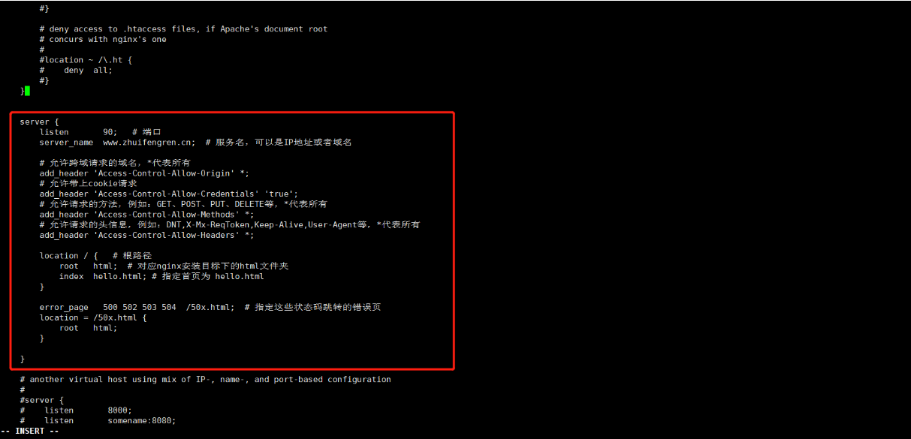
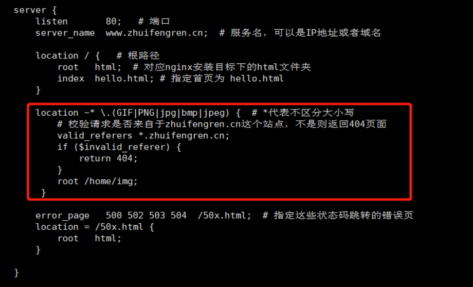

## 一、概述Nginx的高级使用

**1、概述**

之前介绍过Nginx的简单使用，今天来聊聊Nginx的一些高级使用。

**2、使用Nginx解决跨域问题**

当公司存在多个域名时，两个不同的域名相互访问就会存在跨域问题。

或者在进行前端开发时，通常前端代码在本地启动，而后端代码会部署在一台专用的后端开发服务器上，此时前端去调用后端接口时，就会出现跨域问题。

解决跨域的方法有很多，今天来说一下如何使用Nginx来解决跨域问题。

假设后端服务器，是使用Nginx作为对外统一入口的，在Nginx配置文件的server块中增加如下配置：

```nginx
# 允许跨域请求的域名，*代表所有
add_header 'Access-Control-Allow-Origin' *;
# 允许带上cookie请求
add_header 'Access-Control-Allow-Credentials' 'true';
# 允许请求的方法，例如：GET、POST、PUT、DELETE等，*代表所有
add_header 'Access-Control-Allow-Methods' *;
# 允许请求的头信息，例如：DNT,X-Mx-ReqToken,Keep-Alive,User-Agent等，*代表所有
add_header 'Access-Control-Allow-Headers' *;
```



 重新加载Nginx，便发现，已经可以跨域访问了。

**3、验证头信息中的 referer 参数**

 请求头信息中的 referer 参数，记录了上一个页面的地址，Nginx可以对其进行校验，达到防盗链的目的。

 通常在配置文件的location块中增加配置。

```nginx
server {
        listen       80;   # 端口
        server_name  www.zhuifengren.cn;  # 服务名，可以是IP地址或者域名

        location / {   # 根路径
　　　　　　root   html;  # 对应nginx安装目标下的html文件夹
            index  hello.html; # 指定首页为 hello.html
        }

        location ~* \.(GIF|PNG|jpg|bmp|jpeg) {  # *代表不区分大小写
            # 校验请求是否来自于zhuifengren.cn这个站点，不是则返回404页面
        　　valid_referers *.zhuifengren.cn;
        　　if ($invalid_referer) {
               return 404;
        　　}
　　　　　  root /home/img;
　　　　}

        error_page   500 502 503 504  /50x.html;  # 指定这些状态码跳转的错误页
        location = /50x.html {
            root   html;
        }

    }
```



**4、Nginx构建Tomcat集群**

Nginx最常用的一个功能，就是为Tomcat构建集群，以达到实现高并发、高可用的目的。

首先在 upstream 块中，配置Tomcat集群中的服务地址，然后在location块中配置转发请求到此 upstream。

```nginx
# 配置Tomcat集群中的服务器
    upstream zhuifengren {
        server 192.168.1.101:8080;
        server 192.168.1.102:8080;
        server 192.168.1.103:8080;
    

    server {
        listen  80;
        server_name     www.zhuifengren.cn;

        location / {
                proxy_pass      http://zhuifengren;
        }

    }
```

默认按所有机器权重为1的轮询方式对集群服务进行访问，每个服务访问1次，然后访问下一个服务，适合集群中每台服务器性能差不多的情况。

**权重**配置也是经常用的，适用于机器性能有差异的情况。

```nginx
upstream zhuifengren {
　　server 192.168.1.101:8080  weight=1;
　　server 192.168.1.102:8080;
　　server 192.168.1.103:8080  weight=3;
}
```

weight 就是权重配置，不配默认是1，按照以上配置，在5次请求中，101和102会被访问1次，103会被访问3次。

 

使用**down**，可以标识某个服务已停用，Nginx便不会去访问他了。

```nginx
  upstream zhuifengren {
        server 192.168.1.101:8080;
        server 192.168.1.102:8080 down;
        server 192.168.1.103:8080;
    }
```

使用**backup**，可以标识101是备用机，当102、103宕机后，101会进行服务。

```nginx
　　upstream zhuifengren {
        server 192.168.1.101:8080 backup;
        server 192.168.1.102:8080;
        server 192.168.1.103:8080;
    }
```

使用 **max_fails** 和 **fail_timeout** 将服务动态停用

max_fails 默认是1，fail_timeout默认是10s

```nginx
　　upstream zhuifengren {
        server 192.168.1.101:8080 max_fails=2 fail_timeout=10s;
        server 192.168.1.102:8080;
        server 192.168.1.103:8080;
    }
```

如此配置，101服务器在10秒内如果失败次数达到2次，会停用10秒。10秒后，会尝试连接101服务器，如果连接成功则恢复轮询方式，如果不成功，再等待10秒尝试。

**5、使用keepalive设置长链接数量，提高吞吐量**

```nginx
　　upstream zhuifengren {
        server 192.168.1.101:8080;
        server 192.168.1.102:8080;
        server 192.168.1.103:8080;
        
        keepalive 50;
    }

     server {
        listen  80;
        server_name     www.zhuifengren.cn;

        location / {
                proxy_pass      http://zhuifengren;
                
                proxy_http_version    1.1;
                proxy_set_header    Connection "";
        }

    }
```

需要在upstream块中增加 keepalive 配置，在server的location块中增加 proxy_http_version 和 proxy_set_header 配置。

这样设置可以减少连接断开、新建的损耗，增加吞吐量。

**6、其他负载均衡策略**

除了前面说到的轮询方式，Nginx在负载均衡时，还有其他策略。

ip_hash：以客户端IP地址为依据，匹配服务器。

hash $request_uri：以请求的URL为依据，匹配服务器。

least_conn：以服务器连接数为依据，哪个服务器连接数少，匹配哪台服务器。

配置在upstream块中。

```nginx
　　upstream zhuifengren {
    
        # ip_hash;
        # hash $request_uri;
        least_conn;
    
        server 192.168.1.101:8080;
        server 192.168.1.102:8080;
        server 192.168.1.103:8080;

    }
```

修改nginx文件后进行重新加载文件指令：./nginx -s reload


### 1、正向代理和反向代理

1. **什么是代理服务器**

所谓代理服务器就是位于发起请求的客户端与原始服务器端之间的一台跳板服务器，正向代理可以隐藏客户端，反向代理可以隐藏原始服务器。

**2. 正向代理**

用户知道目标服务器地址，但由于网络限制等原因，无法直接访问。这时候需要先连接代理服务器，然后再由代理服务器访问目标服务器。


**3. 反向代理**

反向代理对用户则是不可知的，比如我们访问百度网站，百度的代理服务器对外的域名为 [https://www.baidu.com](https://link.zhihu.com/?target=https%3A//www.baidu.com) 。具体内部的服务器节点我们不知道，现实中我们通过访问百度的代理服务器后，代理服务器给我们转发请求到他们N多的服务器节点中的一个给我们进行搜索后将结果返回。


### 2、负载均衡

轮询、加权轮询、 IP hash


### 3、动静分离


