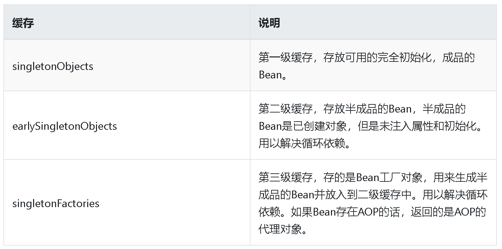
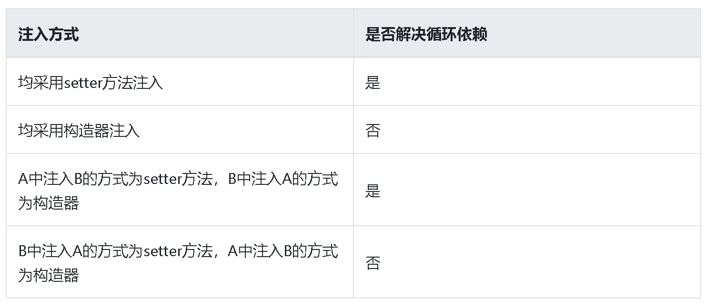
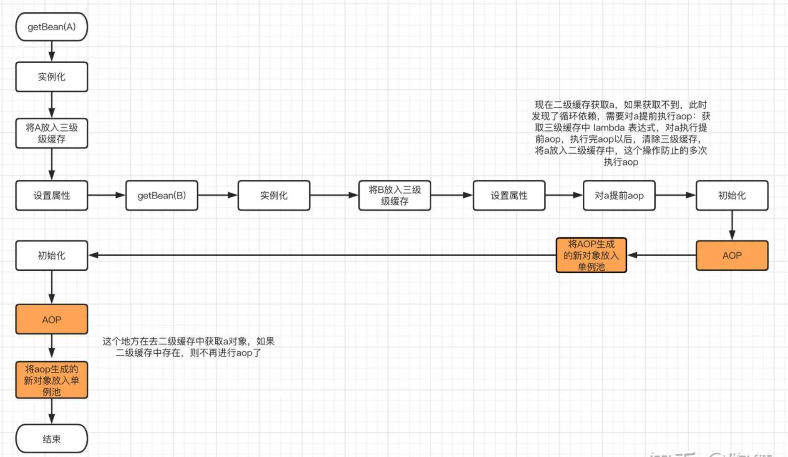
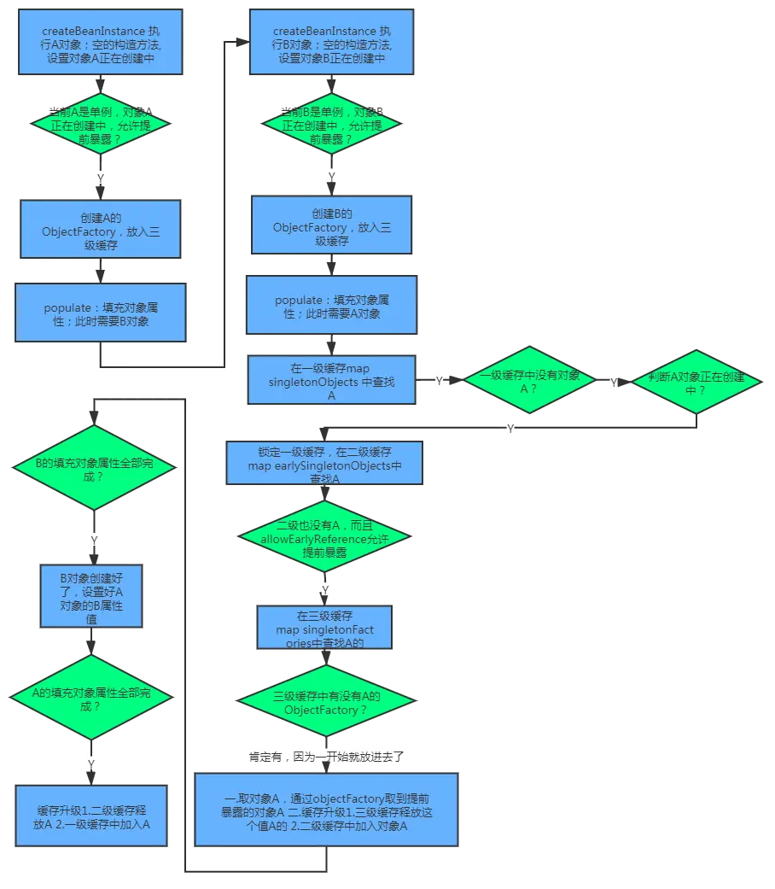
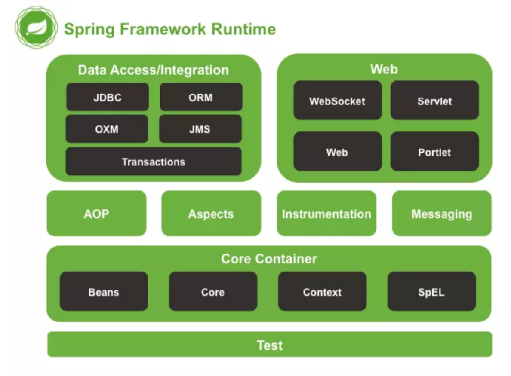
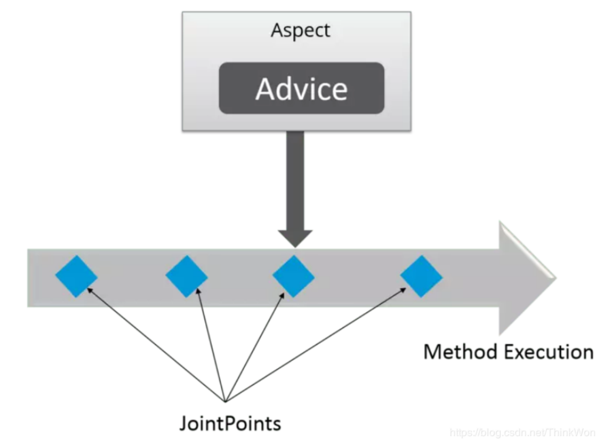

一、Spring初始化Bean的过程

几个方法名字，bean的Scope，主要说sigleton。里面有很多的设计模式也可以说下


## 一、Spring-三级缓存和循环依赖

## 1. 循环依赖

什么是依赖注入？假设有两个类A和B，A在实例化的时候需要B的实例，而B在实例化时又需要A的实例，在类的实例化过程就陷入死循环。这也就是传统逻辑上的，“到底是先有鸡，还是先有蛋”的问题？
下面举一个例子,定义了两个类Type和Org：

```java
// Org.java
@Data
@Component
public class Org {
    private final Role role;

    public Org(Role role) {
        this.role = role;
    }
}

// Role.java
@Data
@Component
public class Role {
    private final Org org;

    public Role(Org org) {
        this.org = org;
    }
}
```

这是spring中典型的构造器注入方式，其实也代表了普通非spring bean之间，相互依赖时的实例化过程，但结果在运行的时候直接报循环依赖的错误：

```gradle
***************************
APPLICATION FAILED TO START
***************************

Description:

The dependencies of some of the beans in the application context form a cycle:

   demoController (field private pers.kerry.exercise.springexercise.pojo.Org pers.kerry.exercise.springexercise.controller.DemoController.org)
┌─────┐
|  org defined in file [/Users/kerry/code/idea/spring-exercise/target/classes/pers/kerry/exercise/springexercise/pojo/Org.class]
↑     ↓
|  role defined in file [/Users/kerry/code/idea/spring-exercise/target/classes/pers/kerry/exercise/springexercise/pojo/Role.class]
└─────┘
```

而如果我们改一下代码，把构造器注入方式改成基于属性的注入（@Autowired、@Resouce），奇怪的是不报错了，而且相互依赖的两个bean 都实例化成功了。说明spring框架有解决循环依赖的问题，我们了解spring解决循环依赖的过程，其实有助于进一步了解spring 中 bean的活动过程。

## 2. 三级缓存

我们在之前介绍Bean的生命周期时说过，spring 中 bean的实例化过程，并非只是调用构造方法。除去spring框架本身提供的一些钩子或扩展方法，简单分成下面三个核心方法：

Spring在创建Bean的过程中分为三步

1. 实例化，对应方法：AbstractAutowireCapableBeanFactory中的createBeanInstance方法，简单理解就是new了一个对象。
2. 属性注入，对应方法：AbstractAutowireCapableBeanFactory的populateBean方法，为实例化中new出来的对象填充属性和注入依赖。
3. 初始化，对应方法：AbstractAutowireCapableBeanFactory的initializeBean，执行aware接口中的方法，初始化方法，完成AOP代理。

从单例Bean的初始化来看，主要可能发生循环依赖的环节就在第二步`populate`。值得注意的是，`基于构造方法注入`的方式，其实是将第一步和第二步同时进行，因此马上就抛出错误。而spring通过`基于属性注入`的方式，是否有其他特殊的处理呢，我们这时候就要提到spring的三级缓存：

- private final Map<String, Object> singletonObjects = new ConcurrentHashMap<>(256);
- private final Map<String, Object> earlySingletonObjects = new HashMap<>(16);
- private final Map<String, ObjectFactory<?>> singletonFactories = new HashMap<>(16);



## 3. 核心方法：getSingleton

我们在获取bean实例的时候，其实是先从三级缓存中获取，`getBean` 方法的逻辑如下：

```java
Object sharedInstance = getSingleton(beanName);

public Object getSingleton(String beanName) {
    return getSingleton(beanName, true);
}

protected Object getSingleton(String beanName, boolean allowEarlyReference) {
    // 查询缓存中是否有创建好的单例
    Object singletonObject = this.singletonObjects.get(beanName);
    // 如果缓存不存在，判断是否正在创建中
    if (singletonObject == null && isSingletonCurrentlyInCreation(beanName)) {
        // 加锁防止并发
        synchronized (this.singletonObjects) {
            // 从earlySingletonObjects中查询是否有early缓存
            singletonObject = this.earlySingletonObjects.get(beanName);
            // early缓存也不存在，且允许early引用
            if (singletonObject == null && allowEarlyReference) {
                // 从单例工厂Map里查询beanName
                ObjectFactory<?> singletonFactory = this.singletonFactories.get(beanName);
                if (singletonFactory != null) {
                    // singletonFactory存在，则调用getObject方法拿到单例对象
                    singletonObject = singletonFactory.getObject();
                    // 将单例对象添加到early缓存中
                    this.earlySingletonObjects.put(beanName, singletonObject);
                    // 移除单例工厂中对应的singletonFactory
                    this.singletonFactories.remove(beanName);
                }
            }
        }
    }
    return (singletonObject != NULL_OBJECT ? singletonObject : null);
}
```

1. 只针对单例的bean，多例的后面讨论
2. 默认的singletonObjects缓存不存在要get的beanName时，判断beanName是否正在创建中
3. 从early缓存earlySingletonObjects中再查询，early缓存是用来缓存已实例化但未组装完成的bean
4. 如果early缓存也不存在，从singletonFactories中查找是否有beanName对应的ObjectFactory对象工厂
5. 如果对象工厂存在，则调用getObject方法拿到bean对象
6. 将bean对象加入early缓存，并移除singletonFactories的对象工厂

这是 `getBean`的逻辑，三级缓存中一级一级地找匹配的Bean，直到最后一级缓存，通过匹配beanName 的 ObjectFactory 来获取Bean。那么singletonFactories何时放入了可以通过getObject获得bean对象的ObjectFactory呢？

## 4. 核心方法：doCreateBean

Bean的实例化，实际执行的源码是AbstractAutowireCapableBeanFactory类的doCreateBean方法：

```java
 protected Object doCreateBean(String beanName, RootBeanDefinition mbd, @Nullable Object[] args) throws BeanCreationException {
        // 1、创建一个对bean原始对象的包装对象-BeanWrapper，执行createBeanInstance，即构造方法或工厂方法，给BeanWrapper赋值
        BeanWrapper instanceWrapper = null;
        if (mbd.isSingleton()) {
            instanceWrapper = (BeanWrapper)this.factoryBeanInstanceCache.remove(beanName);
        }
        if (instanceWrapper == null) {
            instanceWrapper = this.createBeanInstance(beanName, mbd, args);
        }

        Object bean = instanceWrapper.getWrappedInstance();
        Class<?> beanType = instanceWrapper.getWrappedClass();
        if (beanType != NullBean.class) {
            mbd.resolvedTargetType = beanType;
        }
        // 2、允许其他修改beanDefinition，如使用Annotation增强Bean定义等，这通过类MergedBeanDefinitionPostProcessor来完成
        synchronized(mbd.postProcessingLock) {
            if (!mbd.postProcessed) {
                try {
                    this.applyMergedBeanDefinitionPostProcessors(mbd, beanType, beanName);
                } catch (Throwable var17) {
                    throw new BeanCreationException(mbd.getResourceDescription(), beanName, "Post-processing of merged bean definition failed", var17);
                }

                mbd.postProcessed = true;
            }
        }
        // 3、将当前bean 的 ObjetFactory放入singletonFactories中， 
        boolean earlySingletonExposure = mbd.isSingleton() && this.allowCircularReferences && this.isSingletonCurrentlyInCreation(beanName);
        if (earlySingletonExposure) {
            if (this.logger.isTraceEnabled()) {
                this.logger.trace("Eagerly caching bean '" + beanName + "' to allow for resolving potential circular references");
            }

            this.addSingletonFactory(beanName, () -> {
                return this.getEarlyBeanReference(beanName, mbd, bean);
            });
        }

        Object exposedObject = bean;
        // 4、执行 populateBean，设置属性值
        // 5、执行 initializeBean，调用 Bean的初始化方法
        try {
            this.populateBean(beanName, mbd, instanceWrapper);
            exposedObject = this.initializeBean(beanName, exposedObject, mbd);
        } catch (Throwable var18) {
            if (var18 instanceof BeanCreationException && beanName.equals(((BeanCreationException)var18).getBeanName())) {
                throw (BeanCreationException)var18;
            }

            throw new BeanCreationException(mbd.getResourceDescription(), beanName, "Initialization of bean failed", var18);
        }
        // 6、再次处理循环依赖问题
        if (earlySingletonExposure) {
            Object earlySingletonReference = this.getSingleton(beanName, false);
            if (earlySingletonReference != null) {
                if (exposedObject == bean) {
                    exposedObject = earlySingletonReference;
                } else if (!this.allowRawInjectionDespiteWrapping && this.hasDependentBean(beanName)) {
                    String[] dependentBeans = this.getDependentBeans(beanName);
                    Set<String> actualDependentBeans = new LinkedHashSet(dependentBeans.length);
                    String[] var12 = dependentBeans;
                    int var13 = dependentBeans.length;

                    for(int var14 = 0; var14 < var13; ++var14) {
                        String dependentBean = var12[var14];
                        if (!this.removeSingletonIfCreatedForTypeCheckOnly(dependentBean)) {
                            actualDependentBeans.add(dependentBean);
                        }
                    }

                    if (!actualDependentBeans.isEmpty()) {
                        throw new BeanCurrentlyInCreationException(beanName, "Bean with name '" + beanName + "' has been injected into other beans [" + StringUtils.collectionToCommaDelimitedString(actualDependentBeans) + "] in its raw version as part of a circular reference, but has eventually been wrapped. This means that said other beans do not use the final version of the bean. This is often the result of over-eager type matching - consider using 'getBeanNamesForType' with the 'allowEagerInit' flag turned off, for example.");
                    }
                }
            }
        }
        // 7、注册bean的销毁回调方法，在beanFactory中注册销毁通知，以便在容器销毁时，能够做一些后续处理工作
        try {
            this.registerDisposableBeanIfNecessary(beanName, bean, mbd);
            return exposedObject;
        } catch (BeanDefinitionValidationException var16) {
            throw new BeanCreationException(mbd.getResourceDescription(), beanName, "Invalid destruction signature", var16);
        }
    }
```

> BeanWrapper

BeanWrapper接口，作为spring内部的一个核心接口，正如其名，它是bean的包裹类，即在内部中将会保存该bean的实例，提供其它一些扩展功能。同时，BeanWrapper接口还继承了PropertyAccessor, propertyEditorRegistry, TypeConverter、ConfigurablePropertyAccessor接口，所以它还提供了访问bean的属性值、属性编辑器注册、类型转换等功能。

我们回顾一下bean的实例化过程：

1. ResourceLoader加载配置信息
2. BeanDefinitionReader读取并解析<bean>标签，并将<bean>标签的属性转换为BeanDefinition对应的属性，并注册到BeanDefinitionRegistry注册表中。
3. 容器扫描BeanDefinitionRegistry注册表，通过反射机制获取BeanFactoryPostProcessor类型的工厂后处理器，并用这个工厂后处理器对BeanDefinition进行加工。
4. 根据处理过的BeanDefinition，实例化bean。然后BeanWrapper结合BeanDefinitionRegistry和PropertyEditorRegistry对Bean的属性赋值。

## 4. 思考和总结

### 4.1. 问题：多例的循环依赖可以解决吗

单例bean的循环引用是因为每个对象都是固定的，只是提前暴露对象的引用，最终这个引用对应的对象是创建完成的。但是多例的情况下，每次getBean都会创建一个新的对象，那么应该引用哪一个对象呢，这本身就已经是矛盾的了。多实例Bean是每次创建都会调用doGetBean方法，根本没有使用一二三级缓存，肯定不能解决循环依赖。因而spring中对于多例之间相互引用是会提示错误的。

```java
Error creating bean with name 'beanA': Requested bean is currently in creation: Is there an unresolvable circular reference?
```

可见spring会认为多例之间的循环引用是无法解决的。

### 4.2. 问题：构造器、setter注入方式的循环依赖可以解决吗

这里还是拿A和B两个Bean举例说明：



### 4.3. 问题：为什么是三级缓存，二级不行吗？

我们再整理一下spring解决循环依赖的过程：一级缓存singletonObject存储成品的Bean，二级缓存earlySingletonObject存储半成品的Bean，当出现循环依赖时可以先注入earlySingletonObject中的Bean实例。那三级缓存singletonFactory存在的意义何在？

singletonFactory 存储的对象工厂是 ObjectFactory，这是一个函数式接口，唯一抽象方法是getObject。在doCreateBean方法的第三步addSingletonFactory，往singletonFactory添加ObjectFactory的匿名内部类中，返回对象的方法是getEarlyBeanReference。

```java
this.addSingletonFactory(beanName, () -> {
                return this.getEarlyBeanReference(beanName, mbd, bean);
            });
```

我们再看看 getEarlyBeanReference 的方法实现：

```java
protected Object getEarlyBeanReference(String beanName, RootBeanDefinition mbd, Object bean) {
    Object exposedObject = bean;
    if (bean != null && !mbd.isSynthetic() && hasInstantiationAwareBeanPostProcessors()) {
        for (BeanPostProcessor bp : getBeanPostProcessors()) {
            if (bp instanceof SmartInstantiationAwareBeanPostProcessor) {
                SmartInstantiationAwareBeanPostProcessor ibp = (SmartInstantiationAwareBeanPostProcessor) bp;
                exposedObject = ibp.getEarlyBeanReference(exposedObject, beanName);
                if (exposedObject == null) {
                    return exposedObject;
                }
            }
        }
    }
    return exposedObject;
}
```

这里也设置了一个InstantiationAwareBeanPostProcessor后置处理器的扩展点，允许在对象返回之前修改甚至替换bean，总的来说，这是某一AOP方法的实现步骤。因此如果存在 AOP的定义，singletonFactory返回的不是原始的Bean实例，而是实现AOP方法的代理类。

那么如果在doCreateBean方法中，直接生成Bean基于AOP的代理对象，将代理对象存入二级缓存earlySingleton，是不是还是可以不需要三级缓存singletonFactory呢？

如果这么做了，就把AOP中创建代理对象的时机提前了，不管是否发生循环依赖，都在doCreateBean方法中完成了AOP的代理。不仅没有必要，而且违背了Spring在结合AOP跟Bean的生命周期的设计！Spring结合AOP跟Bean的生命周期本身就是通过AnnotationAwareAspectJAutoProxyCreator这个后置处理器来完成的，在这个后置处理的postProcessAfterInitialization方法中对初始化后的Bean完成AOP代理。**如果出现了循环依赖，那没有办法，只有给Bean先创建代理，但是没有出现循环依赖的情况下，设计之初就是让Bean在生命周期的最后一步完成代理而不是在实例化后就立马完成代理。**

> **1. 一级缓存：singletonObjects 单例池**

单例 Bean 创建完成后就放在 singletonObjects 这个 Map 里面，这就是一级缓存。

> **2. 二级缓存：earlySingletonObjects**

earlySingletonObjects 这个 Map 存放提前暴露 Bean 的引用，实例化以后，就把对象放入到这个 Map 中。

`b.setA(getBean("a"))` 在加载 b 的过程中，可以在 earlySingletonObjects 拿到 a 的引用，此时 a 仅仅经过了实例化，并没有设置属性。

getEarlyBeanReference(beanName, mbd, bean)有可能会进行 AOP 的增强，创建代理类，因此二级缓存 earlySingletonObjects 存放的有可能是经过 AOP 增强的代理对像。

> **3. 三级缓存：singletonFactories**

为了解决二级缓存中 AOP 生成新对象的问题，Spring 中的解决方案就是提前 AOP。

在加载 b 的流程中，如果发生了循环依赖，就是说 b 又依赖了 a，我们就要对 a 执行 AOP，提前获取增强以后的 a 对象，这样 b 对象依赖的 a 对象就是增强以后的 a 了。

三级缓存的 key 是 beanName，value 是一个 lambda 表达式，这个 lambda 表达式的作用就是进行提前 AOP。



### 4.4. 总结

我们再回顾spring中循环依赖的解决流程，网上看到一个流程图很能清晰的说明其中过程。



Spring通过三级缓存解决了循环依赖。一级缓存为单例池，二级缓存为早期曝光对象，三级缓存为早期曝光对象工厂。当A、B两类发生循环引用，在A实例化之后，将自己提早曝光(即加入三级缓存)，如果A初始AOP代理，该工厂对象返回的是被代理的对象，若未被代理，返回对象本身。当A进行属性注入时，经过之前实例化步骤，此时轮到B属性注入，调用getBean(a)获取A对象，由于A处理正在创建集合中，此时也发了循环依赖，所以可以从三级缓存获取对象工厂(如果A被AOP代理，此时返回就是代理对象)，并把对象放到二级缓存中，这样保证A只经过一次AOP代理。接下来，B走完Spring生命周期流程，并放入单例池中。当B创建完后，会将B注入A，A走完Spring生命周期流程。到此，循环依赖结束。


## 二、Spring常见问题

### 1、IoC 是什么？

IoC 即控制反转，简单来说就是把原来代码里需要实现的对象创建、依赖反转给容器来帮忙实现，需要创建一个容器并且需要一种描述让容器知道要创建的对象间的关系，在 Spring 中管理对象及其依赖关系是通过 Spring 的 IoC 容器实现的。

IoC 的实现方式有依赖注入和依赖查找，由于依赖查找使用的很少，因此 IoC 也叫做依赖注入。依赖注入指对象被动地接受依赖类而不用自己主动去找，对象不是从容器中查找它依赖的类，而是在容器实例化对象时主动将它依赖的类注入给它。假设一个 Car 类需要一个 Engine 的对象，那么一般需要需要手动 new 一个 Engine，利用 IoC 就只需要定义一个私有的 Engine 类型的成员变量，容器会在运行时自动创建一个 Engine 的实例对象并将引用自动注入给成员变量。

### 2、IoC 容器初始化过程？

当创建一个 ClassPathXmlApplicationContext 时，构造方法做了两件事：① 调用父容器的构造方法为容器设置好 Bean 资源加载器。② 调用父类的 `setConfigLocations` 方法设置 Bean 配置信息的定位路径。

ClassPathXmlApplicationContext 通过调用父类 AbstractApplicationContext 的 `refresh` 方法启动整个 IoC 容器对 Bean 定义的载入过程，`refresh` 是一个模板方法，规定了 IoC 容器的启动流程。在创建 IoC 容器前如果已有容器存在，需要把已有的容器销毁，保证在 `refresh` 方法后使用的是新创建的 IoC 容器。

容器创建后通过 `loadBeanDefinitions` 方法加载 Bean 配置资源，该方法做两件事：① 调用资源加载器的方法获取要加载的资源。② 真正执行加载功能，由子类 XmlBeanDefinitionReader 实现。加载资源时首先解析配置文件路径，读取配置文件的内容，然后通过 XML 解析器将 Bean 配置信息转换成文档对象，之后按照 Spring Bean 的定义规则对文档对象进行解析。

Spring IoC 容器中注册解析的 Bean 信息存放在一个 HashMap 集合中，key 是字符串，值是 BeanDefinition，注册过程中需要使用 synchronized 保证线程安全。当配置信息中配置的 Bean 被解析且被注册到 IoC 容器中后，初始化就算真正完成了，Bean 定义信息已经可以使用且可被检索。Spring IoC 容器的作用就是对这些注册的 Bean 定义信息进行处理和维护，注册的 Bean 定义信息是控制反转和依赖注入的基础。

**基于注解的容器初始化**

分为两种：① 直接将注解 Bean 注册到容器中，可以在初始化容器时注册，也可以在容器创建之后手动注册，然后刷新容器使其对注册的注解 Bean 进行处理。② 通过扫描指定的包及其子包的所有类处理，在初始化注解容器时指定要自动扫描的路径。

### 3、依赖注入的实现方法有哪些？

**构造方法注入：** IoC Service Provider 会检查被注入对象的构造方法，取得它所需要的依赖对象列表，进而为其注入相应的对象。这种方法的优点是在对象构造完成后就处于就绪状态，可以马上使用。缺点是当依赖对象较多时，构造方法的参数列表会比较长，构造方法无法被继承，无法设置默认值。对于非必需的依赖处理可能需要引入多个构造方法，参数数量的变动可能会造成维护的困难。

**setter 方法注入：** 当前对象只需要为其依赖对象对应的属性添加 setter 方法，就可以通过 setter 方法将依赖对象注入到被依赖对象中。setter 方法注入在描述性上要比构造方法注入强，并且可以被继承，允许设置默认值。缺点是无法在对象构造完成后马上进入就绪状态。

**接口注入：** 必须实现某个接口，接口提供方法来为其注入依赖对象。使用少，因为它强制要求被注入对象实现不必要接口，侵入性强。

### 4、依赖注入的相关注解？

`@Autowired`：自动按类型注入，如果有多个匹配则按照指定 Bean 的 id 查找，查找不到会报错。

`@Qualifier`：在自动按照类型注入的基础上再按照 Bean 的 id 注入，给变量注入时必须搭配 `@Autowired`，给方法注入时可单独使用。

`@Resource` ：直接按照 Bean 的 id 注入，只能注入 Bean 类型。

`@Value` ：用于注入基本数据类型和 String 类型。

### 5、依赖注入的过程？

`getBean` 方法获取 Bean 实例，该方***调用 `doGetBean` ，`doGetBean` 真正实现从 IoC 容器获取 Bean 的功能，也是触发依赖注入的地方。

具体创建 Bean 对象的过程由 ObjectFactory 的 `createBean` 完成，该方法主要通过 `createBeanInstance` 方法生成 Bean 包含的 Java 对象实例和 `populateBean` 方法对 Bean 属性的依赖注入进行处理。

在 `populateBean`方法中，注入过程主要分为两种情况：① 属性值类型不需要强制转换时，不需要解析属性值，直接进行依赖注入。② 属性值类型需要强制转换时，首先解析属性值，然后对解析后的属性值进行依赖注入。依赖注入的过程就是将 Bean 对象实例设置到它所依赖的 Bean 对象属性上，真正的依赖注入是通过 `setPropertyValues` 方法实现的，该方法使用了委派模式。

BeanWrapperImpl 类负责对完成初始化的 Bean 对象进行依赖注入，对于非集合类型属性，使用 JDK 反射，通过属性的 setter 方法为属性设置注入后的值。对于集合类型的属性，将属性值解析为目标类型的集合后直接赋值给属性。

当容器对 Bean 的定位、载入、解析和依赖注入全部完成后就不再需要手动创建对象，IoC 容器会自动为我们创建对象并且注入依赖。

### 6、Bean 的生命周期？

在 IoC 容器的初始化过程中会对 Bean 定义完成资源定位，加载读取配置并解析，最后将解析的 Bean 信息放在一个 HashMap 集合中。当 IoC 容器初始化完成后，会进行对 Bean 实例的创建和依赖注入过程，注入对象依赖的各种属性值，在初始化时可以指定自定义的初始化方法。经过这一系列初始化操作后 Bean 达到可用状态，接下来就可以使用 Bean 了，当使用完成后会调用 destroy 方法进行销毁，此时也可以指定自定义的销毁方法，最终 Bean 被销毁且从容器中移除。

XML 方式通过配置 bean 标签中的 init-Method 和 destory-Method 指定自定义初始化和销毁方法。

注解方式通过 `@PreConstruct` 和 `@PostConstruct` 注解指定自定义初始化和销毁方法。

### 7、Bean 的作用范围？

通过 scope 属性指定 bean 的作用范围，包括：

① singleton：单例模式，是默认作用域，不管收到多少 Bean 请求每个容器中只有一个唯一的 Bean 实例。

② prototype：原型模式，和 singleton 相反，每次 Bean 请求都会创建一个新的实例。

③ request：每次 HTTP 请求都会创建一个新的 Bean 并把它放到 request 域中，在请求完成后 Bean 会失效并被垃圾收集器回收。

④ session：和 request 类似，确保每个 session 中有一个 Bean 实例，session 过期后 bean 会随之失效。

⑤ global session：当应用部署在 Portlet 容器时，如果想让所有 Portlet 共用全局存储变量，那么该变量需要存储在 global session 中。

### 8、如何通过 XML 方式创建 Bean？

默认无参构造方法，只需要指明 bean 标签中的 id 和 class 属性，如果没有无参构造方***报错。

静态工厂方法，通过 bean 标签中的 class 属性指明静态工厂，factory-method 属性指明静态工厂方法。

实例工厂方法，通过 bean 标签中的 factory-bean 属性指明实例工厂，factory-method 属性指明实例工厂方法。

### 9、如何通过注解创建 Bean？

`@Component` 把当前类对象存入 Spring 容器中，相当于在 xml 中配置一个 bean 标签。value 属性指定 bean 的 id，默认使用当前类的首字母小写的类名。

`@Controller`，`@Service`，`@Repository` 三个注解都是 `@Component` 的衍生注解，作用及属性都是一模一样的。只是提供了更加明确语义，`@Controller` 用于表现层，`@Service`用于业务层，`@Repository`用于持久层。如果注解中有且只有一个 value 属性要赋值时可以省略 value。

如果想将第三方的类变成组件又没有源代码，也就没办法使用 `@Component` 进行自动配置，这种时候就要使用 `@Bean` 注解。被 `@Bean` 注解的方法返回值是一个对象，将会实例化，配置和初始化一个新对象并返回，这个对象由 Spring 的 IoC 容器管理。name 属性用于给当前 `@Bean` 注解方法创建的对象指定一个名称，即 bean 的 id。当使用注解配置方法时，如果方法有参数，Spring 会去容器查找是否有可用 bean对象，查找方式和 `@Autowired` 一样。

### 10、如何通过注解配置文件？

`@Configuration` 用于指定当前类是一个 spring 配置类，当创建容器时会从该类上加载注解，value 属性用于指定配置类的字节码。

`@ComponentScan` 用于指定 Spring 在初始化容器时要扫描的包。basePackages 属性用于指定要扫描的包。

`@PropertySource` 用于加载 `.properties` 文件中的配置。value 属性用于指定文件位置，如果是在类路径下需要加上 classpath。

`@Import` 用于导入其他配置类，在引入其他配置类时可以不用再写 `@Configuration` 注解。有 `@Import` 的是父配置类，引入的是子配置类。value 属性用于指定其他配置类的字节码。

### 11、BeanFactory、FactoryBean 和 ApplicationContext 的区别？

BeanFactory 是一个 Bean 工厂，使用简单工厂模式，是 Spring IoC 容器顶级接口，可以理解为含有 Bean 集合的工厂类，作用是管理 Bean，包括实例化、定位、配置对象及建立这些对象间的依赖。BeanFactory 实例化后并不会自动实例化 Bean，只有当 Bean 被使用时才实例化与装配依赖关系，属于延迟加载，适合多例模式。

FactoryBean 是一个工厂 Bean，使用了工厂方法模式，作用是生产其他 Bean 实例，可以通过实现该接口，提供一个工厂方法来自定义实例化 Bean 的逻辑。FactoryBean 接口由 BeanFactory 中配置的对象实现，这些对象本身就是用于创建对象的工厂，如果一个 Bean 实现了这个接口，那么它就是创建对象的工厂 Bean，而不是 Bean 实例本身。

ApplicationConext 是 BeanFactory 的子接口，扩展了 BeanFactory 的功能，提供了支持国际化的文本消息，统一的资源文件读取方式，事件传播以及应用层的特别配置等。容器会在初始化时对配置的 Bean 进行预实例化，Bean 的依赖注入在容器初始化时就已经完成，属于立即加载，适合单例模式，一般推荐使用。

### 12、Spring由哪些模块组成？

Spring 总共大约有 20 个模块， 由 1300 多个不同的文件构成。 而这些组件被分别整合在 核心容器（Core Container）  、  AOP（Aspect Oriented Programming）和设备支持（Instrmentation）  、 数据访问与集成（Data Access/Integeration）  、Web 、  消息（Messaging）  、  Test 等 6 个模块中。 以下是 Spring 5 的模块结构
图：



spring core：提供了框架的基本组成部分，包括控制反转（Inversion ofControl，IOC）和依赖注入（Dependency Injection，DI）功能。

spring beans：提供了BeanFactory，是工厂模式的一个经典实现，Spring将管理对象称为Bean。

spring context：构建于 core 封装包基础上的 context 封装包，提供了一种框架式的对象访问方法。

spring jdbc：提供了一个JDBC的抽象层，消除了烦琐的JDBC编码和数据库厂商特有的错误代码解析， 用于简化JDBC。

spring aop：提供了面向切面的编程实现，让你可以自定义拦截器、切点等。

spring Web：提供了针对 Web 开发的集成特性，例如文件上传，利用 servlet

listeners 进行 ioc 容器初始化和针对 Web 的 ApplicationContext。

spring test：主要为测试提供支持的，支持使用JUnit或TestNG对Spring组件进行单元测试和集成测试


### 13、Spring 框架中都用到了哪些设计模式？

1. 工厂模式：BeanFactory就是简单工厂模式的体现，用来创建对象的实
例；
2. 单例模式：Bean默认为单例模式。
3. 代理模式：Spring的AOP功能用到了JDK的动态代理和CGLIB字节码生
成技术；
4. 模板方法：用来解决代码重复的问题。比如. RestTemplate,
JmsTemplate, JpaTemplate。
5. 观察者模式：定义对象键一种一对多的依赖关系，当一个对象的状态发
生改变时，所有依赖于它的对象都会得到通知被制动更新，如Spring中
listener的实现–ApplicationListener。

### 14、Spring框架中有哪些不同类型的事件

Spring 提供了以下5种标准的事件：
1. 上下文更新事件（ContextRefreshedEvent）：在调用
ConfigurableApplicationContext 接口中的refresh()方法时被触发。
2. 上下文开始事件（ContextStartedEvent）：当容器调用
ConfigurableApplicationContext的Start()方法开始/重新开始容器时触
发该事件。
3. 上下文停止事件（ContextStoppedEvent）：当容器调用
ConfigurableApplicationContext的Stop()方法停止容器时触发该事件。
4. 上下文关闭事件（ContextClosedEvent）：当ApplicationContext被
关闭时触发该事件。容器被关闭时，其管理的所有单例Bean都被销毁。
5. 请求处理事件（RequestHandledEvent）：在Web应用中，当一个
http请求（request）结束触发该事件。如果一个bean实现了
ApplicationListener接口，当一个ApplicationEvent 被发布以后，bean
会自动被通知。

### 15、ApplicationContext通常的实现是什么？

FileSystemXmlApplicationContext ：此容器从一个XML文件中加载beans的定义，XML Bean 配置文件的全路径名必须提供给它的构造函数。

ClassPathXmlApplicationContext：此容器也从一个XML文件中加载beans的定义，这里，你需要正确设置classpath因为这个容器将在classpath里找bean配置。

WebXmlApplicationContext：此容器加载一个XML文件，此文件定义了一
个WEB应用的所有bean。


### 16、有哪些不同类型的依赖注入实现方式？

依赖注入是时下最流行的IoC实现方式，依赖注入分为接口注入（Interface Injection），Setter方法注入（Setter Injection）和构造器注入（Constructor Injection）三种方式。其中接口注入由于在灵活性和易用性比较差，现在从
Spring4开始已被废弃。

**构造器依赖注入：**构造器依赖注入通过容器触发一个类的构造器来实现的，该类有一系列参数，每个参数代表一个对其他类的依赖。

**Setter方法注入：**Setter方法注入是容器通过调用无参构造器或无参static工厂方法实例化bean之后，调用该bean的setter方法，即实现了基于setter的依赖注入。


### 17、如何给Spring 容器提供配置元数据？Spring有几种配置方式

这里有三种重要的方法给Spring 容器提供配置元数据。
XML配置文件。
基于注解的配置。
基于java的配置。


### 18、Spring基于xml注入bean的几种方式

1. Set方法注入；
2. 构造器注入：①通过index设置参数的位置；②通过type设置参数类
型；
3. 静态工厂注入；
4. 实例工厂；

### 19、你怎样定义类的作用域？

当定义一个 在Spring里，我们还能给这个bean声明一个作用域。它可以通过bean 定义中的scope属性来定义。如，当Spring要在需要的时候每次生产一个新的bean实例，bean的scope属性被指定为prototype。另一方面，一个bean
每次使用的时候必须返回同一个实例，这个bean的scope 属性 必须设为singleton。

### 20、解释Spring支持的几种bean的作用域

Spring框架支持以下五种bean的作用域：
singleton :  bean在每个Spring ioc 容器中只有一个实例。
prototype ：一个bean的定义可以有多个实例。
request ：每次http请求都会创建一个bean，该作用域仅在基于web的SpringApplicationContext情形下有效。
session ：在一个HTTP Session中，一个bean定义对应一个实例。该作用域仅在基于web的Spring ApplicationContext情形下有效。
global-session ：在一个全局的HTTP Session中，一个bean定义对应一个

实例。该作用域仅在基于web的Spring ApplicationContext情形下有效。
注意： 缺省的Spring bean 的作用域是Singleton。使用 prototype 作用域需
要慎重的思考，因为频繁创建和销毁 bean 会带来很大的性能开销。


### 21、Spring框架中的单例bean是线程安全的吗？

不是，Spring框架中的单例bean不是线程安全的。
spring 中的 bean 默认是单例模式，spring 框架并没有对单例 bean 进行多线
程的封装处理。

实际上大部分时候 spring bean 无状态的（比如 dao 类），所有某种程度上来说 bean 也是安全的，但如果 bean 有状态的话（比如 view model 对象），那就要开发者自己去保证线程安全了，最简单的就是改变 bean 的作用域，
把“singleton”变更为“prototype”，这样请求 bean 相当于 new Bean()了，所以就可以保证线程安全了。

有状态就是有数据存储功能。
无状态就是不会保存数据。


### 22、Spring如何处理线程并发问题？

在一般情况下，只有无状态的Bean才可以在多线程环境下共享，在Spring中，绝大部分Bean都可以声明为singleton作用域，因为Spring对一些Bean中非线程安全状态采用ThreadLocal进行处理，解决线程安全问题。
ThreadLocal和线程同步机制都是为了解决多线程中相同变量的访问冲突问题。
同步机制采用了“时间换空间”的方式，仅提供一份变量，不同的线程在访问前需要获取锁，没获得锁的线程则需要排队。而ThreadLocal采用了“空间换时间”的方式。
ThreadLocal会为每一个线程提供一个独立的变量副本，从而隔离了多个线程对数据的访问冲突。因为每一个线程都拥有自己的变量副本，从而也就没有必要对该变量进行同步了。ThreadLocal提供了线程安全的共享对象，在编写多线程代码时，可以把不安全的变量封装进ThreadLocal。


### 23、什么是bean的自动装配？

在Spring框架中，在配置文件中设定bean的依赖关系是一个很好的机制，Spring 容器能够自动装配相互合作的bean，这意味着容器不需要和配置，能通过Bean工厂自动处理bean之间的协作。这意味着 Spring可以通过向Bean
Factory中注入的方式自动搞定bean之间的依赖关系。自动装配可以设置在每个bean上，也可以设定在特定的bean上。


### 24、解释不同方式的自动装配，spring 自动装配 bean 有哪些方式？

在spring中，对象无需自己查找或创建与其关联的其他对象，由容器负责把需要
相互协作的对象引用赋予各个对象，使用autowire来配置自动装载模式。
在Spring框架xml配置中共有5种自动装配：
no：默认的方式是不进行自动装配的，通过手工设置ref属性来进行装配bean。
byName：通过bean的名称进行自动装配，如果一个bean的
property 与另一bean 的name 相同，就进行自动装配。
byType：通过参数的数据类型进行自动装配。
constructor：利用构造函数进行装配，并且构造函数的参数通过byType进行装配。
autodetect：自动探测，如果有构造方法，通过 construct的方式自动装配，否则使用 byType的方式自动装配

### 25、使用@Autowired注解自动装配的过程是怎样的？

使用@Autowired注解来自动装配指定的bean。在使用@Autowired注解之前
需要在Spring配置文件进行配置，。
在启动spring IoC时，容器自动装载了一个AutowiredAnnotationBeanPostProcessor后置处理器，当容器扫描到
@Autowied、@Resource或@Inject时，就会在IoC容器自动查找需要的bean，并装配给该对象的属性。在使用@Autowired时，首先在容器中查询对应类型的bean：
如果查询结果刚好为一个，就将该bean装配给@Autowired指定的数据；
如果查询的结果不止一个，那么@Autowired会根据名称来查找；
如果上述查找的结果为空，那么会抛出异常。解决方法时，使用required=false。


### 26、@Component, @Controller, @Repository,@Service 有何区别？

@Component：这将 java 类标记为 bean。它是任何 Spring 管理组件的通用
构造型。spring 的组件扫描机制现在可以将其拾取并将其拉入应用程序环境
中。
@Controller：这将一个类标记为 Spring Web MVC 控制器。标有它的 Bean
会自动导入到 IoC 容器中。
@Service：此注解是组件注解的特化。它不会对 @Component 注解提供任何
其他行为。您可以在服务层类中使用 @Service 而不是 @Component，因为它
以更好的方式指定了意图。
@Repository：这个注解是具有类似用途和功能的 @Component 注解的特化。它为 DAO 提供了额外的好处。它将 DAO 导入 IoC 容器，并使未经检查的异常有资格转换为 Spring DataAccessException。


### 27、@Required 注解有什么作用

这个注解表明bean的属性必须在配置的时候设置，通过一个bean定义的显式的属性值或通过自动装配，若@Required注解的bean属性未被设置，容器将抛出BeanInitializationException。示例：

```java
public class Employee{
    private String name;
    @Required
    public void setName(String name){
        this.name=name;
    }
    public string getName(){
        return name;
    }
}
```

### 28、@Autowired和@Resource之间的区别

@Autowired可用于：构造函数、成员变量、Setter方法
@Autowired和@Resource之间的区别
@Autowired默认是按照类型装配注入的，默认情况下它要求依赖对象必须存在（可以设置它required属性为false）。
@Resource默认是按照名称来装配注入的，只有当找不到与名称匹配的bean才会按照类型来装配注入。

### 29、@Qualifier 注解有什么作用

当您创建多个相同类型的 bean 并希望仅使用属性装配其中一个 bean 时，您可以使用@Qualifier 注解和 @Autowired 通过指定应该装配哪个确切的 bean 来消除歧义。

### 30、@RequestMapping 注解有什么用？

@RequestMapping 注解用于将特定 HTTP 请求方法映射到将处理相应请求的
控制器中的特定类/方法。此注释可应用于两个级别：
类级别：映射请求的 URL
方法级别：映射 URL 以及 HTTP 请求方法

### 31、Spring支持的事务管理类型， spring 事务实现方式有哪些？

Spring支持两种类型的事务管理：
编程式事务管理：这意味你通过编程的方式管理事务，给你带来极大的灵活性，但是难维护。
声明式事务管理：这意味着你可以将业务代码和事务管理分离，你只需用注解和XML配置来管理事务。


### 32、Spring事务的实现方式和实现原理

Spring事务的本质其实就是数据库对事务的支持，没有数据库的事务支持，
spring是无法提供事务功能的。真正的数据库层的事务提交和回滚是通过binlog或者redo log实现的。

### 33、说一下Spring的事务传播行为

spring事务的传播行为说的是，当多个事务同时存在的时候，spring如何处理这
些事务的行为。
① PROPAGATION_REQUIRED：如果当前没有事务，就创建一个新事务，如果当前
存在事务，就加入该事务，该设置是最常用的设置。
② PROPAGATION_SUPPORTS：支持当前事务，如果当前存在事务，就加入该事
务，如果当前不存在事务，就以非事务执行。
③ PROPAGATION_MANDATORY：支持当前事务，如果当前存在事务，就加入该事
务，如果当前不存在事务，就抛出异常。
④ PROPAGATION_REQUIRES_NEW：创建新事务，无论当前存不存在事务，都创建
新事务。
⑤ PROPAGATION_NOT_SUPPORTED：以非事务方式执行操作，如果当前存在事
务，就把当前事务挂起。
⑥ PROPAGATION_NEVER：以非事务方式执行，如果当前存在事务，则抛出异常。
⑦ PROPAGATION_NESTED：如果当前存在事务，则在嵌套事务内执行。如果当前没
有事务，则按REQUIRED属性执行。

### 34、说一下 spring 的事务隔离？

spring 有五大隔离级别，默认值为 ISOLATION_DEFAULT（使用数据库的设
置），其他四个隔离级别和数据库的隔离级别一致：
1. ISOLATION_DEFAULT：用底层数据库的设置隔离级别，数据库设置的
    是什么我就用什么；

2. ISOLATION_READ_UNCOMMITTED：未提交读，最低隔离级别、事
    务未提交前，就可被其他事务读取（会出现幻读、脏读、不可重复读）；

3. ISOLATION_READ_COMMITTED：提交读，一个事务提交后才能被其
    他事务读取到（会造成幻读、不可重复读），SQL server 的默认级别；

4. ISOLATION_REPEATABLE_READ：可重复读，保证多次读取同一个数
    据时，其值都和事务开始时候的内容是一致，禁止读取到别的事务未提交
    的数据（会造成幻读），MySQL 的默认级别；

5. ISOLATION_SERIALIZABLE：序列化，代价最高最可靠的隔离级别，
该隔离级别能防止脏读、不可重复读、幻读。
脏读 ：表示一个事务能够读取另一个事务中还未提交的数据。比如，某个事务尝试插入记录 A，此时该事务还未提交，然后另一个事务尝试读取到了记录 A。

不可重复读 ：是指在一个事务内，多次读同一数据。

幻读 ：指同一个事务内多次查询返回的结果集不一样。比如同一个事务 A 第一次查询时候有 n 条记录，但是第二次同等条件下查询却有 n+1 条记录，这就好像产生了幻觉。发生幻读的原因也是另外一个事务新增或者删除或者修改了第一个事务结果集里面的数据，同一个记录的数据内容被修改了，所有数据行的记录就变多或者变少了。


### 35、Spring框架的事务管理有哪些优点？

为不同的事务API 如 JTA，JDBC，Hibernate，JPA 和JDO，提供一个不变的编程模式。

为编程式事务管理提供了一套简单的API而不是一些复杂的事务API

支持声明式事务管理。

和Spring各种数据访问抽象层很好得集成。


### 36、Spring AOP and AspectJ AOP 有什么区别？AOP 有哪些实现方式？

AOP实现的关键在于 代理模式，AOP代理主要分为静态代理和动态代理。静态
代理的代表为AspectJ；动态代理则以Spring AOP为代表。
（1）AspectJ是静态代理的增强，所谓静态代理，就是AOP框架会在编译阶段生成AOP代理类，因此也称为编译时增强，他会在编译阶段将AspectJ(切面)织入到Java字节码中，运行的时候就是增强之后的AOP对象。
（2）Spring AOP使用的动态代理，所谓的动态代理就是说AOP框架不会去修改字节码，而是每次运行时在内存中临时为方法生成一个AOP对象，这个AOP对象包含了目标对象的全部方法，并且在特定的切点做了增强处理，并回调原对象的方法。


### 37、JDK动态代理和CGLIB动态代理的区别

Spring AOP中的动态代理主要有两种方式，JDK动态代理和CGLIB动态代理：
      --JDK动态代理只提供接口的代理，不支持类的代理。核心InvocationHandler接口和Proxy类，InvocationHandler 通过invoke()方法反射来调用目标类中的代码，动态地将横切逻辑和业务编织在一起；接着，Proxy利用 InvocationHandler动态创建一个符合某一接口的的实例,生成目标类的代理对象。

​      --如果代理类没有实现 InvocationHandler 接口，那么Spring AOP会选择使用CGLIB来动态代理目标类。CGLIB（Code Generation Library），是一个代码生成的类库，可以在运行时动态的生成指定类的一
个子类对象，并覆盖其中特定方法并添加增强代码，从而实现AOP。CGLIB是通过继承的方式做的动态代理，因此如果某个类被标记为final，那么它是无法使用CGLIB做动态代理的。


静态代理与动态代理区别在于生成AOP代理对象的时机不同，相对来说AspectJ的静态代理方式具有更好的性能，但是AspectJ需要特定的编译器进行处理，而Spring AOP则无需特定的编译器处理。

InvocationHandler 的 invoke(Object proxy,Method method,Object[] args)：
proxy是最终生成的代理实例; method 是被代理目标实例的某个具体方法; args 是被
代理目标实例某个方法的具体入参, 在方法反射调用时使用。


### 38、解释一下Spring AOP里面的几个名词

（1）切面（Aspect）：切面是通知和切点的结合。通知和切点共同定义了切面的全部内容。 在Spring AOP中，切面可以使用通用类（基于模式的风格） 或者在普通类中以 @AspectJ 注解来实现。
（2）连接点（Join point）：指方法，在Spring AOP中，一个连接点 总是 代表一个方法的执行。 应用可能有数以千计的时机应用通知。这些时机被称为连接点。连接点是在应用执行过程中能够插入切面的一个点。这个点可以是调用方法时、抛出异常时、甚至修改一个字段时。切面代码可以利用这些点插入到应用的正常流程之中，并添加新的行为。
（3）通知（Advice）：在AOP术语中，切面的工作被称为通知。
（4）切入点（Pointcut）：切点的定义会匹配通知所要织入的一个或多个连接点。我们通常使用明确的类和方法名称，或是利用正则表达式定义所匹配的类和方法名称来指定这些切点。
（5）引入（Introduction）：引入允许我们向现有类添加新方法或属性。
（6）目标对象（Target Object）： 被一个或者多个切面（aspect）所通知（advise）的对象。它通常是一个代理对象。也有人把它叫做 被通知（adviced） 对象。 既然Spring AOP是通过运行时代理实现的，这个对象永远
是一个 被代理（proxied） 对象。
（7）织入（Weaving）：织入是把切面应用到目标对象并创建新的代理对象的过程。在目标对象的生命周期里有多少个点可以进行织入：

编译期：切面在目标类编译时被织入。AspectJ的织入编译器是以这种方式织入切面的。
类加载期：切面在目标类加载到JVM时被织入。需要特殊的类加载器，它可以在目标类被引入应用之前增强该目标类的字节码。AspectJ5的加载时织入就支持以这种方式织入切面。
运行期：切面在应用运行的某个时刻被织入。一般情况下，在织入切面时，AOP容器会为目标对象动态地创建一个代理对象。SpringAOP就是以这种方式织入切面。


### 39、Spring在运行时通知对象

通过在代理类中包裹切面，Spring在运行期把切面织入到Spring管理的bean中。代理封装了目标类，并拦截被通知方法的调用，再把调用转发给真正的目标bean。当代理拦截到方法调用时，在调用目标bean方法之前，会执行切面逻
辑。
直到应用需要被代理的bean时，Spring才创建代理对象。如果使用的是ApplicationContext的话，在ApplicationContext从BeanFactory中加载所有bean的时候，Spring才会创建被代理的对象。因为Spring运行时才创建代理对象，所以我们不需要特殊的编译器来织入SpringAOP的切面。


### 40、Spring只支持方法级别的连接点

因为Spring基于动态代理，所以Spring只支持方法连接点。Spring缺少对字段连接点的支持，而且它不支持构造器连接点。方法之外的连接点拦截功能，我们可以利用Aspect来补充。


### 41、在Spring AOP 中，关注点和横切关注的区别是什么？在spring aop 中 concern 和 cross-cutting concern 的

不同之处


关注点（concern）是应用中一个模块的行为，一个关注点可能会被定义成一个我们想实现的一个功能。

横切关注点（cross-cutting concern）是一个关注点，此关注点是整个应用都会使用的功能，并影响整个应用，比如日志，安全和数据传输，几乎应用的每个模块都需要的功能。因此这些都属于横切关注点。


### 42、Spring通知有哪些类型？

在AOP术语中，切面的工作被称为通知，实际上是程序执行时要通过
SpringAOP框架触发的代码段。
Spring切面可以应用5种类型的通知：
1. 前置通知（Before）：在目标方法被调用之前调用通知功能；
2. 后置通知（After）：在目标方法完成之后调用通知，此时不会关心方法
的输出是什么；
3. 返回通知（After-returning ）：在目标方法成功执行之后调用通知；
4. 异常通知（After-throwing）：在目标方法抛出异常后调用通知；
5. 环绕通知（Around）：通知包裹了被通知的方法，在被通知的方法调
用之前和调用之后执行自定义的行为。
同一个aspect，不同advice的执行顺序：
①没有异常情况下的执行顺序：
around before advice
before advice
target method 执行
around after advice
after advice
afterReturning
②有异常情况下的执行顺序：
around before advice
before advice
target method 执行
around after advice
after advice
afterThrowing:异常发生
java.lang.RuntimeException: 异常发生

### 43、什么是切面 Aspect？

aspect 由 pointcount 和 advice 组成，切面是通知和切点的结合。 它既包含了横切逻辑的定义, 也包括了连接点的定义. Spring AOP 就是负责实施切面的框架, 它将切面所定义的横切逻辑编织到切面所指定的连接点中.
AOP 的工作重心在于如何将增强编织目标对象的连接点上, 这里包含两个工作:

如何通过 pointcut 和 advice 定位到特定的 joinpoint 上
如何在 advice 中编写切面代码.

可以简单地认为, 使用 @Aspect 注解的类就是切面.



### 44、Spring 框架用到了哪些设计模式


- 工厂模式：Spring 使用工厂模式，通过 BeanFactory 来创建对象
- 单例模式：Bean 默认就是单例模式
- 策略模式：Resource 的实现类，针对不同的资源文件，实现了不同方式的资源获取策略
- 代理模式：Spring 的 AOP 功能用到了 JDK 的动态代理和 CGLIB 字节码提升
- 模板方法模式：父类生成代码骨架，具体实现延迟到子类，如 JdbcTemplate、RestTemplate
- 适配器模式：Spring AOP 中的 Advice 使用到了适配器模式，Spring MVC 中用到了适配器模式适配 Controller
- 观察者模式：Spring 事件驱动模型就是观察者模式