## 一、常用注解

### 1、Spring Boot 的核心注解是哪个？它主要由哪几个注解组成的？

启动类上面的注解是@SpringBootApplication，它也是 Spring Boot 的核心注解，主要组合包含了以下 3 个注解：
@SpringBootConfiguration：组合了 @Configuration 注解，实现配置文件的功能。
@EnableAutoConfiguration：打开自动配置的功能，也可以关闭某个自动配置的选项，如关闭数据源自动配置功能：
@SpringBootApplication(exclude = { DataSourceAutoConfiguration.class })。
@ComponentScan：Spring组件扫描。


## 二、配置

### 1、什么是 JavaConfig？

Spring JavaConfig 是 Spring 社区的产品，它提供了配置 Spring IoC 容器的纯Java 方法。因此它有助于避免使用 XML
配置。使用 JavaConfig 的优点在于：
（1）面向对象的配置。由于配置被定义为 JavaConfig 中的类，因此用户可以充分利用 Java 中的面向对象功能。一个
配置类可以继承另一个，重写它的@Bean 方法等。
（2）减少或消除 XML 配置。基于依赖注入原则的外化配置的好处已被证明。但是，许多开发人员不希望在 XML 和
Java 之间来回切换。JavaConfig 为开发人员提供了一种纯 Java 方法来配置与 XML 配置概念相似的 Spring 容器。从技
术角度来讲，只使用 JavaConfig 配置类来配置容器是可行的，但实际上很多人认为将JavaConfig 与 XML 混合匹配是
理想的。
（3）类型安全和重构友好。JavaConfig 提供了一种类型安全的方法来配置 Spring容器。由于 Java 5.0 对泛型的支持，
现在可以按类型而不是按名称检索 bean，不需要任何强制转换或基于字符串的查找。


## 三、SpringBoot自动装配

原理：

注解 @EnableAutoConfiguration, @Configuration, @ConditionalOnClass 就是自动配置的核心，
@EnableAutoConfiguration 给容器导入META-INF/spring.factories 里定义的自动配置类。
筛选有效的自动配置类。
每一个自动配置类结合对应的 xxxProperties.java 读取配置文件进行自动配置功能


每次问到 Spring Boot， 面试官非常喜欢问这个问题：“讲述一下 SpringBoot 自动装配原理？”。

我觉得我们可以从以下几个方面回答：

1. 什么是 SpringBoot 自动装配？
2. SpringBoot 是如何实现自动装配的？如何实现按需加载？
3. 如何实现一个 Starter？


### 前言

使用过 Spring 的小伙伴，一定有被 XML 配置统治的恐惧。即使 Spring 后面引入了基于注解的配置，我们在开启某些 Spring 特性或者引入第三方依赖的时候，还是需要用 XML 或 Java 进行显式配置。

举个例子。没有 Spring Boot 的时候，我们写一个 RestFul Web 服务，还首先需要进行如下配置。

```java
@Configuration
public class RESTConfiguration
{
    @Bean
    public View jsonTemplate() {
        MappingJackson2JsonView view = new MappingJackson2JsonView();
        view.setPrettyPrint(true);
        return view;
    }

    @Bean
    public ViewResolver viewResolver() {
        return new BeanNameViewResolver();
    }
}
spring-servlet.xml
<beans xmlns="http://www.springframework.org/schema/beans"
    xmlns:xsi="http://www.w3.org/2001/XMLSchema-instance" xmlns:context="http://www.springframework.org/schema/context"
    xmlns:mvc="http://www.springframework.org/schema/mvc"
    xsi:schemaLocation="http://www.springframework.org/schema/beans http://www.springframework.org/schema/beans/spring-beans.xsd
    http://www.springframework.org/schema/context/ http://www.springframework.org/schema/context/spring-context.xsd
    http://www.springframework.org/schema/mvc/ http://www.springframework.org/schema/mvc/spring-mvc.xsd">

    <context:component-scan base-package="com.howtodoinjava.demo" />
    <mvc:annotation-driven />

    <!-- JSON Support -->
    <bean name="viewResolver" class="org.springframework.web.servlet.view.BeanNameViewResolver"/>
    <bean name="jsonTemplate" class="org.springframework.web.servlet.view.json.MappingJackson2JsonView"/>

</beans>
```

但是，Spring Boot 项目，我们只需要添加相关依赖，无需配置，通过启动下面的 `main` 方法即可。

```java
@SpringBootApplication
public class DemoApplication {
    public static void main(String[] args) {
        SpringApplication.run(DemoApplication.class, args);
    }
}
```

并且，我们通过 Spring Boot 的全局配置文件 `application.properties`或`application.yml`即可对项目进行设置比如更换端口号，配置 JPA 属性等等。

**为什么 Spring Boot 使用起来这么酸爽呢？** 这得益于其自动装配。**自动装配可以说是 Spring Boot 的核心，那究竟什么是自动装配呢？**


### 什么是 SpringBoot 自动装配？

我们现在提到自动装配的时候，一般会和 Spring Boot 联系在一起。但是，实际上 Spring Framework 早就实现了这个功能。Spring Boot 只是在其基础上，通过 SPI 的方式，做了进一步优化。

> SpringBoot 定义了一套接口规范，这套规范规定：SpringBoot 在启动时会扫描外部引用 jar 包中的`META-INF/spring.factories`文件，将文件中配置的类型信息加载到 Spring 容器（此处涉及到 JVM 类加载机制与 Spring 的容器知识），并执行类中定义的各种操作。对于外部 jar 来说，只需要按照 SpringBoot 定义的标准，就能将自己的功能装置进 SpringBoot。

没有 Spring Boot 的情况下，如果我们需要引入第三方依赖，需要手动配置，非常麻烦。但是，Spring Boot 中，我们直接引入一个 starter 即可。比如你想要在项目中使用 redis 的话，直接在项目中引入对应的 starter 即可。

```xml
<dependency>
    <groupId>org.springframework.boot</groupId>
    <artifactId>spring-boot-starter-data-redis</artifactId>
</dependency>
```

引入 starter 之后，我们通过少量注解和一些简单的配置就能使用第三方组件提供的功能了。

在我看来，自动装配可以简单理解为：**通过注解或者一些简单的配置就能在 Spring Boot 的帮助下实现某块功能。**

### SpringBoot 是如何实现自动装配的？

我们先看一下 SpringBoot 的核心注解 `SpringBootApplication` 。

```java
@Target({ElementType.TYPE})
@Retention(RetentionPolicy.RUNTIME)
@Documented
@Inherited
<1.>@SpringBootConfiguration
<2.>@ComponentScan
<3.>@EnableAutoConfiguration
public @interface SpringBootApplication {

}

@Target({ElementType.TYPE})
@Retention(RetentionPolicy.RUNTIME)
@Documented
@Configuration //实际上它也是一个配置类
public @interface SpringBootConfiguration {
}
```

大概可以把 `@SpringBootApplication`看作是 `@Configuration`、`@EnableAutoConfiguration`、`@ComponentScan` 注解的集合。根据 SpringBoot 官网，这三个注解的作用分别是：

- `@EnableAutoConfiguration`：启用 SpringBoot 的自动配置机制
- `@Configuration`：允许在上下文中注册额外的 bean 或导入其他配置类
- `@ComponentScan`： 扫描被`@Component` (`@Service`,`@Controller`)注解的 bean，注解默认会扫描启动类所在的包下所有的类 ，可以自定义不扫描某些 bean。如下图所示，容器中将排除`TypeExcludeFilter`和`AutoConfigurationExcludeFilter`。

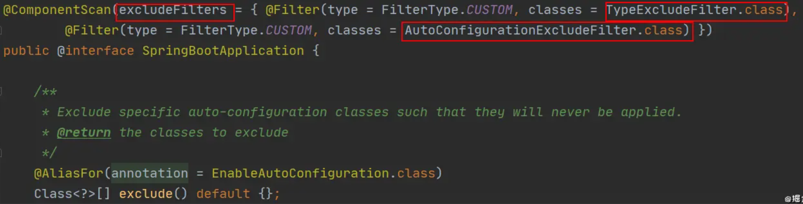

`@EnableAutoConfiguration` 是实现自动装配的重要注解，我们以这个注解入手。

### @EnableAutoConfiguration:实现自动装配的核心注解

`EnableAutoConfiguration` 只是一个简单地注解，自动装配核心功能的实现实际是通过 `AutoConfigurationImportSelector`类。

```java
@Target({ElementType.TYPE})
@Retention(RetentionPolicy.RUNTIME)
@Documented
@Inherited
@AutoConfigurationPackage //作用：将main包下的所欲组件注册到容器中
@Import({AutoConfigurationImportSelector.class}) //加载自动装配类 xxxAutoconfiguration
public @interface EnableAutoConfiguration {
    String ENABLED_OVERRIDE_PROPERTY = "spring.boot.enableautoconfiguration";

    Class<?>[] exclude() default {};

    String[] excludeName() default {};
}
```

我们现在重点分析下`AutoConfigurationImportSelector` 类到底做了什么？

### AutoConfigurationImportSelector:加载自动装配类

`AutoConfigurationImportSelector`类的继承体系如下：

```java
public class AutoConfigurationImportSelector implements DeferredImportSelector, BeanClassLoaderAware, ResourceLoaderAware, BeanFactoryAware, EnvironmentAware, Ordered {

}

public interface DeferredImportSelector extends ImportSelector {

}

public interface ImportSelector {
    String[] selectImports(AnnotationMetadata var1);
}
```

可以看出，`AutoConfigurationImportSelector` 类实现了 `ImportSelector`接口，也就实现了这个接口中的 `selectImports`方法，该方法主要用于**获取所有符合条件的类的全限定类名，这些类需要被加载到 IoC 容器中**。

```java
private static final String[] NO_IMPORTS = new String[0];

public String[] selectImports(AnnotationMetadata annotationMetadata) {
        // <1>.判断自动装配开关是否打开
        if (!this.isEnabled(annotationMetadata)) {
            return NO_IMPORTS;
        } else {
          //<2>.获取所有需要装配的bean
            AutoConfigurationMetadata autoConfigurationMetadata = AutoConfigurationMetadataLoader.loadMetadata(this.beanClassLoader);
            AutoConfigurationImportSelector.AutoConfigurationEntry autoConfigurationEntry = this.getAutoConfigurationEntry(autoConfigurationMetadata, annotationMetadata);
            return StringUtils.toStringArray(autoConfigurationEntry.getConfigurations());
        }
    }
```

这里我们需要重点关注一下`getAutoConfigurationEntry()`方法，这个方法主要负责加载自动配置类的。

该方法调用链如下：

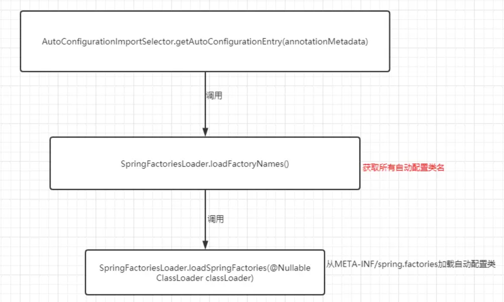

现在我们结合`getAutoConfigurationEntry()`的源码来详细分析一下：

```java
private static final AutoConfigurationEntry EMPTY_ENTRY = new AutoConfigurationEntry();

AutoConfigurationEntry getAutoConfigurationEntry(AutoConfigurationMetadata autoConfigurationMetadata, AnnotationMetadata annotationMetadata) {
        //<1>.
        if (!this.isEnabled(annotationMetadata)) {
            return EMPTY_ENTRY;
        } else {
            //<2>.
            AnnotationAttributes attributes = this.getAttributes(annotationMetadata);
            //<3>.
            List<String> configurations = this.getCandidateConfigurations(annotationMetadata, attributes);
            //<4>.
            configurations = this.removeDuplicates(configurations);
            Set<String> exclusions = this.getExclusions(annotationMetadata, attributes);
            this.checkExcludedClasses(configurations, exclusions);
            configurations.removeAll(exclusions);
            configurations = this.filter(configurations, autoConfigurationMetadata);
            this.fireAutoConfigurationImportEvents(configurations, exclusions);
            return new AutoConfigurationImportSelector.AutoConfigurationEntry(configurations, exclusions);
        }
    }
```

**第 1 步**:

判断自动装配开关是否打开。默认`spring.boot.enableautoconfiguration=true`，可在 `application.properties` 或 `application.yml` 中设置

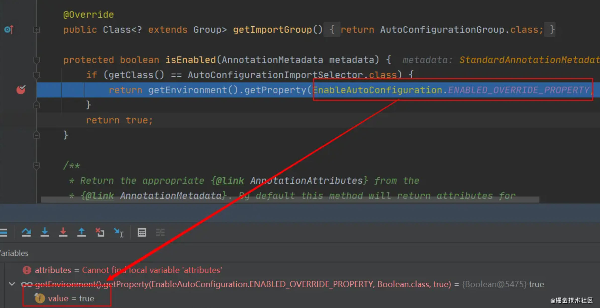

**第 2 步** ：

用于获取`EnableAutoConfiguration`注解中的 `exclude` 和 `excludeName`。

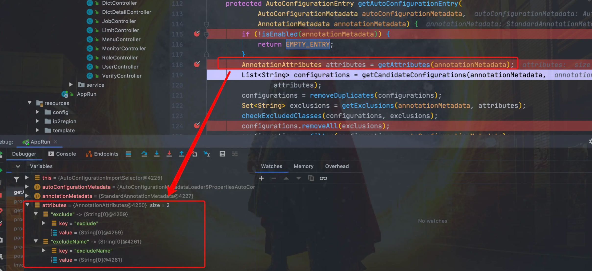

**第 3 步**

获取需要自动装配的所有配置类，读取`META-INF/spring.factories`

```yaml
spring-boot/spring-boot-project/spring-boot-autoconfigure/src/main/resources/META-INF/spring.factories
```

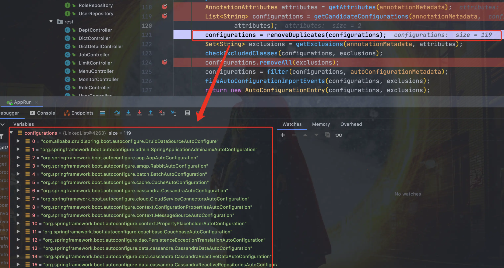

从下图可以看到这个文件的配置内容都被我们读取到了。`XXXAutoConfiguration`的作用就是按需加载组件。

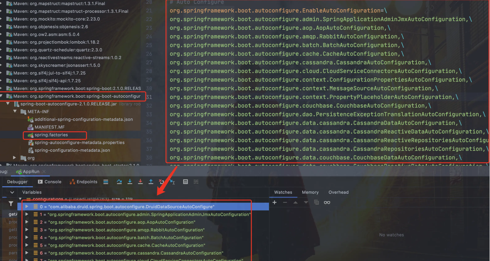

不光是这个依赖下的`META-INF/spring.factories`被读取到，所有 Spring Boot Starter 下的`META-INF/spring.factories`都会被读取到。

所以，你可以清楚滴看到， druid 数据库连接池的 Spring Boot Starter 就创建了`META-INF/spring.factories`文件。

如果，我们自己要创建一个 Spring Boot Starter，这一步是必不可少的。

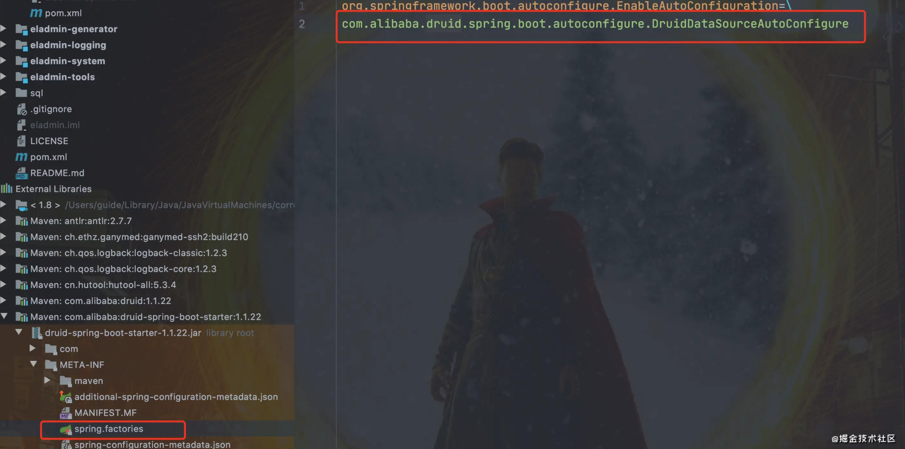

**第 4 步** ：

到这里可能面试官会问你:“`spring.factories`中这么多配置，每次启动都要全部加载么？”。

很明显，这是不现实的。我们 debug 到后面你会发现，`configurations` 的值变小了。

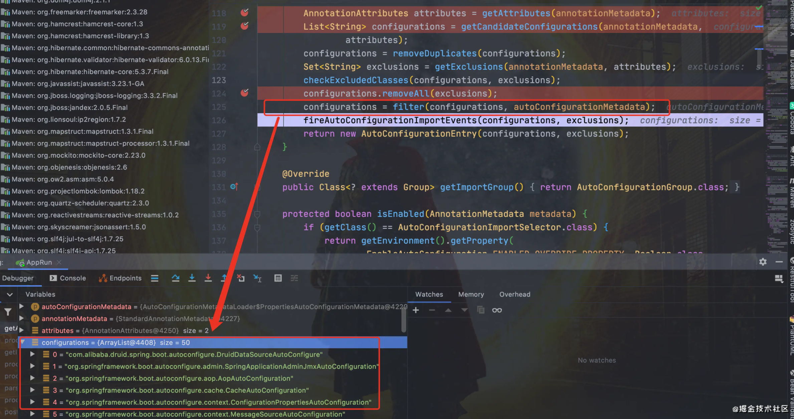

因为，这一步有经历了一遍筛选，`@ConditionalOnXXX` 中的所有条件都满足，该类才会生效。

```java
@Configuration
// 检查相关的类：RabbitTemplate 和 Channel是否存在
// 存在才会加载
@ConditionalOnClass({ RabbitTemplate.class, Channel.class })
@EnableConfigurationProperties(RabbitProperties.class)
@Import(RabbitAnnotationDrivenConfiguration.class)
public class RabbitAutoConfiguration {
}
```

有兴趣的童鞋可以详细了解下 Spring Boot 提供的条件注解

- `@ConditionalOnBean`：当容器里有指定 Bean 的条件下
- `@ConditionalOnMissingBean`：当容器里没有指定 Bean 的情况下
- `@ConditionalOnSingleCandidate`：当指定 Bean 在容器中只有一个，或者虽然有多个但是指定首选 Bean
- `@ConditionalOnClass`：当类路径下有指定类的条件下
- `@ConditionalOnMissingClass`：当类路径下没有指定类的条件下
- `@ConditionalOnProperty`：指定的属性是否有指定的值
- `@ConditionalOnResource`：类路径是否有指定的值
- `@ConditionalOnExpression`：基于 SpEL 表达式作为判断条件
- `@ConditionalOnJava`：基于 Java 版本作为判断条件
- `@ConditionalOnJndi`：在 JNDI 存在的条件下差在指定的位置
- `@ConditionalOnNotWebApplication`：当前项目不是 Web 项目的条件下
- `@ConditionalOnWebApplication`：当前项目是 Web 项 目的条件下


### 如何实现一个 Starter

光说不练假把式，现在就来撸一个 starter，实现自定义线程池

第一步，创建`threadpool-spring-boot-starter`工程

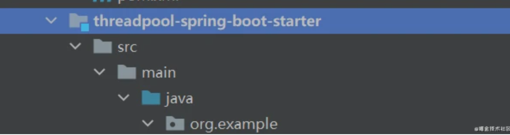

第二步，引入 Spring Boot 相关依赖

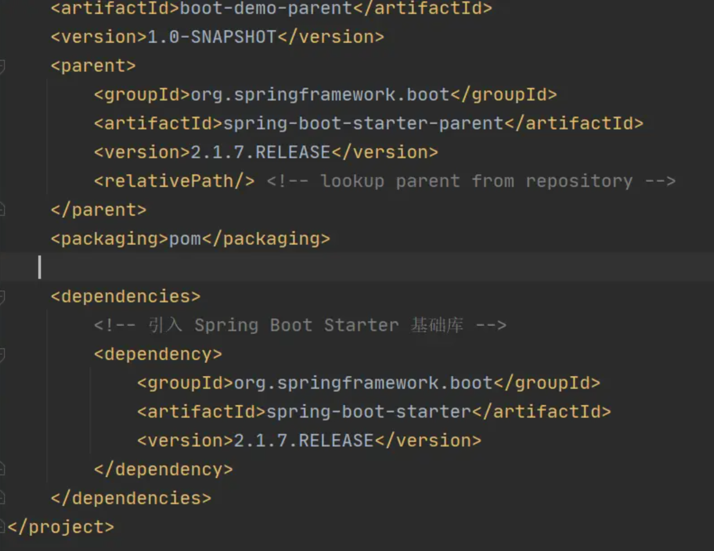

第三步，创建`ThreadPoolAutoConfiguration`

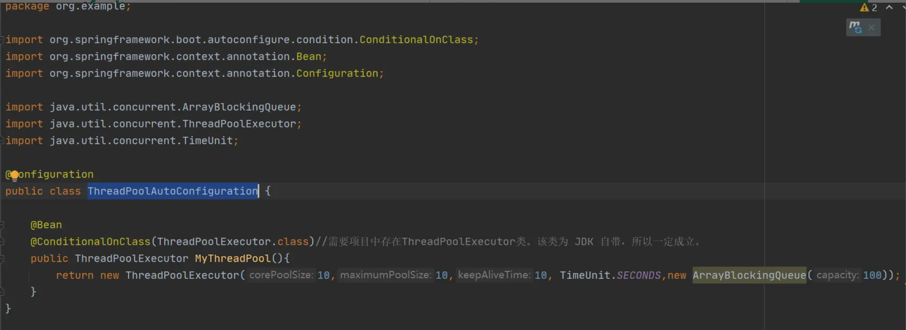

第四步，在`threadpool-spring-boot-starter`工程的 resources 包下创建`META-INF/spring.factories`文件

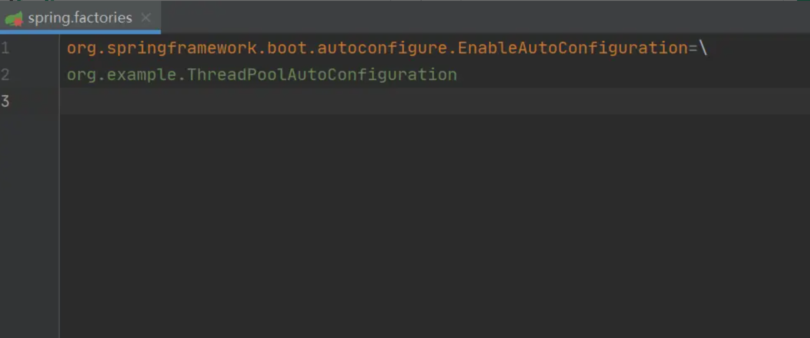

最后新建工程引入`threadpool-spring-boot-starter`

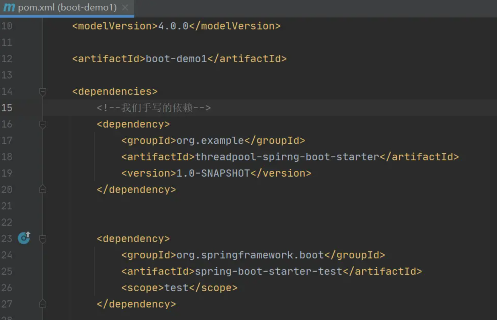

测试通过！！！

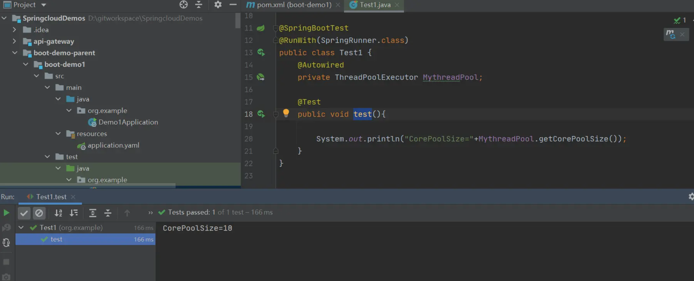

### 总结

Spring Boot 通过`@EnableAutoConfiguration`开启自动装配，通过 SpringFactoriesLoader 最终加载`META-INF/spring.factories`中的自动配置类实现自动装配，自动配置类其实就是通过`@Conditional`按需加载的配置类，想要其生效必须引入`spring-boot-starter-xxx`包实现起步依赖


## 四、常见面试题

### 1、你如何理解 Spring Boot 配置加载顺序

在 Spring Boot 里面，可以使用以下几种方式来加载配置。
1）properties文件；
2）YAML文件；
3）系统环境变量；
4）命令行参数；
等等……

### 2、什么是 YAML

YAML 是一种人类可读的数据序列化语言。它通常用于配置文件。与属性文件相比，如果我们想要在配置文件中添加复
杂的属性，YAML 文件就更加结构化，而且更少混淆。可以看出 YAML 具有分层配置数据。

### 3、YAML 配置的优势在哪里 ?

YAML 现在可以算是非常流行的一种配置文件格式了，无论是前端还是后端，都可以见到 YAML 配置。那么 YAML 配置
和传统的 properties 配置相比到底有哪些优势呢？
1. 配置有序，在一些特殊的场景下，配置有序很关键
2. 支持数组，数组中的元素可以是基本数据类型也可以是对象
3. 简洁

相比 properties 配置文件，YAML 还有一个缺点，就是不支持 @PropertySource 注解导入自定义的 YAML 配置。

### 4、Spring Boot 是否可以使用 XML 配置 ?

Spring Boot 推荐使用 Java 配置而非 XML 配置，但是 Spring Boot 中也可以使用 XML 配置，通过
@ImportResource 注解可以引入一个 XML 配置。

### 5、spring boot 核心配置文件是什么？bootstrap.properties 和application.properties 有何区别 ?

单纯做 Spring Boot 开发，可能不太容易遇到 bootstrap.properties 配置文件，但是在结合 Spring Cloud 时，这个配
置就会经常遇到了，特别是在需要加载一些远程配置文件的时侯。
spring boot 核心的两个配置文件：

bootstrap (. yml 或者 . properties)：boostrap 由父 ApplicationContext 加载的，比 applicaton 优先加载，配置在应用程
序上下文的引导阶段生效。一般来说我们在 Spring Cloud Config 或者 Nacos 中会用到它。且 boostrap 里面的属性不能被覆盖；
application (. yml 或者 . properties)： 由ApplicatonContext 加载，用于 spring boot 项目的自动化配置。


### 6、什么是 Spring Profiles？

Spring Profiles 允许用户根据配置文件（dev，test，prod 等）来注册 bean。因此，当应用程序在开发中运行时，只
有某些 bean 可以加载，而在 PRODUCTION中，某些其他 bean 可以加载。假设我们的要求是 Swagger 文档仅适用于
QA 环境，并且禁用所有其他文档。这可以使用配置文件来完成。Spring Boot 使得使用配置文件非常简单。

### 7、如何实现 Spring Boot 应用程序的安全性？

为了实现 Spring Boot 的安全性，我们使用 spring-boot-starter-security 依赖项，并且必须添加安全配置。它只需要
很少的代码。配置类将必须扩展WebSecurityConfigurerAdapter 并覆盖其方法。

### 8、比较一下 Spring Security 和 Shiro 各自的优缺点 ?

由于 Spring Boot 官方提供了大量的非常方便的开箱即用的 Starter ，包括 Spring Security 的 Starter ，使得在
Spring Boot 中使用 Spring Security 变得更加容易，甚至只需要添加一个依赖就可以保护所有的接口，所以，如果是
Spring Boot 项目，一般选择 Spring Security 。当然这只是一个建议的组合，单纯从技术上来说，无论怎么组合，都是
没有问题的。Shiro 和 Spring Security 相比，主要有如下一些特点：
1. Spring Security 是一个重量级的安全管理框架；Shiro 则是一个轻量级的安全管理框架
2. Spring Security 概念复杂，配置繁琐；Shiro 概念简单、配置简单
3. Spring Security 功能强大；Shiro 功能简单

### 9、Spring Boot 中如何解决跨域问题 ?

跨域可以在前端通过 JSONP 来解决，但是 JSONP 只可以发送 GET 请求，无法发送其他类型的请求，在 RESTful 风格
的应用中，就显得非常鸡肋，因此我们推荐在后端通过 （CORS，Cross-origin resource sharing） 来解决跨域问题。
这种解决方案并非 Spring Boot 特有的，在传统的 SSM 框架中，就可以通过 CORS 来解决跨域问题，只不过之前我们
是在 XML 文件中配置 CORS ，现在可以通过实现WebMvcConfigurer接口然后重写addCorsMappings方法解决跨域
问题。

```java
@Configuration public class CorsConfig implements WebMvcConfigurer{
    @Override
    public void addCorsMappings(CorsRegistry registry){       
     registry.addMapping("/**").
         allowedOrigins("*").
         allowCredentials(true).
         allowedMethods("GET","POST","PUT","DELETE","OPTIONS");
    }
```

项目中前后端分离部署，所以需要解决跨域的问题。
我们使用cookie存放用户登录的信息，在spring拦截器进行权限控制，当权限不符合时，直接返回给用户固定的json结
果。
当用户登录以后，正常使用；当用户退出登录状态时或者token过期时，由于拦截器和跨域的顺序有问题，出现了跨域的
现象。
我们知道一个http请求，先走filter，到达servlet后才进行拦截器的处理，如果我们把cors放在filter里，就可以优先于权
限拦截器执行。

```java
@Configuration
public class CorsConfig{
    @Bean
    public CorsFilter corsFilter(){       
        CorsConfiguration corsConfiguration=newCorsConfiguration();        
        corsConfiguration.addAllowedOrigin("*");        
        corsConfiguration.addAllowedHeader("*");       
        corsConfiguration.addAllowedMethod("*");        
        corsConfiguration.setAllowCredentials(true);       
UrlBasedCorsConfigurationSource urlBasedCorsConfigurationSource =new UrlBasedCorsConfigurationSource();       
urlBasedCorsConfigurationSource.registerCorsConfiguration("/**",corsConfiguration);
       returnnewCorsFilter(urlBasedCorsConfigurationSource);}}
```

### 10、什么是 CSRF 攻击？

CSRF 代表跨站请求伪造。这是一种攻击，迫使最终用户在当前通过身份验证的Web 应用程序上执行不需要的操作。
CSRF 攻击专门针对状态改变请求，而不是数据窃取，因为攻击者无法查看对伪造请求的响应。


### 11、如何重新加载 Spring Boot 上的更改，而无需重新启动服务器？Spring Boot项目如

何热部署？

这可以使用 DEV 工具来实现。通过这种依赖关系，您可以节省任何更改，嵌入式tomcat 将重新启动。Spring Boot 有
一个开发工具（DevTools）模块，它有助于提高开发人员的生产力。Java 开发人员面临的一个主要挑战是将文件更改自
动部署到服务器并自动重启服务器。开发人员可以重新加载 Spring Boot 上的更改，而无需重新启动服务器。这将消除
每次手动部署更改的需要。Spring Boot 在发布它的第一个版本时没有这个功能。这是开发人员最需要的功能。
DevTools 模块完全满足开发人员的需求。该模块将在生产环境中被禁用。它还提供 H2 数据库控制台以更好地测试应用
程序。

```xml
<dependency>
    <groupId>org.springframework.boot</groupId>
    <artifactId>spring-boot-devtools</artifactId>
</dependency>
```

### 12、Spring Boot 中的 starter 到底是什么 ?

首先，这个 Starter 并非什么新的技术点，基本上还是基于 Spring 已有功能来实现的。首先它提供了一个自动化配置
类，一般命名为  XXXAutoConfiguration  ，在这个配置类中通过条件注解来决定一个配置是否生效（条件注解就是 Spring
中原本就有的），然后它还会提供一系列的默认配置，也允许开发者根据实际情况自定义相关配置，然后通过类型安全
的属性注入将这些配置属性注入进来，新注入的属性会代替掉默认属性。正因为如此，很多第三方框架，我们只需要引
入依赖就可以直接使用了。当然，开发者也可以自定义 Starter

### 13、spring-boot-starter-parent 有什么用 ?

我们都知道，新创建一个 Spring Boot 项目，默认都是有 parent 的，这个 parent 就是 spring-boot-starter-parent
，spring-boot-starter-parent 主要有如下作用：
1. 定义了 Java 编译版本为 1.8 。
2. 使用 UTF-8 格式编码。
3. 继承自 spring-boot-dependencies，这个里边定义了依赖的版本，也正是因为继承了这个依赖，所以我们在写
依赖时才不需要写版本号。
4. 执行打包操作的配置。
5. 自动化的资源过滤。
6. 自动化的插件配置。
7. 针对 application.properties 和 application.yml 的资源过滤，包括通过 profile 定义的不同环境的配置文件，
例如 application-dev.properties 和 application-dev.yml。

### 14、Spring Boot 打成的 jar 和普通的 jar 有什么区别 ?

Spring Boot 项目最终打包成的 jar 是可执行 jar ，这种 jar 可以直接通过  java -jar xxx.jar  命令来运行，这种 jar 不可以作
为普通的 jar 被其他项目依赖，即使依赖了也无法使用其中的类。
Spring Boot 的 jar 无法被其他项目依赖，主要还是他和普通 jar 的结构不同。普通的 jar 包，解压后直接就是包名，包
里就是我们的代码，而 Spring Boot 打包成的可执行 jar 解压后，在  \BOOT-INF\classes  目录下才是我们的代码，因此无
法被直接引用。如果非要引用，可以在 pom.xml 文件中增加配置，将 Spring Boot 项目打包成两个 jar ，一个可执行，
一个可引用。

### 15、运行 Spring Boot 有哪几种方式？

1）打包用命令或者放到容器中运行
2）用 Maven/ Gradle 插件运行
3）直接执行 main 方法运行

### 16、Spring Boot 需要独立的容器运行吗？

可以不需要，内置了 Tomcat/ Jetty 等容器

### 17、如何使用 Spring Boot 实现异常处理？

Spring 提供了一种使用 ControllerAdvice 处理异常的非常有用的方法。 我们通过实现一个 ControlerAdvice 类，来处
理控制器类抛出的所有异常。

### 18、Spring Boot 中如何实现定时任务 ?

定时任务也是一个常见的需求，Spring Boot 中对于定时任务的支持主要还是来自 Spring 框架。
在 Spring Boot 中使用定时任务主要有两种不同的方式，一个就是使用 Spring 中的 @Scheduled 注解，另一个则是使
用第三方框架 Quartz。
使用 Spring 中的 @Scheduled 的方式主要通过 @Scheduled 注解来实现。
使用 Quartz ，则按照 Quartz 的方式，定义 Job 和 Trigger 即可。