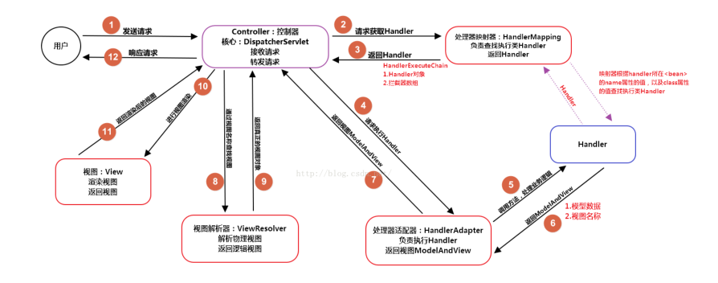

## 一、常见面试题

### 1、Spring MVC 的处理流程

Web 容器启动时会通知 Spring 初始化容器，加载 Bean 的定义信息并初始化所有单例 Bean，然后遍历容器中的 Bean，获取每一个 Controller 中的所有方法访问的 URL，将 URL 和对应的 Controller 保存到一个 Map 集合中。

所有的请求会转发给 DispatcherServlet 前端处理器处理，DispatcherServlet 会请求 HandlerMapping 找出容器中被 `@Controler` 注解修饰的 Bean 以及被 `@RequestMapping` 修饰的方法和类，生成 Handler 和 HandlerInterceptor 并以一个 HandlerExcutionChain 处理器执行链的形式返回。

之后 DispatcherServlet 使用 Handler 找到对应的 HandlerApapter，通过 HandlerApapter 调用 Handler 的方法，将请求参数绑定到方法的形参上，执行方法处理请求并得到 ModelAndView。

最后 DispatcherServlet 根据使用 ViewResolver 试图解析器对得到的 ModelAndView 逻辑视图进行解析得到 View 物理视图，然后对视图渲染，将数据填充到视图中并返回给客户端。

### 2、Spring MVC 有哪些组件？

`DispatcherServlet`：SpringMVC 中的前端控制器，是整个流程控制的核心，负责接收请求并转发给对应的处理组件。

`Handler`：处理器，完成具体业务逻辑，相当于 Servlet 或 Action。

`HandlerMapping`：完成 URL 到 Controller 映射，DispatcherServlet 通过 HandlerMapping 将不同请求映射到不同 Handler。

`HandlerInterceptor`：处理器拦截器，是一个接口，如果需要完成一些拦截处理，可以实现该接口。

`HandlerExecutionChain`：处理器执行链，包括两部分内容：Handler 和 HandlerInterceptor。

`HandlerAdapter`：处理器适配器，Handler执行业务方法前需要进行一系列操作，包括表单数据验证、数据类型转换、将表单数据封装到JavaBean等，这些操作都由 HandlerAdapter 完成。DispatcherServlet 通过 HandlerAdapter 来执行不同的 Handler。

`ModelAndView`：装载模型数据和视图信息，作为 Handler 处理结果返回给 DispatcherServlet。

`ViewResolver`：视图解析器，DispatcherServlet 通过它将逻辑视图解析为物理视图，最终将渲染的结果响应给客户端。

### 3、Spring MVC 的相关注解？

`@Controller`：在类定义处添加，将类交给IoC容器管理。

`@RequtestMapping`：将URL请求和业务方法映射起来，在类和方法定义上都可以添加该注解。`value` 属性指定URL请求的实际地址，是默认值。`method` 属性限制请求的方法类型，包括GET、POST、PUT、DELETE等。如果没有使用指定的请求方法请求URL，会报405 Method Not Allowed 错误。`params` 属性限制必须提供的参数，如果没有会报错。

`@RequestParam`：如果 Controller 方法的形参和 URL 参数名一致可以不添加注解，如果不一致可以使用该注解绑定。`value` 属性表示HTTP请求中的参数名。`required` 属性设置参数是否必要，默认false。`defaultValue` 属性指定没有给参数赋值时的默认值。

`@PathVariable`：Spring MVC 支持 RESTful 风格 URL，通过 `@PathVariable` 完成请求参数与形参的绑定。

### 4、什么是DispatcherServlet？

Spring的MVC框架是围绕DispatcherServlet来设计的，它用来处理所有的HTTP请求和响应。

### 5、什么是Spring MVC框架的控制器？

控制器提供一个访问应用程序的行为，此行为通常通过服务接口实现。控制器解析用户输入并将其转换为一个由视图呈现给用户的模型。Spring用一个非常抽象的方式实现了一个控制层，允许用户创建多种用途的控制器。

### 6、Spring MVC的控制器是不是单例模式,如果是,有什么问题,怎么解决？

答：是单例模式,所以在多线程访问的时候有线程安全问题,不要用同步,会影响性能的,解决方案是在控制器里面不能写字段。

### 7、请描述Spring MVC的工作流程？描述一下 DispatcherServlet 的工作流程？

（1）用户发送请求至前端控制器DispatcherServlet；
（2） DispatcherServlet收到请求后，调用HandlerMapping处理器映射器，请求获取Handle；
（3）处理器映射器根据请求url找到具体的处理器，生成处理器对象及处理器拦截器(如果有则生成)一并返回给DispatcherServlet；
（4）DispatcherServlet 调用 HandlerAdapter处理器适配器；
（5）HandlerAdapter 经过适配调用 具体处理器(Handler，也叫后端控制器)；
（6）Handler执行完成返回ModelAndView；
（7）HandlerAdapter将Handler执行结果ModelAndView返回给DispatcherServlet；
（8）DispatcherServlet将ModelAndView传给ViewResolver视图解析器进行解析；
（9）ViewResolver解析后返回具体View；
（10）DispatcherServlet对View进行渲染视图（即将模型数据填充至视图中）
（11）DispatcherServlet响应用户。

### 8、@Controller注解的作用

在Spring MVC 中，控制器Controller 负责处理由DispatcherServlet 分发的请求，它把用户请求的数据经过业务处理层处理之后封装成一个Model ，然后再把该Model 返回给对应的View 进行展示。在Spring MVC 中提供了一个非常简便的定义Controller 的方法，你无需继承特定的类或实现特定的接口，只需使用@Controller 标记一个类是Controller ，然后使用@RequestMapping 和@RequestParam 等一些注解用以定义URL 请求和Controller 方法
之间的映射，这样的Controller 就能被外界访问到。此外Controller 不会直接依赖于HttpServletRequest 和HttpServletResponse 等HttpServlet 对象，它们可以通过Controller 的方法参数灵活的获取到。
@Controller 用于标记在一个类上，使用它标记的类就是一个Spring MVC Controller 对象。分发处理器将会扫描使用了该注解的类的方法，并检测该方法是否使用了@RequestMapping 注解。@Controller 只是定义了一个控制器类，而使用@RequestMapping 注解的方法才是真正处理请求的处理器。单单使用@Controller 标记在一个类上还不能真正意义上的说它就是Spring MVC 的一个控制器类，因为这个时候Spring还不认识它。那么要如何做Spring 才能认识它呢？这个时候就需要我们把这个控制器类交给Spring 来管理。有两种方式：
在Spring MVC 的配置文件中定义MyController 的bean 对象。
在Spring MVC 的配置文件中告诉Spring 该到哪里去找标记为@Controller 的Controller 控制
器。

