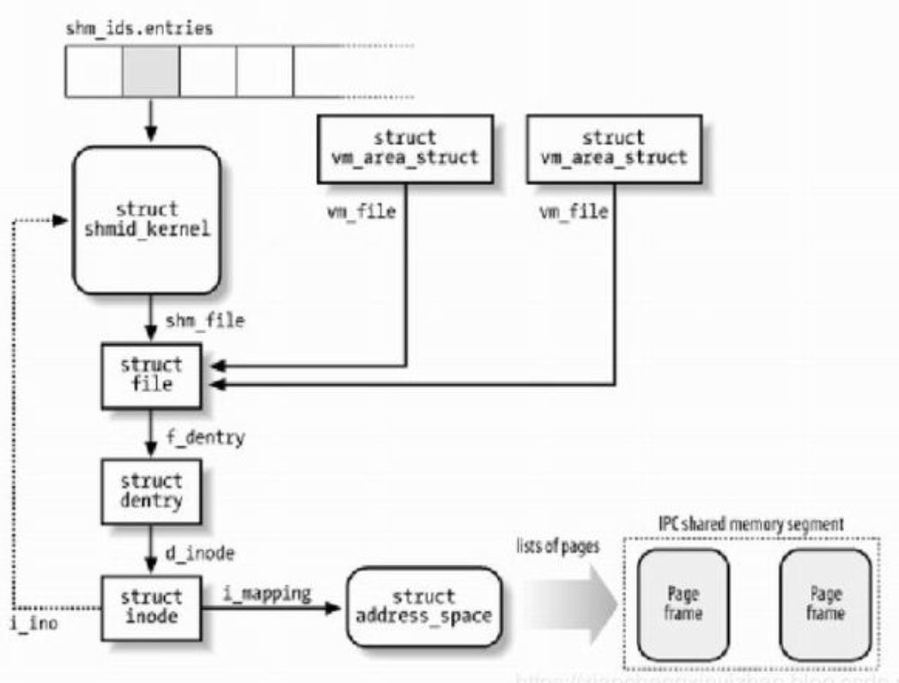

## 一、常见面试题

### 1、linux查询tcp连接处理CLOSE_WAIT的状态的数目

netstat -n | awk '/^tcp/ {++S[$NF]} END {for(a in S) print a, S[a]}' 

它会显示例如下面的信息：

TIME_WAIT 814
CLOSE_WAIT 1
FIN_WAIT1 1
ESTABLISHED 634
SYN_RECV 2
LAST_ACK 1

常用的三个状态是：ESTABLISHED 表示正在通信，TIME_WAIT 表示主动关闭，CLOSE_WAIT 表示被动关闭。

### 2、linux命令查询一个文件内出现重复最多的数字

uniq -c file | sort -n -r |head -10

### 3、linux命令查询一个文件的行数

wc 命令的作用：统计指定文件中的字节数、字数、行数，并将结果显示输出。

命令语法：wc [选项] 文件

该命令选项参数如下： 

-c 统计字节数

-l 统计行数

-w 统计字数

-m 统计字符数

以上选项可以单独使用也可以组合使用。注意组合使用时输出结果的列的顺序和数目不受选项的顺序和数目的影响。输出结果总是按下述顺序进行显示的。

行数 字数 字节数 文件名

例如： 

wc -lcw file1 file2

则输出结果为：

9 36 file1 

8 62 file2 

8 24 96 total

### 4、Linux有哪些进程通信方式，五大件

管道：管道可以划分为普通管道及命名管道。普通管道用于具有亲缘关系的进程（父子进程）间的通信，命名管道则在普通管道提供的功能基础上，通过给管道命名的方法，使管道变成文件系统中的管道文件，从而允许无亲缘关系进程间通过访问管道文件进行通信。
信号：只要知道进程的进程号，就可以向进程发送信号。
消息队列：是消息的链表。进程可以向消息队列中发送某种类型的消息，也可以从消息队列中读取指定类型的消息，消息内容可以根据需要自行定义，从而使消息队列克服了信号承载信息量过少的缺点，在实际编程中应用较广。
共享内存：系统内核分配的一块缓冲区，多个进程都可以访问该缓冲区。由于进程可以直接读写内存，避免了在内核空间与用户空间的切换，所以共享内存读写效率很高。
信号量：也称为信号灯，主要用于进程间的同步。
套接字：跨越主机边界的通信，成为事实上的网络编程接口。
消息队列、共享内存、信号量3种机制合并起来称为进程间通信，简称为IPC（Inter Process Communication）。

### 5、Linux的共享内存如何实现，大概说了一下。

Linux的2.2.x内核支持多种共享内存方式，如mmap()系统调用，Posix共享内存，以及系统V共享内存。

linux发行版本如Redhat 8.0支持mmap()系统调用及系统V共享内存，但还没实现Posix共享内存，

系统调用mmap()通过映射一个普通文件实现共享内存。系统V则是通过映射特殊文件系统shm中的文件实现进程间的共享内存通信。也就是说，每个共享内存区域对应特殊文件系统shm中的一个文件(这是通过shmid_kernel结构联系起来的)

mmap()系统调用实现原理：

mmap()系统调用使得进程之间通过映射同一个普通文件实现共享内存。普通文件被映射到进程地址空间后，进程可以向访问普通内存一样对文件进行访问，不必再调用read()，write()等操作。

注：实际上，mmap()系统调用并不是完全为了用于共享内存而设计的。它本身提供了不同于一般对普通文件的访问方式，进程可以像读写内存一样对普通文件的操作。而Posix或系统V的共享内存IPC则纯粹用于共享目的，当然mmap()实现共享内存也是其主要应用之一。

系统V共享内存原理

进程间需要共享的数据被放在一个叫做IPC共享内存区域的地方，所有需要访问该共享区域的进程都要把该共享区域映射到本进程的地址空间中去。系统V共享内存通过shmget获得或创建一个IPC共享内存区域，并返回相应的标识符。内核在保证shmget获得或创建一个共享内存区，初始化该共享内存区相应的shmid_kernel结构注同时，还将在特殊文件系统shm中，创建并打开一个同名文件，并在内存中建立起该文件的相应dentry及inode结构，新打开的文件不属于任何一个进程(任何进程都可以访问该共享内存区)。所有这一切都是系统调用shmget完成的。

注：每一个共享内存区都有一个控制结构struct shmid_kernel，shmid_kernel是共享内存区域中非常重要的一个数据结构，它是存储管理和文件系统结合起来的桥梁

该结构中最重要的一个域应该是shm_file，它存储了将被映射文件的地址。每个共享内存区对象都对应特殊文件系统shm中的一个文件，一般情况下，特殊文件系统shm中的文件是不能用read()、write()等方法访问的，当采取共享内存的方式把其中的文件映射到进程地址空间后，可直接采用访问内存的方式对其访问。

这里我们采用[1]中的图表给出与系统V共享内存相关数据结构：

正如消息队列和信号灯一样，内核通过数据结构struct ipc_ids shm_ids维护系统中的所有共享内存区域。上图中的shm_ids.entries变量指向一个ipc_id结构数组，而每个ipc_id结构数组中有个指向kern_ipc_perm结构的指针。到这里读者应该很熟悉了，对于系统V共享内存区来说，kern_ipc_perm的宿主是shmid_kernel结构，shmid_kernel是用来描述一个共享内存区域的，这样内核就能够控制系统中所有的共享区域。同时，在shmid_kernel结构的file类型指针shm_file指向文件系统shm中相应的文件，这样，共享内存区域就与shm文件系统中的文件对应起来。

在创建了一个共享内存区域后，还要将它映射到进程地址空间，系统调用shmat()完成此项功能。由于在调用shmget()时，已经创建了文件系统shm中的一个同名文件与共享内存区域相对应，因此，调用shmat()的过程相当于映射文件系统shm中的同名文件过程，原理与mmap()大同小异

系统V与mmap()映射普通文件实现共享内存通信区别：

1、 系统V共享内存中的数据，从来不写入到实际磁盘文件中去；而通过mmap()映射普通文件实现的共享内存通信可以指定何时将数据写入磁盘文件中。 注：前面讲到，系统V共享内存机制实际是通过映射特殊文件系统shm中的文件实现的，文件系统shm的安装点在交换分区上，系统重新引导后，所有的内容都丢失。

2、 系统V共享内存是随内核持续的，即使所有访问共享内存的进程都已经正常终止，共享内存区仍然存在(除非显式删除共享内存)，在内核重新引导之前，对该共享内存区域的任何改写操作都将一直保留。

3、 通过调用mmap()映射普通文件进行进程间通信时，一定要注意考虑进程何时终止对通信的影响。而通过系统V共享内存实现通信的进程则不然。 注：这里没有给出shmctl的使用范例，原理与消息队列大同小异。

