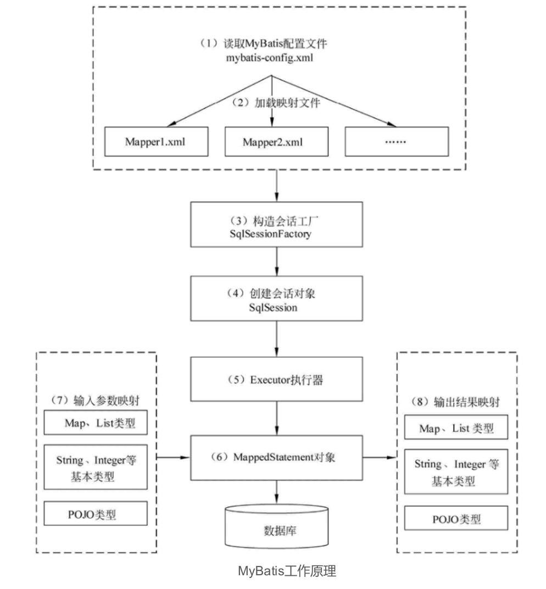
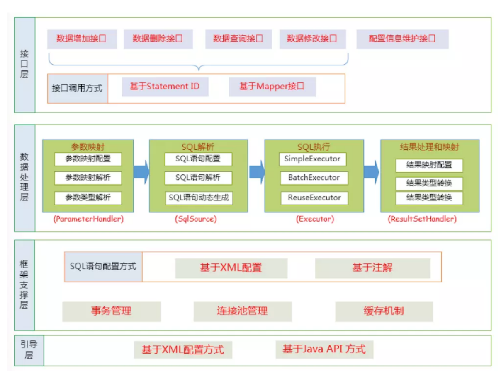
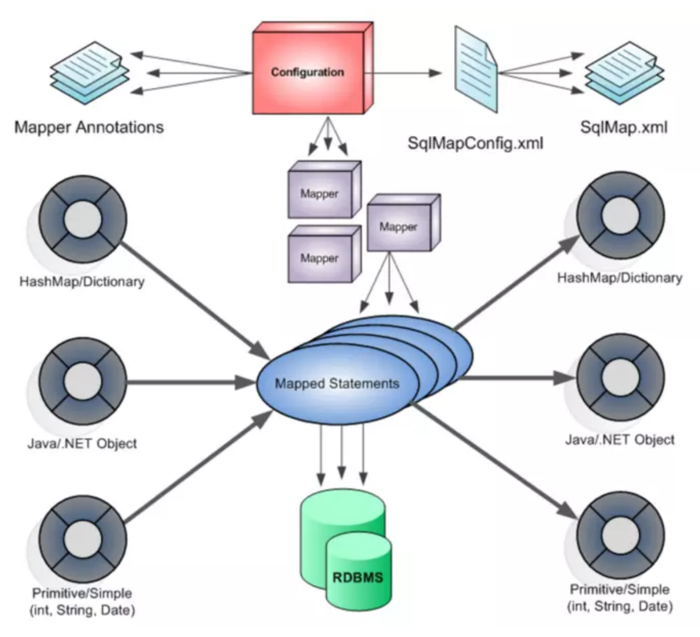

## 一、常见面试题

### 1、Mybatis 的优缺点？

**优点**

相比 JDBC 减少了大量代码量，减少冗余代码。

使用灵活，SQL 语句写在 XML 里，从程序代码中彻底分离，降低了耦合度，便于管理。

提供 XML 标签，支持编写动态 SQL 语句。

提供映射标签，支持对象与数据库的 ORM 字段映射关系。

**缺点**

SQL 语句编写工作量较大，尤其是字段和关联表多时。

SQL 语句依赖于数据库，导致数据库移植性差，不能随意更换数据库。

### 2、Mybatis 的 XML 文件有哪些标签属性？

`select`、`insert`、`update`、`delete` 标签分别对应查询、添加、更新、删除操作。

`parameterType` 属性表示参数的数据类型，包括基本数据类型和对应的包装类型、String 和 Java Bean 类型，当有多个参数时可以使用 `#{argn}` 的形式表示第 n 个参数。除了基本数据类型都要以全限定类名的形式指定参数类型。

`resultType` 表示返回的结果类型，包括基本数据类型和对应的包装类型、String 和 Java Bean 类型。还可以使用把返回结果封装为复杂类型的 `resultMap` 。

### 3、Mybatis 的一级缓存是什么？

一级缓存是 SqlSession 级别，默认开启且不能关闭。

操作数据库时需要创建 SqlSession 对象，对象中有一个 HashMap 存储缓存数据，不同 SqlSession 之间缓存数据区域互不影响。

一级缓存的作用域是 SqlSession 范围的，在同一个 SqlSession 中执行两次相同的 SQL 语句时，第一次执行完毕会将结果保存在缓存中，第二次查询直接从缓存中获取。

如果 SqlSession 执行了 DML 操作（insert、update、delete），Mybatis 必须将缓存清空保证数据有效性。

### 4、Mybatis 的二级缓存是什么？

二级缓存是Mapper 级别，默认关闭。

使用二级缓存时多个 SqlSession 使用同一个 Mapper 的 SQL 语句操作数据库，得到的数据会存在二级缓存区，同样使用 HashMap 进行数据存储，相比于一级缓存，二级缓存范围更大，多个 SqlSession 可以共用二级缓存，作用域是 Mapper 的同一个 namespace，不同 SqlSession 两次执行相同的 namespace 下的 SQL 语句，参数也相等，则第一次执行成功后会将数据保存在二级缓存中，第二次可直接从二级缓存中取出数据。

要使用二级缓存，需要在全局配置文件中配置 `<setting name="cacheEnabled" value="true"/>` ，再在对应的映射文件中配置一个 `<cache/>` 标签。

### 5、Mybatis `#{}` 和 `${}` 的区别？

使用 `${}` 相当于使用字符串拼接，存在 SQL 注入的风险。

使用 `#{}` 相当于使用占位符，可以防止 SQL 注入，不支持使用占位符的地方就只能使用 `${}` ，典型情况就是动态参数。

### 6、ORM是什么

ORM（Object Relational Mapping），对象关系映射，是一种为了解决关系型数据库数据与简单Java对象（POJO）的映射关系的技术。简单的说，ORM是通过使用描述对象和数据库之间映射的元数据，将程序中的对象自动持久化到关系型数据库中。

### 7、为什么说Mybatis是半自动ORM映射工具？它与全自动的区别在哪里？

Hibernate属于全自动ORM映射工具，使用Hibernate查询关联对象或者关联集合对象时，可以根据对象关系模型直接获取，所以它是全自动的。而Mybatis在查询关联对象或关联集合对象时，需要手动编写sql来完成，所以，
称之为半自动ORM映射工具。

### 8、JDBC编程有哪些不足之处，MyBatis是如何解决这些问题的？

1、数据库链接创建、释放频繁造成系统资源浪费从而影响系统性能，如果使用数
据库连接池可解决此问题。
解决：在mybatis-config.xml中配置数据链接池，使用连接池管理数据库连接。
2、Sql语句写在代码中造成代码不易维护，实际应用sql变化的可能较大，sql变
动需要改变java代码。
解决：将Sql语句配置在XXXXmapper.xml文件中与java代码分离。
3、向sql语句传参数麻烦，因为sql语句的where条件不一定，可能多也可能少，
占位符需要和参数一一对应。
解决： Mybatis自动将java对象映射至sql语句。
4、对结果集解析麻烦，sql变化导致解析代码变化，且解析前需要遍历，如果能
将数据库记录封装成pojo对象解析比较方便。
解决：Mybatis自动将sql执行结果映射至java对象。

### 9、Mybatis优缺点

优点
与传统的数据库访问技术相比，ORM有以下优点：
基于SQL语句编程，相当灵活，不会对应用程序或者数据库的现有设计造成任何
影响，SQL写在XML里，解除sql与程序代码的耦合，便于统一管理；提供XML标签，
支持编写动态SQL语句，并可重用

与JDBC相比，减少了50%以上的代码量，消除了JDBC大量冗余的代码，不需要
手动开关连接

很好的与各种数据库兼容（因为MyBatis使用JDBC来连接数据库，所以只要JDBC
支持的数据库MyBatis都支持）

提供映射标签，支持对象与数据库的ORM字段关系映射；提供对象关系映射标
签，支持对象关系组件维护

能够与Spring很好的集成

缺点
SQL语句的编写工作量较大，尤其当字段多、关联表多时，对开发人员编写SQL语
句的功底有一定要求
SQL语句依赖于数据库，导致数据库移植性差，不能随意更换数据库

### 10、MyBatis编程步骤是什么样的？

1、 创建SqlSessionFactory
2、 通过SqlSessionFactory创建SqlSession
3、 通过sqlsession执行数据库操作
4、 调用session.commit()提交事务
5、 调用session.close()关闭会话

### 11、请说说MyBatis的工作原理



1）读取 MyBatis 配置文件：mybatis-config.xml 为 MyBatis 的全局配置文件，配置了 MyBatis 的运行环境等信息，例如数据库连接信息。

2）加载映射文件。映射文件即 SQL 映射文件，该文件中配置了操作数据库的SQL 语句，需要在 MyBatis 配置文件 mybatis-config.xml 中加载。mybatis-config.xml 文件可以加载多个映射文件，每个文件对应数据库中的一张表。

3）构造会话工厂：通过 MyBatis 的环境等配置信息构建会话工厂SqlSessionFactory。

4）创建会话对象：由会话工厂创建 SqlSession 对象，该对象中包含了执行 SQL语句的所有方法。

5）Executor 执行器：MyBatis 底层定义了一个 Executor 接口来操作数据库，它将根据 SqlSession 传递的参数动态地生成需要执行的 SQL 语句，同时负责查询缓存的维护。

6）MappedStatement 对象：在 Executor 接口的执行方法中有一个MappedStatement 类型的参数，该参数是对映射信息的封装，用于存储要映射的 SQL 语句的 id、参数等信息。

7）输入参数映射：输入参数类型可以是 Map、List 等集合类型，也可以是基本数据类型和 POJO 类型。输入参数映射过程类似于 JDBC 对preparedStatement 对象设置参数的过程。

8）输出结果映射：输出结果类型可以是 Map、 List 等集合类型，也可以是基本数据类型和 POJO 类型。输出结果映射过程类似于 JDBC 对结果集的解析过程。

### 12、MyBatis的功能架构是怎样的



我们把Mybatis的功能架构分为三层：

API接口层：提供给外部使用的接口API，开发人员通过这些本地API来操纵数据
库。接口层一接收到调用请求就会调用数据处理层来完成具体的数据处理。

数据处理层：负责具体的SQL查找、SQL解析、SQL执行和执行结果映射处理等。
它主要的目的是根据调用的请求完成一次数据库操作。

基础支撑层：负责最基础的功能支撑，包括连接管理、事务管理、配置加载和缓
存处理，这些都是共用的东西，将他们抽取出来作为最基础的组件。为上层的数据处
理层提供最基础的支撑。

### 13、MyBatis的框架架构设计是怎么样的



这张图从上往下看。MyBatis的初始化，会从mybatis-config.xml配置文件，解
析构造成Configuration这个类，就是图中的红框。

(1)加载配置：配置来源于两个地方，一处是配置文件，一处是Java代码的注解，将SQL的配置信息加载成为一个个MappedStatement对象（包括了传入参数映射配置、执行的SQL语句、结果映射配置），存储在内存中。

(2)SQL解析：当API接口层接收到调用请求时，会接收到传入SQL的ID和传入对象（可以是Map、JavaBean或者基本数据类型），Mybatis会根据SQL的ID找到对应的MappedStatement，然后根据传入参数对象对MappedStatement进行
解析，解析后可以得到最终要执行的SQL语句和参数。

(3)SQL执行：将最终得到的SQL和参数拿到数据库进行执行，得到操作数据库的结果。

(4)结果映射：将操作数据库的结果按照映射的配置进行转换，可以转换成HashMap、JavaBean或者基本数据类型，并将最终结果返回。


### 14、为什么需要预编译

1. 定义：
SQL 预编译指的是数据库驱动在发送 SQL 语句和参数给 DBMS 之前对 SQL 语
句进行编译，这样 DBMS 执行 SQL 时，就不需要重新编译。
2. 为什么需要预编译
JDBC 中使用对象 PreparedStatement 来抽象预编译语句，使用预编译。预编译
阶段可以优化 SQL 的执行。预编译之后的 SQL 多数情况下可以直接执行，
DBMS 不需要再次编译，越复杂的SQL，编译的复杂度将越大，预编译阶段可以
合并多次操作为一个操作。同时预编译语句对象可以重复利用。把一个 SQL 预编
译后产生的 PreparedStatement 对象缓存下来，下次对于同一个SQL，可以直
接使用这个缓存的 PreparedState 对象。Mybatis默认情况下，将对所有的 SQL
进行预编译。


### 15、Mybatis都有哪些Executor执行器？它们之间的区别是什么？

Mybatis有三种基本的Executor执行器，SimpleExecutor、ReuseExecutor、BatchExecutor。

SimpleExecutor：每执行一次update或select，就开启一个Statement对象，用完立刻关闭Statement对象。

ReuseExecutor：执行update或select，以sql作为key查找Statement对象，存在就使用，不存在就创建，用完后，不关闭Statement对象，而是放置于Map内，供下一次使用。简言之，就是重复使用Statement对象。

BatchExecutor：执行update（没有select，JDBC批处理不支持select），将所有sql都添加到批处理中（addBatch()），等待统一执行（executeBatch()），它缓存了多个Statement对象，每个Statement对象都是addBatch()完毕后，等待逐一执行executeBatch()批处理。与JDBC批处理相同。
作用范围：Executor的这些特点，都严格限制在SqlSession生命周期范围内。

### 16、Mybatis中如何指定使用哪一种Executor执行器？

在Mybatis配置文件中，在设置（settings）可以指定默认的ExecutorType执行器类型，也可以手动给DefaultSqlSessionFactory的创建SqlSession的方法传递ExecutorType类型参数，如SqlSession openSession(ExecutorType execType)。

配置默认的执行器。SIMPLE 就是普通的执行器；REUSE 执行器会重用预处理语
句（prepared statements）； BATCH 执行器将重用语句并执行批量更新。

### 17、Mybatis是否支持延迟加载？如果支持，它的实现原理是什么？

Mybatis仅支持association关联对象和collection关联集合对象的延迟加载，association指的就是一对一，collection指的就是一对多查询。在Mybatis配置文件中，可以配置是否启用延迟加载lazyLoadingEnabled=true|false。它的原理是，使用CGLIB创建目标对象的代理对象，当调用目标方法时，进入拦截器方法，比如调用a.getB().getName()，拦截器invoke()方法发现a.getB()是null值，那么就会单独发送事先保存好的查询关联B对象的sql，把B查询上来，然
后调用a.setB(b)，于是a的对象b属性就有值了，接着完成a.getB().getName()方法的调用。这就是延迟加载的基本原理。

当然了，不光是Mybatis，几乎所有的包括Hibernate，支持延迟加载的原理都是
一样的。

### 18、#{}和${}的区别

#{}是占位符，预编译处理；${}是拼接符，字符串替换，没有预编译处理。

Mybatis在处理#{}时，#{}传入参数是以字符串传入，会将SQL中的#{}替换为?号，调用PreparedStatement的set方法来赋值。

Mybatis在处理 " role="presentation" style='font­size:19.36px;font­style:normal;font­weight:400;font­
family:KaTeX_Main, "Times New Roman", serif;color:rgb(77, 77,77);'>时，是原值传入，就是把时，是原值传入，就是把 {}替换成变量的值，相当于JDBC中的Statement编译

变量替换后，#{} 对应的变量自动加上单引号 ‘’；变量替换后，${}对应的变量不会加上单引号 ‘’

#{} 可以有效的防止SQL注入，提高系统安全性；${} 不能防止SQL 注入

#{} 的变量替换是在DBMS 中；${} 的变量替换是在 DBMS 外

### 19、模糊查询like语句该怎么写

（1）’%${question}%’ 可能引起SQL注入，不推荐

2）"%"#{question}"%" 注意：因为#{…}解析成sql语句时候，会在变量外侧自动加单引号’ '，所以这里 % 需要使用双引号" "，不能使用单引号 ’ '，不然会查不到任何结果。

3）CONCAT(’%’,#{question},’%’) 使用CONCAT()函数，推荐

（4）使用bind标签

```sql
<select id="listUserLikeUsername" resultType="com.jourwon.pojo.User">
<bindname="pattern"value="'%' + username + '%'"/>　　
select id,sex,age,username,password from person where username LIKE #{pattern}
<select>
```


### 20、在mapper中如何传递多个参数

方法1：顺序传参法

```java
public User selectUser(String name,int deptId);
```

```sql
<select id="selectUser" resultMap="UserResultMap">    
    select * from user    where user_name = #{0} and dept_id = #{1}
</select>
```

#{}里面的数字代表传入参数的顺序。

这种方法不建议使用，sql层表达不直观，且一旦顺序调整容易出错。

方法2：@Param注解传参法

```java
public User selectUser(@Param("userName") String name,int @Param("deptId") deptId);
```

```sql
<select id="selectUser" resultMap="UserResultMap">    
select * from user   where user_name = #{userName} and dept_id = #{deptId}
</select>
```

#{}里面的名称对应的是注解@Param括号里面修饰的名称。
这种方法在参数不多的情况还是比较直观的，推荐使用。

方法3：Map传参法

```java
public User selectUser(Map<String, Object> params);
```

```sql
<select id="selectUser" parameterType="java.util.Map" resultMap="UserResultMap">    
select * from user   where user_name = #{userName} and dept_id = #{deptId}
</select>
```

#{}里面的名称对应的是Map里面的key名称。
这种方法适合传递多个参数，且参数易变能灵活传递的情况。

方法4：Java Bean传参法

```java
public User selectUser(User user);
```

```sql
<select id="selectUser"
parameterType="com.jourwon.pojo.User" resultMap="UserResultMap">    
select * from user    where user_name = #{userName} and dept_id = #{deptId}
</select>
```

#{}里面的名称对应的是User类里面的成员属性。
这种方法直观，需要建一个实体类，扩展不容易，需要加属性，但代码可读性
强，业务逻辑处理方便，推荐使用。

### 21、Mybatis如何执行批量操作

**使用foreach标签**

foreach的主要用在构建in条件中，它可以在SQL语句中进行迭代一个集合。
foreach标签的属性主要有item，index，collection，open，separator，close。


item　　表示集合中每一个元素进行迭代时的别名，随便起的变量名；
index　　指定一个名字，用于表示在迭代过程中，每次迭代到的位置，不常用；
open　　表示该语句以什么开始，常用“(”；
separator表示在每次进行迭代之间以什么符号作为分隔符，常用“,”；
close　　表示以什么结束，常用“)”。

在使用foreach的时候最关键的也是最容易出错的就是collection属性，该属性是
必须指定的，但是在不同情况下，该属性的值是不一样的，主要有一下3种情况：

1. 如果传入的是单参数且参数类型是一个List的时候，collection属性值为
list
2. 如果传入的是单参数且参数类型是一个array数组的时候，collection的属
性值为array
3. 如果传入的参数是多个的时候，我们就需要把它们封装成一个Map了，
当然单参数也可以封装成map，实际上如果你在传入参数的时候，在
MyBatis里面也是会把它封装成一个Map的，map的key就是参数名，所以这个时候collection属性值就是传入的List或array对象在自己封装的map里面的key。

具体用法如下：

```sql
//推荐使用
<insert id="addEmpsBatch">    
INSERT INTO emp(ename,gender,email,did)    VALUES   
<foreach collection="emps"item="emp"separator=",">       
(#{emp.eName},#
{emp.gender},#{emp.email},#{emp.dept.id})    foreach>

insert>
```

