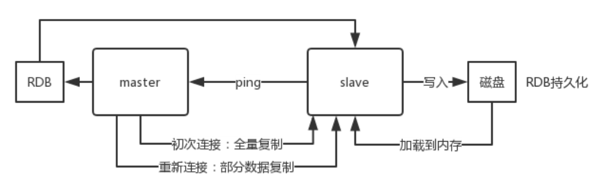

## 一、常见面试题


### 1、什么是Redis

Redis(Remote Dictionary Server) 是一个使用 C 语言编写的，开源的（BSD许可）高性能非关系型（NoSQL）的键值对数据库。
Redis 可以存储键和五种不同类型的值之间的映射。键的类型只能为字符串，值支持五种数据类型：字符串、列表、集合、散列表、有序集合。
与传统数据库不同的是 Redis 的数据是存在内存中的，所以读写速度非常快，因此 redis 被广泛应用于缓存方向，每秒可以处理超过 10万次读写操作，是已知性能最快的Key-Value DB。另外，Redis 也经常用来做分布式锁。除此之外，Redis 支持事务 、持久化、LUA脚本、LRU驱动事件、多种集群方案。


### 2、Redis有哪些优缺点

优点
	读写性能优异， Redis能读的速度是110000次/s，写的速度是81000次/s。
	支持数据持久化，支持AOF和RDB两种持久化方式。
	支持事务，Redis的所有操作都是原子性的，同时Redis还支持对几个操作合并后的原子性执行。
	数据结构丰富，除了支持string类型的value外还支持hash、set、zset、list等数据结构。
	支持主从复制，主机会自动将数据同步到从机，可以进行读写分离。

缺点
数据库容量受到物理内存的限制，不能用作海量数据的高性能读写，因此Redis适合的场景主要局限在较小数据量的高性能操作和运算上。

Redis 不具备自动容错和恢复功能，主机从机的宕机都会导致前端部分读写请求失败，需要等待机器重启或者手动切换前端的IP才能恢复。

主机宕机，宕机前有部分数据未能及时同步到从机，切换IP后还会引入数据不一致的问题，降低了系统的可用性。

Redis 较难支持在线扩容，在集群容量达到上限时在线扩容会变得很复杂。为避免这一问题，运维人员在系统上线时必须确保有足够的空间，这对资源造成了很大的浪费。

### 3、Redis为什么这么快

1、完全基于内存，绝大部分请求是纯粹的内存操作，非常快速。数据存在内存中，类似于 HashMap，HashMap 的优势就是查找和操作的时间复杂度都是O(1)；
2、数据结构简单，对数据操作也简单，Redis 中的数据结构是专门进行设计的；
3、采用单线程，避免了不必要的上下文切换和竞争条件，也不存在多进程或者多线程导致的切换而消耗 CPU，不用去考虑各种锁的问题，不存在加锁释放锁操作，没有因为可能出现死锁而导致的性能消耗；
4、使用多路 I/O 复用模型，非阻塞 IO；
5、使用底层模型不同，它们之间底层实现方式以及与客户端之间通信的应用协议不一样，Redis 直接自己构建了 VM 机制 ，因为一般的系统调用系统函数的话，会浪费一定的时间去移动和请求；

### 4、Redis有哪些数据类型

Redis主要有5种数据类型，包括String，List，Set，Zset，Hash，满足大部分的使用要求

| 数据类型 | 可以存储的值           | 操作                                                         | 应用场景                                                     |
| -------- | ---------------------- | ------------------------------------------------------------ | ------------------------------------------------------------ |
| STRING   | 字符串、整数或者浮点数 | 对整个字符串或者字符串的其中一部分执行操作对整数和浮点数执行自增或者自减操作 | 做简单的键值对缓存                                           |
| LIST     | 列表                   | 从两端压入或者弹出元素对单个或者多个元素进行修剪，只保留一个范围内的元素 | 存储一些列表型的数据结构，类似粉丝列表、文章的评论列表之类的数据 |
| SET      | 无序集合               | 添加、获取、移除单个元素检查一个元素是否存在于集合中 计算交集、并集、差集从集合里面随机获取元素 | 交集、并集、差集的操作，比如交集，可以把两个人的粉丝列表整个交集 |
| HASH     | 包含键值对的无序散列表 | 添加、获取、移除单个键值对获取所有键值对 检查某个键是否存在  | 结构化的数据，比如一个对象                                   |
| ZSET     | 有序集合               | 添加、获取、删除元素根据分值范围或者成员来获取元素 计算一个键的排名 | 去重但可以排序，如获取排名前几名的用户                       |

### 5、Redis的应用场景

**总结一**

**计数器**

可以对 String 进行自增自减运算，从而实现计数器功能。Redis 这种内存型数据库的读写性能非常高，很适合存储频繁读写的计数量。

递增指令：incr（默认从0开始）

递减指令：decr（默认从0开始，递减会出现负数，这点跟memcache不一样,mc到0）

**缓存**

将热点数据放到内存中，设置内存的最大使用量以及淘汰策略来保证缓存的命中率。

**会话缓存**

可以使用 Redis 来统一存储多台应用服务器的会话信息。当应用服务器不再存储用户的会话信息，也就不再具有状态，一个用户可以请求任意一个应用服务器，从而更容易实现高可用性以及可伸缩性。

**全页缓存（FPC）**

除基本的会话token之外，Redis还提供很简便的FPC平台。以Magento为例，Magento提供一个插件来使用Redis作为全页缓存后端。此外，对WordPress的用户来说，Pantheon有一个非常好的插件 wp-redis，这个插件能帮助你以最快速度加载你曾浏览过的页面。

**查找表**

例如 DNS 记录就很适合使用 Redis 进行存储。查找表和缓存类似，也是利用了Redis 快速的查找特性。但是查找表的内容不能失效，而缓存的内容可以失效，因为缓存不作为可靠的数据来源。

**消息队列(发布/订阅功能)**

List 是一个双向链表，可以通过 lpush 和 rpop 写入和读取消息。不过最好使用
Kafka、RabbitMQ 等消息中间件。

**分布式锁实现**

在分布式场景下，无法使用单机环境下的锁来对多个节点上的进程进行同步。可以使用 Redis 自带的 SETNX 命令实现分布式锁，除此之外，还可以使用官方提供的 RedLock 分布式锁实现。

**其它**
Set 可以实现交集、并集等操作，从而实现共同好友等功能。ZSet 可以实现有序性操作，从而实现排行榜等功能。


**总结二**

**Redis相比其他缓存，有一个非常大的优势，就是支持多种数据类型。**

数据类型说明

string字符串，最简单的k-v存储

hash格式，value为field和value，适合ID-Detail这样的场景。

list简单的list，顺序列表，支持首位或者末尾插入数据

set无序list，查找速度快，适合交集、并集、差集处理

sorted set有序的set

其实，通过上面的数据类型的特性，基本就能想到合适的应用场景了。
string——适合最简单的k-v存储，类似于memcached的存储结构，短信验证码，配置信息等，就用这种类型来存储。
hash——一般key为ID或者唯一标示，value对应的就是详情了。如商品详情，个人信息详情，新闻详情等。
list——因为list是有序的，比较适合存储一些有序且数据相对固定的数据。如省市区表、字典表等。因为list是有序的，适合根据写入的时间来排序，如：最新的***，消息队列等。
set——可以简单的理解为ID-List的模式，如微博中一个人有哪些好友，set最牛的地方在于，可以对两个set提供交集、并集、差集操作。例如：查找两个人共同的好友等。
Sorted Set——是set的增强版本，增加了一个score参数，自动会根据score的值进行排序。比较适合类似于top 10等不根据插入的时间来排序的数据。
如上所述，虽然Redis不像关系数据库那么复杂的数据结构，但是，也能适合很多场景，比一般的缓存数据结构要多。了解每种数据结构适合的业务场景，不仅有利于提升开发效率，也能有效利用Redis的性能。

### 6、什么是Redis持久化？

持久化就是把内存的数据写到磁盘中去，防止服务宕机了内存数据丢失。

### 7、Redis 的持久化机制是什么？各自的优缺点？

Redis 提供两种持久化机制 RDB（默认） 和 AOF 机制:
RDB：是Redis DataBase缩写快照
RDB是Redis默认的持久化方式。按照一定的时间将内存的数据以快照的形式保存到硬盘中，对应产生的数据文件为dump.rdb。通过配置文件中的save参数来定义快照的周期。


**优点：**
1、只有一个文件 dump.rdb，方便持久化。
2、容灾性好，一个文件可以保存到安全的磁盘。
3、性能最大化，fork 子进程来完成写操作，让主进程继续处理命令，所以是IO 最大化。使用单独子进程来进行持久化，主进程不会进行任何 IO 操作，保证了redis 的高性能
4.相对于数据集大时，比 AOF 的启动效率更高。

**缺点：**
1、数据安全性低。RDB 是间隔一段时间进行持久化，如果持久化之间 redis 发生故障，会发生数据丢失。所以这种方式更适合数据要求不严谨的时候)
2、AOF（Append-only file)持久化方式： 是指所有的命令行记录以 redis 命令请 求协议的格式完全持久化存储)保存为 aof 文件。

**AOF：持久化**

AOF持久化(即Append Only File持久化)，则是将Redis执行的每次写命令记录到单独的日志文件中，当重启Redis会重新将持久化的日志中文件恢复数据。

当两种方式同时开启时，数据恢复Redis会优先选择AOF恢复。


优点：
1、数据安全，aof 持久化可以配置 appendfsync 属性，有 always，每进行一次 命令操作就记录到 aof 文件中一次。
2、通过 append 模式写文件，即使中途服务器宕机，可以通过 redis-check-aof 工具解决数据一致性问题。
3、AOF 机制的 rewrite 模式。AOF 文件没被 rewrite 之前（文件过大时会对命令 进行合并重写），可以删除其中的某些命令（比如误操作的 flushall）)
缺点：
1、AOF 文件比 RDB 文件大，且恢复速度慢。
2、数据集大的时候，比 rdb 启动效率低。

优缺点是什么？
AOF文件比RDB更新频率高，优先使用AOF还原数据。
AOF比RDB更安全也更大
RDB性能比AOF好
如果两个都配了优先加载AOF

### 8、如何选择合适的持久化方式

一般来说， 如果想达到足以媲美PostgreSQL的数据安全性，你应该同时使用两种持久化功能。在这种情况下，当 Redis 重启的时候会优先载入AOF文件来恢复原始的数据，因为在通常情况下AOF文件保存的数据集要比RDB文件保存的数据集要完整。

如果你非常关心你的数据， 但仍然可以承受数分钟以内的数据丢失，那么你可以只使用RDB持久化。

有很多用户都只使用AOF持久化，但并不推荐这种方式，因为定时生成RDB快照（snapshot）非常便于进行数据库备份， 并且 RDB 恢复数据集的速度也要比AOF恢复的速度要快，除此之外，使用RDB还可以避免AOF程序的bug。

如果你只希望你的数据在服务器运行的时候存在，你也可以不使用任何持久化方式。

### 9、Redis持久化数据和缓存怎么做扩容？

如果Redis被当做缓存使用，使用一致性哈希实现动态扩容缩容。
如果Redis被当做一个持久化存储使用，必须使用固定的keys-to-nodes映射关系，节点的数量一旦确定不能变化。否则的话(即Redis节点需要动态变化的情况），必须使用可以在运行时进行数据再平衡的一套系统，而当前只有Redis集群可以做到这样。

### 10、Redis的过期键的删除策略

我们都知道，Redis是key-value数据库，我们可以设置Redis中缓存的key的过期时间。Redis的过期策略就是指当Redis中缓存的key过期了，Redis如何处理。

过期策略通常有以下三种：

定时过期：每个设置过期时间的key都需要创建一个定时器，到过期时间就会立即清除。该策略可以立即清除过期的数据，对内存很友好；但是会占用大量的CPU资源去处理过期的数据，从而影响缓存的响应时间和吞吐量。

惰性过期：只有当访问一个key时，才会判断该key是否已过期，过期则清除。
该策略可以最大化地节省CPU资源，却对内存非常不友好。极端情况可能出现大量的过期key没有再次被访问，从而不会被清除，占用大量内存。

定期过期：每隔一定的时间，会扫描一定数量的数据库的expires字典中一定数量的key，并清除其中已过期的key。该策略是前两者的一个折中方案。通过调整定时扫描的时间间隔和每次扫描的限定耗时，可以在不同情况下使得CPU和内存资源达到最优的平衡效果。

(expires字典会保存所有设置了过期时间的key的过期时间数据，其中，key是指向键空间中的某个键的指针，value是该键的毫秒精度的UNIX时间戳表示的过期时间。键空间是指该Redis集群中保存的所有键。)

Redis中同时使用了惰性过期和定期过期两种过期策略。

### 11、Redis key的过期时间和永久有效分别怎么设置？

EXPIRE和PERSIST命令。

### 12、我们知道通过expire来设置key 的过期时间，那么对过期的数据怎么处理呢?

除了缓存服务器自带的缓存失效策略之外（Redis默认的有6中策略可供选择），我们还可以根据具体的业务需求进行自定义的缓存淘汰，常见的策略有两种：

1. 定时去清理过期的缓存；
2. 当有用户请求过来时，再判断这个请求所用到的缓存是否过期，过期的话就去底层系统得到新数据并更新缓存。

两者各有优劣，第一种的缺点是维护大量缓存的key是比较麻烦的，第二种的缺点就是每次用户请求过来都要判断缓存失效，逻辑相对比较复杂！具体用哪种方案，大家可以根据自己的应用场景来权衡。

### 13、MySQL里有2000w数据，redis中只存20w的数据，如何保证redis中的数据都是热点数据

redis内存数据集大小上升到一定大小的时候，就会施行数据淘汰策略。

### 14、Redis的内存淘汰策略有哪些

Redis的内存淘汰策略是指在Redis的用于缓存的内存不足时，怎么处理需要新写入且需要申请额外空间的数据。

**全局的键空间选择性移除**
noeviction：当内存不足以容纳新写入数据时，新写入操作会报错。
allkeys-lru：当内存不足以容纳新写入数据时，在键空间中，移除最近最少使用的key。（这个是 最常用 的）
allkeys-random：当内存不足以容纳新写入数据时，在键空间中，随机移除某个key。

**设置过期时间的键空间选择性移除**

volatile-lru：当内存不足以容纳新写入数据时，在设置了过期时间的键空间中，移除最近最少使用的key。
volatile-random：当内存不足以容纳新写入数据时，在设置了过期时间的键空间中，随机移除某个key。
volatile-ttl：当内存不足以容纳新写入数据时，在设置了过期时间的键空间中，有更早过期时间的key优先移除。

总结
Redis的内存淘汰策略的选取并不会影响过期的key的处理。内存淘汰策略用于处理内存不足时的需要申请额外空间的数据；过期策略用于处理过期的缓存数据。

### 15、Redis主要消耗什么物理资源？

内存。

### 16、Redis的内存用完了会发生什么？

如果达到设置的上限，Redis的写命令会返回错误信息（但是读命令还可以正常返回。）或者你可以配置内存淘汰机制，当Redis达到内存上限时会冲刷掉旧的内容。

### 17、Redis如何做内存优化？

可以好好利用Hash,list,sorted set,set等集合类型数据，因为通常情况下很多小的Key-Value可以用更紧凑的方式存放到一起。尽可能使用散列表（hashes），散列表（是说散列表里面存储的数少）使用的内存非常小，所以
你应该尽可能的将你的数据模型抽象到一个散列表里面。比如你的web系统中有一个用户对象，不要为这个用户的名称，姓氏，邮箱，密码设置单独的key，而是应该把这个用户的所有信息存储到一张散列表里面

### 18、Redis线程模型

Redis基于Reactor模式开发了网络事件处理器，这个处理器被称为文件事件处理器（file event handler）。它的组成结构为4部分：多个套接字、IO多路复用程序、文件事件分派器、事件处理器。因为文件事件分派器队列的消费是单线程
的，所以Redis才叫单线程模型。
文件事件处理器使用 I/O 多路复用（multiplexing）程序来同时监听多个套接字， 并根据套接字目前执行的任务来为套接字关联不同的事件处理器。
当被监听的套接字准备好执行连接应答（accept）、读取（read）、写入（write）、关闭（close）等操作时， 与操作相对应的文件事件就会产生， 这时文件事件处理器就会调用套接字之前关联好的事件处理器来处理这些事件。
虽然文件事件处理器以单线程方式运行， 但通过使用 I/O 多路复用程序来监听多个套接字， 文件事件处理器既实现了高性能的网络通信模型， 又可以很好地与 redis 服务器中其他同样以单线程方式运行的模块进行对接， 这保持了Redis 内部单线程设计的简单性。

### 19、什么是事务？

事务是一个单独的隔离操作：事务中的所有命令都会序列化、按顺序地执行。事务在执行的过程中，不会被其他客户端发送来的命令请求所打断。
事务是一个原子操作：事务中的命令要么全部被执行，要么全部都不执行。

### 20、Redis事务的概念

Redis 事务的本质是通过MULTI、EXEC、WATCH等一组命令的集合。事务支持一次执行多个命令，一个事务中所有命令都会被序列化。在事务执行过程，会按照顺序串行化执行队列中的命令，其他客户端提交的命令请求不会插入到事务
执行命令序列中。
总结说：redis事务就是一次性、顺序性、排他性的执行一个队列中的一系列命令。

### 21、Redis事务的三个阶段

1. 事务开始 MULTI
2. 命令入队
3. 事务执行 EXEC

事务执行过程中，如果服务端收到有EXEC、DISCARD、WATCH、MULTI之外的请求，将会把请求放入队列中排队

### 22、Redis事务相关命令

Redis事务功能是通过MULTI、EXEC、DISCARD和WATCH 四个原语实现的Redis会将一个事务中的所有命令序列化，然后按顺序执行。

1. redis 不支持回滚，“Redis 在事务失败时不进行回滚，而是继续执行余下的命令”， 所以 Redis 的内部可以保持简单且快速。
2. 如果在一个事务中的命令出现错误，那么所有的命令都不会执行；
3. 如果在一个事务中出现运行错误，那么正确的命令会被执行。

WATCH 命令是一个乐观锁，可以为 Redis 事务提供 check-and-set （CAS）行为。 可以监控一个或多个键，一旦其中有一个键被修改（或删除），之后的事务就不会执行，监控一直持续到EXEC命令。

MULTI命令用于开启一个事务，它总是返回OK。 MULTI执行之后，客户端可以继续向服务器发送任意多条命令，这些命令不会立即被执行，而是被放到一个队列中，当EXEC命令被调用时，所有队列中的命令才会被执行。

EXEC：执行所有事务块内的命令。返回事务块内所有命令的返回值，按命令执行的先后顺序排列。 当操作被打断时，返回空值 nil 。

通过调用DISCARD，客户端可以清空事务队列，并放弃执行事务， 并且客户端会从事务状态中退出。

UNWATCH命令可以取消watch对所有key的监控。

### 23、事务管理（ACID）概述

**原子性（Atomicity）**

原子性是指事务是一个不可分割的工作单位，事务中的操作要么都发生，要么都不发生。

**一致性（Consistency）**

事务前后数据的完整性必须保持一致。

**隔离性（Isolation）**

多个事务并发执行时，一个事务的执行不应影响其他事务的执行

**持久性（Durability）**

持久性是指一个事务一旦被提交，它对数据库中数据的改变就是永久性的，接下来即使数据库发生故障也不应该对其有任何影响

Redis的事务总是具有ACID中的一致性和隔离性，其他特性是不支持的。当服务器运行在AOF持久化模式下，并且appendfsync选项的值为always时，事务也具有耐久性。

### 24、Redis事务支持隔离性吗

Redis 是单进程程序，并且它保证在执行事务时，不会对事务进行中断，事务可以运行直到执行完所有事务队列中的命令为止。因此，Redis 的事务是总是带有隔离性的。

### 25、Redis事务保证原子性吗，支持回滚吗

Redis中，单条命令是原子性执行的，但事务不保证原子性，且没有回滚。事务中任意命令执行失败，其余的命令仍会被执行。

### 26、Redis事务其他实现

基于Lua脚本，Redis可以保证脚本内的命令一次性、按顺序地执行，其同时也不提供事务运行错误的回滚，执行过程中如果部分命令运行错误，剩下的命令还是会继续运行完

基于中间标记变量，通过另外的标记变量来标识事务是否执行完成，读取数据时先读取该标记变量判断是否事务执行完成。但这样会需要额外写代码实现，比较繁琐


### 27、Redis与Memcached的区别

两者都是非关系型内存键值数据库，现在公司一般都是用 Redis 来实现缓存，而且 Redis 自身也越来越强大了！Redis 与 Memcached 主要有以下不同：

| 对比     参数    | Redis                                                        | Memcached                                                    |
| ---------------- | ------------------------------------------------------------ | :----------------------------------------------------------- |
| 类型             | 1. 支持内存 2. 非关系型数据库                                | 1. 支持内存 2. 键值对形式 3. 缓存形式                        |
| 数据存储类型     | 1. String 2. List 3. Set 4. Hash 5. Sort Set 【俗称ZSet】    | 1. 文本型 2. 二进制类型                                      |
| 查询【操作】类型 | 1. 批量操作 2. 事务支持 3. 每个类型不同的CRUD                | 1.常用的CRUD 2. 少量的其他命令                               |
| 附加功能         | 1. 发布/订阅模式 2. 主从分区 3.序列化支持 4. 脚本支持【Lua脚本】 | 1. 多线程服务支持                                            |
| 网络IO模型       | 1. 单线程的多路 IO 复用模型                                  | 1. 多线程，非阻塞IO模式                                      |
| 事件库           | 自封转简易事件库AeEvent                                      | 贵族血统的LibEvent事件库                                     |
| 持久化支持       | 1. RDB 2. AOF                                                | 不支持                                                       |
| 集群模式         | 原生支持 cluster 模式，可以实现主从复制，读写分离            | 没有原生的集群模式，需要依靠客户端来实现往集群中分片写入数据 |
| 内存管理机制     | 在 Redis 中，并不是所有数据都一直存储在内存中，可以将一些很久没用的 value 交换到磁盘 | Memcached 的数据则会一直在内存中，Memcached 将内存                                                                                   分割成特定长度的块来存储数据，以完全解决内存碎片的问题。                                 但是这种方式会使得内存的利用率不高，例如块的大小为 128 bytes，                       只存储 100 bytes 的数据，那么剩下的 28 bytes 就浪费掉了。 |
| 适用场景         | 复杂数据结构，有持久化，高可用需求，value存储内容较大        | 纯key-value，数据量非常大，并发量非常大的业务                |

(1) memcached所有的值均是简单的字符串，redis作为其替代者，支持更为丰富的数据类型
(2) redis的速度比memcached快很多
(3) redis可以持久化其数据


### 28、Redis常见性能问题和解决方案？

1. Master最好不要做任何持久化工作，包括内存快照和AOF日志文件，特别是不要启用内存快照做持久化。
2. 如果数据比较关键，某个Slave开启AOF备份数据，策略为每秒同步一次。
3. 为了主从复制的速度和连接的稳定性，Slave和Master最好在同一个局域网内。
4. 尽量避免在压力较大的主库上增加从库
5. Master调用BGREWRITEAOF重写AOF文件，AOF在重写的时候会占大量的CPU和内存资源，导致服务load过高，出现短暂服务暂停现象。
6. 为了Master的稳定性，主从复制不要用图状结构，用单向链表结构更稳定，即主从关系为：Master<–Slave1<–Slave2<–Slave3…，这样的结构也方便解决单点故障问题，实现Slave对Master的替换，也即，如果Master挂了，可以立马启用Slave1做Master，其他不变。

### 29、一个字符串类型的值能存储最大容量是多少？

512M

### 30、Redis如何做大量数据插入？

Redis2.6开始redis-cli支持一种新的被称之为pipe mode的新模式用于执行大量
数据插入工作。

### 31、假如Redis里面有1亿个key，其中有10w个key是以某个固定的已知的前缀开头的，如果将它们全部找出来？

使用keys指令可以扫出指定模式的key列表。

对方接着追问：如果这个redis正在给线上的业务提供服务，那使用keys指令会有什么问题？

这个时候你要回答redis关键的一个特性：redis的单线程的。keys指令会导致线程阻塞一段时间，线上服务会停顿，直到指令执行完毕，服务才能恢复。这个时候可以使用scan指令，scan指令可以无阻塞的提取出指定模式的key列表，但是
会有一定的重复概率，在客户端做一次去重就可以了，但是整体所花费的时间会比直接用keys指令长。


### 32、使用Redis做过异步队列吗，是如何实现的

使用list类型保存数据信息，rpush生产消息，lpop消费消息，当lpop没有消息时，可以sleep一段时间，然后再检查有没有信息，如果不想sleep的话，可以使用blpop, 在没有信息的时候，会一直阻塞，直到信息的到来。redis可以通过pub/sub主题订阅模式实现一个生产者，多个消费者，当然也存在一定的缺点，当消费者下线时，生产的消息会丢失。

### 33、Redis如何实现延时队列

使用sortedset，使用时间戳做score, 消息内容作为key,调用zadd来生产消息，消费者使用zrangbyscore获取n秒之前的数据做轮询处理。

### 34、Redis回收进程如何工作的？

1. 一个客户端运行了新的命令，添加了新的数据。
2. Redis检查内存使用情况，如果大于maxmemory的限制， 则根据设定好的策略进行回收。
3. 一个新的命令被执行，等等。
4. 所以我们不断地穿越内存限制的边界，通过不断达到边界然后不断地回收回到边界以下。

如果一个命令的结果导致大量内存被使用（例如很大的集合的交集保存到一个新的键），不用多久内存限制就会被这个内存使用量超越。

### 35、Redis回收使用的是什么算法？

LRU算法


### 36、redis的集合有没有限制，限制是多少


### 37、redis的1w条插入和更新有什么区别


### 38、三种特殊数据类型:

- **1.geospatial**: Redis 在 3.2 推出 Geo 类型，该功能**可以推算出地理位置信息，两地之间的距离**。
- **2.hyperloglog**:基数：数学上集合的元素个数，是不能重复的。这个数据结构**常用于统计网站的 UV**。
- **3.bitmap**: bitmap 就是通过最小的单位 bit 来进行0或者1的设置，表示某个元素对应的值或者状态。一个 bit 的值，或者是0，或者是1；也就是说一个 bit 能存储的最多信息是2。bitmap **常用于统计用户信息比如活跃粉丝和不活跃粉丝、登录和未登录、是否打卡等**。

### 39、**听说 redis 6.0之后又使用了多线程，不会有线程安全的问题吗？**

**不会**

其实 redis **还是使用单线程模型来处理客户端的请求**，只是使用多线程来处理数据的读写和协议解析，执行命令还是使用单线程，所以是不会有线程安全的问题。

之所以加入了多线程因为 redis 的性能瓶颈在于网络IO而非CPU，使用多线程能提升IO读写的效率，从而整体提高redis的性能。


### 40、**redis 的持久化机制有哪些？优缺点说说**

redis 有**两种**持久化的方式，AOF 和 RDB.

**AOF**:

- redis 每次执行一个命令时,都会把这个「命令原本的语句记录到一个.aod的文件当中,然后通过fsync策略,将命令执行后的数据持久化到磁盘中」(不包括读命令)，

AOF的优缺点


- **AOF 的「优点」**:

- - 1.AOF可以「更好的保护数据不丢失」，一般AOF会以每隔1秒，通过后台的一个线程去执行一次fsync操作，如果redis进程挂掉，**最多丢失1秒的数据**
  - 2.AOF是将命令直接追加在文件末尾的,**「写入性能非常高」**
  - 3.AOF日志文件的命令通过非常可读的方式进行记录，这个非常「**适合做灾难性的误删除紧急恢复」**，如果某人不小心用 flushall 命令清空了所有数据，只要这个时候还没有执行 rewrite，那么就可以将日志文件中的 flushall 删除，进行恢复


- **AOF 的「缺点」**:

- - 1.对于同一份数据源来说,一般情况下**AOF 文件比 RDB 数据快照要大**
  - 2.由于 .aof 的**每次命令都会写入**,那么相对于 RDB 来说「需要消耗的性能也就更多」，当然也会有 **aof 重写**将 aof 文件优化。
  - 3.**「数据恢复比较慢」**，不适合做冷备。

**RDB**:

- 把**某个时间点 redis 内存**中的数据以二进制的形式存储的一个.rdb为后缀的文件当中,也就是「**周期性的备份redis中的整个数据**」,这是redis**默认**的持久化方式,也就是我们说的快照(snapshot)，是采用 fork 子进程的方式来写时同步的。

**RDB的优缺点**


- RDB的优点:

- - 1.它是将某一时间点redis内的所有数据保存下来,所以当我们做「大型的数据恢复时,RDB的恢复速度会很快」
  - 2.由于RDB的FROK子进程这种机制,队友给客户端提供读写服务的影响会非常小


- RDB的缺点:

- - 举个例子假设我们定时5分钟备份一次,在10:00的时候 redis 备份了数据,但是如果在10:04的时候服务挂了,那么我们就会丢失在10:00到10:04的整个数据
  - 1:「有可能会产生长时间的数据丢失」
  - 2:可能会有长时间停顿:我们前面讲了,fork 子进程这个过程是和 redis 的数据量有很大关系的,**如果「数据量很大,那么很有可能会使redis暂停几秒」**

### 41、**Redis的过期键的删除策略有哪些？**

- **定时过期**：**每个设置过期时间的key都需要创建一个定时器，到过期时间就会立即清除**。该策略可以立即清除过期的数据，对内存很友好；但是会占用大量的CPU资源去处理过期的数据，从而影响缓存的响应时间和吞吐量。
- **惰性过期**：只有当**访问一个key时，才会判断该key是否已过期**，过期则清除。该策略可以最大化地节省CPU资源，却对内存非常不友好。极端情况可能出现大量的过期key没有再次被访问，从而不会被清除，占用大量内存。
- **定期过期**：**每隔一定的时间，会扫描一定数量的数据库的expires字典中一定数量的key，并清除其中已过期的key**。该策略是前两者的一个折中方案。通过调整定时扫描的时间间隔和每次扫描的限定耗时，可以在不同情况下使得CPU和内存资源达到最优的平衡效果。

### 42、**Redis的内存满了怎么办？**

实际上Redis**定义了「8种内存淘汰策略」用**来处理redis内存满的情况：

- 1.noeviction：直接返回错误，不淘汰任何已经存在的redis键
- 2.allkeys-lru：所有的键使用lru算法进行淘汰
- 3.volatile-lru：有过期时间的使用lru算法进行淘汰
- 4.allkeys-random：随机删除redis键
- 5.volatile-random：随机删除有过期时间的redis键
- 6.volatile-ttl：删除快过期的redis键
- 7.volatile-lfu：根据lfu算法从有过期时间的键删除
- 8.allkeys-lfu：根据lfu算法从所有键删除


### 43、**Redis 的热 key 问题怎么解决？**

热 key  就是说，在某一时刻，有非常多的请求访问某个 key，流量过大，导致该 redi 服务器宕机

解决方案:

- 可以将结果缓存到本地内存中
- 将热 key 分散到不同的服务器中
- 设置永不过期


## 二、哨兵模式


### 1、哨兵的介绍

sentinel，中文名是哨兵。哨兵是 redis 集群机构中非常重要的一个组件，主要有以下功能：

集群监控：负责监控 redis master 和 slave 进程是否正常工作。
消息通知：如果某个 redis 实例有故障，那么哨兵负责发送消息作为报警通知给管理员。
故障转移：如果 master node 挂掉了，会自动转移到 slave node 上。
配置中心：如果故障转移发生了，通知 client 客户端新的 master 地址。

哨兵用于实现 redis 集群的高可用，本身也是分布式的，作为一个哨兵集群去运行，互相协同工作。

故障转移时，判断一个 master node 是否宕机了，需要大部分的哨兵都同意才行，涉及到了分布式选举的问题。
即使部分哨兵节点挂掉了，哨兵集群还是能正常工作的，因为如果一个作为高可用机制重要组成部分的故障转移系统本身是单点的，那就很坑爹了。

### 2、哨兵的核心知识

哨兵至少需要 3 个实例，来保证自己的健壮性。
哨兵 + redis 主从的部署架构，是 不保证数据零丢失 的，只能保证 redis 集群的高可用性。
对于哨兵 + redis 主从这种复杂的部署架构，尽量在测试环境和生产环境，都进行充足的测试和演练。

### 3、**哨兵选举过程是怎么样的？**

- 1.第一个发现该master挂了的哨兵，向每个哨兵发送命令，让对方选举自己成为领头哨兵
- 2.其他哨兵如果没有选举过他人，就会将这一票投给第一个发现该master挂了的哨兵
- 3.第一个发现该master挂了的哨兵如果发现由超过一半哨兵投给自己，并且其数量也超过了设定的quoram参数，那么该哨兵就成了领头哨兵
- 4.如果多个哨兵同时参与这个选举，那么就会重复该过程，知道选出一个领头哨兵

选出领头哨兵后，就开始了故障修复，会从选出一个从数据库作为新的master


## 三、集群方案


### 1、简介

Redis Cluster是一种服务端Sharding技术，3.0版本开始正式提供。Redis Cluster并没有使用一致性hash，而是采用slot(槽)的概念，一共分成16384个槽。将请求发送到任意节点，接收到请求的节点会将查询请求发送到正确的节点
上执行。

**方案说明**

1. 通过哈希的方式，将数据分片，每个节点均分存储一定哈希槽(哈希值)区间的数据，默认分配了16384 个槽位
2. 每份数据分片会存储在多个互为主从的多节点上
3. 数据写入先写主节点，再同步到从节点(支持配置为阻塞同步)
4. 同一分片多个节点间的数据不保持一致性
5. 读取数据时，当客户端操作的key没有分配在该节点上时，redis会返转向指令，指向正确的节点
6. 扩容时时需要需要把旧节点的数据迁移一部分到新节点

在 redis cluster 架构下，每个 redis 要放开两个端口号，比如一个是 6379，另外一个就是 加1w 的端口号，比如 16379。

16379 端口号是用来进行节点间通信的，也就是 cluster bus 的东西，cluster bus 的通信，用来进行故障检测、配置更新、故障转移授权。cluster bus 用了另外一种二进制的协议， gossip  协议，用于节点间进行高效的数据交换，占用更
少的网络带宽和处理时间。


### 2、节点间的内部通信机制

**基本通信原理**

集群元数据的维护有两种方式：集中式、Gossip 协议。redis cluster 节点间采用 gossip 协议进行通信。

**分布式寻址算法**

hash 算法（大量缓存重建）
一致性 hash 算法（自动缓存迁移）+ 虚拟节点（自动负载均衡）
redis cluster 的 hash slot 算法

**优点**
无中心架构，支持动态扩容，对业务透明
具备Sentinel的监控和自动Failover(故障转移)能力
客户端不需要连接集群所有节点，连接集群中任何一个可用节点即可
高性能，客户端直连redis服务，免去了proxy代理的损耗

**缺点**
运维也很复杂，数据迁移需要人工干预
只能使用0号数据库
不支持批量操作(pipeline管道操作)
分布式逻辑和存储模块耦合等

### 3、说说Redis哈希槽的概念？

Redis集群没有使用一致性hash,而是引入了哈希槽的概念，Redis集群有16384个哈希槽，每个key通过CRC16校验后对16384取模来决定放置哪个槽，集群的每个节点负责一部分hash槽。

### 4、Redis集群会有写操作丢失吗？为什么？

Redis并不能保证数据的强一致性，这意味这在实际中集群在特定的条件下可能会丢失写操作。

### 5、Redis集群之间是如何复制的？

异步复制

### 6、Redis集群最大节点个数是多少？

16384个

### 7、Redis集群如何选择数据库？

Redis集群目前无法做数据库选择，默认在0数据库。


### 6、**cluster集群模式是怎么存放数据的？**

一个cluster集群中总共有16384个节点，集群会**将这16384个节点平均分配给每个节点**，当然，我这里的节点指的是每个主节点，就如同下图：


### 7、**cluster的故障恢复是怎么做的？**

判断故障的逻辑其实与哨兵模式有点类似，在集群中，每个节点都会**定期的向其他节点发送ping命令**，通过有没有收到回复来判断其他节点是否已经下线。

如果**长时间没有回复，那么发起ping命令的节点就会认为目标节点疑似下线**，也可以和哨兵一样称作主观下线，当然也需要集群中一定数量的节点都认为该节点下线才可以，我们来说说具体过程：


- 1.当A节点发现目标节点疑似下线，就会向集群中的其他节点散播消息，其他节点就会向目标节点发送命令，判断目标节点是否下线
- 2.如果集群中半数以上的节点都认为目标节点下线，就会对目标节点标记为下线，从而告诉其他节点，让目标节点在整个集群中都下线


## 四、主从架构

### 1、简介

单机的 redis，能够承载的 QPS 大概就在上万到几万不等。对于缓存来说，一般都是用来支撑读高并发的。因此架构做成主从(master-slave)架构，一主多从，主负责写，并且将数据复制到其它的 slave 节点，从节点负责读。所有的读
请求全部走从节点。这样也可以很轻松实现水平扩容，支撑读高并发。


### 2、redis replication 的核心机制

- redis 采用 异步方式 复制数据到 slave 节点，不过 redis2.8 开始，slave node会周期性地确认自己每次复制的数据量；

- 一个 master node 是可以配置多个 slave node 的；

- slave node 也可以连接其他的 slave node；

- slave node 做复制的时候，不会 block master node 的正常工作；

- slave node 在做复制的时候，也不会 block 对自己的查询操作，它会用旧的数据集来提供服务；但是复制完成的时候，需要删除旧数据集，加载新数据集，这个时候就会暂停对外服务了；

- slave node 主要用来进行横向扩容，做读写分离，扩容的 slave node 可以提高读的吞吐量。

注意，如果采用了主从架构，那么建议必须开启 master node 的持久化，不建议用 slave node 作为 master node 的数据热备，因为那样的话，如果你关掉master 的持久化，可能在 master 宕机重启的时候数据是空的，然后可能一经过复制， slave node 的数据也丢了。

另外，master 的各种备份方案，也需要做。万一本地的所有文件丢失了，从备份中挑选一份 rdb 去恢复 master，这样才能确保启动的时候，是有数据的，即使采用了后续讲解的高可用机制，slave node 可以自动接管 master node，但
也可能 sentinel 还没检测到 master failure，master node 就自动重启了，还是可能导致上面所有的 slave node 数据被清空。

### 3、redis 主从复制的核心原理

当启动一个 slave node 的时候，它会发送一个  PSYNC  命令给 master node。如果这是 slave node 初次连接到 master node，那么会触发一次  full resynchronization  全量复制。此时 master 会启动一个后台线程，开始生成一份
RDB  快照文件，同时还会将从客户端 client 新收到的所有写命令缓存在内存中。 RDB  文件生成完毕后， master 会将这个  RDB  发送给 slave，slave 会先写入本地磁盘，然后再从本地磁盘加载到内存中，接着 master 会将内存中缓存的写命令发送到 slave，slave 也会同步这些数据。

slave node 如果跟 master node 有网络故障，断开了连接，会自动重连，连接之后 master node 仅会复制给 slave 部分缺少的数据。



**过程原理**

1. 当从库和主库建立MS关系后，会向主数据库发送SYNC命令
2. 主库接收到SYNC命令后会开始在后台保存快照(RDB持久化过程)，并将期间接收到的写命令缓存起来
3. 当快照完成后，主Redis会将快照文件和所有缓存的写命令发送给从Redis
4. 从Redis接收到后，会载入快照文件并且执行收到的缓存的命令
5. 之后，主Redis每当接收到写命令时就会将命令发送从Redis，从而保证数据的一致

缺点
所有的slave节点数据的复制和同步都由master节点来处理，会照成master节点压力太大，使用主从从结构来解决


### 4、Redis集群的主从复制模型是怎样的？

为了使在部分节点失败或者大部分节点无法通信的情况下集群仍然可用，所以集群使用了主从复制模型，每个节点都会有N-1个复制品


### 5、生产环境中的 redis 是怎么部署的？

redis cluster，10 台机器，5 台机器部署了 redis 主实例，另外 5 台机器部署了 redis 的从实例，每个主实例挂了一个从实例，5 个节点对外提供读写服务每个节点的读写高峰qps可能可以达到每秒 5 万，5 台机器最多是 25 万读写请
求/s。
机器是什么配置？32G 内存+ 8 核 CPU + 1T 磁盘，但是分配给 redis 进程的是10g内存，一般线上生产环境，redis 的内存尽量不要超过 10g，超过 10g 可能会有问题。
5 台机器对外提供读写，一共有 50g 内存。
因为每个主实例都挂了一个从实例，所以是高可用的，任何一个主实例宕机，都会自动故障迁移，redis 从实例会自动变成主实例继续提供读写服务。
你往内存里写的是什么数据？每条数据的大小是多少？商品数据，每条数据是10kb。100 条数据是 1mb，10 万条数据是 1g。常驻内存的是 200 万条商品数据，占用内存是 20g，仅仅不到总内存的 50%。目前高峰期每秒就是 3500
左右的请求量。

其实大型的公司，会有基础架构的 team 负责缓存集群的运维。


### 6、**主从同步原理是怎样的？**

- 1.当一个从数据库启动时，它会向**主数据库发送一个SYNC命令**，master收到后，在后台保存快照，也就是我们说的RDB持久化，当然保存快照是需要消耗时间的，并且redis是单线程的，在保存快照期间redis受到的命令会缓存起来
- 2.快照完成后会**将缓存的命令以及快照一起打包发给slave节点**，从而保证主从数据库的一致性。
- 3.从数据库接受到快照以及缓存的命令后会将这部分数据**写入到硬盘上的临时文件当中**，写入完成后会用这份文件去替换掉RDB快照文件，当然，这个操作是不会阻塞的，可以继续接收命令执行，具体原因其实就是fork了一个子进程，用子进程去完成了这些功能。

因为不会阻塞，所以，这部分初始化完成后，当主数据库执行了改变数据的命令后，会异步的给slave，这也就是我们说的复制同步阶段，这个阶段会贯穿在整个中从同步的过程中，直到主从同步结束后，复制同步才会终止。

### 7、**无硬盘复制是什么？**

我们刚刚说了主从之间是通过RDB快照来交互的，虽然看来逻辑很简单，但是还是会存在一些问题，但是会存在着一些问题。

- 1.master禁用了RDB快照时，发生了主从同步(复制初始化)操作，也会生成RDB快照，但是之后如果master发成了重启，就会用RDB快照去恢复数据，这份数据可能已经很久了，中间就会丢失数据
- 2.在这种一主多从的结构中，master每次和slave同步数据都要进行一次快照，从而在硬盘中生成RDB文件，会影响性能

为了解决这种问题，redis在后续的更新中也加入了无硬盘复制功能，也就是说**直接通过网络发送给slave**，避免了和硬盘交互，但是也是有io消耗

## 五、分区

### 1、Redis是单线程的，如何提高多核CPU的利用率？

可以在同一个服务器部署多个Redis的实例，并把他们当作不同的服务器来使用，在某些时候，无论如何一个服务器是不够的， 所以，如果你想使用多个CPU，你可以考虑一下分片（shard）。

### 2、为什么要做Redis分区？

分区可以让Redis管理更大的内存，Redis将可以使用所有机器的内存。如果没有分区，你最多只能使用一台机器的内存。分区使Redis的计算能力通过简单地增加计算机得到成倍提升，Redis的网络带宽也会随着计算机和网卡的增加而成
倍增长。

### 3、你知道有哪些Redis分区实现方案？

客户端分区就是在客户端就已经决定数据会被存储到哪个redis节点或者从哪个redis节点读取。大多数客户端已经实现了客户端分区。

代理分区 意味着客户端将请求发送给代理，然后代理决定去哪个节点写数据或者读数据。代理根据分区规则决定请求哪些Redis实例，然后根据Redis的响应结果返回给客户端。redis和memcached的一种代理实现就是Twemproxy

查询路由(Query routing) 的意思是客户端随机地请求任意一个redis实例，然后由Redis将请求转发给正确的Redis节点。Redis Cluster实现了一种混合形式的查询路由，但并不是直接将请求从一个redis节点转发到另一个redis节点，而是在客户端的帮助下直接redirected到正确的redis节点。


### 4、Redis分区有什么缺点？

涉及多个key的操作通常不会被支持。例如你不能对两个集合求交集，因为他们可能被存储到不同的Redis实例（实际上这种情况也有办法，但是不能直接使用交集指令）。

同时操作多个key,则不能使用Redis事务.

分区使用的粒度是key，不能使用一个非常长的排序key存储一个数据集（The partitioning granularity is the key, so it is not possible to shard a dataset with a single huge key like a very big sorted set）

当使用分区的时候，数据处理会非常复杂，例如为了备份你必须从不同的Redis实例和主机同时收集RDB / AOF文件。

分区时动态扩容或缩容可能非常复杂。Redis集群在运行时增加或者删除Redis节点，能做到最大程度对用户透明地数据再平衡，但其他一些客户端分区或者代理分区方法则不支持这种特性。然而，有一种预分片的技术也可以较好的解决这个问题。


## 六、分布式问题

### 1、Redis实现分布式锁

Redis为单进程单线程模式，采用队列模式将并发访问变成串行访问，且多客户端对Redis的连接并不存在竞争关系Redis中可以使用SETNX命令实现分布式锁。

当且仅当 key 不存在，将 key 的值设为 value。 若给定的 key 已经存在，则SETNX 不做任何动作
SETNX 是『SET if Not eXists』(如果不存在，则 SET)的简写。
返回值：设置成功，返回 1 。设置失败，返回 0 。


使用SETNX完成同步锁的流程及事项如下：

使用SETNX命令获取锁，若返回0（key已存在，锁已存在）则获取失败，反之获取成功
为了防止获取锁后程序出现异常，导致其他线程/进程调用SETNX命令总是返回0而进入死锁状态，需要为该key设置一个“合理”的过期时间释放锁，使用DEL命令将锁数据删除

### 2、如何解决 Redis 的并发竞争 Key 问题

所谓 Redis 的并发竞争 Key 的问题也就是多个系统同时对一个 key 进行操作，但是最后执行的顺序和我们期望的顺序不同，这样也就导致了结果的不同！推荐一种方案：分布式锁（zookeeper 和 redis 都可以实现分布式锁）。（如
果不存在 Redis 的并发竞争 Key 问题，不要使用分布式锁，这样会影响性能）基于zookeeper临时有序节点可以实现的分布式锁。大致思想为：每个客户端对某个方法加锁时，在zookeeper上的与该方法对应的指定节点的目录下，生成一
个唯一的瞬时有序节点。 判断是否获取锁的方式很简单，只需要判断有序节点中序号最小的一个。 当释放锁的时候，只需将这个瞬时节点删除即可。同时，其可以避免服务宕机导致的锁无法释放，而产生的死锁问题。完成业务流程后，
删除对应的子节点释放锁。在实践中，当然是从以可靠性为主。所以首推Zookeeper。

### 3、分布式Redis是前期做还是后期规模上来了再做好？为什么？

既然Redis是如此的轻量（单实例只使用1M内存），为防止以后的扩容，最好的办法就是一开始就启动较多实例。即便你只有一台服务器，你也可以一开始就让Redis以分布式的方式运行，使用分区，在同一台服务器上启动多个实例。
一开始就多设置几个Redis实例，例如32或者64个实例，对大多数用户来说这操作起来可能比较麻烦，但是从长久来看做这点牺牲是值得的。这样的话，当你的数据不断增长，需要更多的Redis服务器时，你需要做的就是仅仅将Redis实例从一台服务迁移到另外一台服务器而已（而不用考虑重新分区的问题）。一旦你添加了另一台服务器，你需要将你一半的Redis实例从第一台机器迁移到第二台机器。

### 4、什么是 RedLock

Redis 官方站提出了一种权威的基于 Redis 实现分布式锁的方式名叫
Redlock，此种方式比原先的单节点的方法更安全。它可以保证以下特性：
1. 安全特性：互斥访问，即永远只有一个 client 能拿到锁
2. 避免死锁：最终 client 都可能拿到锁，不会出现死锁的情况，即使原本锁住某资源的 client crash 了或者出现了网络分区
3. 容错性：只要大部分 Redis 节点存活就可以正常提供服务


## 七、缓存异常

### 1、缓存雪崩

缓存雪崩是指缓存同一时间大面积的失效，所以，后面的请求都会落到数据库上，造成数据库短时间内承受大量请求而崩掉。
解决方案

1. 缓存数据的过期时间设置随机，防止同一时间大量数据过期现象发生。
2. 一般并发量不是特别多的时候，使用最多的解决方案是加锁排队。
3. 给每一个缓存数据增加相应的缓存标记，记录缓存的是否失效，如果缓存标记失效，则更新数据缓存。


### 2、缓存穿透

缓存穿透是指缓存和数据库中都没有的数据，导致所有的请求都落到数据库上，造成数据库短时间内承受大量请求而崩掉。

不是所有的请求都能查到数据，不论是从缓存中还是DB中。

假如黑客攻击了一个论坛，用了一堆肉鸡访问一个不存的帖子id。按照常规思路，每次都会先查缓存，缓存中没有，接着又查DB，同样也没有，此时不会预热到Cache中，导致每次查询，都会cache miss。

由于DB的吞吐性能较差，会严重影响系统的性能，甚至影响正常用户的访问。

**解决方案：**

- 方案一：查存DB 时，如果数据不存在，预热一个特殊空值到缓存中。这样，后续查询都会命中缓存，但是要对特殊值，解析处理。
- 方案二：构造一个BloomFilter过滤器，初始化全量数据，当接到请求时，在BloomFilter中判断这个key是否存在，如果不存在，直接返回即可，无需再查询缓存和DB

解决方案
1. 接口层增加校验，如用户鉴权校验，id做基础校验，id<=0的直接拦截；
2. 从缓存取不到的数据，在数据库中也没有取到，这时也可以将key-value对写为key-null，缓存有效时间可以设置短点，如30秒（设置太长会导致正常情况也没法使用）。这样可以防止攻击用户反复用同一个id暴力攻击
3. 采用布隆过滤器，将所有可能存在的数据哈希到一个足够大的 bitmap中，一个一定不存在的数据会被这个 bitmap 拦截掉，从而避免了对底层存储系统的查询压力

附加
对于空间的利用到达了一种极致，那就是Bitmap和布隆过滤器(Bloom Filter)。
Bitmap： 典型的就是哈希表
缺点是，Bitmap对于每个元素只能记录1bit信息，如果还想完成额外的功能，恐怕只能靠牺牲更多的空间、时间来完成了。

**布隆过滤器（推荐）**

就是引入了k(k>1)k(k>1)个相互独立的哈希函数，保证在给定的空间、误判率
下，完成元素判重的过程。
它的优点是空间效率和查询时间都远远超过一般的算法，缺点是有一定的误识别率和删除困难。

Bloom-Filter算法的核心思想就是利用多个不同的Hash函数来解决“冲突”。
Hash存在一个冲突（碰撞）的问题，用同一个Hash得到的两个URL的值有可能相同。为了减少冲突，我们可以多引入几个Hash，如果通过其中的一个Hash值我们得出某元素不在集合中，那么该元素肯定不在集合中。只有在所有的Hash
函数告诉我们该元素在集合中时，才能确定该元素存在于集合中。这便是Bloom-Filter的基本思想。

Bloom-Filter一般用于在大数据量的集合中判定某元素是否存在。

### 3、缓存击穿

缓存击穿是指缓存中没有但数据库中有的数据（一般是缓存时间到期），这时由于并发用户特别多，同时读缓存没读到数据，又同时去数据库去取数据，引起数据库压力瞬间增大，造成过大压力。和缓存雪崩不同的是，缓存击穿指并发查同
一条数据，缓存雪崩是不同数据都过期了，很多数据都查不到从而查数据库。

解决方案

1. 设置热点数据永远不过期。
2. 加互斥锁，互斥锁

### 4、缓存预热

缓存预热就是系统上线后，将相关的缓存数据直接加载到缓存系统。这样就可以避免在用户请求的时候，先查询数据库，然后再将数据缓存的问题！用户直接查询事先被预热的缓存数据！

解决方案
1. 直接写个缓存刷新页面，上线时手工操作一下；
2. 数据量不大，可以在项目启动的时候自动进行加载；
3. 定时刷新缓存；

### 5、缓存降级

当访问量剧增、服务出现问题（如响应时间慢或不响应）或非核心服务影响到核心流程的性能时，仍然需要保证服务还是可用的，即使是有损服务。系统可以根据一些关键数据进行自动降级，也可以配置开关实现人工降级。

缓存降级的最终目的是保证核心服务可用，即使是有损的。而且有些服务是无法降级的（如加入购物车、结算）。

在进行降级之前要对系统进行梳理，看看系统是不是可以丢卒保帅；从而梳理出哪些必须誓死保护，哪些可降级；比如可以参考日志级别设置预案：

1. 一般：比如有些服务偶尔因为网络抖动或者服务正在上线而超时，可以自动降级；
2. 警告：有些服务在一段时间内成功率有波动（如在95~100%之间），可以自动降级或人工降级，并发送告警；
3. 错误：比如可用率低于90%，或者数据库连接池被打爆了，或者访问量突然猛增到系统能承受的最大阀值，此时可以根据情况自动降级或者人工降级；
4. 严重错误：比如因为特殊原因数据错误了，此时需要紧急人工降级。

服务降级的目的，是为了防止Redis服务故障，导致数据库跟着一起发生雪崩问题。因此，对于不重要的缓存数据，可以采取服务降级策略，例如一个比较常见的做法就是，Redis出现问题，不去数据库查询，而是直接返回默认值给用户。

### 6、热点数据和冷数据

热点数据，缓存才有价值

对于冷数据而言，大部分数据可能还没有再次访问到就已经被挤出内存，不仅占用内存，而且价值不大。频繁修改的数据，看情况考虑使用缓存

对于热点数据，比如我们的某IM产品，生日祝福模块，当天的寿星列表，缓存以后可能读取数十万次。再举个例子，某导航产品，我们将导航信息，缓存以后可能读取数百万次。

数据更新前至少读取两次，缓存才有意义。这个是最基本的策略，如果缓存还没有起作用就失效了，那就没有太大价值了。

那存不存在，修改频率很高，但是又不得不考虑缓存的场景呢？有！比如，这个读取接口对数据库的压力很大，但是又是热点数据，这个时候就需要考虑通过缓存手段，减少数据库的压力，比如我们的某助手产品的，点赞数，收藏数，分享
数等是非常典型的热点数据，但是又不断变化，此时就需要将数据同步保存到Redis缓存，减少数据库压力。


### 7、缓存热点key

缓存中的一个Key(比如一个促销商品)，在某个时间点过期的时候，恰好在这个时间点对这个Key有大量的并发请求过来，这些请求发现缓存过期一般都会从后端DB加载数据并回设到缓存，这个时候大并发的请求可能会瞬间把后端DB压垮。

解决方案
对缓存查询加锁，如果KEY不存在，就加锁，然后查DB入缓存，然后解锁；其他进程如果发现有锁就等待，然后等解锁后返回数据或者进入DB查询

### 8、**缓存集中失效**

**当业务系统查询数据时，首先会查询缓存，如果缓存中数据不存在，然后查询DB再将数据预热到****Cache****中，并返回。缓存的性能比 DB 高 50~100 倍以上。**


很多业务场景，如：秒杀商品、微博热搜排行、或者一些活动数据，都是通过跑任务方式，将DB数据批量、集中预热到缓存中，缓存数据有着近乎相同的过期时间。

当过这批数据过期时，会一起过期，此时，对这批数据的所有请求，都会出现缓存失效，从而将压力转嫁到DB，DB的请求量激增，压力变大，响应开始变慢。

**那么有没有解呢？**

当然有了。

我们可以从缓存的过期时间入口，将原来的固定过期时间，调整为过期时间=基础时间+随机时间，让缓存慢慢过期，避免瞬间全部过期，对DB产生过大压力。

### 9、**缓存大Key**

当访问缓存时，如果key对应的value过大，读写、加载很容易超时，容易引发网络拥堵。另外缓存的字段较多时，每个字段的变更都会引发缓存数据的变更，频繁的读写，导致慢查询。如果大key过期被缓存淘汰失效，预热数据要花费较多的时间，也会导致慢查询。

所以我们在设计缓存的时候，要注意缓存的粒度，既不能过大，如果过大很容易导致网络拥堵；也不能过小，如果太小，查询频率会很高，每次请求都要查询多次。

**解决方案：**

- 方案一：设置一个阈值，当value的长度超过阈值时，对内容启动压缩，降低kv的大小
- 方案二：评估大key所占的比例，由于很多框架采用池化技术，如：Memcache，可以预先分配大对象空间。真正业务请求时，直接拿来即用。
- 方案三：颗粒划分，将大key拆分为多个小key，独立维护，成本会降低不少
- 方案四：大key要设置合理的过期时间，尽量不淘汰那些大key

**6、缓存数据一致性**

缓存是用来加速的，一般不会持久化储存。所以，一份数据通常会存在DB和缓存中，由此会带来一个问题，如何保证这两者的数据一致性。另外，缓存热点问题会引入多个副本备份，也可能会发生不一致现象。


**解决方案：**

- 方案一：当缓存更新失败后，进行重试，如果重试失败，将失败的key写入MQ消息队列，通过异步任务补偿缓存，保证数据的一致性。
- 方案二：设置一个较短的过期时间，通过自修复的方式，在缓存过期后，缓存重新加载最新的数据

### 10、**数据并发竞争预热**

互联网系统典型的特点就是流量大，一旦缓存中的数据过期、或因某些原因被删除等，导致缓存中的数据为空，大量的并发线程请求（查询同一个key）就会一起并发查询数据库，数据库的压力陡然增加。


如果请求量非常大，全部压在数据库，可能把数据库压垮，进而导致整个系统的服务不可用。

**解决方案：**

- 方案一：引入一把全局锁，当缓存未命中时，先尝试获取全局锁，如果拿到锁，才有资格去查询DB，并将数据预热到缓存中。虽然，client端发起的请求非常多，但是由于拿不到锁，只能处于等待状态，当缓存中的数据预热成功后，再从缓存中获取


为了便于理解，简单画了个流程图。这里面特别注意一个点，由于有一个并发时间差，所以会有一个二次check缓存是否有值的校验，防止缓存预热重复覆盖。

- 方案二：缓存数据创建多个备份，当一个过期失效后，可以访问其他备份。


## 八、常用工具

### 1、Redis支持的Java客户端都有哪些？官方推荐用哪个？

Redisson、Jedis、lettuce等等，官方推荐使用Redisson。

### 2、序列化


### 3、Redis和Redisson有什么关系？

Redisson是一个高级的分布式协调Redis客服端，能帮助用户在分布式环境中轻松实现一些Java的对象 (Bloom filter, BitSet, Set, SetMultimap,ScoredSortedSet, SortedSet, Map, ConcurrentMap, List, ListMultimap,
Queue, BlockingQueue, Deque, BlockingDeque, Semaphore, Lock,ReadWriteLock, AtomicLong, CountDownLatch, Publish / Subscribe,HyperLogLog)。

### 4、Jedis与Redisson对比有什么优缺点？

Jedis是Redis的Java实现的客户端，其API提供了比较全面的Redis命令的支持；Redisson实现了分布式和可扩展的Java数据结构，和Jedis相比，功能较为简单，不支持字符串操作，不支持排序、事务、管道、分区等Redis特性。Redisson的宗旨是促进使用者对Redis的关注分离，从而让使用者能够将精力更集中地放在处理业务逻辑上。


## 九、数据一致性

### 1、如何保证缓存与数据库双写时的数据一致性？

你只要用缓存，就可能会涉及到缓存与数据库双存储双写，你只要是双写，就一定会有数据一致性的问题，那么你如何解决一致性问题？

一般来说，就是如果你的系统不是严格要求缓存+数据库必须一致性的话，缓存可以稍微的跟数据库偶尔有不一致的情况，最好不要做这个方案，读请求和写请求串行化，串到一个内存队列里去，这样就可以保证一定不会出现不一致的情况
串行化之后，就会导致系统的吞吐量会大幅度的降低，用比正常情况下多几倍的机器去支撑线上的一个请求。

还有一种方式就是可能会暂时产生不一致的情况，但是发生的几率特别小，就是先更新数据库，然后再删除缓存。


### 2、redis作为高速缓存和数据库的数据一致性的问题，如果数据更新的话是先更新数据库还是先更新缓存？若果先更新数据库再更新缓存会涉及什么问题

首先，缓存由于其高并发和高性能的特性，已经在项目中被广泛使用。在读取缓存方面，大家没啥疑问，都是按照下图的流程来进行业务操作。


但是在更新缓存方面，对于更新完数据库，是更新缓存呢，还是删除缓存。又或者是先删除缓存，再更新数据库，其实大家存在很大的争议。

先做一个说明，从理论上来说，给缓存设置过期时间，是保证最终一致性的解决方案。这种方案下，我们可以对存入缓存的数据设置过期时间，所有的写操作以数据库为准，对缓存操作只是尽最大努力即可。也就是说如果数据库写成功，缓存更新失败，那么只要到达过期时间，则后面的读请求自然会从数据库中读取新值然后回填缓存。因此，接下来讨论的思路不依赖于给缓存设置过期时间这个方案。

在这里，我们讨论三种更新策略：

**先更新数据库，再更新缓存**

**先删除缓存，再更新数据库**

**先更新数据库，再删除缓存**


**(1)先更新数据库，再更新缓存**

这套方案，大家是普遍反对的。为什么呢？有如下两点原因。

 **原因一（线程安全角度）**

同时有请求A和请求B进行更新操作，那么会出现

（1）线程A更新了数据库

（2）线程B更新了数据库

（3）线程B更新了缓存

（4）线程A更新了缓存

这就出现请求A更新缓存应该比请求B更新缓存早才对，但是因为网络等原因，B却比A更早更新了缓存。这就导致了脏数据，因此不考虑。

**- 原因二（业务场景角度）**

有如下两点：

（1）如果你是一个写数据库场景比较多，而读数据场景比较少的业务需求，采用这种方案就会导致，数据压根还没读到，缓存就被频繁的更新，浪费性能。

（2）如果你写入数据库的值，并不是直接写入缓存的，而是要经过一系列复杂的计算再写入缓存。那么，每次写入数据库后，都再次计算写入缓存的值，无疑是浪费性能的。显然，删除缓存更为适合。

接下来讨论的就是争议最大的，先删缓存，再更新数据库。还是先更新数据库，再删缓存的问题。


**(2)先删缓存，再更新数据库**

该方案会导致不一致的原因是。同时有一个请求A进行更新操作，另一个请求B进行查询操作。那么会出现如下情形:

（1）请求A进行写操作，删除缓存

（2）请求B查询发现缓存不存在

（3）请求B去数据库查询得到旧值

（4）请求B将旧值写入缓存

（5）请求A将新值写入数据库

上述情况就会导致不一致的情形出现。而且，如果不采用给缓存设置过期时间策略，该数据永远都是脏数据。

那么，如何解决呢？采用延时双删策略

伪代码如下

public void write(String key,Object data){

redis.delKey(key);

db.updateData(data);

Thread.sleep(1000);

redis.delKey(key);

}

转化为中文描述就是

（1）先淘汰缓存

（2）再写数据库（这两步和原来一样）

（3）休眠1秒，再次淘汰缓存

这么做，可以将1秒内所造成的缓存脏数据，再次删除。

**那么，这个1秒怎么确定的，具体该休眠多久呢？**

针对上面的情形，读者应该自行评估自己的项目的读数据业务逻辑的耗时。然后写数据的休眠时间则在读数据业务逻辑的耗时基础上，加几百ms即可。这么做的目的，就是确保读请求结束，写请求可以删除读请求造成的缓存脏数据。

**如果你用了mysql的读写分离架构怎么办？**

ok，在这种情况下，造成数据不一致的原因如下，还是两个请求，一个请求A进行更新操作，另一个请求B进行查询操作。

（1）请求A进行写操作，删除缓存

（2）请求A将数据写入数据库了，

（3）请求B查询缓存发现，缓存没有值

（4）请求B去从库查询，这时，还没有完成主从同步，因此查询到的是旧值

（5）请求B将旧值写入缓存

（6）数据库完成主从同步，从库变为新值

上述情形，就是数据不一致的原因。还是使用双删延时策略。只是，睡眠时间修改为在主从同步的延时时间基础上，加几百ms。

**采用这种同步淘汰策略，吞吐量降低怎么办？**

ok，那就将第二次删除作为异步的。自己起一个线程，异步删除。这样，写的请求就不用沉睡一段时间后了，再返回。这么做，加大吞吐量。

**第二次删除,如果删除失败怎么办？**

这是个非常好的问题，因为第二次删除失败，就会出现如下情形。还是有两个请求，一个请求A进行更新操作，另一个请求B进行查询操作，为了方便，假设是单库：

（1）请求A进行写操作，删除缓存

（2）请求B查询发现缓存不存在

（3）请求B去数据库查询得到旧值

（4）请求B将旧值写入缓存

（5）请求A将新值写入数据库

（6）请求A试图去删除请求B写入对缓存值，结果失败了。

ok,这也就是说。如果第二次删除缓存失败，会再次出现缓存和数据库不一致的问题。

如何解决呢？

具体解决方案，且看博主对第(3)种更新策略的解析。


**(3)先更新数据库，再删缓存**

首先，先说一下。老外提出了一个缓存更新套路，名为《Cache-Aside pattern》。其中就指出

失效：应用程序先从cache取数据，没有得到，则从数据库中取数据，成功后，放到缓存中。

命中：应用程序从cache中取数据，取到后返回。

更新：先把数据存到数据库中，成功后，再让缓存失效。

另外，知名社交网站facebook也在论文《Scaling Memcache at Facebook》中提出，他们用的也是先更新数据库，再删缓存的策略。

**这种情况不存在并发问题么？**

不是的。假设这会有两个请求，一个请求A做查询操作，一个请求B做更新操作，那么会有如下情形产生

（1）缓存刚好失效

（2）请求A查询数据库，得一个旧值

（3）请求B将新值写入数据库

（4）请求B删除缓存

（5）请求A将查到的旧值写入缓存

**ok，如果发生上述情况，确实是会发生脏数据**。

**然而，发生这种情况的概率又有多少呢？**

发生上述情况有一个先天性条件，就是步骤（3）的写数据库操作比步骤（2）的读数据库操作耗时更短，才有可能使得步骤（4）先于步骤（5）。可是，大家想想，数据库的读操作的速度远快于写操作的（不然做读写分离干嘛，做读写分离的意义就是因为读操作比较快，耗资源少），因此步骤（3）耗时比步骤（2）更短，这一情形很难出现。

**假设，有人非要抬杠，有强迫症，一定要解决怎么办？**

如何解决上述并发问题？

首先，给缓存设有效时间是一种方案。其次，采用策略（2）里给出的异步延时删除策略，保证读请求完成以后，再进行删除操作。

**还有其他造成不一致的原因么？**

有的，这也是缓存更新策略（2）和缓存更新策略（3）都存在的一个问题，如果删缓存失败了怎么办，那不是会有不一致的情况出现么。比如一个写数据请求，然后写入数据库了，删缓存失败了，这会就出现不一致的情况了。这也是缓存更新策略（2）里留下的最后一个疑问。

**如何解决？**

提供一个保障的重试机制即可，这里给出两套方案。

方案一：

如下图所示


流程如下所示

（1）更新数据库数据；

（2）缓存因为种种问题删除失败

（3）将需要删除的key发送至消息队列

（4）自己消费消息，获得需要删除的key

（5）继续重试删除操作，直到成功

然而，该方案有一个缺点，对业务线代码造成大量的侵入。于是有了方案二，在方案二中，启动一个订阅程序去订阅数据库的binlog，获得需要操作的数据。在应用程序中，另起一段程序，获得这个订阅程序传来的信息，进行删除缓存操作。


流程如下图所示：

（1）更新数据库数据

（2）数据库会将操作信息写入binlog日志当中

（3）订阅程序提取出所需要的数据以及key

（4）另起一段非业务代码，获得该信息

（5）尝试删除缓存操作，发现删除失败

（6）将这些信息发送至消息队列

（7）重新从消息队列中获得该数据，重试操作。

备注说明：上述的订阅binlog程序在mysql中有现成的中间件叫canal，可以完成订阅binlog日志的功能。至于oracle中，博主目前不知道有没有现成中间件可以使用。另外，重试机制，博主是采用的是消息队列的方式。如果对一致性要求不是很高，直接在程序中另起一个线程，每隔一段时间去重试即可，这些大家可以灵活自由发挥，只是提供一个思路。


### 3、**缓存穿透：（直接对存储层操作，失去了缓存层的意义）**

查询一个数据库中不存在的数据，比如商品详情，查询一个不存在的ID，每次都会访问DB，如果有人恶意破坏，很可能直接对DB造成过大地压力。

**解决方案：**

1.当通过某一个key去查询数据的时候，如果对应在数据库中的数据都不存在，我们将此key对应的value设置为一个默认的值，比如“NULL”，并设置一个缓存的失效时间，这时在缓存失效之前，所有通过此key的访问都被缓存挡住了。后面如果此key对应的数据在DB中存在时，缓存失效之后，通过此key再去访问数据，就能拿到新的value了。

2.常见的则是采用布隆过滤器（可以用很小的内存保留很多的数据），将所有可能存在的数据哈希到一个足够大的bitmap中，一个一定不存在的数据会被 这个bitmap拦截掉，从而避免了对底层存储系统的查询压力。（布隆过滤器：实际上是一个很长的二进制向量和一系列随机映射函数。布隆过滤器可以用于检索一个元素是否在一个集合中。它的优点是空间效率和查询时间都远远超过一般的算法，缺点是有一定的误识别率和删除困难。）


### 4、**缓存雪崩：（缓存失效）**

缓存同一时间大面积的失效，所以，后面的请求都会落到数据库上，造成数据库短时间内承受大量请求而崩掉。

**解决方案：**

1.将系统中key的缓存失效时间均匀地错开，防止统一时间点有大量的key对应的缓存失效；

2.重新设计缓存的使用方式，当我们通过key去查询数据时，首先查询缓存，如果此时缓存中查询不到，就通过分布式锁进行加锁，取得锁的进程查DB并设置缓存，然后解锁；其他进程如果发现有锁就等待，然后等解锁后返回缓存数据或者再次查询DB。

3.尽量保证整个 redis 集群的高可用性，发现机器宕机尽快补上

4.本地ehcache缓存 + hystrix限流&降级，避免MySQL崩掉

假如已经崩溃了：也可以利用redis的持久化机制将保存的数据尽快恢复到缓存里。

**缓存无底洞：**

为了满足业务大量加节点，但是性能没提升反而下降。

当客户端增加一个缓存的时候，只需要 mget 一次，但是如果增加到三台缓存，这个时候则需要 mget 三次了（网络通信的时间增加了），每增加一台，客户端都需要做一次新的 mget，给服务器造成性能上的压力。

同时，mget 需要等待最慢的一台机器操作完成才能算是完成了 mget 操作。这还是并行的设计，如果是串行的设计就更加慢了。

通过上面这个实例可以总结出：更多的机器！=更高的性能

但是并不是没办法，一般在**优化 IO** 的时候可以采用以下几个方法。

1.命令的优化。例如慢查下 keys、hgetall bigkey。

2.我们需要减少网络通讯的次数。这个优化在实际应用中使用次数是最多的，我们尽量减少通讯次数。

3.降低接入成本。比如使用客户端长连接或者连接池、NIO 等等。


## 十、什么是布隆过滤器？如何解决高并发缓存穿透问题？

**缓存没有命中，怎么办？**


- ①我们先查询缓存，判断缓存中是否有数据
- ②如果有数据，直接返回
- ③如果缓存为空，我们需要再查一次数据库，并将数据格式异构化，然后预热到缓冲中，然后将结果返回

注意：

步骤 ③ 存在风险漏洞，如果缓存中数据不存在，压力会转嫁给数据库。假如被竞争对手利用，搞无效请求流量攻击，瞬间大量请求打到数据库中，对系统性能产生很大影响，很容易把数据库打挂，这种现象称为缓存穿透。

**3、那么如何处理缓存穿透？**

我们的思路是，缓存中能不能判断这个数据库值的存在性，如果真的不存在，直接返回，也避免一次数据库查询。

由于不存在是个无限边界，所以，我们采用反向策略，将存在的值建立一个高效的检索。每次缓存取值时，先走一次判空检索。

简单归纳下，这个框架的要求：

- 快速检索
- 内存空间要非常小

经调研，我们发现布隆过滤器具备以上两个条件。

**4、什么是布隆过滤器？**

布隆过滤器（Bloom Filter）是1970年由布隆提出的。它实际上是一个很长的二进制向量和一系列随机映射函数。布隆过滤器可以用于检索一个元素是否在一个集合中。

- 优点：空间效率和查询时间都远远超过一般的算法。
- 缺点：有一定的误识别率，删除困难。

**5、布隆过滤器如何构建？**

布隆过滤器本质上是一个 n 位的二进制数组，用0和1表示。

假如我们以商品为例，有三件商品，商品编码分别为，id1、id2、id3

a）首先，对id1，进行三次哈希，并确定其在二进制数组中的位置。


三次哈希，对应的二进制数组下标分别是 2、5、8，将原始数据从 0 变为 1。

b）对id2，进行三次哈希，并确定其在二进制数组中的位置。


三次哈希，对应的二进制数组下标分别是 2、7、98，将原始数据从 0 变为 1。

下标 2，之前已经被操作设置成 1，则本次认为是哈希冲突，不需要改动。

Hash 规则：如果在 Hash 后，原始位它是 0 的话，将其从 0 变为 1；如果本身这一位就是 1 的话，则保持不变。

**6、布隆过滤器如何使用？**


跟初始化的过程有点类似，当查询一件商品的缓存信息时，我们首先要判断这件商品是否存在。

- 通过三个哈希函数对商品id计算哈希值
- 然后，在布隆数组中查找访问对应的位值，0或1
- 判断，三个值中，只要有一个不是1，那么我们认为数据是不存在的。

注意：布隆过滤器只能精确判断数据不存在情况，对于存在我们只能说是可能，因为存在Hash冲突情况，当然这个概率非常低。

**7、如何减少布隆过滤器的误判？**

a）增加二进制位数组的长度。这样经过hash后数据会更加的离散化，出现冲突的概率会大大降低

b）增加Hash的次数，变相的增加数据特征，特征越多，冲突的概率越小

**8、布隆过滤器会不会很费内存？**

带着疑问，我们来做个实验

假设有1千万个数据，我们需要记录其是否存在。存在的话标记1，不存在标记为0。技术选型，框架采用Redis的BitMap存储。

数据初始化预热代码：

```java
redisTemplate.executePipelined(new RedisCallback<Long>() {
    @Nullable
    @Override
    public Long doInRedis(RedisConnection connection) throws DataAccessException {
        connection.openPipeline();
        for (int offset = 10000000; offset >= 0; offset--) {
            boolean value = offset % 2 == 0 ? true : false;
            connection.setBit("bloom-filter-data-1".getBytes(), offset, value);
        }
        connection.closePipeline();
        return null;
    }
});
System.out.println("数据预热完成");
```

性能有点慢，我们也可以采用分组形式，10000个数一组，多批次提交。

**9、Java应用中，如何使用布隆过滤器？代码实例**

Java语言的生态非常繁荣，提供了很多开箱即用的开源框架供我们使用。布隆过滤器也不例外，Java 中提供了一个 Redisson 的组件，它内置了布隆过滤器。

首先引入依赖包

```xml
<dependency>
    <groupId>org.redisson</groupId>
    <artifactId>redisson</artifactId>
    <version>3.11.1</version>
</dependency>
```

代码示例：

```java
/**
 * @author 微信公众号：微观技术
 */
@Test
public void test5() {
    Config config = new Config();
    config.useSingleServer().setAddress("redis://172.16.67.37:6379");
    RedissonClient cient = Redisson.create(config);
    RBloomFilter<String> bloomFilter = cient.getBloomFilter("test5-bloom-filter");
    // 初始化布隆过滤器，数组长度100W，误判率 1%
    bloomFilter.tryInit(1000000L, 0.01);
    // 添加数据
    bloomFilter.add("Tom哥");
    // 判断是否存在
    System.out.println(bloomFilter.contains("微观技术"));
    System.out.println(bloomFilter.contains("Tom哥"));
}
```

运行结果：

```
false   // 肯定不存在
true    // 可能存在，有1%的误判率
```

注意：误判率设置过小，会产生更多次的 Hash 操作，降低系统的性能。通常我们的建议值是 1%

**10、布隆过滤器二进制数组，如何处理删除？**

初始化后的布隆过滤器，可以直接拿来使用了。但是如果原始数据删除了怎么办？布隆过滤器二进制数组如何维护？

直接删除不行吗？

还真不行！因为这里面有Hash冲突的可能，会导致误删。

怎么办？

方案1：开发定时任务，每隔几个小时，自动创建一个新的布隆过滤器数组，替换老的，有点CopyOnWriteArrayList的味道

方案2：布隆过滤器增加一个等长的数组，存储计数器，主要解决冲突问题，每次删除时对应的计数器减一，如果结果为0，更新主数组的二进制值为0

**11、布隆过滤器的应用场景**

- 本文重点介绍的，解决缓存穿透
- 网页爬虫对URL的去重，避免爬取相同的URL地址
- 反垃圾邮件，从数十亿个垃圾邮件列表中判断某邮箱是否垃圾邮箱


redis的数据类型


缓存问题和解决方案

缓存雪崩，缓存击穿，缓存穿透。解决办法，多级缓存，布隆过滤器（黑白名单），万一击穿阻塞。这个是常见问题，可以结合你的项目说一下。


淘汰策略

几种淘汰策略介绍，然后说下LRU的算法实现（伪代码），看下LRU的算法，好多算法题就是手写LRU算法。


持久化

RDB和AOF，使用场景，两种都用先用AOF恢复


集群

主从/哨兵/分片，重点哨兵的介绍


分布式锁

