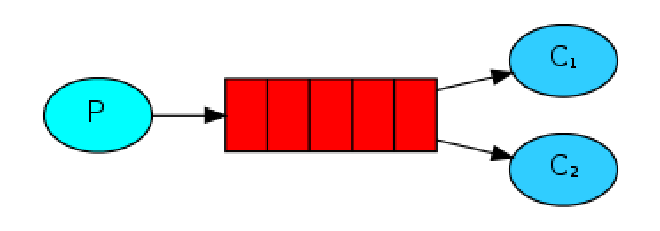

## 一、常见面试题

### 1、为什么使用MQ？MQ的优点

简答
异步处理 - 相比于传统的串行、并行方式，提高了系统吞吐量。
应用解耦 - 系统间通过消息通信，不用关心其他系统的处理。
流量削锋 - 可以通过消息队列长度控制请求量；可以缓解短时间内的高并发请求。
日志处理 - 解决大量日志传输。
消息通讯 - 消息队列一般都内置了高效的通信机制，因此也可以用在纯的消息通讯。比如实现点对点消息队列，或者聊天室等。

详答
主要是：解耦、异步、削峰。

**解耦**：A 系统发送数据到 BCD 三个系统，通过接口调用发送。如果 E 系统也要这个数据呢？那如果 C 系统现在不需要了呢？A 系统负责人几乎崩溃…A 系统跟其它各种乱七八糟的系统严重耦合，A 系统产生一条比较关键的数据，很多系
统都需要 A 系统将这个数据发送过来。如果使用 MQ，A 系统产生一条数据，发送到 MQ 里面去，哪个系统需要数据自己去 MQ 里面消费。如果新系统需要数据，直接从 MQ 里消费即可；如果某个系统不需要这条数据了，就取消对
MQ 消息的消费即可。这样下来，A 系统压根儿不需要去考虑要给谁发送数据，不需要维护这个代码，也不需要考虑人家是否调用成功、失败超时等情况。就是一个系统或者一个模块，调用了多个系统或者模块，互相之间的调用很复
杂，维护起来很麻烦。但是其实这个调用是不需要直接同步调用接口的，如果用MQ 给它异步化解耦。

**异步**：A 系统接收一个请求，需要在自己本地写库，还需要在 BCD 三个系统写库，自己本地写库要 3ms，BCD 三个系统分别写库要 300ms、450ms、200ms。最终请求总延时是 3 + 300 + 450 + 200 = 953ms，接近 1s，用户
感觉搞个什么东西，慢死了慢死了。用户通过浏览器发起请求。如果使用MQ，那么 A 系统连续发送 3 条消息到 MQ 队列中，假如耗时 5ms，A 系统从接受一个请求到返回响应给用户，总时长是 3 + 5 = 8ms。

**削峰**：减少高峰时期对服务器压力。

### 2、你们公司生产环境用的是什么消息中间件？


### 3、Kafka、ActiveMQ、RabbitMQ、RocketMQ 有什么优缺点？


综上，各种对比之后，有如下建议：

所以中小型公司，技术实力较为一般，技术挑战不是特别高，用 RabbitMQ 是不错的选择；大型公司，基础架构研发实力较强，用 RocketMQ 是很好的选择。
如果是大数据领域的实时计算、日志采集等场景，用 Kafka 是业内标准的，绝对没问题，社区活跃度很高，绝对不会黄，何况几乎是全世界这个领域的事实性规范。

### 4、MQ 有哪些常见问题？如何解决这些问题？

MQ 的常见问题有：
1. 消息的顺序问题
2. 消息的重复问题

**消息的顺序问题**

消息有序指的是可以按照消息的发送顺序来消费。假如生产者产生了 2 条消息：M1、M2，假定 M1 发送到 S1，M2 发送到S2，如果要保证 M1 先于 M2 被消费，怎么做？


解决方案：
（1）保证生产者 - MQServer - 消费者是一对一对一的关系


缺陷：
并行度就会成为消息系统的瓶颈（吞吐量不够）

更多的异常处理，比如：只要消费端出现问题，就会导致整个处理流程阻塞，我们不得不花费更多的精力来解决阻塞的问题。 （2）通过合理的设计或者将问题分解来规避。

不关注乱序的应用实际大量存在

队列无序并不意味着消息无序 所以从业务层面来保证消息的顺序而不仅仅是依赖于消息系统，是一种更合理的方式。

**消息的重复问题**

造成消息重复的根本原因是：网络不可达。
所以解决这个问题的办法就是绕过这个问题。那么问题就变成了：如果消费端收到两条一样的消息，应该怎样处理？
消费端处理消息的业务逻辑保持幂等性。只要保持幂等性，不管来多少条重复消息，最后处理的结果都一样。保证每条消息都有唯一编号且保证消息处理成功与去重表的日志同时出现。利用一张日志表来记录已经处理成功的消息的 ID，如
果新到的消息 ID 已经在日志表中，那么就不再处理这条消息。

### 5、什么是RabbitMQ？

RabbitMQ是一款开源的，Erlang编写的，基于AMQP协议的消息中间件

RabbitMQ基本概念

Broker： 简单来说就是消息队列服务器实体
Exchange： 消息交换机，它指定消息按什么规则，路由到哪个队列
Queue： 消息队列载体，每个消息都会被投入到一个或多个队列
Binding： 绑定，它的作用就是把exchange和queue按照路由规则绑定起来
Routing Key： 路由关键字，exchange根据这个关键字进行消息投递
VHost： vhost 可以理解为虚拟 broker ，即 mini-RabbitMQ server。其内部均含有独立的 queue、exchange 和 binding 等，但最最重要的是，其拥有独立的权限系统，可以做到 vhost 范围的用户控制。当然，从 RabbitMQ 的全局角度，

vhost 可以作为不同权限隔离的手段（一个典型的例子就是不同的应用可以跑在不同的 vhost 中）。
Producer： 消息生产者，就是投递消息的程序
Consumer： 消息消费者，就是接受消息的程序
Channel： 消息通道，在客户端的每个连接里，可建立多个channel，每个channel代表一个会话任务
由Exchange、Queue、RoutingKey三个才能决定一个从Exchange到Queue的唯一的线路。


### 6、RabbitMQ的工作模式

**一.simple模式（即最简单的收发模式）**


1.消息产生消息，将消息放入队列
2.消息的消费者(consumer) 监听 消息队列,如果队列中有消息,就消费掉,消息被拿走后,自动从队列中删除(隐患 消息可能没有被消费者正确处理,已经从队列中消失了,造成消息的丢失，这里可以设置成手动的ack,但如果设置成手动ack，处理完后要及时发送ack消息给队列，否则会造成内存溢出)。

**二.work工作模式(资源的竞争)**



1.消息产生者将消息放入队列消费者可以有多个,消费者1,消费者2同时监听同一个队列,消息被消费。C1 C2共同争抢当前的消息队列内容,谁先拿到谁负责消费

消息(隐患：高并发情况下,默认会产生某一个消息被多个消费者共同使用,可以设置一个开关(syncronize) 保证一条消息只能被一个消费者使用)。


**三.publish/subscribe发布订阅(共享资源)**


1、每个消费者监听自己的队列；
2、生产者将消息发给broker，由交换机将消息转发到绑定此交换机的每个队列，每个绑定交换机的队列都将接收到消息。


**四.routing路由模式**


1.消息生产者将消息发送给交换机按照路由判断,路由是字符串(info) 当前产生的消息携带路由字符(对象的方法),交换机根据路由的key,只能匹配上路由key对应的消息队列,对应的消费者才能消费消息;

2.根据业务功能定义路由字符串

3.从系统的代码逻辑中获取对应的功能字符串,将消息任务扔到对应的队列中。

4.业务场景:error 通知;EXCEPTION;错误通知的功能;传统意义的错误通知;客户通知;利用key路由,可以将程序中的错误封装成消息传入到消息队列中,开发者可以自定义消费者,实时接收错误;

**五.topic 主题模式(路由模式的一种)**


1.星号井号代表通配符
2.星号代表多个单词,井号代表一个单词
3.路由功能添加模糊匹配
4.消息产生者产生消息,把消息交给交换机
5.交换机根据key的规则模糊匹配到对应的队列,由队列的监听消费者接收消息消
费
（在我的理解看来就是routing查询的一种模糊匹配，就类似sql的模糊查询方
式）


### 7、如何保证kafka消息的顺序性？


### 8、消息基于什么传输？


### 9、如何保证消息不被重复消费？或者说，如何保证消息消费时的幂等性？


## 二、kafka

### 1、简介

Kafka将消息以topic为单位进行归纳。
将向Kafka topic发布消息的程序成为producers.
将预订topics并消费消息的程序成为consumer.
Kafka以集群的方式运行，可以由一个或多个服务组成，每个服务叫做一个broker.
producers通过网络将消息发送到Kafka集群，集群向消费者提供消息，如下图所示：


客户端和服务端通过TCP协议通信。Kafka提供了Java客户端，并且对多种语言都提供了支持。

### 2、**Topics 和Logs**

先来看一下Kafka提供的一个抽象概念:topic.
一个topic是对一组消息的归纳。对每个topic，Kafka 对它的日志进行了分区，如下图所示：


每个分区都由一系列有序的、不可变的消息组成，这些消息被连续的追加到分区中。分区中的每个消息都有一个连续的序列号叫做offset,用来在分区中唯一的标识这个消息。
在一个可配置的时间段内，Kafka集群保留所有发布的消息，不管这些消息有没有被消费。比如，如果消息的保存策略被设置为2天，那么在一个消息被发布的两天时间内，它都是可以被消费的。之后它将被丢弃以释放空间。Kafka的性能是和数据量无关的常量级的，所以保留太多的数据并不是问题。

实际上每个consumer唯一需要维护的数据是消息在日志中的位置，也就是offset。这个offset有consumer来维护：一般情况下随着consumer不断的读取消息，这offset的值不断增加，但其实consumer可以以任意的顺序读取消息，比如它可以将offset设置成为一个旧的值来重读之前的消息。

以上特点的结合，使Kafka consumers非常的轻量级：它们可以在不对集群和其他consumer造成影响的情况下读取消息。你可以使用命令行来"tail"消息而不会对其他正在消费消息的consumer造成影响。

将日志分区可以达到以下目的：首先这使得每个日志的数量不会太大，可以在单个服务上保存。另外每个分区可以单独发布和消费，为并发操作topic提供了一种可能。

**分布式**

每个分区在Kafka集群的若干服务中都有副本，这样这些持有副本的服务可以共同处理数据和请求，副本数量是可以配置的。副本使Kafka具备了容错能力。
每个分区都由一个服务器作为“leader”，零或若干服务器作为“followers”,leader负责处理消息的读和写，followers则去复制leader.如果leader down了，followers中的一台则会自动成为leader。集群中的每个服务都会同时扮演两个角色：作为它所持有的一部分分区的leader，同时作为其他分区的followers，这样集群就会据有较好的负载均衡。

**Producers**

Producer将消息发布到它指定的topic中,并负责决定发布到哪个分区。通常简单的由负载均衡机制随机选择分区，但也可以通过特定的分区函数选择分区。使用的更多的是第二种。


**Consumers**

发布消息通常有两种模式：队列模式（queuing）和发布-订阅模式(publish-subscribe)。队列模式中，consumers可以同时从服务端读取消息，每个消息只被其中一个consumer读到；发布-订阅模式中消息被广播到所有的consumer中。Consumers可以加入一个consumer 组，共同竞争一个topic，topic中的消息将被分发到组中的一个成员中。同一组中的consumer可以在不同的程序中，也可以在不同的机器上。如果所有的consumer都在一个组中，这就成为了传统的队列模式，在各consumer中实现负载均衡。如果所有的consumer都不在不同的组中，这就成为了发布-订阅模式，所有的消息都被分发到所有的consumer中。更常见的是，每个topic都有若干数量的consumer组，每个组都是一个逻辑上的“订阅者”，为了容错和更好的稳定性，每个组由若干consumer组成。这其实就是一个发布-订阅模式，只不过订阅者是个组而不是单个consumer。


由两个机器组成的集群拥有4个分区 (P0-P3) 2个consumer组. A组有两个consumerB组有4个

相比传统的消息系统，Kafka可以很好的保证有序性。
传统的队列在服务器上保存有序的消息，如果多个consumers同时从这个服务器消费消息，服务器就会以消息存储的顺序向consumer分发消息。虽然服务器按顺序发布消息，但是消息是被异步的分发到各consumer上，所以当消息到达时可能已经失去了原来的顺序，这意味着并发消费将导致顺序错乱。为了避免故障，这样的消息系统通常使用“专用consumer”的概念，其实就是只允许一个消费者消费消息，当然这就意味着失去了并发性。

在这方面Kafka做的更好，通过分区的概念，Kafka可以在多个consumer组并发的情况下提供较好的有序性和负载均衡。将每个分区分只分发给一个consumer组，这样一个分区就只被这个组的一个consumer消费，就可以顺序的消费这个分区的消息。因为有多个分区，依然可以在多个consumer组之间进行负载均衡。注意consumer组的数量不能多于分区的数量，也就是有多少分区就允许多少并发消费。

Kafka只能保证一个分区之内消息的有序性，在不同的分区之间是不可以的，这已经可以满足大部分应用的需求。如果需要topic中所有消息的有序性，那就只能让这个topic只有一个分区，当然也就只有一个consumer组消费它。

### 3、**消息传输的事务定义**

之前讨论了consumer和producer是怎么工作的，现在来讨论一下数据传输方面。数据传输的事务定义通常有以下三种级别：

- 最多一次: 消息不会被重复发送，最多被传输一次，但也有可能一次不传输。
- 最少一次: 消息不会被漏发送，最少被传输一次，但也有可能被重复传输.
- 精确的一次（Exactly once）: 不会漏传输也不会重复传输,每个消息都传输被一次而且仅仅被传输一次，这是大家所期望的。

大多数消息系统声称可以做到“精确的一次”，但是仔细阅读它们的的文档可以看到里面存在误导，比如没有说明当consumer或producer失败时怎么样，或者当有多个consumer并行时怎么样，或写入硬盘的数据丢失时又会怎么样。kafka的做法要更先进一些。当发布消息时，Kafka有一个“committed”的概念，一旦消息被提交了，只要消息被写入的分区的所在的副本broker是活动的，数据就不会丢失。关于副本的活动的概念，下节文档会讨论。现在假设broker是不会down的。

如果producer发布消息时发生了网络错误，但又不确定实在提交之前发生的还是提交之后发生的，这种情况虽然不常见，但是必须考虑进去，现在Kafka版本还没有解决这个问题，将来的版本正在努力尝试解决。

并不是所有的情况都需要“精确的一次”这样高的级别，Kafka允许producer灵活的指定级别。比如producer可以指定必须等待消息被提交的通知，或者完全的异步发送消息而不等待任何通知，或者仅仅等待leader声明它拿到了消息（followers没有必要）。

现在从consumer的方面考虑这个问题，所有的副本都有相同的日志文件和相同的offset，consumer维护自己消费的消息的offset，如果consumer不会崩溃当然可以在内存中保存这个值，当然谁也不能保证这点。如果consumer崩溃了，会有另外一个consumer接着消费消息，它需要从一个合适的offset继续处理。这种情况下可以有以下选择：


- consumer可以先读取消息，然后将offset写入日志文件中，然后再处理消息。这存在一种可能就是在存储offset后还没处理消息就crash了，新的consumer继续从这个offset处理，那么就会有些消息永远不会被处理，这就是上面说的“最多一次”。
- consumer可以先读取消息，处理消息，最后记录offset，当然如果在记录offset之前就crash了，新的consumer会重复的消费一些消息，这就是上面说的“最少一次”。
- “精确一次”可以通过将提交分为两个阶段来解决：保存了offset后提交一次，消息处理成功之后再提交一次。但是还有个更简单的做法：将消息的offset和消息被处理后的结果保存在一起。比如用Hadoop ETL处理消息时，将处理后的结果和offset同时保存在HDFS中，这样就能保证消息和offser同时被处理了。


### 4、性能优化

Kafka在提高效率方面做了很大努力。Kafka的一个主要使用场景是处理网站活动日志，吞吐量是非常大的，每个页面都会产生好多次写操作。读方面，假设每个消息只被消费一次，读的量的也是很大的，Kafka也尽量使读的操作更轻量化。

我们之前讨论了磁盘的性能问题，线性读写的情况下影响磁盘性能问题大约有两个方面：太多的琐碎的I/O操作和太多的字节拷贝。I/O问题发生在客户端和服务端之间，也发生在服务端内部的持久化的操作中。

**消息集（message set）**
为了避免这些问题，Kafka建立了“消息集（message set）”的概念，将消息组织到一起，作为处理的单位。以消息集为单位处理消息，比以单个的消息为单位处理，会提升不少性能。Producer把消息集一块发送给服务端，而不是一条条的发送；服务端把消息集一次性的追加到日志文件中，这样减少了琐碎的I/O操作。consumer也可以一次性的请求一个消息集。

另外一个性能优化是在字节拷贝方面。在低负载的情况下这不是问题，但是在高负载的情况下它的影响还是很大的。为了避免这个问题，Kafka使用了标准的二进制消息格式，这个格式可以在producer,broker和producer之间共享而无需做任何改动。

**zero copy
**Broker维护的消息日志仅仅是一些目录文件，消息集以固定队的格式写入到日志文件中，这个格式producer和consumer是共享的，这使得Kafka可以一个很重要的点进行优化：消息在网络上的传递。现代的unix操作系统提供了高性能的将数据从页面缓存发送到socket的系统函数，在linux中，这个函数是sendfile.

为了更好的理解sendfile的好处，我们先来看下一般将数据从文件发送到socket的数据流向：

- 操作系统把数据从文件拷贝内核中的页缓存中
- 应用程序从页缓存从把数据拷贝自己的内存缓存中
- 应用程序将数据写入到内核中socket缓存中
- 操作系统把数据从socket缓存中拷贝到网卡接口缓存，从这里发送到网络上。


这显然是低效率的，有4次拷贝和2次系统调用。Sendfile通过直接将数据从页面缓存发送网卡接口缓存，避免了重复拷贝，大大的优化了性能。
在一个多consumers的场景里，数据仅仅被拷贝到页面缓存一次而不是每次消费消息的时候都重复的进行拷贝。这使得消息以近乎网络带宽的速率发送出去。这样在磁盘层面你几乎看不到任何的读操作，因为数据都是从页面缓存中直接发送到网络上去了。
[这篇文章](https://www.ibm.com/developerworks/linux/library/j-zerocopy/)详细介绍了sendfile和zero-copy技术在Java方面的应用。

**数据压缩
**很多时候，性能的瓶颈并非CPU或者硬盘而是网络带宽，对于需要在数据中心之间传送大量数据的应用更是如此。当然用户可以在没有Kafka支持的情况下各自压缩自己的消息，但是这将导致较低的压缩率，因为相比于将消息单独压缩，将大量文件压缩在一起才能起到最好的压缩效果。
Kafka采用了端到端的压缩：因为有“消息集”的概念，客户端的消息可以一起被压缩后送到服务端，并以压缩后的格式写入日志文件，以压缩的格式发送到consumer，消息从producer发出到consumer拿到都被是压缩的，只有在consumer使用的时候才被解压缩，所以叫做“端到端的压缩”。
Kafka支持GZIP和Snappy压缩协议。更详细的内容可以查看[这里](https://cwiki.apache.org/confluence/display/KAFKA/Compression)


### 5、**Producer和Consumer**

**Kafka Producer****消息发送**
producer直接将数据发送到broker的leader(主节点)，不需要在多个节点进行分发。为了帮助producer做到这点，所有的Kafka节点都可以及时的告知:哪些节点是活动的，目标topic目标分区的leader在哪。这样producer就可以直接将消息发送到目的地了。

客户端控制消息将被分发到哪个分区。可以通过负载均衡随机的选择，或者使用分区函数。Kafka允许用户实现分区函数，指定分区的key，将消息hash到不同的分区上(当然有需要的话，也可以覆盖这个分区函数自己实现逻辑).比如如果你指定的key是user id，那么同一个用户发送的消息都被发送到同一个分区上。经过分区之后，consumer就可以有目的的消费某个分区的消息。

**异步发送**
批量发送可以很有效的提高发送效率。Kafka producer的异步发送模式允许进行批量发送，先将消息缓存在内存中，然后一次请求批量发送出去。这个策略可以配置的，比如可以指定缓存的消息达到某个量的时候就发出去，或者缓存了固定的时间后就发送出去（比如100条消息就发送，或者每5秒发送一次）。这种策略将大大减少服务端的I/O次数。

既然缓存是在producer端进行的，那么当producer崩溃时，这些消息就会丢失。Kafka0.8.1的异步发送模式还不支持回调，就不能在发送出错时进行处理。Kafka 0.9可能会增加这样的回调函数。见[Proposed Producer API](https://cwiki.apache.org/confluence/display/KAFKA/Client+Rewrite#ClientRewrite-ProposedProducerAPI).

**Kafka Consumer**
Kafa consumer消费消息时，向broker发出"fetch"请求去消费特定分区的消息。consumer指定消息在日志中的偏移量（offset），就可以消费从这个位置开始的消息。customer拥有了offset的控制权，可以向后回滚去重新消费之前的消息，这是很有意义的。

**推还是拉？**
Kafka最初考虑的问题是，customer应该从brokes拉取消息还是brokers将消息推送到consumer，也就是pull还push。在这方面，Kafka遵循了一种大部分消息系统共同的传统的设计：producer将消息推送到broker，consumer从broker拉取消息。

一些消息系统比如Scribe和Apache Flume采用了push模式，将消息推送到下游的consumer。这样做有好处也有坏处：由broker决定消息推送的速率，对于不同消费速率的consumer就不太好处理了。消息系统都致力于让consumer以最大的速率最快速的消费消息，但不幸的是，push模式下，当broker推送的速率远大于consumer消费的速率时，consumer恐怕就要崩溃了。最终Kafka还是选取了传统的pull模式。

Pull模式的另外一个好处是consumer可以自主决定是否批量的从broker拉取数据。Push模式必须在不知道下游consumer消费能力和消费策略的情况下决定是立即推送每条消息还是缓存之后批量推送。如果为了避免consumer崩溃而采用较低的推送速率，将可能导致一次只推送较少的消息而造成浪费。Pull模式下，consumer就可以根据自己的消费能力去决定这些策略。

Pull有个缺点是，如果broker没有可供消费的消息，将导致consumer不断在循环中轮询，直到新消息到t达。为了避免这点，Kafka有个参数可以让consumer阻塞知道新消息到达(当然也可以阻塞知道消息的数量达到某个特定的量这样就可以批量发送)。

**消费状态跟踪**
对消费消息状态的记录也是很重要的。
大部分消息系统在broker端的维护消息被消费的记录：一个消息被分发到consumer后broker就马上进行标记或者等待customer的通知后进行标记。这样也可以在消息在消费后立马就删除以减少空间占用。

但是这样会不会有什么问题呢？如果一条消息发送出去之后就立即被标记为消费过的，一旦consumer处理消息时失败了（比如程序崩溃）消息就丢失了。为了解决这个问题，很多消息系统提供了另外一个个功能：当消息被发送出去之后仅仅被标记为已发送状态，当接到consumer已经消费成功的通知后才标记为已被消费的状态。这虽然解决了消息丢失的问题，但产生了新问题，首先如果consumer处理消息成功了但是向broker发送响应时失败了，这条消息将被消费两次。第二个问题时，broker必须维护每条消息的状态，并且每次都要先锁住消息然后更改状态然后释放锁。这样麻烦又来了，且不说要维护大量的状态数据，比如如果消息发送出去但没有收到消费成功的通知，这条消息将一直处于被锁定的状态，
Kafka采用了不同的策略。Topic被分成了若干分区，每个分区在同一时间只被一个consumer消费。这意味着每个分区被消费的消息在日志中的位置仅仅是一个简单的整数：offset。这样就很容易标记每个分区消费状态就很容易了，仅仅需要一个整数而已。这样消费状态的跟踪就很简单了。

这带来了另外一个好处：consumer可以把offset调成一个较老的值，去重新消费老的消息。这对传统的消息系统来说看起来有些不可思议，但确实是非常有用的，谁规定了一条消息只能被消费一次呢？consumer发现解析数据的程序有bug，在修改bug后再来解析一次消息，看起来是很合理的额呀！

**离线处理消息**
高级的数据持久化允许consumer每个隔一段时间批量的将数据加载到线下系统中比如[Hadoop](http://www.linuxidc.com/topicnews.aspx?tid=13)或者数据仓库。这种情况下，Hadoop可以将加载任务分拆，拆成每个broker或每个topic或每个分区一个加载任务。Hadoop具有任务管理功能，当一个任务失败了就可以重启而不用担心数据被重新加载，只要从上次加载的位置继续加载消息就可以了。


### 6、主从同步

Kafka允许topic的分区拥有若干副本，这个数量是可以配置的，你可以为每个topci配置副本的数量。Kafka会自动在每个个副本上备份数据，所以当一个节点down掉时数据依然是可用的。

Kafka的副本功能不是必须的，你可以配置只有一个副本，这样其实就相当于只有一份数据。
创建副本的单位是topic的分区，每个分区都有一个leader和零或多个followers.所有的读写操作都由leader处理，一般分区的数量都比broker的数量多的多，各分区的leader均匀的分布在brokers中。所有的followers都复制leader的日志，日志中的消息和顺序都和leader中的一致。flowers向普通的consumer那样从leader那里拉取消息并保存在自己的日志文件中。

许多分布式的消息系统自动的处理失败的请求，它们对一个节点是否

着（alive）”有着清晰的定义。Kafka判断一个节点是否活着有两个条件：

- 节点必须可以维护和ZooKeeper的连接，Zookeeper通过心跳机制检查每个节点的连接。
- 如果节点是个follower,他必须能及时的同步leader的写操作，延时不能太久。

符合以上条件的节点准确的说应该是“同步中的（in sync）”，而不是模糊的说是“活着的”或是“失败的”。Leader会追踪所有“同步中”的节点，一旦一个down掉了，或是卡住了，或是延时太久，leader就会把它移除。至于延时多久算是“太久”，是由参数replica.lag.max.messages决定的，怎样算是卡住了，怎是由参数replica.lag.time.max.ms决定的。 

只有当消息被所有的副本加入到日志中时，才算是“committed”，只有committed的消息才会发送给consumer，这样就不用担心一旦leader down掉了消息会丢失。Producer也可以选择是否等待消息被提交的通知，这个是由参数request.required.acks决定的。
Kafka保证只要有一个“同步中”的节点，“committed”的消息就不会丢失。

**Leader的选择**
Kafka的核心是日志文件，日志文件在集群中的同步是分布式数据系统最基础的要素。

如果leaders永远不会down的话我们就不需要followers了！一旦leader down掉了，需要在followers中选择一个新的leader.但是followers本身有可能延时太久或者crash，所以必须选择高质量的follower作为leader.必须保证，一旦一个消息被提交了，但是leader down掉了，新选出的leader必须可以提供这条消息。大部分的分布式系统采用了多数投票法则选择新的leader,对于多数投票法则，就是根据所有副本节点的状况动态的选择最适合的作为leader.Kafka并不是使用这种方法。

Kafaka动态维护了一个同步状态的副本的集合（a set of in-sync replicas），简称ISR，在这个集合中的节点都是和leader保持高度一致的，任何一条消息必须被这个集合中的每个节点读取并追加到日志中了，才回通知外部这个消息已经被提交了。因此这个集合中的任何一个节点随时都可以被选为leader.ISR在ZooKeeper中维护。ISR中有f+1个节点，就可以允许在f个节点down掉的情况下不会丢失消息并正常提供服。ISR的成员是动态的，如果一个节点被淘汰了，当它重新达到“同步中”的状态时，他可以重新加入ISR.这种leader的选择方式是非常快速的，适合kafka的应用场景。

一个邪恶的想法：如果所有节点都down掉了怎么办？Kafka对于数据不会丢失的保证，是基于至少一个节点是存活的，一旦所有节点都down了，这个就不能保证了。
实际应用中，当所有的副本都down掉时，必须及时作出反应。可以有以下两种选择:

- 等待ISR中的任何一个节点恢复并担任leader。
- 选择所有节点中（不只是ISR）第一个恢复的节点作为leader.

这是一个在可用性和连续性之间的权衡。如果等待ISR中的节点恢复，一旦ISR中的节点起不起来或者数据都是了，那集群就永远恢复不了了。如果等待ISR意外的节点恢复，这个节点的数据就会被作为线上数据，有可能和真实的数据有所出入，因为有些数据它可能还没同步到。Kafka目前选择了第二种策略，在未来的版本中将使这个策略的选择可配置，可以根据场景灵活的选择。
这种窘境不只Kafka会遇到，几乎所有的分布式数据系统都会遇到。

**副本管理**
以上仅仅以一个topic一个分区为例子进行了讨论，但实际上一个Kafka将会管理成千上万的topic分区.Kafka尽量的使所有分区均匀的分布到集群所有的节点上而不是集中在某些节点上，另外主从关系也尽量均衡这样每个几点都会担任一定比例的分区的leader.
优化leader的选择过程也是很重要的，它决定了系统发生故障时的空窗期有多久。Kafka选择一个节点作为“controller”,当发现有节点down掉的时候它负责在游泳分区的所有节点中选择新的leader,这使得Kafka可以批量的高效的管理所有分区节点的主从关系。如果controller down掉了，活着的节点中的一个会备切换为新的controller.


### 7、**消息和日志**

消息由一个固定长度的头部和可变长度的字节数组组成。头部包含了一个版本号和CRC32校验码。

```xml
/**
* 具有N个字节的消息的格式如下
*
* 如果版本号是0
*
* 1. 1个字节的 "magic" 标记
*
* 2. 4个字节的CRC32校验码
*
* 3. N - 5个字节的具体信息
*
* 如果版本号是1
*
* 1. 1个字节的 "magic" 标记
*
* 2.1个字节的参数允许标注一些附加的信息比如是否压缩了，解码类型等
*
* 3.4个字节的CRC32校验码
*
* 4. N - 6 个字节的具体信息
*
*/
```

**日志**一个叫做“my_topic”且有两个分区的的topic,它的日志有两个文件夹组成，my_topic_0和my_topic_1,每个文件夹里放着具体的数据文件，每个数据文件都是一系列的日志实体，每个日志实体有一个4个字节的整数N标注消息的长度，后边跟着N个字节的消息。每个消息都可以由一个64位的整数offset标注，offset标注了这条消息在发送到这个分区的消息流中的起始位置。每个日志文件的名称都是这个文件第一条日志的offset.所以第一个日志文件的名字就是00000000000.kafka.所以每相邻的两个文件名字的差就是一个数字S,S差不多就是配置文件中指定的日志文件的最大容量。
消息的格式都由一个统一的接口维护，所以消息可以在producer,broker和consumer之间无缝的传递。存储在硬盘上的消息格式如下所示：

- 消息长度: 4 bytes (value: 1+4+n)
- 版本号: 1 byte
- CRC校验码: 4 bytes
- 具体的消息: n bytes

**日志**一个叫做“my_topic”且有两个分区的的topic,它的日志有两个文件夹组成，my_topic_0和my_topic_1,每个文件夹里放着具体的数据文件，每个数据文件都是一系列的日志实体，每个日志实体有一个4个字节的整数N标注消息的长度，后边跟着N个字节的消息。每个消息都可以由一个64位的整数offset标注，offset标注了这条消息在发送到这个分区的消息流中的起始位置。每个日志文件的名称都是这个文件第一条日志的offset.所以第一个日志文件的名字就是00000000000.kafka.所以每相邻的两个文件名字的差就是一个数字S,S差不多就是配置文件中指定的日志文件的最大容量。
消息的格式都由一个统一的接口维护，所以消息可以在producer,broker和consumer之间无缝的传递。存储在硬盘上的消息格式如下所示：

- 消息长度: 4 bytes (value: 1+4+n)
- 版本号: 1 byte
- CRC校验码: 4 bytes
- 具体的消息: n bytes


**写操作**消息被不断的追加到最后一个日志的末尾，当日志的大小达到一个指定的值时就会产生一个新的文件。对于写操作有两个参数，一个规定了消息的数量达到这个值时必须将数据刷新到硬盘上，另外一个规定了刷新到硬盘的时间间隔，这对数据的持久性是个保证，在系统崩溃的时候只会丢失一定数量的消息或者一个时间段的消息。

**读操作**
读操作需要两个参数：一个64位的offset和一个S字节的最大读取量。S通常比单个消息的大小要大，但在一些个别消息比较大的情况下，S会小于单个消息的大小。这种情况下读操作会不断重试，每次重试都会将读取量加倍，直到读取到一个完整的消息。可以配置单个消息的最大值，这样服务器就会拒绝大小超过这个值的消息。也可以给客户端指定一个尝试读取的最大上限，避免为了读到一个完整的消息而无限次的重试。
在实际执行读取操纵时，首先需要定位数据所在的日志文件，然后根据offset计算出在这个日志中的offset(前面的的offset是整个分区的offset),然后在这个offset的位置进行读取。定位操作是由二分查找法完成的，Kafka在内存中为每个文件维护了offset的范围。


**删除**
日志管理器允许定制删除策略。目前的策略是删除修改时间在N天之前的日志（按时间删除），也可以使用另外一个策略：保留最后的N GB数据的策略(按大小删除)。为了避免在删除时阻塞读操作，采用了copy-on-write形式的实现，删除操作进行时，读取操作的二分查找功能实际是在一个静态的快照副本上进行的，这类似于Java的CopyOnWriteArrayList。

**可靠性保证**
日志文件有一个可配置的参数M，缓存超过这个数量的消息将被强行刷新到硬盘。一个日志矫正线程将循环检查最新的日志文件中的消息确认每个消息都是合法的。合法的标准为：所有文件的大小的和最大的offset小于日志文件的大小，并且消息的CRC32校验码与存储在消息实体中的校验码一致。如果在某个offset发现不合法的消息，从这个offset到下一个合法的offset之间的内容将被移除。
有两种情况必须考虑：
1，当发生崩溃时有些数据块未能写入。
2，写入了一些空白数据块。第二种情况的原因是，对于每个文件，操作系统都有一个inode（inode是指在许多“类Unix文件系统”中的一种数据结构。每个inode保存了文件系统中的一个文件系统对象,包括文件、目录、大小、设备文件、socket、管道, 等等），但无法保证更新inode和写入数据的顺序，当inode保存的大小信息被更新了，但写入数据时发生了崩溃，就产生了空白数据块。CRC校验码可以检查这些块并移除，当然因为崩溃而未写入的数据块也就丢失了。


## 三、kafka常见概念

### **1.什么是消息中间件？**

消息中间件是基于队列与消息传递技术，在网络环境中为应用系统提供**同步或异步、可靠的**消息传输的支撑性软件系统。

消息中间件利用**高效可靠**的消息传递机制进行平台无关的数据交流，并基于数据通信来进行分布式系统的集成。通过提供消息传递和消息排队模型，它可以在分布式环境下扩展进程间的通信。

### **2.kafka 是什么？有什么作用？**

Kafka 是一个分布式的流式处理平台，它以高吞吐、可持久化、可水平扩展、支持流数据处理等多种特性而被广泛使用


主要功能体现于三点：

- **消息系统**：kafka与传统的消息中间件都具备**系统解耦、冗余存储、流量削峰、缓冲、异步通信、扩展性、可恢复性**等功能。与此同时，kafka还提供了大多数消息系统难以实现的消息顺序性保障及回溯性消费的功能。
- **存储系统**：kafka把**消息持久化到磁盘**，相比于其他基于内存存储的系统而言，有效的降低了消息丢失的风险。这得益于其消息持久化和多副本机制。也可以将kafka作为长期的存储系统来使用，只需要把对应的数据保留策略设置为“永久”或启用主题日志压缩功能。
- **流式处理平台**：kafka为流行的流式处理框架提供了可靠的数据来源，还提供了一个完整的流式处理框架，比如窗口、连接、变换和聚合等各类操作。

### **3.kafka 的架构是怎么样的？**


一个典型的 kafka 体系架构包括若干 **Producer**、若干 **Consumer**、以及一个 **Zookeeper** 集群（在2.8.0版本中移，除了 Zookeeper,通过 **KRaft** 进行自己的集群管理）

Producer 将消息发送到 Broker，Broker 负责将受到的消息存储到磁盘中，而 Consumer 负责从 Broker 订阅并消费消息。

Kafka 基本概念：

- **Producer** ：生产者，负责将消息发送到 Broker
- **Consumer** ：消费者，从 Broker 接收消息
- **Consumer Group** ：消费者组，由**多个 Consumer 组成**。消费者组内每个消费者负责消费不同分区的数据，**一个分区只能由一个组内消费者消费**；消费者组之间互不影响。所有的消费者都属于某个消费者组，即消费者组是逻辑上的一个订阅者。
- **Broker** ：可以看做一个独立的 **Kafka 服务节点或 Kafka 服务实例**。如果一台服务器上只部署了一个 Kafka 实例，那么我们也可以将 Broker 看做一台 Kafka 服务器。
- **Topic** ：一个逻辑上的概念，包含很多 Partition，**同一个 Topic 下的 Partiton 的消息内容是不相同的**。
- **Partition** ：为了实现扩展性，一个非常大的 topic **可以分布到多个 broker 上，一个 topic 可以分为多个 partition**，每个 partition 是一个有序的队列。
- **Replica** ：副本，**同一分区的不同副本保存的是相同的消息**，为保证集群中的某个节点发生故障时，该节点上的 partition 数据不丢失，且 kafka 仍然能够继续工作，kafka 提供了副本机制，一个 topic 的每个分区都有若干个副本，一个 leader 和若干个 follower。
- **Leader** ：每个分区的多个副本中的"主副本"，**生产者以及消费者只与 Leader 交互**。
- **Follower** ：每个分区的多个副本中的"从副本"，**负责实时从 Leader 中同步数据，保持和 Leader 数据的同步**。Leader 发生故障时，从 Follower 副本中重新选举新的 Leader 副本对外提供服务。

### **4.Kafka Replicas是怎么管理的？**


- AR:分区中的**所有 Replica 统称为 AR**
- ISR:所有与 Leader 副本**保持一定程度同步**的Replica(包括 Leader 副本在内)组成 ISR
- OSR:与 Leader 副本**同步滞后过多的** Replica 组成了 OSR

Leader 负责维护和跟踪 ISR 集合中所有 Follower 副本的滞后状态，当 Follower 副本落后过多时，就会将其放入 OSR 集合，当 Follower 副本追上了 Leader 的进度时，就会将其放入 ISR 集合。

默认情况下，**只有 ISR 中的副本才有资格晋升为 Leader**。


### **5.如何确定当前能读到哪一条消息？**

分区相当于一个日志文件，我们先简单介绍几个概念


如上图是一个分区日志文件

- 标识**共有7条消息**，offset (消息偏移量)分别是0~6
- 0 代表这个日志文件的**开始**
- HW(High Watermark) 为4，0~3 代表这个日志文件**可以消费的区间**，消费者只能消费到这四条消息
- LEO 代表即将要写入消息的偏移量 offset

**分区 ISR 集合中的每个副本都会维护自己的 LEO，而 ISR 集合中最小的LEO 即为分区的 HW**


如上图: 三个分区副本都是 ISR集合当中的，最小的 LEO 为 3，就代表分区的 HW 为3，所以当前分区只能消费到 0~2 之间的三条数据，如下图


### **6.生产者发送消息有哪些模式？**

总共有三种模式

- 1.**发后即忘**（fire-and-forget）

- - 它只管往 Kafka 里面发送消息，但是**不关心消息是否正确到达**，这种方式的效率最高，但是可靠性也最差，比如当发生某些不可充实异常的时候会造成消息的丢失

- 2.**同步**（sync）

- - producer.send()返回一个Future对象，调用get()方法变回进行同步等待，就知道消息是否发送成功，**发送一条消息需要等上个消息发送成功后才可以继续发送**

- 3.**异步**（async）

- - Kafka支持 producer.send() 传入一个回调函数，消息不管成功或者失败都会调用这个回调函数，这样就算是异步发送，我们也知道消息的发送情况，然后再回调函数中选择记录日志还是重试都取决于调用方

### **7.发送消息的分区策略有哪些？**


- 1.轮询：**依次**将消息发送该topic下的所有分区，如果在创建消息的时候 key 为 null，Kafka 默认采用这种策略。
- 2.key 指定分区：在创建消息是 key 不为空，并且使用默认分区器，Kafka 会将 key 进行 hash，然后**根据hash值映射到指定的分区上**。这样的好处是 key 相同的消息会在一个分区下，Kafka 并不能保证全局有序，但是在每个分区下的消息是有序的，按照顺序存储，按照顺序消费。在保证同一个 key 的消息是有序的，这样基本能满足消息的顺序性的需求。但是**如果 partation 数量发生变化，那就很难保证 key 与分区之间的映射关系了**。
- 3.自定义策略：实现 Partitioner 接口就能自定义分区策略。
- 4.指定 Partiton 发送

### **8.Kafka 支持读写分离吗？为什么？**

Kafka 是**不支持读写分离**的，那么读写分离的好处是什么？主要就是让一个节点去承担另一个节点的负载压力，也就是能做到一定程度的负载均衡，而且 Kafka 不通过读写分离也可以一定程度上去实现负载均衡。

但是对于 Kafka 的架构来说，读写分离有两个很大的**缺点**


- 1.数据不一致的问题:读写分离必然涉及到数据的同步，只要是**不同节点之间的数据同步**，必然**会有数据不一致的问题**存在。
- 2.延时问题:由于 Kafka 独特的数据处理方式，导致如果将数据从一个节点同步到另一个节点必然会经过**主节点磁盘和从节点磁盘**，对一些延时性要求较高的应用来说，并不太适用

### **9.那 Kafka 是怎么去实现负载均衡的？**

Kafka 的负责均衡主要是**通过分区来实现**的，我们知道 Kafka 是**主写主读**的架构，如下图:


共三个 broker ，里面各有三个副本，总共有三个 partation， 深色的是 leader，浅色的是 follower，上下灰色分别代表生产者和消费者，虚线代表 follower 从 leader 拉取消息。

我们从这张图就可以很明显的看出来，**每个 broker 都有消费者拉取消息，每个 broker 也都有生产者发送消息，每个 broker 上的读写负载都是一样的**，这也说明了 kafka 独特的架构方式可以通过主写主读来实现负载均衡。

### **10.Kafka 的负责均衡会有什么问题呢？**

kafka的负载均衡在绝对理想的状况下可以实现，但是会有某些情况出现一定程度上的负载不均衡


- 1.**broker 端分配不均**:当创建 topic 的时候可能会出现某些 broker 分配到的分区数多，而有些 broker 分配的分区少，这就导致了 leader 多副本不均。
- 2.**生产者写入消息不均**:生产者可能只对某些 broker 中的 leader 副本进行大量的写入操作，而对其他的 leader 副本不闻不问。
- 3.**消费者消费不均**:消费者可能只对某些 broker 中的 leader 副本进行大量的拉取操作，而对其他的 leader 副本不闻不问。
- 4.**leader 副本切换不均**：当主从副本切换或者分区副本进行了重分配后，可能会导致各个 broker 中的 leader 副本分配不均匀。

### **11.Kafka 的可靠性是怎么保证的？**


**1.acks**

这个参数用来指定分区中有多少个副本收到这条消息，生产者才认为这条消息是写入成功的，这个参数有三个值：

- 1.acks = 1，默认为1。生产者发送消息，**只要 leader 副本成功写入消息，就代表成功**。这种方案的问题在于，当返回成功后，如果 leader 副本和 follower 副本还**没有来得及同步**，leader 就崩溃了，那么在选举后新的 leader 就没有这条**消息，也就丢失了**。
- 2.acks = 0。生产者发送消息后直接算写入成功，不需要等待响应。这个方案的问题很明显，**只要服务端写消息时出现任何问题，都会导致消息丢失**。
- 3.acks = -1 或 acks = all。生产者发送消息后，需要等待 ISR 中的所有副本都成功写入消息后才能收到服务端的响应。毫无疑问这种方案的**可靠性是最高**的，但是如果 ISR 中只有leader 副本，那么就和 acks = 1 毫无差别了。

**2.消息发送的方式**

第6问中我们提到了生产者发送消息有三种方式，发完即忘，同步和异步。我们可以**通过同步或者异步**获取响应结果，**失败做重试**来保证消息的可靠性。

**3.手动提交位移**

默认情况下，当消费者消费到消息后，就会自动提交位移。但是如果消费者消费出错，没有进入真正的业务处理，那么就可能会导致这条消息消费失败，从而丢失。我们可以开启手动提交位移，等待业务正常处理完成后，再提交offset。

**4.通过副本 LEO 来确定分区 HW**

### **12.Kafka 的消息消费方式有哪些？**

一般消息消费有两种模式，推和拉。Kafka的消费是属于**拉模式**的，而此模式的消息消费方式有**两种，点对点和发布订阅**。


- 1.**点对点**:如果所有消费者属于同一个消费组，那么所有的消息都会被均匀的投递给每一个消费者，**每条消息只会被其中一个消费者消费**。

  


- 2.**发布订阅**:如果所有消费者属于不同的消费组，那么所有的消息都会被投递给每一个消费者，**每个消费者都会收到该消息**。

### **13.分区再分配是做什么的？解决了什么问题？**

分区再分配主要是用来**维护 kafka 集群的负载均衡**

既然是分区再分配，那么 kafka 分区有什么问题呢？


- 问题1:当集群中的一个节点下线了

- - 如果该节点的分区是单副本的,那么分区将会变得不可用
  - 如果是多副本的，就会进行 leader 选举，在其他机器上选举出新的 leader

**kafka 并不会将这些失效的分区迁移到其他可用的 broker 上**，这样就会影响集群的负载均衡，甚至也会影响服务的可靠性和可用性


- 问题2:当集群新增 broker 时，只有新的主题分区会分配在该 broker 上，而老的主题分区不会分配在该 broker 上，就造成了**老节点和新节点之间的负载不均衡**。

为了解决该问题就出现了分区再分配，它可以在集群扩容，broker 失效的场景下进行分区迁移。

**分区再分配的原理就是通化控制器给分区新增新的副本，然后通过网络把旧的副本数据复制到新的副本上，在复制完成后，将旧副本清除。** 当然，为了不影响集群正常的性能，在此复制期间还会有一些列保证性能的操作，比如**复制限流**。

### **14.副本 leader 是怎么选举的？**


当分区 leader 节点崩溃时，其中一个 follower 节点会成为新的 leader 节点，这样会**导致集群的负载不均衡，从而影响服务的健壮性和稳定性**。

如下:

```
Topic: test Partation:0 Leader:1 Replicas:1,2,0 Isr:1,2,0
Topic: test Partation:1 Leader:2 Replicas:2,0,1 Isr:2,0,1
Topic: test Partation:2 Leader:0 Replicas:0,1,2 Isr:0,1,2
```

我们可以看到

- 0 分区 1 是 leader
- 1 分区 2 是 leader
- 2 分区 0 是 leader

如果此时中间的**节点重启**

```
Topic: test Partation:0 Leader:1 Replicas:1,2,0 Isr:1,0,2
Topic: test Partation:1 Leader:0 Replicas:2,0,1 Isr:0,1,2
Topic: test Partation:2 Leader:0 Replicas:0,1,2 Isr:0,1,2
```

我们又可以看到:

- 0 分区 1 是 leader
- 1 分区 0 是 leader
- 2 分区 0 是 leader

我们会发现，原本 1 分区有两个 ledaer，经过重启后 leader 都消失了，如此就**负载不均衡**了。

为了解决这种问题，就引入了优先副本的概念

优先副本就是说在 AR 集合中的第一个副本。比如分区 2 的 AR 为 0，1，2，那么分区 2 的优先副本就为0。理想情况下优先副本就是 leader 副本。优先副本选举就是促使优先副本成为 leader 副本，从而维护集群的负载均衡。

### **15.分区数越多越好吗？吞吐量就会越高吗？**

一般类似于这种问题的答案，都是持否定态度的。

但是可以说，**在一定条件下，分区数的数量是和吞吐量成正比的，分区数和性能也是成正比的**。

那么为什么说超过了一定限度，就会对性能造成影响呢？原因如下:


**1.客户端/服务器端需要使用的内存就越多**

- 服务端在很多组件中都维护了分区级别的缓存，分区数越大，**缓存成本**也就越大。
- 消费端的消费线程数是和分区数挂钩的，分区数越大消费线程数也就越多，**线程的开销成本**也就越大
- 生产者发送消息有缓存的概念，会为每个分区缓存消息，当积累到一定程度或者时间时会将消息发送到分区，**分区越多，这部分的缓存**也就越大

**2.文件句柄的开销**

**每个 partition 都会对应磁盘文件系统的一个目录**。在 Kafka 的数据日志文件目录中，每个日志数据段都会分配两个文件，一个索引文件和一个数据文件。**每个 broker 会为每个日志段文件打开一个 index 文件句柄和一个数据文件句柄**。因此，随着 partition 的增多，所需要保持打开状态的文件句柄数也就越多，最终可能超过底层操作系统配置的文件句柄数量限制。

**3.越多的分区可能增加端对端的延迟**

Kafka 会将分区 HW 之前的消息暴露给消费者。**分区越多则副本之间的同步数量就越多**，在默认情况下，每个 broker 从其他 broker 节点进行数据副本复制时，该 broker 节点只会为此工作分配一个线程，该线程需要完成该 broker 所有 partition 数据的复制。

**4.降低高可用性**

在第 13 问我们提到了分区再分配，会将数据复制到另一份副本当中，**分区数量越多，那么恢复时间也就越长**，而如果发生宕机的 broker 恰好是 controller 节点时：在这种情况下，新 leader 节点的选举过程在 controller 节点恢复到新的 broker 之前不会启动。controller 节点的错误恢复将会自动地进行，但是新的 controller 节点需要从 zookeeper 中读取每一个 partition 的元数据信息用于初始化数据。例如，假设一个Kafka 集群存在 10000个partition，从 zookeeper 中恢复元数据时每个 partition 大约花费 2 ms，则 controller 的恢复将会增加约 20 秒的不可用时间窗口。


### **16.如何增强消费者的消费能力？**

- 1.可以考虑增加 topic 的分区数，并且同时提升消费组的消费者数量，消费者数=分区数。
- 2.如果是消费者消费不及时，可以采用多线程的方式进行消费，并且优化业务方法流程，同样的分区数，为什么人家并发那么高，你的就不行？？

### **17.消费者与 topic 的分区分配策略有哪些？**


**1.RangeAssignor 分配策略**

该分配策略是按照**消费者总数和分区总数进行整除运算**来获得一个跨度，然后分区按照跨度来进行平均分配，尽可能保证分区均匀的分配给所有的消费者。

对于每个 topic，该策略会讲消费者组内所有订阅这个主题的消费者**按照名称的字典顺序排序**，然后为每个消费者划分固定过的区域，**如果不够平均分配，那么字典排序考前的就会多分配一个分区**。

比如 2 个消费者属于一个消费者组，有 2 个 topic t1，t2，每个 topic 都有 3 个分区，p1，p2，p3，那么分配的情况如下:

```
  消费者A:t0-p0，t0-p1，t1-p0，t1-p1，
  消费者B:t0-p2，t1-p2
```

这样就会出现非配不均匀的情况

**2.RoundRobinAssignor 分配策略**

该分配策略是**按将消费者组内所有消费者及消费者订阅的所有主题的分区按照字典排序，然后通过轮询的方式分配给每个消费者**。

比如有 3 个消费者 A，B，C，订阅了 3 个 topic ，t0，t1，t2，每个 topic 各有 3 个分区 p0，p1，p2。如果 A 订阅了 t0，B 订阅了 t0 和 t1，C 订阅了 t0，t1，t2，那么分配的情况如下:

```
  消费者A:t0-p0
  消费者B:t1-p0
  消费者C:t1-p1，t2-p0，t2-p1，t2-p2
```

这样也会出现分配不均匀的情况，按照订阅情况来讲完全可以吧 t1p1 分配给消费者B

**3.StickyAssignor分配策略**

这种分配策略有两个目的

- 1.分区的分配要尽可能的均匀
- 2.分区的分配尽可能的与上次分配的保持相同。

当两者发生冲突时，第一个目标优先于第二个目标。

假设消费组内有3个消费者：**C0、C1、C2**

它们都订阅了4个主题：**t0、t1、t2、t3**

并且每个主题有2个分区，也就是说整个消费组订阅了，**t0p0、t0p1、t1p0、t1p1、t2p0、t2p1、t3p0、t3p1** 这8个分区

最终的分配结果如下：

```
消费者C0：t0p0、t1p1、t3p0

消费者C1：t0p1、t2p0、t3p1

消费者C2：t1p0、t2p1
```

这样初看上去似乎与采用RoundRobinAssignor策略所分配的结果相同

此时假设消费者C1脱离了消费组，那么消费组就会执行再平衡操作，进而消费分区会重新分配。如果采用RoundRobinAssignor策略，那么此时的分配结果如下：

```
消费者C0：t0p0、t1p0、t2p0、t3p0

消费者C2：t0p1、t1p1、t2p1、t3p1
```

如分配结果所示，RoundRobinAssignor策略会按照消费者C0和C2进行重新轮询分配。而如果此时使用的是StickyAssignor策略，那么分配结果为：

```
消费者C0：t0p0、t1p1、t3p0、t2p0

消费者C2：t1p0、t2p1、t0p1、t3p1
```

可以看到分配结果中保留了上一次分配中对于消费者C0和C2的所有分配结果，并将原来消费者C1的“负担”分配给了剩余的两个消费者C0和C2，最终C0和C2的分配还保持了均衡。

**如果发生分区重分配，那么对于同一个分区而言有可能之前的消费者和新指派的消费者不是同一个，对于之前消费者进行到一半的处理还要在新指派的消费者中再次复现一遍，这显然很浪费系统资源。StickyAssignor策略如同其名称中的“sticky”一样，让分配策略具备一定的“粘性”，尽可能地让前后两次分配相同，进而减少系统资源的损耗以及其它异常情况的发生**。

到目前为止所分析的都是消费者的订阅信息都是相同的情况，我们来看一下订阅信息不同的情况下的处理。

举例：同样消费组内有3个消费者：**C0、C1、C2**

集群中有3个主题 **t0、t1、t2**

这3个主题分别有 **1、2、3**个分区

也就是说集群中有 **t0p0、t1p0、t1p1、t2p0、t2p1、t2p2** 这6个分区

消费者**C0订阅了主题t0，消费者C1订阅了主题t0和t1，消费者C2订阅了主题t0、t1和t2**

如果此时采用RoundRobinAssignor策略：

```
消费者C0：t0p0

消费者C1：t1p0

消费者C2：t1p1、t2p0、t2p1、t2p2
```

如果此时采用的是StickyAssignor策略：

```
消费者C0：t0p0

消费者C1：t1p0、t1p1

消费者C2：t2p0、t2p1、t2p2
```

此时消费者C0脱离了消费组，那么RoundRobinAssignor策略的分配结果为：

```
消费者C1：t0p0、t1p1

消费者C2：t1p0、t2p0、t2p1、t2p2
```

StickyAssignor策略，那么分配结果为：

```
消费者C1：t1p0、t1p1、t0p0

消费者C2：t2p0、t2p1、t2p2
```

可以看到StickyAssignor策略保留了消费者C1和C2中原有的5个分区的分配：

```
t1p0、t1p1、t2p0、t2p1、t2p2。
```

从结果上看StickyAssignor策略比另外两者分配策略而言显得更加的优异，这个策略的代码实现也是异常复杂。

**4.自定义分区分配策略**

可以通过实现 org.apache.kafka.clients.consumer.internals.PartitionAssignor 接口来实现

### **18.kafka 控制器是什么？有什么作用**

在 Kafka 集群中会有一个或多个 broker，其中有一个 broker 会被选举为控制器，**它负责管理整个集群中所有分区和副本的状态**，kafka 集群中**只能有一个控制器**。

- 当某个分区的 leader 副本出现故障时，由控制器负责**为该分区选举新的 leader 副本**。
- 当检测到某个分区的ISR集合发生变化时，由控制器负责**通知所有 broker 更新其元数据信息**。
- 当为某个 topic 增加分区数量时，由控制器**负责分区的重新分配**。


### **19.kafka 控制器是怎么进行选举的？**

kafka 中的控制器选举工作**依赖于 Zookeeper**，成功竞选成为控制器的 broker 会在Zookeeper中创建/controller临时节点。

每个 broker 启动的时候会去尝试读取/controller 节点的 brokerid的值

- **如果**读取到的 **brokerid 的值不为-1**，表示已经有其他broker 节点成功竞选为控制器，所以当前 broker **就会放弃竞选**；

如果Zookeeper中**不存在**/controller 节点，**或者**这个节点的数据**异常**，那么**就会尝试去创建**/controller 节点，**创建成功的那个 broker 就会成为控制器**。

每个 broker 都会在内存中保存当前控制器的 brokerid 值，这个值可以标识为 activeControllerId。

Zookeeper 中还有一个与控制器有关的/controller_epoch 节点，这个节点是**持久节点**，节点中存放的是一个整型的 controller_epoch 值。controller_epoch 值用于**记录控制器发生变更的次数**。

controller_epoch 的**初始值为1**，即集群中的第一个控制器的纪元为1，当控制器发生变更时，**每选出一个新的控制器就将该字段值加1**。

每个和控制器交互的请求都会携带 controller_epoch 这个字段，

- **如果请求的 controller_epoch 值**小于**内存中的 controller_epoch值**，**则**认为这个请求是向已经过期的控制器发送的请求，那么这个请求会**被认定为无效的请求**。
- 如果请求的 controller_epoch 值**大于**内存中的 controller_epoch值，那么说明**已经有新的控制器当选**了

### **20.kafka 为什么这么快？**


- **1.顺序读写**

磁盘分为顺序读写与随机读写，基于磁盘的随机读写确实很慢，但磁盘的顺序读写性能却很高，kafka 这里采用的就是顺序读写。

- **2.Page Cache**

为了优化读写性能，Kafka 利用了操作**系统本身的 Page Cache**，就是利用操作系统自身的内存而不是JVM空间内存。

- **3.零拷贝**

Kafka使用了零拷贝技术，也就是**直接将数据从内核空间的读缓冲区直接拷贝到内核空间的 socket 缓冲区**，然后再写入到 NIC 缓冲区，避免了在内核空间和用户空间之间穿梭。

- **4.分区分段+索引**

Kafka 的 message 是按 topic分 类存储的，topic 中的数据又是按照一个一个的 partition 即分区存储到不同 broker 节点。每个 partition 对应了操作系统上的一个文件夹，partition 实际上又是按照segment分段存储的。

通过这种分区分段的设计，Kafka 的 message 消息实际上是分布式存储在一个一个小的 segment 中的，每次文件操作也是直接操作的 segment。为了进一步的查询优化，Kafka 又默认为分段后的数据文件建立了索引文件，就是文件系统上的.index文件。这种分区分段+索引的设计，不仅提升了数据读取的效率，同时也提高了数据操作的并行度。

- **5.批量读写**

Kafka **数据读写也是批量的而不是单条的**,这样可以避免在网络上频繁传输单个消息带来的延迟和带宽开销。假设网络带宽为10MB/S，一次性传输10MB的消息比传输1KB的消息10000万次显然要快得多。

- **6.批量压缩**

Kafka 把所有的消息都变成一个**批量的文件**，并且进行合理的**批量压缩**，减少网络 IO 损耗，通过 mmap 提高 I/O 速度，写入数据的时候由于单个Partion是末尾添加所以速度最优；读取数据的时候配合 sendfile 进行直接读取。


### **21.什么情况下 kafka 会丢失消息？**

Kafka 有三次消息传递的过程：生产者发消息给 Broker，Broker 同步消息和持久化消息，Broker 将消息传递给消费者。


这其中每一步都有可能丢失消息.

- 1.生产者发送数据: 在第 11 问中的 acks中有说到

- - 当 acks 为 0，**只要服务端写消息时出现任何问题，都会导致消息丢失**。
  - 当 acks 配置为 1 时，生产者发送消息，只要 leader 副本成功写入消息，就代表成功。这种方案的问题在于，当返回成功后，**如果 leader 副本和 follower 副本还没有来得及同步，leader 就崩溃了，那么在选举后新的 leader 就没有这条消息，也就丢失了**。

- 2.Broker 存储数据:kafka 通过 Page Cache 将数据写入磁盘。

- - Page Cache 就是当往磁盘文件写入的时候，系统会先将数据流写入缓存中，但是**什么时候将缓存的数据写入文件中是由操作系统自行决定**。所以**如果此时机器突然挂了，也是会丢失消息的**。

- 3.消费者消费数据:在开启**自动提交 offset** 时，只要消费者消费到消息，那么就会自动提交偏移量，**如果业务还没有来得及处理，那么消息就会丢失**。


MQ的类型


发送端接收端如何保证消息的可靠性


高可用


场景


延时队列

这个被问到好多次，MQ的实现是使用死信队列进行实现，两外两种一个是redis+springboot实现，二是时间轮。这个是重点要好好看下，因为这个场景比较多，延时多久发信息，延时取消订单