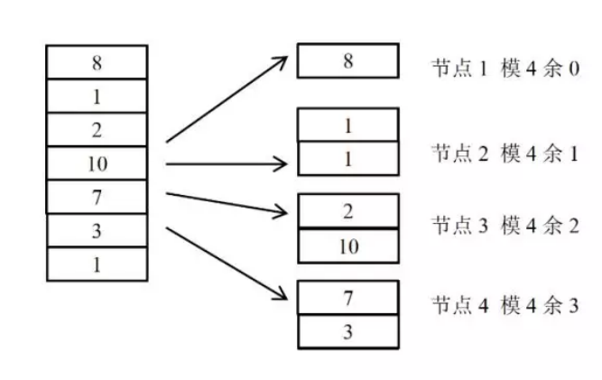

Lease 机制: Lease 机制牺牲了部分异常情况下的A，从而获得了完全的C与很好的P。
Quorum 机制: Quorum 机制，在CAP 三大因素中都各做了折中，有一定的C，有较好 的A，也有较好的P，是一种较为平衡的分布式协议。
两阶段提交协议: 两阶段提交系统具有完全的C，很糟糕的A，很糟糕的P。
Paxos 协议：同样是强一致性协议，Paxos 在CAP 三方面较之两阶段提交协议要优秀得多。Paxos 协议具有 完全的C，较好的A，较好的P。Paxos 的A与P 的属性与Quorum 机制类似，因为Paxos 的协议本 身就具有Quorum 机制的因素。

## 一、CAP理论

### 简介

**CAP** 也就是 **Consistency（一致性）**、**Availability（可用性）**、**Partition Tolerance（分区容错性）** 这三个单词首字母组合。

CAP 理论的提出者布鲁尔在提出 CAP 猜想的时候，并没有详细定义 **Consistency**、**Availability**、**Partition Tolerance** 三个单词的明确定义。

因此，对于 CAP 的民间解读有很多，一般比较被大家推荐的是下面 👇 这种版本的解。

在理论计算机科学中，CAP 定理（CAP theorem）指出对于一个分布式系统来说，当设计读写操作时，只能同时满足以下三点中的两个：

- **一致性（Consistence）** : 所有节点访问同一份最新的数据副本
- **可用性（Availability）**: 非故障的节点在合理的时间内返回合理的响应（不是错误或者超时的响应）。
- **分区容错性（Partition tolerance）** : 分布式系统出现网络分区的时候，仍然能够对外提供服务。

**什么是网络分区？**

> 分布式系统中，多个节点之前的网络本来是连通的，但是因为某些故障（比如部分节点网络出了问题）某些节点之间不连通了，整个网络就分成了几块区域，这就叫网络分区。

### 不是所谓的“3 选 2”

大部分人解释这一定律时，常常简单的表述为：“一致性、可用性、分区容忍性三者你只能同时达到其中两个，不可能同时达到”。实际上这是一个非常具有误导性质的说法，而且在 CAP 理论诞生 12 年之后，CAP 之父也在 2012 年重写了之前的论文。

> 当发生网络分区的时候，如果我们要继续服务，那么强一致性和可用性只能 2 选 1。也就是说当网络分区之后 P 是前提，决定了 P 之后才有 C 和 A 的选择。也就是说分区容错性（Partition tolerance）我们是必须要实现的。
>
> 简而言之就是：CAP 理论中分区容错性 P 是一定要满足的，在此基础上，只能满足可用性 A 或者一致性 C。

因此，**分布式系统理论上不可能选择 CA 架构，只能选择 CP 或者 AP 架构。**

**为啥无同时保证 CA 呢？**

举个例子：若系统出现“分区”，系统中的某个节点在进行写操作。为了保证 C， 必须要禁止其他节点的读写操作，这就和 A 发生冲突了。如果为了保证 A，其他节点的读写操作正常的话，那就和 C 发生冲突了。

**选择的关键在于当前的业务场景，没有定论，比如对于需要确保强一致性的场景如银行一般会选择保证 CP 。**

### CAP 实际应用案例

我这里以注册中心来探讨一下 CAP 的实际应用。考虑到很多小伙伴不知道注册中心是干嘛的，这里简单以 Dubbo 为例说一说。

下图是 Dubbo 的架构图。**注册中心 Registry 在其中扮演了什么角色呢？提供了什么服务呢？**

注册中心负责服务地址的注册与查找，相当于目录服务，服务提供者和消费者只在启动时与注册中心交互，注册中心不转发请求，压力较小。

常见的可以作为注册中心的组件有：ZooKeeper、Eureka、Nacos...。

1. **ZooKeeper 保证的是 CP。** 任何时刻对 ZooKeeper 的读请求都能得到一致性的结果，但是， ZooKeeper 不保证每次请求的可用性比如在 Leader 选举过程中或者半数以上的机器不可用的时候服务就是不可用的。
2. **Eureka 保证的则是 AP。** Eureka 在设计的时候就是优先保证 A （可用性）。在 Eureka 中不存在什么 Leader 节点，每个节点都是一样的、平等的。因此 Eureka 不会像 ZooKeeper 那样出现选举过程中或者半数以上的机器不可用的时候服务就是不可用的情况。 Eureka 保证即使大部分节点挂掉也不会影响正常提供服务，只要有一个节点是可用的就行了。只不过这个节点上的数据可能并不是最新的。
3. **Nacos 不仅支持 CP 也支持 AP。**

### 总结

在进行分布式系统设计和开发时，我们不应该仅仅局限在 CAP 问题上，还要关注系统的扩展性、可用性等等

在系统发生“分区”的情况下，CAP 理论只能满足 CP 或者 AP。要注意的是，这里的前提是系统发生了“分区”

如果系统没有发生“分区”的话，节点间的网络连接通信正常的话，也就不存在 P 了。这个时候，我们就可以同时保证 C 和 A 了。

总结：**如果系统发生“分区”，我们要考虑选择 CP 还是 AP。如果系统没有发生“分区”的话，我们要思考如何保证 CA 。**

## 二、BASE 理论

[BASE 理论](https://link.segmentfault.com/?url=https%3A%2F%2Fdl.acm.org%2Fdoi%2F10.1145%2F1394127.1394128)起源于 2008 年， 由eBay的架构师Dan Pritchett在ACM上发表。

### 简介

**BASE** 是 **Basically Available（基本可用）** 、**Soft-state（软状态）** 和 **Eventually Consistent（最终一致性）** 三个短语的缩写。BASE 理论是对 CAP 中一致性 C 和可用性 A 权衡的结果，其来源于对大规模互联网系统分布式实践的总结，是基于 CAP 定理逐步演化而来的，它大大降低了我们对系统的要求。

### BASE 理论的核心思想

即使无法做到强一致性，但每个应用都可以根据自身业务特点，采用适当的方式来使系统达到最终一致性。

> 也就是牺牲数据的一致性来满足系统的高可用性，系统中一部分数据不可用或者不一致时，仍需要保持系统整体“主要可用”。

**BASE 理论本质上是对 CAP 的延伸和补充，更具体地说，是对 CAP 中 AP 方案的一个补充。**

**为什么这样说呢？**

CAP 理论这节我们也说过了：

> 如果系统没有发生“分区”的话，节点间的网络连接通信正常的话，也就不存在 P 了。这个时候，我们就可以同时保证 C 和 A 了。因此，**如果系统发生“分区”，我们要考虑选择 CP 还是 AP。如果系统没有发生“分区”的话，我们要思考如何保证 CA 。**

因此，AP 方案只是在系统发生分区的时候放弃一致性，而不是永远放弃一致性。在分区故障恢复后，系统应该达到最终一致性。这一点其实就是 BASE 理论延伸的地方。

### BASE 理论三要素

#### 1. 基本可用

基本可用是指分布式系统在出现不可预知故障的时候，允许损失部分可用性。但是，这绝不等价于系统不可用。

**什么叫允许损失部分可用性呢？**

- **响应时间上的损失**: 正常情况下，处理用户请求需要 0.5s 返回结果，但是由于系统出现故障，处理用户请求的时间变为 3 s。
- **系统功能上的损失**：正常情况下，用户可以使用系统的全部功能，但是由于系统访问量突然剧增，系统的部分非核心功能无法使用。

#### 2. 软状态

软状态指允许系统中的数据存在中间状态（**CAP 理论中的数据不一致**），并认为该中间状态的存在不会影响系统的整体可用性，即允许系统在不同节点的数据副本之间进行数据同步的过程存在延时。

#### 3. 最终一致性

最终一致性强调的是系统中所有的数据副本，在经过一段时间的同步后，最终能够达到一个一致的状态。因此，最终一致性的本质是需要系统保证最终数据能够达到一致，而不需要实时保证系统数据的强一致性。

> 分布式一致性的 3 种级别：
>
> 1. **强一致性** ：系统写入了什么，读出来的就是什么。
> 2. **弱一致性** ：不一定可以读取到最新写入的值，也不保证多少时间之后读取到的数据是最新的，只是会尽量保证某个时刻达到数据一致的状态。
> 3. **最终一致性** ：弱一致性的升级版。，系统会保证在一定时间内达到数据一致的状态，
>
> **业界比较推崇是最终一致性级别，但是某些对数据一致要求十分严格的场景比如银行转账还是要保证强一致性。**

### 总结

**ACID 是数据库事务完整性的理论，CAP 是分布式系统设计理论，BASE 是 CAP 理论中 AP 方案的延伸。**

## 三、基础概念

### 1、节点

在具体的工程项目中，一个节点往往是一个操作系统上的进程。在本文的模型中，认为节点是一个完整的、不可分的整体，如果某个程序进程实际上由若干相对独立部分构成，则在模型中可以将一个进程划分为多个节点。

### 2、异常

1. 机器宕机：机器宕机是最常见的异常之一。在大型集群中每日宕机发生的概率为千分之一左右，在实践中，一台宕机的机器恢复的时间通常认为是24 小时，一般需要人工介入重启机器。
2. 网络异常：消息丢失，两片节点之间彼此完全无法通信，即出现了“网络分化”；消息乱序，有一定的概率不是按照发送时的顺序依次到达目的节点，考虑使用序列号等机制处理网络消息的乱序问题，使得无效的、过期的网络消息
不影响系统的正确性；数据错误；不可靠的TCP，TCP 协议为应用层提供了可靠的、面向连接的传输服务，但在分布式系统的协议设计中不能认为所有网络通信都基于TCP 协议则通信就是可靠的。TCP协议只能保证同一个TCP 链接内
的网络消息不乱序，TCP 链接之间的网络消息顺序则无法保证。
3. 分布式三态：如果某个节点向另一个节点发起RPC(Remote procedure call)调用，即某个节点A 向另一个节点B 发送一个消息，节点B 根据收到的消息内容完成某些操作，并将操作的结果通过另一个消息返回给节点A，那么这个RPC
执行的结果有三种状态：“成功”、“失败”、“超时（未知）”，称之为分布式系统的三态。
4. 存储数据丢失:对于有状态节点来说，数据丢失意味着状态丢失，通常只能从其他节点读取、恢复存储的状态。
5. 异常处理原则：被大量工程实践所检验过的异常处理黄金原则是：任何在设计阶段考虑到的异常情况一定会在系统实际运行中发生，但在系统实际运行遇到的异常却很有可能在设计时未能考虑，所以，除非需求指标允许，在系统设
    计时不能放过任何异常情况。

### 3、副本

副本（replica/copy）指在分布式系统中为数据或服务提供的冗余。对于数据副本指在不同的节点上持久化同一份数据，当出现某一个节点的存储的数据丢失时，可以从副本上读到数据。数据副本是分布式系统解决数据丢失异常的唯一手段。另一类副本是服务副本，指数个节点提供某种相同的服务，这种服务一般并不依赖于节点的本地存储，其所需数据一般来自其他节点。
副本协议是贯穿整个分布式系统的理论核心。

### 4、副本一致性

分布式系统通过副本控制协议，使得从系统外部读取系统内部各个副本的数据在一定的约束条件下相同，称之为副本一致性(consistency)。副本一致性是针对分布式系统而言的，不是针对某一个副本而言。

1. 强一致性(strong consistency)：任何时刻任何用户或节点都可以读到最近一次成功更新的副本数据。强一致性是程度最高的一致性要求，也是实践中最难以实现的一致性。
2. 单调一致性(monotonic consistency)：任何时刻，任何用户一旦读到某个数据在某次更新后的值，这个用户不会再读到比这个值更旧的值。单调一致性是弱于强一致性却非常实用的一种一致性级别。因为通常来说，用户只关心从
己方视角观察到的一致性，而不会关注其他用户的一致性情况。
3. 会话一致性(session consistency)：任何用户在某一次会话内一旦读到某个数据在某次更新后的值，这个用户在这次会话过程中不会再读到比这个值更旧的值。会话一致性通过引入会话的概念，在单调一致性的基础上进一步放松约束，会话一致性只保证单个用户单次会话内数据的单调修改，对于不同用户间的一致性和同一用户不同会话间的一致性没有保障。实践中有许多机制正好对应会话的概念，例如php 中的session 概念。
4. 最终一致性(eventual consistency)：最终一致性要求一旦更新成功，各个副本上的数据最终将达 到完全一致的状态，但达到完全一致状态所需要的时间不能保障。对于最终一致性系统而言，一个用户只要始终读取某一个副本的数
据，则可以实现类似单调一致性的效果，但一旦用户更换读取的副本，则无法保障任何一致性。
5. 弱一致性(week consistency)：一旦某个更新成功，用户无法在一个确定时间内读到这次更新的值，且即使在某个副本上读到了新的值，也不能保证在其他副本上可以读到新的值。弱一致性系统一般很难在实际中使用，使用弱一
致性系统需要应用方做更多的工作从而使得系统可用。

### 5、衡量分布式系统的指标

1. 性能：系统的吞吐能力，指系统在某一时间可以处理的数据总量，通常可以用系统每秒处理的总的数据量来衡量；系统的响应延迟，指系统完成某一功能需要使用的时间；系统的并发能力，指系统可以同时完成某一功能的能力，通
常也用QPS(query per second)来衡量。上述三个性能指标往往会相互制约，追求高吞吐的系统，往往很难做到低延迟；系统平均响应时间较长时，也很难提高QPS。
2. 可用性：系统的可用性(availability)指系统在面对各种异常时可以正确提供服务的能力。系统的可用性可以用系统停服务的时间与正常服务的时间的比例来衡量，也可以用某功能的失败次数与成功次数的比例来衡量。可用性是分布
式的重要指标，衡量了系统的鲁棒性，是系统容错能力的体现。
3. 可扩展性：系统的可扩展性(scalability)指分布式系统通过扩展集群机器规模提高系统性能（吞吐、延迟、并发）、存储容量、计算能力的特性。好的分布式系统总在追求“线性扩展性”，也就是使得系统的某一指标可以随着集群中
的机器数量线性增长。
4. 一致性：分布式系统为了提高可用性，总是不可避免的使用副本的机制，从而引发副本一致性的问题。越是强的一致的性模型，对于用户使用来说使用起来越简单。

### 6、数据分布方式

所谓分布式系统顾名思义就是利用多台计算机协同解决单台计算机所不能解决的计算、存储等问题。单机系统与分布式系统的最大的区别在于问题的规模，即计算、存储的数据量的区别。将一个单机问题使用分布式解决，首先要解决的就是如何将问题拆解为可以使用多机分布式解决，使得分布式系统中的每台机器负责原问题的一个子集。由于无论是计算还是存储，其问题输入对象都是数据，所以如何拆解分布式系统的输入数据成为分布式系统的基本问题。

**哈希方式**

哈希分布数据的缺点同样明显，突出表现为可扩展性不高，一旦集群规模需要扩展，则几乎所有的数据需要被迁移并重新分布。工程中，扩展哈希分布数据的系统时，往往使得集群规模成倍扩展，按照数据重新计算哈希，这样原本一台机器上的数据只需迁移一半到另一台对应的机器上即可完成扩展。
针对哈希方式扩展性差的问题，一种思路是不再简单的将哈希值与机器做除法取模映射，而是将对应关系作为元数据由专门的元数据服务器管理.同时，哈希值取模个数往往大于机器个数，这样同一台机器上需要负责多个哈希取模的余数。但需要以较复杂的机制维护大量的元数据。哈希分布数据的另一个缺点是，一旦某数据特征值的数据严重不均，容易出现“数据倾斜”（data skew）问题。
哈希分布数据的另一个缺点是，一旦某数据特征值的数据严重不均，容易出现“数据倾斜”（data skew）问题

**按数据范围分布**

按数据范围分布是另一个常见的数据分布式，将数据按特征值的值域范围划分为不同的区间，使得集群中每台（组）服务器处理不同区间的数据。

工程中，为了数据迁移等负载均衡操作的方便，往往利用动态划分区间的技术，使得每个区间中服务的数据量尽量的一样多。当某个区间的数据量较大时，通过将区间“分裂”的方式拆分为两个区间，使得每个数据区间中的数据量都尽量维持在一个较为固定的阈值之下。

一般的，往往需要使用专门的服务器在内存中维护数据分布信息，称这种数据的分布信息为一种元信息。甚至对于大规模的集群，由于元信息的规模非常庞大，单台 计算机无法独立维护，需要使用多台机器作为元信息服务器。

**按数据量分布**

数据量分布数据与具体的数据特征无关，而是将数据视为一个顺序增长的文件，并将这个文件按照某一较为固定的大小划分为若干数据块（chunk），不同的数据块分布到不同的服务器上。与按数据范围分布数据的方式类似的是，按数据量分布数据也需要记录数据块的具体分布情况，并将该分布信息作为元数据使用元数据服务器管理。

由于与具体的数据内容无关，按数据量分布数据的方式一般没有数据倾斜的问题，数据总是被均匀切分并分布到集群中。当集群需要重新负载均衡时，只需通过迁移数据块即可完成。集群扩容也没有太大的限制，只需将部分数据库迁移到新加入的机器上即可以完成扩容。按数据量划分数据的缺点是需要管理较为复杂的元信息，与按范围 分布数据的方式类似，当集群规模较大时，元信息的数据量也变得很大，高效的管理元信息成为新的课题。

**一致性哈希**

一致性哈希（consistent hashing）是另一个种在工程中使用较为广泛的数据分布方式。一致性哈希最初在P2P 网络中作为分布式哈希表（DHT）的常用数据分布算法。一致性哈希的基本方式是使用一个哈希函数计算数据或数据特征的哈希值，令该哈希函数的输出值域为一个封闭的环，即哈希函数输出的最大值是最小值的前序。将节点随机分布到这个环上，每个节点负责处理从自己开始顺时针至下一个节点的全部哈希值域上的数据。

使用一致性哈希的方式需要将节点在一致性哈希环上的位置作为元信息加以管理，这点比直接使用哈希分布数据的方式要复杂。然而，节点的位置信息只于集群中的机器规模相关，其元信息的量通常比按数据范围分布数据和按数据量分布数据的元信息量要小很多。

为此一种常见的改进算法是引入虚节点（virtual node）的概念，系统初始时就创建许多虚节点，虚节点的个数一般远大于未来集群中机器的个数，将虚节点均匀分布到一致性哈希值域环上，其功能与基本一致性哈希算法中的节点相同。为每个节点分配若干虚节点。操作数据时，首先通过数据的哈希值在环上找到对应的虚节点，进而查找元数据找到对应的真实节点。使用虚节点改进有多个优点。首先，一旦某个节点不可用，该节点将使得多个虚节点不可用，从而使得多个相邻的真实节点负载失效节点的压里。同理，一旦加入一个新节点，可以分配多个虚节点，从而使得新节点可以 负载多个原有节点的压力，从全局看，较容易实现扩容时的负载均衡。

**副本与数据分布**

分布式系统容错、提高可用性的基本手段就是使用副本。对于数据副本的分布方式主要影响系统的可扩展性。一种基本的数据副本策略是以机器为单位，若干机器互为副本，副本机器之间的数据完全相同。这种策略适用于上述各种数据分布方式。其优点是非常简单，其缺点是恢复数据的效率不高、可扩展性也不高。

更合适的做法不是以机器作为副本单位，而是将数据拆为较合理的数据段，以数据段为单位作为副本。实践中，常常使得每个数据段的大小尽量相等且控制在一定的大小以内。数据段有很多不同的称谓，segment，fragment，chunk，partition 等等。数据段的选择与数据分布方式直接相关。对于哈希分数据的方式，每个哈希分桶后的余数可以作为一个数据段，为了控制数据段的大小，常常使得分桶个数大于集群规模。一旦将数据分为数据段，则可以以数据段为单位管理副本，从而副本与机器不再硬相关，每台机器都可以负责一定数据段的副本。

一旦副本分布与机器无关，数据丢失后的恢复效率将非常高。这是因为，一旦某台机器的数据丢失，其上数据段的副本将分布在整个集群的所有机器中，而不是仅在几个副本机器中，从而可以从整个集群同时拷贝恢复数据，而集群中每台数据源机器都可以以非常低的资源做拷贝。作为恢复数据源的机器即使都限速1MB/s，若有100 台机器参与恢复，恢复速度也能达到100MB/s。再者，副本分布与机器无关也利于集群容错。如果出现机器宕机，由于宕机机器上的副本分散于整个集群，其压力也自然分散到整个集群。最后，副本分布与机器无关也利于集群扩展。理论上，设集群规模 为N台机器，当加入一台新的机器时，只需从各台机器上迁移1/N – 1/N+1 比例的数据段到新机器即实现了新的负载均衡。由于是从集群中各机器迁移数据，与数据恢复同理，效率也较高。工程中，完全按照数据段建立副本会引起需要管理的元数据的开销
增大，副本维护的难度也相应增大。一种折中的做法是将某些数据段组成一个数据段分组，按数据段分组为粒度进行副本管理。这样做可以将副本粒度控制在一个较为合适的范围内。

**本地化计算**

在分布式系统中，数据的分布方式也深深影响着计算的分布方式。在分布式系统中计算节点和保存计算数据的存储节点可以在同一台物理机器上，也可以位于不同的物理机器。如果计算节点和存储节点位于不同的物理机器则计算的数据需要通过网络传输，此种方式的开销很大，甚至网络带宽会成为系统的总体瓶颈。另一种思路是，将计算尽量调度到与存储节点在同一台物理机器上的计算节点上进行，这称之为本地化计算。本地化计算是计算调度的一种重要优化，其体现了一种重要的分布式调度思想：“移动数据不如移动计算”。

**数据分布方式的选择**

在实际工程实践中，可以根据需求及实施复杂度合理选择数据分布方式。另外，数据分布方式是可以灵活组合使用的，往往可以兼备各种方式的优点，收到较好的综合效果。
例：数据倾斜问题，在按哈希分数据的基础上引入按数据量分布数据的方式，解决该数据倾斜问题。按用户id 的哈希值分数据，当某个用户id 的数据量特别大时，该用户的数据始终落在某一台机器上。此时，引入按数据量分布数据的方式，统计用户的数据量，并按某一阈值将用户的数据切为多个均匀的数据段，将这些数据段分布到集群中去。由于大部分用户的数据量不会超过阈值，所以元数据中仅仅保存超过阈值的用户的数据段分布信息，从而可以控制元数据的规模。这种哈希分布数据方式与按数据量分布数据方式组合使用的方案，在某真实系统中使用，取得了较好的效果。

### 7、基本副本协议

副本控制协议指按特定的协议流程控制副本数据的读写行为，使得副本满足一定的可用性和一致性要求的分布式协议。副本控制协议要具有一定的对抗异常状态的容错能力，从而使得系统具有一定的可用性，同时副本控制协议要能提供一定一致性级别。
由CAP 原理（在2.9 节详细分析）可知，要设计一种满足强一致性，且在出现任何网络异常时都可用的副本协议是不可能的。为此，实际中的副本控制协议总是在可用性、一致性与性能等各要素之间按照具体需求折中。

副本控制协议可以分为两大类：“中心化(centralized)副本控制协议”和“去中心化(decentralized)副本控制协议”。

**中心化副本控制协议**

中心化副本控制协议的基本思路是由一个中心节点协调副本数据的更新、维护副本之间的一致性。图给出了中心化副本协议的通用架构。中心化副本控制协议的优点是协议相对较为简单，所有的副本相关的控制交由中心节点完成。并发控制将由中心节点完成，从而使得一个分布式并发控制问题，简化为一个单机并发控制问题。所谓并发控制，即多个节点同时需要修改副本数据时，需要解决“写写”、“读写”等并发冲突。单机系统上常用加锁等方式进行并发控制。对于分布式并发控制，加锁也是一个常用的方法，但如果没有中心节点统一进行锁管理，就需要完全分布式化的锁系统，会使得协议非常复杂。中心化副本控制协议的缺点是系统的可用性依赖于中心化节点，当中心节点异常或与中心节点通信中断时，系统将失去某些服务（通常至少失去更新服务），所以中心化副本控制协议的缺点正是存在一定的停服务时间。

**primary-secondary 协议**

在primary-secondary 类型的协议中，副本被分为两大类，其中有且仅有一个副本作为primary 副本，除primary 以外的副本都作为secondary 副本。维护primary 副本的节点作为中心节点，中心节点负责维护数据的更新、并发控制、协调副本的一致性。

Primary-secondary 类型的协议一般要解决四大类问题：数据更新流程、数据读取方式、Primary 副本的确定和切换、数据同步（reconcile）。

数据更新基本流程
1. 数据更新都由primary 节点协调完成。
2. 外部节点将更新操作发给primary 节点
3. primary 节点进行并发控制即确定并发更新操作的先后顺序
4. primary 节点将更新操作发送给secondary 节点
5. primary 根据secondary 节点的完成情况决定更新是否成功并将结果返回外部节点

在工程实践中，如果由primary 直接同时发送给其他N 个副本发送数据，则每个secondary 的更新吞吐受限于primary 总的出口网络带宽，最大为primary 网络出口带宽的1/N。为了解决这个问题，有些系统（例如，GFS），使用接力的方式同步数据，即primary 将更新发送给第一 个secondary 副本，第一个secondary 副本发送给第二secondary 副本，依次类推。

**去中心化副本控制协议**

去中心化副本控制协议没有中心节点，协议中所有的节点都是完全对等的，节点之间通过平等协商达到一致。从而去中心化协议没有因为中心化节点异常而带来的停服务等问题。
去中心化协议的最大的缺点是协议过程通常比较复杂。尤其当去中心化协议需要实现强一致性时，协议流程变得复杂且不容易理解。由于流程的复杂，去中心化协议的效率或者性能一般也较中心化协议低。一个不恰当的比方就是，中心化副本控制协议类似专制制度，系统效率高但高度依赖于中心节点，一旦中心节点异常，系统受到的影响较大；去中心化副本控制协议类似民主制度，节点集体协商，效率低下，但个别节点的异常不会对系统总体造成太大影响。

### 8、Lease 机制

Lease 机制是最重要的分布式协议，广泛应用于各种实际的分布式系统中。

**基于lease 的分布式cache 系统**

基本的问题背景如下：在一个分布式系统中，有一个中心服务器节点，中心服务器存储、维护着一些数据，这些数据是系统的元数据。系统中其他的节点通过访问中心服务器节点读取、修改其上的元数据。由于系统中各种操作都依赖于元数据，如果每次读取元数据的操作都访问中心服务器 节点，那么中心服务器节点的性能成为系统的瓶颈。为此，设计一种元数据cache，在各个节点上 cache 元数据信息，从而减少对中心服务器节点的访问，提高性能。另一方面，系统的正确运行严格依赖于元数据的正确，这就要求各个节点上cache 的数据始终与中心服务器上的数据一致，cache 中的数据不能是旧的脏数据。最后，设计的cache 系统要能最大可能的处理节点宕机、网络中断等异常，最大程度的提高系统的可用性。

为此，利用lease 机制设计一套cache 系统，其基本原理为如下。中心服务器在向各节点发送数据时同时向节点颁发一个lease。每个lease 具有一个有效期，和信用卡上的有效期类似，lease 上的 有效期通常是一个明确的时间点，例如12:00:10，一旦真实时间超过这个时间点，则lease 过期失效。这样lease 的有效期与节点收到lease 的时间无关，节点可能收到lease 时该lease 就已经过期失效。这里首先假设中心服务器与各节点的时钟是同步的，在下节中讨论时钟不同步对lease 的影响。中心服务器发出的lease 的含义为：在lease 的有效期内，中心服务器保证不会修改对应数据的值。因此，节点收到数据和lease 后，将数据加入本地Cache，一旦对应的lease 超时，节点将对应的本地cache 数据删除。中心服务器在修改数据时，首先阻塞所有新的读请求，并等待之前为该数据发出的所有lease 超时过期，然后修改数据的值。

基于lease 的cache，客户端节点读取元数据

1. 判断元数据是否已经处于本地cache 且lease 处于有效期内1.1 是：直接返回cache 中的元数据1.2 否：向中心服务器节点请求读取元数据信息1.2.1 服务器收到读取请求后，返回元数据及一个对应的lease 1.2.2 客户端是否成功收到服
务器返回的数据   1.2.2.1 失败或超时：退出流程，读取失败，可重试1.2.2.2 成功：将元数据与该元数据的lease 记录到内存中，返回元数据
2. 基于lease 的cache，客户端节点修改元数据流程2.1 节点向服务器发起修改元数据请求。2.2 服务器收到修改请求后，阻塞所有新的读数据请求，即接收读请求，但不返回数据。2.3 服务器等待所有与该元数据相关的lease 超时。2.4服务器修改元数据并向客户端节点返回修改成功。

上述机制可以保证各个节点上的cache 与中心服务器上的中心始终一致。这是因为中心服务器节点在发送数据的同时授予了节点对应的lease，在lease 有效期内，服务器不会修改数据，从而客户端节点可以放心的在lease 有效期内cache 数据。上述lease机制可以容错的关键是：服务器一旦 发出数据及lease，无论客户端是否收到，也无论后续客户端是否宕机，也无论后续网络是否正常，服务器只要等待lease 超时，就可以保证对应的客户端节点不会再继续cache 数据，从而可以放心的修改数据而不会破坏cache 的一致性。

上述基础流程有一些性能和可用性上的问题，但可以很容易就优化改性。优化点一：服务器在修改元数据时首先要阻塞所有新的读请求，造成没有读服务。这是为了防止发出新的lease 从而引起不断有新客户端节点持有lease 并缓存着数据，形成“活锁”。优化的方法很简单，服务器在进入修改数据流程后，一旦收到读请求则只返回数据但不颁发lease。从而造成在修改流程执行的过程中，客户端可以读到元数据，只是不能缓存元数据。进一步的优化是，当进入修改流程，服务器颁发的lease 有效期限选择为已发出的lease 的最大有效期限。这样做，客户端可以继续在服务器进入修改流程后继续缓存元数据，但服务器的等待所有lease 过期的时间也不会因为颁发新的lease 而不断延长。

最后，=cache 机制与多副本机制的区别。Cache 机制与多副本机制的相似之处都 是将一份数据保存在多个节点上。但Cache 机制却要简单许多，对于cache 的数据，可以随时删除丢弃，并命中cache 的后果仅仅是需要访问数据源读取数据；然而副本机制却不一样，副本是不能随意丢弃的，每失去一个副本，服务质量都在下降，一旦副本数下降到一定程度，则往往服务将不再可用。

### 9、MVCC

MVCC(Multi-version Cocurrent Control，多版本并发控制)技术。MVCC 技术最初也是在数据库系统中被提出，但这种思想并不局限于单机的分布式系统，在分布式系统中同样有效。

MVCC 即多个不同版本的数据实现并发控制的技术，其基本思想是为每次事务生成一个新版本的数据，在读数据时选择不同版本的数据即可以实现对事务结果的完整性读取。在使用MVCC 时，每个事务都是基于一个已生效的基础版本进行更新，事务可以并行进行，从而可以产生一种图状结构。

基础数据的版本为1，同时产生了两个事务：事务A 与事务B。这两个事务都各自对数据进行了一些本地修改（这些修改只有事务自己可见，不影响真正的数据），之后事务A 首先提交，生成数据版本2；基于数据版本2，又发起了事务C，事务C 继续提交，生成了数据版 本3；最后事务B 提交，此时事务B 的结果需要与事务C 的结果合并，如果数据没有冲突，即事务 B 没有修改事务A 与事务C 修改过的变量，那么事务B 可以提交，否则事务B 提交失败。MVCC 的流程过程非常类似于SVN 等版本控制系统的流程，或者说SVN 等版本控制系统就是 使用的MVCC 思想。事务在基于基础数据版本做本地修改时，为了不影响真正的数据，通常有两种做法，一是将基础数据版本中的数据完全拷贝出来再修改，SVN 即使用了这种方法，SVN check out 即是拷贝的过程；二是每个事务中只记录更新操作，而不记录完整的数据，读取数据时再将更新操作应用到用基础版本的数据从而计算出结果，这个过程也类似SVN 的增量提交。

### 10、Paxos协议

Paxos 协议是少数在工程实践中证实的强一致性、高可用的去中心化分布式协议。Paxos 协议的流程较为复杂，但其基本思想却不难理解，类似于人类社会的投票过程。Paxos 协议中，有一组完全对等的参与节点（称为accpetor），这组节点各自就某一事件做出决议，如果某个决议获得了超过半数节点的同意则生效。Paxos 协议中只要有超过一半的节点正常，就可以工作，能很好对抗宕机、网络分化等异常情况。

**角色**

Proposer：提案者。Proposer 可以有多个，Proposer 提出议案（value）。所谓value，在工程中可以是任何操作，例如“修改某个变量的值为某个值”、“设置当前primary 为某个节点”等等。Paxos 协议中统一将这些操作抽象为value。不同的
Proposer 可以提出不同的甚至矛盾的value，例如某个Proposer 提议“将变量X 设置为1”，另一个Proposer 提议“将变量X 设置为2”，但对同一轮Paxos 过程，最多只有一个value 被批准。Acceptor：批准者。Acceptor 有N 个，Proposer 提出
的value 必须获得超过半数(N/2+1)的Acceptor 批准后才能通过。Acceptor 之间完全对等独立。Learner：学习者。Learner 学习被批准的value。所谓学习就是通过读取各个Proposer 对value 的选择结果，如果某个value 被超过半数Proposer 通过，则Learner 学习到了这个value。回忆（2.4 ） 不难理解，这里类似Quorum 机制，某个value 需要获得W=N/2 + 1 的Acceptor 批准，从而学习者需要至少读取N/2+1个Accpetor，至多读取N 个Acceptor 的结果后，能学习到一个通过的value。上述三类角色只是逻辑上的划分，实践中一个节点可以同时充当这三类角色。

**流程**

Paxos 协议一轮一轮的进行，每轮都有一个编号。每轮Paxos 协议可能会批准一个value，也可 能无法批准一个value。如果某一轮Paxos 协议批准了某个value，则以后各轮Paxos 只能批准这个 value。上述各轮协议流程组成了一个Paxos 协议实例，即一次Paxos 协议实例只能批准一个value，这也是Paxos 协议强一致性的重要体现。每轮Paxos 协议分为阶段，准备阶段和批准阶段，在这两个阶段Proposer 和Acceptor 有各自的处理流程。

流程：Proposer 的流程 （准备阶段）

1. 向所有的Acceptor 发送消息“Prepare(b)”；这里b 是Paxos 的轮数，每轮递增
2. 如果收到任何一个Acceptor 发送的消息“Reject(B)”，则对于这个Proposer 而言本轮Paxos 失败，将轮数b 设置为B+1 后重新步骤1；（批准阶段，根据收到的Acceptor 的消息作出不同选择）
3. 如果接收到的Acceptor 的“Promise(b, v_i)”消息达到N/2+1 个（N 为Acceptor 总数，除法取整， 下同）；v_i 表示Acceptor 最近一次在i 轮批准过value v。3.1 如果收到的“Promise(b, v)”消息中，v 都为空，Proposer 选择一个value v，向所有Acceptor 广播Accept(b, v)；3.2 否则，在所有收到的“Promise(b, v_i)”消息中，选择i 最大的value v，向所有Acceptor 广播消息Accept(b，v)；
4. 如果收到Nack(B)，将轮数b 设置为B+1 后重新步骤1；

流程：Accpetor 流程 （准备阶段）

1. 接受某个Propeser 的消息Prepare(b)。参数B 是该Acceptor 收到的最大Paxos 轮数编号；V 是Acceptor 批准的value，可以为空 1.1 如果b>B，回复Promise(b, V_B)，设置B=b; 表示保证不再接受编号小于b 的提案。1.2 否则，
回复Reject(B) （批准阶段）
2. 接收Accept(b, v)， 2.1 如果b < B, 回复Nack(B)，暗示proposer 有一个更大编号的提案被这个Acceptor 接收了 2.2 否则设置V=v。表示这个Acceptor批准的Value 是v。广播Accepted 消息。

例子
基本例子里有5 个Acceptor，1 个Proposer，不存在任何网络、宕机异常。我们着重考察各个Accpetor 上变量B 和变量V 的变化，及Proposer 上变量b 的变化。

1. 初始状态

2. Proposer 向所有Accpetor 发送“Prepare(1)”，所有Acceptor 正确处理，并回复Promise(1, NULL

3. Proposer 收到5 个Promise(1, NULL)，满足多余半数的Promise 的value为空，此时发送 Accept(1, v1)，其中v1 是Proposer 选择的Value。

4. 此时，v1 被超过半数的Acceptor 批准，v1 即是本次Paxos 协议实例批准的Value。如果Learner 学习value，学到的只能是v1

在同一个Paxos 实例中，批准的Value 是无法改变的，即使后续Proposer 以更高的序号发起Paxos 协议也无法改变value。Paxos 协议的核心就在于“批准的value 无法改变”，这也是整个协议正确性的基础。

Paxos 协议是被人为设计出来，其设计过程也是协议的推导过程。Paxos 协议利用了Quorom 机 制，选择的W=R=N/2+1。简单而言，协议就是Proposer 更新Acceptor 的过程，一旦某个Acceptor 成功更新了超过半数的Acceptor，则更新成功。Learner 按Quorum 去读取Acceptor，一旦某个value 在超过半数的Proposer上被成功读取，则说明这是一个被批准的value。协议通过引入轮次，使得高轮次的提议抢占低轮次的提议来避免死锁。协议设计关键点是如何满足“在一次Paxos 算法实例过程中只批准一个Value”这一约束条件。

