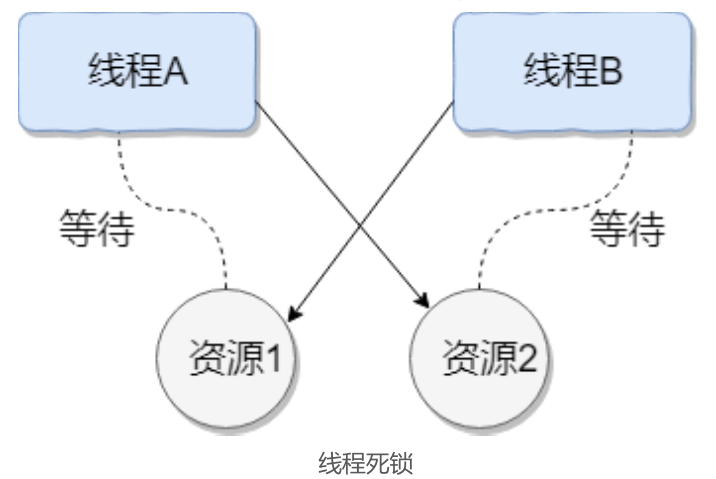
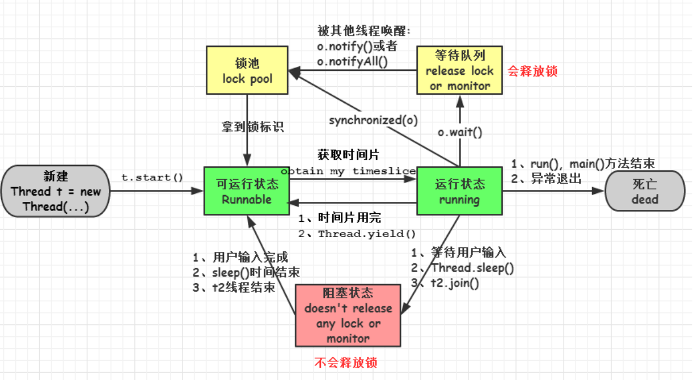
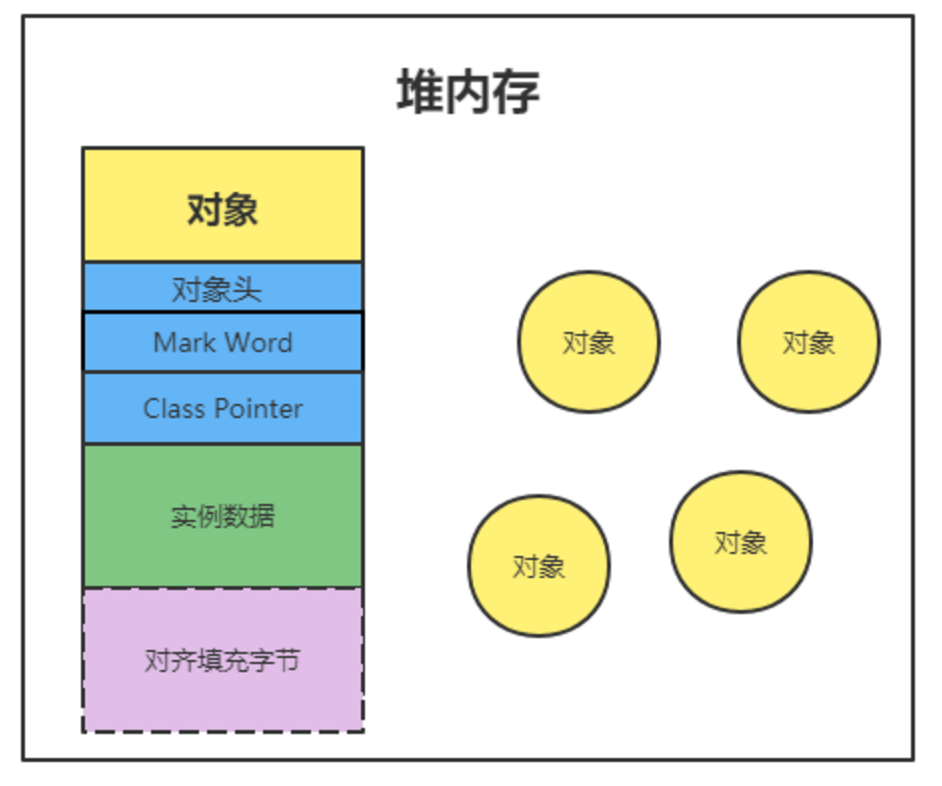
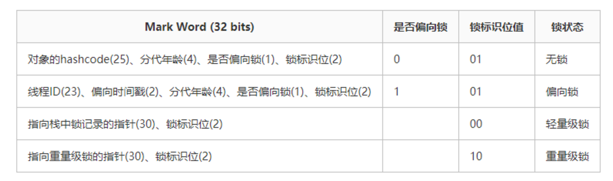
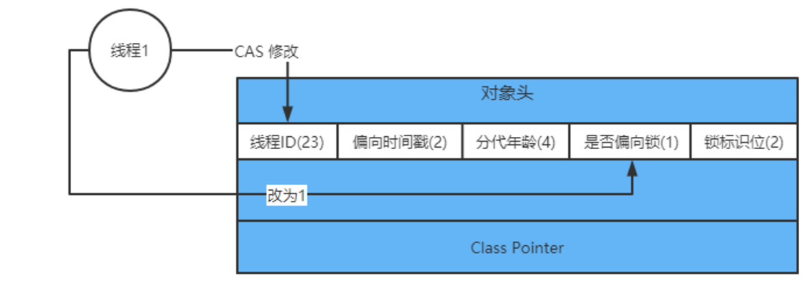
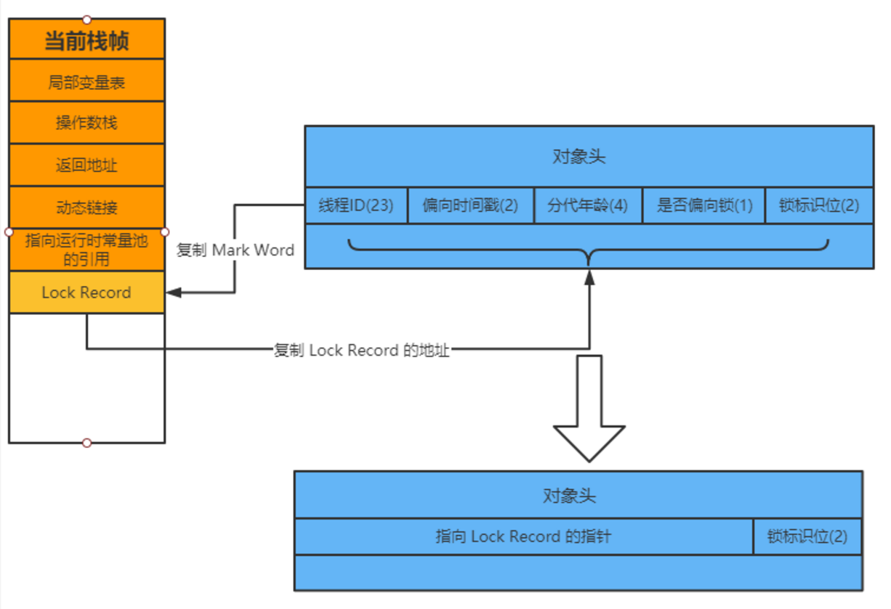
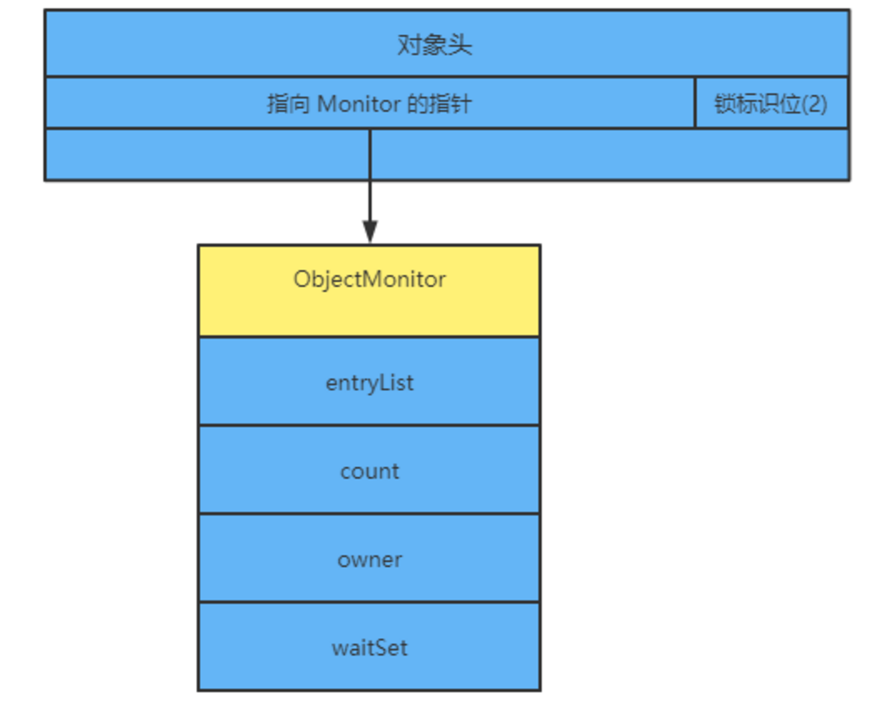
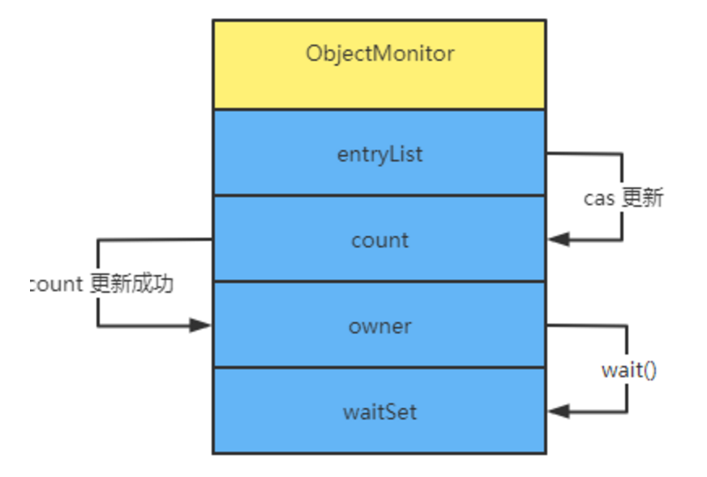

## 一、基础

### 进程和线程，区别，哪个效率高，为什么

进程：指在系统中正在运行的一个应用程序；程序一旦运行就是进程；或者更专业化来说：进程是指程序执行时的一个实例。从内核的观点看，进程的目的就是担当分配系统资源（CPU时间、内存等）的基本单位。

线程：系统分配处理器时间资源的基本单元，或者说进程之内独立执行的一个单元执行流。进程——资源分配的最小单位，线程——程序执行的最小单位。


### 并发编程三要素是什么？在 Java 程序中怎么保证多线程的运行安全？

并发编程三要素（线程的安全性问题体现在）：
原子性：原子，即一个不可再被分割的颗粒。原子性指的是一个或多个操作要么全部执行成功要么全部执行失败。
可见性：一个线程对共享变量的修改,另一个线程能够立刻看到。（synchronized,volatile）
有序性：程序执行的顺序按照代码的先后顺序执行。（处理器可能会对指令进行重排序）

出现线程安全问题的原因：

- 线程切换带来的原子性问题
- 缓存导致的可见性问题
- 编译优化带来的有序性问题

解决办法：

- JDK Atomic开头的原子类、synchronized、LOCK，可以解决原子性问题
- synchronized、volatile、LOCK，可以解决可见性问题
- Happens-Before 规则可以解决有序性问题


### 线程和进程区别

进程
一个在内存中运行的应用程序。每个进程都有自己独立的一块内存空间，一个进程可以有多个线程，比如在Windows系统中，一个运行的xx.exe就是一个进程。

线程
进程中的一个执行任务（控制单元），负责当前进程中程序的执行。一个进程至少有一个线程，一个进程可以运行多个线程，多个线程可共享数据。

### 什么是上下文切换?

多线程编程中一般线程的个数都大于 CPU 核心的个数，而一个 CPU 核心在任意时刻只能被一个线程使用，为了让这些线程都能得到有效执行，CPU 采取的策略是为每个线程分配时间片并轮转的形式。当一个线程的时间片用完的时候就会重
新处于就绪状态让给其他线程使用，这个过程就属于一次上下文切换。概括来说就是：当前任务在执行完 CPU 时间片切换到另一个任务之前会先保存自己的状态，以便下次再切换回这个任务时，可以再加载这个任务的状态。任务
从保存到再加载的过程就是一次上下文切换。上下文切换通常是计算密集型的。也就是说，它需要相当可观的处理器时间，在每秒几十上百次的切换中，每次切换都需要纳秒量级的时间。所以，上下文切换对系统来说意味着消耗大量的 CPU 时间，事实上，可能是操作系统中时间消耗最大的操作。
Linux 相比与其他操作系统（包括其他类 Unix 系统）有很多的优点，其中有一项就是，其上下文切换和模式切换的时间消耗非常少。

### 守护线程和用户线程有什么区别呢？

守护线程和用户线程
用户 (User) 线程 ：运行在前台，执行具体的任务，如程序的主线程、连接网络的子线程等都是用户线程
守护 (Daemon) 线程 ：运行在后台，为其他前台线程服务。也可以说守护线程是 JVM 中非守护线程的  “佣人” 。一旦所有用户线程都结束运行，守护线程会随JVM 一起结束工作
main 函数所在的线程就是一个用户线程，main 函数启动的同时在 JVM 内部同时还启动了好多守护线程，比如垃圾回收线程。
比较明显的区别之一是用户线程结束，JVM 退出，不管这个时候有没有守护线程运行。而守护线程不会影响 JVM 的退出。
注意事项：

1. setDaemon(true) 必须在 start() 方法前执行，否则会抛出IllegalThreadStateException  异常
2. 在守护线程中产生的新线程也是守护线程
3. 不是所有的任务都可以分配给守护线程来执行，比如读写操作或者计算逻辑
4. 守护 (Daemon) 线程中不能依靠 finally 块的内容来确保执行关闭或清理资源的逻辑。因为我们上面也说过了一旦所有用户线程都结束运行，守护线程会随 JVM 一起结束工作，所以守护 (Daemon) 线程中的 finally 语句块可能无法被执行。

### 如何在 Windows 和 Linux 上查找哪个线程cpu利用率最高？

windows上面用任务管理器看，linux下可以用 top 这个工具看。
1. 找出cpu耗用厉害的进程pid， 终端执行top命令，然后按下shift+p 查找出cpu利用最厉害的pid号
2. 根据上面第一步拿到的pid号，top -H -p pid 。然后按下shift+p，查找出cpu利用率最厉害的线程号，比如top -H -p 1328
3. 将获取到的线程号转换成16进制，去百度转换一下就行
4. 使用jstack工具将进程信息打印输出，jstack pid号 > /tmp/t.dat，比如
jstack 31365 > /tmp/t.dat
5. 编辑/tmp/t.dat文件，查找线程号对应的信息

### 什么是线程死锁

死锁是指两个或两个以上的进程（线程）在执行过程中，由于竞争资源或者由于彼此通信而造成的一种阻塞的现象，若无外力作用，它们都将无法推进下去。此时称系统处于死锁状态或系统产生了死锁，这些永远在互相等待的进程（线程）称为死锁进程（线程）。
多个线程同时被阻塞，它们中的一个或者全部都在等待某个资源被释放。由于线程被无限期地阻塞，因此程序不可能正常终止。
如下图所示，线程 A 持有资源 2，线程 B 持有资源 1，他们同时都想申请对方的资源，所以这两个线程就会互相等待而进入死锁状态。



下面通过一个例子来说明线程死锁，代码模拟了上图的死锁的情况 (代码来源于
《并发编程之美》)：

```java
public class DeadLockDemo{
    private static Object resource1 =new Object();//资源1
    private static Object resource2 =new Object();//资源 2
    public static void main(String[] args){
        new Thread(()->{
            synchronized(resource1){               
                System.out.println(Thread.currentThread()+"get resource1");
                try{                   
                      Thread.sleep(1000);
                 }catch(InterruptedException e){                    
                    e.printStackTrace();
                }               
             System.out.println(Thread.currentThread()+"waiting getresource2");
            
            synchronized(resource2){                   
                 System.out.println(Thread.currentThread()+"get resource2");
                }
            }
        },"线程1").start();
        
        new Thread(()->{synchronized(resource2){               
               System.out.println(Thread.currentThread()+"get resource2");
               try{                   
                   Thread.sleep(1000);
               }catch(InterruptedException e){                    
                   e.printStackTrace();
               }   
            
            System.out.println(Thread.currentThread()+"waiting getresource1");
            
            synchronized(resource1){                   
                  System.out.println(Thread.currentThread()+"get resource1");
               }
            }
         },"线程 2").start();
    }
}
```

```java
输出结果
Thread[线程 1,5,main]
get resource1Thread[线程 2,5,main]
get resource2Thread[线程 1,5,main]
waiting get resource2Thread[线程 2,5,main]
waiting get resource1
```

线程 A 通过 synchronized (resource1) 获得 resource1 的监视器锁，然后通过Thread.sleep(1000) ；让线程 A 休眠 1s 为的是让线程 B 得到CPU执行权，然后获取到 resource2 的监视器锁。线程 A 和线程 B 休眠结束了都开始企图请求获取
对方的资源，然后这两个线程就会陷入互相等待的状态，这也就产生了死锁。上面的例子符合产生死锁的四个必要条件。

### 形成死锁的四个必要条件是什么

1. 互斥条件：线程(进程)对于所分配到的资源具有排它性，即一个资源只能被一个线程(进程)占用，直到被该线程(进程)释放
2. 请求与保持条件：一个线程(进程)因请求被占用资源而发生阻塞时，对已获得的资源保持不放。
3. 不剥夺条件：线程(进程)已获得的资源在末使用完之前不能被其他线程强行剥夺，只有自己使用完毕后才释放资源。
4. 循环等待条件：当发生死锁时，所等待的线程(进程)必定会形成一个环路（类似于死循环），造成永久阻塞

### 如何避免线程死锁

 

破坏互斥条件
这个条件我们没有办法破坏，因为我们用锁本来就是想让他们互斥的（临界资源需要互斥访问）。

破坏请求与保持条件
一次性申请所有的资源。

破坏不剥夺条件
占用部分资源的线程进一步申请其他资源时，如果申请不到，可以主动释放它占有的资源。

破坏循环等待条件
靠按序申请资源来预防。按某一顺序申请资源，释放资源则反序释放。破坏循环等待条件。

我们对线程 2 的代码修改成下面这样就不会产生死锁了。

```java
new Thread(()->{
    synchronized(resource1){       
        System.out.println(Thread.currentThread()+"get resource1");
        try{           
            Thread.sleep(1000);
        }catch(InterruptedException e){            
            e.printStackTrace();
        }    
        
        System.out.println(Thread.currentThread()+"waiting getresource2");
   
        synchronized(resource2){           
        System.out.println(Thread.currentThread()+"get resource2");
        }
    }
},"线程 2").start();
```

我们分析一下上面的代码为什么避免了死锁的发生?
线程 1 首先获得到 resource1 的监视器锁，这时候线程 2 就获取不到了。然后线程 1 再去获取 resource2 的监视器锁，可以获取到。然后线程 1 释放了对resource1、resource2 的监视器锁的占用，线程 2 获取到就可以执行了。这样就破坏了破坏循环等待条件，因此避免了死锁。

### 创建线程有哪几种方式？

创建线程有四种方式：

- 继承 Thread 类；
- 实现 Runnable 接口；
- 实现 Callable 接口；
- 使用 Executors 工具类创建线程池

**继承 Thread 类**
步骤

1. 定义一个Thread类的子类，重写run方法，将相关逻辑实现，run()方法
就是线程要执行的业务逻辑方法
2. 创建自定义的线程子类对象
3. 调用子类实例的star()方法来启动线程

```java
public class MyThread extends Thread{
    @Override
    public void run(){       
        System.out.println(
            Thread.currentThread().getName()+" run()方法正在执行...");
    }
}

public class TheadTest{
    public static void main(String[] args){        
        MyThread myThread = new MyThread();          
        myThread.start();       
        System.out.println(Thread.currentThread().getName()+" main()方法执行结束");
    }
}
```

运行结果
main main()方法执行结束Thread-0run()方法正在执行...


**实现 Runnable 接口**

步骤
1. 定义Runnable接口实现类MyRunnable，并重写run()方法
2. 创建MyRunnable实例myRunnable，以myRunnable作为target创建
Thead对象，该Thread对象才是真正的线程对象
3. 调用线程对象的start()方法

```java
public class MyRunnable implements Runnable{
    @Override
    public void run(){       
        System.out.println(Thread.currentThread().getName()+" run()方法执行中...");
    }
}

public class RunnableTest{
    public static void main(String[] args){        
        MyRunnable myRunnable =new MyRunnable();        
        Thread thread =new Thread(myRunnable);       
        thread.start();        
        System.out.println(Thread.currentThread().getName()+" main()方法执行完成");
    }
}
```

执行结果
main main()方法执行完成Thread-0run()方法执行中...

**实现 Callable 接口**

步骤
1. 创建实现Callable接口的类myCallable
2. 以myCallable为参数创建FutureTask对象
3. 将FutureTask作为参数创建Thread对象
4. 调用线程对象的start()方法

```java
public class MyCallable implements Callable<Integer>{
    @Override
    public Integer call(){       
       System.out.println(Thread.currentThread().getName()+" call()方法执行中...");
       return 1;
    }
}


public class CallableTest{
    public static void main(String[] args){        
        FutureTask<Integer> futureTask =new FutureTask<Integer>(new MyCallable());        
        Thread thread=new Thread(futureTask);        
        thread.start();
        try{            
            Thread.sleep(1000);           
			System.out.println("返回结果 "+ futureTask.get());
        }catch(InterruptedException e){           
			e.printStackTrace();
        }catch(ExecutionException e){            
            e.printStackTrace();}       
            System.out.println(Thread.currentThread().getName()+" main()方法执行完成");
    }
}
```

执行结果
Thread-0call()方法执行中...返回结果 1main main()方法执行完成


**使用 Executors 工具类创建线程池**

Executors提供了一系列工厂方法用于创先线程池，返回的线程池都实现了ExecutorService接口。
主要有newFixedThreadPool，newCachedThreadPool，newSingleThreadExecutor，newScheduledThreadPool，后续详细介绍这四种线程池

```java
public class MyRunnable implements Runnable{
    @Override
    public void run(){       
       System.out.println(Thread.currentThread().getName()+" run()方法执行中...");
    }
}


public class SingleThreadExecutorTest{
    public static void main(String[] args){       
    ExecutorService executorService = Executors.newSingleThreadExecutor();       
    MyRunnable runnableTest =new MyRunnable();
        for(int i =0; i <5; i++){           
            executorService.execute(runnableTest);
        }        
        System.out.println("线程任务开始执行");       
        executorService.shutdown();
    }
}
```


### 说一下 runnable 和 callable 有什么区别？

相同点

- 都是接口
- 都可以编写多线程程序
- 都采用Thread.start()启动线程

主要区别

- Runnable 接口 run 方法无返回值；Callable 接口 call 方法有返回值，是个泛
  型，和Future、FutureTask配合可以用来获取异步执行的结果
- Runnable 接口 run 方法只能抛出运行时异常，且无法捕获处理；Callable 接口
  call 方法允许抛出异常，可以获取异常信息

注：Callalbe接口支持返回执行结果，需要调用FutureTask.get()得到，此方法会
阻塞主进程的继续往下执行，如果不调用不会阻塞。


### 线程的 run()和 start()有什么区别？

每个线程都是通过某个特定Thread对象所对应的方法run()来完成其操作的，run()方法称为线程体。通过调用Thread类的start()方法来启动一个线程。

start() 方法用于启动线程，run() 方法用于执行线程的运行时代码。run() 可以重复调用，而 start() 只能调用一次。
start()方法来启动一个线程，真正实现了多线程运行。调用start()方法无需等待run方法体代码执行完毕，可以直接继续执行其他的代码； 此时线程是处于就绪状态，并没有运行。 然后通过此Thread类调用方法run()来完成其运行状态，run()方法运行结束， 此线程终止。然后CPU再调度其它线程。

run()方法是在本线程里的，只是线程里的一个函数，而不是多线程的。 如果直接调用run()，其实就相当于是调用了一个普通函数而已，直接待用run()方法必须等待run()方法执行完毕才能执行下面的代码，所以执行路径还是只有一条，根
本就没有线程的特征，所以在多线程执行时要使用start()方法而不是run()方法。


### 为什么我们调用 start() 方法时会执行 run() 方法，为什么我们不能直接调用 run() 方法？

new 一个 Thread，线程进入了新建状态。调用 start() 方法，会启动一个线程并使线程进入了就绪状态，当分配到时间片后就可以开始运行了。 start() 会执行线程的相应准备工作，然后自动执行 run() 方法的内容，这是真正的多线程工作。
而直接执行 run() 方法，会把 run 方法当成一个 main 线程下的普通方法去执行，并不会在某个线程中执行它，所以这并不是多线程工作。

总结： 调用 start 方法方可启动线程并使线程进入就绪状态，而 run 方法只是thread 的一个普通方法调用，还是在主线程里执行。

### 什么是 Callable 和 Future?

Callable 接口类似于 Runnable，从名字就可以看出来了，但是 Runnable 不会返回结果，并且无法抛出返回结果的异常，而 Callable 功能更强大一些，被线程执行后，可以返回值，这个返回值可以被 Future 拿到，也就是说，Future 可以
拿到异步执行任务的返回值。

Future 接口表示异步任务，是一个可能还没有完成的异步任务的结果。所以说Callable用于产生结果，Future 用于获取结果。

### 什么是 FutureTask

FutureTask 表示一个异步运算的任务。FutureTask 里面可以传入一个 Callable的具体实现类，可以对这个异步运算的任务的结果进行等待获取、判断是否已经完成、取消任务等操作。只有当运算完成的时候结果才能取回，如果运算尚未完
成 get 方法将会阻塞。一个 FutureTask 对象可以对调用了 Callable 和Runnable 的对象进行包装，由于 FutureTask 也是Runnable 接口的实现类，所以 FutureTask 也可以放入线程池中。

### 说说线程的生命周期及五种基本状态？



1. 新建(new)：新创建了一个线程对象。
2. 可运行(runnable)：线程对象创建后，当调用线程对象的 start()方法，该线程处于就绪状态，等待被线程调度选中，获取cpu的使用权。
3. 运行(running)：可运行状态(runnable)的线程获得了cpu时间片（timeslice），执行程序代码。注：就绪状态是进入到运行状态的唯一入口，也就是说，线程要想进入运行状态执行，首先必须处于就绪状态中；
4. 阻塞(block)：处于运行状态中的线程由于某种原因，暂时放弃对 CPU的使用权，停止执行，此时进入阻塞状态，直到其进入到就绪状态，才 有机会再次被 CPU 调用以进入到运行状态。
5. 阻塞的情况分三种：
    (一). 等待阻塞：运行状态中的线程执行 wait()方法，JVM会把该线程放入等待队列(waitting queue)中，使本线程进入到等待阻塞状态；
    (二). 同步阻塞：线程在获取 synchronized 同步锁失败(因为锁被其它线程所占用)，则JVM会把该线程放入锁池(lock pool)中，线程会进入同步阻塞状态；
    (三). 其他阻塞: 通过调用线程的 sleep()或 join()或发出了 I/O 请求时，线程会进入到阻塞状态。当 sleep()状态超时、join()等待线程终止或者超时、或者 I/O 处理完毕时，线程重新转入就绪状态。
6. 死亡(dead)：线程run()、main()方法执行结束，或者因异常退出了run()方法，则该线程结束生命周期。死亡的线程不可再次复生。

### Java 中用到的线程调度算法是什么？

计算机通常只有一个 CPU，在任意时刻只能执行一条机器指令，每个线程只有获得CPU 的使用权才能执行指令。所谓多线程的并发运行，其实是指从宏观上看，各个线程轮流获得 CPU 的使用权，分别执行各自的任务。在运行池中，会有多
个处于就绪状态的线程在等待 CPU，JAVA 虚拟机的一项任务就是负责线程的调度，线程调度是指按照特定机制为多个线程分配 CPU 的使用权。

有两种调度模型：分时调度模型和抢占式调度模型。
分时调度模型是指让所有的线程轮流获得 cpu 的使用权，并且平均分配每个线程占用的 CPU 的时间片这个也比较好理解。
Java虚拟机采用抢占式调度模型，是指优先让可运行池中优先级高的线程占用CPU，如果可运行池中的线程优先级相同，那么就随机选择一个线程，使其占用CPU。处于运行状态的线程会一直运行，直至它不得不放弃 CPU。

### 线程的调度策略

线程调度器选择优先级最高的线程运行，但是，如果发生以下情况，就会终止线
程的运行：
（1）线程体中调用了 yield 方法让出了对 cpu 的占用权利
（2）线程体中调用了 sleep 方法使线程进入睡眠状态
（3）线程由于 IO 操作受到阻塞
（4）另外一个更高优先级线程出现
（5）在支持时间片的系统中，该线程的时间片用完

### 什么是线程调度器(Thread Scheduler)和时间分片(Time Slicing )？

线程调度器是一个操作系统服务，它负责为 Runnable 状态的线程分配 CPU 时间。一旦我们创建一个线程并启动它，它的执行便依赖于线程调度器的实现。时间分片是指将可用的 CPU 时间分配给可用的 Runnable 线程的过程。分配
CPU 时间可以基于线程优先级或者线程等待的时间。线程调度并不受到 Java 虚拟机控制，所以由应用程序来控制它是更好的选择（也就是说不要让你的程序依赖于线程的优先级）。

### 请说出与线程同步以及线程调度相关的方法。

（1） wait()：使一个线程处于等待（阻塞）状态，并且释放所持有的对象的锁；
（2）sleep()：使一个正在运行的线程处于睡眠状态，是一个静态方法，调用此方法要处理 InterruptedException 异常；
（3）notify()：唤醒一个处于等待状态的线程，当然在调用此方法的时候，并不能确切的唤醒某一个等待状态的线程，而是由 JVM 确定唤醒哪个线程，而且与优先级无关；
（4）notityAll()：唤醒所有处于等待状态的线程，该方法并不是将对象的锁给所有线程，而是让它们竞争，只有获得锁的线程才能进入就绪状态；

### sleep() 和 wait() 有什么区别？

两者都可以暂停线程的执行
类的不同：sleep() 是 Thread线程类的静态方法，wait() 是 Object类的方法。
是否释放锁：sleep() 不释放锁；wait() 释放锁。
用途不同：Wait 通常被用于线程间交互/通信，sleep 通常被用于暂停执行。
用法不同：wait() 方法被调用后，线程不会自动苏醒，需要别的线程调用同一个
对象上的 notify() 或者 notifyAll() 方法。sleep() 方法执行完成后，线程会自动苏醒。或者可以使用wait(long timeout)超时后线程会自动苏醒。

### 你是如何调用 wait() 方法的？使用 if 块还是循环？为什么？

处于等待状态的线程可能会收到错误警报和伪唤醒，如果不在循环中检查等待条件，程序就会在没有满足结束条件的情况下退出。
wait() 方法应该在循环调用，因为当线程获取到 CPU 开始执行的时候，其他条件可能还没有满足，所以在处理前，循环检测条件是否满足会更好。下面是一段
标准的使用 wait 和 notify 方法的代码：

```java
synchronized(monitor){//  判断条件谓词是否得到满足while(!locked){//  等待唤醒       
   monitor.wait();
}//  处理其他的业务逻辑}
```

### 为什么线程通信的方法 wait(), notify()和 notifyAll()被定义在Object 类里？

Java中，任何对象都可以作为锁，并且 wait()，notify()等方法用于等待对象的锁或者唤醒线程，在 Java 的线程中并没有可供任何对象使用的锁，所以任意对象调用方法一定定义在Object类中。
wait(), notify()和 notifyAll()这些方法在同步代码块中调用
有的人会说，既然是线程放弃对象锁，那也可以把wait()定义在Thread类里面啊，新定义的线程继承于Thread类，也不需要重新定义wait()方法的实现。然而，这样做有一个非常大的问题，一个线程完全可以持有很多锁，你一个线程放
弃锁的时候，到底要放弃哪个锁？当然了，这种设计并不是不能实现，只是管理起来更加复杂。
综上所述，wait()、notify()和notifyAll()方法要定义在Object类中。

### 为什么 wait(), notify()和 notifyAll()必须在同步方法或者同步块中被调用？

当一个线程需要调用对象的 wait()方法的时候，这个线程必须拥有该对象的锁，接着它就会释放这个对象锁并进入等待状态直到其他线程调用这个对象上的notify()方法。同样的，当一个线程需要调用对象的 notify()方法时，它会释放这
个对象的锁，以便其他在等待的线程就可以得到这个对象锁。由于所有的这些方法都需要线程持有对象的锁，这样就只能通过同步来实现，所以他们只能在同步方法或者同步块中被调用。

### Thread 类中的 yield 方法有什么作用？

使当前线程从执行状态（运行状态）变为可执行态（就绪状态）。
当前线程到了就绪状态，那么接下来哪个线程会从就绪状态变成执行状态呢？可
能是当前线程，也可能是其他线程，看系统的分配了。

### 为什么 Thread 类的 sleep()和 yield ()方法是静态的？

Thread 类的 sleep()和 yield()方法将在当前正在执行的线程上运行。所以在其他处于等待状态的线程上调用这些方法是没有意义的。这就是为什么这些方法是静态的。它们可以在当前正在执行的线程中工作，并避免程序员错误的认为可以在
其他非运行线程调用这些方法。

### 线程的 sleep()方法和 yield()方法有什么区别？

1） sleep()方法给其他线程运行机会时不考虑线程的优先级，因此会给低优先级的线程以运行的机会；yield()方法只会给相同优先级或更高优先级的线程以行的机会；
（2） 线程执行 sleep()方法后转入阻塞（blocked）状态，而执行 yield()方法后转入就绪（ready）状态；
（3）sleep()方法声明抛出 InterruptedException，而 yield()方法没有声明任何异常；
（4）sleep()方法比 yield()方法（跟操作系统 CPU 调度相关）具有更好的可移植性，通常不建议使用yield()方法来控制并发线程的执行。

### 如何停止一个正在运行的线程？

在java中有以下3种方法可以终止正在运行的线程：
1. 使用退出标志，使线程正常退出，也就是当run方法完成后线程终止。
2. 使用stop方法强行终止，但是不推荐这个方法，因为stop和suspend及
resume一样都是过期作废的方法。
3. 使用interrupt方法中断线程。

### Java 中 interrupted 和 isInterrupted 方法的区别？

interrupt：用于中断线程。调用该方法的线程的状态为将被置为”中断”状态。
注意：线程中断仅仅是置线程的中断状态位，不会停止线程。需要用户自己去监视线程的状态为并做处理。支持线程中断的方法（也就是线程中断后会抛出interruptedException 的方法）就是在监视线程的中断状态，一旦线程的中断状
态被置为“中断状态”，就会抛出中断异常。
interrupted：是静态方法，查看当前中断信号是true还是false并且清除中断信号。如果一个线程被中断了，第一次调用 interrupted 则返回 true，第二次和后面的就返回 false 了。
isInterrupted：查看当前中断信号是true还是false

### 什么是阻塞式方法

阻塞式方法是指程序会一直等待该方法完成期间不做其他事情，ServerSocket的accept()方法就是一直等待客户端连接。这里的阻塞是指调用结果返回之前，当前线程会被挂起，直到得到结果之后才会返回。此外，还有异步和非阻塞式方
法在任务完成前就返回。

### Java 中你怎样唤醒一个阻塞的线程？

首先 ，wait()、notify() 方法是针对对象的，调用任意对象的 wait()方法都将导致线程阻塞，阻塞的同时也将释放该对象的锁，相应地，调用任意对象的notify()方法则将随机解除该对象阻塞的线程，但它需要重新获取该对象的锁，直
到获取成功才能往下执行；
其次，**wait、notify 方法必须在 synchronized 块或方法中被调用**，并且要保证同步块或方法的锁对象与调用 wait、notify 方法的对象是同一个，如此一来在调用 wait 之前当前线程就已经成功获取某对象的锁，执行 wait 阻塞后当前线程就
将之前获取的对象锁释放。

### notify() 和 notifyAll() 有什么区别？

如果线程调用了对象的 wait()方法，那么线程便会处于该对象的等待池中，等待池中的线程不会去竞争该对象的锁。
notifyAll() 会唤醒所有的线程，notify() 只会唤醒一个线程。
notifyAll() 调用后，会将全部线程由等待池移到锁池，然后参与锁的竞争，竞争成功则继续执行，如果不成功则留在锁池等待锁被释放后再次参与竞争。而notify()只会唤醒一个线程，具体唤醒哪一个线程由虚拟机控制。

### 如何在两个线程间共享数据？

在两个线程间共享变量即可实现共享。
一般来说，共享变量要求变量本身是线程安全的，然后在线程内使用的时候，如
果有对共享变量的复合操作，那么也得保证复合操作的线程安全性。


## 二、JUC

### 1、什么是 CAS

CAS 表示 Compare And Swap，比较并交换，CAS 需要三个操作数，分别是内存位置 V、旧的预期值 A 和准备设置的新值 B。CAS 指令执行时，当且仅当 V 符合 A 时，处理器才会用 B 更新 V 的值，否则它就不执行更新。但不管是否更新都会返回 V 的旧值，这些处理过程是原子操作，执行期间不会被其他线程打断。

在 JDK 5 后，Java 类库中才开始使用 CAS 操作，该操作由 Unsafe 类里的 `compareAndSwapInt` 等几个方法包装提供。HotSpot 在内部对这些方法做了特殊处理，即时编译的结果是一条平台相关的处理器 CAS 指令。Unsafe 类不是给用户程序调用的类，因此 JDK9 前只有 Java 类库可以使用 CAS，譬如 juc 包里的 AtomicInteger类中 `compareAndSet` 等方法都使用了Unsafe 类的 CAS 操作实现。

### 2、CAS 有什么问题？

CAS 从语义上来说存在一个逻辑漏洞：如果 V 初次读取时是 A，并且在准备赋值时仍为 A，这依旧不能说明它没有被其他线程更改过，因为这段时间内假设它的值先改为 B 又改回 A，那么 CAS 操作就会误认为它从来没有被改变过。

这个漏洞称为 ABA 问题，juc 包提供了一个 AtomicStampedReference，原子更新带有版本号的引用类型，通过控制变量值的版本来解决 ABA 问题。大部分情况下 ABA 不会影响程序并发的正确性，如果需要解决，传统的互斥同步可能会比原子类更高效。

### 3、有哪些原子类？

JDK 5 提供了 java.util.concurrent.atomic 包，这个包中的原子操作类提供了一种用法简单、性能高效、线程安全地更新一个变量的方式。到 JDK 8 该包共有17个类，依据作用分为四种：原子更新基本类型类、原子更新数组类、原子更新引用类以及原子更新字段类，atomic 包里的类基本都是使用 Unsafe 实现的包装类。

AtomicInteger 原子更新整形、 AtomicLong 原子更新长整型、AtomicBoolean 原子更新布尔类型。

AtomicIntegerArray，原子更新整形数组里的元素、 AtomicLongArray 原子更新长整型数组里的元素、 AtomicReferenceArray 原子更新引用类型数组里的元素。

AtomicReference 原子更新引用类型、AtomicMarkableReference 原子更新带有标记位的引用类型，可以绑定一个 boolean 标记、 AtomicStampedReference 原子更新带有版本号的引用类型，关联一个整数值作为版本号，解决 ABA 问题。

AtomicIntegerFieldUpdater 原子更新整形字段的更新器、 AtomicLongFieldUpdater 原子更新长整形字段的更新器AtomicReferenceFieldUpdater 原子更新引用类型字段的更新器。

### 4、AtomicIntger 实现原子更新的原理是什么？

AtomicInteger 原子更新整形、 AtomicLong 原子更新长整型、AtomicBoolean 原子更新布尔类型。

`getAndIncrement` 以原子方式将当前的值加 1，首先在 for 死循环中取得 AtomicInteger 里存储的数值，第二步对 AtomicInteger 当前的值加 1 ，第三步调用 `compareAndSet` 方法进行原子更新，先检查当前数值是否等于 expect，如果等于则说明当前值没有被其他线程修改，则将值更新为 next，否则会更新失败返回 false，程序会进入 for 循环重新进行 `compareAndSet` 操作。

atomic 包中只提供了三种基本类型的原子更新，atomic 包里的类基本都是使用 Unsafe 实现的，Unsafe 只提供三种 CAS 方法：`compareAndSwapInt`、`compareAndSwapLong` 和 `compareAndSwapObject`，例如原子更新 Boolean 是先转成整形再使用 `compareAndSwapInt` 。

### 5、CountDownLatch 是什么？

CountDownLatch 是基于执行时间的同步类，允许一个或多个线程等待其他线程完成操作，构造方法接收一个 int 参数作为计数器，如果要等待 n 个点就传入 n。每次调用 `countDown` 方法时计数器减 1，`await` 方法阻塞当前线程直到计数器变为0，由于 `countDown` 方法可用在任何地方，所以 n 个点既可以是 n 个线程也可以是一个线程里的 n 个执行步骤。

### 6、CyclicBarrier 是什么？

循环屏障是基于同步到达某个点的信号量触发机制，作用是让一组线程到达一个屏障时被阻塞，直到最后一个线程到达屏障才会解除。构造方法中的参数表示拦截线程数量，每个线程调用 `await` 方法告诉 CyclicBarrier 自己已到达屏障，然后被阻塞。还支持在构造方法中传入一个 Runnable 任务，当线程到达屏障时会优先执行该任务。适用于多线程计算数据，最后合并计算结果的应用场景。

CountDownLacth 的计数器只能用一次，而 CyclicBarrier 的计数器可使用 `reset` 方法重置，所以 CyclicBarrier 能处理更为复杂的业务场景，例如计算错误时可用重置计数器重新计算。

### 7、Semaphore 是什么？

信号量用来控制同时访问特定资源的线程数量，通过协调各个线程以保证合理使用公共资源。信号量可以用于流量控制，特别是公共资源有限的应用场景，比如数据库连接。

Semaphore 的构造方法参数接收一个 int 值，表示可用的许可数量即最大并发数。使用 `acquire` 方法获得一个许可证，使用 `release` 方法归还许可，还可以用 `tryAcquire` 尝试获得许可。

### 8、Exchanger 是什么？

交换者是用于线程间协作的工具类，用于进行线程间的数据交换。它提供一个同步点，在这个同步点两个线程可以交换彼此的数据。

两个线程通过 `exchange` 方法交换数据，第一个线程执行 `exchange` 方法后会阻塞等待第二个线程执行该方法，当两个线程都到达同步点时这两个线程就可以交换数据，将本线程生产出的数据传递给对方。应用场景包括遗传[算法](https://www.cxyxiaowu.com/suanfa-2)、校对工作等。

### 9、JDK7 的 ConcurrentHashMap 原理？

ConcurrentHashMap 用于解决 HashMap 的线程不安全和 HashTable 的并发效率低，HashTable 之所以效率低是因为所有线程都必须竞争同一把锁，假如容器里有多把锁，每一把锁用于锁容器的部分数据，那么多线程访问容器不同数据段的数据时，线程间就不会存在锁竞争，从而有效提高并发效率，这就是 ConcurrentHashMap 的锁分段技术。首先将数据分成 Segment 数据段，然后给每一个数据段配一把锁，当一个线程占用锁访问其中一个段的数据时，其他段的数据也能被其他线程访问。

get 实现简单高效，先经过一次再散列，再用这个散列值通过散列运算定位到 Segment，最后通过散列[算法](https://www.cxyxiaowu.com/suanfa-2)定位到元素。get 的高效在于不需要加锁，除非读到空值才会加锁重读。get 方法中将共享变量定义为 volatile，在 get 操作里只需要读所以不用加锁。

put 必须加锁，首先定位到 Segment，然后进行插入操作，第一步判断是否需要对 Segment 里的 HashEntry 数组进行扩容，第二步定位添加元素的位置，然后将其放入数组。

size 操作用于统计元素的数量，必须统计每个 Segment 的大小然后求和，在统计结果累加的过程中，之前累加过的 count 变化几率很小，因此先尝试两次通过不加锁的方式统计结果，如果统计过程中容器大小发生了变化，再加锁统计所有 Segment 大小。判断容器是否发生变化根据 modCount 确定。

### 10、JDK8 的 ConcurrentHashMap 原理？

主要对 JDK7 做了三点改造：① 取消分段锁机制，进一步降低冲突概率。② 引入[红黑树](https://www.cxyxiaowu.com/15707.html)结构，同一个哈希槽上的元素个数超过一定阈值后，单向[链表](https://www.cxyxiaowu.com/?s=链表)改为[红黑树](https://www.cxyxiaowu.com/15707.html)结构。③ 使用了更加优化的方式统计集合内的元素数量。具体优化表现在：在 put、resize 和 size 方法中设计元素总数的更新和计算都避免了锁，使用 CAS 代替。

get 同样不需要同步，put 操作时如果没有出现哈希冲突，就使用 CAS 添加元素，否则使用 synchronized 加锁添加元素。

当某个槽内的元素个数达到 7 且 table 容量不小于 64 时，[链表](https://www.cxyxiaowu.com/?s=链表)转为[红黑树](https://www.cxyxiaowu.com/15707.html)。当某个槽内的元素减少到 6 时，由[红黑树](https://www.cxyxiaowu.com/15707.html)重新转为[链表](https://www.cxyxiaowu.com/?s=链表)。在转化过程中，使用同步块锁住当前槽的首元素，防止其他线程对当前槽进行增删改操作，转化完成后利用 CAS 替换原有[链表](https://www.cxyxiaowu.com/?s=链表)。由于 TreeNode 节点也存储了 next 引用，因此[红黑树](https://www.cxyxiaowu.com/15707.html)转为[链表](https://www.cxyxiaowu.com/?s=链表)很简单，只需从 first 元素开始遍历所有节点，并把节点从 TreeNode 转为 Node 类型即可，当构造好新[链表](https://www.cxyxiaowu.com/?s=链表)后同样用 CAS 替换[红黑树](https://www.cxyxiaowu.com/15707.html)。

### 11、ArrayList 的线程安全集合是什么？

可以使用 CopyOnWriteArrayList 代替 ArrayList，它实现了读写分离。写操作复制一个新的集合，在新集合内添加或删除元素，修改完成后再将原集合的引用指向新集合。这样做的好处是可以高并发地进行读写操作而不需要加锁，因为当前集合不会添加任何元素。使用时注意尽量设置容量初始值，并且可以使用批量添加或删除，避免多次扩容，比如只增加一个元素却复制整个集合。

适合读多写少，单个添加时效率极低。CopyOnWriteArrayList 是 fail-safe 的，并发包的集合都是这种机制，fail-safe 在安全的副本上遍历，集合修改与副本遍历没有任何关系，缺点是无法读取最新数据。这也是 CAP 理论中 C 和 A 的矛盾，即一致性与可用性的矛盾。


## 三、并发面试

### 1、JMM 的作用是什么？

Java 线程的通信由 JMM 控制，JMM 的主要目的是定义程序中各种变量的访问规则。变量包括实例字段、静态字段，但不包括局部变量与方法参数，因为它们是线程私有的，不存在多线程竞争。JMM 遵循一个基本原则：只要不改变程序执行结果，编译器和处理器怎么优化都行。例如编译器分析某个锁只会单线程访问就消除锁，某个 volatile 变量只会单线程访问就把它当作普通变量。

JMM 规定所有变量都存储在主内存，每条线程有自己的工作内存，工作内存中保存被该线程使用的变量的主内存副本，线程对变量的所有操作都必须在工作空间进行，不能直接读写主内存数据。不同线程间无法直接访问对方工作内存中的变量，线程通信必须经过主内存。

关于主内存与工作内存的交互，即变量如何从主内存拷贝到工作内存、从工作内存同步回主内存，JMM 定义了 8 种原子操作：

| 操作   | 作用变量范围 | 作用                                   |
| ------ | ------------ | -------------------------------------- |
| lock   | 主内存       | 把变量标识为线程独占状态               |
| unlock | 主内存       | 释放处于锁定状态的变量                 |
| read   | 主内存       | 把变量值从主内存传到工作内存           |
| load   | 工作内存     | 把 read 得到的值放入工作内存的变量副本 |
| user   | 工作内存     | 把工作内存中的变量值传给执行引擎       |
| assign | 工作内存     | 把从执行引擎接收的值赋给工作内存变量   |
| store  | 工作内存     | 把工作内存的变量值传到主内存           |
| write  | 主内存       | 把 store 取到的变量值放入主内存变量中  |

### 2、as-if-serial 是什么？

不管怎么重排序，单线程程序的执行结果不能改变，编译器和处理器必须遵循 as-if-serial 语义。

为了遵循 as-if-serial，编译器和处理器不会对存在数据依赖关系的操作重排序，因为这种重排序会改变执行结果。但是如果操作之间不存在数据依赖关系，这些操作就可能被编译器和处理器重排序。

as-if-serial 把单线程程序保护起来，给程序员一种幻觉：单线程程序是按程序的顺序执行的。

### 3、happens-before 是什么？

先行发生原则，JMM 定义的两项操作间的偏序关系，是判断数据是否存在竞争的重要手段。

JMM 将 happens-before 要求禁止的重排序按是否会改变程序执行结果分为两类**。对于会改变结果的重排序 JMM 要求编译器和处理器必须禁止，对于不会改变结果的重排序，JMM 不做要求。**

JMM 存在一些天然的 happens-before 关系，无需任何同步器协助就已经存在。如果两个操作的关系不在此列，并且无法从这些规则推导出来，它们就没有顺序性保障，虚拟机可以对它们随意进行重排序。

- **程序次序规则：**一个线程内写在前面的操作先行发生于后面的。
- **管程锁定规则：** unlock 操作先行发生于后面对同一个锁的 lock 操作。
- **volatile 规则：**对 volatile 变量的写操作先行发生于后面的读操作。
- **线程启动规则：**线程的 `start` 方法先行发生于线程的每个动作。
- **线程终止规则：**线程中所有操作先行发生于对线程的终止检测。
- **对象终结规则：**对象的初始化先行发生于 `finalize` 方法。
- **传递性：**如果操作 A 先行发生于操作 B，操作 B 先行发生于操作 C，那么操作 A 先行发生于操作 C 。

### 4、as-if-serial 和 happens-before 有什么区别？

as-if-serial 保证单线程程序的执行结果不变，happens-before 保证正确同步的多线程程序的执行结果不变。

这两种语义的目的都是为了在不改变程序执行结果的前提下尽可能提高程序执行并行度。

### 5、什么是指令重排序？

为了提高性能，编译器和处理器通常会对指令进行重排序，重排序指从源代码到指令序列的重排序，分为三种：① 编译器优化的重排序，编译器在不改变单线程程序语义的前提下可以重排语句的执行顺序。② 指令级并行的重排序，如果不存在数据依赖性，处理器可以改变语句对应机器指令的执行顺序。③ 内存系统的重排序。

### 6、原子性、可见性、有序性分别是什么？

**原子性**

基本数据类型的访问都具备原子性，例外就是 long 和 double，虚拟机将没有被 volatile 修饰的 64 位数据操作划分为两次 32 位操作。

如果应用场景需要更大范围的原子性保证，JMM 还提供了 lock 和 unlock 操作满足需求，尽管 JVM 没有把这两种操作直接开放给用户使用，但是提供了更高层次的字节码指令 monitorenter 和 monitorexit，这两个字节码指令反映到 Java 代码中就是 synchronized。

**可见性**

可见性指当一个线程修改了共享变量时，其他线程能够立即得知修改。JMM 通过在变量修改后将值同步回主内存，在变量读取前从主内存刷新的方式实现可见性，无论普通变量还是 volatile 变量都是如此，区别是 volatile 保证新值能立即同步到主内存以及每次使用前立即从主内存刷新。

除了 volatile 外，synchronized 和 final 也可以保证可见性。同步块可见性由"对一个变量执行 unlock 前必须先把此变量同步回主内存，即先执行 store 和 write"这条规则获得。final 的可见性指：被 final 修饰的字段在构造方法中一旦初始化完成，并且构造方法没有把 this 引用传递出去，那么其他线程就能看到 final 字段的值。

**有序性**

有序性可以总结为：在本线程内观察所有操作是有序的，在一个线程内观察另一个线程，所有操作都是无序的。前半句指 as-if-serial 语义，后半句指指令重排序和工作内存与主内存延迟现象。

Java 提供 volatile 和 synchronized 保证有序性，volatile 本身就包含禁止指令重排序的语义，而 synchronized 保证一个变量在同一时刻只允许一条线程对其进行 lock 操作，确保持有同一个锁的两个同步块只能串行进入。

### 7、谈一谈 volatile

JMM 为 volatile 定义了一些特殊访问规则，当变量被定义为 volatile 后具备两种特性：

- **保证变量对所有线程可见**

  当一条线程修改了变量值，新值对于其他线程来说是立即可以得知的。volatile 变量在各个线程的工作内存中不存在一致性问题，但 Java 的运算操作符并非原子操作，导致 volatile 变量运算在并发下仍不安全。

- **禁止指令重排序优化**

  使用 volatile 变量进行写操作，汇编指令带有 lock 前缀，相当于一个内存屏障，后面的指令不能重排到内存屏障之前。

  使用 lock 前缀引发两件事：① 将当前处理器缓存行的数据写回系统内存。②使其他处理器的缓存无效。相当于对缓存变量做了一次 store 和 write 操作，让 volatile 变量的修改对其他处理器立即可见。

**静态变量 i 执行多线程 i++ 的不安全问题**

自增语句由 4 条字节码指令构成的，依次为 `getstatic`、`iconst_1`、`iadd`、`putstatic`，当 `getstatic` 把 i 的值取到操作栈顶时，volatile 保证了 i 值在此刻正确，但在执行 `iconst_1`、`iadd` 时，其他线程可能已经改变了 i 值，操作栈顶的值就变成了过期数据，所以 `putstatic` 执行后就可能把较小的 i 值同步回了主内存。

**适用场景**

① 运算结果并不依赖变量的当前值。② 一写多读，只有单一的线程修改变量值。

**内存语义**

写一个 volatile 变量时，把该线程工作内存中的值刷新到主内存。

读一个 volatile 变量时，把该线程工作内存值置为无效，从主内存读取。

**指令重排序特点**

第二个操作是 volatile 写，不管第一个操作是什么都不能重排序，确保写之前的操作不会被重排序到写之后。

第一个操作是 volatile 读，不管第二个操作是什么都不能重排序，确保读之后的操作不会被重排序到读之前。

第一个操作是 volatile 写，第二个操作是 volatile 读不能重排序。

**JSR-133 增强 volatile 语义的原因**

在旧的内存模型中，虽然不允许 volatile 变量间重排序，但允许 volatile 变量与普通变量重排序，可能导致内存不可见问题。JSR-133 严格限制编译器和处理器对 volatile 变量与普通变量的重排序，确保 volatile 的写-读和锁的释放-获取具有相同的内存语义。

### 8、final 可以保证可见性吗？

final 可以保证可见性，被 final 修饰的字段在构造方法中一旦被初始化完成，并且构造方法没有把 this 引用传递出去，在其他线程中就能看见 final 字段值。

在旧的 JMM 中，一个严重缺陷是线程可能看到 final 值改变。比如一个线程看到一个 int 类型 final 值为 0，此时该值是未初始化前的零值，一段时间后该值被某线程初始化，再去读这个 final 值会发现值变为 1。

为修复该漏洞，JSR-133 为 final 域增加重排序规则：只要对象是正确构造的（被构造对象的引用在构造方法中没有逸出），那么不需要使用同步就可以保证任意线程都能看到这个 final 域初始化后的值。

**写 final 域重排序规则**

禁止把 final 域的写重排序到构造方法之外，编译器会在 final 域的写后，构造方法的 return 前，插入一个 Store Store 屏障。确保在对象引用为任意线程可见之前，对象的 final 域已经初始化过。

**读 final 域重排序规则**

在一个线程中，初次读对象引用和初次读该对象包含的 final 域，JMM 禁止处理器重排序这两个操作。编译器在读 final 域操作的前面插入一个 Load Load 屏障，确保在读一个对象的 final 域前一定会先读包含这个 final 域的对象引用。

### 9、谈一谈 synchronized

每个 Java 对象都有一个关联的 monitor，使用 synchronized 时 JVM 会根据使用环境找到对象的 monitor，根据 monitor 的状态进行加解锁的判断。如果成功加锁就成为该 monitor 的唯一持有者，monitor 在被释放前不能再被其他线程获取。

同步代码块使用 monitorenter 和 monitorexit 这两个字节码指令获取和释放 monitor。这两个字节码指令都需要一个引用类型的参数指明要锁定和解锁的对象，对于同步普通方法，锁是当前实例对象；对于静态同步方法，锁是当前类的 Class 对象；对于同步方法块，锁是 synchronized 括号里的对象。

执行 monitorenter 指令时，首先尝试获取对象锁。如果这个对象没有被锁定，或当前线程已经持有锁，就把锁的计数器加 1，执行 monitorexit 指令时会将锁计数器减 1。一旦计数器为 0 锁随即就被释放。

例如有两个线程 A、B 竞争 monitor，当 A 竞争到锁时会将 monitor 中的 owner 设置为 A，把 B 阻塞并放到等待资源的 ContentionList 队列。ContentionList 中的部分线程会进入 EntryList，EntryList 中的线程会被指定为 OnDeck 竞争候选者，如果获得了锁资源将进入 Owner 状态，释放锁后进入 !Owner 状态。被阻塞的线程会进入 WaitSet。

被 synchronized 修饰的同步块对一条线程来说是可重入的，并且同步块在持有锁的线程释放锁前会阻塞其他线程进入。从执行成本的角度看，持有锁是一个重量级的操作。Java 线程是映射到操作系统的内核线程上的，如果要阻塞或唤醒一条线程，需要操作系统帮忙完成，不可避免用户态到核心态的转换。

**不公平的原因**

所有收到锁请求的线程首先自旋，如果通过自旋也没有获取锁将被放入 ContentionList，该做法对于已经进入队列的线程不公平。

为了防止 ContentionList 尾部的元素被大量线程进行 CAS 访问影响性能，Owner 线程会在释放锁时将 ContentionList 的部分线程移动到 EntryList 并指定某个线程为 OnDeck 线程，该行为叫做竞争切换，牺牲了公平性但提高了性能。

### 10、锁优化有哪些策略？

JDK 6 对 synchronized 做了很多优化，引入了自适应自旋、锁消除、锁粗化、偏向锁和轻量级锁等提高锁的效率，锁一共有 4 个状态，级别从低到高依次是：无锁、偏向锁、轻量级锁和重量级锁，状态会随竞争情况升级。锁可以升级但不能降级，这种只能升级不能降级的锁策略是为了提高锁获得和释放的效率。

### 11、自旋锁是什么？

同步对性能最大的影响是阻塞，挂起和恢复线程的操作都需要转入内核态完成。许多应用上共享数据的锁定只会持续很短的时间，为了这段时间去挂起和恢复线程并不值得。如果机器有多个处理器核心，我们可以让后面请求锁的线程稍等一会，但不放弃处理器的执行时间，看看持有锁的线程是否很快会释放锁。为了让线程等待只需让线程执行一个忙循环，这项技术就是自旋锁。

自旋锁在 JDK1.4 就已引入，默认关闭，在 JDK6 中改为默认开启。自旋不能代替阻塞，虽然避免了线程切换开销，但要占用处理器时间，如果锁被占用的时间很短，自旋的效果就会非常好，反之只会白白消耗处理器资源。如果自旋超过了限定的次数仍然没有成功获得锁，就应挂起线程，自旋默认限定次数是 10。

### 12、什么是自适应自旋？

JDK6 对自旋锁进行了优化，自旋时间不再固定，而是由前一次的自旋时间及锁拥有者的状态决定。

如果在同一个锁上，自旋刚刚成功获得过锁且持有锁的线程正在运行，虚拟机会认为这次自旋也很可能成功，进而允许自旋持续更久。如果自旋很少成功，以后获取锁时将可能直接省略掉自旋，避免浪费处理器资源。

有了自适应自旋，随着程序运行时间的增长，虚拟机对程序锁的状况预测就会越来越精准。

### 13、锁消除是什么？

锁消除指即时编译器对检测到不可能存在共享数据竞争的锁进行消除。

主要判定依据来源于逃逸分析，如果判断一段代码中堆上的所有数据都只被一个线程访问，就可以当作栈上的数据对待，认为它们是线程私有的而无须同步。

### 14、锁粗化是什么？

原则需要将同步块的作用范围限制得尽量小，只在共享数据的实际作用域中进行同步，这是为了使等待锁的线程尽快拿到锁。

但如果一系列的连续操作都对同一个对象反复加锁和解锁，甚至加锁操作是出现在循环体之外的，即使没有线程竞争也会导致不必要的性能消耗。因此如果虚拟机探测到有一串零碎的操作都对同一个对象加锁，将会把同步的范围扩展到整个操作序列的外部。

### 15、偏向锁是什么？

偏向锁是为了在没有竞争的情况下减少锁开销，锁会偏向于第一个获得它的线程，如果在执行过程中锁一直没有被其他线程获取，则持有偏向锁的线程将不需要进行同步。

当锁对象第一次被线程获取时，虚拟机会将对象头中的偏向模式设为 1，同时使用 CAS 把获取到锁的线程 ID 记录在对象的 Mark Word 中。如果 CAS 成功，持有偏向锁的线程以后每次进入锁相关的同步块都不再进行任何同步操作。

一旦有其他线程尝试获取锁，偏向模式立即结束，根据锁对象是否处于锁定状态决定是否撤销偏向，后续同步按照轻量级锁那样执行。

### 16、轻量级锁是什么？

轻量级锁是为了在没有竞争的前提下减少重量级锁使用操作系统互斥量产生的性能消耗。

在代码即将进入同步块时，如果同步对象没有被锁定，虚拟机将在当前线程的栈帧中建立一个锁记录空间，存储锁对象目前 Mark Word 的拷贝。然后虚拟机使用 CAS 尝试把对象的 Mark Word 更新为指向锁记录的指针，如果更新成功即代表该线程拥有了锁，锁标志位将转变为 00，表示处于轻量级锁定状态。

如果更新失败就意味着至少存在一条线程与当前线程竞争。虚拟机检查对象的 Mark Word 是否指向当前线程的栈帧，如果是则说明当前线程已经拥有了锁，直接进入同步块继续执行，否则说明锁对象已经被其他线程抢占。如果出现两条以上线程争用同一个锁，轻量级锁就不再有效，将膨胀为重量级锁，锁标志状态变为 10，此时Mark Word 存储的就是指向重量级锁的指针，后面等待锁的线程也必须阻塞。

解锁同样通过 CAS 进行，如果对象 Mark Word 仍然指向线程的锁记录，就用 CAS 把对象当前的 Mark Word 和线程复制的 Mark Word 替换回来。假如替换成功同步过程就顺利完成了，如果失败则说明有其他线程尝试过获取该锁，就要在释放锁的同时唤醒被挂起的线程。

### 17、偏向锁、轻量级锁和重量级锁的区别？

偏向锁的优点是加解锁不需要额外消耗，和执行非同步方法比仅存在纳秒级差距，缺点是如果存在锁竞争会带来额外锁撤销的消耗，适用只有一个线程访问同步代码块的场景。

轻量级锁的优点是竞争线程不阻塞，程序响应速度快，缺点是如果线程始终得不到锁会自旋消耗 CPU，适用追求响应时间、同步代码块执行快的场景。

重量级锁的优点是线程竞争不使用自旋不消耗CPU，缺点是线程会阻塞，响应时间慢，适应追求吞吐量、同步代码块执行慢的场景。

### 18、Lock 和 synchronized 有什么区别？

Lock 接是 juc 包的顶层接口，基于Lock 接口，用户能够以非块结构来实现互斥同步，摆脱了语言特性束缚，在类库层面实现同步。Lock 并未用到 synchronized，而是利用了 volatile 的可见性。

重入锁 ReentrantLock 是 Lock 最常见的实现，与 synchronized 一样可重入，不过它增加了一些高级功能：

- **等待可中断：** 持有锁的线程长期不释放锁时，正在等待的线程可以选择放弃等待而处理其他事情。
- **公平锁：** 公平锁指多个线程在等待同一个锁时，必须按照申请锁的顺序来依次获得锁，而非公平锁不保证这一点，在锁被释放时，任何线程都有机会获得锁。synchronized 是非公平的，ReentrantLock 在默认情况下是非公平的，可以通过构造方法指定公平锁。一旦使用了公平锁，性能会急剧下降，影响吞吐量。
- **锁绑定多个条件：** 一个 ReentrantLock 可以同时绑定多个 Condition。synchronized 中锁对象的 `wait` 跟 `notify` 可以实现一个隐含条件，如果要和多个条件关联就不得不额外添加锁，而 ReentrantLock 可以多次调用 `newCondition` 创建多个条件。

一般优先考虑使用 synchronized：① synchronized 是语法层面的同步，足够简单。② Lock 必须确保在 finally 中释放锁，否则一旦抛出异常有可能永远不会释放锁。使用 synchronized 可以由 JVM 来确保即使出现异常锁也能正常释放。③ 尽管 JDK5 时 ReentrantLock 的性能优于 synchronized，但在 JDK6 进行锁优化后二者的性能基本持平。从长远来看 JVM 更容易针对synchronized 优化，因为 JVM 可以在线程和对象的元数据中记录 synchronized 中锁的相关信息，而使用 Lock 的话 JVM 很难得知具体哪些锁对象是由特定线程持有的。

### 19、ReentrantLock 的可重入是怎么实现的？

以非公平锁为例，通过 `nonfairTryAcquire` 方法获取锁，该方法增加了再次获取同步状态的处理逻辑：判断当前线程是否为获取锁的线程来决定获取是否成功，如果是获取锁的线程再次请求则将同步状态值增加并返回 true，表示获取同步状态成功。

成功获取锁的线程再次获取锁将增加同步状态值，释放同步状态时将减少同步状态值。如果锁被获取了 n 次，那么前 n-1 次 `tryRelease` 方法必须都返回 fasle，只有同步状态完全释放才能返回 true，该方法将同步状态是否为 0 作为最终释放条件，释放时将占有线程设置为null 并返回 true。

对于非公平锁只要 CAS 设置同步状态成功则表示当前线程获取了锁，而公平锁则不同。公平锁使用 `tryAcquire` 方法，该方法与`nonfairTryAcquire` 的唯一区别就是判断条件中多了对同步队列中当前节点是否有前驱节点的判断，如果该方法返回 true 表示有线程比当前线程更早请求锁，因此需要等待前驱线程获取并释放锁后才能获取锁。

### 20、什么是读写锁？

ReentrantLock 是排他锁，同一时刻只允许一个线程访问，读写锁在同一时刻允许多个读线程访问，在写线程访问时，所有的读写线程均阻塞。读写锁维护了一个读锁和一个写锁，通过分离读写锁使并发性相比排他锁有了很大提升。

读写锁依赖 AQS 来实现同步功能，读写状态就是其同步器的同步状态。读写锁的自定义同步器需要在同步状态，即一个 int 变量上维护多个读线程和一个写线程的状态。读写锁将变量切分成了两个部分，高 16 位表示读，低 16 位表示写。

写锁是可重入排他锁，如果当前线程已经获得了写锁则增加写状态，如果当前线程在获取写锁时，读锁已经被获取或者该线程不是已经获得写锁的线程则进入等待。写锁的释放与 ReentrantLock 的释放类似，每次释放减少写状态，当写状态为 0 时表示写锁已被释放。

读锁是可重入共享锁，能够被多个线程同时获取，在没有其他写线程访问时，读锁总会被成功获取。如果当前线程已经获取了读锁，则增加读状态。如果当前线程在获取读锁时，写锁已被其他线程获取则进入等待。读锁每次释放会减少读状态，减少的值是（1<<16），读锁的释放是线程安全的。

**锁降级**指把持住当前拥有的写锁，再获取读锁，随后释放先前拥有的写锁。

锁降级中读锁的获取是必要的，这是为了保证数据可见性，如果当前线程不获取读锁而直接释放写锁，假设此刻另一个线程 A 获取写锁修改了数据，当前线程无法感知线程 A 的数据更新。如果当前线程获取读锁，遵循锁降级的步骤，A 将被阻塞，直到当前线程使用数据并释放读锁之后，线程 A 才能获取写锁进行数据更新。

### 21、AQS 了解吗？

AQS 队列同步器是用来构建锁或其他同步组件的基础框架，它使用一个 volatile int state 变量作为共享资源，如果线程获取资源失败，则进入同步队列等待；如果获取成功就执行临界区代码，释放资源时会通知同步队列中的等待线程。

同步器的主要使用方式是继承，子类通过继承同步器并实现它的抽象方法来管理同步状态，对同步状态进行更改需要使用同步器提供的 3个方法 `getState`、`setState` 和 `compareAndSetState` ，它们保证状态改变是安全的。子类推荐被定义为自定义同步组件的静态内部类，同步器自身没有实现任何同步接口，它仅仅定义若干同步状态获取和释放的方法，同步器既支持独占式也支持共享式。

同步器是实现锁的关键，在锁的实现中聚合同步器，利用同步器实现锁的语义。锁面向使用者，定义了使用者与锁交互的接口，隐藏实现细节；同步器面向锁的实现者，简化了锁的实现方式，屏蔽了同步状态管理、线程排队、等待与唤醒等底层操作。

每当有新线程请求资源时都会进入一个等待队列，只有当持有锁的线程释放锁资源后该线程才能持有资源。等待队列通过双向链表实现，线程被封装在链表的 Node 节点中，Node 的等待状态包括：CANCELLED（线程已取消）、SIGNAL（线程需要唤醒）、CONDITION （线程正在等待）、PROPAGATE（后继节点会传播唤醒操作，只在共享模式下起作用）。

### 22、AQS 有哪两种模式？

**独占模式**表示锁只会被一个线程占用，其他线程必须等到持有锁的线程释放锁后才能获取锁，同一时间只能有一个线程获取到锁。

**共享模式**表示多个线程获取同一个锁有可能成功，ReadLock 就采用共享模式。

独占模式通过 acquire 和 release 方法获取和释放锁，共享模式通过 acquireShared 和 releaseShared 方法获取和释放锁。

### 23、AQS 独占式获取/释放锁的原理？

获取同步状态时，调用 `acquire` 方法，维护一个同步队列，使用 `tryAcquire` 方法安全地获取线程同步状态，获取失败的线程会被构造同步节点并通过 `addWaiter` 方法加入到同步队列的尾部，在队列中自旋。之后调用 `acquireQueued` 方法使得该节点以死循环的方式获取同步状态，如果获取不到则阻塞，被阻塞线程的唤醒主要依靠前驱节点的出队或被中断实现，移出队列或停止自旋的条件是前驱节点是头结点且成功获取了同步状态。

释放同步状态时，同步器调用 `tryRelease` 方法释放同步状态，然后调用 `unparkSuccessor` 方法唤醒头节点的后继节点，使后继节点重新尝试获取同步状态。

### 24、为什么只有前驱节点是头节点时才能尝试获取同步状态？

头节点是成功获取到同步状态的节点，后继节点的线程被唤醒后需要检查自己的前驱节点是否是头节点。

目的是维护同步队列的 FIFO 原则，节点和节点在循环检查的过程中基本不通信，而是简单判断自己的前驱是否为头节点，这样就使节点的释放规则符合 FIFO，并且也便于对过早通知的处理，过早通知指前驱节点不是头节点的线程由于中断被唤醒。

### 25、AQS 共享式式获取/释放锁的原理？

获取同步状态时，调用 `acquireShared` 方法，该方法调用 `tryAcquireShared` 方法尝试获取同步状态，返回值为 int 类型，返回值不小于于 0 表示能获取同步状态。因此在共享式获取锁的自旋过程中，成功获取同步状态并退出自旋的条件就是该方法的返回值不小于0。

释放同步状态时，调用 `releaseShared` 方法，释放后会唤醒后续处于等待状态的节点。它和独占式的区别在于 `tryReleaseShared` 方法必须确保同步状态安全释放，通过循环 CAS 保证，因为释放同步状态的操作会同时来自多个线程。

### 26、线程的生命周期有哪些状态？

NEW：新建状态，线程被创建且未启动，此时还未调用 `start` 方法。

RUNNABLE：Java 将操作系统中的就绪和运行两种状态统称为 RUNNABLE，此时线程有可能在等待时间片，也有可能在执行。

BLOCKED：阻塞状态，可能由于锁被其他线程占用、调用了 `sleep` 或 `join` 方法、执行了 `wait`方法等。

WAITING：等待状态，该状态线程不会被分配 CPU 时间片，需要其他线程通知或中断。可能由于调用了无参的 `wait` 和 `join` 方法。

TIME_WAITING：限期等待状态，可以在指定时间内自行返回。导可能由于调用了带参的 `wait` 和 `join` 方法。

TERMINATED：终止状态，表示当前线程已执行完毕或异常退出。

### 27、线程的创建方式有哪些？

① 继承 Thread 类并重写 run 方法。实现简单，但不符合里氏替换原则，不可以继承其他类。

② 实现 Runnable 接口并重写 run 方法。避免了单继承局限性，编程更加灵活，实现解耦。

③实现 Callable 接口并重写 call 方法。可以获取线程执行结果的返回值，并且可以抛出异常。

### 28、线程有哪些方法？

① `sleep` 方***导致当前线程进入休眠状态，与 `wait` 不同的是该方法不会释放锁资源，进入的是 TIMED-WAITING 状态。

② `yiled` 方法使当前线程让出 CPU 时间片给优先级相同或更高的线程，回到 RUNNABLE 状态，与其他线程一起重新竞争CPU时间片。

③ `join` 方法用于等待其他线程运行终止，如果当前线程调用了另一个线程的 join 方法，则当前线程进入阻塞状态，当另一个线程结束时当前线程才能从阻塞状态转为就绪态，等待获取CPU时间片。底层使用的是wait，也会释放锁。

### 29、什么是守护线程？

守护线程是一种支持型线程，可以通过 `setDaemon(true)` 将线程设置为守护线程，但必须在线程启动前设置。

守护线程被用于完成支持性工作，但在 JVM 退出时守护线程中的 finally 块不一定执行，因为 JVM 中没有非守护线程时需要立即退出，所有守护线程都将立即终止，不能靠在守护线程使用 finally 确保关闭资源

### 30、线程通信的方式有哪些？

命令式编程中线程的通信机制有两种，共享内存和消息传递。在共享内存的并发模型里线程间共享程序的公共状态，通过写-读内存中的公共状态进行隐式通信。在消息传递的并发模型里线程间没有公共状态，必须通过发送消息来显式通信。Java 并发采用共享内存模型，线程之间的通信总是隐式进行，整个通信过程对程序员完全透明。

**volatile** 告知程序任何对变量的读需要从主内存中获取，写必须同步刷新回主内存，保证所有线程对变量访问的可见性。

**synchronized** 确保多个线程在同一时刻只能有一个处于方法或同步块中，保证线程对变量访问的原子性、可见性和有序性。

**等待通知机制**指一个线程 A 调用了对象的 `wait` 方法进入等待状态，另一线程 B 调用了对象的 `notify/notifyAll` 方法，线程 A 收到通知后结束阻塞并执行后序操作。对象上的 `wait` 和 `notify/notifyAll` 如同开关信号，完成等待方和通知方的交互。

如果一个线程执行了某个线程的 `join` 方法，这个线程就会阻塞等待执行了 `join` 方法的线程终止，这里涉及等待/通知机制。`join` 底层通过 `wait` 实现，线程终止时会调用自身的 `notifyAll` 方法，通知所有等待在该线程对象上的线程。

**管道 IO 流**用于线程间数据传输，媒介为内存。PipedOutputStream 和 PipedWriter 是输出流，相当于生产者，PipedInputStream 和 PipedReader 是输入流，相当于消费者。管道流使用一个默认大小为 1KB 的循环缓冲数组。输入流从缓冲数组读数据，输出流往缓冲数组中写数据。当数组已满时，输出流所在线程阻塞；当数组首次为空时，输入流所在线程阻塞。

**ThreadLocal** 是线程共享变量，但它可以为每个线程创建单独的副本，副本值是线程私有的，互相之间不影响。

### 31、线程池有什么好处？

降低资源消耗，复用已创建的线程，降低开销、控制最大并发数。

隔离线程环境，可以配置独立线程池，将较慢的线程与较快的隔离开，避免相互影响。

实现任务线程队列缓冲策略和拒绝机制。

实现某些与时间相关的功能，如定时执行、周期执行等。

### 32、线程池处理任务的流程？

① 核心线程池未满，创建一个新的线程执行任务，此时 workCount < corePoolSize。

② 如果核心线程池已满，工作队列未满，将线程存储在工作队列，此时 workCount >= corePoolSize。

③ 如果工作队列已满，线程数小于最大线程数就创建一个新线程处理任务，此时 workCount < maximumPoolSize，这一步也需要获取全局锁。

④ 如果超过大小线程数，按照拒绝策略来处理任务，此时 workCount > maximumPoolSize。

线程池创建线程时，会将线程封装成工作线程 Worker，Worker 在执行完任务后还会循环获取工作队列中的任务来执行。

### 33、有哪些创建线程池的方法？

可以通过 Executors 的静态工厂方法创建线程池：

① `newFixedThreadPool`，固定大小的线程池，核心线程数也是最大线程数，不存在空闲线程，keep AliveTime = 0。该线程池使用的工作队列是无界阻塞队列 LinkedBlockingQueue，适用于负载较重的服务器。

② `newSingleThreadExecutor`，使用单线程，相当于单线程串行执行所有任务，适用于需要保证顺序执行任务的场景。

③ `newCachedThreadPool`，maximumPoolSize 设置为 Integer 最大值，是高度可伸缩的线程池。该线程池使用的工作队列是没有容量的 SynchronousQueue，如果主线程提交任务的速度高于线程处理的速度，线程池会不断创建新线程，极端情况下会创建过多线程而耗尽CPU 和内存资源。适用于执行很多短期异步任务的小程序或负载较轻的服务器。

④ `newScheduledThreadPool`：线程数最大为 Integer 最大值，存在 OOM 风险。支持定期及周期性任务执行，适用需要多个后台线程执行周期任务，同时需要限制线程数量的场景。相比 Timer 更安全，功能更强，与 `newCachedThreadPool` 的区别是不回收工作线程。

⑤ `newWorkStealingPool`：JDK8 引入，创建持有足够线程的线程池支持给定的并行度，通过多个队列减少竞争。

### 34、创建线程池有哪些参数？

① corePoolSize：常驻核心线程数，如果为 0，当执行完任务没有任何请求时会消耗线程池；如果大于 0，即使本地任务执行完，核心线程也不会被销毁。该值设置过大会浪费资源，过小会导致线程的频繁创建与销毁。

② maximumPoolSize：线程池能够容纳同时执行的线程最大数，必须大于等于 1，如果与核心线程数设置相同代表固定大小线程池。

③ keep AliveTime：线程空闲时间，线程空闲时间达到该值后会被销毁，直到只剩下 corePoolSize 个线程为止，避免浪费内存资源。

④ unit：keep AliveTime 的时间单位。

⑤ workQueue：工作队列，当线程请求数大于等于 corePoolSize 时线程会进入阻塞队列。

⑥ threadFactory：线程工厂，用来生产一组相同任务的线程。可以给线程命名，有利于分析错误。

⑦ handler：拒绝策略，默认使用 AbortPolicy 丢弃任务并抛出异常，CallerRunsPolicy 表示重新尝试提交该任务，DiscardOldestPolicy 表示抛弃队列里等待最久的任务并把当前任务加入队列，DiscardPolicy 表示直接抛弃当前任务但不抛出异常。

### 35、如何关闭线程池？

可以调用 `shutdown` 或 `shutdownNow` 方法关闭线程池，原理是遍历线程池中的工作线程，然后逐个调用线程的 `interrupt` 方法中断线程，无法响应中断的任务可能永远无法终止。

区别是 `shutdownNow` 首先将线程池的状态设为 STOP，然后尝试停止正在执行或暂停任务的线程，并返回等待执行任务的列表。而 `shutdown` 只是将线程池的状态设为 SHUTDOWN，然后中断没有正在执行任务的线程。

通常调用 `shutdown` 来关闭线程池，如果任务不一定要执行完可调用 `shutdownNow`。

### 36、线程池的选择策略有什么？

可以从以下角度分析：①任务性质：CPU 密集型、IO 密集型和混合型。②任务优先级。③任务执行时间。④任务依赖性：是否依赖其他资源，如数据库连接。

性质不同的任务可用不同规模的线程池处理，CPU 密集型任务应配置尽可能小的线程，如配置 N~~cpu~~+1 个线程的线程池。由于 IO 密集型任务线程并不是一直在执行任务，应配置尽可能多的线程，如 2*N~~cpu~~。混合型的任务，如果可以拆分，将其拆分为一个 CPU 密集型任务和一个 IO 密集型任务，只要两个任务执行的时间相差不大那么分解后的吞吐量将高于串行执行的吞吐量，如果相差太大则没必要分解。

优先级不同的任务可以使用优先级队列 PriorityBlockingQueue 处理。

执行时间不同的任务可以交给不同规模的线程池处理，或者使用优先级队列让执行时间短的任务先执行。

依赖数据库连接池的任务，由于线程提交 SQL 后需要等待数据库返回的结果，等待的时间越长 CPU 空闲的时间就越长，因此线程数应该尽可能地设置大一些，提高 CPU 的利用率。

建议使用有界队列，能增加系统的稳定性和预警能力，可以根据需要设置的稍微大一些。

### 37、阻塞队列有哪些选择?

阻塞队列支持阻塞插入和移除，当队列满时，阻塞插入元素的线程直到队列不满。当队列为空时，获取元素的线程会被阻塞直到队列非空。阻塞队列常用于生产者和消费者的场景，阻塞队列就是生产者用来存放元素，消费者用来获取元素的容器。

**Java 中的阻塞队列**

ArrayBlockingQueue，由数组组成的有界阻塞队列，默认情况下不保证线程公平，有可能先阻塞的线程最后才访问队列。

LinkedBlockingQueue，由[链表](https://www.cxyxiaowu.com/16044.html)结构组成的有界阻塞队列，队列的默认和最大长度为 Integer 最大值。

PriorityBlockingQueue，支持优先级的无界阻塞队列，默认情况下元素按照升序排序。可自定义 `compareTo` 方法指定排序规则，或者初始化时指定 Comparator 排序，不能保证同优先级元素的顺序。

DelayQueue，支持延时获取元素的无界阻塞队列，使用优先级队列实现。创建元素时可以指定多久才能从队列中获取当前元素，只有延迟期满时才能从队列中获取元素，适用于缓存和定时调度。

SynchronousQueue，不存储元素的阻塞队列，每一个 put 必须等待一个 take。默认使用非公平策略，也支持公平策略，适用于传递性场景，吞吐量高。

LinkedTransferQueue，[链表](https://www.cxyxiaowu.com/16044.html)组成的无界阻塞队列，相对于其他阻塞队列多了 `tryTransfer` 和 `transfer` 方法。`transfer`方法：如果当前有消费者正等待接收元素，可以把生产者传入的元素立刻传输给消费者，否则会将元素放在队列的尾节点并等到该元素被消费者消费才返回。`tryTransfer` 方法用来试探生产者传入的元素能否直接传给消费者，如果没有消费者等待接收元素则返回 false，和 `transfer` 的区别是无论消费者是否消费都会立即返回。

LinkedBlockingDeque，[链表]()组成的双向阻塞队列，可从队列的两端插入和移出元素，多线程同时入队时减少了竞争。

**实现原理**

使用通知模式实现，生产者往满的队列里添加元素时会阻塞，当消费者消费后，会通知生产者当前队列可用。当往队列里插入一个元素，如果队列不可用，阻塞生产者主要通过 LockSupport 的 `park` 方法实现，不同操作系统中实现方式不同，在 Linux 下使用的是系统方法 `pthread_cond_wait` 实现。


### 38、谈一谈 ThreadLocal

ThreadLoacl 是线程共享变量，主要用于一个线程内跨类、方法传递数据。ThreadLoacl 有一个静态内部类 ThreadLocalMap，其 Key 是 ThreadLocal 对象，值是 Entry 对象，Entry 中只有一个 Object 类的 vaule 值。ThreadLocal 是线程共享的，但 ThreadLocalMap 是每个线程私有的。ThreadLocal 主要有 set、get 和 remove 三个方法。

**set 方法**

首先获取当前线程，然后再获取当前线程对应的 ThreadLocalMap 类型的对象 map。如果 map 存在就直接设置值，key 是当前的 ThreadLocal 对象，value 是传入的参数。

如果 map 不存在就通过 `createMap` 方法为当前线程创建一个 ThreadLocalMap 对象再设置值。

**get 方法**

首先获取当前线程，然后再获取当前线程对应的 ThreadLocalMap 类型的对象 map。如果 map 存在就以当前 ThreadLocal 对象作为 key 获取 Entry 类型的对象 e，如果 e 存在就返回它的 value 属性。

如果 e 不存在或者 map 不存在，就调用 `setInitialValue` 方法先为当前线程创建一个 ThreadLocalMap 对象然后返回默认的初始值 null。

**remove 方法**

首先通过当前线程获取其对应的 ThreadLocalMap 类型的对象 m，如果 m 不为空，就解除 ThreadLocal 这个 key 及其对应的 value 值的联系。

**存在的问题**

线程复用会产生脏数据，由于线程池会重用 Thread 对象，因此与 Thread 绑定的 ThreadLocal 也会被重用。如果没有调用 remove 清理与线程相关的 ThreadLocal 信息，那么假如下一个线程没有调用 set 设置初始值就可能 get 到重用的线程信息。

ThreadLocal 还存在内存泄漏的问题，由于 ThreadLocal 是弱引用，但 Entry 的 value 是强引用，因此当 ThreadLocal 被垃圾回收后，value 依旧不会被释放。因此需要及时调用 remove 方法进行清理操作。


### 39、如果你提交任务时，线程池队列已满，这时会发生什么

这里区分一下：
（1）如果使用的是无界队列 LinkedBlockingQueue，也就是无界队列的话，没关系，继续添加任务到阻塞队列中等待执行，因为 LinkedBlockingQueue 可以近乎认为是一个无穷大的队列，可以无限存放任务
（2）如果使用的是有界队列比如 ArrayBlockingQueue，任务首先会被添加到ArrayBlockingQueue 中，ArrayBlockingQueue 满了，会根据maximumPoolSize 的值增加线程数量，如果增加了线程数量还是处理不过来，
ArrayBlockingQueue 继续满，那么则会使用拒绝策略RejectedExecutionHandler 处理满了的任务，默认是 AbortPolicy


### 40、一个线程运行时发生异常会怎样？

如果异常没有被捕获该线程将会停止执行。
Thread.UncaughtExceptionHandler是用于处理未捕获异常造成线程突然中断情况的一个内嵌接口。当一个未捕获异常将造成线程中断的时候，JVM 会使用Thread.getUncaughtExceptionHandler()来查询线程的UncaughtExceptionHandler 并将线程和异常作为参数传递给 handler 的uncaughtException()方法进行处理。

### 41、Java 线程数过多会造成什么异常？

- 线程的生命周期开销非常高
- 消耗过多的 CPU

资源如果可运行的线程数量多于可用处理器的数量，那么有线程将会被闲置。大量空闲的线程会占用许多内存，给垃圾回收器带来压力，而且大量的线程在竞争CPU资源时还将产生其他性能的开销。

- 降低稳定性JVM
  

在可创建线程的数量上存在一个限制，这个限制值将随着平台的不同而不同，并
且承受着多个因素制约，包括 JVM 的启动参数、Thread 构造函数中请求栈的大
小，以及底层操作系统对线程的限制等。如果破坏了这些限制，那么可能抛出
OutOfMemoryError 异常。

### 42、如果对象的引用被置为null，垃圾收集器是否会立即释放对象占用的内存？

不会，在下一个垃圾回调周期中，这个对象将是被可回收的。
也就是说并不会立即被垃圾收集器立刻回收，而是在下一次垃圾回收时才会释放其占用的内存。


### 43、finalize()方法什么时候被调用？析构函数(finalization)的目的是什么？

1）垃圾回收器（garbage colector）决定回收某对象时，就会运行该对象的finalize()方法；
finalize是Object类的一个方法，该方法在Object类中的声明protected void finalize() throws Throwable { }
在垃圾回收器执行时会调用被回收对象的finalize()方法，可以覆盖此方法来实现对其资源的回收。注意：一旦垃圾回收器准备释放对象占用的内存，将首先调用该对象的finalize()方法，并且下一次垃圾回收动作发生时，才真正回收对象占用的内存空间
2）GC本来就是内存回收了，应用还需要在finalization做什么呢？ 答案是大部分时候，什么都不用做(也就是不需要重载)。只有在某些很特殊的情况下，比如你调用了一些native的方法(一般是C写的)，可以要在finaliztion里去调用C的释
放函数。

### 44、为什么代码会重排序？

在执行程序时，为了提供性能，处理器和编译器常常会对指令进行重排序，但是
不能随意重排序，不是你想怎么排序就怎么排序，它需要满足以下两个条件：
       -在单线程环境下不能改变程序运行的结果；
       -存在数据依赖关系的不允许重排序
需要注意的是：重排序不会影响单线程环境的执行结果，但是会破坏多线程的执行语义。


### 45、as-if-serial规则和happens-before规则的区别

-as-if-serial语义保证单线程内程序的执行结果不被改变，happens-before关系保证正确同步的多线程程序的执行结果不被改变。

-as-if-serial语义给编写单线程程序的程序员创造了一个幻境：单线程程序是按程序的顺序来执行的。happens-before关系给编写正确同步的多线程程序的程序员创造了一个幻境：正确同步的多线程程序是按happens-before指定的顺序来执行的。

-as-if-serial语义和happens-before这么做的目的，都是为了在不改变程序执行结果的前提下，尽可能地提高程序执行的并行度。


### 46、**常见的线程池有哪些？线程池中一个线程死了，就没有线程了么？如果在线程池中new了一个线程，这个线程是存在还是不存在？线程池中的一些参数有哪些？newCachedPool最大可开启的线程数是多少？**

常见的线程池：

**1、newCachedThreadPool**

创建一个可缓存线程池，如果线程池长度超过处理需要，可灵活回收空闲线程，若无可回收，则新建线程。

这种类型的线程池特点是：

工作线程的创建数量几乎没有限制(其实也有限制的,数目为Interger. MAX_VALUE), 这样可灵活的往线程池中添加线程。如果长时间没有往线程池中提交任务，即如果工作线程空闲了指定的时间(默认为1分钟)，则该工作线程将自动终止。终止后，如果你又提交了新的任务，则线程池重新创建一个工作线程。在使用CachedThreadPool时，一定要注意控制任务的数量，否则，由于大量线程同时运行，很有会造成系统瘫痪。

**2、newFixedThreadPool**

创建一个指定工作线程数量的线程池。每当提交一个任务就创建一个工作线程，如果工作线程数量达到线程池初始的最大数，则将提交的任务存入到池队列中。FixedThreadPool是一个典型且优秀的线程池，它具有线程池提高程序效率和节省创建线程时所耗的开销的优点。但是，在线程池空闲时，即线程池中没有可运行任务时，它不会释放工作线程，还会占用一定的系统资源。

**3、newSingleThreadExecutor**

创建一个单线程化的Executor，即只创建唯一的工作者线程来执行任务，它只会用唯一的工作线程来执行任务，保证所有任务按照指定顺序(FIFO, LIFO, 优先级)执行。如果这个线程异常结束，会有另一个取代它，保证顺序执行。单工作线程最大的特点是可保证顺序地执行各个任务，并且在任意给定的时间不会有多个线程是活动的。

**4、newScheduleThreadPool**

创建一个定长的线程池，而且支持定时的以及周期性的任务执行，支持定时及周期性任务执行。


## 四、synchronized

synchronized 可以加在方法和类上面，作用于类和对象。下面代码中列出了 synchronized 的用法。

```java
public class SynchronizedTest {

    public static final Object lock = new Object();

    // 锁的是SynchronizedTest.class对象
    public static synchronized void sync1() {

    }

    // 锁的是SynchronizedTest.class对象
    public static void sync2() {
        synchronized (SynchronizedTest.class) {

        }
    }

    // 锁的是当前实例this
    public synchronized void sync3() {

    }

    // 锁的是当前实例this
    public void sync4() {
        synchronized (this) {

        }
    }

    // 锁的是指定对象lock
    public void sync5() {
        synchronized (lock) {

        }
    }
}
```

synchronized 大家都知道是用 monitorenter 和 monitorexit 两个指令锁住同步块的。

那么 synchronized 是怎么膨胀的呢？为什么会膨胀呢？

先从 JVM 内存开始讲起，对象在被实例化后，是存放在堆内存中的，它由 3 部分组成：

1. 对象头：存放对象运行时的状态的信息、指向该对象所属 Class 的元数据的指针。
2. 实例数据：存放对象的属性数据信息，包括父类的信息。
3. 对齐填充字节：由于虚拟机要求对象的大小必须是 8 字节的整数倍。不是必须存在，仅仅是为了字节对齐。

其中对象头里面包含了 Mark Word（标记字段）和 Class Pointer（类型指针）



1. Mark Word 默认的存储对象的 hashcode、分代年龄、是否偏向锁、锁标识位的信息，它在运行期间的存储内容会随着锁的变化而变化。



1. Class Pointer（类型指针）:对象指向类的元数据的指针，虚拟机通过这个指针来确定对象是哪一个类的实例。

**锁膨胀**

偏向锁、轻量级锁、重量级锁、自旋锁，这些都是Synchronzied的锁的实现。Synchrozied会根据不同的场景选择不同的锁，我们只使用Synchronzied，不用关心它具体使用的哪个锁。

**偏向锁**

在java 程序中，大多数情况不存在多个线程同时竞争锁，往往都是同一个线程多次获得同一个锁。

当只有一个线程在竞争锁的时候，在线程获取到锁后，将进入偏向模式，程序会将对象的头的前 23 个字节用 CAS 的方式存储线程 ID。下次有线程竞争锁，只需要比较对象头中的线程 ID 是不是和此时获取到锁的线程 ID　相同。如果相同线程就直接进入同步代码块，不需要 CAS 竞争锁。



有另外的线程在竞争锁的时候，持有偏向锁的线程才会释放锁，持有偏向锁的线程不会主动释放偏向锁。

偏向锁的撤销，是在没有字节码执行的时候进行的。首先会暂停偏向锁的线程，判断锁对象是否被锁住。撤销偏向锁后恢复成无锁或者是轻量级锁。

**轻量级锁**

当有另外的线程在竞争偏向锁的时候并且竞争失败了，偏向锁就会膨胀为轻量级锁，其他的线程会通过自旋的方式尝试获取锁。

JVM 会在当前线程的栈帧中创建一个叫做锁记录（Lock Record）的空间，将锁对象的 Mark Word 复制进去。这个官方称为 Displaced Mard Word。然后 JVM 将使用 CAS 操作尝试将锁对象的Mark Word 更新为指向 Lock Record 的指针。如果更新成功，锁标识位就成为 00，此时为轻量级锁。



**重量级锁**

从上面的表格中就指出重量级锁的对象头里面存储的是指向 monitor 的指针，那 monitor 是什么呢？

monitor 又称为管程，Java 中由 ObjectMonitor 实现。 当线程要将对象加锁的时候，对象会创建一个monitor。



ObjectMonitor 主要的字段有：

1. owner：就是当前加锁的线程
2. waitSet：就是 owner的线程调用了 wait() 方法，就进入这个里面
3. entryList：加锁失败的线程阻塞在这个里面
4. recursions：锁的重入次数
5. count：用来记录是不是有对象加锁：0.当前对象没有线程加锁，1. 当前对象有线程加锁

从轻量级锁升级到重量级锁的时候，对象头 Mark Word 存储已经变成了指向 Monitor 的指针。线程可以通过这个指针找到 ObjectMonitor，放入 entryList 等待重量级锁释放后竞争。entryList 中的线程 CAS 尝试更新 count = 1，当更新成功后将 owner 设置为当前的线程。当 owner 的线程调用了 wait() 方法，线程就会释放锁，进入 waitSet 中。这个时候 count = 1，owner = null，entryList 的线程可以再次竞争锁。



**总结**

1. synchronized 不管是加在类上还是方法上，如果作用在类上，这个类的所有对象都是同一把锁，
2. 锁膨胀时不可以降级的


AQS实现


公平锁/非公平锁


synchronized和lock的区别


synchronized锁演化过程


CountDownLatch_CyclicBarrier_Semaphore使用场景


CAS


ThreadLocal

结合4大引用类型，堆内存泄漏使用，还有使用场景


线程池

7大参数，拒绝策略。回答思路，7大参数，拒绝策略介绍完。把线程池扩容场景描述一遍。结合实际使用场景说一下，参数配置，一个是耗CPU一个是耗IO的，应该就问题不大。


JMM/JUC