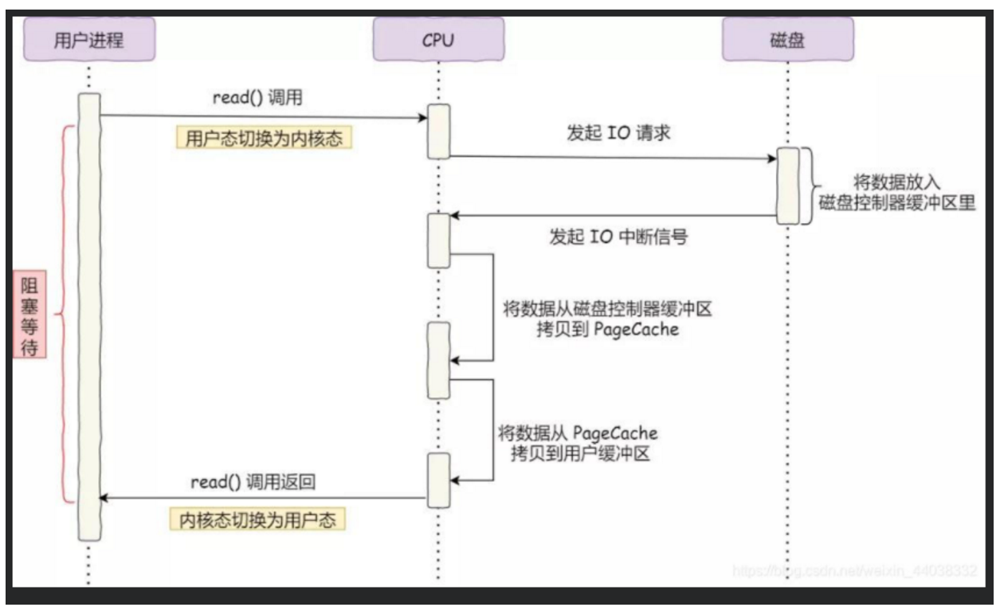
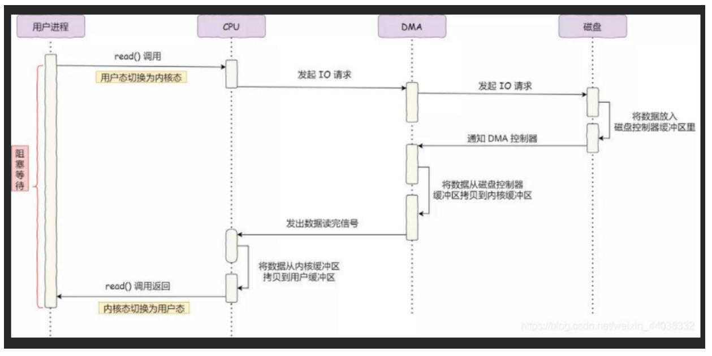
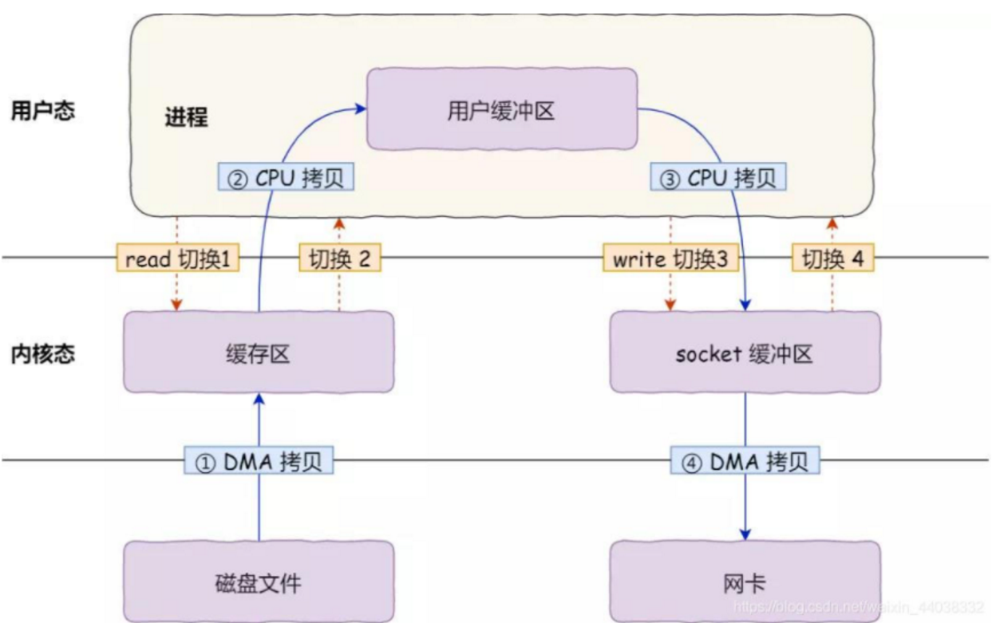
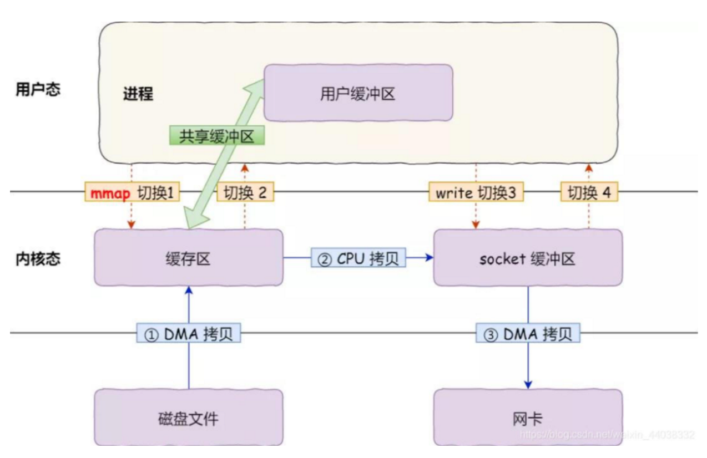
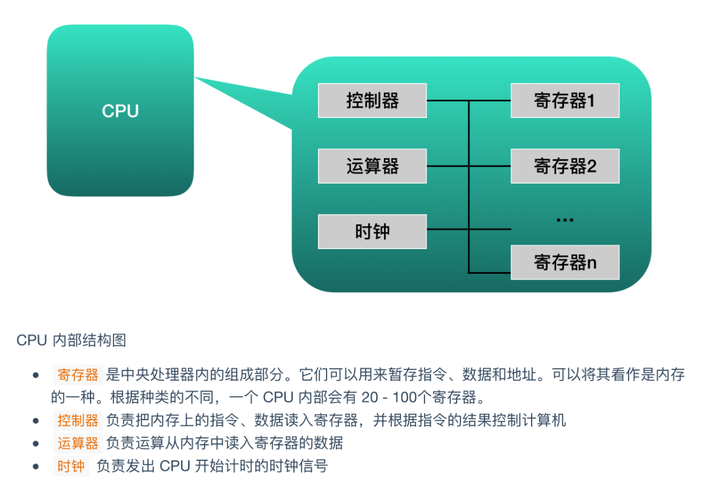
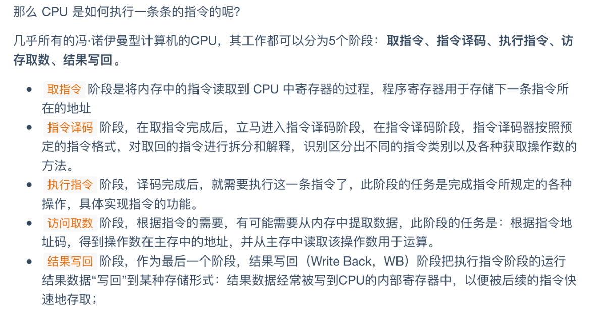
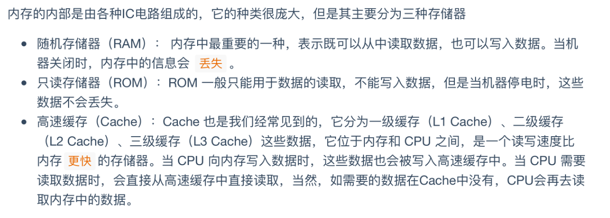
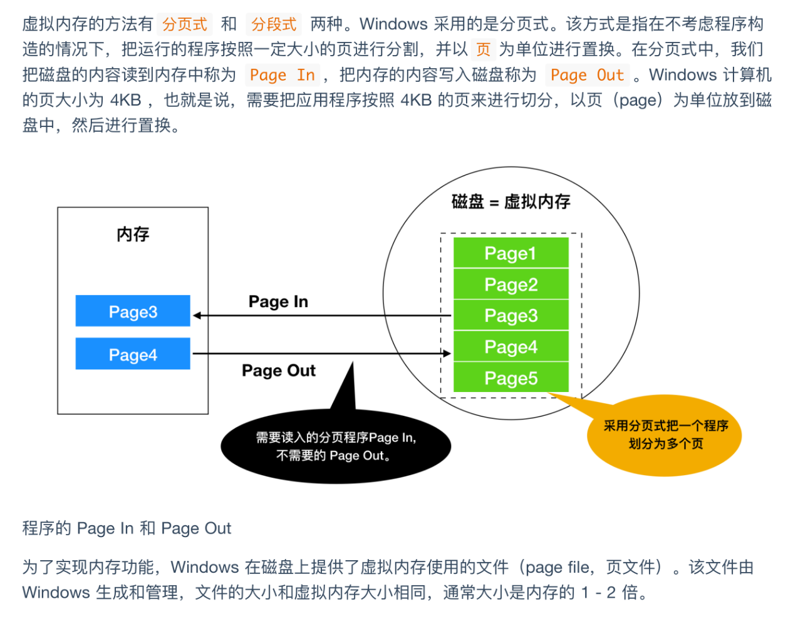

## 一、基础概念

### 1、传统IO原理

### 2、DMA技术（存储器直接访问）

具体过程：

用户进程调用 read 方法，向操作系统发出 I/O 请求，请求读取数据到自己的内存缓冲区中，进程进入阻塞状态；

操作系统收到请求后，进一步将 I/O 请求发送 DMA，然后让 CPU 执行其他任务；

DMA 进一步将 I/O 请求发送给磁盘；

磁盘收到 DMA 的 I/O 请求，把数据从磁盘读取到磁盘控制器的缓冲区中，当磁盘控制器的缓冲区被读满后，向 DMA发起中断信号，告知自己缓冲区已满；

DMA 收到磁盘的信号，将磁盘控制器缓冲区中的数据拷贝到内核缓冲区中，此时不占用 CPU，CPU 可以执行其他任务；

当 DMA 读取了足够多的数据，就会发送中断信号给 CPU；

CPU 收到 DMA 的信号，知道数据已经准备好，于是将数据从内核拷贝到用户空间，系统调用返回；

### 3、传统文件传输

首先，期间共发生了 4 次用户态与内核态的上下文切换，因为发生了两次系统调用，一次是 read() ，一次是 write()，每次系统调用都得先从用户态切换到内核态，等内核完成任务后，再从内核态切换回用户态。

上下文切换到成本并不小，一次切换需要耗时几十纳秒到几微秒，虽然时间看上去很短，但是在高并发的场景下，这类时间容易被累积和放大，从而影响系统的性能。

其次，还发生了 4 次数据拷贝，其中两次是 DMA 的拷贝，另外两次则是通过 CPU 拷贝的，下面说一下这个过程：

第一次拷贝，把磁盘上的数据拷贝到操作系统内核的缓冲区里，这个拷贝的过程是通过 DMA 搬运的。

第二次拷贝，把内核缓冲区的数据拷贝到用户的缓冲区里，于是我们应用程序就可以使用这部分数据了，这个拷贝到过程是由 CPU 完成的。

第三次拷贝，把刚才拷贝到用户的缓冲区里的数据，再拷贝到内核的 socket 的缓冲区里，这个过程依然还是由 CPU 搬运的。

第四次拷贝，把内核的 socket 缓冲区里的数据，拷贝到网卡的缓冲区里，这个过程又是由 DMA 搬运的。

我们回过头看这个文件传输的过程，我们只是搬运一份数据，结果却搬运了 4 次，过多的数据拷贝无疑会消耗 CPU 资源，大大降低了系统性能。

这种简单又传统的文件传输方式，存在冗余的上文切换和数据拷贝，在高并发系统里是非常糟糕的，多了很多不必要的开销，会严重影响系统性能。

**要想提高文件传输的性能，就需要减少「用户态与内核态的上下文切换」和「内存拷贝」的次数。**

### 4、如何实现零拷贝

零拷贝技术实现的方式通常有 2 种：

mmap + write

sendfile

**mmap + write**

mmap() 系统调用函数会直接把内核缓冲区里的数据「映射」到用户空间，这样，操作系统内核与用户空间就不需要再进行任何的数据拷贝操作。

具体过程如下：

应用进程调用了 mmap() 后，DMA 会把磁盘的数据拷贝到内核的缓冲区里。

接着，应用进程跟操作系统内核「共享」这个缓冲区；

应用进程再调用 write()，操作系统直接将内核缓冲区的数据拷贝到 socket 缓冲区中，这一切都发生在内核态，由 CPU来搬运数据；

最后，把内核的 socket 缓冲区里的数据，拷贝到网卡的缓冲区里，这个过程是由 DMA 搬运的。 我们可以得知，通过使用

mmap() 来代替 read()， 可以减少一次数据拷贝的过程。

### 5、CPU内部结构

### 6、CPU指令执行过程

