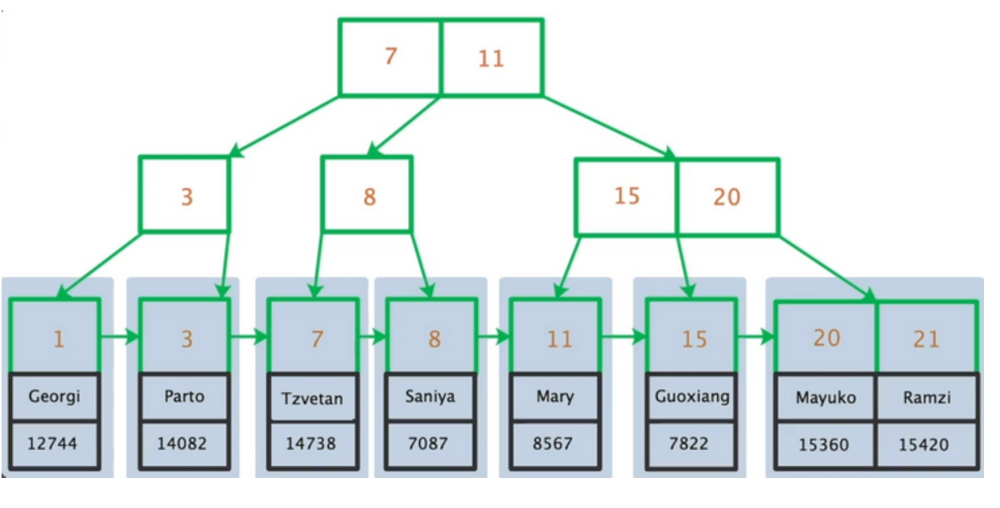
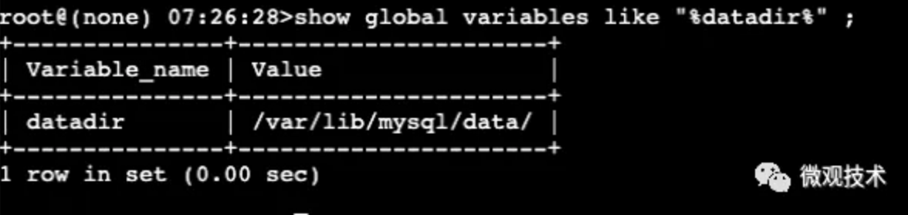
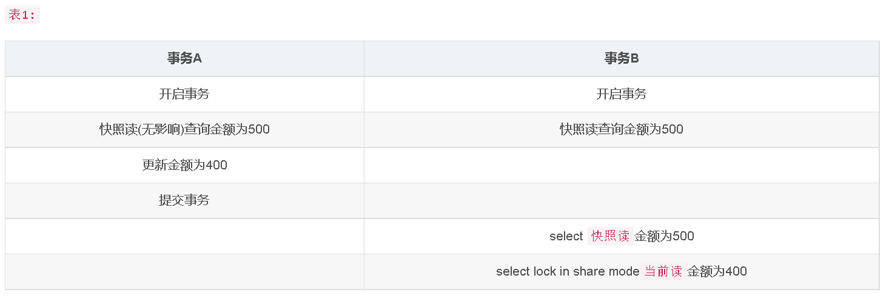

## 一、MySql基础


OLTP是做事务处理，OLAP是做分析处理。从对数据库操作来看，OLTP主要是对数据的增删改，OLAP是对数据的查询。

### 1、数据库基础概念

#### 数据库三大范式是什么？

第一范式：每个列都不可以再拆分。
第二范式：在第一范式的基础上，非主键列完全依赖于主键，而不能是依赖于主
键的一部分。
第三范式：在第二范式的基础上，非主键列只依赖于主键，不依赖于其他非主
键。
在设计数据库结构的时候，要尽量遵守三范式，如果不遵守，必须有足够的理
由。比如性能。事实上我们经常会为了性能而妥协数据库的设计。

#### 数据库类型有哪些？

1、整数类型 ，包括TINYINT、SMALLINT、MEDIUMINT、INT、BIGINT，分别表示1字节、2字节、3字节、4字节、8字节整数。任何整数类型都可以加上UNSIGNED属性，表示数据是无符号的，即非负整数。
长度 ：整数类型可以被指定长度，例如：INT(11)表示长度为11的INT类型。长度在大多数场景是没有意义的，它不会限制值的合法范围，只会影响显示字符的个数，而且需要和UNSIGNED ZEROFILL属性配合使用才有意义。
例子 ，假定类型设定为INT(5)，属性为UNSIGNED ZEROFILL，如果用户插入的数据为12的话，那么数据库实际存储数据为00012。
2、实数类型 ，包括FLOAT、DOUBLE、DECIMAL。
DECIMAL可以用于存储比BIGINT还大的整型，能存储精确的小数。而FLOAT和DOUBLE是有取值范围的，并支持使用标准的浮点进行近似计算。计算时FLOAT和DOUBLE相比DECIMAL效率更高一些，DECIMAL你可以理解成是用字符串进行处理。
3、字符串类型 ，包括VARCHAR、CHAR、TEXT、BLOB
VARCHAR用于存储可变长字符串，它比定长类型更节省空间。
VARCHAR使用额外1或2个字节存储字符串长度。列长度小于255字节时，使用1字节表示，否则使用2字节表示。
VARCHAR存储的内容超出设置的长度时，内容会被截断。
CHAR是定长的，根据定义的字符串长度分配足够的空间。
CHAR会根据需要使用空格进行填充方便比较。
CHAR适合存储很短的字符串，或者所有值都接近同一个长度。
CHAR存储的内容超出设置的长度时，内容同样会被截断。

使用策略：
对于经常变更的数据来说，CHAR比VARCHAR更好，因为CHAR不容易产生碎
片。对于非常短的列，CHAR比VARCHAR在存储空间上更有效率。使用时要注意只分配需要的空间，更长的列排序时会消耗更多内存。尽量避免使用TEXT/BLOB类型，查询时会使用临时表，导致严重的性能开销。

4、枚举类型（ENUM） ，把不重复的数据存储为一个预定义的集合。有时可以使用ENUM代替常用的字符串类型。
ENUM存储非常紧凑，会把列表值压缩到一个或两个字节。ENUM在内部存储时，其实存的是整数。尽量避免使用数字作为ENUM枚举的常量，因为容易混乱。排序是按照内部存储的整数
5、日期和时间类型 ，尽量使用timestamp，空间效率高于datetime，
用整数保存时间戳通常不方便处理。
如果需要存储微妙，可以使用bigint存储。

### 2、MySql语法基础


### 3、常用函数

聚合函数

字符串处理函数

时间函数


### 4、**脏写、脏读、不可重复读、幻读**


脏写，意思是说有两个事务，事务 A 和事务 B 同时在更新一条数据，事务 A 先把它更新为 A 值，事务 B 紧接着就把它更新为 B 值。如图：


可以看到，此时事务 B 是后更新那行数据的值，所以此时那行数据的值是 B。而且此时事务 A 更新之后会记录一条 undo log 日志。因为事务 A 是先更新的，它在更新之前，这行数据的值为 `NULL`。所以此时事务 A 的 undo log 日志大概就是：更新之前这行数据的值为 NULL，主键为 XX

那么此时事务 B 更新完数据的值为 B，此时事务 A 突然回滚了，就会用它的 undo log 日志去回滚。此时事务 A 一回滚，直接就会把那行数据的值更新回 NULL 值。如图：


然后就尴尬了，事务 B 一看，为什么我更新的 B 值没了？就因为你事务 A 反悔了把数据值回滚成 NULL 了，结果我更新的 B 值也不见 了。所以对于事务 B 看到的场景而言，就是自己明明更新了，结果值却没了，**这就是脏写。**

所谓脏写，就是我刚才明明写了一个数据值，结果过了一会却没了。而它的本质就是事务 B 去修改了事务 A 修改过的值，但是此时事务 A 还没提交，所以事务 A 随时会回滚，导致事务 B 修改的值也没了，这就是脏写的定义。

其实总结一句话，**无论是脏写还是脏读，都是因为一个事务去更新或者查询了另外一个还没提交的事务更新过的数据。因为另外一个事务还没提交，所以它随时可能会回滚，那么必然导致你更新的数据就没了，或者你之前查询到的数据就没了，这就是脏写和脏读两种场景。**


1、脏读：事务A读到了事务B未提交的数据。

2、不可重复读：事务A第一次查询得到一行记录row1，事务B提交修改后，事务A第二次查询得到row1，但列内容发生了变化。

3、幻读：事务A第一次查询得到一行记录row1，事务B提交修改后，事务A第二次查询得到两行记录row1和row2。

### 5、**同时有多个事务在进行会怎么样呢?**

多事务的并发进行一般会造成以下几个问题:

- 脏读: A事务读取到了B事务未提交的内容,而B事务后面进行了回滚.
- 不可重复读: 当设置A事务只能读取B事务已经提交的部分,会造成在A事务内的两次查询,结果竟然不一样,因为在此期间B事务进行了提交操作.
- 幻读: A事务读取了一个范围的内容,而同时B事务在此期间插入了一条数据.造成"幻觉".

### **4. 怎么解决这些问题呢?MySQL的事务隔离级别了解吗?**

MySQL的四种隔离级别如下:

- 未提交读(READ UNCOMMITTED)

这就是上面所说的例外情况了,这个隔离级别下,其他事务可以看到本事务没有提交的部分修改.因此会造成脏读的问题(读取到了其他事务未提交的部分,而之后该事务进行了回滚).

这个级别的性能没有足够大的优势,但是又有很多的问题,因此很少使用.

- 已提交读(READ COMMITTED)

其他事务只能读取到本事务已经提交的部分.这个隔离级别有 不可重复读的问题,在同一个事务内的两次读取,拿到的结果竟然不一样,因为另外一个事务对数据进行了修改.

- REPEATABLE READ(可重复读)

可重复读隔离级别解决了上面不可重复读的问题(看名字也知道),但是仍然有一个新问题,就是 幻读,当你读取id> 10 的数据行时,对涉及到的所有行*加上*了读锁,此时例外一个事务新插入了一条id=11的数据,因为是新插入的,所以不会触发上面的锁的排斥,那么进行本事务进行下一次的查询时会发现有一条id=11的数据,而上次的查询操作并没有获取到,再进行插入就会有主键冲突的问题.

- SERIALIZABLE(可串行化)

这是最高的隔离级别,可以解决上面提到的所有问题,因为他强制将所以的操作串行执行,这会导致并发性能极速下降,因此也不是很常用.

### **5. Innodb使用的是哪种隔离级别呢?**

InnoDB默认使用的是可重复读隔离级别.

### 6、**MySQL都有哪些锁呢?像上面那样子进行锁定岂不是有点阻碍并发效率了?**

从锁的类别上来讲,有共享锁和排他锁.

共享锁: 又叫做读锁. 当用户要进行数据的读取时,对数据*加上*共享锁.共享锁可以同时*加上*多个.

共享锁又称读锁，是读取操作创建的锁。其他用户可以并发读取数据，但任何事务都不能对数据进行修改（获取数据上的排他锁），直到已释放所有共享锁。

如果事务`T`对数据`A`加上共享锁后，则其他事务只能对`A`再加共享锁，不能加排他锁。获准共享锁的事务只能读数据，不能修改数据。

**用法**

```
SELECT ... LOCK IN SHARE MODE;
```

在查询语句后面增加`LOCK IN SHARE MODE`，MySQL 就会对查询结果中的每行都加共享锁，当没有其他线程对查询结果集中的任何一行使用排他锁时，可以成功申请共享锁，否则会被阻塞。其他线程也可以读取使用了共享锁的表，而且这些线程读取的是同一个版本的数据。


排他锁: 又叫做写锁. 当用户要进行数据的写入时,对数据*加上*排他锁.排他锁只可以加一个,他和其他的排他锁,共享锁都相斥.

排他锁又称写锁、独占锁，如果事务`T`对数据`A`加上排他锁后，则其他事务不能再对`A`加任何类型的封锁。获准排他锁的事务既能读数据，又能修改数据。

**用法**

```
SELECT ... FOR UPDATE;
```

在查询语句后面增加`FOR UPDATE`，MySQL 就会对查询结果中的每行都加排他锁，当没有其他线程对查询结果集中的任何一行使用排他锁时，可以成功申请排他锁，否则会被阻塞。


用上面的例子来说就是用户的行为有两种,一种是来看房,多个用户一起看房是可以接受的. 一种是真正的入住一晚,在这期间,无论是想入住的还是想看房的都不可以.

锁的粒度取决于具体的存储引擎,InnoDB实现了行级锁,页级锁,表级锁.

他们的加锁开销从*大大*小,并发能力也是从大到小.


### 7、核心概念

#### **1、Buffer Pool**


但是我们在对数据库执行增删改操作的时候，不可能直接更新磁盘上的数据的，因为如果你对磁盘进行随机读写操作，那速度是相当的慢，随便一个大磁盘文件的随机读写操作，可能都要几百毫秒。如果要是那么搞的话，可能你的数据库每秒也就只能处理几百个请求了！ 在对数据库执行增删改操作的时候，实际上主要都是针对内存里的Buffer Pool中的数据进行的，也就是实际上主要是对数据库的内存里的数据结构进行了增删改，如下图所示。


其实每个人都担心一个事，就是你在数据库的内存里执行了一堆增删改的操作，内存数据是更新了，但是这个时候如果数据库突然崩溃了，那么内存里更新好的数据不是都没了吗？ MySQL就怕这个问题，所以引入了一个redo log机制，你在对内存里的数据进行增删改的时候，他同时会把增删改对应的日志写入redo log中，如下图。


万一你的数据库突然崩溃了，没关系，只要从redo log日志文件里读取出来你之前做过哪些增删改操作，瞬间就可以重新把这些增删改操作在你的内存里执行一遍，这就可以恢复出来你之前做过哪些增删改操作了。 当然对于数据更新的过程，他是有一套严密的步骤的，还涉及到undo log、binlog、提交事务、buffer pool脏数据刷回磁盘，等等。

**Buffer Pool的一句话总结**

Buffer Pool是数据库中我们第一个必须要搞清楚的核心组件，因为增删改操作首先就是针对这个内存中的Buffer Pool里的数据执行的，同时配合了后续的redo log、刷磁盘等机制和操作。

所以Buffer Pool就是数据库的一个内存组件，里面缓存了磁盘上的真实数据，然后我们的系统对数据库执行的增删改操作，其实主要就是对这个内存数据结构中的缓存数据执行的。

**Buffer Pool这个内存数据结构到底长个什么样子？**

1、如何配置你的Buffer Pool的大小？

我们应该如何配置你的Buffer Pool到底有多大呢？ 因为Buffer Pool本质其实就是数据库的一个内存组件，你可以理解为他就是一片内存数据结构，所以这个内存数据结构肯定是有一定的大小的，不可能是无限大的。 这个Buffer Pool默认情况下是128MB，还是有一点偏小了，我们实际生产环境下完全可以对Buffer Pool进行调整。 比如我们的数据库如果是16核32G的机器，那么你就可以给Buffer Pool分配个2GB的内存，使用下面的配置就可以了。 [server] innodb_buffer_pool_size = 2147483648 如果你不知道数据库的配置文件在哪里以及如何修改其中的配置，那建议可以先在网上搜索一些MySQL入门的资料去看看，其实这都是最基础和简单的。 我们先来看一下下面的图，里面就画了数据库中的Buffer Pool内存组件


**2、数据页：MySQL中抽象出来的数据单位**

假设现在我们的数据库中一定有一片内存区域是Buffer Pool了，那么我们的数据是如何放在Buffer Pool中的？

我们都知道数据库的核心数据模型就是 **表+字段+行** 的概念，所以大家觉得我们的数据是一行一行的放在Buffer Pool里面的吗？ 这就明显不是了，实际上MySQL对数据抽象出来了一个数据页的概念，他是把很多行数据放在了一个数据页里，也就是说我们的磁盘文件中就是会有很多的数据页，每一页数据里放了很多行数据，如下图所示。


所以实际上假设我们要更新一行数据，此时数据库会找到这行数据所在的数据页，然后从磁盘文件里把这行数据所在的数据页直接给加载到Buffer Pool里去。 也就是说，Buffer Pool中存放的是一个一个的数据页，如下图。


**3、磁盘上的数据页和Buffer Pool中的缓存页是如何对应起来的？**

实际上默认情况下，磁盘中存放的数据页的大小是16KB，也就是说，一页数据包含了16KB的内容。 而Buffer Pool中存放的一个一个的数据页，我们通常叫做缓存页，因为毕竟Buffer Pool是一个缓冲池，里面的数据都是从磁盘缓存到内存去的。 而Buffer Pool中默认情况下，一个缓存页的大小和磁盘上的一个数据页的大小是一一对应起来的，都是16KB。 我们看下图，我给图中的Buffer Pool标注出来了他的内存大小，假设他是128MB吧，然后数据页的大小是16KB。


**4、缓存页对应的描述信息是什么？**

对于每个缓存页，他实际上都会有一个描述信息，这个描述信息大体可以认为是用来描述这个缓存页的。 比如包含如下的一些东西：这个数据页所属的表空间、数据页的编号、这个缓存页在Buffer Pool中的地址以及别的一些杂七杂八的东西。 每个缓存页都会对应一个描述信息，这个描述信息本身也是一块数据，在Buffer Pool中，每个缓存页的描述数据放在最前面，然后各个缓存页放在后面。所以此时我们看下面的图，Buffer Pool实际看起来大概长这个样子 。


而且这里我们要注意一点，Buffer Pool中的描述数据大概相当于缓存页大小的5%左右，也就是每个描述数据大概是800个字节左右的大小，然后假设你设置的buffer pool大小是128MB，实际上Buffer Pool真正的最终大小会超出一些，可能有个130多MB的样子，因为他里面还要存放每个缓存页的描述数据。

思考

对于Buffer Pool而言，他里面会存放很多的缓存页以及对应的描述数据，那么假设Buffer Pool里的内存都用尽了，已经没有足够的剩余内存来存放缓存页和描述数据了，此时Buffer Pool里就一点内存都没有了吗？还是说Buffer Pool里会残留一些内存碎片呢？ 如果你觉得Buffer Pool里会有内存碎片的话，那么你觉得应该怎么做才能尽可能减少Buffer Pool里的内存碎片呢？


#### **2、LRU-List**

MySQL中的缓冲池通过LRU算法来进行管理(最频繁使用的页在LRU列表的前端，而最少使用的页在LRU列表的尾端)。当缓冲池不能存放新读取到的页时，将优先淘汰LRU列表中尾端的页。在InnoDB中，LRU列表中加入了midpoint位置。新读取到的页，虽然是最新访问的页，但并不是直接放入到LRU列表的首部，而是放入到LRU列表的midpoint位置。在默认配置下，该位置在LRU列表长度的5/8处。midpoint之后的列表称为old列表，之前的列表称为new列表。InnoDB存储引擎引入了innodb_old_blocks_time参数，用于表示页读取到mid位置后需要等待多久才会被加入到LRU列表的热端。以此来保证真正的热数据被加入到LRU列表的热端。

MySQL的LRU链表长下面这样：


LRU链表被MidPoint分成了New Sublist和Old Sublist两部分。

其中New Sublist大概占比5/8，Old Sublist占比3/8。

New Sublist存储着young page，而Old Sublist存储着Old Page。

我们可以通过如下的方式查看MidPoint的默认值。


这其实是一种冷热数据分离设计思想。他相对于传统的LRU链表有很大的优势。

**MySQL定制的LRU链表的优势**

而对于MySQL的LRU链表来说，通过MidPoint将链表分成两部分。

从磁盘中新读出的数据会放在Old Sublist的头部。

这样即使你真的使用select * from t;也不会导致New Sublist中的经常被访问的数据页被刷入磁盘中。

正常情况下，访问Old Sublist中的缓存页，那么该缓存页会被提升到New Sublist中成为热数据。

但是当你通过select * from t将一大批数据加载到Old Sublist时，然后在不到1s内你又访问了它，那在这段时间内被访问的缓存页并不会被提升为热数据。这个1s由参数innodb_old_blocks_time控制。

另外：New SubList也是经过优化的，如果你访问的是New SubList的前1/4的数据，它是不会被移动到LRU链表头部去的。


#### **3、Free-List**

LRU列表用来管理已经读取的页，但当数据库刚启动时，LRU列表是空的，即没有任何的页。这时页都存放在Free列表中。当需要从缓冲池中分页时，首先从Free列表中查找是否有可用的空闲页，若有则将该页从Free列表中删除，放入到LRU列表中。否则，根据LRU算法，淘汰LRU列表末尾的页，将该内存空间分配给新的页。当页从LRU列表的old部分加入到new部分时，称此时发生的操作为page made young，而因为innodb_old_blocks_time的设置而导致页没有从old部分移动到new部分的操作称为page not made young。


#### **4、Flush-List**

在LRU列表中的页被修改后，称该页为脏页（dirty page），即缓冲池中的页和磁盘上的页的数据产生了不一致。这时数据库会通过CHECKPOINT机制将脏页刷新回磁盘，而Flush列表中的页即为脏页列表。需要注意的是，脏页既存在于LRU列表中，也存在于Flush列表中。LRU列表用来管理缓冲池中页的可用性，Flush列表用来管理将页刷新回磁盘，二者互不影响。


#### **5、表空间**

在innodb存储引擎中数据是按照表空间来组织存储的，而所谓的表空间其实对应着一个真实存在于物理磁盘上的文件。

默认情况下，MySQL会初始化一个大小为12MB，名为ibdata1文件，并且随着数据的增多，它会自动扩容。

这个ibdata1文件是系统表空间，也是默认的表空间，也是默认的表空间物理文件，也是共享表空间。

想让每一个数据库表都有一个单独的表空间文件的话，可以通过参数innodb_file_per_table设置。

> 这个参数只有在MySQL5.6或者是更高的版本中才可以使用。

可以通过配置文件

```mysql
[mysqld]``innodb_file_per_table=``ON
```


#### **6、数据页**


#### **7、数据区**

在MySQL的设定中，同一个表空间内的一组连续的数据页为一个extent（区），默认区的大小为1MB，页的大小为16KB。16*64=1024，也就是说一个区里面会有64个连续的数据页。连续的256个数据区为一组数据区。


#### **8、数据页分裂**

关于B+Tree，你肯定知道B+Tree中的叶子结点之间是通过双向链表关联起来的。

在InnoDB索引的设定中，要求主键索引是递增的，这样在构建索引树的时候才更加方便。你可以脑补一下。如果按1、2、3...递增的顺序给你这些数。是不是很方便的构建一棵树。然后你可以自由自在的在这棵树上玩二分查找。

那假设你自定义了主键索引，而且你自定义的这个主键索引并不一定是自增的。

那就有可能出现下面这种情况 如下图：


> 假设上图中的id就是你自定义的不会自增的主键

然后随着你将数据写入。就导致后一个数据页中的所有行并不一定比前一个数据页中的行的id大。

这时就会触发页分裂的逻辑。

页分裂的目的就是保证：后一个数据页中的所有行主键值比前一个数据页中主键值大。

经过分裂调整，可以得到下面的这张图。


## 二、索引


## 

### 基本概念

#### 什么是索引？

索引是一种特殊的文件(InnoDB数据表上的索引是表空间的一个组成部分)，它们包含着对数据表里所有记录的引用指针。
索引是一种数据结构。数据库索引，是数据库管理系统中一个排序的数据结构，以协助快速查询、更新数据库表中数据。索引的实现通常使用B树及其变种B+树。
更通俗的说，索引就相当于目录。为了方便查找书中的内容，通过对内容建立索引形成目录。索引是一个文件，它是要占据物理空间的。

#### 索引有哪些优缺点？

**索引的优点**
可以大大加快数据的检索速度，这也是创建索引的最主要的原因。
通过使用索引，可以在查询的过程中，使用优化隐藏器，提高系统的性能。
**索引的缺点**
时间方面：创建索引和维护索引要耗费时间，具体地，当对表中的数据进行增
加、删除和修改的时候，索引也要动态的维护，会降低增/改/删的执行效率；
空间方面：索引需要占物理空间。

#### 索引使用场景（重点）

**1、where**


上图中，根据 id 查询记录，因为 id 字段仅建立了主键索引，因此此SQL执行可选的索引只有主键索引，如果有多个，最终会选一个较优的作为检索的依据。

-- 增加一个没有建立索引的字段alter table innodb1 add sex char(1);-- 按sex检索时可选的索引为null

EXPLAIN  SELECT * from  innodb1  where  sex='男';


可以尝试在一个字段未建立索引时，根据该字段查询的效率，然后对该字段建立索引
（alter table 表名 add index(字段名)），同样的SQL执行的效率，你会发现查询效率会有明显的提升（数据量越大越明显）。

**2、order by**

当我们使用 order by 将查询结果按照某个字段排序时，如果该字段没有建立索引，那么执行计划会将查询出的所有数据使用外部排序（将数据从硬盘分批读取到内存使用内部排序，最后合并排序结果），这个操作是很影响性能的，因为需要将查询涉及到的所有数据从磁盘中读到内存（如果单条数据过大或者数据量过多都会降低效率），更无论读到内存之后的排序了。但是如果我们对该字段建立索引 alter table 表名 add index(字段名) ，那么由于索引本身是有序的，因此直接按照索引的顺序和映射关系逐条取出数据即可。而且如果分页的，那么只用取出索引表某个范围内的索引对应的数据，而不用像上述那取出所有数据进行排序再返回某个范围内的数据。（从磁盘取数据是最影响性能的）。

**3、join**

对join语句匹配关系（on）涉及的字段建立索引能够提高效率。


#### 索引有哪几种类型？

##### 1、**按字段特性分类**

**主键索引:** 数据列不允许重复，不允许为NULL，一个表只能有一个主键。
**唯一索引:** 数据列不允许重复，允许为NULL值，一个表允许多个列创建唯一索引。
可以通过  ALTER TABLE table_name ADD UNIQUE (column);  创建唯一索
引可以通过  ALTER TABLE table_name ADD UNIQUE (column1,column2); 创建唯一组合索引
**普通索引**: 基本的索引类型，没有唯一性的限制，允许为NULL值。
可以通过 ALTER TABLE table_name ADD INDEX index_name (column); 创建普通索引

可以通过 ALTER TABLE table_name ADD INDEX index_name(column1,column2, column3); 创建组合索引
**全文索引**： 是目前搜索引擎使用的一种关键技术。
可以通过ALTER TABLE table_name ADD FULLTEXT (column);创建全文索引

##### **2、按数据结构分类**

**B+tree索引、Hash索引、Full-text索引。**


注：InnoDB实际上也支持Hash索引，但是InnoDB中Hash索引的创建由存储引擎引擎自动优化创建，不能人为干预是否为表创建Hash索引。

**B+tree** 是MySQL中被存储引擎采用最多的索引类型。**B+tree** 中的 B 代表平衡（balance），而不是二叉（binary），因为 **B+tree** 是从最早的平衡二叉树演化而来的。

 **B+tree与Hash的对比**

Hash 索引结构的特殊性，其检索效率非常高，索引的检索可以一次定位，不像B-Tree 索引需要从根节点到枝节点，最后才能访问到页节点这样多次的IO访问，所以 Hash 索引的查询效率要远高于 B-Tree 索引。虽然 Hash 索引效率高，但是 Hash 索引本身由于其特殊性也带来了很多限制和弊端，主要有以下这些。

**Hash 索引仅仅能满足** **=** **,** **IN** **和** **<=>****(表示NULL安全的等价) 查询，不能使用范围查询。**

由于 Hash 索引比较的是进行 Hash 运算之后的 Hash值，所以它只能用于等值的过滤，不能用于基于范围的过滤，因为经过相应的 Hash算法处理之后的 Hash 值的大小关系，并不能保证和Hash运算前完全一样。

**Hash 索引无法适用数据的排序操作。**

由于 Hash 索引中存放的是经过 Hash 计算之后的 Hash值，而且Hash值的大小关系并不一定和 Hash运算前的键值完全一样，所以数据库无法利用索引的数据来避免任何排序运算；

**Hash 索引不能利用部分索引键查询。**

对于组合索引，Hash 索引在计算 Hash 值的时候是组合索引键合并后再一起计算 Hash 值，而不是单独计算 Hash值，所以通过组合索引的前面一个或几个索引键进行查询的时候，Hash 索引也无法被利用。

**Hash 索引依然需要回表扫描。**

Hash 索引是将索引键通过 Hash 运算之后，将 Hash运算结果的 Hash值和所对应的行指针信息存放于一个 Hash 表中，由于不同索引键可能存在相同 Hash 值，所以即使取满足某个 Hash 键值的数据的记录条数，也无法从 Hash索引中直接完成查询，还是要通过访问表中的实际数据进行相应的比较，并得到相应的结果。

**Hash索引遇到大量Hash值相等的情况后性能并不一定就会比B-Tree索引高。**

选择性比较低的索引键，如果创建 Hash 索引，那么将会存在大量记录指针信息存于同一个Hash值相关联。这样要定位某一条记录时就会非常麻烦，会浪费多次表数据的访问，而造成整体性能低下

**由于范围查询是MySQL数据库查询中常见的场景，Hash表不适合做范围查询，它更适合做等值查询。另外Hash表还存在Hash函数选择和Hash值冲突等问题。因此，B+tree索引要比Hash表索引有更广的适用场景。**


**Hash索引和B+tree索引的区别**

​      1、在查询速度上，如果是等值查询，那么Hash索引明显有绝对优势，因为只需要经过一次 Hash 算法即可找到相应的键值，复杂度为O(1)；当然了，这个前提是键值都是唯一的。如果键值不是唯一(或存在Hash冲突)，就需要先找到该键所在位置，然后再根据链表往后扫描，直到找到相应的数据，这时候复杂度会变成O(n)，降低了Hash索引的查找效率。所以，Hash 索引通常不会用到重复值多的列上，比如列为性别、年龄的情况等（当然B+tree索引也不适合这种离散型低的字段上）；

​      2、Hash 索引是无序的，如果是范围查询检索，这时候 Hash 索引就无法起到作用，即使原先是有序的键值，经过 Hash 算法后，也会变成不连续的了。因此

​           ①、Hash 索引只支持等值比较查询、无法索成范围查询检索，B+tree索引的叶子节点形成有序链表，便于范围查询。

​           ②、Hash 索引无法做 like ‘xxx%’ 这样的部分模糊查询，因为需要对 完整 key 做 Hash 计算，定位bucket。而 B+tree 索引具有最左前缀匹配，可以进行部分模糊查询。

​           ③、Hash索引中存放的是经过Hash计算之后的Hash值，而且Hash值的大小关系并不一定和Hash运算前的键值完全一样，所以数据库无法利用索引的数据来避免任何排序运算。B+tree 索引的叶子节点形成有序链表，可用于排序。

​      3、Hash 索引不支持多列联合索引，对于联合索引来说，Hash 索引在计算 Hash 值的时候是将索引键合并后再一起计算 Hash 值，不会针对每个索引单独计算 Hash 值。因此如果用到联合索引的一个或者几个索引时，联合索引无法被利用；

​      4、因为存在哈希碰撞问题，在有大量重复键值情况下，哈希索引的效率极低。B+tree 所有查询都要找到叶子节点，性能稳定；

场景区分

​      1、大多数场景下，都会有组合查询，范围查询、排序、分组、模糊查询等查询特征，Hash 索引无法满足要求，建议数据库使用B+树索引。

​      2、在离散型高，数据基数大，且等值查询时候，Hash索引有优势。


##### **3、按物理存储分类**

MySQL索引按叶子节点存储的是否为完整表数据分为：**聚簇索引、二级索引（辅助索引）**。全表数据存储在聚簇索引中，聚簇索引以外的其他索引叫做二级索引，也叫辅助索引。

**1. 聚簇索引**

聚簇索引的每个叶子节点存储了一行完整的表数据，叶子节点间按id列递增连接，可以方便地进行顺序检索。



InnoDB表要求必须有聚簇索引，默认在主键字段上建立聚簇索引，在没有主键字段的情况下，表的第一个非空的唯一索引将被建立为聚簇索引，在前两者都没有的情况下，InnoDB将自动生成一个隐式的自增id列，并在此列上建立聚簇索引。

**以MyISAM为存储引擎的表不存在聚簇索引。**

MyISAM表中的主键索引和非主键索引的结构是一样的，索引的叶子节点不存储表数据，存放的是表数据的地址。所以，MyISAM表可以没有主键。


MyISAM表的数据和索引是分开存储的。MyISAM表的主键索引和非主键索引的区别仅在于主键索引的B+tree上的key必须符合主键的限制，非主键索引B+tree上的key只要符合相应字段的特性就可以了。

**二级索引**

二级索引的叶子节点并不存储一行完整的表数据，而是存储了聚簇索引所在列的值。


**回表查询**

由于二级索引的叶子节点不存储完整的表数据，索引当通过二级索引查询到聚簇索引列值后，还需要回到聚簇索引也就是表数据本身进一步获取数据。


回表查询 需要额外的 **B+tree** 搜索过程，必然增大查询耗时。

需要注意的是，**通过二级索引查询时，回表不是必须的过程**，当**SELECT的所有字段在单个二级索引中都能够找到**时，就不需要回表，MySQL称此时的二级索引为**覆盖索引**或触发了**索引覆盖**。

可以用Explain命令查看SQL语句的执行计划，执行计划的Extra字段中若出现**Using index**，表示查询触发了**索引覆盖**。

#### **B+树与跳表区别**

**跳跃表：**跳跃表查询、插入、删除有log(n)的复杂的，由于其结构相比红黑树简单，所以插入删除的效率较高，但是查询略逊于红黑树，跳跃表的空间代价较大。

skiplist，顾名思义，首先它是一个list。实际上，它是在有序链表的基础上发展起来的。

我们先来看一个有序链表，如下图(最左侧的灰色节点表示一个空的头结点)：


在这样一个链表中，如果我们要查找某个数据，那么需要从头开始逐个进行比较，直到找到包含数据的那个节点，或者找到第一个比给定数据大的节点为止(没找到)。也就是说，时间复杂度为O(n)。同样，当我们要插入新数据的时候，也要经历同样的查找过程，从而确定插入位置。

假如我们(除了指向下一个节点的指针)每相邻两个节点增加一个指针，让指针指向下下个节点，如下图：


这样所有新增加的指针连成了一个新的链表，但它包含的节点个数只有原来的一半(上图中是7, 19, 26)。现在当我们想查找数据的时候，可以先沿着这个新链表进行查找。当碰到比待查数据大的节点时，再回到原来的链表中进行查找。比如，我们想查找23，查找的路径是沿着下图中标红的指针所指向的方向进行的：


- 23首先和7比较，再和19比较，比它们都大，继续向后比较。
- 但23和26比较的时候，比26要小，因此回到下面的链表(原链表)，与22比较。
- 23比22要大，沿下面的指针继续向后和26比较。23比26小，说明待查数据23在原链表中不存在，而且它的插入位置应该在22和26之间。

在这个查找过程中，由于新增加的指针，我们不再需要与链表中每个节点逐个进行比较了。需要比较的节点数大概只有原来的一半。

利用同样的方式，我们可以在上层新产生的链表上，继续为每相邻的两个节点增加一个指针，从而产生第三层链表。如下图：


在这个新的三层链表结构上，如果我们还是查找23，那么沿着最上层链表首先要比较的是19，发现23比19大，接下来我们就知道只需要到19的后面去继续查找，从而一下子跳过了19前面的所有节点。可以想象，当链表足够长的时候，这种多层链表的查找方式能让我们跳过很多下层节点，大大加快查找的速度。


#### B树和B+树的区别

- 在B树中，你可以将键和值存放在内部节点和叶子节点；但在B+树
  中，内部节点都是键，没有值，叶子节点同时存放键和值。
- B+树的叶子节点有一条链相连，而B树的叶子节点各自独立。


**使用B树的好处**
B树可以在内部节点同时存储键和值，因此，把频繁访问的数据放在靠近根节点的地方将会大大提高热点数据的查询效率。这种特性使得B树在特定数据重复多次查询的场景中更加高效。
**使用B+树的好处**
由于B+树的内部节点只存放键，不存放值，因此，一次读取，可以在内存页中获取更多的键，有利于更快地缩小查找范围。 B+树的叶节点由一条链相连，因此，当需要进行一次全数据遍历的时候，B+树只需要使用O(logN)时间找到最
小的一个节点，然后通过链进行O(N)的顺序遍历即可。而B树则需要对树的每一层进行遍历，这会需要更多的内存置换次数，因此也就需要花费更多的时间。

#### 数据库为什么使用B+树而不是B树

- B树只适合随机检索，而B+树同时支持随机检索和顺序检索；
- B+树空间利用率更高，可减少I/O次数，磁盘读写代价更低。一般来说，索引本身也很大，不可能全部存储在内存中，因此索引往往以索引文件的形式存储的磁盘上。这样的话，索引查找过程中就要产生磁盘I/O消耗。B+树的内部结点并没有指向关键字具体信息的指针，只是作为索引使用，其内部结点比B树小，盘块能容纳的结点中关键字数量更多，一次性读入内存中可以查找的关键字也就越多，相对的，IO读写次数也就降低了。而IO读写次数是影响索引检索效率的最大因素；
- B+树的查询效率更加稳定。B树搜索有可能会在非叶子结点结束，越靠近根节点的记录查找时间越短，只要找到关键字即可确定记录的存在，其性能等价于在关键字全集内做一次二分查找。而在B+树中，顺序检索比较明显，随机检索时，任何关键字的查找都必须走一条从根节点到叶节点的路，所有关键字的查找路径长度相同，导致每一个关键字的查询效率相当。
- B-树在提高了磁盘IO性能的同时并没有解决元素遍历的效率低下的问题。B+树的叶子节点使用指针顺序连接在一起，只要遍历叶子节点就可以实现整棵树的遍历。而且在数据库中基于范围的查询是非常频繁的，而B树不支持这样的操作。
- 增删文件（节点）时，效率更高。因为B+树的叶子节点包含所有关键字，并以有序的链表结构存储，这样可很好提高增删效率。

#### B+树在满足聚簇索引和覆盖索引的时候不需要回表查询数据

在B+树的索引中，叶子节点可能存储了当前的key值，也可能存储了当前的key值以及整行的数据，这就是聚簇索引和非聚簇索引。 在InnoDB中，只有主键索引是聚簇索引，如果没有主键，则挑选一个唯一键建立聚簇索引。如果没有唯一
键，则隐式的生成一个键来建立聚簇索引。当查询使用聚簇索引时，在对应的叶子节点，可以获取到整行数据，因此不用再次进行回表查询。

#### 什么是聚簇索引？何时使用聚簇索引与非聚簇索引

聚簇索引：将数据存储与索引放到了一块，找到索引也就找到了数据
非聚簇索引：将数据存储于索引分开结构，索引结构的叶子节点指向了数据的对应行，myisam通过key_buffer把索引先缓存到内存中，当需要访问数据时（通过索引访问数据），在内存中直接搜索索引，然后通过索引找到磁盘相应数据，这也就是为什么索引不在key buffer命中时，速度慢的原因

澄清一个概念：innodb中，在聚簇索引之上创建的索引称之为辅助索引，辅助索引访问数据总是需要二次查找，非聚簇索引都是辅助索引，像复合索引、前缀索引、唯一索引，辅助索引叶子节点存储的不再是行的物理位置，而是主键值

何时使用聚簇索引与非聚簇索引。


#### 非聚簇索引一定会回表查询吗？

不一定，这涉及到查询语句所要求的字段是否全部命中了索引，如果全部命中了
索引，那么就不必再进行回表查询。
举个简单的例子，假设我们在员工表的年龄上建立了索引，那么当进行 select age from employee where age < 20 的查询时，在索引的叶子节点上，已经包含了age信息，不会再次进行回表查询。

#### 联合索引是什么？为什么需要注意联合索引中的顺序？

MySQL可以使用多个字段同时建立一个索引，叫做联合索引。在联合索引中，如果想要命中索引，需要按照建立索引时的字段顺序挨个使用，否则无法命中索引。
具体原因为:
MySQL使用索引时需要索引有序，假设现在建立了"name，age，school"的联合索引，那么索引的排序为: 先按照name排序，如果name相同，则按照age排序，如果age的值也相等，则按照school进行排序。当进行查询时，此时索引仅仅按照name严格有序，因此必须首先使用name字段进行等值查询，之后对于匹配到的列而言，其按照age字段严格有序，此时可以使用age字段用做索引查找，以此类推。因此在建立联合索引的时候应该注意索引列的顺序，一般情况下，将查询需求频繁或者字段选择性高的列放在前面。此外可以根据特例的查询或者表结构进行单独的调整。

#### 索引算法有哪些？

索引算法有 BTree算法和Hash算法。

**BTree算法**
BTree是最常用的mysql数据库索引算法，也是mysql默认的算法。因为它不仅可以被用在=,>,>=,<,<=和between这些比较操作符上，而且还可以用于like操作符，只要它的查询条件是一个不以通配符开头的常量， 例如：
-- 只要它的查询条件是一个不以通配符开头的常量

select * from user where name  like'jack%';

-- 如果一通配符开头，或者没有使用常量，则不会使用索引，例如：
select * from  user  where name like  '%jack';

**Hash算法**
Hash Hash索引只能用于对等比较，例如=,<=>（相当于=）操作符。由于是一
次定位数据，不像BTree索引需要从根节点到枝节点，最后才能访问到页节点这
样多次IO访问，所以检索效率远高于BTree索引。

#### 索引设计的原则？

1. 适合索引的列是出现在where子句中的列，或者连接子句中指定的列
2. 基数较小的类，索引效果较差，没有必要在此列建立索引
3. 使用短索引，如果对长字符串列进行索引，应该指定一个前缀长度，这
样能够节省大量索引空间
4. 不要过度索引。索引需要额外的磁盘空间，并降低写操作的性能。在修
改表内容的时候，索引会进行更新甚至重构，索引列越多，这个时间就会
越长。所以只保持需要的索引有利于查询即可。

#### 创建索引的原则

索引虽好，但也不是无限制的使用，最好符合一下几个原则
1） 最左前缀匹配原则，组合索引非常重要的原则，mysql会一直向右匹配直到
遇到范围查询(>、<、between、like)就停止匹配，比如a = 1 and b = 2 and
c > 3 and d = 4 如果建立(a,b,c,d)顺序的索引，d是用不到索引的，如果建立
(a,b,d,c)的索引则都可以用到，a,b,d的顺序可以任意调整。
2）较频繁作为查询条件的字段才去创建索引
3）更新频繁字段不适合创建索引
4）若是不能有效区分数据的列不适合做索引列(如性别，男女未知，最多也就三
种，区分度实在太低)
5）尽量的扩展索引，不要新建索引。比如表中已经有a的索引，现在要加(a,b)
的索引，那么只需要修改原来的索引即可。
6）定义有外键的数据列一定要建立索引。
7）对于那些查询中很少涉及的列，重复值比较多的列不要建立索引。
8）对于定义为text、image和bit的数据类型的列不要建立索引。


#### 创建索引的三种方式

第一种方式：在执行CREATE TABLE时创建索引

```sql
CREATE TABLE user_index2 ( 
    id INT auto_increment PRIMARY KEY,  
    first_name VARCHAR(16), 
    last_name VARCHAR(16),  
    id_card VARCHAR(18),  
    information text,
    KEY name (first_name, last_name), 
    FULLTEXT KEY(information),
    UNIQUE KEY(id_card)
);
```

第二种方式：使用ALTER TABLE命令去增加索引

```sql
ALTER TABLE table_name ADDINDEX index_name (column_list);
```

ALTER TABLE用来创建普通索引、UNIQUE索引或PRIMARY KEY索引。
其中table_name是要增加索引的表名，column_list指出对哪些列进行索引，多列时各列之间用逗号分隔。
索引名index_name可自己命名，缺省时，MySQL将根据第一个索引列赋一个名称。另外，ALTER TABLE允许在单个语句中更改多个表，因此可以在同时创建多个索引。

第三种方式：使用CREATE INDEX命令创建

```sql
CREATE INDEX index_name ON table_name (column_list);
```

#### 使用索引查询一定能提高查询的性能吗？为什么

通常，通过索引查询数据比全表扫描要快。但是我们也必须注意到它的代价。
索引需要空间来存储，也需要定期维护， 每当有记录在表中增减或索引列被修改时，索引本身也会被修改。 这意味着每条记录的INSERT，DELETE，UPDATE将为此多付出4，5 次的磁盘I/O。 因为索引需要额外的存储空间和处理，那些不必要的索引反而会使查询反应时间变慢。使用索引查询不一定能提高查询性能，索引范围查询(INDEX RANGE SCAN)适用于两种情况:
基于一个范围的检索，一般查询返回结果集小于表中记录数的30%。
基于非唯一性索引的检索。

#### 百万级别或以上的数据如何删除

关于索引：由于索引需要额外的维护成本，因为索引文件是单独存在的文件,所
以当我们对数据的增加,修改,删除,都会产生额外的对索引文件的操作,这些操作需
要消耗额外的IO,会降低增/改/删的执行效率。所以，在我们删除数据库百万级
别数据的时候，**查询MySQL官方手册得知删除数据的速度和创建的索引数量是**
**成正比的。**

1. 所以我们想要删除百万数据的时候可以先删除索引（此时大概耗时三分
多钟）
2. 然后删除其中无用数据（此过程需要不到两分钟）
3. 删除完成后重新创建索引(此时数据较少了)创建索引也非常快，约十分
钟左右。
4. 与之前的直接删除绝对是要快速很多，更别说万一删除中断,一切删除会
回滚。那更是坑了。


## 三、事务

这个也是必问的，先从ACID说，然后用undolog ...保证的，然后隔离级别和出现的现象。然后再说隔离级别的底层，也就是mysql的锁，表锁行锁间隙锁，再到MVCC

重点：这里那几个隔离级别比较绕，要仔细看下，还有实际应用场景，否则很容易被问住


## 四、存储引擎

### 基本概念

#### 常用的存储引擎有以下：

- Innodb引擎 ：Innodb引擎提供了对数据库ACID事务的支持。并且还提供了行级锁和外键的约束。它的设计的目标就是处理大数据容量的数据库系统。
- MyIASM引擎 (原本Mysql的默认引擎)：不提供事务的支持，也不支持行级锁和外键。
- MEMORY引擎 ：所有的数据都在内存中，数据的处理速度快，但是安全性不高。

#### MyISAM索引与InnoDB索引的区别？

InnoDB索引是聚簇索引，MyISAM索引是非聚簇索引。
InnoDB的主键索引的叶子节点存储着行数据，因此主键索引非常高效。
MyISAM索引的叶子节点存储的是行数据地址，需要再寻址一次才能得到数据。
InnoDB非主键索引的叶子节点存储的是主键和其他带索引的列数据，因此查询
时做到覆盖索引会非常高效。

### InnoDB


### Myisam


## 五、MySql日志

### **1、redo log**

### 2、binlog

#### MySQL的binlog有有几种录入格式？分别有什么区别？

有三种格式，statement，row和mixed。

- statement模式下，每一条会修改数据的sql都会记录在binlog中。不需要记录每一行的变化，减少了binlog日志量，节约了IO，提高性能。由于sql的执行是有上下文的，因此在保存的时候需要保存相关的信息，同时还有一些使用了函数之类的语句无法被记录复制。
- row级别下，不记录sql语句上下文相关信息，仅保存哪条记录被修改。记录单元为每一行的改动，基本是可以全部记下来但是由于很多操作，会导致大量行的改动(比如alter table)，因此这种模式的文件保存的信息太多，日志量太大。
- mixed，一种折中的方案，普通操作使用statement记录，当无法使用statement的时候使用row。
  此外，新版的MySQL中对row级别也做了一些优化，当表结构发生变化的时候，会记录语句而不是逐行记录。

### 3、undo 	log


## 六、MySql锁机制


## 七、MySql调优


## 七、MySql主从


## 八、分表分库


## 九、常见面试题

如何快速插入1000w数据，怎么插入最快

select是怎么执行的

mysql死锁是怎么产生的，怎么排查


### 1、MySQL 的逻辑架构了解吗？

第一层是服务器层，主要提供连接处理、授权认证、安全等功能。

第二层实现了 MySQL 核心服务功能，包括查询解析、分析、优化、缓存以及日期和时间等所有内置函数，所有跨存储引擎的功能都在这一层实现，例如存储过程、触发器、视图等。

第三层是存储引擎层，存储引擎负责 MySQL 中数据的存储和提取。服务器通过 API 与存储引擎通信，这些接口屏蔽了不同存储引擎的差异，使得差异对上层查询过程透明。除了会解析外键定义的 InnoDB 外，存储引擎不会解析 SQL，不同存储引擎之间也不会相互通信，只是简单响应上层服务器请求。

### 2、谈一谈 MySQL 的读写锁

在处理并发读或写时，可以通过实现一个由两种类型组成的锁系统来解决问题。这两种类型的锁通常被称为共享锁和排它锁，也叫读锁和写锁。读锁是共享的，相互不阻塞，多个客户在同一时刻可以同时读取同一个资源而不相互干扰。写锁则是排他的，也就是说一个写锁会阻塞其他的写锁和读锁，确保在给定时间内只有一个用户能执行写入并防止其他用户读取正在写入的同一资源。

在实际的数据库系统中，每时每刻都在发生锁定，当某个用户在修改某一部分数据时，MySQL 会通过锁定防止其他用户读取同一数据。写锁比读锁有更高的优先级，一个写锁请求可能会被插入到读锁队列的前面，但是读锁不能插入到写锁前面。

### 3、MySQL 的锁策略有什么？

**表锁**是MySQL中最基本的锁策略，并且是开销最小的策略。表锁会锁定整张表，一个用户在对表进行写操作前需要先获得写锁，这会阻塞其他用户对该表的所有读写操作。只有没有写锁时，其他读取的用户才能获取读锁，读锁之间不相互阻塞。

**行锁**可以最大程度地支持并发，同时也带来了最大开销。InnoDB 和 XtraDB 以及一些其他存储引擎实现了行锁。行锁只在存储引擎层实现，而服务器层没有实现。

### 4、数据库死锁如何解决？

死锁是指多个事务在同一资源上相互占用并请求锁定对方占用的资源而导致恶性循环的现象。当多个事务试图以不同顺序锁定资源时就可能会产生死锁，多个事务同时锁定同一个资源时也会产生死锁。

为了解决死锁问题，数据库系统实现了各种死锁检测和死锁超时机制。越复杂的系统，例如InnoDB 存储引擎，越能检测到死锁的循环依赖，并立即返回一个错误。这种解决方式很有效，否则死锁会导致出现非常慢的查询。还有一种解决方法，就是当查询的时间达到锁等待超时的设定后放弃锁请求，这种方式通常来说不太好。InnoDB 目前处理死锁的方法是将持有最少行级排它锁的事务进行回滚。

死锁发生之后，只有部分或者完全回滚其中一个事务，才能打破死锁。对于事务型系统这是无法避免的，所以应用程序在设计时必须考虑如何处理死锁。大多数情况下只需要重新执行因死锁回滚的事务即可。

### 5、事务是什么?

事务是一组原子性的 SQL 查询，或者说一个独立的工作单元。如果数据库引擎能够成功地对数据库应用该组查询的全部语句，那么就执行该组查询。如果其中有任何一条语句因为崩溃或其他原因无法执行，那么所有的语句都不会执行。也就是说事务内的语句要么全部执行成功，要么全部执行失败。

### 6、事务有什么特性？

**原子性 atomicity**

一个事务在逻辑上是必须不可分割的最小工作单元，整个事务中的所有操作要么全部提交成功，要么全部失败回滚，对于一个事务来说不可能只执行其中的一部分。

**一致性 consistency**

数据库总是从一个一致性的状态转换到另一个一致性的状态。

**隔离性 isolation**

针对并发事务而言，隔离性就是要隔离并发运行的多个事务之间的相互影响，一般来说一个事务所做的修改在最终提交以前，对其他事务是不可见的。

**持久性 durability**

一旦事务提交成功，其修改就会永久保存到数据库中，此时即使系统崩溃，修改的数据也不会丢失。


### 7、MySQL 的隔离级别有哪些？

**未提交读 READ UNCOMMITTED**

在该级别事务中的修改即使没有被提交，对其他事务也是可见的。事务可以读取其他事务修改完但未提交的数据，这种问题称为脏读。这个级别还会导致不可重复读和幻读，性能没有比其他级别好很多，很少使用。

**提交读 READ COMMITTED**

多数数据库系统默认的隔离级别。提交读满足了隔离性的简单定义：一个事务开始时只能"看见"已经提交的事务所做的修改。换句话说，一个事务从开始直到提交之前的任何修改对其他事务都是不可见的。也叫不可重复读，因为两次执行同样的查询可能会得到不同结果。

**可重复读 REPEATABLE READ**（MySQL默认的隔离级别）

可重复读解决了不可重复读的问题，保证了在同一个事务中多次读取同样的记录结果一致。但还是无法解决幻读，所谓幻读指的是当某个事务在读取某个范围内的记录时，会产生幻行。InnoDB 存储引擎通过多版本并发控制MVCC 解决幻读的问题。

**可串行化 SERIALIZABLE**

最高的隔离级别，通过强制事务串行执行，避免幻读。可串行化会在读取的每一行数据上都加锁，可能导致大量的超时和锁争用的问题。实际应用中很少用到这个隔离级别，只有非常需要确保数据一致性且可以接受没有并发的情况下才考虑该级别。

### 8、MVCC 是什么？

MVCC 是多版本并发控制，在很多情况下避免加锁，大都实现了非阻塞的读操作，写操作也只锁定必要的行。

InnoDB 的MVCC 通过在每行记录后面保存两个隐藏的列来实现，这两个列一个保存了行的创建时间，一个保存行的过期时间间。不过存储的不是实际的时间值而是系统版本号，每开始一个新的事务系统版本号都会自动递增，事务开始时刻的系统版本号会作为事务的版本号，用来和查询到的每行记录的版本号进行比较。

MVCC 只能在 `READ COMMITTED` 和 `REPEATABLE READ` 两个隔离级别下工作，因为 `READ UNCOMMITTED` 总是读取最新的数据行，而不是符合当前事务版本的数据行，而 `SERIALIZABLE` 则会对所有读取的行都加锁。

### 9、谈一谈 InnoDB

InnoDB 是 MySQL 的默认事务型引擎，用来处理大量短期事务。InnoDB 的性能和自动崩溃恢复特性使得它在非事务型存储需求中也很流行，除非有特别原因否则应该优先考虑 InnoDB。

InnoDB 的数据存储在表空间中，表空间由一系列数据文件组成。MySQL4.1 后 InnoDB 可以将每个表的数据和索引放在单独的文件中。

InnoDB 采用 MVCC 来支持高并发，并且实现了四个标准的隔离级别。其默认级别是 `REPEATABLE READ`，并通过间隙锁策略防止幻读，间隙锁使 InnoDB 不仅仅锁定查询涉及的行，还会对索引中的间隙进行锁定防止幻行的插入。

InnoDB 表是基于聚簇索引建立的，InnoDB 的索引结构和其他存储引擎有很大不同，聚簇索引对主键查询有很高的性能，不过它的二级索引中必须包含主键列，所以如果主键很大的话其他所有索引都会很大，因此如果表上索引较多的话主键应当尽可能小。

InnoDB 的存储格式是平***立的，可以将数据和索引文件从一个平台复制到另一个平台。

InnoDB 内部做了很多优化，包括从磁盘读取数据时采用的可预测性预读，能够自动在内存中创建加速读操作的自适应哈希索引，以及能够加速插入操作的插入缓冲区等。

### 10、谈一谈 MyISAM

MySQL5.1及之前，MyISAM 是默认存储引擎，MyISAM 提供了大量的特性，包括全文索引、压缩、空间函数等，但不支持事务和行锁，最大的缺陷就是崩溃后无法安全恢复。对于只读的数据或者表比较小、可以忍受修复操作的情况仍然可以使用 MyISAM。

MyISAM 将表存储在数据文件和索引文件中，分别以 `.MYD` 和 `.MYI` 作为扩展名。MyISAM 表可以包含动态或者静态行，MySQL 会根据表的定义决定行格式。MyISAM 表可以存储的行记录数一般受限于可用磁盘空间或者操作系统中单个文件的最大尺寸。

MyISAM 对整张表进行加锁，读取时会对需要读到的所有表加共享锁，写入时则对表加排它锁。但是在表有读取查询的同时，也支持并发往表中插入新的记录。

对于MyISAM 表，MySQL 可以手动或自动执行检查和修复操作，这里的修复和事务恢复以及崩溃恢复的概念不同。执行表的修复可能导致一些数据丢失，而且修复操作很慢。

对于 MyISAM 表，即使是 BLOB 和 TEXT 等长字段，也可以基于其前 500 个字符创建索引。MyISAM 也支持全文索引，这是一种基于分词创建的索引，可以支持复杂的查询。

MyISAM 设计简单，数据以紧密格式存储，所以在某些场景下性能很好。MyISAM 最典型的性能问题还是表锁问题，如果所有的查询长期处于 Locked 状态，那么原因毫无疑问就是表锁。

### 11、查询执行流程是什么？

简单来说分为五步：① 客户端发送一条查询给服务器。② 服务器先检查查询缓存，如果命中了缓存则立刻返回存储在缓存中的结果，否则进入下一阶段。③ 服务器端进行 SQL 解析、预处理，再由优化器生成对应的执行计划。④ MySQL 根据优化器生成的执行计划，调用存储引擎的 API 来执行查询。⑤ 将结果返回给客户端。

### 12、VARCHAR 和 CHAR 的区别？

**VARCHAR** 用于存储可变字符串，是最常见的字符串数据类型。它比 CHAR 更节省空间，因为它仅使用必要的空间。VARCHAR 需要 1 或 2 个额外字节记录字符串长度，如果列的最大长度不大于 255 字节则只需要 1 字节。VARCHAR 不会删除末尾空格。

VARCHAR 适用场景：字符串列的最大长度比平均长度大很多、列的更新很少、使用了 UTF8 这种复杂字符集，每个字符都使用不同的字节数存储。

**CHAR** 是定长的，根据定义的字符串长度分配足够的空间。CHAR 会删除末尾空格。

CHAR 适合存储很短的字符串，或所有值都接近同一个长度，例如存储密码的 MD5 值。对于经常变更的数据，CHAR 也比 VARCHAR更好，因为定长的 CHAR 不容易产生碎片。对于非常短的列，CHAR 在存储空间上也更有效率，例如用 CHAR 来存储只有 Y 和 N 的值只需要一个字节，但是 VARCHAR 需要两个字节，因为还有一个记录长度的额外字节。

### 13、DATETIME 和 TIMESTAMP 的区别？

**DATETIME** 能保存大范围的值，从 1001~9999 年，精度为秒。把日期和时间封装到了一个整数中，与时区无关，使用 8 字节存储空间。

**TIMESTAMP** 和 UNIX 时间戳相同，只使用 4 字节的存储空间，范围比 DATETIME 小得多，只能表示 1970 ~2038 年，并且依赖于时区。

### 14、数据类型有哪些优化策略？

**更小的通常更好**

一般情况下尽量使用可以正确存储数据的最小数据类型，更小的数据类型通常也更快，因为它们占用更少的磁盘、内存和 CPU 缓存。

**尽可能简单**

简单数据类型的操作通常需要更少的 CPU 周期，例如整数比字符操作代价更低，因为字符集和校对规则使字符相比整形更复杂。应该使用 MySQL 的内建类型 date、time 和 datetime 而不是字符串来存储日期和时间，另一点是应该使用整形存储 IP 地址。

**尽量避免 NULL**

通常情况下最好指定列为 NOT NULL，除非需要存储 NULL值。因为如果查询中包含可为 NULL 的列对 MySQL 来说更难优化，可为 NULL 的列使索引、索引统计和值比较都更复杂，并且会使用更多存储空间。当可为 NULL 的列被索引时，每个索引记录需要一个额外字节，在MyISAM 中还可能导致固定大小的索引变成可变大小的索引。

如果计划在列上建索引，就应该尽量避免设计成可为 NULL 的列。

### 15、索引有什么作用？

索引也叫键，是存储引擎用于快速找到记录的一种数据结构。索引对于良好的性能很关键，尤其是当表中数据量越来越大时，索引对性能的影响愈发重要。在数据量较小且负载较低时，不恰当的索引对性能的影响可能还不明显，但数据量逐渐增大时，性能会急剧下降。

索引大大减少了服务器需要扫描的数据量、可以帮助服务器避免排序和临时表、可以将随机 IO 变成顺序 IO。但索引并不总是最好的工具，对于非常小的表，大部分情况下会采用全表扫描。对于中到大型的表，索引就非常有效。但对于特大型的表，建立和使用索引的代价也随之增长，这种情况下应该使用分区技术。

在MySQL中，首先在索引中找到对应的值，然后根据匹配的索引记录找到对应的数据行。索引可以包括一个或多个列的值，如果索引包含多个列，那么列的顺序也十分重要，因为 MySQL 只能使用索引的最左前缀。

### 16、谈一谈 MySQL 的 B-Tree 索引

大多数 MySQL 引擎都支持这种索引，但底层的存储引擎可能使用不同的存储结构，例如 NDB 使用 T-Tree，而 InnoDB 使用 B+ Tree。

B-Tree 通常意味着所有的值都是按顺序存储的，并且每个叶子页到根的距离相同。B-Tree 索引能够加快访问数据的速度，因为存储引擎不再需要进行全表扫描来获取需要的数据，取而代之的是从索引的根节点开始进行搜索。根节点的槽中存放了指向子节点的指针，存储引擎根据这些指针向下层查找。通过比较节点页的值和要查找的值可以找到合适的指针进入下层子节点，这些指针实际上定义了子节点页中值的上限和下限。最终存储引擎要么找到对应的值，要么该记录不存在。叶子节点的指针指向的是被索引的数据，而不是其他的节点页。

B-Tree索引的限制：

- 如果不是按照索引的最左列开始查找，则无法使用索引。
- 不能跳过索引中的列，例如索引为 (id,name,sex)，不能只使用 id 和 sex 而跳过 name。
- 如果查询中有某个列的范围查询，则其右边的所有列都无法使用索引。

### 17、了解 Hash 索引吗？

哈希索引基于[哈希表](https://www.cxyxiaowu.com/7741.html)实现，只有精确匹配索引所有列的查询才有效。对于每一行数据，存储引擎都会对所有的索引列计算一个哈希码，哈希码是一个较小的值，并且不同键值的行计算出的哈希码也不一样。哈希索引将所有的哈希码存储在索引中，同时在[哈希表](https://www.cxyxiaowu.com/7741.html)中保存指向每个数据行的指针。

只有 Memory 引擎显式支持哈希索引，这也是 Memory 引擎的默认索引类型。

因为索引自身只需存储对应的哈希值，所以索引的结构十分紧凑，这让哈希索引的速度非常快，但它也有一些限制：

- 哈希索引数据不是按照索引值顺序存储的，无法用于排序。
- 哈希索引不支持部分索引列匹配查找，因为哈希索引始终是使用索引列的全部内容来计算哈希值的。例如在数据列(a,b)上建立哈希索引，如果查询的列只有a就无法使用该索引。
- 哈希索引只支持等值比较查询，不支持任何范围查询。

### 18、什么是自适应哈希索引？

自适应哈希索引是 InnoDB 引擎的一个特殊功能，当它注意到某些索引值被使用的非常频繁时，会在内存中基于 B-Tree 索引之上再创键一个哈希索引，这样就让 B-Tree 索引也具有哈希索引的一些优点，比如快速哈希查找。这是一个完全自动的内部行为，用户无法控制或配置，但如果有必要可以关闭该功能。

### 19、什么是空间索引？

MyISAM 表支持空间索引，可以用作地理数据存储。和 B-Tree 索引不同，这类索引无需前缀查询。空间索引会从所有维度来索引数据，查询时可以有效地使用任意维度来组合查询。必须使用 MySQL 的 GIS 即地理信息系统的相关函数来维护数据，但 MySQL 对 GIS 的支持并不完善，因此大部分人都不会使用这个特性。

### 20、什么是全文索引？

通过数值比较、范围过滤等就可以完成绝大多数需要的查询，但如果希望通过关键字匹配进行查询，就需要基于相似度的查询，而不是精确的数值比较，全文索引就是为这种场景设计的。

MyISAM 的全文索引是一种特殊的 B-Tree 索引，一共有两层。第一层是所有关键字，然后对于每一个关键字的第二层，包含的是一组相关的"文档指针"。全文索引不会索引文档对象中的所有词语，它会根据规则过滤掉一些词语，例如停用词列表中的词都不会被索引。

### 21、什么是聚簇索引？

聚簇索引不是一种索引类型，而是一种数据存储方式。InnoDB 的聚簇索引实际上在同一个结构中保存了 B-Tree 索引和数据行。当表有聚餐索引时，它的行数据实际上存放在索引的叶子页中，因为无法同时把数据行存放在两个不同的地方，所以一个表只能有一个聚簇索引。

优点：① 可以把相关数据保存在一起。② 数据访问更快，聚簇索引将索引和数据保存在同一个 B-Tree 中，因此获取数据比非聚簇索引要更快。③ 使用覆盖索引扫描的查询可以直接使用页节点中的主键值。

缺点：① 聚簇索引最大限度提高了 IO 密集型应用的性能，如果数据全部在内存中将会失去优势。② 更新聚簇索引列的代价很高，因为会强制每个被更新的行移动到新位置。③ 基于聚簇索引的表插入新行或主键被更新导致行移动时，可能导致页分裂，表会占用更多磁盘空间。④ 当行稀疏或由于页分裂导致数据存储不连续时，全表扫描可能很慢。

### 22、什么是覆盖索引？

覆盖索引指一个索引包含或覆盖了所有需要查询的字段的值，不再需要根据索引回表查询数据。覆盖索引必须要存储索引列的值，因此 MySQL 只能使用 B-Tree 索引做覆盖索引。

优点：① 索引条目通常远小于数据行大小，可以极大减少数据访问量。② 因为索引按照列值顺序存储，所以对于 IO 密集型防伪查询回避随机从磁盘读取每一行数据的 IO 少得多。③ 由于 InnoDB 使用聚簇索引，覆盖索引对 InnoDB 很有帮助。InnoDB 的二级索引在叶子节点保存了行的主键值，如果二级主键能覆盖查询那么可以避免对主键索引的二次查询。

### 23、你知道哪些索引使用原则？

**建立索引**

对查询频次较高且数据量比较大的表建立索引。索引字段的选择，最佳候选列应当从 WHERE 子句的条件中提取，如果 WHERE 子句中的组合比较多，应当挑选最常用、过滤效果最好的列的组合。业务上具有唯一特性的字段，即使是多个字段的组合，也必须建成唯一索引。

**使用前缀索引**

索引列开始的部分字符，索引创建后也是使用硬盘来存储的，因此短索引可以提升索引访问的 IO 效率。对于 BLOB、TEXT 或很长的 VARCHAR 列必须使用前缀索引，MySQL 不允许索引这些列的完整长度。前缀索引是一种能使索引更小更快的有效方法，但缺点是 MySQL 无法使用前缀索引做 ORDER BY 和 GROUP BY，也无法使用前缀索引做覆盖扫描。

**选择合适的索引顺序**

当不需要考虑排序和分组时，将选择性最高的列放在前面。索引的选择性是指不重复的索引值和数据表的记录总数之比，索引的选择性越高则查询效率越高，唯一索引的选择性是 1，因此也可以使用唯一索引提升查询效率。

**删除无用索引**

MySQL 允许在相同列上创建多个索引，重复的索引需要单独维护，并且优化器在优化查询时也需要逐个考虑，这会影响性能。重复索引是指在相同的列上按照相同的顺序创建的相同类型的索引，应该避免创建重复索引。如果创建了索引 (A,B) 再创建索引 (A) 就是冗余索引，因为这只是前一个索引的前缀索引，对于 B-Tree 索引来说是冗余的。解决重复索引和冗余索引的方法就是删除这些索引。除了重复索引和冗余索引，可能还会有一些服务器永远不用的索引，也应该考虑删除。

### 24、索引失效的情况有哪些？

如果索引列出现了隐式类型转换，则 MySQL 不会使用索引。常见的情况是在 SQL 的 WHERE 条件中字段类型为字符串，其值为数值，如果没有加引号那么 MySQL 不会使用索引。

如果 WHERE 条件中含有 OR，除非 OR 前使用了索引列而 OR 之后是非索引列，索引会失效。

MySQL 不能在索引中执行 LIKE 操作，这是底层存储引擎 API 的限制，最左匹配的 LIKE 比较会被转换为简单的比较操作，但如果是以通配符开头的 LIKE 查询，存储引擎就无法做比较。这种情况下 MySQL 只能提取数据行的值而不是索引值来做比较。

如果查询中的列不是独立的，则 MySQL 不会使用索引。独立的列是指索引列不能是表达式的一部分，也不能是函数的参数。

对于多个范围条件查询，MySQL 无法使用第一个范围列后面的其他索引列，对于多个等值查询则没有这种限制。

如果 MySQL 判断全表扫描比使用索引查询更快，则不会使用索引。

索引文件具有 B-Tree 的最左前缀匹配特性，如果左边的值未确定，那么无法使用此索引。

### 25、如何定位低效 SQL？

可以通过两种方式来定位执行效率较低的 SQL 语句。一种是通过慢查询日志定位，可以通过慢查询日志定位那些已经执行完毕的 SQL 语句。另一种是使用 SHOW PROCESSLIST 查询，慢查询日志在查询结束以后才记录，所以在应用反应执行效率出现问题的时候查询慢查询日志不能定位问题，此时可以使用 SHOW PROCESSLIST 命令查看当前 MySQL 正在进行的线程，包括线程的状态、是否锁表等，可以实时查看 SQL 的执行情况，同时对一些锁表操作进行优化。找到执行效率低的 SQL 语句后，就可以通过 SHOW PROFILE、EXPLAIN 或 trace 等丰富来继续优化语句。

### 26、SHOW PROFILE 的作用？

通过 SHOW PROFILE 可以分析 SQL 语句性能消耗，例如查询到 SQL 会执行多少时间，并显示 CPU、内存使用量，执行过程中系统锁及表锁的花费时间等信息。例如 `SHOW PROFILE CPU/MEMORY/BLOCK IO FOR QUERY N` 分别查询 id 为 N 的 SQL 语句的 CPU、内存以及 IO 的消耗情况。

### 27、EXPLAIN 的字段有哪些，具有什么含义？

执行计划是 SQL 调优的一个重要依据，可以通过 EXPLAIN 命令查看 SQL 语句的执行计划，如果作用在表上，那么该命令相当于 DESC。EXPLAIN 的指标及含义如下：

| 指标名        | 含义                                                         |
| ------------- | ------------------------------------------------------------ |
| id            | 表示 SELECT 子句或操作表的顺序，执行顺序从大到小执行，当 id 一样时，执行顺序从上往下。 |
| select_type   | 表示查询中每个 SELECT 子句的类型，例如 SIMPLE 表示不包含子查询、表连接或其他复杂语法的简单查询，PRIMARY 表示复杂查询的最外层查询，SUBQUERY 表示在 SELECT 或 WHERE 列表中包含了子查询。 |
| type          | 表示访问类型，性能由差到好为：ALL 全表扫描、index 索引全扫描、range 索引范围扫描、ref 返回匹配某个单独值得所有行，常见于使用非唯一索引或唯一索引的非唯一前缀进行的查找，也经常出现在 join 操作中、eq_ref 唯一性索引扫描，对于每个索引键只有一条记录与之匹配、const 当 MySQL 对查询某部分进行优化，并转为一个常量时，使用这些访问类型，例如将主键或唯一索引置于 WHERE 列表就能将该查询转为一个 const、system 表中只有一行数据或空表，只能用于 MyISAM 和 Memory 表、NULL 执行时不用访问表或索引就能得到结果。SQL 性能优化的目标：至少要达到 range 级别，要求是 ref 级别，如果可以是consts 最好。 |
| possible_keys | 表示查询时可能用到的索引，但不一定使用。列出大量可能索引时意味着备选索引数量太多了。 |
| key           | 显示 MySQL 在查询时实际使用的索引，如果没有使用则显示为 NULL。 |
| key_len       | 表示使用到索引字段的长度，可通过该列计算查询中使用的索引的长度，对于确认索引有效性以及多列索引中用到的列数目很重要。 |
| ref           | 表示上述表的连接匹配条件，即哪些列或常量被用于查找索引列上的值。 |
| rows          | 表示 MySQL 根据表统计信息及索引选用情况，估算找到所需记录所需要读取的行数。 |
| Extra         | 表示额外信息，例如 Using temporary 表示需要使用临时表存储结果集，常见于排序和分组查询。Using filesort 表示无法利用索引完成的文件排序，这是 ORDER BY 的结果，可以通过合适的索引改进性能。Using index 表示只需要使用索引就可以满足查询表得要求，说明表正在使用覆盖索引。 |

### 28、有哪些优化 SQL 的策略？

**优化 COUNT 查询**

COUNT 是一个特殊的函数，它可以统计某个列值的数量，在统计列值时要求列值是非空的，不会统计 NULL 值。如果在 COUNT 中指定了列或列的表达式，则统计的就是这个表达式有值的结果数，而不是 NULL。

COUNT 的另一个作用是统计结果集的行数，当 MySQL 确定括号内的表达式不可能为 NULL 时，实际上就是在统计行数。当使用 COUNT(*) 时，\* 不会扩展成所有列，它会忽略所有的列而直接统计所有的行数。

某些业务场景并不要求完全精确的 COUNT 值，此时可以使用近似值来代替，EXPLAIN 出来的优化器估算的行数就是一个不错的近似值，因为执行 EXPLAIN 并不需要真正地执行查询。

通常来说 COUNT 都需要扫描大量的行才能获取精确的结果，因此很难优化。在 MySQL 层还能做的就只有覆盖扫描了，如果还不够就需要修改应用的架构，可以增加汇总表或者外部缓存系统。

**优化关联查询**

确保 ON 或 USING 子句中的列上有索引，在创建索引时就要考虑到关联的顺序。

确保任何 GROUP BY 和 ORDER BY 的表达式只涉及到一个表中的列，这样 MySQL 才有可能使用索引来优化这个过程。

在 MySQL 5.5 及以下版本尽量避免子查询，可以用关联查询代替，因为执行器会先执行外部的 SQL 再执行内部的 SQL。

**优化 GROUP BY**

如果没有通过 ORDER BY 子句显式指定要[排序](https://www.cxyxiaowu.com/11390.html)的列，当查询使用 GROUP BY 时，结果***自动按照分组的字段进行[排序](https://www.cxyxiaowu.com/11390.html)，如果不关心结果集的顺序，可以使用 ORDER BY NULL 禁止[排序](https://www.cxyxiaowu.com/11390.html)。

**优化 LIMIT 分页**

在偏移量非常大的时候，需要查询很多条数据再舍弃，这样的代价非常高。要优化这种查询，要么是在页面中限制分页的数量，要么是优化大偏移量的性能。最简单的办法是尽可能地使用覆盖索引扫描，而不是查询所有的列，然后根据需要做一次关联操作再返回所需的列。

还有一种方法是从上一次取数据的位置开始扫描，这样就可以避免使用 OFFSET。其他优化方法还包括使用预先计算的汇总表，或者关联到一个冗余表，冗余表只包含主键列和需要做[排序](https://www.cxyxiaowu.com/11390.html)的数据列。

**优化 UNION 查询**

MySQL 通过创建并填充临时表的方式来执行 UNION 查询，除非确实需要服务器消除重复的行，否则一定要使用 UNION ALL，如果没有 ALL 关键字，MySQL 会给临时表加上 DISTINCT 选项，这会导致对整个临时表的数据做唯一性检查，这样做的代价非常高。

**使用用户自定义变量**

在查询中混合使用过程化和关系化逻辑的时候，自定义变量可能会非常有用。用户自定义变量是一个用来存储内容的临时容器，在连接 MySQL 的整个过程中都存在，可以在任何可以使用表达式的地方使用自定义变量。例如可以使用变量来避免重复查询刚刚更新过的数据、统计更新和插入的数量等。

**优化 INSERT**

需要对一张表插入很多行数据时，应该尽量使用一次性插入多个值的 INSERT 语句，这种方式将缩减客户端与数据库之间的连接、关闭等消耗，效率比多条插入单个值的 INSERT 语句高。也可以关闭事务的自动提交，在插入完数据后提交。当插入的数据是按主键的顺序插入时，效率更高。

### 29、MySQL 主从复制的作用？

复制解决的基本问题是让一台服务器的数据与其他服务器保持同步，一台主库的数据可以同步到多台备库上，备库本身也可以被配置成另外一台服务器的主库。主库和备库之间可以有多种不同的组合方式。

MySQL 支持两种复制方式：基于行的复制和基于语句的复制，基于语句的复制也称为逻辑复制，从 MySQL 3.23 版本就已存在，基于行的复制方式在 5.1 版本才被加进来。这两种方式都是通过在主库上记录二进制日志、在备库重放日志的方式来实现异步的数据复制。因此同一时刻备库的数据可能与主库存在不一致，并且无法包装主备之间的延迟。

MySQL 复制大部分是向后兼容的，新版本的服务器可以作为老版本服务器的备库，但是老版本不能作为新版本服务器的备库，因为它可能无法解析新版本所用的新特性或语法，另外所使用的二进制文件格式也可能不同。

复制解决的问题：数据分布、负载均衡、备份、高可用性和故障切换、MySQL 升级测试。

### 30、MySQL 主从复制的步骤？

① 在主库上把数据更改记录到二进制日志中。
② 备库将主库的日志复制到自己的中继日志中。
③ 备库读取中继日志中的事件，将其重放到备库数据之上。

第一步是在主库上记录二进制日志，每次准备提交事务完成数据更新前，主库将数据更新的事件记录到二进制日志中。MySQL 会按事务提交的顺序而非每条语句的执行顺序来记录二进制日志，在记录二进制日志后，主库会告诉存储引擎可以提交事务了。

下一步，备库将主库的二进制日志复制到其本地的中继日志中。备库首先会启动一个工作的 IO 线程，IO 线程跟主库建立一个普通的客户端连接，然后在主库上启动一个特殊的二进制转储线程，这个线程会读取主库上二进制日志中的事件。它不会对事件进行轮询。如果该线程追赶上了主库将进入睡眠状态，直到主库发送信号量通知其有新的事件产生时才会被唤醒，备库 IO 线程会将接收到的事件记录到中继日志中。

备库的 SQL 线程执行最后一步，该线程从中继日志中读取事件并在备库执行，从而实现备库数据的更新。当 SQL 线程追赶上 IO 线程时，中继日志通常已经在系统缓存中，所以中继日志的开销很低。SQL 线程执行的时间也可以通过配置选项来决定是否写入其自己的二进制日志中。

### 31、mysql join的底层原理是什么，有哪几种（不是左右连接这种）


### 32、**MySQL支持哪些存储引擎?**

MySQL支持多种存储引擎,比如InnoDB,MyISAM,Memory,Archive等等.在大多数的情况下,直接选择使用InnoDB引擎都是最合适的,InnoDB也是MySQL的默认存储引擎.

1. InnoDB和MyISAM有什么区别?

- InnoDB支持事物，而MyISAM不支持事物
- InnoDB支持行级锁，而MyISAM支持表级锁
- InnoDB支持MVCC, 而MyISAM不支持
- InnoDB支持外键，而MyISAM不支持
- InnoDB不支持全文索引，而MyISAM支持。

### 33、**MySQL中的varchar和char有什么区别.**

char是一个定长字段,假如申请了`char(10)`的空间,那么无论实际存储多少内容.该字段都占用10个字符,而varchar是变长的,也就是说申请的只是最大长度,占用的空间为实际字符长度+1,最后一个字符存储使用了多长的空间.

在检索效率上来讲,char > varchar,因此在使用中,如果确定某个字段的值的长度,可以使用char,否则应该尽量使用varchar.例如存储用户MD5加密后的密码,则应该使用char.

### 34、**varchar(10)和int(10)代表什么含义?**

varchar的10代表了申请的空间长度,也是可以存储的数据的最大长度,而int的10只是代表了展示的长度,不足10位以0填充.也就是说,int(1)和int(10)所能存储的数字大小以及占用的空间都是相同的,只是在展示时按照长度展示.

### 35、**MySQL的binlog有有几种录入格式?分别有什么区别?**

有三种格式,statement,row和mixed.

- statement模式下,记录单元为语句.即每一个sql造成的影响会记录.由于sql的执行是有上下文的,因此在保存的时候需要保存相关的信息,同时还有一些使用了函数之类的语句无法被记录复制.
- row级别下,记录单元为每一行的改动,基本是可以全部记下来但是由于很多操作,会导致大量行的改动(比如alter table),因此这种模式的文件保存的信息太多,日志量太大.
- mixed. 一种折中的方案,普通操作使用statement记录,当无法使用statement的时候使用row.

此外,新版的MySQL中对row级别也做了一些优化,当表结构发生变化的时候,会记录语句而不是逐行记录.

### 36、**超大分页怎么处理?**

超大的分页一般从两个方向上来解决.

- 数据库层面,这也是我们主要集中*关注*的(虽然收效没那么大),类似于`select * from table where age > 20 limit 1000000,10`这种查询其实也是有可以优化的余地的. 这条语句需要load1000000数据然后基本上全部丢弃,只取10条当然比较慢. 当时我们可以修改为`select * from table where id in (select id from table where age > 20 limit 1000000,10)`.这样虽然也load了一百万的数据,但是由于索引覆盖,要查询的所有字段都在索引中,所以速度会很快. 同时如果ID连续的好,我们还可以`select * from table where id > 1000000 limit 10`,效率也是不错的,优化的可能性有许多种,但是核心思想都一样,就是减少load的数据.
- 从需求的角度减少这种请求....主要是不做类似的需求(直接跳转到几百万页之后的具体某一页.只允许逐页查看或者按照给定的路线走,这样可预测,可缓存)以及防止ID泄漏且连续被人恶意攻击.

解决超大分页,其实主要是靠缓存,可预测性的提前查到内容,缓存至redis等k-V数据库中,直接返回即可.

在阿里巴巴《Java开发手册》中,对超大分页的解决办法是类似于上面提到的第一种.


### 37、**关心过业务系统里面的sql耗时吗?统计过慢查询吗?对慢查询都怎么优化过?**

在业务系统中,除了使用主键进行的查询,其他的我都会在测试库上测试其耗时,慢查询的统计主要由运维在做,会定期将业务中的慢查询反馈给我们.

慢查询的优化首先要搞明白慢的原因是什么? 是查询条件没有命中索引?是load了不需要的数据列?还是数据量太大?

所以优化也是针对这三个方向来的,

- 首先分析语句,看看是否load了额外的数据,可能是查询了多余的行并且抛弃掉了,可能是加载了许多结果中并不需要的列,对语句进行分析以及重写.
- 分析语句的执行计划,然后获得其使用索引的情况,之后修改语句或者修改索引,使得语句可以尽可能的命中索引.
- 如果对语句的优化已经无法进行,可以考虑表中的数据量是否太大,如果是的话可以进行横向或者纵向的分表.

### 38、**上面提到横向分表和纵向分表,可以分别举一个适合他们的例子吗?**

横向分表是按行分表.假设我们有一张用户表,主键是自增ID且同时是用户的ID.数据量较大,有1亿多条,那么此时放在一张表里的查询效果就不太理想.我们可以根据主键ID进行分表,无论是按*尾号*分,或者按ID的区间分都是可以的. 假设按照*尾号*0-99分为100个表,那么每张表中的数据就仅有100w.这时的查询效率无疑是可以满足要求的.

纵向分表是按列分表.假设我们现在有一张文章表.包含字段`id-摘要-内容`.而系统中的展示形式是刷新出一个列表,列表中仅包含标题和摘要,当用户点击某篇文章进入详情时才需要正文内容.此时,如果数据量大,将内容这个很大且不经常使用的列放在一起会拖慢原表的查询速度.我们可以将上面的表分为两张.`id-摘要`,`id-内容`.当用户点击详情,那主键再来取一次内容即可.而增加的存储量只是很小的主键字段.代价很小.

当然,分表其实和业务的关联度很高,在分表之前一定要做好调研以及benchmark.不要按照自己的猜想盲目操作.

### 39、**什么是存储过程？有哪些优缺点？**

存储过程是一些预编译的SQL语句。1、更加直白的理解：存储过程可以说是一个记录集，它是由一些T-SQL语句组成的代码块，这些T-SQL语句代码像一个方法一样实现一些功能（对单表或多表的增删改查），然后再给这个代码块取一个名字，在用到这个功能的时候调用他就行了。2、存储过程是一个预编译的代码块，执行效率比较高,一个存储过程替代大量T_SQL语句 ，可以降低网络通信量，提高通信速率,可以一定程度上确保数据安全

但是,在互联网项目中,其实是不太推荐存储过程的,比较出名的就是阿里的《Java开发手册》中禁止使用存储过程,我个人的理解是,在互联网项目中,迭代太快,项目的生命周期也比较短,人员流动相比于传统的项目也更加频繁,在这样的情况下,存储过程的管理确实是没有那么方便,同时,复用性也没有写在服务层那么好.


### 40、mysql 一棵 B+ 树能存多少条数据？

要搞清楚这个问题，首先要从InnoDB索引数据结构、数据组织方式说起。

我们都知道计算机有五大组成部分：控制器，运算器，存储器，输入设备，输出设备。

其中很重要的，也跟今天这个题目有关系的是存储器。

我们知道万事万物都有自己的单元体系，若干个小单体组成一个个大的个体。就像拼乐高一样，可以自由组合。所以说，如果能熟悉最小单元，就意味着我们抓住了事物的本事，再复杂的问题也会迎刃而解。

存储单元

**存储器范围比较大，但是数据具体怎么存储，有自己的最小存储单元。**

1、数据持久化存储磁盘里，磁盘的最小单元是扇区，一个扇区的大小是 512个字节

2、文件系统的最小单元是块，一个块的大小是 4K

3、InnoDB存储引擎，有自己的最小单元，称之为页，一个页的大小是16K

**扇区、块、页这三者的存储关系？**


InnoDB引擎

如果mysql部署在本地，通过命令行方式连接mysql，默认的端口 3306 ，然后输入密码即可进入

mysql -u root -p

查看InnoDB的页大小

show variables like 'innodb_page_size';


mysql数据库中，table表中的记录都是存储在页中，那么一页可以存多少行数据？假如一行数据的大小约为1K字节，那么按 16K / 1K = 16，可以计算出一页大约能存放16条数据。

mysql 的最小存储单元叫做“页”，这么多的页是如何构建一个庞大的数据组织，我们又如何知道数据存储在哪一个页中？

如果逐条遍历，性能肯定很差。为了提升查找速度，我们引入了B+树，先来看下B+树的存储结构


页除了可以存放数据（叶子节点），还可以存放健值和指针（非叶子节点），当然他们是有序的。这样的数据组织形式，我们称为索引组织表。

如：上图中 page number=3的页，该页存放键值和指向数据页的指针，这样的页由N个键值+指针组成

**B+ 树是如何检索记录？**

- 首先找到根页，你怎么知道一张表的根页在哪呢？
- 其实每张表的根页位置在表空间文件中是固定的，即page number=3的页
- 找到根页后通过二分查找法，定位到id=5的数据应该在指针P5指向的页中
- 然后再去page number=5的页中查找，同样通过二分查询法即可找到id=5的记录

如何计算B+树的高度？

在InnoDB 的表空间文件中，约定page number = 3表示主键索引的根页

```sql
SELECT
b.name, a.name, index_id, type, a.space, a.PAGE_NO
FROM
information_schema.INNODB_SYS_INDEXES a,
information_schema.INNODB_SYS_TABLES b
WHERE
a.table_id = b.table_id AND a.space <> 0
and b.name like '%sp_job_log';
```


从图中可以看出，每个表的主键索引的根页的page number都是3，而其他的二级索引page number为4

在根页偏移量为64的地方存放了该B+树的page level。主键索引B+树的根页在整个表空间文件中的第3个页开始，所以算出它在文件中的偏移量：16384*3 + 64 = 49152 + 64 =49216，前2个字节中。

首先，找到MySql数据库物理文件存放位置：

```sql
show global variables like "%datadir%" ;
```



hexdump工具，查看表空间文件指定偏移量上的数据：

```
hexdump -s 49216 -n 10  sp_job_log.ibd
```


page_level 值是 1，那么 B+树高度为 page level + 1 = 2

**特别说明：**

- 查询数据库时，不论读一行，还是读多行，都是将这些行所在的整页数据加载，然后在内存中匹配过滤出最终结果。
- 表的检索速度跟树的深度有直接关系，毕竟一次页加载就是一次IO，而磁盘IO又是比较费时间。对于一张千万级条数B+树高度为3的表与几十万级B+树高度也为3的表，其实查询效率相差不大。

一棵树可以存放多少行数据？

**假设B+树的深度为2**

这棵B+树的存储总记录数 = 根节点指针数 * 单个叶子节点记录条数

**那么指针数如何计算？**

假设主键ID为bigint类型，长度为8字节，而指针大小在InnoDB源码中设置为6字节，这样一共14字节。

那么一个页中能存放多少这样的组合，就代表有多少指针，即 16384 / 14 = 1170。那么可以算出一棵高度为2 的B+树，能存放 1170 * 16 = 18720 条这样的数据记录。

同理：

高度为3的B+树可以存放的行数 =  1170 * 1170 * 16 = 21902400

千万级的数据存储只需要约3层B+树，查询数据时，每加载一页（page）代表一次IO。所以说，根据主键id索引查询约3次IO便可以找到目标结果。

**对于一些复杂的查询，可能需要走二级索引，那么通过二级索引查找记录最多需要花费多少次IO呢？**


首先，从二级索引B+树中，根据name 找到对应的主键id


然后，再根据主键id 从 聚簇索引查找到对应的记录。如上图所示，二级索引有3层，聚簇索引有3层，那么最多花费的IO次数是：3+3 = 6

聚簇索引默认是主键，如果表中没有定义主键，InnoDB 会选择一个唯一的非空索引代替。如果没有这样的索引，InnoDB 会隐式定义一个主键来作为聚簇索引。

这也是为什么InnoDB表必须有主键，并且推荐使用整型的自增主键！！！

InnoDB使用的是聚簇索引，将主键组织到一棵B+树中，而行数据就储存在叶子节点上

**举例说明：**

1、若使用"where id = 14"这样的条件查找记录，则按照B+树的检索算法即可查找到对应的叶节点，之后获得行数据。

2、若对Name列进行条件搜索，则需要两个步骤：

- 第一步在辅助索引B+树中检索Name，到达其叶子节点获取对应的主键值。
- 第二步使用主键值在主索引B+树中再执行一次B+树检索操作，最终到达叶子节点即可获取整行数据。（重点在于通过其他键需要建立辅助索引）

实战演示

实际项目中，每个表的结构设计都不一样，占用的存储空间大小也各不相等。如何计算不同的B+树深度下，一个表可以存储的记录条数？

我们以业务日志表 sp_job_log 为例，讲解详细的计算过程：

1、查看表的状态信息

```
show table status like 'sp_job_log'\G
```


图中看到sp_job_log表的行平均大小为153个字节

2、查看表结构

```
desc sp_job_log;
```


3、计算B+树的行数

- 单个叶子节点（页）中的记录数 = 16K / 153 = 105
- 非叶子节点能存放多少指针， 16384 / 14 = 1170
- 如果树的高度为3，可以存放的记录行数 =  1170 * 1170 * 105 = 143,734,500

最后加餐

普通索引和唯一索引在查询效率上有什么不同？

唯一索引就是在普通索引上增加了约束性，也就是关键字唯一，找到了关键字就停止检索。而普通索引，可能会存在用户记录中的关键字相同的情况，根据页结构的原理，当我们读取一条记录的时候，不是单独将这条记录从磁盘中读出去，而是将这个记录所在的页全部加载到内存中进行读取。InnoDB 存储引擎的页大小为 16KB，在一个页中可能存储着上千个记录，因此在普通索引的字段上进行查找也就是在内存中多几次判断下一条记录的操作，对于 CPU 来说，这些操作所消耗的时间是可以忽略不计的。所以对一个索引字段进行检索，采用普通索引还是唯一索引在检索效率上基本上没有差别。


## 十、集群


## 十一、表结构设计

### **1. 为什么要尽量设定一个主键?**

主键是数据库确保数据行在整张表唯一性的保障,即使业务上本张表没有主键,也*建议*添加一个自增长的ID列作为主键.设定了主键之后,在后续的删改查的时候可能更加快速以及确保操作数据范围安全.

### **2. 主键使用自增ID还是UUID?**

推荐使用自增ID,不要使用UUID.

因为在InnoDB存储引擎中,主键索引是作为聚簇索引存在的,也就是说,主键索引的B+树叶子节点上存储了主键索引以及全部的数据(按照顺序),如果主键索引是自增ID,那么只需要不断向后排列即可,如果是UUID,由于到来的ID与原来的大小不确定,会造成非常多的数据插入,数据移动,然后导致产生很多的内存碎片,进而造成插入性能的下降.

总之,在数据量大一些的情况下,用自增主键性能会好一些.

*图片来源于《高性能MySQL》: 其中默认后缀为使用自增ID,*`_uuid`为使用UUID为主键的测试,测试了插入100w行和*30*0w行的性能.


关于主键是聚簇索引,如果没有主键,InnoDB会选择一个唯一键来作为聚簇索引,如果没有唯一键,会生成一个隐式的主键.

### **3. 字段为什么要求定义为not ?**

MySQL官网这样介绍:

> columns require additional space in *the* rowto record whether their values are . For MyISAM tables, each columntakes one bit extra, rounded up to the nearest byte.

值会占用更多的字节,且会在程序中造成很多与预期不符的情况.

### **4. 如果要存储用户的密码散列,应该使用什么字段进行存储?**

密码散列,盐,用户身份证号等固定长度的字符串应该使用char而不是varchar来存储,这样可以节省空间且提高检索效率.


## 十二、Explain

explain能干嘛？

表的读取顺序；

数据读取操作的操作类型；

哪些索引可以使用；

哪些索引被实际使用；

表之间的引用；

每张表有多少行被优化器查询；


### 1、id

三种情况：

id相同，执行顺序由上至下。

id不同，如果是子查询，id的序号会递增，id越大优先级越高，越先被执行。

id相同不同，同时存在。

### 2、select_type

**SIMPLE**:简单的select查询，查询中不包含子查询或者UNION

**PRIMARY**:查询中若包含任何复杂的子部分，最外层查询则被标记为PRIMARY

**SUBQUERY**:在select或where列表中包含子查询

**DERIVED**:在from列表中包含的子查询被标记DERIVED（衍生），MYSQL会递归执行这些子查询，把结果放在临时表。

**UNNION**：若第二个select出现在UNION之后，则被标记为UNION；若UNION包含在from子句的子查询中，外层SELECT将被标记为：DERIVED

**UNION RESULT**:从UNION表获取结果的SELECT


### 3、table

显示这一行的数据是关于哪张表的

### 4、type

显示查询使用了何种类型，从最好到最差依次为：system>const>eq_ref>ref>range>index>ALL

**system**:表只有一行记录（等于系统表），这是const类型的特例，平时不会出现，这个也可以忽略不计

**const**：表示通过索引一次就找到了，const用于比较primary key或者unique索引。因为只匹配一行数据，所以很快，如将主键where列表中，MySql就能将该查询转换为一个常量。

**eq_ref**：唯一性索引扫描，对于每个索引键，表中只有一条记录与之匹配。常见于主键或唯一索引扫描。

**ref**：非唯一性索引扫描，返回匹配某个单独值的所有行，本质上也是一种索引访问，它返回所有匹配某个单独值的行，然而，它可能会找到多个符合条件的行，所以他应该属于查找和扫描的混合体。

**range**：只检索给定范围的行，使用一个索引来选择行。key列显示使用了哪个索引，一般就是在你的where语句中出现了between、<、>、in等的查询。这种范围扫描索引比全表扫描要好，因为它只需要开始于索引 的某一点，而结束于另一点，不用扫描全部索引。

**index**：只遍历索引树，这通常比ALL快，因为索引文件通常比数据文件小（也就是说，虽然all和index都是读全表，但index是从索引中读取的，而all是从硬盘中读的）

**ALL**：将全表扫一遍。


### 5、possible _keys  与key

**possible_keys**:显示可能应用在这张表中的索引，一个或多个。查询涉及到的字段上若存在索引，则该索引将被列出，但不一定被查询实际使用。

**key：**实际使用的索引，如果为NULL，则没有使用索引，若查询中出现覆盖索引，则该索引仅出现在key列表中。

**key_len**:表示索引中使用的字节数，可通过该列计算查询中使用的索引长度，在不损失精确性的情况下，长度越短越好，key_len显示的值为索引字段的最大可能长度，并非实际使用长度，即key_len是根据表定义计算而得的，不是通过表内检索出的。


### 6、ref

显示索引的哪一列被使用了，如果可能的话，是一个常数，哪些列或常量被用于查找索引列上的值。


### 7、rows

根据表统计信息及索引的选用情况，大致估算出找到所需的记录所需要读取的行数。


### 8、extra

包含不适合在其他列中显示但十分重要的额外信息；

**Using filesort**:说明mysql会对数据使用一个外部的索引排序，而不是按照表内的索引顺序进行读取。mysql中无法利用索引完成的排序操作称为“文件排序”。(很坏)

**Using temporary:**使用了临时表保存中间结果，MySql在对查询结果排序时使用了临时表，常见于排序order by 和分组查询group by。(最坏)

**USING index:**表示相应的select操作中使用了覆盖索引，避免访问了表的数据行，效率不错，如果同时出现using where，表明索引被用来执行索引键值的查找。


## 十三、索引失效

### 1、最佳左前缀法则

如果索引了多列，要遵守最左前缀法则，指的是查询从索引的最左前列开始并且不要跳过索引中的列。（带头大哥不能死，中间不能断）

### 2、不在索引列上做任何操作（计算、函数、（自动or手动）类型转换），会导致索引失效而转向全表扫描。

### 3、存储引擎不能使用索引中范围条件右边的列（>,<,in之后都失效）

### 4、尽量使用覆盖索引（只访问索引的查询（索引列和查询列一致）），减少select *

### 5、在使用不等于（!=或者<>）的时候无法使用索引会导致全表扫描。

### 6、is null ,is not null也无法使用索引

### 7、like 以通配符开头（''%abc....'）mysql索引失效会变成全表扫描操作。

问题：解决like'%字符串%'时索引不被使用的方法？

可以使用覆盖索引解决。

### 8、字符串不加单引号索引失效（varchar需要加单引号，相当于第2条，出现隐形转换）

### 9、少用or，用它来连接时也会索引失效


### 10、查询优化方式：

一、观察，至少跑一天，看看生产的慢SQL情况；

二、开启慢查询日志，设置阈值，比如超过5秒钟的就是慢SQL，并将它抓取出来

三、explain+慢查询SQL分析

四、show profile查询SQL在MySQL在服务器里面的执行细节和生命周期情况

五、运维经理或者DBA进行数据库服务器的参数调优


## 十四、锁

读锁（共享锁）：针对同一份数据，多个读操作可以同时进行而不会相互影响。

写锁（排他锁）：当前写操作没有完成前，它会阻断其他写锁和读锁。

例子：

获得表read锁定

lock table mylock read;

写锁：

lock table mylock write;


### 十五、主从复制

MySql的主从复制分成三步：

1、master将改变记录到二进制日志（binary log），这些记录过程叫做二进制日志事件，binary log events；

2、slave将master的binary log events拷贝到它的中继日志（relay log）。

3、slave重做中继日志中的事件，将改变应用到自己的数据库中，MySql复制是异步的且串行化的。


## 十六、MVCC

### 1、什么是 MVCC ?

MVCC，全称 Multi-Version Concurrency Control ，即多版本并发控制。MVCC 是一种并发控制的方法，一般在数据库管理系统中，实现对数据库的并发访问，在编程语言中实现事务内存。

MVCC 在 MySQL InnoDB 中的实现主要是为了提高数据库并发性能，用更好的方式去处理读-写冲突，做到即使有读写冲突时，也能做到不加锁，非阻塞并发读

### 2、什么是当前读和快照读？

在学习 MVCC 多版本并发控制之前，我们必须先了解一下，什么是 MySQL InnoDB 下的当前读和快照读?

**当前读**
像 select lock in share mode (共享锁), select for update; update; insert; delete (排他锁)这些操作都是一种当前读，为什么叫当前读？就是它读取的是记录的最新版本，读取时还要保证其他并发事务不能修改当前记录，会对读取的记录进行加锁

**快照读**
像不加锁的 select 操作就是快照读，即不加锁的非阻塞读；快照读的前提是隔离级别不是串行级别，串行级别下的快照读会退化成当前读；之所以出现快照读的情况，是基于提高并发性能的考虑，快照读的实现是基于多版本并发控制，即 MVCC ,可以认为 MVCC 是行锁的一个变种，但它在很多情况下，避免了加锁操作，降低了开销；既然是基于多版本，即快照读可能读到的并不一定是数据的最新版本，而有可能是之前的历史版本

说白了 MVCC 就是为了实现读-写冲突不加锁，而这个读指的就是快照读, 而非当前读，当前读实际上是一种加锁的操作，是悲观锁的实现

### 3、当前读，快照读和MVCC的关系

MVCC 多版本并发控制是 「维持一个数据的多个版本，使得读写操作没有冲突」 的概念，只是一个抽象概念，并非实现
因为 MVCC 只是一个抽象概念，要实现这么一个概念，MySQL 就需要提供具体的功能去实现它，「快照读就是 MySQL 实现 MVCC 理想模型的其中一个非阻塞读功能」。而相对而言，当前读就是悲观锁的具体功能实现
要说的再细致一些，快照读本身也是一个抽象概念，再深入研究。MVCC 模型在 MySQL 中的具体实现则是由 3 个隐式字段，undo 日志 ，Read View 等去完成的，具体可以看下面的 MVCC 实现原理


### 4、MVCC 能解决什么问题，好处是？

数据库并发场景有三种，分别为：

读-读：不存在任何问题，也不需要并发控制
读-写：有线程安全问题，可能会造成事务隔离性问题，可能遇到脏读，幻读，不可重复读
写-写：有线程安全问题，可能会存在更新丢失问题，比如第一类更新丢失，第二类更新丢失
**MVCC 带来的好处是？**
多版本并发控制（MVCC）是一种用来解决读-写冲突的无锁并发控制，也就是为事务分配单向增长的时间戳，为每个修改保存一个版本，版本与事务时间戳关联，读操作只读该事务开始前的数据库的快照。 所以 MVCC 可以为数据库解决以下问题

在并发读写数据库时，可以做到在读操作时不用阻塞写操作，写操作也不用阻塞读操作，提高了数据库并发读写的性能
同时还可以解决脏读，幻读，不可重复读等事务隔离问题，但不能解决更新丢失问题

简而言之，MVCC 就是因为大佬们，不满意只让数据库采用悲观锁这样性能不佳的形式去解决读-写冲突问题，而提出的解决方案，所以在数据库中，因为有了 MVCC，所以我们可以形成两个组合：

**MVCC + 悲观锁**
MVCC解决读写冲突，悲观锁解决写写冲突
**MVCC + 乐观锁**
MVCC 解决读写冲突，乐观锁解决写写冲突
这种组合的方式就可以最大程度的提高数据库并发性能，并解决读写冲突，和写写冲突导致的问题

### 5、MVCC 的实现原理

MVCC 的目的就是多版本并发控制，在数据库中的实现，就是为了解决`读写冲突`，它的实现原理主要是依赖记录中的 **`3个隐式字段`**，**`undo日志`** ，**`Read View`** 来实现的。所以我们先来看看这个三个 point 的概念

**隐式字段**
每行记录除了我们自定义的字段外，还有数据库隐式定义的 DB_TRX_ID, DB_ROLL_PTR, DB_ROW_ID 等字段

**DB_TRX_ID**
6 byte，最近修改(修改/插入)事务 ID：记录创建这条记录/最后一次修改该记录的事务 ID
**DB_ROLL_PTR**
7 byte，回滚指针，指向这条记录的上一个版本（存储于 rollback segment 里）
**DB_ROW_ID**
6 byte，隐含的自增 ID（隐藏主键），如果数据表没有主键，InnoDB 会自动以DB_ROW_ID产生一个聚簇索引
实际还有一个删除 flag 隐藏字段, 既记录被更新或删除并不代表真的删除，而是删除 flag 变了


如上图，`DB_ROW_ID` 是数据库默认为该行记录生成的唯一隐式主键，`DB_TRX_ID` 是当前操作该记录的事务 ID ,而 `DB_ROLL_PTR` 是一个回滚指针，用于配合 undo日志，指向上一个旧版本

**undo日志**
undo log 主要分为两种：

insert undo log
代表事务在 insert 新记录时产生的 undo log, 只在事务回滚时需要，并且在事务提交后可以被立即丢弃
update undo log
事务在进行 update 或 delete 时产生的 undo log ; 不仅在事务回滚时需要，在快照读时也需要；所以不能随便删除，只有在快速读或事务回滚不涉及该日志时，对应的日志才会被 purge 线程统一清除

purge

从前面的分析可以看出，为了实现 InnoDB 的 MVCC 机制，更新或者删除操作都只是设置一下老记录的 deleted_bit ，并不真正将过时的记录删除。

为了节省磁盘空间，InnoDB 有专门的 purge 线程来清理 deleted_bit 为 true 的记录。为了不影响 MVCC 的正常工作，purge 线程自己也维护了一个read view（这个 read view 相当于系统中最老活跃事务的 read view ）;如果某个记录的 deleted_bit 为 true ，并且 DB_TRX_ID 相对于 purge 线程的 read view 可见，那么这条记录一定是可以被安全清除的。

对 MVCC 有帮助的实质是 update undo log ，undo log 实际上就是存在 rollback segment 中旧记录链，它的执行流程如下：

**一、 比如一个有个事务插入 persion 表插入了一条新记录，记录如下，name 为 Jerry , age 为 24 岁，隐式主键是 1，事务 ID和回滚指针，我们假设为 NULL**


***\*二、\** 现在来了一个`事务 1`对该记录的 `name` 做出了修改，改为 Tom**

1、在事务 1修改该行(记录)数据时，数据库会先对该行加排他锁
2、然后把该行数据拷贝到 undo log 中，作为旧记录，既在 undo log 中有当前行的拷贝副本
3、拷贝完毕后，修改该行name为Tom，并且修改隐藏字段的事务 ID 为当前事务 1的 ID, 我们默认从 1 开始，之后递增，4、回滚指针指向拷贝到 undo log 的副本记录，既表示我的上一个版本就是它
5、事务提交后，释放锁


***\*三、\** 又来了个`事务 2`修改`person 表`的同一个记录，将`age`修改为 30 岁**

1、在事务2修改该行数据时，数据库也先为该行加锁
2、然后把该行数据拷贝到 undo log 中，作为旧记录，发现该行记录已经有 undo log 了，那么最新的旧数据作为链表的表头，插在该行记录的 undo log 最前面
3、修改该行 age 为 30 岁，并且修改隐藏字段的事务 ID 为当前事务 2的 ID, 那就是 2 ，回滚指针指向刚刚拷贝到 undo log 的副本记录
4、事务提交，释放锁


从上面，我们就可以看出，不同事务或者相同事务的对同一记录的修改，会导致该记录的undo log成为一条记录版本线性表，既链表，undo log 的链首就是最新的旧记录，链尾就是最早的旧记录（当然就像之前说的该 undo log 的节点可能是会 purge 线程清除掉，向图中的第一条 insert undo log，其实在事务提交之后可能就被删除丢失了，不过这里为了演示，所以还放在这里）

### 6、**Read View 读视图**

**什么是 Read View?**

什么是 Read View，说白了 Read View 就是事务进行快照读操作的时候生产的读视图 (Read View)，在该事务执行的快照读的那一刻，会生成数据库系统当前的一个快照，记录并维护系统当前活跃事务的 ID (当每个事务开启时，都会被分配一个 ID , 这个 ID 是递增的，所以最新的事务，ID 值越大)

所以我们知道 Read View 主要是用来做可见性判断的, 即当我们某个事务执行快照读的时候，对该记录创建一个 Read View 读视图，把它比作条件用来判断当前事务能够看到哪个版本的数据，既可能是当前最新的数据，也有可能是该行记录的undo log里面的某个版本的数据。

Read View遵循一个可见性算法，主要是将要被修改的数据的最新记录中的 DB_TRX_ID（即当前事务 ID ）取出来，与系统当前其他活跃事务的 ID 去对比（由 Read View 维护），如果 DB_TRX_ID 跟 Read View 的属性做了某些比较，不符合可见性，那就通过 DB_ROLL_PTR 回滚指针去取出 Undo Log 中的 DB_TRX_ID 再比较，即遍历链表的 DB_TRX_ID（从链首到链尾，即从最近的一次修改查起），直到找到满足特定条件的 DB_TRX_ID , 那么这个 DB_TRX_ID 所在的旧记录就是当前事务能看见的最新老版本

那么这个判断条件是什么呢？


如上，它是一段 MySQL 判断可见性的一段源码，即 changes_visible 方法（不完全哈，但能看出大致逻辑），该方法展示了我们拿 DB_TRX_ID 去跟 Read View 某些属性进行怎么样的比较

在展示之前，我先简化一下 Read View，我们可以把 Read View 简单的理解成有三个全局属性     

1、首先比较 DB_TRX_ID < up_limit_id , 如果小于，则当前事务能看到 DB_TRX_ID 所在的记录，如果大于等于进入下一个判断
2、接下来判断 DB_TRX_ID >= low_limit_id , 如果大于等于则代表 DB_TRX_ID 所在的记录在 Read View 生成后才出现的，那对当前事务肯定不可见，如果小于则进入下一个判断
3、判断 DB_TRX_ID 是否在活跃事务之中，trx_list.contains (DB_TRX_ID)，如果在，则代表我 Read View 生成时刻，你这个事务还在活跃，还没有 Commit，你修改的数据，我当前事务也是看不见的；如果不在，则说明，你这个事务在 Read View 生成之前就已经 Commit 了，你修改的结果，我当前事务是能看见的

### 7、整体流程

我们在了解了 `隐式字段`，`undo log`， 以及 `Read View` 的概念之后，就可以来看看 MVCC 实现的整体流程是怎么样了

**整体的流程是怎么样的呢？我们可以模拟一下**

当事务 2对某行数据执行了快照读，数据库为该行数据生成一个Read View读视图，假设当前事务 ID 为 2，此时还有事务1和事务3在活跃中，事务 4在事务 2快照读前一刻提交更新了，所以 Read View 记录了系统当前活跃事务 1，3 的 ID，维护在一个列表上，假设我们称为trx_list


Read View 不仅仅会通过一个列表 trx_list 来维护事务 2执行快照读那刻系统正活跃的事务 ID 列表，还会有两个属性 up_limit_id（ trx_list 列表中事务 ID 最小的 ID ），low_limit_id ( 快照读时刻系统尚未分配的下一个事务 ID ，也就是目前已出现过的事务ID的最大值 + 1 资料传送门 | 呵呵一笑百媚生的回答 ) 。所以在这里例子中 up_limit_id 就是1，low_limit_id 就是 4 + 1 = 5，trx_list 集合的值是 1, 3，Read View 如下图
    

我们的例子中，只有事务 4 修改过该行记录，并在事务 2 执行快照读前，就提交了事务，所以当前该行当前数据的 undo log 如下图所示；我们的事务 2 在快照读该行记录的时候，就会拿该行记录的 DB_TRX_ID 去跟 up_limit_id , low_limit_id 和活跃事务 ID 列表( trx_list )进行比较，判断当前事务 2能看到该记录的版本是哪个。


所以先拿该记录 DB_TRX_ID 字段记录的事务 ID 4 去跟 Read View 的 up_limit_id 比较，看 4 是否小于 up_limit_id( 1 )，所以不符合条件，继续判断 4 是否大于等于 low_limit_id( 5 )，也不符合条件，最后判断 4 是否处于 trx_list 中的活跃事务, 最后发现事务 ID 为 4 的事务不在当前活跃事务列表中, 符合可见性条件，所以事务 4修改后提交的最新结果对事务 2 快照读时是可见的，所以事务 2 能读到的最新数据记录是事务4所提交的版本，而事务4提交的版本也是全局角度上最新的版本


- 也正是 Read View 生成时机的不同，从而造成 RC , RR 级别下快照读的结果的不同

### 8、MVCC 相关问题


**RR 是如何在 RC 级的基础上解决不可重复读的？**

**当前读和快照读在 RR 级别下的区别：**



在上表的顺序下，事务 B 的在事务 A 提交修改后的快照读是旧版本数据，而当前读是实时新数据 400


而在表 2这里的顺序中，事务 B 在事务 A 提交后的快照读和当前读都是实时的新数据 400，这是为什么呢？

这里与上表的唯一区别仅仅是表 1的事务 B 在事务 A 修改金额前快照读过一次金额数据，而表 2的事务B在事务A修改金额前没有进行过快照读。
所以我们知道事务中快照读的结果是非常依赖该事务首次出现快照读的地方，即某个事务中首次出现快照读的地方非常关键，它有决定该事务后续快照读结果的能力

我们这里测试的是更新，同时删除和更新也是一样的，如果事务B的快照读是在事务A操作之后进行的，事务B的快照读也是能读取到最新的数据的

**RC , RR 级别下的 InnoDB 快照读有什么不同？**

正是 Read View 生成时机的不同，从而造成 RC , RR 级别下快照读的结果的不同

在 RR 级别下的某个事务的对某条记录的第一次快照读会创建一个快照及 Read View, 将当前系统活跃的其他事务记录起来，此后在调用快照读的时候，还是使用的是同一个 Read View，所以只要当前事务在其他事务提交更新之前使用过快照读，那么之后的快照读使用的都是同一个 Read View，所以对之后的修改不可见；

即 RR 级别下，快照读生成 Read View 时，Read View 会记录此时所有其他活动事务的快照，这些事务的修改对于当前事务都是不可见的。而早于Read View创建的事务所做的修改均是可见

而在 RC 级别下的，事务中，每次快照读都会新生成一个快照和 Read View , 这就是我们在 RC 级别下的事务中可以看到别的事务提交的更新的原因

总之在 RC 隔离级别下，是每个快照读都会生成并获取最新的 Read View；而在 RR 隔离级别下，则是同一个事务中的第一个快照读才会创建 Read View, 之后的快照读获取的都是同一个 Read View。


