## 一、谈谈MySQL中的基数是啥？

**1、基数是啥？**

大白话讲：基数指的就是MySQL表中某一列的不同值的数量。

如果这一列是唯一索引，那基数 == 行数。

如果这一列是sex，枚举类型只有男女，那它是基数就是2。

Cardinality越高，列就越有成为索引的价值。**MySQL执行计划也会基于Cardinality选择索引。**

通过下面的方式可以看到表中各列的基数。

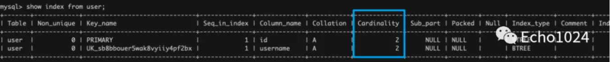

比如这个经典的例子：

有一列为sex，那对于sex列中存储的值来说 非男即女，它的基数最大就是2。

那也就完全没有必要为sex建立索引。因为，为了提升你基于sex的查询速度，MySQL会为你选择的这个新索引创建一棵全新的B+Tree。但你sex只有两种值，对于MySQL来说，即使它为你指定的列建立了B+Tree索引，真正执行查询时，最多进行一次二分查询，剩下的操作只能是遍历，所以为sex创建索引意义不大。

**2、InnoDB更新基数的时机？**

参数：`innodb_stats_auto_recalc`控制MySQL是否主动重新计算这些持久性的信息。默认为1表示true、0表示false。默认情况下当表中的行变化超过10%时，重新计算基数信息。


**3、基数是估算出来的！**

基数并不会实时更新！而且它是通过采样估算出来的值！至于基数的公式是怎样的，可能并不重要。重要的是你得知道，它是通过随机采样数据页的方式统计出来的一个估算值。而且随机采样的页数可以通过参数：

`innodb_stats_persistent_sample_pages` 设置，默认值是20。

> 这就意味着 基数值并不准确，甚至你每次计算的结果相差还是蛮大的。

**4、基数的持久化机制**

可以通过参数`innodb_stats_persistent` 控制是否持久化基数，默认为off。


当然你可以为一个单独的表设置 `STATS_PERSISTENT=1` 那么它的

 `innodb_stats_persistent`将自动被启用。


开启它的好处是：重启MySQL不会再重复计算这个值，加快重启速度。

**5、如何主动的更新基数？**

执行下面的SQL时都会触发InnoDB更新基数（即使你并没有意识到它会更新基数）。所以尽量选择一个业务低峰期。

- `analyze table tableName;`

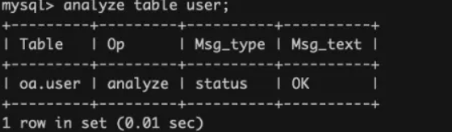

如果因为采样的数量太少了，计算的基数就错的离谱。那很可能会导致MySQL的优化器选错索引。这时你可以将这个值适当调大。但是增加太多可能会导致`ANALYZE TABLE`运行缓慢。


反之， `ANALYZE TABLE `运行太慢。你可以适度调整参数`innodb_stats_persistent_sample_pages` 的值。但是这又可能导致基数计算的不准确。

> 如果没有办法平衡两者的关系。可以考虑减少表中索引列的数量或限制分区的数量以降低 ANALYZE TABLE复杂性。表的主键中的列数也很重要，因为主键列被附加到每个非唯一索引中。


## 二、聊聊什么是慢查、如何监控？如何排查？

**1、什么是慢查？**

慢查，顾名思义就是很慢的查询。

SQL的执行总是有一个执行时间的，通过`long_query_time`参数可以告诉MySQL，当SQL的执行时间超过该参数的指定值后就将这条SQL记录在慢查日志中。

默认的`long_query_time`默认值为10s。

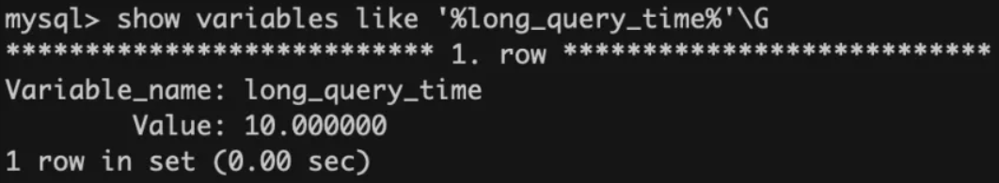

**3、怎么调整慢查的时间？**

默认的慢查时长为10s，肯定是需要调整的。

例：设置全局慢查时间为0.2秒。

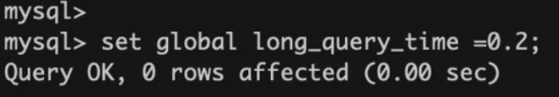

> 注意：long_query_time属于dynamic类型的参数。
>
> 意思是像上面这样在会话A中通过命令行的方式设置全局 long_query_time为0.2秒后，再打开一个新的会话B查看该变量会发现 long_query_time=0.2
>
> 但是在会话A中查看session级别的long_query_time依然为默认的10s

**4、慢查日志是真实的物理文件吗？**

在MySQL5.1之前确实慢查日志确实是以文件的形式存在。

但是MySQL5.1之后MySQL允许我们可以将慢查日志放入一个数据表中，便于我们查看分析。

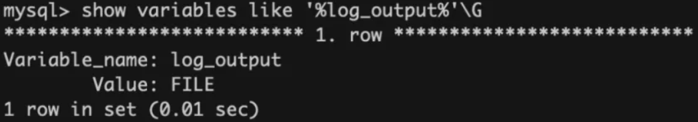

现在公司使用的一般都是5.6～5.7版本。当然即使5.1版本之后支持了将数据放入Table中，默认配置依然是File。

当然你也可以通过下面的命令将慢查输出类型改成Table。

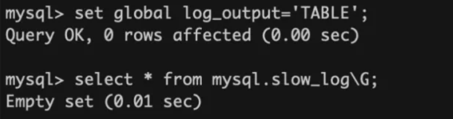

**5、慢查有什么危害吗？**

研发同学都知道：对于Linux操作系统来说，一个进程能打开的Socket文件句柄是上限的。即使我们可以动态的调整它的大小，但是也做不到无限大。

通过命令: 查看进程被限制的使用各种资源的量。

```
ulimit -a 
core file size: 进程崩溃是转储文件大小限制
man loaded memort 最大锁定内存大小
open file 能打开的文件句柄数
```

大量的慢查占据MySQL连接（Linux操作系统会为每一条连接创建socket文件），慢查累积到一定程度还会导致正常的SQL得不到连接执行从而变成慢查SQL。

最终有可能导致MySQL的连接全部被耗光而夯死。这就是生产级别的事故了。  

**6、如何监控慢查？**

**5.1、查看曾经执行完成的慢查**

如果你需要编写一个监控程序探测MySQL的慢查询。那完全可以探测分析MySQL的slow.log

如果你还不知道slow.log在哪里，可以像下面这样定位到它。slow.log中记录的就是曾经执行过的慢查信息。

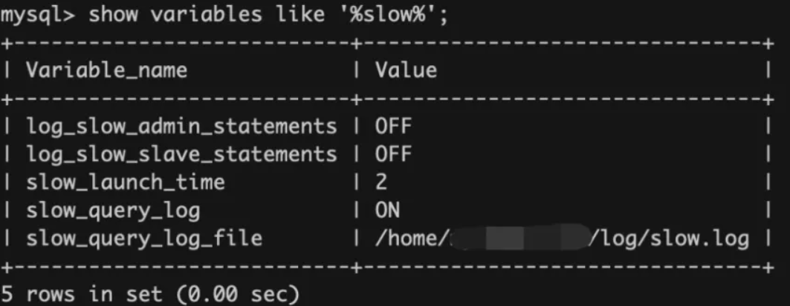

这时你可以尝试使用`select sleep(2);`模拟一条慢查SQL

然后去慢查sql中查看具体的慢查详情。

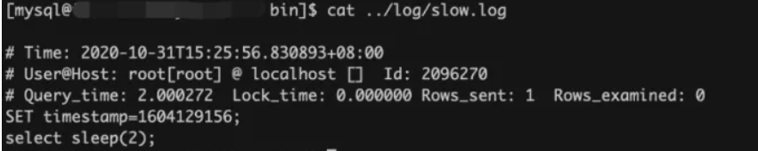

**5.2、查看正在进行的慢查SQL**

我在A Session中发起SQL：select sleep(60);

然后在B Session中通过下图的方式可以看到当前正在进行的慢查情况。大家在看的时候注意：Command的类型为Query

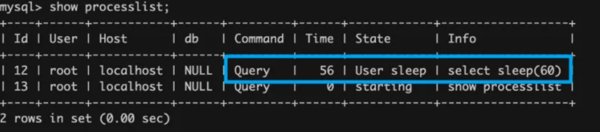

MySQL也为用户提供了一些原生的慢查工具。比如：查看执行时间最长的10条SQL。

mysqldumpslow -s a1 -n 10  mysql.slow_log

了解即可～


**7、如何处理线上的慢查？**

首先你得知道通常情况下每个公司都有自己监控系统，或者是监控脚本，具体的监控逻辑就是上节讲述的思路。故一旦出现报警，DBA同学会在第一时间接到消息。

DBA同学一般都会去联系业务同学，由业务同学去处理这个慢查。（相信已经工作的同学深有这个体会）

有可能爆出慢查的这套数据库集群是由多个业务同时使用。所以如果慢查影响很严重，DBA同学会询问业务同学是否可以kill 慢查。坚决不能让MySQL夯死！但是kill的方式其实是治标不治本！而且只要kill，就难免会误伤用户的SQL。

你可以像下面这样kill一个SQL

还是这张图：我们可以看到`select sleep(60);`已经执行了56秒了。

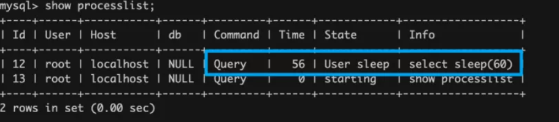

于是可以使用 `kill 12` 来断开它占用的连接。

但是kill的方式其实是治标不治本，很可能你刚给它断连，它马上又建立连接了。而且只要kill，就难免会误伤用户的SQL。


**8、影响优化器选错索引的因素？**

**基数：**cardinality的统计是一个估算的结果，而且它也并不会实时的更新。所以这就可能出现一开始由于数据量小且没有代表性。导致基数很低。导致优化器选错了索引。针对这种情况，可以通过analyze table t 重新计算统计信息。

**扫描行数、排序**：更少的扫描行数意味着可能需要更少的磁盘IO，所以MySQL选择扫描行数少的key的可能性就更大。扫描行数并不是优化器选择索引的唯一依据，很可能出现你期望SQL走一个二级索引keyX，但是优化器偏偏走了主键索引。这是因为优化器考虑到了你select  a,b,c,d from xxx;可能还有回表,IO代价也很高。

如果你有order by语句需要mysql帮你做排序，那MySQL就更倾向选一个查询出来的数据本来就有序的索引。


## 三、能谈谈 date、datetime、time、timestamp、year的区别吗？

**1、准备环境**

如果面试官问你：了解 date、datetime、time、timestamp、year 有什么区别吗？

其实大概率就是看你曾经用过哪些，以及有没有留心对比它们的异同。如果你没有时间去做一下小实验，没关系！大概浏览一下我下面的小Case就OK了。

创建下面这张表，下面的 insert sql 都是往这个表中插入数据。

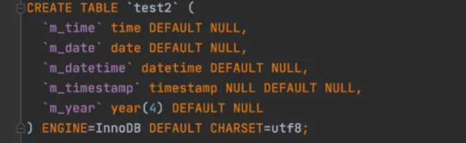

**2、Year**

支持范围：1901～2155 。

> 1901那年清政府签订了《辛丑条约》

在 MySQL5.7.5 中删除了对Year(2)的支持，同一转换为Year(4)。所以如果你使用这个版本的MySQL，会发现它会把年份以4位长度的数字展示给我们看。

你可以尝试插入一个超过它规定的上限2155的值 -- 2156 ，如下：

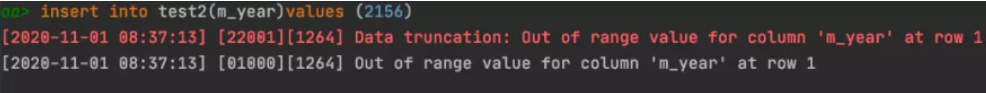

你会发现MySQL报错了，这是因为默认情况下MySQL开启了严格模式！

针对非法值的插入，MySQL是否报错取决于SQL是否开启了严格模式。

> 白日梦在上一篇“ 对NotNull字段插入Null值有什么现象” 中跟大家提及到了 什么是 sql mode，并且说了几个和日期相关的sql mode。不记得的同学可以去看一下。

比如通过下面的命令关闭严格模式。

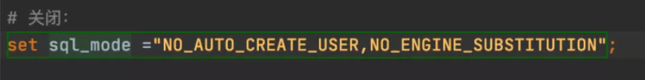

然后插入非法值，结果很明显，不会报错。而且MySQL帮你插入了0值。

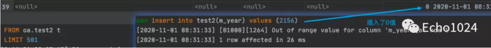

**3、Date**

支持的范围：1000-01-01 ～ 9999-12-31

下面做几个插入的小实验

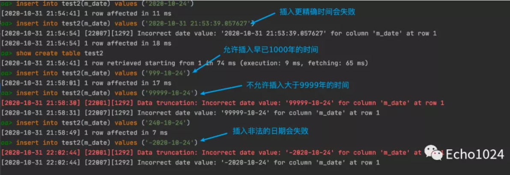

上例中使用MySQL5.7，默认的情况下是可以插入比1000-01-01更早的时间的！

那能不能插入0000-00-00呢？这取决于你使用的那种sql mode！

默认情况下是插入不进去的，如下：

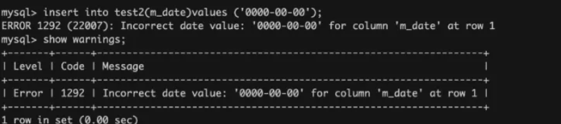

插不进去的原因是：mysql5.7 默认的sql mode中开启了严格模式。

且开启使用了参数`NO_ZERO_DATE`。

这个参数与严格模式一起起作用就会导致不能插入 0-0-0。

如果偏偏想插入 0-0-0 可以像下面这样将其去掉，然后重试。

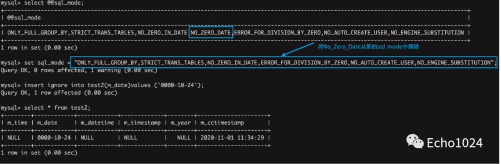

**4、Datetime**

支持范围：1000-01-01 00:00:00.000000  to  9999-12-31 23:59:59.999999

很明显，Datetime比Date更精确。


且Datetime不允许插入数字格式的日期。

**5、Time**

支持范围：-838:59:59.000000  to 838:59:59.000000

time类型不仅可以用来表示24h，还可以用来表示一个时间范围，这个时间范围可能会很大，甚至是负的。

下面做几个小实验：

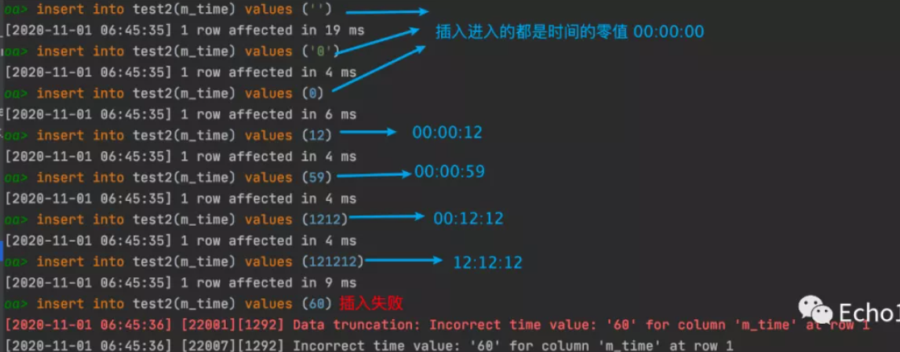

秒数是满60进1的。

所以我插入60时，在jdbc层面会爆出下面的错误：format exception

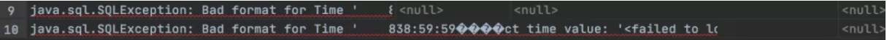

可以插入正常的时间

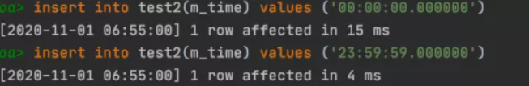

**再看下面这个例子：**

虽然mysql支持往time字中插入`-838:59:59.000000`  但是失败了。

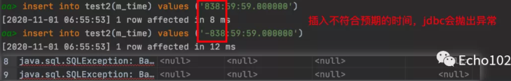

原因如下图: IDE本身通过java的jdbc驱动连接MySQL。

jdbc尝试会将`-838:59:59.000000`  转换成Java的封装类，结果还转失败了。

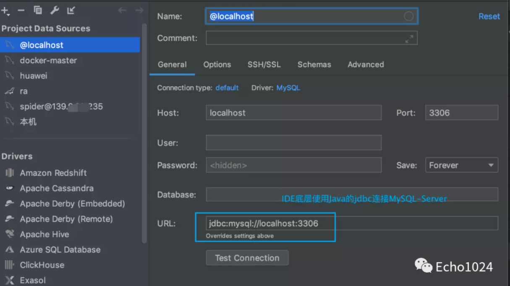

直接连接MySQL是不会出现上图这种情况的。

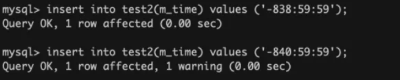

> 如果范围超过了 -838:59:59.000000  to 838:59:59.000000 这两个边界值 ，就插入这边界值。

再看几个典型的例子：


**6、Timestamp**

  支持范围： 1970-01-01 00:00:01 UTC to 2038-01-19 03:14:07 UTC

> 因为32位能表示的最大值是2147483647。另外1年365天的总秒数是 31536000，2147483647/31536000 = 68.1，也就是说32位能表示的最长时间是68年，从1970年开始的话，加上68.1，实际最终到2038年01月19日03时14分07秒。
>
> 过了这个上线，所有32位操作系统时间都会变成10000000 00000000 00000000 00000000
>
> 这个问题在64位操作系统中已经不复存在

好，开始我们的实验！

先尝试插入几个零值，无一例外，全部报错失败。

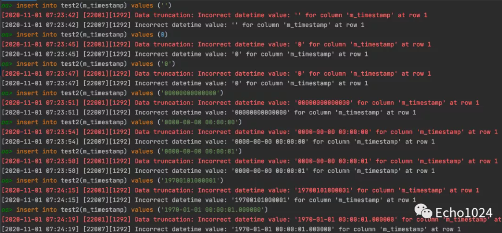

再插入一些大点的值

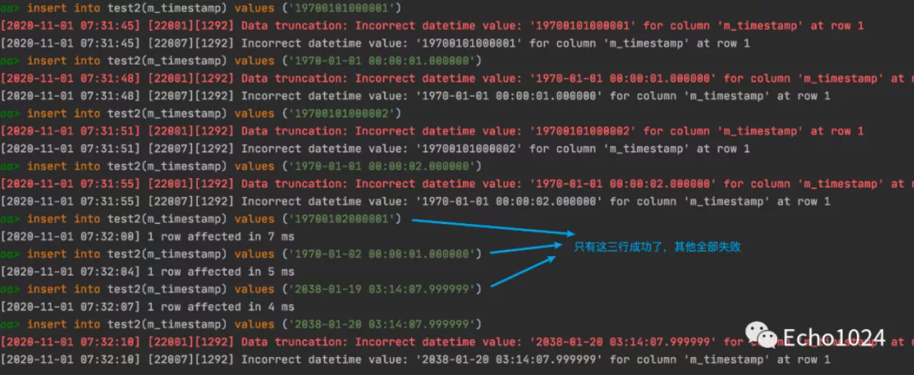

你会不会诧异这样一个问题：

timestamp合法区间最小值不是1970-01-01 00:00:01吗？

那为什么在上面的例子中我尝试写入插入1970-01-01 00:00:01竟然会失败？

那是因为我机器上的MySQL使用的时区是CST：China Standard Time UT+8:00

以北京时间为准，我们是在东八区。所以最后是+8:00 ， 而不是+0:00

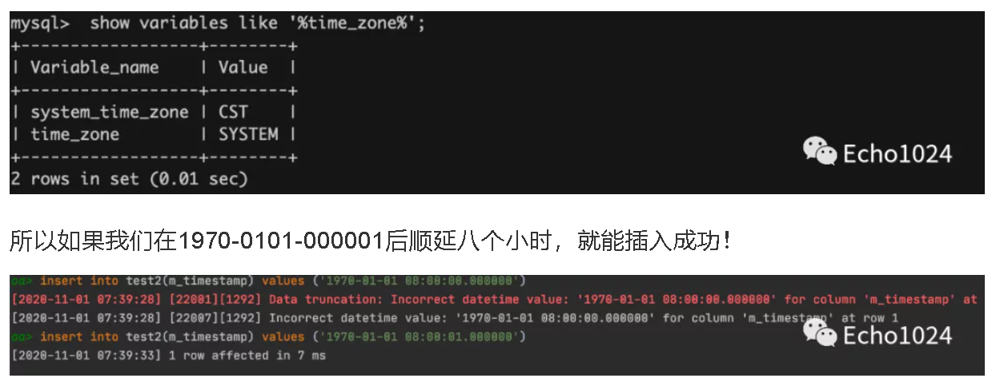

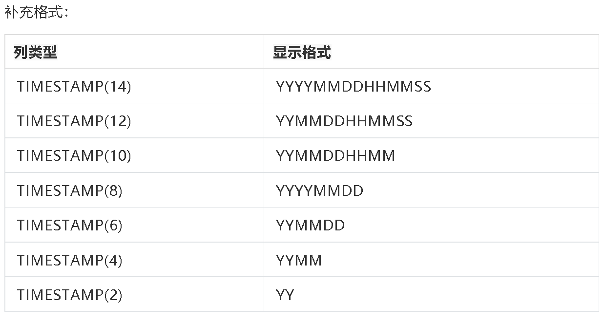


## 四、你有没有搞混查询缓存和BufferPool？谈谈看！

**1、Caches - 查询缓存**

下图是MySQL官网给出的：MySQL架构体系图。

人们常说的查询缓存就是下图中的Cache部分。

如果将MySQL分成 Server层和存储引擎层两大部分，那么Caches位于Server层。

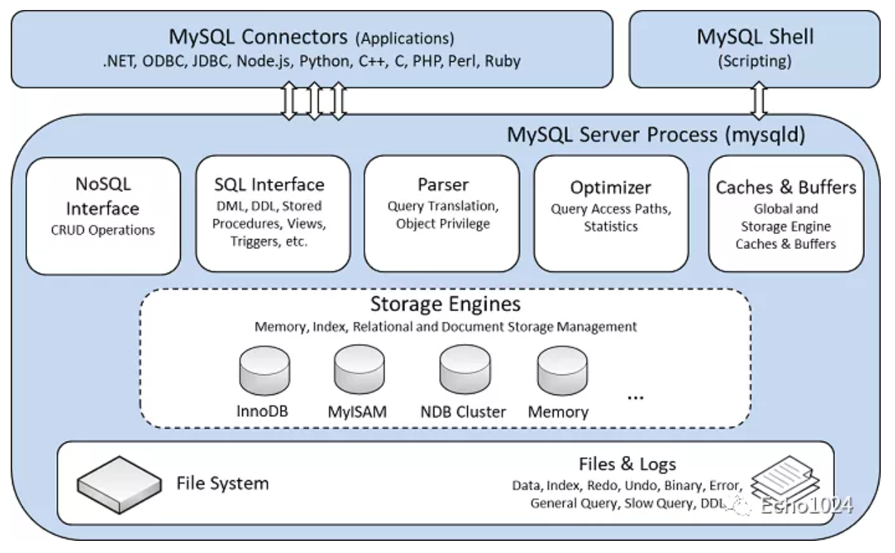

另外你还得知道：

当一个SQL打向MySQL Server之后，MySQL Server首选会从查询缓存中查看是否曾经执行过这个SQL，如果曾经执行过的话，之前执行的查询结果会以Key-Value的形式保存在查询缓存中。key是SQL语句，value是查询结果。我们将这个过程称为查询缓存！

如果查询缓存中没有你要找的数据的话，MySQL才会执行后续的逻辑，通过存储引擎将数据检索出来。并且查询缓存会被shared cache for sessions，是的，它会被所有的session共享。

查询缓存的缺点：

只要有一个sql update了该表，那么表的查询缓存就会失效。所以当你的业务对表CRUD的比例不相上下，那么查询缓存may be会影响应用的吞吐效率。

你可以通过参数 `query_chache_type=demand`禁用查询缓存。并且在mysql8.0的版本中，已经将查询缓存模块删除了。

所以，你可以根据自己的情况考虑一下有没有必要禁用个功能

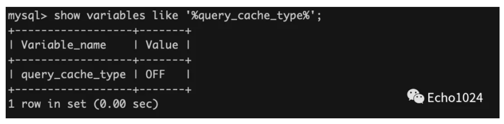

**2、Buffer Pool**

还是那句话：如果将MySQL分成 Server层和存储引擎层两大部分，那么Buffer Pool位于存储引擎层。

其实大家都知道无论是连接池也好、缓存池也好，只要是XXX池，都是为加速而设计的。比如操作系统的文件系统为了加快数据的读取速度，每次都做低效率的磁盘随机IO设计了缓冲写机制。

> 关注我，白日梦将在本专题系列文章中的第 18 篇文章中跟你介绍相关的系统调用 。

而Buffer Pool就是MySQL存储引擎为了加速数据的读取速度而设计的缓冲机制。下图中的灰色部分就是BufferPool的脑图。（字是真迹，非常之秀气！）

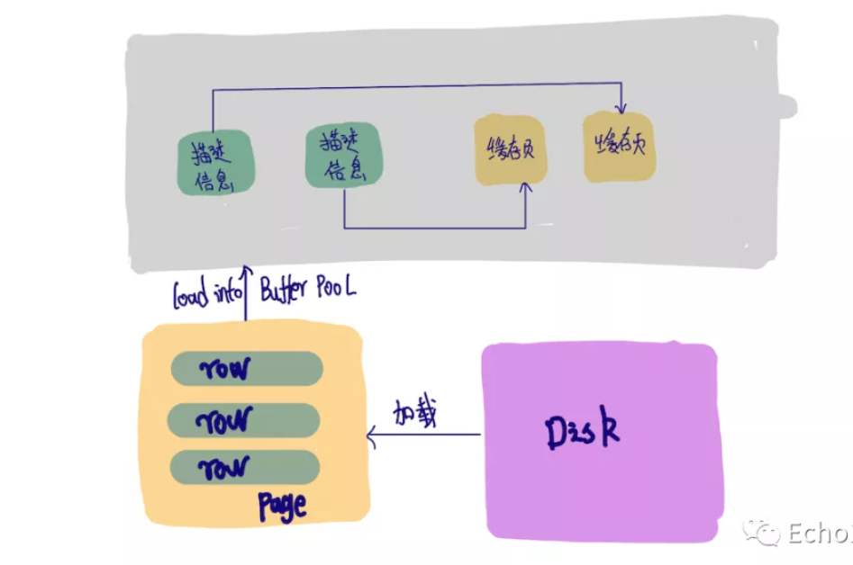

如上图，Buffer中的中的单位是一个个的缓存页。缓存页本质上就是从磁盘中读取进内存的数据页。数据页中存放着一行行的记录。Buffer Pool中的默认大小为128MB，数据页大小16KB。

> 如果你还不清楚什么是数据页，那你可以先这样理解：InnoDB组织数据的最小单位是数据页，简单来说 MySQL都每次从磁盘中读取出来的都是 默认16KB大小的数据页。数据页中有很多条数据。
>
> 我会在第 14 篇文章中详细的和大家分享什么是数据页、预读等知识点。

Buffer Pool中的描述信息以双向链表（LRU）的形式组织在一起。通过数据页的描述信息，我们能找它所描述的缓存页的位置。

看到这里你除了要知道查询缓存和Buffer Pool的所属：前者属于MySQLServer层面，后者属于存储引擎层面。还需要知道另一个知识点：相对于极容易整体失效的查询缓存来说，Buffer Pool是通过InnoDB优化后的LRU算法控制将老化的数据数据从缓存中干掉的，所以Buffer Pool中缓存的数据不会像前者一样一次性整体失效。

> MySQL存储引擎层面除了LRU链表，还有Free链表、Flush链表，本文暂不展开。关注我，白日梦后续会在本专题的文章中一一跟大家分享。


## 五、MySql优化


### 1 、避免使用select *

很多时候，我们写sql语句时，为了方便，喜欢直接使用`select *`，一次性查出表中所有列的数据。

**反例：**

```sql
select * from user where id=1;
```

在实际业务场景中，可能我们真正需要使用的只有其中一两列。查了很多数据，但是不用，白白浪费了数据库资源，比如：内存或者cpu。

此外，多查出来的数据，通过网络IO传输的过程中，也会增加数据传输的时间。

还有一个最重要的问题是：`select *`不会走`覆盖索引`，会出现大量的`回表`操作，而从导致查询sql的性能很低。

那么，如何优化呢？

**正例：**

```sql
select name,age from user where id=1;
```

sql语句查询时，只查需要用到的列，多余的列根本无需查出来。

### 2 、用union all代替union

我们都知道sql语句使用`union`关键字后，可以获取排重后的数据。

而如果使用`union all`关键字，可以获取所有数据，包含重复的数据。

**反例：**

```sql
(select * from user where id=1) 
union 
(select * from user where id=2);
```

排重的过程需要遍历、排序和比较，它更耗时，更消耗cpu资源。

所以如果能用union all的时候，尽量不用union。

**正例：**

```sql
(select * from user where id=1) 
union all
(select * from user where id=2);
```

除非是有些特殊的场景，比如union all之后，结果集中出现了重复数据，而业务场景中是不允许产生重复数据的，这时可以使用union。

### 3、 小表驱动大表

小表驱动大表，也就是说用小表的数据集驱动大表的数据集。

假如有order和user两张表，其中order表有10000条数据，而user表有100条数据。

这时如果想查一下，所有有效的用户下过的订单列表。

可以使用`in`关键字实现：

```sql
select * from order
where user_id in (select id from user where status=1)
```

也可以使用`exists`关键字实现：

```sql
select * from orders
where exists (select 1 from user where order.user_id = user.id and status=1)
```

前面提到的这种业务场景，使用in关键字去实现业务需求，更加合适。

为什么呢？

因为如果sql语句中包含了in关键字，则它会优先执行in里面的`子查询语句`，然后再执行in外面的语句。如果in里面的数据量很少，作为条件查询速度更快。

而如果sql语句中包含了exists关键字，它优先执行exists左边的语句（即主查询语句）。然后把它作为条件，去跟右边的语句匹配。如果匹配上，则可以查询出数据。如果匹配不上，数据就被过滤掉了。

这个需求中，order表有10000条数据，而user表有100条数据。order表是大表，user表是小表。如果order表在左边，则用in关键字性能更好。

总结一下：

- `in` 适用于左边大表，右边小表。
- `exists` 适用于左边小表，右边大表。

不管是用in，还是exists关键字，其核心思想都是用小表驱动大表。

### 4 、批量操作

如果你有一批数据经过业务处理之后，需要插入数据，该怎么办？

**反例：**

```sql
for(Order order: list){
   orderMapper.insert(order):
}
```

在循环中逐条插入数据。

```sql
insert into order(id,code,user_id) 
values(123,'001',100);
```

该操作需要多次请求数据库，才能完成这批数据的插入。

但众所周知，我们在代码中，每次远程请求数据库，是会消耗一定性能的。而如果我们的代码需要请求多次数据库，才能完成本次业务功能，势必会消耗更多的性能。

那么如何优化呢？

**正例：**

```sql
orderMapper.insertBatch(list):
```

提供一个批量插入数据的方法。

```sql
insert into order(id,code,user_id) 
values(123,'001',100),(124,'002',100),(125,'003',101);
```

这样只需要远程请求一次数据库，sql性能会得到提升，数据量越多，提升越大。

但需要注意的是，不建议一次批量操作太多的数据，如果数据太多数据库响应也会很慢。批量操作需要把握一个度，建议每批数据尽量控制在500以内。如果数据多于500，则分多批次处理。


### 5 、多用limit

有时候，我们需要查询某些数据中的第一条，比如：查询某个用户下的第一个订单，想看看他第一次的首单时间。

**反例：**

```
select id, create_date 
 from order 
where user_id=123 
order by create_date asc;
```

根据用户id查询订单，按下单时间排序，先查出该用户所有的订单数据，得到一个订单集合。然后在代码中，获取第一个元素的数据，即首单的数据，就能获取首单时间。

```
List<Order> list = orderMapper.getOrderList();
Order order = list.get(0);
```

虽说这种做法在功能上没有问题，但它的效率非常不高，需要先查询出所有的数据，有点浪费资源。

那么，如何优化呢？

**正例：**

```
select id, create_date 
 from order 
where user_id=123 
order by create_date asc 
limit 1;
```

使用`limit 1`，只返回该用户下单时间最小的那一条数据即可。

> 此外，在删除或者修改数据时，为了防止误操作，导致删除或修改了不相干的数据，也可以在sql语句最后加上limit。

例如：

```
update order set status=0,edit_time=now(3) 
where id>=100 and id<200 limit 100;
```

这样即使误操作，比如把id搞错了，也不会对太多的数据造成影响。


### 6 、in中值太多

对于批量查询接口，我们通常会使用`in`关键字过滤出数据。比如：想通过指定的一些id，批量查询出用户信息。

sql语句如下：

```
select id,name from category
where id in (1,2,3...100000000);
```

如果我们不做任何限制，该查询语句一次性可能会查询出非常多的数据，很容易导致接口超时。

这时该怎么办呢？

```
select id,name from category
where id in (1,2,3...100)
limit 500;
```

可以在sql中对数据用limit做限制。

不过我们更多的是要在业务代码中加限制，伪代码如下：

```
public List<Category> getCategory(List<Long> ids) {
   if(CollectionUtils.isEmpty(ids)) {
      return null;
   }
   if(ids.size() > 500) {
      throw new BusinessException("一次最多允许查询500条记录")
   }
   return mapper.getCategoryList(ids);
}
```

还有一个方案就是：如果ids超过500条记录，可以分批用多线程去查询数据。每批只查500条记录，最后把查询到的数据汇总到一起返回。

不过这只是一个临时方案，不适合于ids实在太多的场景。因为ids太多，即使能快速查出数据，但如果返回的数据量太大了，网络传输也是非常消耗性能的，接口性能始终好不到哪里去。


### 7、 增量查询

有时候，我们需要通过远程接口查询数据，然后同步到另外一个数据库。

**反例：**

```
select * from user;
```

如果直接获取所有的数据，然后同步过去。这样虽说非常方便，但是带来了一个非常大的问题，就是如果数据很多的话，查询性能会非常差。

这时该怎么办呢？

**正例：**

```
select * from user 
where id>#{lastId} and create_time >= #{lastCreateTime} 
limit 100;
```

按id和时间升序，每次只同步一批数据，这一批数据只有100条记录。每次同步完成之后，保存这100条数据中最大的id和时间，给同步下一批数据的时候用。

通过这种增量查询的方式，能够提升单次查询的效率。

### 8 、高效的分页

有时候，列表页在查询数据时，为了避免一次性返回过多的数据影响接口性能，我们一般会对查询接口做分页处理。

在mysql中分页一般用的`limit`关键字：

```
select id,name,age 
from user limit 10,20;
```

如果表中数据量少，用limit关键字做分页，没啥问题。但如果表中数据量很多，用它就会出现性能问题。

比如现在分页参数变成了：

```
select id,name,age 
from user limit 1000000,20;
```

mysql会查到1000020条数据，然后丢弃前面的1000000条，只查后面的20条数据，这个是非常浪费资源的。

那么，这种海量数据该怎么分页呢？

优化sql：

```
select id,name,age 
from user where id > 1000000 limit 20;
```

先找到上次分页最大的id，然后利用id上的索引查询。不过该方案，要求id是连续的，并且有序的。

还能使用`between`优化分页。

```
select id,name,age 
from user where id between 1000000 and 1000020;
```

需要注意的是between要在唯一索引上分页，不然会出现每页大小不一致的问题。

### 9 、用连接查询代替子查询

mysql中如果需要从两张以上的表中查询出数据的话，一般有两种实现方式：`子查询` 和 `连接查询`。

子查询的例子如下：

```
select * from order
where user_id in (select id from user where status=1)
```

子查询语句可以通过`in`关键字实现，一个查询语句的条件落在另一个select语句的查询结果中。程序先运行在嵌套在最内层的语句，再运行外层的语句。

子查询语句的优点是简单，结构化，如果涉及的表数量不多的话。

但缺点是mysql执行子查询时，需要创建临时表，查询完毕后，需要再删除这些临时表，有一些额外的性能消耗。

这时可以改成连接查询。具体例子如下：

```
select o.* from order o
inner join user u on o.user_id = u.id
where u.status=1
```

### 10 、join的表不宜过多

根据阿里巴巴开发者手册的规定，join表的数量不应该超过`3`个。

**反例：**

```
select a.name,b.name.c.name,d.name
from a 
inner join b on a.id = b.a_id
inner join c on c.b_id = b.id
inner join d on d.c_id = c.id
inner join e on e.d_id = d.id
inner join f on f.e_id = e.id
inner join g on g.f_id = f.id
```

如果join太多，mysql在选择索引的时候会非常复杂，很容易选错索引。

并且如果没有命中中，nested loop join 就是分别从两个表读一行数据进行两两对比，复杂度是 n^2。

所以我们应该尽量控制join表的数量。

**正例：**

```
select a.name,b.name.c.name,a.d_name 
from a 
inner join b on a.id = b.a_id
inner join c on c.b_id = b.id
```

如果实现业务场景中需要查询出另外几张表中的数据，可以在a、b、c表中`冗余专门的字段`，比如：在表a中冗余d_name字段，保存需要查询出的数据。

不过我之前也见过有些ERP系统，并发量不大，但业务比较复杂，需要join十几张表才能查询出数据。

所以join表的数量要根据系统的实际情况决定，不能一概而论，尽量越少越好。

### 11、 join时要注意

我们在涉及到多张表联合查询的时候，一般会使用`join`关键字。

而join使用最多的是left join和inner join。

- `left join`：求两个表的交集外加左表剩下的数据。
- `inner join`：求两个表交集的数据。

使用inner join的示例如下：

```
select o.id,o.code,u.name 
from order o 
inner join user u on o.user_id = u.id
where u.status=1;
```

如果两张表使用inner join关联，mysql会自动选择两张表中的小表，去驱动大表，所以性能上不会有太大的问题。

使用left join的示例如下：

```
select o.id,o.code,u.name 
from order o 
left join user u on o.user_id = u.id
where u.status=1;
```

如果两张表使用left join关联，mysql会默认用left join关键字左边的表，去驱动它右边的表。如果左边的表数据很多时，就会出现性能问题。

> 要特别注意的是在用left join关联查询时，左边要用小表，右边可以用大表。如果能用inner join的地方，尽量少用left join。

### 12 、控制索引的数量

众所周知，索引能够显著的提升查询sql的性能，但索引数量并非越多越好。

因为表中新增数据时，需要同时为它创建索引，而索引是需要额外的存储空间的，而且还会有一定的性能消耗。

阿里巴巴的开发者手册中规定，单表的索引数量应该尽量控制在`5`个以内，并且单个索引中的字段数不超过`5`个。

mysql使用的B+树的结构来保存索引的，在insert、update和delete操作时，需要更新B+树索引。如果索引过多，会消耗很多额外的性能。

那么，问题来了，如果表中的索引太多，超过了5个该怎么办？

这个问题要辩证的看，如果你的系统并发量不高，表中的数据量也不多，其实超过5个也可以，只要不要超过太多就行。

但对于一些高并发的系统，请务必遵守单表索引数量不要超过5的限制。

那么，高并发系统如何优化索引数量？

能够建联合索引，就别建单个索引，可以删除无用的单个索引。

将部分查询功能迁移到其他类型的数据库中，比如：Elastic Seach、HBase等，在业务表中只需要建几个关键索引即可。

### 13、 选择合理的字段类型

`char`表示固定字符串类型，该类型的字段存储空间的固定的，会浪费存储空间。

```
alter table order 
add column code char(20) NOT NULL;
```

`varchar`表示变长字符串类型，该类型的字段存储空间会根据实际数据的长度调整，不会浪费存储空间。

```
alter table order 
add column code varchar(20) NOT NULL;
```

如果是长度固定的字段，比如用户手机号，一般都是11位的，可以定义成char类型，长度是11字节。

但如果是企业名称字段，假如定义成char类型，就有问题了。

如果长度定义得太长，比如定义成了200字节，而实际企业长度只有50字节，则会浪费150字节的存储空间。

如果长度定义得太短，比如定义成了50字节，但实际企业名称有100字节，就会存储不下，而抛出异常。

所以建议将企业名称改成varchar类型，变长字段存储空间小，可以节省存储空间，而且对于查询来说，在一个相对较小的字段内搜索效率显然要高些。

我们在选择字段类型时，应该遵循这样的原则：

1. 能用数字类型，就不用字符串，因为字符的处理往往比数字要慢。
2. 尽可能使用小的类型，比如：用bit存布尔值，用tinyint存枚举值等。
3. 长度固定的字符串字段，用char类型。
4. 长度可变的字符串字段，用varchar类型。
5. 金额字段用decimal，避免精度丢失问题。

还有很多原则，这里就不一一列举了。

### 14、 提升group by的效率

我们有很多业务场景需要使用`group by`关键字，它主要的功能是去重和分组。

通常它会跟`having`一起配合使用，表示分组后再根据一定的条件过滤数据。

**反例：**

```
select user_id,user_name from order
group by user_id
having user_id <= 200;
```

这种写法性能不好，它先把所有的订单根据用户id分组之后，再去过滤用户id大于等于200的用户。

分组是一个相对耗时的操作，为什么我们不先缩小数据的范围之后，再分组呢？

**正例：**

```
select user_id,user_name from order
where user_id <= 200
group by user_id
```

使用where条件在分组前，就把多余的数据过滤掉了，这样分组时效率就会更高一些。

> 其实这是一种思路，不仅限于group by的优化。我们的sql语句在做一些耗时的操作之前，应尽可能缩小数据范围，这样能提升sql整体的性能。

### 15、 索引优化

sql优化当中，有一个非常重要的内容就是：`索引优化`。

很多时候sql语句，走了索引，和没有走索引，执行效率差别很大。所以索引优化被作为sql优化的首选。

索引优化的第一步是：检查sql语句有没有走索引。

那么，如何查看sql走了索引没？

可以使用`explain`命令，查看mysql的执行计划。

例如：

```
explain select * from `order` where code='002';
```

结果：


通过这几列可以判断索引使用情况，执行计划包含列的含义如下图所示：


说实话，sql语句没有走索引，排除没有建索引之外，最大的可能性是索引失效了。

下面说说索引失效的常见原因：


如果不是上面的这些原因，则需要再进一步排查一下其他原因。

此外，你有没有遇到过这样一种情况：明明是同一条sql，只有入参不同而已。有的时候走的索引a，有的时候却走的索引b？

没错，有时候mysql会选错索引。

必要时可以使用`force index`来强制查询sql走某个索引。

至于为什么mysql会选错索引，后面有专门的文章介绍的，这里先留点悬念。


## 六、explain | 索引优化的这把绝世好剑

对于互联网公司来说，随着用户量和数据量的不断增加，慢查询是无法避免的问题。一般情况下如果出现慢查询，意味着接口响应慢、接口超时等问题。如果是高并发的场景，可能会出现数据库连接被占满的情况，直接导致服务不可用。

慢查询的确会导致很多问题，我们要如何优化慢查询呢？

主要解决办法有：

- 监控sql执行情况，发邮件、短信报警，便于快速识别慢查询sql
- 打开数据库慢查询日志功能
- 简化业务逻辑
- 代码重构、优化
- 异步处理
- sql优化
- 索引优化

其他的办法先不说，后面有机会再单独介绍。今天我重点说说索引优化，因为它是解决慢查询sql问题最有效的手段。

如何查看某条sql的索引执行情况呢？

没错，在sql前面加上`explain`关键字，就能够看到它的执行计划，通过执行计划，我们可以清楚的看到表和索引执行的情况，索引有没有执行、索引执行顺序和索引的类型等。

索引优化的步骤是：

1. 使用`explain`查看sql执行计划
2. 判断哪些索引使用不当
3. 优化sql，sql可能需要多次优化才能达到索引使用的最优值

既然索引优化的第一步是使用`explain`，我们先全面的了解一下它。

### **explain介绍**

先看看mysql的官方文档是怎么描述explain的：

- EXPLAIN可以使用于 SELECT， DELETE， INSERT， REPLACE，和 UPDATE语句。
- 当EXPLAIN与可解释的语句一起使用时，MySQL将显示来自优化器的有关语句执行计划的信息。也就是说，MySQL解释了它将如何处理该语句，包括有关如何连接表以及以何种顺序连接表的信息。
- 当EXPLAIN与非可解释的语句一起使用时，它将显示在命名连接中执行的语句的执行计划。
- 对于SELECT语句， EXPLAIN可以显示的其他执行计划的警告信息。

### **explain详解**

explain的语法：

```sql
{EXPLAIN | DESCRIBE | DESC}
    tbl_name [col_name | wild]

{EXPLAIN | DESCRIBE | DESC}
    [explain_type]
    {explainable_stmt | FORCONNECTION connection_id}

explain_type: {
    EXTENDED
  | PARTITIONS
  | FORMAT = format_name
}

format_name: {
    TRADITIONAL
  | JSON
}

explainable_stmt: {
    SELECTstatement
  | DELETEstatement
  | INSERTstatement
  | REPLACEstatement
  | UPDATEstatement
}
```

用一条简单的sql看看使用`explain`关键字的效果：

执行结果：


从上图中看到执行结果中会显示12列信息，每列具体信息如下：


说白了，我们要搞懂这些列的具体含义才能正常判断索引的使用情况。

话不多说，直接开始介绍吧。

### id列

该列的值是select查询中的序号，比如：1、2、3、4等，它决定了表的执行顺序。

某条sql的执行计划中一般会出现三种情况：

1. id相同
2. id不同
3. id相同和不同都有

那么这三种情况表的执行顺序是怎么样的呢？

###### 1.id相同

执行sql如下：

```
explain select * from test1 t1 inner join test1 t2 on t1.id=t2.id
```

结果：


我们看到执行结果中的两条数据id都是1，是相同的。

这种情况表的执行顺序是怎么样的呢？

答案：从上到下执行，先执行表t1，再执行表t2。

执行的表要怎么看呢？

答案：看table字段，这个字段后面会详细解释。

###### 2.id不同

执行sql如下：

```
explain select * from test1 t1 where t1.id = (select id from  test1 t2 where  t2.id=2);
```

结果：


我们看到执行结果中两条数据的id不同，第一条数据是1，第二条数据是2。

这种情况表的执行顺序是怎么样的呢？

答案：序号大的先执行，这里会从下到上执行，先执行表t2，再执行表t1。

###### 3.id相同和不同都有

执行sql如下：

```
explain
select t1.* from test1 t1
inner join (select max(id) mid from test1 group by id) t2
on t1.id=t2.mid
```

结果：


我们看到执行结果中三条数据，前面两条数据的的id相同，第三条数据的id跟前面的不同。

这种情况表的执行顺序又是怎么样的呢？

答案：先执行序号大的，先从下而上执行。遇到序号相同时，再从上而下执行。所以这个列子中表的顺序顺序是：test1、t1、

**也许你会在这里心生疑问：`<``derived2>` 是什么鬼？**

它表示派生表，别急后面会讲的。

**还有一个问题：id列的值允许为空吗？**

答案在后面揭晓。

### select_type列

该列表示select的类型。具体包含了如下11种类型：


但是常用的其实就是下面几个：


下面看看这些SELECT类型具体是怎么出现的：


1. SIMPLE

   

   

   执行sql如下：

   ```
   explain select * from test1;
   ```

   结果：

   

1. 它只在简单SELECT查询中出现，不包含子查询和UNION，这种类型比较直观就不多说了。

   

2. PRIMARY 和 SUBQUERY

   执行sql如下：

   ```
   explain select * from test1 t1 where t1.id = (select id from  test1 t2 where  t2.id=2);
   ```

   结果：

   

1. 我们看到这条嵌套查询的sql中，最外层的t1表是PRIMARY类型，而最里面的子查询t2表是SUBQUERY类型。

   

2. DERIVED

   

   执行sql如下：

   ```
   explain
   select t1.* from test1 t1
   inner join (select max(id) mid from test1 group by id) t2
   on t1.id=t2.mid
   ```

   结果：

   

1. 最后一条记录就是衍生表，它一般是FROM列表中包含的子查询，这里是sql中的分组子查询。

   

2. UNION 和 UNION RESULT

   执行sql如下：

   ```
   explain
   select * from test1
   union
   select* from test2
   ```

   结果：

   

test2表是UNION关键字之后的查询，所以被标记为UNION，test1是最主要的表，被标记为PRIMARY。而<union1,2>表示id=1和id=2的表union，其结果被标记为UNION RESULT。


UNION 和 UNION RESULT一般会成对出现。


**此外，回答上面的问题：****id列的值允许为空吗？**


如果仔细看上面那张图，会发现id列是可以允许为空的，并且是在SELECT类型为： UNION RESULT的时候。


### table列

该列的值表示输出行所引用的表的名称，比如前面的：test1、test2等。

但也可以是以下值之一：

- `<unionM,N>`：具有和id值的行的M并集N。
- `<derivedN>`：用于与该行的派生表结果id的值N。派生表可能来自（例如）FROM子句中的子查询 。
- `<subqueryN>`：子查询的结果，其id值为N

### partitions列

该列的值表示查询将从中匹配记录的分区

### type列

该列的值表示连接类型，是查看索引执行情况的一个重要指标。包含如下类型：


执行结果从最好到最坏的的顺序是从上到下。

我们需要重点掌握的是下面几种类型：

system > const > eq_ref > ref > range > index > ALL

在演示之前，先说明一下test2表中只有一条数据：


下面逐一看看常见的几个连接类型是怎么出现的：

1. system

   这种类型要求数据库表中只有一条数据，是const类型的一个特例，一般情况下是不会出现的。

   

2. const

   通过一次索引就能找到数据，一般用于主键或唯一索引作为条件的查询sql中，执行sql如下：

   ```
   explain select * from test2 where id=1;
   ```

   结果：


3.eq_ref

常用于主键或唯一索引扫描。执行sql如下：

```
explain select * from test2 t1 inner join test2 t2 on t1.id=t2.id;
```

结果：


此时，有人可能感到不解，const和eq_ref都是对主键或唯一索引的扫描，有什么区别？

 

 答：const只索引一次，而eq_ref主键和主键匹配，由于表中有多条数据，一般情况下要索引多次，才能全部匹配上。


4、ref

常用于非主键和唯一索引扫描。执行sql如下：

```
explain select * from test2 where code = '001';
```

结果：


5、range

常用于范围查询，比如：between ... and 或 In 等操作，执行sql如下：

```
explain select * from test2 where id between 1 and 2;
```

结果：


6.index

全索引扫描。执行sql如下：

```
explain select code from test2;
```

结果：


7.ALL

全表扫描。执行sql如下：

```
explain select *  from test2;
```

结果：


### possible_keys列

该列表示可能的索引选择。


请注意，此列完全独立于表的顺序，这就意味着possible_keys在实践中，某些键可能无法与生成的表顺序一起使用。


如果此列是NULL，则没有相关的索引。在这种情况下，您可以通过检查该WHERE 子句以检查它是否引用了某些适合索引的列，从而提高查询性能。

### key列

该列表示实际用到的索引。

可能会出现possible_keys列为NULL，但是key不为NULL的情况。


演示之前，先看看test1表结构：


code和name字段使用了联合索引。

执行sql如下：

```
explain select code  from test1;
```

结果：


这条sql预计没有使用索引，但是实际上使用了全索引扫描方式的索引。

### 

### key_len列 

该列表示使用索引的长度。上面的key列可以看出有没有使用索引，key_len列则可以更进一步看出索引使用是否充分。不出意外的话，它是最重要的列。


**有个关键的问题浮出水面：key_len是如何计算的？**


决定key_len值的三个因素：

 1.字符集

 2.长度

 3.是否为空 

常用的字符编码占用字节数量如下：


目前我的数据库字符编码格式用的：UTF8占3个字节。

mysql常用字段占用字节数：


此外，如果字段类型允许为空则加1个字节。

上图中的 184是怎么算的？

184 = 30 * 3 + 2 + 30 * 3 + 2

 再把test1表的code字段类型改成char，并且改成允许为空：


执行sql如下：

```
explain select code  from test1;
```

结果：


### 怎么算的？

183 = 30 * 3 + 1 + 30 * 3 + 2


**还有一个问题：为什么这列表示索引使用是否充分呢，还有使用不充分的情况？
**

执行sql如下：

```
explain select code  from test1 where code='001';
```

结果：


上图中使用了联合索引：idx_code_name，如果索引全匹配key_len应该是183，但实际上却是92，这就说明没有使用所有的索引，索引使用不充分。

### ref列 

该列表示索引命中的列或者常量。

执行sql如下：

```
explain select *  from test1 t1 inner join test1 t2 on t1.id=t2.id where t1.code='001';
```

结果：


我们看到表t1命中的索引是const(常量)，而t2命中的索引是列sue库的t1表的id字段。

### rows列 

该列表示MySQL认为执行查询必须检查的行数。


对于InnoDB表，此数字是估计值，可能并不总是准确的。

### filtered列

该列表示按表条件过滤的表行的估计百分比。最大值为100，这表示未过滤行。值从100减小表示过滤量增加。


rows显示了检查的估计行数，rows× filtered显示了与下表连接的行数。例如，如果 rows为1000且 filtered为50.00（50％），则与下表连接的行数为1000×50％= 500。

### Extra列

该字段包含有关MySQL如何解析查询的其他信息，这列还是挺重要的，但是里面包含的值太多，就不一一介绍了，只列举几个常见的。

1. **Impossible WHERE**

   表示WHERE后面的条件一直都是false，

   执行sql如下：

   ```
   explain select code  from test1 where 'a' = 'b';
   ```

   结果：


**Using filesort**

表示按文件排序，一般是在指定的排序和索引排序不一致的情况才会出现。


执行sql如下：

```
explain select code  from test1 order by name desc;
```

结果：


这里建立的是code和name的联合索引，顺序是code在前，name在后，这里直接按name降序，跟之前联合索引的顺序不一样。

### Using index

表示是否用了覆盖索引，说白了它表示是否所有获取的列都走了索引。


上面那个例子中其实就用到了：Using index，因为只返回一列code，它字段走了索引。

**Using temporary**

表示是否使用了临时表，一般多见于order by 和 group by语句。

执行sql如下：

```
explain select name  from test1 group by name;
```

结果：


**Using where**

表示使用了where条件过滤。


**Using join buffer**

  表示是否使用连接缓冲。来自较早联接的表被部分读取到联接缓冲区中，然后从缓冲区中使用它们的行来与当前表执行联接。

### 索引优化的过程

1.先用慢查询日志定位具体需要优化的sql


  2.使用explain执行计划查看索引使用情况


  3.重点关注：

​    key（查看有没有使用索引）


​    key_len（查看索引使用是否充分）


​    type（查看索引类型）

 

​    Extra（查看附加信息：排序、临时表、where条件为false等）


  一般情况下根据这4列就能找到索引问题。


  4.根据上1步找出的索引问题优化sql


  5.再回到第2步
