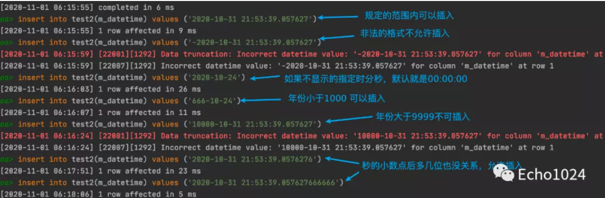
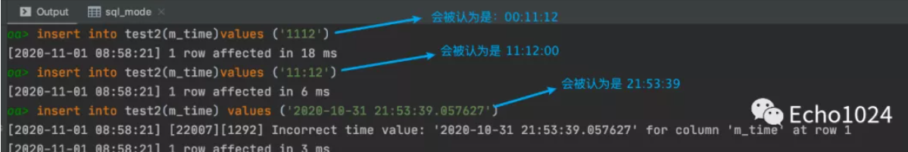

## 一、谈谈MySQL中的基数是啥？

**1、基数是啥？**

大白话讲：基数指的就是MySQL表中某一列的不同值的数量。

如果这一列是唯一索引，那基数 == 行数。

如果这一列是sex，枚举类型只有男女，那它是基数就是2。

Cardinality越高，列就越有成为索引的价值。**MySQL执行计划也会基于Cardinality选择索引。**

通过下面的方式可以看到表中各列的基数。


比如这个经典的例子：

有一列为sex，那对于sex列中存储的值来说 非男即女，它的基数最大就是2。

那也就完全没有必要为sex建立索引。因为，为了提升你基于sex的查询速度，MySQL会为你选择的这个新索引创建一棵全新的B+Tree。但你sex只有两种值，对于MySQL来说，即使它为你指定的列建立了B+Tree索引，真正执行查询时，最多进行一次二分查询，剩下的操作只能是遍历，所以为sex创建索引意义不大。

**2、InnoDB更新基数的时机？**

参数：`innodb_stats_auto_recalc`控制MySQL是否主动重新计算这些持久性的信息。默认为1表示true、0表示false。默认情况下当表中的行变化超过10%时，重新计算基数信息。


**3、基数是估算出来的！**

基数并不会实时更新！而且它是通过采样估算出来的值！至于基数的公式是怎样的，可能并不重要。重要的是你得知道，它是通过随机采样数据页的方式统计出来的一个估算值。而且随机采样的页数可以通过参数：

`innodb_stats_persistent_sample_pages` 设置，默认值是20。

> 这就意味着 基数值并不准确，甚至你每次计算的结果相差还是蛮大的。

**4、基数的持久化机制**

可以通过参数`innodb_stats_persistent` 控制是否持久化基数，默认为off。


当然你可以为一个单独的表设置 `STATS_PERSISTENT=1` 那么它的

 `innodb_stats_persistent`将自动被启用。


开启它的好处是：重启MySQL不会再重复计算这个值，加快重启速度。

**5、如何主动的更新基数？**

执行下面的SQL时都会触发InnoDB更新基数（即使你并没有意识到它会更新基数）。所以尽量选择一个业务低峰期。

- `analyze table tableName;`


如果因为采样的数量太少了，计算的基数就错的离谱。那很可能会导致MySQL的优化器选错索引。这时你可以将这个值适当调大。但是增加太多可能会导致`ANALYZE TABLE`运行缓慢。


反之， `ANALYZE TABLE `运行太慢。你可以适度调整参数`innodb_stats_persistent_sample_pages` 的值。但是这又可能导致基数计算的不准确。

> 如果没有办法平衡两者的关系。可以考虑减少表中索引列的数量或限制分区的数量以降低 ANALYZE TABLE复杂性。表的主键中的列数也很重要，因为主键列被附加到每个非唯一索引中。


## 二、聊聊什么是慢查、如何监控？如何排查？

**1、什么是慢查？**

慢查，顾名思义就是很慢的查询。

SQL的执行总是有一个执行时间的，通过`long_query_time`参数可以告诉MySQL，当SQL的执行时间超过该参数的指定值后就将这条SQL记录在慢查日志中。

默认的`long_query_time`默认值为10s。


**3、怎么调整慢查的时间？**

默认的慢查时长为10s，肯定是需要调整的。

例：设置全局慢查时间为0.2秒。


> 注意：long_query_time属于dynamic类型的参数。
>
> 意思是像上面这样在会话A中通过命令行的方式设置全局 long_query_time为0.2秒后，再打开一个新的会话B查看该变量会发现 long_query_time=0.2
>
> 但是在会话A中查看session级别的long_query_time依然为默认的10s

**4、慢查日志是真实的物理文件吗？**

在MySQL5.1之前确实慢查日志确实是以文件的形式存在。

但是MySQL5.1之后MySQL允许我们可以将慢查日志放入一个数据表中，便于我们查看分析。


现在公司使用的一般都是5.6～5.7版本。当然即使5.1版本之后支持了将数据放入Table中，默认配置依然是File。

当然你也可以通过下面的命令将慢查输出类型改成Table。


**5、慢查有什么危害吗？**

研发同学都知道：对于Linux操作系统来说，一个进程能打开的Socket文件句柄是上限的。即使我们可以动态的调整它的大小，但是也做不到无限大。

通过命令: 查看进程被限制的使用各种资源的量。

```
ulimit -a 
core file size: 进程崩溃是转储文件大小限制
man loaded memort 最大锁定内存大小
open file 能打开的文件句柄数
```

大量的慢查占据MySQL连接（Linux操作系统会为每一条连接创建socket文件），慢查累积到一定程度还会导致正常的SQL得不到连接执行从而变成慢查SQL。

最终有可能导致MySQL的连接全部被耗光而夯死。这就是生产级别的事故了。  

**6、如何监控慢查？**

**5.1、查看曾经执行完成的慢查**

如果你需要编写一个监控程序探测MySQL的慢查询。那完全可以探测分析MySQL的slow.log

如果你还不知道slow.log在哪里，可以像下面这样定位到它。slow.log中记录的就是曾经执行过的慢查信息。


这时你可以尝试使用`select sleep(2);`模拟一条慢查SQL

然后去慢查sql中查看具体的慢查详情。


**5.2、查看正在进行的慢查SQL**

我在A Session中发起SQL：select sleep(60);

然后在B Session中通过下图的方式可以看到当前正在进行的慢查情况。大家在看的时候注意：Command的类型为Query


MySQL也为用户提供了一些原生的慢查工具。比如：查看执行时间最长的10条SQL。

mysqldumpslow -s a1 -n 10  mysql.slow_log

了解即可～


**7、如何处理线上的慢查？**

首先你得知道通常情况下每个公司都有自己监控系统，或者是监控脚本，具体的监控逻辑就是上节讲述的思路。故一旦出现报警，DBA同学会在第一时间接到消息。

DBA同学一般都会去联系业务同学，由业务同学去处理这个慢查。（相信已经工作的同学深有这个体会）

有可能爆出慢查的这套数据库集群是由多个业务同时使用。所以如果慢查影响很严重，DBA同学会询问业务同学是否可以kill 慢查。坚决不能让MySQL夯死！但是kill的方式其实是治标不治本！而且只要kill，就难免会误伤用户的SQL。

你可以像下面这样kill一个SQL

还是这张图：我们可以看到`select sleep(60);`已经执行了56秒了。


于是可以使用 `kill 12` 来断开它占用的连接。

但是kill的方式其实是治标不治本，很可能你刚给它断连，它马上又建立连接了。而且只要kill，就难免会误伤用户的SQL。


**8、影响优化器选错索引的因素？**

**基数：**cardinality的统计是一个估算的结果，而且它也并不会实时的更新。所以这就可能出现一开始由于数据量小且没有代表性。导致基数很低。导致优化器选错了索引。针对这种情况，可以通过analyze table t 重新计算统计信息。

**扫描行数、排序**：更少的扫描行数意味着可能需要更少的磁盘IO，所以MySQL选择扫描行数少的key的可能性就更大。扫描行数并不是优化器选择索引的唯一依据，很可能出现你期望SQL走一个二级索引keyX，但是优化器偏偏走了主键索引。这是因为优化器考虑到了你select  a,b,c,d from xxx;可能还有回表,IO代价也很高。

如果你有order by语句需要mysql帮你做排序，那MySQL就更倾向选一个查询出来的数据本来就有序的索引。


## 三、能谈谈 date、datetime、time、timestamp、year的区别吗？

**1、准备环境**

如果面试官问你：了解 date、datetime、time、timestamp、year 有什么区别吗？

其实大概率就是看你曾经用过哪些，以及有没有留心对比它们的异同。如果你没有时间去做一下小实验，没关系！大概浏览一下我下面的小Case就OK了。

创建下面这张表，下面的 insert sql 都是往这个表中插入数据。


**2、Year**

支持范围：1901～2155 。

> 1901那年清政府签订了《辛丑条约》

在 MySQL5.7.5 中删除了对Year(2)的支持，同一转换为Year(4)。所以如果你使用这个版本的MySQL，会发现它会把年份以4位长度的数字展示给我们看。

你可以尝试插入一个超过它规定的上限2155的值 -- 2156 ，如下：


你会发现MySQL报错了，这是因为默认情况下MySQL开启了严格模式！

针对非法值的插入，MySQL是否报错取决于SQL是否开启了严格模式。

> 白日梦在上一篇“ 对NotNull字段插入Null值有什么现象” 中跟大家提及到了 什么是 sql mode，并且说了几个和日期相关的sql mode。不记得的同学可以去看一下。

比如通过下面的命令关闭严格模式。


然后插入非法值，结果很明显，不会报错。而且MySQL帮你插入了0值。


**3、Date**

支持的范围：1000-01-01 ～ 9999-12-31

下面做几个插入的小实验


上例中使用MySQL5.7，默认的情况下是可以插入比1000-01-01更早的时间的！

那能不能插入0000-00-00呢？这取决于你使用的那种sql mode！

默认情况下是插入不进去的，如下：


插不进去的原因是：mysql5.7 默认的sql mode中开启了严格模式。

且开启使用了参数`NO_ZERO_DATE`。

这个参数与严格模式一起起作用就会导致不能插入 0-0-0。

如果偏偏想插入 0-0-0 可以像下面这样将其去掉，然后重试。


**4、Datetime**

支持范围：1000-01-01 00:00:00.000000  to  9999-12-31 23:59:59.999999

很明显，Datetime比Date更精确。



且Datetime不允许插入数字格式的日期。

**5、Time**

支持范围：-838:59:59.000000  to 838:59:59.000000

time类型不仅可以用来表示24h，还可以用来表示一个时间范围，这个时间范围可能会很大，甚至是负的。

下面做几个小实验：


秒数是满60进1的。

所以我插入60时，在jdbc层面会爆出下面的错误：format exception


可以插入正常的时间


**再看下面这个例子：**

虽然mysql支持往time字中插入`-838:59:59.000000`  但是失败了。


原因如下图: IDE本身通过java的jdbc驱动连接MySQL。

jdbc尝试会将`-838:59:59.000000`  转换成Java的封装类，结果还转失败了。


直接连接MySQL是不会出现上图这种情况的。


> 如果范围超过了 -838:59:59.000000  to 838:59:59.000000 这两个边界值 ，就插入这边界值。

再看几个典型的例子：



**6、Timestamp**

  支持范围： 1970-01-01 00:00:01 UTC to 2038-01-19 03:14:07 UTC

> 因为32位能表示的最大值是2147483647。另外1年365天的总秒数是 31536000，2147483647/31536000 = 68.1，也就是说32位能表示的最长时间是68年，从1970年开始的话，加上68.1，实际最终到2038年01月19日03时14分07秒。
>
> 过了这个上线，所有32位操作系统时间都会变成10000000 00000000 00000000 00000000
>
> 这个问题在64位操作系统中已经不复存在

好，开始我们的实验！

先尝试插入几个零值，无一例外，全部报错失败。


再插入一些大点的值


你会不会诧异这样一个问题：

timestamp合法区间最小值不是1970-01-01 00:00:01吗？

那为什么在上面的例子中我尝试写入插入1970-01-01 00:00:01竟然会失败？

那是因为我机器上的MySQL使用的时区是CST：China Standard Time UT+8:00

以北京时间为准，我们是在东八区。所以最后是+8:00 ， 而不是+0:00


## 四、你有没有搞混查询缓存和BufferPool？谈谈看！

**1、Caches - 查询缓存**

下图是MySQL官网给出的：MySQL架构体系图。

人们常说的查询缓存就是下图中的Cache部分。

如果将MySQL分成 Server层和存储引擎层两大部分，那么Caches位于Server层。


另外你还得知道：

当一个SQL打向MySQL Server之后，MySQL Server首选会从查询缓存中查看是否曾经执行过这个SQL，如果曾经执行过的话，之前执行的查询结果会以Key-Value的形式保存在查询缓存中。key是SQL语句，value是查询结果。我们将这个过程称为查询缓存！

如果查询缓存中没有你要找的数据的话，MySQL才会执行后续的逻辑，通过存储引擎将数据检索出来。并且查询缓存会被shared cache for sessions，是的，它会被所有的session共享。

查询缓存的缺点：

只要有一个sql update了该表，那么表的查询缓存就会失效。所以当你的业务对表CRUD的比例不相上下，那么查询缓存may be会影响应用的吞吐效率。

你可以通过参数 `query_chache_type=demand`禁用查询缓存。并且在mysql8.0的版本中，已经将查询缓存模块删除了。

所以，你可以根据自己的情况考虑一下有没有必要禁用个功能


**2、Buffer Pool**

还是那句话：如果将MySQL分成 Server层和存储引擎层两大部分，那么Buffer Pool位于存储引擎层。

其实大家都知道无论是连接池也好、缓存池也好，只要是XXX池，都是为加速而设计的。比如操作系统的文件系统为了加快数据的读取速度，每次都做低效率的磁盘随机IO设计了缓冲写机制。

> 关注我，白日梦将在本专题系列文章中的第 18 篇文章中跟你介绍相关的系统调用 。

而Buffer Pool就是MySQL存储引擎为了加速数据的读取速度而设计的缓冲机制。下图中的灰色部分就是BufferPool的脑图。（字是真迹，非常之秀气！）


如上图，Buffer中的中的单位是一个个的缓存页。缓存页本质上就是从磁盘中读取进内存的数据页。数据页中存放着一行行的记录。Buffer Pool中的默认大小为128MB，数据页大小16KB。

> 如果你还不清楚什么是数据页，那你可以先这样理解：InnoDB组织数据的最小单位是数据页，简单来说 MySQL都每次从磁盘中读取出来的都是 默认16KB大小的数据页。数据页中有很多条数据。
>
> 我会在第 14 篇文章中详细的和大家分享什么是数据页、预读等知识点。

Buffer Pool中的描述信息以双向链表（LRU）的形式组织在一起。通过数据页的描述信息，我们能找它所描述的缓存页的位置。

看到这里你除了要知道查询缓存和Buffer Pool的所属：前者属于MySQLServer层面，后者属于存储引擎层面。还需要知道另一个知识点：相对于极容易整体失效的查询缓存来说，Buffer Pool是通过InnoDB优化后的LRU算法控制将老化的数据数据从缓存中干掉的，所以Buffer Pool中缓存的数据不会像前者一样一次性整体失效。

> MySQL存储引擎层面除了LRU链表，还有Free链表、Flush链表，本文暂不展开。关注我，白日梦后续会在本专题的文章中一一跟大家分享。


