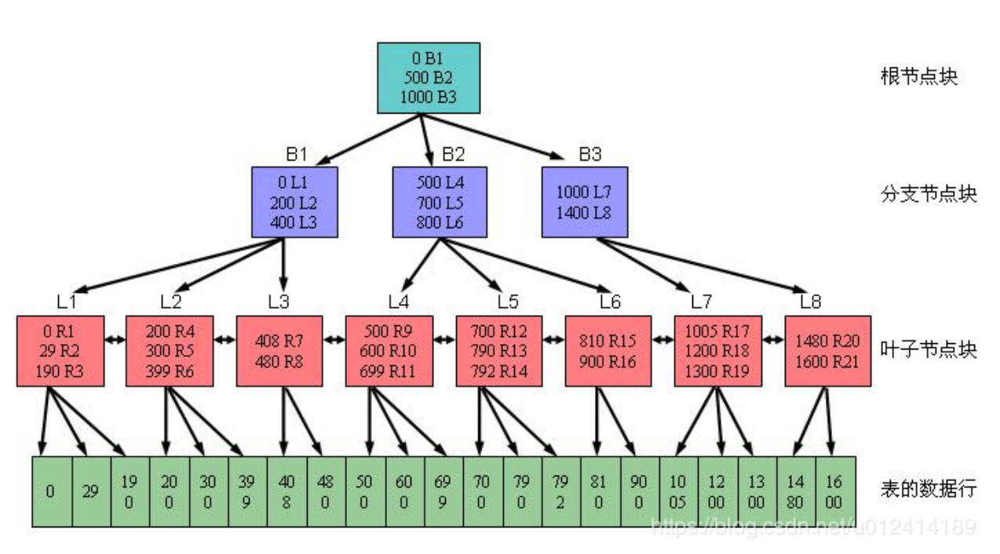

## 一、树

### 1.AVLtree

定义：最先发明的自平衡二叉查找树。在AVL树中任何节点的两个子树的高度最大差别为一，所以它也被称为高度平衡树。查找、插入和删除在平均和最坏情况下都是O（log n）。增加和删除可能需要通过一次或多次树旋转来重新平衡这
个树。
节点的平衡因子是它的左子树的高度减去它的右子树的高度（有时相反）。带有平衡因子1、0或 -1的节点被认为是平衡的。带有平衡因子 -2或2的节点被认为是不平衡的，并需要重新平衡这个树。平衡因子可以直接存储在每个节点中，或
从可能存储在节点中的子树高度计算出来。
一般我们所看见的都是排序平衡二叉树。
AVLtree使用场景：AVL树适合用于插入删除次数比较少，但查找多的情况。插入删除导致很多的旋转，旋转是非常耗时的。AVL 在linux内核的vm area中使用。

### 2、二叉搜索树

二叉搜索树也是一种树，适用与一般二叉树的全部操作，但二叉搜索树能够实现数据的快速查找。
二叉搜索树满足的条件：
	1.非空左子树的所有键值小于其根节点的键值
	2.非空右子树的所有键值大于其根节点的键值
	3.左右子树都是二叉搜索树
二叉搜索树的应用场景：如果是没有退化称为链表的二叉树，查找效率就是lgn，效率不错，但是一旦退换称为链表了，要么使用平衡二叉树，或者之后的RB树，因为链表就是线性的查找效率。

### 3、红黑树的定义

红黑树是一种二叉查找树，但在每个结点上增加了一个存储位表示结点的颜色，可以是RED或者BLACK。通过对任何一条从根到叶子的路径上各个着色方式的限制，红黑树确保没有一条路径会比其他路径长出两倍，因而是接近平衡的。
当二叉查找树的高度较低时，这些操作执行的比较快，但是当树的高度较高时，这些操作的性能可能不比用链表好。红黑树（red-black tree）是一种平衡的二叉查找树，它能保证在最坏情况下，基本的动态操作集合运行时间为O(lgn)。
红黑树必须要满足的五条性质：

性质一：节点是红色或者是黑色； 在树里面的节点不是红色的就是黑色的，没有其他颜色，要不怎么叫红黑树呢，是吧。
性质二：根节点是黑色； 根节点总是黑色的。它不能为红。
性质三：每个叶节点（NIL或空节点）是黑色；
性质四：每个红色节点的两个子节点都是黑色的（也就是说不存在两个连续的红色节点）； 就是连续的两个节点不能是连续的红色，连续的两个节点的意思就是父节点与子节点不能是连续的红色。
性质五：从任一节点到其每个叶节点的所有路径都包含相同数目的黑色节点。从根节点到每一个NIL节点的路径中，都包含了相同数量的黑色节点。

红黑树的应用场景：红黑树是一种不是非常严格的平衡二叉树，没有AVLtree那么严格的平衡要求，所以它的平均查找，增添删除效率都还不错。广泛用在C++的STL中。如map和set都是用红黑树实现的。

### 4、B树定义

B树和平衡二叉树稍有不同的是B树属于多叉树又名平衡多路查找树（查找路径不只两个），不属于二叉搜索树的范畴，因为它不止两路，存在多路。
B树满足的条件：

（1）树种的每个节点最多拥有m个子节点且m>=2,空树除外（注：m阶代表一个树节点最多有多少个查找路径，m阶=m路,当m=2则是2叉树,m=3则是3叉）；
（2）除根节点外每个节点的关键字数量大于等于ceil(m/2)-1个小于等于m-1个，非根节点关键字数必须>=2;（注：ceil()是个朝正无穷方向取整的函数 如ceil(1.1)结果为2)
（3）所有叶子节点均在同一层、叶子节点除了包含了关键字和关键字记录的指针外也有指向其子节点的指针只不过其指针地址都为null对应下图最后一层节点的空格子
（4）如果一个非叶节点有N个子节点，则该节点的关键字数等于N-1;
（5）所有节点关键字是按递增次序排列，并遵循左小右大原则；

B树的应用场景：构造一个多阶的B类树，然后在尽量多的在结点上存储相关的信息，保证层数尽量的少，以便后面我们可以更快的找到信息，磁盘的I/O操作也少一些，而且B类树是平衡树，每个结点到叶子结点的高度都是相同，这也保证了每个查询是稳定的。

### 5、B+树

B+树是B树的一个升级版，B+树是B树的变种树，有n棵子树的节点中含有n个关键字，每个关键字不保存数据，只用来索引，数据都保存在叶子节点。是为文件系统而生的。
相对于B树来说B+树更充分的利用了节点的空间，让查询速度更加稳定，其速度完全接近于二分法查找。为什么说B+树查找的效率要比B树更高、更稳定；我们先看看两者的区别

（1）B+跟B树不同，B+树的非叶子节点不保存关键字记录的指针，这样使得B+树每个节点所能保存的关键字大大增加；
（2）B+树叶子节点保存了父节点的所有关键字和关键字记录的指针，每个叶子节点的关键字从小到大链接；
（3）B+树的根节点关键字数量和其子节点个数相等;
（4）B+的非叶子节点只进行数据索引，不会存实际的关键字记录的指针，所有数据地址必须要到叶子节点才能获取到，所以每次数据查询的次数都一样；

特点：
在B树的基础上每个节点存储的关键字数更多，树的层级更少所以查询数据更快，所有指关键字指针都存在叶子节点，所以每次查找的次数都相同所以查询速度更稳定;
应用场景： 用在磁盘文件组织 数据索引和数据库索引。

### 6、Trie树（字典树）

trie，又称前缀树，是一种有序树，用于保存关联数组，其中的键通常是字符串。与二叉查找树不同，键不是直接保存在节点中，而是由节点在树中的位置决定。一个节点的所有子孙都有相同的前缀，也就是这个节点对应的字符串，而根
节点对应空字符串。一般情况下，不是所有的节点都有对应的值，只有叶子节点和部分内部节点所对应的键才有相关的值。
在图示中，键标注在节点中，值标注在节点之下。每一个完整的英文单词对应一个特定的整数。Trie 可以看作是一个确定有限状态自动机，尽管边上的符号一般是隐含在分支的顺序中的。
键不需要被显式地保存在节点中。图示中标注出完整的单词，只是为了演示 trie的原理。

trie树的优点：利用字符串的公共前缀来节约存储空间，最大限度地减少无谓的字符串比较，查询效率比哈希表高。缺点：Trie树是一种比较简单的数据结构.理解起来比较简单,正所谓简单的东西也得付出代价.故Trie树也有它的缺点,Trie树的内存消耗非常大.

其基本性质可以归纳为：

1. 根节点不包含字符，除根节点外每一个节点都只包含一个字符。
2. 从根节点到某一节点，路径上经过的字符连接起来，为该节点对应的字符串。
3. 每个节点的所有子节点包含的字符都不相同。

典型应用是用于统计，排序和保存大量的字符串（但不仅限于字符串），所以经常被搜索引擎系统用于文本词频统计。字典树与字典很相似,当你要查一个单词是不是在字典树中,首先看单词的第一个字母是不是在字典的第一层,如果不在,说
明字典树里没有该单词,如果在就在该字母的孩子节点里找是不是有单词的第二个字母,没有说明没有该单词,有的话用同样的方法继续查找.字典树不仅可以用来储存字母,也可以储存数字等其它数据。

## 二、算法

### 1、贪心算法和动态规划的区别

贪心算法：局部最优，划分的每个子问题都最优，得到全局最优，但是不能保证是全局最优解，所以对于贪心算法来说，解是从上到下的，一步一步最优，直到最后。
动态规划：将问题分解成重复的子问题，每次都寻找左右子问题解中最优的解，一步步得到全局的最优解.重复的子问题可以通过记录的方式，避免多次计算。
所以对于动态规划来说，解是从小到上，从底层所有可能性中找到最优解，再一步步向上。
分治法：和动态规划类似，将大问题分解成小问题，但是这些小问题是独立的，没有重复的问题。独立问题取得解，再合并成大问题的解。
例子：比如钱币分为1元3元4元，要拿6元钱，贪心的话，先拿4，再拿两个1，一共3张钱；实际最优却是两张3元就够了。

### 2、快排存在的问题，如何优化

快排的时间复杂度
时间复杂度最快平均是O（nlogn）,最慢的时候是O(n2);辅助空间也是O(logn)；最开始学快排时最疑惑的就是这个东西不知道怎么得来的，一种是通过数学运算可以的出来，还有一种是通过递归树来理解就容易多了