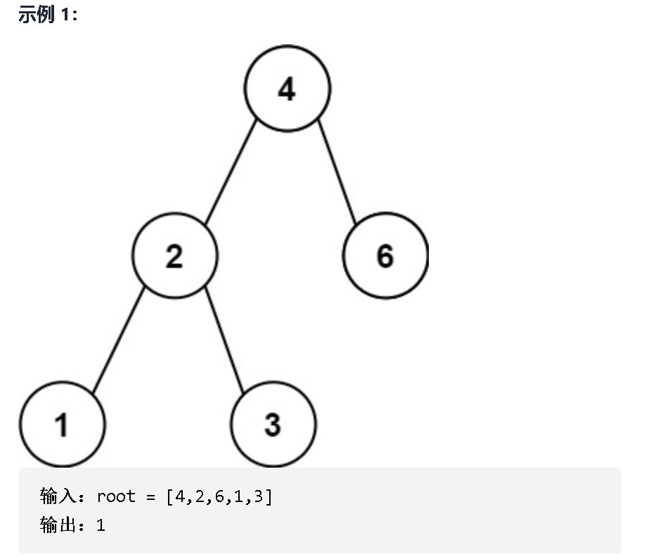
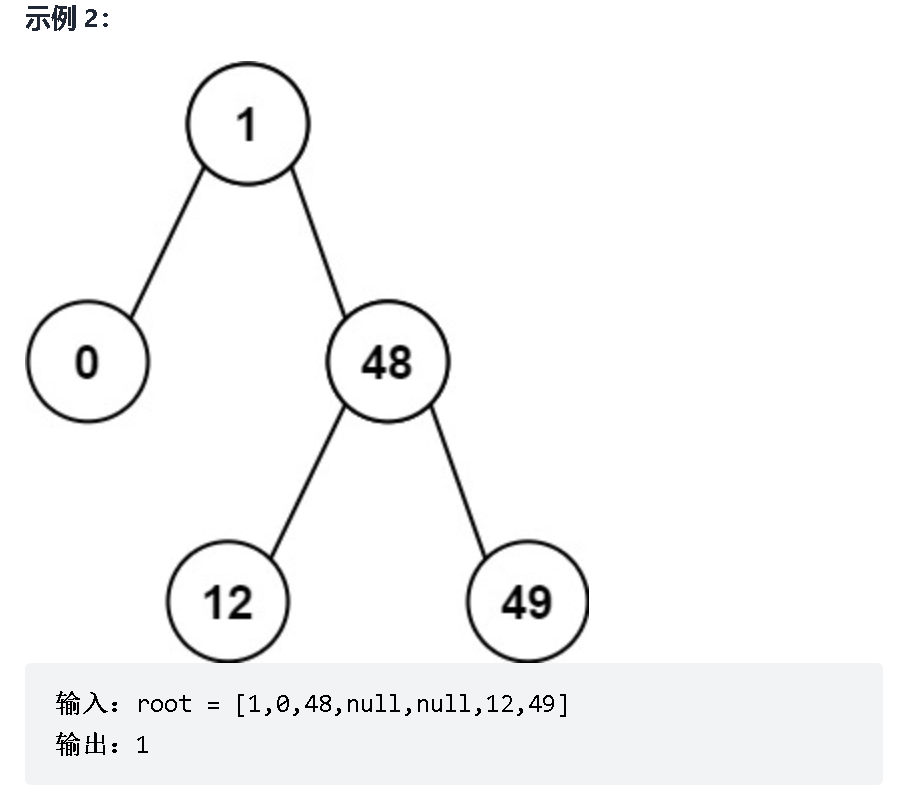
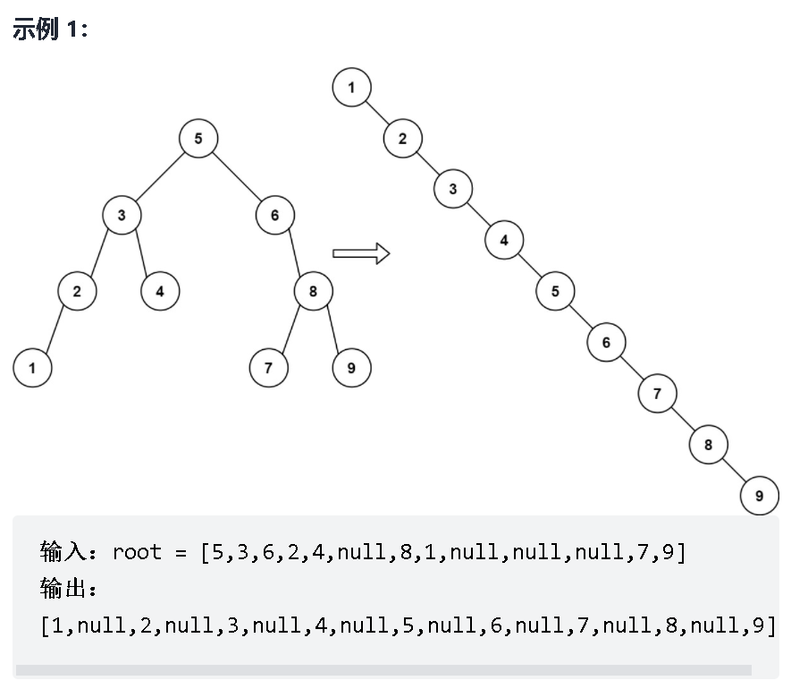
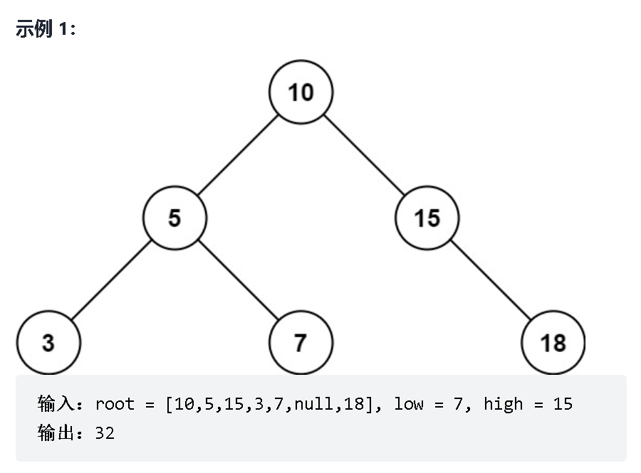
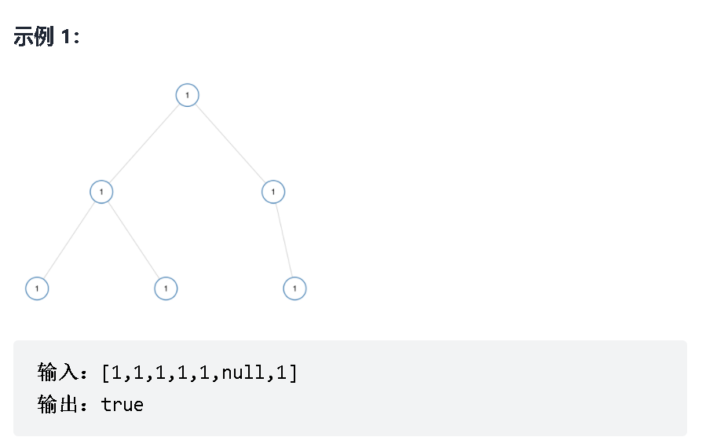
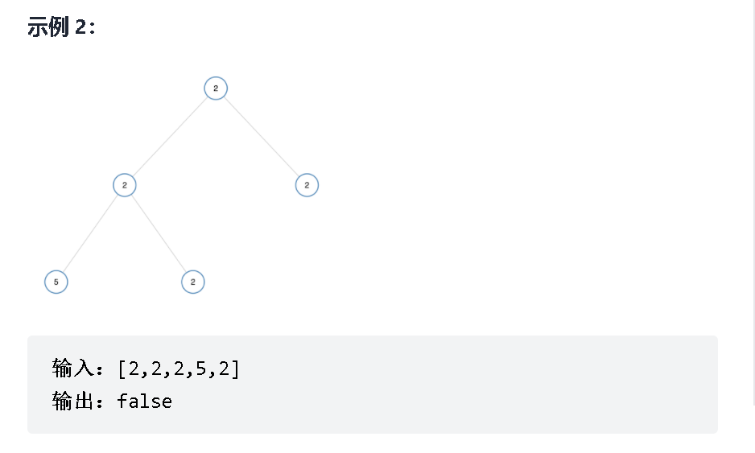
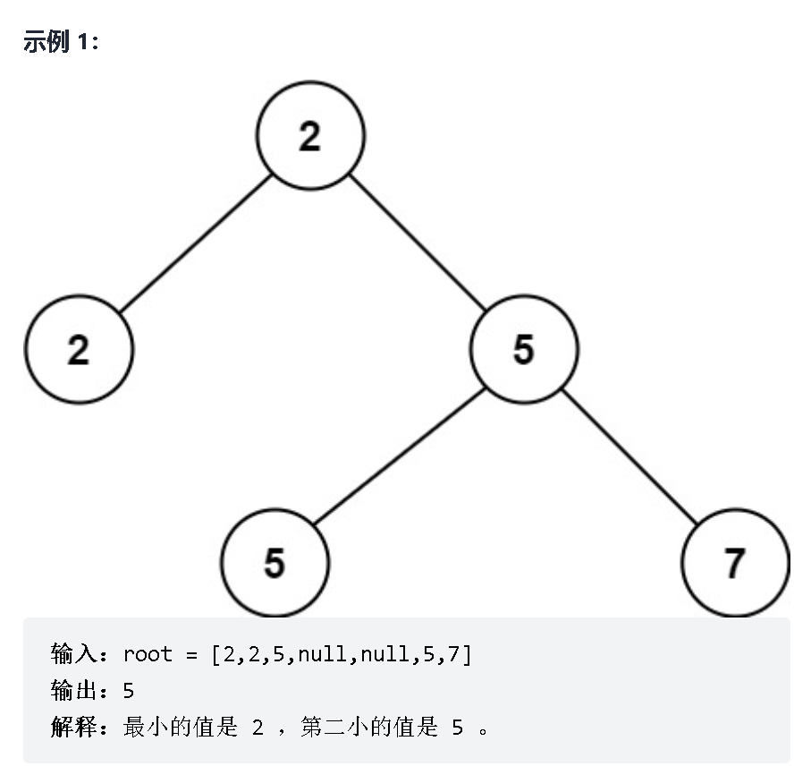
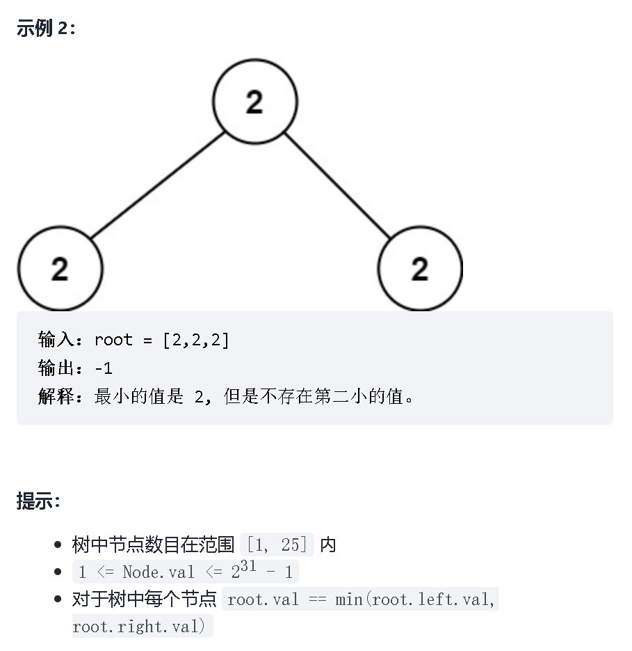

## 一、数组

### 1、杨辉三角

给定一个非负整数 *`numRows`，*生成「杨辉三角」的前 *`numRows`* 行。

在「杨辉三角」中，每个数是它左上方和右上方的数的和。


示例 1:

输入: numRows = 5
输出: [[1],[1,1],[1,2,1],[1,3,3,1],[1,4,6,4,1]]
示例 2:

输入: numRows = 1
输出: [[1]]

解题：

```java
class Solution {
    public List<List<Integer>> generate(int numRows) {
        List<List<Integer>> rowList = new ArrayList<>();
        
        //每一行各自执行一次循环，然后把该行执行循环获得的值存放到最外层list里
        for(int i=0; i<=numRows-1; i++){
            //每一行用于存放各个下标对应值的list
            List<Integer> colList = new ArrayList<>();
            //如果是第一行和第二行，那么每一行的list，各个下标对应位置存放的都是1
            if(i<=1){
                for(int j=0; j<=i; j++){
                    colList.add(1);
                }
            //从第三行开始，开始出现例外
            }else{
                  for(int j=0; j<=i; j++){
                    //除去第一个位置与最后一个位置都是1之外，其他数字，都是它左上方和右上方的数的和
                    if(j==0 || j==i){
                        colList.add(1);
                    }else{
                        //左上方和右上方的数的和，本质是上一行list列表，j-1位置与j位置上数的和
                        //因此，只需要获取上一个列表，然后获取其j-1位置与j位置上数的和就可以了
                        colList.add(rowList.get(i-1).get(j-1)+rowList.get(i-1).get(j));
                    }
                   
                }
            }
            //将每一行所得list存放到最外层的list列表
            rowList.add(colList);
        }
        return rowList;
    }
}
```


### 2、买卖股票的最佳时机

给定一个数组 prices ，它的第 i 个元素 prices[i] 表示一支给定股票第 i 天的价格。

你只能选择 某一天 买入这只股票，并选择在 未来的某一个不同的日子 卖出该股票。设计一个算法来计算你所能获取的最大利润。

返回你可以从这笔交易中获取的最大利润。如果你不能获取任何利润，返回 0 。

示例 1：

输入：[7,1,5,3,6,4]
输出：5
解释：在第 2 天（股票价格 = 1）的时候买入，在第 5 天（股票价格 = 6）的时候卖出，最大利润 = 6-1 = 5 。
     注意利润不能是 7-1 = 6, 因为卖出价格需要大于买入价格；同时，你不能在买入前卖出股票。
示例 2：

输入：prices = [7,6,4,3,1]
输出：0
解释：在这种情况下, 没有交易完成, 所以最大利润为 0。

```java
class Solution {
    public int maxProfit(int[] prices) {
        //暴力破解
        // int max = 0;
        // for(int i=0; i<prices.length-1; i++){
        //     for(int j=i+1; j<prices.length;j++){
        //         int num = prices[j]-prices[i];
        //         if( num>max){
        //             max = num;
        //         }
        //     }
        // }
        // return max;

        //单循环
        int minPrice = Integer.MAX_VALUE;
        int maxPrice = 0;
        //找到最小
        for(int i=0;i<prices.length;i++){
            if(prices[i]<minPrice){
                minPrice = prices[i];
            //保存利润最大的
            }else if(prices[i] - minPrice > maxPrice){
                maxPrice = prices[i] - minPrice;
            }
        }

        return maxPrice;

    }
}
```


### 3、比特位计数

给你一个整数 n ，对于 0 <= i <= n 中的每个 i ，计算其二进制表示中 1 的个数 ，返回一个长度为 n + 1 的数组 ans 作为答案。

示例 1：

输入：n = 2
输出：[0,1,1]
解释：
0 --> 0
1 --> 1
2 --> 10
示例 2：

输入：n = 5
输出：[0,1,1,2,1,2]
解释：
0 --> 0
1 --> 1
2 --> 10
3 --> 11
4 --> 100
5 --> 101

解析——


```java
class Solution {
    public int[] countBits(int n) {
        int[] num = new int[n+1];
        for(int i=0;i<=n;i++){
            if(i%2==0){
                num[i] = num[i/2];//判断，如果为偶数，则1的个数不变，只是在后面加了0
            }else{
                num[i] = num[i-1]+1;//判断为奇数，则在之前的加上1
            }
        }

        return num;
    }
}
```


### 4、存在重复元素

给定一个整数数组，判断是否存在重复元素。

如果存在一值在数组中出现至少两次，函数返回 true 。如果数组中每个元素都不相同，则返回 false 。

 

示例 1:

输入: [1,2,3,1]
输出: true
示例 2:

输入: [1,2,3,4]
输出: false
示例 3:

输入: [1,1,1,3,3,4,3,2,4,2]
输出: true

解析——

```java
class Solution {
    public boolean containsDuplicate(int[] nums) {
        // Map<Integer,Integer> map = new HashMap<>();
        // for(int i = 0; i<nums.length; i++){
        //     if(map.containsKey(nums[i])){
        //         return true;
        //     }else{
        //         map.put(nums[i],1);
        //     }
        // }
        // return false;
        Set<Integer> set = new HashSet<>();
        int len = nums.length;
        for(int i = 0; i<len; i++){
           if(!set.add(nums[i])){
               return true;
           }
        }
        return false;
        
    }
}
```


### 5、存在重复元素 II

给定一个整数数组和一个整数 k，判断数组中是否存在两个不同的索引 i 和 j，使得 nums [i] = nums [j]，并且 i 和 j 的差的 绝对值 至多为 k。

 

示例 1:

输入: nums = [1,2,3,1], k = 3
输出: true
示例 2:

输入: nums = [1,0,1,1], k = 1
输出: true
示例 3:

输入: nums = [1,2,3,1,2,3], k = 2
输出: false

```java
class Solution {
    public boolean containsNearbyDuplicate(int[] nums, int k) {
        Map<Integer,Integer> map = new HashMap<>();
        for(int i = 0; i< nums.length ; i++){
           if(map.containsKey(nums[i])){
               if(i-map.get(nums[i])<=k){
                   return true;
               }
               //第一次提交，案例[1,0,1,1]  1出错，发现这里需要增加该行代码，如果不增加，每次出现相同的，都是减最早出现的那个，但题目要求 i 和 j 的差的 绝对值 至多为 k，也就是说，取最小值就可以
               map.put(nums[i],i);
           }else{
               map.put(nums[i],i);
           }
        }
        return false;
    }
}
```


### 6、丢失的数字

给定一个包含 [0, n] 中 n 个数的数组 nums ，找出 [0, n] 这个范围内没有出现在数组中的那个数。

 

示例 1：

输入：nums = [3,0,1]
输出：2
解释：n = 3，因为有 3 个数字，所以所有的数字都在范围 [0,3] 内。2 是丢失的数字，因为它没有出现在 nums 中。
示例 2：

输入：nums = [0,1]
输出：2
解释：n = 2，因为有 2 个数字，所以所有的数字都在范围 [0,2] 内。2 是丢失的数字，因为它没有出现在 nums 中。
示例 3：

输入：nums = [9,6,4,2,3,5,7,0,1]
输出：8
解释：n = 9，因为有 9 个数字，所以所有的数字都在范围 [0,9] 内。8 是丢失的数字，因为它没有出现在 nums 中。
示例 4：

输入：nums = [0]
输出：1
解释：n = 1，因为有 1 个数字，所以所有的数字都在范围 [0,1] 内。1 是丢失的数字，因为它没有出现在 nums 中。


解析：

求和法：

数学法则：1+2+3+4+5+6......+n=n（n+1）/2

解析——

```java
class Solution {
    public int missingNumber(int[] nums) {
        int len = nums.length;
        int total = len*(len+1)/2;
        for(int i = 0; i<nums.length; i++){
            total = total - nums[i];
        }
        return total;
    }
}
```


### 7、两个数组的交集

给定两个数组，编写一个函数来计算它们的交集。

 

示例 1：

输入：nums1 = [1,2,2,1], nums2 = [2,2]
输出：[2]
示例 2：

输入：nums1 = [4,9,5], nums2 = [9,4,9,8,4]
输出：[9,4]


说明：

输出结果中的每个元素一定是唯一的。
我们可以不考虑输出结果的顺序。

代码解析——

```java
class Solution {
    public int[] intersection(int[] nums1, int[] nums2) {
        //将交集存储到哈希中
        Map<Integer,Boolean> map = new HashMap<>();
        //遍历判断是否有交集
        for(int i = 0; i<nums1.length; i++){
            for(int j = 0;j<nums2.length; j++){
                if(nums1[i] == nums2[j]){
                    map.put(nums1[i],true);
                }
            }
        }

        int[] val = new int[map.size()];
        int count = 0;
        //将交集数组存储到数组当中
        for(Map.Entry<Integer,Boolean> entry:map.entrySet()){
            val[count++] = entry.getKey();
        }
        return val;
    }
}
```

### 8、有序数组的平方

给你一个按 非递减顺序 排序的整数数组 nums，返回 每个数字的平方 组成的新数组，要求也按 非递减顺序 排序。

 

示例 1：

输入：nums = [-4,-1,0,3,10]
输出：[0,1,9,16,100]
解释：平方后，数组变为 [16,1,0,9,100]
排序后，数组变为 [0,1,9,16,100]
示例 2：

输入：nums = [-7,-3,2,3,11]
输出：[4,9,9,49,121]


提示：

1 <= nums.length <= 104
-104 <= nums[i] <= 104
nums 已按 非递减顺序 排序


进阶：

请你设计时间复杂度为 O(n) 的算法解决本问题

代码解析——

```java
class Solution {
    public int[] sortedSquares(int[] nums) {
        //双指针算法
        int p = 0, q = nums.length - 1;
        //创建一个新数组，用户存放平方后的元素
        int[] res = new int[nums.length];
        //新数组索引
        int j = nums.length -1;
        //左指针等于右指针时，说明已经遍历完成
        while(p <= q){
            //因为是按照非递减顺序，故而一旦左指针元素大于右指针元素，说明p指针应该找的了插入位置
            //同时，新数组也在同步将数据存入
            //每次循环，满足第一个条件话，p往后走一步，不满足话，就右指针往前走一步
            //核心：每次遍历获取到最大值，按顺序从新数组右边插入，也就是递减插入
            if(nums[p] * nums[p] > nums[q] * nums[q]){
                res[j--] = nums[p] * nums[p++];
            }else{
                res[j--] = nums[q] * nums[q--];
            }
        }
        return res;
    }
}
```


## 二、字符串

### 1、验证回文串

给定一个字符串，验证它是否是回文串，只考虑字母和数字字符，可以忽略字母的大小写。

说明：本题中，我们将空字符串定义为有效的回文串。

 

示例 1:

输入: "A man, a plan, a canal: Panama"
输出: true
解释："amanaplanacanalpanama" 是回文串
示例 2:

输入: "race a car"
输出: false
解释："raceacar" 不是回文串

解析——

```java
class Solution {
    public boolean isPalindrome(String s) {
        
        String str = s.toUpperCase();
        StringBuffer result = new StringBuffer();
        String newStr = "";
        boolean flag = true;
        //保留字母或者数字，去掉其他字符
        for(int i=0; i<s.length();i++){
            char ch =  str.charAt(i);
            if(Character.isLetterOrDigit(ch)){
                result.append(ch);
            }
        }
        //使用双指针，左边递增，右边递减，过程有某个字符不相同，代表不对称
        int p = 0,q = result.length()-1;
        while(p<q){
            if(!(result.charAt(p++)+"").equals((result.charAt(q--)+""))){
                flag=false;
                break;
            }
        }
        return flag;
    }
}
```


### 2、Excel 表列序号

给你一个字符串 columnTitle ，表示 Excel 表格中的列名称。返回该列名称对应的列序号。

 

例如，

    A -> 1
    B -> 2
    C -> 3
    ...
    Z -> 26
    AA -> 27
    AB -> 28 
    ...


示例 1:

输入: columnTitle = "A"
输出: 1
示例 2:

输入: columnTitle = "AB"
输出: 28
示例 3:

输入: columnTitle = "ZY"
输出: 701

解析——

```java
class Solution {
    public int titleToNumber(String columnTitle) {
        int num = 0;
        int len = columnTitle.length();
        int multiple = 1;
        for( int i=len-1; 0<=i;i--){
         //倒数获取最后一个字符开始
            char str = columnTitle.charAt(i);
         //将字符减去'A'后加1，即得到该字符所在位置
            int val = str - 'A'+1;
         //将对应字符乘上multiple，假如是BA，就相当是2*26,
            num +=  multiple*val;
         //每前进一位，例如，二位数情况，相当是第一位有26种情况，第二位有26种情况，那么就有26*26种情况
            multiple=multiple*26;
        }
    return num;
    }
}
```


### 3、Excel表列名称

给你一个整数 columnNumber ，返回它在 Excel 表中相对应的列名称。

例如：

A -> 1
B -> 2
C -> 3
...
Z -> 26
AA -> 27
AB -> 28 
...


示例 1：

输入：columnNumber = 1
输出："A"
示例 2：

输入：columnNumber = 28
输出："AB"
示例 3：

输入：columnNumber = 701
输出："ZY"
示例 4：

输入：columnNumber = 2147483647
输出："FXSHRXW"

解题——

```java
class Solution {
    public String convertToTitle(int columnNumber) {
        StringBuilder sb = new StringBuilder();
        while(columnNumber>0){
            //找到第一个字符的位置
            int col = (columnNumber - 1)%26 +1;
            //将位置从'A'开始算起，即可转换成对应的字符
            sb.append((char)(col-1+'A'));
            //可以得到剩余还有多少位
            columnNumber = (columnNumber - col)/26;
        }
        return sb.reverse().toString();
    }
}
```


### 4、同构字符串

给定两个字符串 s 和 t，判断它们是否是同构的。

如果 s 中的字符可以按某种映射关系替换得到 t ，那么这两个字符串是同构的。

每个出现的字符都应当映射到另一个字符，同时不改变字符的顺序。不同字符不能映射到同一个字符上，相同字符只能映射到同一个字符上，字符可以映射到自己本身。

 

示例 1:

输入：s = "egg", t = "add"
输出：true
示例 2：

输入：s = "foo", t = "bar"
输出：false
示例 3：

输入：s = "paper", t = "title"
输出：true

解析——

```java
class Solution {
    public boolean isIsomorphic(String s, String t) {
        //使用双指针算法
        int p = 0,q = 0;
     
        Map<Character,Character> map1 = new HashMap<>();
        Map<Character,Character> map2 = new HashMap<>();

        while(p< s.length()){

            Character pc = s.charAt(p);
            Character qc = t.charAt(q);
            //一、判断哈希是否已经包含该字符，若包含，说明是字符重复的
            //二、字符重复情况下，判断是否是映射关系，即 map.get(pc)!=qc，若都不满足，即非映射，即非同构字符串
            if(map1.containsKey(pc)&&map1.get(pc)!=qc || map2.containsKey(qc)&&map2.get(qc)!=pc){
                return false;
            }
		   //相互进行映射
            map1.put(pc,qc);
            map2.put(qc,pc);

            p++;
            q++;
            
        }
        return true;
    }
}
```


### 5、判定是否互为字符重排

给定两个字符串 s1 和 s2，请编写一个程序，确定其中一个字符串的字符重新排列后，能否变成另一个字符串。

示例 1：

输入: s1 = "abc", s2 = "bca"
输出: true 
示例 2：

输入: s1 = "abc", s2 = "bad"
输出: false
说明：

0 <= len(s1) <= 100
0 <= len(s2) <= 100

```java
class Solution {
    //思路一
    public boolean CheckPermutation(String s1, String s2) {
        int len1 = s1.length(),len2 = s2.length();

        if(len1!=len2){
            return false;
        }
        //1、前提：长度一样长的字符串，
        //2、map1存储s1当中各个字符出现次数，map2存储s2当中各个字符出现次数
        Map<Character,Integer> map1 = new HashMap<>();
        Map<Character,Integer> map2 = new HashMap<>();
        for(int i = 0; i<len1;i++){
            char ch1 = s1.charAt(i);
            char ch2 = s2.charAt(i);
            // if(map1.containsKey(ch1)){
            //     map1.put(ch1,map1.get(ch1)+1);
            // }else{
            //     map1.put(ch1,1);
            // }
            int int1 = map1.containsKey(ch1)?map1.get(ch1):0;
            map1.put(ch1,int1+1);

            //  if(map2.containsKey(ch2)){
            //     map2.put(ch2,map2.get(ch2)+1);
            // }else{
            //     map2.put(ch2,1);
            // }
            int int2 = map2.containsKey(ch2)?map2.get(ch2):0;
            map2.put(ch2,int2+1);
          
        }
        //3、循环map1中各字符与map2当中比较出现次数是否一样，若不一样，说明无法进行重排
        for(Map.Entry<Character,Integer> entry:map1.entrySet()){
            Character ch = entry.getKey();
            //若map1存在map2没有的字符，说明无法进行重排
            if(!map2.containsKey(ch)){
                return false;
            }
            //若map1存在map2出现次数不一致的字符，说明无法进行重排
            if(entry.getValue()!=map2.get(ch)){
                return false;
            }
        }
        return true;
    }


//思路二
     public boolean CheckPermutation(String s1, String s2) {
        int len1 = s1.length(),len2 = s2.length();

        if(len1!=len2){
            return false;
        }

        Map<Character,Integer> map = new HashMap<>();
        //统计s1各字符出现次数
        for(int i = 0; i<len1;i++){
            char ch1 = s1.charAt(i);
            int int1 = map.containsKey(ch1)?map.get(ch1):0;
            map.put(ch1,int1+1);     
        }
		//将s2各字符通过map.get(字符)形式取出存储在map的字符对应出现次数,
        //每次取出次数进行减1，当该字符出现次数递减到1时，就remove掉该key,
        //若是重排字符串，最后map里的key是可以被全部remove掉的,
        for(int i = 0; i<len1;i++){
            char ch2 = s2.charAt(i);
            
            if(map.containsKey(ch2)){
                int value = map.get(ch2);
                if(value!=1){
                    map.put(ch2,value-1);
                }else{
                    map.remove(ch2);
                }
            //若s2中某个字符不存在于map当中，说明s2存在着是s1没有的字符，说明两字符无法互为字符重排   
            }else{
                return false;
            }
        }
        return map.size()==0?true:false;
    }
}
```


### 6、字符串压缩

字符串压缩。利用字符重复出现的次数，编写一种方法，实现基本的字符串压缩功能。比如，字符串aabcccccaaa会变为a2b1c5a3。若“压缩”后的字符串没有变短，则返回原先的字符串。你可以假设字符串中只包含大小写英文字母（a至z）。

示例1:

 输入："aabcccccaaa"
 输出："a2b1c5a3"
示例2:

 输入："abbccd"
 输出："abbccd"
 解释："abbccd"压缩后为"a1b2c2d1"，比原字符串长度更长。

```java
class Solution {
    public String compressString(String S) {
        int oldLen = S.length();
        if(oldLen == 0){
            return S;
        }
        //设置比较的字符
        char ch = S.charAt(0);
        //第一个开始，即有一个
        int num = 1;
        StringBuilder sb = new StringBuilder();
        //模拟遍历压缩
        for(int i = 1; i<oldLen; i++){
            //如果与比较的字符相等，说明压缩数量增加
            if(ch == S.charAt(i)){
                num++;
            }else{
                //如果不相等，先保存已经压缩的，然后从下一个不同的字符开始继续压缩
                sb.append(ch).append(num);
                ch = S.charAt(i);
                num = 1;
            }
        } 
       //拼接最后已经压缩完成的字符
       sb.append(ch);
       sb.append(num);
       //最后一步，即比较压缩前的字符串与压缩后的字符串长度比较，如果比压缩前的字符还长，故而不需要压缩
       return sb.length()>=oldLen?S:sb.toString();

    }
}
```


### 7、有效的字母异位词

给定两个字符串 s 和 t ，编写一个函数来判断 t 是否是 s 的字母异位词。

注意：若 s 和 t 中每个字符出现的次数都相同，则称 s 和 t 互为字母异位词。

 

示例 1:

输入: s = "anagram", t = "nagaram"
输出: true
示例 2:

输入: s = "rat", t = "car"
输出: false


提示:

1 <= s.length, t.length <= 5 * 104
s 和 t 仅包含小写字母

解析——

```java
class Solution {
    public boolean isAnagram(String s, String t) {
        if(s.length() != t.length()){
            return false;
        }
        //通过哈希来统计s字符串各个字符出现的次数
        Map<Character,Integer> map = new HashMap<>();
        for(int i = 0; i<s.length(); i++){
            char str = s.charAt(i);
            if(map.containsKey(str)){
                map.put(str,map.get(str)+1);
            }else{
                map.put(str,1);
            }
        }
        //根据t字符串来递减map各字符出现的次数
        for(int i = 0; i<t.length(); i++){
             char str = t.charAt(i);
            
            if(map.containsKey(str)){
               //根据出现的次数来递减map缓存的字符，递减到剩余一个时，直接移除
               if(map.get(str)!=1){
                    map.put(str,map.get(str)-1);
               }else{
                   map.remove(str);
               }
            }else{
                //若出现t字符在map不存在的情况，那么就不符合字母异或位
                return false;
            } 
        }
        //异或字符串情况时，map.size()应该等于1
        return map.size()>1?false:true;
    }
}
```


8、[最长回文子串](https://leetcode-cn.com/problems/longest-palindromic-substring/)

给你一个字符串 s，找到 s 中最长的回文子串。

 

示例 1：

输入：s = "babad"
输出："bab"
解释："aba" 同样是符合题意的答案。
示例 2：

输入：s = "cbbd"
输出："bb"
示例 3：

输入：s = "a"
输出："a"
示例 4：

输入：s = "ac"
输出："a"


提示：

1 <= s.length <= 1000
s 仅由数字和英文字母（大写和/或小写）组成

代码——

```java
class Solution {
    public String longestPalindrome(String s) {
        int  len = s.length();
        if(len < 2) return s;
        int maxLen = 0;
        //数组第一位记录起始位置，第二位记录长度
        int[] res = new int[2];
        for(int i = 0; i < s.length(); i++){
            int[] old = centerSpread(s,i,i);
            int[] even = centerSpread(s,i,i+1);
            int[] max = old[1] > even[1] ? old : even;
            if(max[1] > maxLen){
                res = max;
                maxLen = max[1];
            }
        }
        return s.substring(res[0],res[0]+res[1]);
    }
    
    private int[] centerSpread(String s,int left,int right){
        int len = s.length();
        while(left >= 0 && right < len){
            if(s.charAt(left) == s.charAt(right)){
                left--;
                right++;
            }else{
                break;
            }
        }
        
        return new int[]{left + 1, right - left - 1};
    }
}
```


## 三、动态规划

### 1、爬楼梯

假设你正在爬楼梯。需要 n 阶你才能到达楼顶。

每次你可以爬 1 或 2 个台阶。你有多少种不同的方法可以爬到楼顶呢？

注意：给定 n 是一个正整数。

示例 1：

输入： 2
输出： 2
解释： 有两种方法可以爬到楼顶。
1.  1 阶 + 1 阶
2.  2 阶
示例 2：

输入： 3
输出： 3
解释： 有三种方法可以爬到楼顶。
1.  1 阶 + 1 阶 + 1 阶
2.  1 阶 + 2 阶
3.  2 阶 + 1 阶

解析——

```java
class Solution {
    public int climbStairs(int n) {
        int[] data = new int[n+1];
        return climbS(n,data);
    }
    public int climbS(int n,int[] data) {
        if(data[n]>0){
            return data[n];
        }
        if(n==1){
           data[n]=1;
        }else if(n==2){
            data[n]=2;
        }else{
             data[n]=climbS(n-2,data)+climbS(n-1,data);
        }
        return data[n];
    }
}
```

### 2、斐波那契数

斐波那契数，通常用 F(n) 表示，形成的序列称为 斐波那契数列 。该数列由 0 和 1 开始，后面的每一项数字都是前面两项数字的和。也就是：

F(0) = 0，F(1) = 1
F(n) = F(n - 1) + F(n - 2)，其中 n > 1
给你 n ，请计算 F(n) 。

 

示例 1：

输入：2
输出：1
解释：F(2) = F(1) + F(0) = 1 + 0 = 1
示例 2：

输入：3
输出：2
解释：F(3) = F(2) + F(1) = 1 + 1 = 2
示例 3：

输入：4
输出：3
解释：F(4) = F(3) + F(2) = 2 + 1 = 3


提示：

0 <= n <= 30


解析——

```java
class Solution {
    public int fib(int n) {
        //n等于0情况，直接返回0
        if (n < 1) return 0;
        int[] data = new int[n+1];
        return fn(n,data);
    }


    public int fn(int n,int[] data){
        //不等于0，可以直接返回值
        if(data[n]!=0){
            return data[n];
        }
        if(n == 1 || n == 2){
            data[n] = 1;
        }else{
            data[n] = fn(n-2,data)+fn(n-1,data);
        }
        return data[n];
    }
}
```

### 3、第 N 个泰波那契数

泰波那契序列 Tn 定义如下： 

T0 = 0, T1 = 1, T2 = 1, 且在 n >= 0 的条件下 Tn+3 = Tn + Tn+1 + Tn+2

给你整数 n，请返回第 n 个泰波那契数 Tn 的值。

示例 1：

输入：n = 4
输出：4
解释：
T_3 = 0 + 1 + 1 = 2
T_4 = 1 + 1 + 2 = 4
示例 2：

输入：n = 25
输出：1389537


提示：

0 <= n <= 37
答案保证是一个 32 位整数，即 answer <= 2^31 - 1。

解析——

```java
class Solution {
    public int tribonacci(int n) {
       int[] dp = new int[n+1];
       if(n==0){
           return 0;
       }
       if(n<=2){
           return 1;
       }
       dp[0] = 0;dp[1] =1 ; dp[2] = 1;
       for(int i = 3;i <= n; i++){
           dp[i] = dp[i-1] + dp[i-2] +dp[i-3];
       }
       return dp[n];
    }
}
```


## 四、哈希表

### 1、回文排列

给定一个字符串，编写一个函数判定其是否为某个回文串的排列之一。

回文串是指正反两个方向都一样的单词或短语。排列是指字母的重新排列。

回文串不一定是字典当中的单词。

示例1：

输入："tactcoa"
输出：true（排列有"tacocat"、"atcocta"，等等）

```java
class Solution {
    public boolean canPermutePalindrome(String s) {
        int len = s.length();
        if(len == 0){
            return true;
        }
        Map<Character,Integer> map = new HashMap<>();
        //通过哈希map来缓存与移除，若是能实现回文排列，奇数只剩一个key，偶数剩零个key
        for(int i = 0;i<len;i++){
            char ch = s.charAt(i);
            if(map.containsKey(ch)){
                map.remove(ch);
            }else{
                map.put(ch,1);
            }
        }
        return (map.size()<=1)?true:false;
    }
}
```


## 五、排序


## 六、二叉树

### 1、相同的树

给你两棵二叉树的根节点 `p` 和 `q` ，编写一个函数来检验这两棵树是否相同。

如果两个树在结构上相同，并且节点具有相同的值，则认为它们是相同的。

```java
/**
 * Definition for a binary tree node.
 * public class TreeNode {
 *     int val;
 *     TreeNode left;
 *     TreeNode right;
 *     TreeNode() {}
 *     TreeNode(int val) { this.val = val; }
 *     TreeNode(int val, TreeNode left, TreeNode right) {
 *         this.val = val;
 *         this.left = left;
 *         this.right = right;
 *     }
 * }
 */
class Solution {
    //使用左子树递归 与右子树递归的方式判断
    public boolean isSameTree(TreeNode p, TreeNode q) {
        //如果两棵树都为空，则表示相同，可提前结束
        if(p == null && q == null){
            return true;
        }
        /**两棵树在同一位置处：
        1、若p的节点为空，q的节点不为空，说明两棵树不相同；
        2、若p的节点不为空，q的节点为空，说明两棵树不相同；
        3、若p的节点值与q的节点值不相等，说明两棵树不相同；
        4、分别对p和q的左子树递归，p和q的右子树递归，这样可以依次对两棵树同一位置的节点进行判断，若存在返回false情况，说明有某个节点是不相同的，也就是两棵树不同
        **/
        if((p == null && q != null) ||  (p != null && q == null)||(p.val != q.val)
        ||!isSameTree(p.left, q.left)||!isSameTree(p.right, q.right)){
            return false;
        }
        //若都无上述现象，说明两棵树是相同；
        return true;
    }

}
```

### 2、对称二叉树

给定一个二叉树，检查它是否是镜像对称的。

例如，二叉树 `[1,2,2,3,4,4,3]` 是对称的。

```
    1
   / \
  2   2
 / \ / \
3  4 4  3
```

但是下面这个 `[1,2,2,null,3,null,3]` 则不是镜像对称的:

```
    1
   / \
  2   2
   \   \
   3    3
```

解法——

```java
/**
 * Definition for a binary tree node.
 * public class TreeNode {
 *     int val;
 *     TreeNode left;
 *     TreeNode right;
 *     TreeNode() {}
 *     TreeNode(int val) { this.val = val; }
 *     TreeNode(int val, TreeNode left, TreeNode right) {
 *         this.val = val;
 *         this.left = left;
 *         this.right = right;
 *     }
 * }
 */
 
 /**
  * 可以拆解为一个 p顶点与p.left树与p.right树，这样，就可以按照类似  两棵相同树的解法
  */
class Solution {
    public boolean isSymmetric(TreeNode root) {
        //若左右子树都为null，那么，就只剩一个父节点，肯定是镜像对称
        if(root.left == null && root.right == null){
            return true;
        }
        //若左右任一节点为null，另外节点不为null，则不是镜像对称
        if((root.left == null && root.right !=null)||(root.left != null && root.right ==null)){
            return false;
        }
        //通过递归方式，也就是转换成判断 两棵树是否对称的做法
        return isTowBothSymmetric(root.left,root.right);
    }
    
    public boolean isTowBothSymmetric(TreeNode p,TreeNode q){
        //若两棵树的父节点都null，那么就直接返回true
        if(p == null && q == null){
            return true;
        }
        //若同位置上，两棵子树任意一个节点null，另外一个节点不为null，那么就说明非镜像对称
        if((p == null && q !=null)||(p != null && q ==null)){
            return false;
        }
        //若不相同，则非镜像对称
        if(p.val != q.val){
            return false;
        }
        //这行代码最核心，这里用到递归，但这里的递归，传进来的参数，需要左右对称，而不是左右同一个位置
        if(!isTowBothSymmetric(p.left,q.right)||!isTowBothSymmetric(p.right,q.left)){
            return false;
        }
        return true;
    }
}
```


### 3、二叉树的最大深度

给定一个二叉树，找出其最大深度。

二叉树的深度为根节点到最远叶子节点的最长路径上的节点数。

说明: 叶子节点是指没有子节点的节点。

示例：
给定二叉树 [3,9,20,null,null,15,7]

```
   3
   / \
  9  20
    /  \
   15   7
```

返回它的最大深度 3 。

```java
/**
 * Definition for a binary tree node.
 * public class TreeNode {
 *     int val;
 *     TreeNode left;
 *     TreeNode right;
 *     TreeNode() {}
 *     TreeNode(int val) { this.val = val; }
 *     TreeNode(int val, TreeNode left, TreeNode right) {
 *         this.val = val;
 *         this.left = left;
 *         this.right = right;
 *     }
 * }
 */
class Solution {
    //用于保留最大深度
    private int MaxNum = 0;

    public int maxDepth(TreeNode root) {
        if(root == null){
            return 0;
        }
        if(root.left == null && root.right ==null){
            return 1;
        }
        Integer leftNum = 0;
        Integer rightNum = 0;
        //递归左右子树，找到最大值MaxNum
        maxDepth(root.left,leftNum);
        maxDepth(root.right,rightNum);
        //需要把父节点加上，即加1
        return MaxNum+1;
    }
    public void maxDepth(TreeNode root,Integer num){
        //若节点为null，意味着，已经到最末，这时候，可以用最大值判断，保留每一条路径所比较的最大值就可以了，然后将num置空，继续下一次递归判断，这样，最终，最大MaxNum即为最大深度
        if(root == null){
            if(num>MaxNum){
                MaxNum = num;
            }
            num = 0;
            return;
        }
        //用Integer定义的num，可以在递归里一直递增
        ++num;
        maxDepth(root.left,num);
        maxDepth(root.right,num);
      }
}
```

### 4、将有序数组转换为二叉搜索树

给你一个整数数组 nums ，其中元素已经按 升序 排列，请你将其转换为一棵 高度平衡 二叉搜索树。

高度平衡 二叉树是一棵满足「每个节点的左右两个子树的高度差的绝对值不超过 1 」的二叉树。

 


输入：nums = [-10,-3,0,5,9]
输出：[0,-3,9,-10,null,5]
解释：[0,-10,5,null,-3,null,9] 也将被视为正确答案：


示例 2：


输入：nums = [1,3]
输出：[3,1]
解释：[1,3] 和 [3,1] 都是高度平衡二叉搜索树。

```java
/**
 * Definition for a binary tree node.
 * public class TreeNode {
 *     int val;
 *     TreeNode left;
 *     TreeNode right;
 *     TreeNode() {}
 *     TreeNode(int val) { this.val = val; }
 *     TreeNode(int val, TreeNode left, TreeNode right) {
 *         this.val = val;
 *         this.left = left;
 *         this.right = right;
 *     }
 * }
 */
class Solution {
    public TreeNode sortedArrayToBST(int[] nums) {
         return charToTree(nums,0,nums.length-1);
    }
    //通过递归的方式，然后按照二分查找，每次取中间mid指标对应的数值当做父节点
    public TreeNode charToTree(int[] nums,int left,int right){
        if(left>right){
            return null;
        }
        //取中间mid位置
        int mid = (right-left)/2+left;
        TreeNode root = new TreeNode(nums[mid]);
        root.left = charToTree(nums,left,mid-1);
        root.right = charToTree(nums,mid+1,right);
        return root;
    }
}
```


### 5、检查平衡性

实现一个函数，检查二叉树是否平衡。在这个问题中，平衡树的定义如下：任意一个节点，其两棵子树的高度差不超过 1。

示例 1:
给定二叉树 [3,9,20,null,null,15,7]
    3
   / \
  9  20
    /  \
   15   7
返回 true 。
示例 2:
给定二叉树 [1,2,2,3,3,null,null,4,4]
      1
     / \
    2   2
   / \
  3   3
 / \
4   4
返回 false 。

解析——

```java
/**
 * Definition for a binary tree node.
 * public class TreeNode {
 *     int val;
 *     TreeNode left;
 *     TreeNode right;
 *     TreeNode(int x) { val = x; }
 * }
 */
class Solution {
    boolean flag = true;
    public boolean isBalanced(TreeNode root) {
       
       deept(root);
       return flag;
    }

    public int deept(TreeNode root){
        if(root == null){
            return 0;
        }
        int left = deept(root.left);
        int right = deept(root.right);
        if(Math.abs(left - right)>1){
            flag = false;
        }
        return Math.max(left,right)+1;
    }

}
```

### 6、翻转二叉树

翻转一棵二叉树。

**示例：**


```java
class Solution {
    public TreeNode invertTree(TreeNode root) {
        if(root == null ){
            return null;
        }
        TreeNode left = invertTree(root.left);
        TreeNode right = invertTree(root.right);
        root.left = right;
        root.right = left;
        return root;
    }
}
```

### 7、路径总和

给你二叉树的根节点 root 和一个表示目标和的整数 targetSum ，判断该树中是否存在 根节点到叶子节点 的路径，这条路径上所有节点值相加等于目标和 targetSum 。

叶子节点 是指没有子节点的节点。


```java
class Solution {

    public boolean hasPathSum(TreeNode root, int targetSum) {
        if(root == null){
            return false;
        }
		//递归结束
        if(root.left == null && root.right == null){
            return targetSum - root.val == 0;
        }
		//递归使用或运算，只要其中有一个满足就返回true
        return hasPathSum(root.left,targetSum-root.val) || hasPathSum(root.right,targetSum-root.val);

    }   
}
```


### 8、二叉树的所有路径

给你一个二叉树的根节点 `root` ，按 **任意顺序** ，返回所有从根节点到叶子节点的路径。

**叶子节点** 是指没有子节点的节点。


方法一：深度优先搜索
思路与算法

最直观的方法是使用深度优先搜索。在深度优先搜索遍历二叉树时，我们需要考虑当前的节点以及它的孩子节点。

如果当前节点不是叶子节点，则在当前的路径末尾添加该节点，并继续递归遍历该节点的每一个孩子节点。
如果当前节点是叶子节点，则在当前路径末尾添加该节点后我们就得到了一条从根节点到叶子节点的路径，将该路径加入到答案即可。
如此，当遍历完整棵二叉树以后我们就得到了所有从根节点到叶子节点的路径。当然，深度优先搜索也可以使用非递归的方式实现，这里不再赘述。

```java
class Solution {
    public List<String> binaryTreePaths(TreeNode root) {
        List<String> paths = new ArrayList<String>();
        constructPaths(root, "", paths);
        return paths;
    }

    public void constructPaths(TreeNode root, String path, List<String> paths) {
        if (root != null) {
            //每次递归，都是新建一个字符串，就可以避免最外层用同一个字符串了
            StringBuffer pathSB = new StringBuffer(path);
            pathSB.append(Integer.toString(root.val));
            if (root.left == null && root.right == null) {  // 当前节点是叶子节点
                paths.add(pathSB.toString());  // 把路径加入到答案中
            } else {
                pathSB.append("->");  // 当前节点不是叶子节点，继续递归遍历
                constructPaths(root.left, pathSB.toString(), paths);
                constructPaths(root.right, pathSB.toString(), paths);
            }
        }
    }
}

```

方法二：广度优先搜索
思路与算法

我们也可以用广度优先搜索来实现。我们维护一个队列，存储节点以及根到该节点的路径。一开始这个队列里只有根节点。在每一步迭代中，我们取出队列中的首节点，如果它是叶子节点，则将它对应的路径加入到答案中。如果它不是叶子节点，则将它的所有孩子节点加入到队列的末尾。当队列为空时广度优先搜索结束，我们即能得到答案。

```java
class Solution {
    public List<String> binaryTreePaths(TreeNode root) {
        List<String> paths = new ArrayList<String>();
        if (root == null) {
            return paths;
        }
        Queue<TreeNode> nodeQueue = new LinkedList<TreeNode>();
        Queue<String> pathQueue = new LinkedList<String>();

        nodeQueue.offer(root);
        pathQueue.offer(Integer.toString(root.val));

        while (!nodeQueue.isEmpty()) {
            TreeNode node = nodeQueue.poll(); 
            String path = pathQueue.poll();

            if (node.left == null && node.right == null) {
                paths.add(path);
            } else {
                if (node.left != null) {
                    nodeQueue.offer(node.left);
                    pathQueue.offer(new StringBuffer(path).append("->").append(node.left.val).toString());
                }

                if (node.right != null) {
                    nodeQueue.offer(node.right);
                    pathQueue.offer(new StringBuffer(path).append("->").append(node.right.val).toString());
                }
            }
        }
        return paths;
    }
}
```


### 9、左叶子之和

计算给定二叉树的所有左叶子之和。

**示例：**

```
    3
   / \
  9  20
    /  \
   15   7

在这个二叉树中，有两个左叶子，分别是 9 和 15，所以返回 24
```

```java
class Solution {
    private int num=0;
    public int sumOfLeftLeaves(TreeNode root) {
        if(root == null){
            return 0;
        }
        //只统计左子树
        if(root.left != null && (root.left.right == null&&root.left.left == null)){
            num+=root.left.val;
        }
        //递归
        sumOfLeftLeaves(root.left);
        sumOfLeftLeaves(root.right);
       return num;
    }
}
```

### 10、二叉搜索树中的众数

给定一个有相同值的二叉搜索树（BST），找出 BST 中的所有众数（出现频率最高的元素）。

假定 BST 有如下定义：

结点左子树中所含结点的值小于等于当前结点的值
结点右子树中所含结点的值大于等于当前结点的值
左子树和右子树都是二叉搜索树
例如：
给定 BST [1,null,2,2],

   1
    \
     2
    /
   2
返回[2].

提示：如果众数超过1个，不需考虑输出顺序

进阶：你可以不使用额外的空间吗？（假设由递归产生的隐式调用栈的开销不被计算在内）

解析——

```java
class Solution {
    public int max = Integer.MIN_VALUE;
    public int count = 0;
    public int pre = -1;
    List<Integer> list = new ArrayList<>();
    public int[] findMode(TreeNode root) {
        
        find(root);
        int[] intVal = new int[list.size()];
        for(int i=0;i<list.size();i++){
            intVal[i] = list.get(i);
        }
        return intVal;

    }
    //中序遍历二叉搜索树等于遍历有序数组
    public void find(TreeNode root){
        if(root == null){
            return;
        }
        find(root.left);
        int val = root.val;
        if(val == pre){
            count++;
        }else{
            pre = val;
            count = 0;
        }
           if(count > max){
                max = count;
                //清空数组
                //将最大值缓存到数组
                list.clear();
                list.add(val);
            }else if(count == max){
                 list.add(val);
            }
        find(root.right);
    }
}
```


### 11、二叉搜索树的最小绝对差

给你一个二叉搜索树的根节点 `root` ，返回 **树中任意两不同节点值之间的最小差值** 。

差值是一个正数，其数值等于两值之差的绝对值。






**提示：**

- 树中节点的数目范围是 `[2, 104]`
- `0 <= Node.val <= 105`

代码解析——

```java
class Solution {
    public int min = Integer.MAX_VALUE;
    //初始前继值不能为0，为0会出现如果第一次遍历就是0，那么最小绝对值一直就是0了；
    public int pre = Integer.MAX_VALUE;
    public int getMinimumDifference(TreeNode root) {

        treeMidSort(root);
        return min;
    }

    //记住一点，二叉排序树的中序遍历是递增数组，那么，只需要根据中序遍历，比较中序遍历的值，获取每次最小值
    public void treeMidSort(TreeNode root){
        if(root == null){
            return;
        }

        treeMidSort(root.left);
        int val = root.val;
        int absVal = Math.abs(val - pre);
        if(absVal<min){
            min = absVal;
        }
        pre = val;
        treeMidSort(root.right);
    }
}
```


### 12、递增顺序搜索树

给你一棵二叉搜索树，请你 **按中序遍历** 将其重新排列为一棵递增顺序搜索树，使树中最左边的节点成为树的根节点，并且每个节点没有左子节点，只有一个右子节点。



```java
class Solution {
    TreeNode notLeftTree ;
    public TreeNode increasingBST(TreeNode root) {
        if(root == null){
            return null;
        }
        //指向head的地址，但head不变，notLeftTree才作为递归操作条件
        TreeNode head = new TreeNode(0);
        notLeftTree = head;
        createNotLeftTree(root);
        return head.right;
    }


    public void createNotLeftTree(TreeNode root){
        if(root == null){
            return ;
        }
        //使用中序遍历
        createNotLeftTree(root.left);
        //手动设置递归条件
        notLeftTree.right = new TreeNode(root.val);
        notLeftTree = notLeftTree.right;
        createNotLeftTree(root.right);
    }
}
```
### 13、二叉树的直径

给定一棵二叉树，你需要计算它的直径长度。一棵二叉树的直径长度是任意两个结点路径长度中的最大值。这条路径可能穿过也可能不穿过根结点。

 

示例 :
给定二叉树

          1
         / \
        2   3
       / \     
      4   5    
返回 3, 它的长度是路径 [4,2,1,3] 或者 [5,2,1,3]。

 

注意：两结点之间的路径长度是以它们之间边的数目表示。

```java
class Solution {
    int ans;
    public int diameterOfBinaryTree(TreeNode root) {
       ans = 1;
       depth(root);
       return ans - 1;
    }
    public int depth(TreeNode node){
        if(node == null){
            return 0;//访问到空节点，返回0
        }
        int L = depth(node.left);//左子树为根的子树的深度
        int R = depth(node.right);//右子树为根的子树的深度
        ans = Math.max(ans,L+R+1);//计算d_node即L+R+1并更新ans
        return Math.max(L,R)+1;//返回该节点为根的子树深度
    }
}
```


### 14、二叉搜索树的范围和

给定二叉搜索树的根结点 `root`，返回值位于范围 *`[low, high]`* 之间的所有结点的值的和。



题目解析，就是统计在范围 *`[low, high]`* 之间的所有结点的值的和。

代码——

```java
class Solution {
    int sum = 0;
    public int rangeSumBST(TreeNode root, int low, int high) {
      midSelect(root,low,high);
      return sum;

    }
    //通过中序遍历，判断值是否在[low, high] 之间，若在，则统计到sum里
    public void midSelect(TreeNode root, int low, int high){
        if(root == null){
            return;
        }
        midSelect(root.left,low,high);
        int mid = root.val;
        if(mid >= low && mid <= high ){
            sum+=mid;
        }
        midSelect(root.right,low,high);
    }
}
```

### 15、单值二叉树

如果二叉树每个节点都具有相同的值，那么该二叉树就是*单值*二叉树。

只有给定的树是单值二叉树时，才返回 `true`；否则返回 `false`。





**提示：**

1. 给定树的节点数范围是 `[1, 100]`。
2. 每个节点的值都是整数，范围为 `[0, 99]` 。

代码——

```java
class Solution {
    //通过Set统计出现的数字，超过1，即非单值二叉树
    private Set<Integer> set;
    public boolean isUnivalTree(TreeNode root) {
       this.set= new HashSet<>();
       midOrder(root);
       return this.set.size()<=1?true:false;
    }
    //中序遍历
    public void midOrder(TreeNode root){
        if(root == null){
            return;
        }
        midOrder(root.left);
        int val = root.val;
        this.set.add(val);
        midOrder(root.right);
    }
}
```


### 16、二叉搜索树中的搜索

给定二叉搜索树（BST）的根节点和一个值。 你需要在BST中找到节点值等于给定值的节点。 返回以该节点为根的子树。 如果节点不存在，则返回 NULL。

例如，

给定二叉搜索树:

        4
       / \
      2   7
     / \
    1   3

和值: 2
你应该返回如下子树:

      2     
     / \   
    1   3
在上述示例中，如果要找的值是 5，但因为没有节点值为 5，我们应该返回 NULL。

```java
class Solution {
    TreeNode node = null;
    public TreeNode searchBST(TreeNode root, int val) {
        if(root == null){
            return null;
        }
        //采用前序遍历
        int num = root.val;
        if(num == val){
            //val值跟节点相等，直接返回当前节点以下的树
            return root;
        }
        //若左子树下满足，直接返回，不用再去考虑右子树
        node = searchBST(root.left,val);
        if(node != null){
            return node;
        }
        //若左子树不满足，就去查看右子树，判断是否有满足的，无，直接node=null
        node = searchBST(root.right,val);
        return node;
    }
}
```


### 17、二叉树中第二小的节点

给定一个非空特殊的二叉树，每个节点都是正数，并且每个节点的子节点数量只能为 2 或 0。如果一个节点有两个子节点的话，那么该节点的值等于两个子节点中较小的一个。

更正式地说，root.val = min(root.left.val, root.right.val) 总成立。

给出这样的一个二叉树，你需要输出所有节点中的第二小的值。如果第二小的值不存在的话，输出 -1 。





```java
class Solution {
    private int min = Integer.MAX_VALUE;
    private boolean flag = false;
    public int findSecondMinimumValue(TreeNode root) {
        int val = root.val;
        midSort(root.left,val);
        midSort(root.right,val);
        return flag?min:-1;
    }
    //前序遍历二叉树，获取大于最小值之后的最小值，这里不能直接用num < min，因为可能存在Integer.MAX_VALUE
    public void midSort(TreeNode node,int val){
        if(node == null){
            return;
        }
        int num = node.val;
        if(val < num && num <= min){
            flag = true;
            min = num;
        }
        midSort(node.left,val);
        midSort(node.right,val);
    }
}
```

### 18、根据二叉树创建字符串

你需要采用前序遍历的方式，将一个二叉树转换成一个由括号和整数组成的字符串。

空节点则用一对空括号 "()" 表示。而且你需要省略所有不影响字符串与原始二叉树之间的一对一映射关系的空括号对。

示例 1:

输入: 二叉树: [1,2,3,4]
       1
     /   \
    2     3
   /    
  4     

输出: "1(2(4))(3)"

解释: 原本将是“1(2(4)())(3())”，
在你省略所有不必要的空括号对之后，
它将是“1(2(4))(3)”。
示例 2:

输入: 二叉树: [1,2,3,null,4]
       1
     /   \
    2     3
     \  
      4 

输出: "1(2()(4))(3)"

解释: 和第一个示例相似，
除了我们不能省略第一个对括号来中断输入和输出之间的一对一映射关系。

代码解析——

```java
class Solution {
    public String tree2str(TreeNode root) {
        if(root == null){
            return "";
        }
        StringBuilder sb = new StringBuilder();
        sb.append(root.val);
        if(root.left == null&&root.right != null){
            sb.append("()");
        }else{
            str(root.left,sb);
        }
        str(root.right,sb);
        return sb.toString();
    }

    public void str(TreeNode root,StringBuilder sb){
        if(root == null){
            return;
        }
        //前序遍历，先从左节点开始，故而，左节点为空右节点不为空情况下，需要把左节点设置“（）”，如果是右字点空，因不影响排序，故而，可以省略“（）”
        sb.append("(");
        sb.append(root.val);
        if(root.left == null&&root.right != null){
            sb.append("()");
        }else{
            str(root.left,sb); 
        }
             
        str(root.right,sb); 
        sb.append(")");
    }
}
```


### 19、合并二叉树

给定两个二叉树，想象当你将它们中的一个覆盖到另一个上时，两个二叉树的一些节点便会重叠。

你需要将他们合并为一个新的二叉树。合并的规则是如果两个节点重叠，那么将他们的值相加作为节点合并后的新值，否则不为 NULL 的节点将直接作为新二叉树的节点。

示例 1:

输入: 
	Tree 1                     Tree 2                  
          1                         2                             
         / \                       / \                            
        3   2                     1   3                        
       /                           \   \                      
      5                             4   7                  
输出: 
合并后的树:
	     3
	    / \
	   4   5
	  / \   \ 
	 5   4   7
注意: 合并必须从两个树的根节点开始。

```java
class Solution {
    private TreeNode treeNode;
    public TreeNode mergeTrees(TreeNode root1, TreeNode root2) {
        //左子树空，直接返回右子树
        if(root1 == null){
            return root2;
        }
        //右子树空，直接返回左子树
        if(root2 == null){
            return root1;
        }
        //同位置节点数据相加
        root1.val += root2.val;
        root1.left = mergeTrees(root1.left,root2.left);
        root1.right = mergeTrees(root1.right,root2.right);
        return root1;
    }
}
```


### 20、剑指 Offer 32 - II. 从上到下打印二叉树 II

从上到下按层打印二叉树，同一层的节点按从左到右的顺序打印，每一层打印到一行。

 

例如:
给定二叉树: [3,9,20,null,null,15,7],

    3
   / \
  9  20
    /  \
   15   7
返回其层次遍历结果：

[
  [3],
  [9,20],
  [15,7]
]


提示：

节点总数 <= 1000

代码解析——

```java
class Solution {
    List<List<Integer>> list = new ArrayList<>();
    public List<List<Integer>> levelOrder(TreeNode root) {

        int count = 0;
        levelList(root,0);
        return list;
    }


    public void levelList(TreeNode root,int count){
        if(root == null){
            return;
        }
        //list的大小应该比该层还大一个，用于存储下一层数据
        if(list.size()<=count){
             list.add(new ArrayList<>());
        }
        //相同层存放在同一个list
        list.get(count).add(root.val);
        //每一层的count是相同的
        levelList(root.left,count+1);
        levelList(root.right,count+1);
    }
}
```


## 七、链表

### 1、存在一个按升序排列的链表，给你这个链表的头节点 `head` ，请你删除所有重复的元素，使每个元素 **只出现一次** 。

```java
class Solution {
    public ListNode deleteDuplicates(ListNode head) {
        if(head == null){
            return null;
        }
        ListNode index = head;
        //如果next为空，就可以直接返回
        while(index.next != null){
            //因为是升序排序，那么相同的就是靠近的，若当前数据与下一个数据相同，那么就将下一个地址指向下一个的下一个地址
            if(index.val == index.next.val){
                index.next = index.next.next;
            }else{
                //如果不相同，则把指针前进一位
                index = index.next;
            }
        }
        //返回改造过的链表
        return head;

    }
}
```

### 2、环形链表

给定一个链表，判断链表中是否有环。

如果链表中有某个节点，可以通过连续跟踪 next 指针再次到达，则链表中存在环。 为了表示给定链表中的环，我们使用整数 pos 来表示链表尾连接到链表中的位置（索引从 0 开始）。 如果 pos 是 -1，则在该链表中没有环。注意：pos 不作为参数进行传递，仅仅是为了标识链表的实际情况。

如果链表中存在环，则返回 true 。 否则，返回 false 。

 

进阶：

你能用 O(1)（即，常量）内存解决此问题吗？


解析——

```java
/**
 * Definition for singly-linked list.
 * class ListNode {
 *     int val;
 *     ListNode next;
 *     ListNode(int x) {
 *         val = x;
 *         next = null;
 *     }
 * }
 */
public class Solution {
    public boolean hasCycle(ListNode head) {
        int p = 0;
        Map<ListNode,Integer> map = new HashMap<>();
        if(head == null ){
            return false;
        }
        //将下标存储以节点为key存储在map中，无循环链表情况下，下标与p同步，若是小于p，则说明，节点回到了前边的某个节点上了，这就意味着，出现回环问题。
        while(head.next!=null){
            if(map.containsKey(head) && map.get(head)<p){
                return true;
            }
            map.put(head,p++);
            head = head.next;
        }
        return false;
    }
}
```

### 3、移除重复节点

编写代码，移除未排序链表中的重复节点。保留最开始出现的节点。

示例1:

 输入：[1, 2, 3, 3, 2, 1]
 输出：[1, 2, 3]
示例2:

 输入：[1, 1, 1, 1, 2]
 输出：[1, 2]
提示：

链表长度在[0, 20000]范围内。
链表元素在[0, 20000]范围内。
进阶：

如果不得使用临时缓冲区，该怎么解决？

解析——

```java
/**
 * Definition for singly-linked list.
 * public class ListNode {
 *     int val;
 *     ListNode next;
 *     ListNode(int x) { val = x; }
 * }
 */
class Solution {
    public ListNode removeDuplicateNodes(ListNode head) {
        ListNode p = head;
        while(p != null){
            //每次都从该节点开始遍历循环
            ListNode q = p;
            while(q.next != null){
                if(p.val == q.next.val){
                    q.next = q.next.next;
                }else{
                    q = q.next;
                }
            }
            p = p.next;
        }
        return head;
    }
}
```


### 4、返回倒数第 k 个节点

实现一种算法，找出单向链表中倒数第 k 个节点。返回该节点的值。

注意：本题相对原题稍作改动

示例：

输入： 1->2->3->4->5 和 k = 2
输出： 4
说明：

给定的 k 保证是有效的。

反转链表解析——

```java
/**
 * Definition for singly-linked list.
 * public class ListNode {
 *     int val;
 *     ListNode next;
 *     ListNode(int x) { val = x; }
 * }
 */
class Solution {
    public int kthToLast(ListNode head, int k) {
        ListNode pre = null;
        ListNode cur = head;
        while(cur!=null){
            ListNode next = cur.next;
            cur.next = pre;
            pre = cur;
            cur = next;
        }
        int num = 0;
        int result = 0;
        while(pre!=null){
            num++;
           if( k == num){
                result = pre.val;
           } 
           pre = pre.next;
        }
        return result;
    }
}
```

链表方法——

```java
 public int kthToLast(ListNode head, int k) {
        ListNode p = head;
        List<Integer> list = new ArrayList<>();
        while(p != null){
            list.add(p.val);
            p = p.next;
        }
        return list.get(list.size() - k);
    }
```

快慢指针解析——

```java
class Solution {
    public int kthToLast(ListNode head, int k) {
        ListNode fast = head;
        ListNode slow = head;
        while(k>0){
            fast = fast.next;
            k--;
        }
        while(fast !=null ){
            fast = fast.next;
            slow = slow.next;
        }
        return slow.val;
    }
}
```


### 5、删除中间节点

若链表中的某个节点，既不是链表头节点，也不是链表尾节点，则称其为该链表的「中间节点」。

假定已知链表的某一个中间节点，请实现一种算法，将该节点从链表中删除。

例如，传入节点 c（位于单向链表 a->b->c->d->e->f 中），将其删除后，剩余链表为 a->b->d->e->f

 

示例：

输入：节点 5 （位于单向链表 4->5->1->9 中）
输出：不返回任何数据，从链表中删除传入的节点 5，使链表变为 4->1->9

```java
/**
 * Definition for singly-linked list.
 * public class ListNode {
 *     int val;
 *     ListNode next;
 *     ListNode(int x) { val = x; }
 * }
 */
class Solution {
    public void deleteNode(ListNode node) {
        //把当前节点值以下一个节点值替换，然后next指向下一个节点的next，意思是，当前节点没被删掉，替换成了下一个节点，但下一个节点就被删掉了
        node.val = node.next.val;
        node.next = node.next.next;
    }
}
```

6、[两数相加](https://leetcode-cn.com/problems/add-two-numbers/)

给你两个 非空 的链表，表示两个非负的整数。它们每位数字都是按照 逆序 的方式存储的，并且每个节点只能存储 一位 数字。

请你将两个数相加，并以相同形式返回一个表示和的链表。

你可以假设除了数字 0 之外，这两个数都不会以 0 开头。


输入：l1 = [2,4,3], l2 = [5,6,4]
输出：[7,0,8]
解释：342 + 465 = 807.
示例 2：

输入：l1 = [0], l2 = [0]
输出：[0]
示例 3：

输入：l1 = [9,9,9,9,9,9,9], l2 = [9,9,9,9]
输出：[8,9,9,9,0,0,0,1]


提示：

每个链表中的节点数在范围 [1, 100] 内
0 <= Node.val <= 9
题目数据保证列表表示的数字不含前导零

代码——

```java
/**
 * Definition for singly-linked list.
 * public class ListNode {
 *     int val;
 *     ListNode next;
 *     ListNode() {}
 *     ListNode(int val) { this.val = val; }
 *     ListNode(int val, ListNode next) { this.val = val; this.next = next; }
 * }
 */
class Solution {
    public ListNode addTwoNumbers(ListNode l1, ListNode l2) {

        boolean flag = false;

        ListNode list = new ListNode();
        ListNode head = list;
        while(l1 != null || l2 != null){
            int value3 = 0;

            //设置从返回链表的第二个元素开始
            head.next = new ListNode();
            head = head.next;

           //当前位的数字相加,通过flag判断上一个位置两链表数字相加是否存在进位，存在则加+1
            if(!flag){
                value3 = ((l1 != null?l1.val:0) + (l2 != null?l2.val:0));
            }else{
                flag = false;
                value3 = ((l1 != null?l1.val:0) + (l2 != null?l2.val:0)) + 1;
            }

            //当前存在和超过10时，设置存在进位flag,用在下一个位相加进行+1处理
            if(value3 >= 10 ){
                flag = true;
                head.val = value3 - 10;
            }else{
                //如果没有进位，则正常给返回的listNode赋值即可
                head.val = value3;
            }

            /**
            存在这样两个链表不一致情况：
             [9,9,9,9,9,9,9]
             [9,9,9,9]
             */
            l1 = l1 != null?l1.next:null;
            l2 = l2 != null?l2.next:null;    
        }   
        /**
        出现这样情况需要进一位：
        [9,9,9,9,9,9,9]
        [9,9,9,9]
        可根据flag值判断是否还有进位没有处理
         */
        
        if(flag){
            head.next = new ListNode(1);
        }

        //头第一个节点元素为空，故而需要从第二位开始计算
        return list.next;
    }
}
```


## 八、二分查找

### 1、两数之和 II - 输入有序数组

给定一个已按照 非递减顺序排列  的整数数组 numbers ，请你从数组中找出两个数满足相加之和等于目标数 target 。

函数应该以长度为 2 的整数数组的形式返回这两个数的下标值。numbers 的下标 从 1 开始计数 ，所以答案数组应当满足 1 <= answer[0] < answer[1] <= numbers.length 。

你可以假设每个输入 只对应唯一的答案 ，而且你 不可以 重复使用相同的元素。


示例 1：

输入：numbers = [2,7,11,15], target = 9
输出：[1,2]
解释：2 与 7 之和等于目标数 9 。因此 index1 = 1, index2 = 2 。
示例 2：

输入：numbers = [2,3,4], target = 6
输出：[1,3]

```java
class Solution {
    public int[] twoSum(int[] numbers, int target) {
        int[] result = new int[2];
        //循环查找，然后再从i+1之后使用二分查找法查询
        for(int i = 0; i<numbers.length; i++){
           //使用二分查找法
           int left = i+1,right = numbers.length-1,mid = 0;
           //目标值-数组下标对应的值=需要查询的值，然后将需要查找的值通过二分查找
           int key = target -numbers[i];
           
           while(left <= right){
               mid = (right - left)/2+left;
               if(numbers[mid] == key){
                   return new int[]{i+1,mid+1};
               }else if(numbers[mid] > key){
                   right = mid -1;
               }else if(numbers[mid]<key){
                   left = mid + 1;
               }
           }

        }
        return new int[]{-1,-1};
    }
}
```


### 2、二分查找

给定一个 n 个元素有序的（升序）整型数组 nums 和一个目标值 target  ，写一个函数搜索 nums 中的 target，如果目标值存在返回下标，否则返回 -1。


示例 1:

输入: nums = [-1,0,3,5,9,12], target = 9
输出: 4
解释: 9 出现在 nums 中并且下标为 4
示例 2:

输入: nums = [-1,0,3,5,9,12], target = 2
输出: -1
解释: 2 不存在 nums 中因此返回 -1


提示：

你可以假设 nums 中的所有元素是不重复的。
n 将在 [1, 10000]之间。
nums 的每个元素都将在 [-9999, 9999]之间。

代码解析——

```java
class Solution {
    public int search(int[] nums, int target) {
        //注意right = nums.length-1
        int left = 0 ,mid = 0,right = nums.length-1;
        //left与right界限就是两者碰撞到一起了
        while(left<=right){
            //中间数
            mid = ( right - left )/2+left;
            //满足直接返回
            if(nums[mid] == target){
                return mid;
                //target在mid下标对应的数左边，故而需要把right左移到mid-1(对应nums.length-1)
            }else if(nums[mid]>target){
                right = mid - 1; 
            }else{
                //target在mid下标对应的数右边，那么，把left右移至mid+1位置
                left = mid + 1; 
            }
        }
        return -1;
    }
}
```

### 3、第一个错误的版本

你是产品经理，目前正在带领一个团队开发新的产品。不幸的是，你的产品的最新版本没有通过质量检测。由于每个版本都是基于之前的版本开发的，所以错误的版本之后的所有版本都是错的。

假设你有 n 个版本 [1, 2, ..., n]，你想找出导致之后所有版本出错的第一个错误的版本。

你可以通过调用 bool isBadVersion(version) 接口来判断版本号 version 是否在单元测试中出错。实现一个函数来查找第一个错误的版本。你应该尽量减少对调用 API 的次数。


示例 1：

输入：n = 5, bad = 4
输出：4
解释：
调用 isBadVersion(3) -> false 
调用 isBadVersion(5) -> true 
调用 isBadVersion(4) -> true
所以，4 是第一个错误的版本。
示例 2：

输入：n = 1, bad = 1
输出：1


提示：

1 <= bad <= n <= 231 - 1

代码解析——

```java
public class Solution extends VersionControl {
    public int firstBadVersion(int n) {
        int left = 1, mid = 0, right = n;
        // 不可以等 等的活就要有if直接返回，剩一个就直接返回
        while(left < right){
            mid = ((right - left)>>1)+left;
            if(!isBadVersion(mid)){
                left = mid + 1;
            }else{
                right = mid;
            }
        }
        return left;
    }
}
```


## 九、双指针

### 1、合并两个有序数组

给你两个按 非递减顺序 排列的整数数组 nums1 和 nums2，另有两个整数 m 和 n ，分别表示 nums1 和 nums2 中的元素数目。

请你 合并 nums2 到 nums1 中，使合并后的数组同样按 非递减顺序 排列。

注意：最终，合并后数组不应由函数返回，而是存储在数组 nums1 中。为了应对这种情况，nums1 的初始长度为 m + n，其中前 m 个元素表示应合并的元素，后 n 个元素为 0 ，应忽略。nums2 的长度为 n 。

 

示例 1：

输入：nums1 = [1,2,3,0,0,0], m = 3, nums2 = [2,5,6], n = 3
输出：[1,2,2,3,5,6]
解释：需要合并 [1,2,3] 和 [2,5,6] 。
合并结果是 [1,2,2,3,5,6] ，其中斜体加粗标注的为 nums1 中的元素。

解题：

```java
class Solution {
    public void merge(int[] nums1, int m, int[] nums2, int n) {
        int p = 0, q = 0;
        int[] newSort = new int[m+n];
        int val = 0;
        while(p < m || q < n){
            //左数组已经计算完，那么就可以直接把右数组遍历
            if(p == m){
                val = nums2[q++];
            //右数组已经计算完，那么就可以直接把左数组遍历
            }else if(q == n){
                val = nums1[p++];
         //通过双指针方式，若左数组对应下标的数值大于右数组对应下标的数值，那么将最小的插入到新数组当中
            }else if(nums1[p]<nums2[q]){
                val = nums1[p++];
            }else{
                val = nums2[q++];
            }
            //将比较得到的值插入新数组，因为下标从0开始，故而需要减一
            newSort[p+q-1] = val;
        } 
        //题目要求，返回的是num1数组，故而需要将新数组存入到num1数组
        for(int i=0; i<m+n;i++){
            nums1[i] = newSort[i];
        }
    }
}
```


### 2、一次编辑

字符串有三种编辑操作:插入一个字符、删除一个字符或者替换一个字符。 给定两个字符串，编写一个函数判定它们是否只需要一次(或者零次)编辑。

 

示例 1:

输入: 
first = "pale"
second = "ple"
输出: True


示例 2:

输入: 
first = "pales"
second = "pal"
输出: False

解题——

```java
class Solution {
    public boolean oneEditAway(String first, String second) {
        int fp =0 ,sq = 0;
        //根据长度交换位置，不同长度情况下，first最短，second最长
        if(first.length() > second.length()){
            String temp = first;
            first = second;
            second = temp;
        }
        //如果两者长度差大于2，表示无法编辑一次实现
        int pq = second.length()-first.length();
        if(pq >= 2){
            return false;
        }

        int flen = first.length(), slen = second.length();
        int num = 0;
        //双指针遍历两个字符串
        while(fp<flen && sq<slen){
            //first长度小于second长度时，
            if(flen<slen){
                //若出现字符不一致时，滑动长度长的字符串，指到下一个字符，并且记录出现一次字符不同情况，即num加1;
              if(first.charAt(fp) != second.charAt(sq)){
                 sq++;
                 ++num;
              }else{
                  //如果比较的两个字符都相同，那么一次滑动到下一个字符
                  fp++;
                  sq++;
              }
            }else{
                //如果两个字符串长度相同，只需双指针滑动，将出现不同字符的情况记录下来
               if(first.charAt(fp++) != second.charAt(sq++)){
                 ++num;
              }
            }
            //当出现不同字符情况超过1次，说明无法通过一次编辑实现两个字符操作，可以提前返回
            if(num>1){
                return false;
            }
        }  
        return true;
    }
}
```


### 3、盛最多水的容器

给你 n 个非负整数 a1，a2，...，an，每个数代表坐标中的一个点 (i, ai) 。在坐标内画 n 条垂直线，垂直线 i 的两个端点分别为 (i, ai) 和 (i, 0) 。找出其中的两条线，使得它们与 x 轴共同构成的容器可以容纳最多的水。

说明：你不能倾斜容器。


双指针解法的正确性

```java
public int maxArea(int[] height) {
    int res = 0;
    int i = 0;
    int j = height.length - 1;
    while (i < j) {
        int area = (j - i) * Math.min(height[i], height[j]);
        res = Math.max(res, area);
        if (height[i] < height[j]) {
            i++;
        } else {
            j--;
        }
    }
    return res;
}

```

用一句话概括双指针解法的要点：指针每一次移动，都意味着排除掉了一个柱子。

如下图所示，在一开始，我们考虑相距最远的两个柱子所能容纳水的面积。水的宽度是两根柱子之间的距离 d = 8d=8；水的高度取决于两根柱子之间较短的那个，即左边柱子的高度 h = 3h=3。水的面积就是 3 \times 8 = 243×8=24。


如果选择固定一根柱子，另外一根变化，水的面积会有什么变化吗？稍加思考可得：

当前柱子是最两侧的柱子，水的宽度 dd 为最大，其他的组合，水的宽度都比这个小。
左边柱子较短，决定了水的高度为 3。如果移动左边的柱子，新的水面高度不确定，一定不会超过右边的柱子高度 7。
如果移动右边的柱子，新的水面高度一定不会超过左边的柱子高度 3，也就是不会超过现在的水面高度。


由此可见，如果固定左边的柱子，移动右边的柱子，那么水的高度一定不会增加，且宽度一定减少，所以水的面积一定减少。这个时候，左边的柱子和任意一个其他柱子的组合，其实都可以排除了。也就是我们可以排除掉左边的柱子了。

这个排除掉左边柱子的操作，就是双指针代码里的 i++。i 和 j 两个指针中间的区域都是还未排除掉的区域。随着不断的排除，i 和 j 都会往中间移动。当 i 和 j 相遇，算法就结束了。


### 4、反转字符串

编写一个函数，其作用是将输入的字符串反转过来。输入字符串以字符数组 s 的形式给出。

不要给另外的数组分配额外的空间，你必须原地修改输入数组、使用 O(1) 的额外空间解决这一问题。

 

示例 1：

输入：s = ["h","e","l","l","o"]
输出：["o","l","l","e","h"]
示例 2：

输入：s = ["H","a","n","n","a","h"]
输出：["h","a","n","n","a","H"]


提示：

1 <= s.length <= 105
s[i] 都是 ASCII 码表中的可打印字符

解题思路——

```java
class Solution {
    public void reverseString(char[] s) {
        int p = 0, q = s.length - 1;
        //使用双指针
        while(p<q){
            char temp = s[p];
            s[p] = s[q];
            s[q] = temp;
            p++;
            q--;
        } 
    }
}
```


## 十、递归


## 十一、贪心


## 十二、栈

### 1、化栈为队

实现一个MyQueue类，该类用两个栈来实现一个队列。


示例：

MyQueue queue = new MyQueue();

queue.push(1);
queue.push(2);
queue.peek();  // 返回 1
queue.pop();   // 返回 1
queue.empty(); // 返回 false

说明：

你只能使用标准的栈操作 -- 也就是只有 push to top, peek/pop from top, size 和 is empty 操作是合法的。
你所使用的语言也许不支持栈。你可以使用 list 或者 deque（双端队列）来模拟一个栈，只要是标准的栈操作即可。
假设所有操作都是有效的 （例如，一个空的队列不会调用 pop 或者 peek 操作）。

题目解析——

```java
class MyQueue {

    Stack<Integer> writeStack = null;
    Stack<Integer> readStack = null;

    //一个写栈，一个读栈
    public MyQueue() {
        this.writeStack = new Stack<Integer>();
        this.readStack = new Stack<Integer>();
    }
    
    /** Push element x to the back of queue. */
    public void push(int x) {
        this.writeStack.push(x);
    }
    
    //
    public int pop() {
       peek();
       return  this.readStack.pop();
    }
    
    //每次读取，如果写栈还有数据，就将写栈的数据循环读出，插入到读栈，这样，读栈的数据，就是先进先出
    public int peek() {
        if(!this.readStack.isEmpty()){
            return this.readStack.peek();
        }
        
        while(!this.writeStack.isEmpty()){
            this.readStack.push(this.writeStack.pop());
        }
        return this.readStack.peek();

    }
    
    /** Returns whether the queue is empty. */
    public boolean empty() {
        return this.writeStack.isEmpty()&&this.readStack.isEmpty();
    }
}

/**
 * Your MyQueue object will be instantiated and called as such:
 * MyQueue obj = new MyQueue();
 * obj.push(x);
 * int param_2 = obj.pop();
 * int param_3 = obj.peek();
 * boolean param_4 = obj.empty();
 */
```


### 2、栈的最小值

请设计一个栈，除了常规栈支持的pop与push函数以外，还支持min函数，该函数返回栈元素中的最小值。执行push、pop和min操作的时间复杂度必须为O(1)。


示例：

MinStack minStack = new MinStack();
minStack.push(-2);
minStack.push(0);
minStack.push(-3);
minStack.getMin();   --> 返回 -3.
minStack.pop();
minStack.top();      --> 返回 0.
minStack.getMin();   --> 返回 -2.

解析——

```java
class MinStack {
    
    private Stack<Integer> stack = null;
    private Stack<Integer> minStack = null;
    private int min = Integer.MAX_VALUE; 
   

    /** initialize your data structure here. */
    public MinStack() {
        this.stack = new Stack<>();
        this.minStack = new Stack<>();
    }
    
    public void push(int x) {
        //维护一个存储最小值的栈，也就是插入x时，对应的最小值是什么，这样，当读取对应的x时，从最小值栈获取到对应就是该x存储进来后对应的最小值
        this.stack.push(x);
        if(x<min){
            min = x;
        }
        this.minStack.push(min);
    }
    
    public void pop() {
       this.stack.pop();
       this.minStack.pop();
       if (minStack.isEmpty()) {
            min = Integer.MAX_VALUE;
        } else {
            min = minStack.peek();  
        }
    }
    
    public int top() {
        return this.stack.peek();
    }
    
    public int getMin() {
        return min;
    }
}

/**
 * Your MinStack object will be instantiated and called as such:
 * MinStack obj = new MinStack();
 * obj.push(x);
 * obj.pop();
 * int param_3 = obj.top();
 * int param_4 = obj.getMin();
 */
```


## 十三、队列

### 1、动物收容所

动物收容所。有家动物收容所只收容狗与猫，且严格遵守“先进先出”的原则。在收养该收容所的动物时，收养人只能收养所有动物中“最老”（由其进入收容所的时间长短而定）的动物，或者可以挑选猫或狗（同时必须收养此类动物中“最老”的）。换言之，收养人不能自由挑选想收养的对象。请创建适用于这个系统的数据结构，实现各种操作方法，比如enqueue、dequeueAny、dequeueDog和dequeueCat。允许使用Java内置的LinkedList数据结构。

enqueue方法有一个animal参数，animal[0]代表动物编号，animal[1]代表动物种类，其中 0 代表猫，1 代表狗。

dequeue*方法返回一个列表[动物编号, 动物种类]，若没有可以收养的动物，则返回[-1,-1]。

示例1:

 输入：
["AnimalShelf", "enqueue", "enqueue", "dequeueCat", "dequeueDog", "dequeueAny"]
[[], [[0, 0]], [[1, 0]], [], [], []]
 输出：
[null,null,null,[0,0],[-1,-1],[1,0]]
示例2:

 输入：
["AnimalShelf", "enqueue", "enqueue", "enqueue", "dequeueDog", "dequeueCat", "dequeueAny"]
[[], [[0, 0]], [[1, 0]], [[2, 1]], [], [], []]
 输出：
[null,null,null,null,[2,1],[0,0],[1,0]]
说明:

收纳所的最大容量为20000

解析——

```java
class AnimalShelf {
	//链表模拟队列，先进的放在头，从头取出可实现先进先出
    List<int[]> list = new LinkedList<int[]>();
  

    public AnimalShelf() {
      
    }
    
    public void enqueue(int[] animal) {
        this.list.add(animal);
    }
    
    //直接取头部，即是最老的数字
    public int[] dequeueAny() {
        if(this.list.size() !=0){
            int[] temp = this.list.get(0);
            list.remove(0);
            return temp;
          }
          return new int[]{-1,-1};

    }
    //需先循环判断是狗，即animal[1]==1，再remove掉同时返回该节点
    public int[] dequeueDog() {
       int[] num = null;
        for(int i = 0; i<this.list.size();i++){
            if(this.list.get(i)[1] == 1){ 
                num = this.list.remove(i);
                ;
                break;
            }
        }
        return num == null ? new int[]{-1,-1}:num;
    }
     //需先循环判断是猫，即animal[1]==0，再remove掉同时返回该节点
    public int[] dequeueCat() {
         int[] num = null;
        for(int i = 0; i<this.list.size();i++){
            if(this.list.get(i)[1] == 0){
                num = this.list.remove(i);
                break;
            }
        }
         return num == null ? new int[]{-1,-1}:num;
    }
}

/**
 * Your AnimalShelf object will be instantiated and called as such:
 * AnimalShelf obj = new AnimalShelf();
 * obj.enqueue(animal);
 * int[] param_2 = obj.dequeueAny();
 * int[] param_3 = obj.dequeueDog();
 * int[] param_4 = obj.dequeueCat();
 */
```


## 十四、异或

### 1、只出现一次的数字

给定一个非空整数数组，除了某个元素只出现一次以外，其余每个元素均出现两次。找出那个只出现了一次的元素。

说明：

你的算法应该具有线性时间复杂度。 你可以不使用额外空间来实现吗？

示例 1:

输入: [2,2,1]
输出: 1
示例 2:

输入: [4,1,2,1,2]
输出: 4

解题思路——

1. 交换律：a ^ b ^ c <=> a ^ c ^ b
2. 任何数于0异或为任何数 0 ^ n => n
3. 相同的数异或为0: n ^ n => 0

```
var a = [2,3,2,4,4]
2 ^ 3 ^ 2 ^ 4 ^ 4等价于 2 ^ 2 ^ 4 ^ 4 ^ 3 => 0 ^ 0 ^3 => 3
```

```java
class Solution {
    public int singleNumber(int[] nums) {
        int res = 0;
        for(int i = 0; i<nums.length; i++){
           res = res ^ nums[i];
        }
        return res;
    }
}
```


## 十五、压缩算法


**十六、广度优先搜索算法**

**1、**[**二叉树的层序遍历**](https://leetcode.cn/problems/binary-tree-level-order-traversal/)

给你二叉树的根节点 root ，返回其节点值的 **层序遍历** 。 （即逐层地，从左到右访问所有节点）。

 

**示例 1：**

​    ![0](data:image/png;base64,iVBORw0KGgoAAAANSUhEUgAAAiYAAALsCAYAAADXvXyUAAAAAXNSR0IArs4c6QAAIABJREFUeF7snQmclWP7x6+m3RJSSEiyZc++pJCyFiHbS5uEbGVXlpeQfU0RRbJk30WhzZL9z/tSKDshr51Ky/w/33vmOu6OqTkz55w558z8nk99zsw5z3I/3/uec/+ea7trFRcXF5s2ERABERABERABEcgDArUkTPKgF9QEERABERABERCBQEDCRANBBERABERABEQgbwhImORNV6ghIiACIiACIiACEiYaAyIgAiIgAiIgAnlDQMIkb7pCDREBERABERABEZAw0RgQAREQAREQARHIGwISJnnTFWqICIiACIiACIiAhInGgAiIgAiIgAiIQN4QkDDJm65QQ0RABERABERABCRMNAZEQAREQAREQATyhoCESd50hRoiAiIgAiIgAiIgYaIxIAIiIAIiIAIikDcEJEzypivUEBEQAREQAREQAQkTjQEREAEREAEREIG8IZAlYfKDPXTsLjZoyjLus92l9vJth1iTeJdvH7K+7cebtZtsk6Nj21/2so04uIlZ+HyWnfDh2dZmKaf+4eG+tsvAyWZlnT9vsKshIiACIiACIiACyQT+97//5dfqwkFUfHKCfXhmG4t/NnvHrthovHWa3MqGL02YBNEyyCb7XUqYaMSLgAiIgAiIQEERyDNhUmJlmXX8h3b2NvHPME1dmLS67FKbNXCQTZYwKajBqMaKgAiIgAiIQHaESbLlYpmc29ulk0fYIWtYqZsGqwi/I0QOt1Glx/a+d6zZkeVYTPw6fv3yhMlbV9hGR46y3vcihDQYREAEREAEREAEck0gO8KkzLtCaAy3Vi5Cytjnnas2ssNvLxEqu73sLp21S60oEia5Hiy6vgiIgAiIgAhkm0D2hQlWiVta2cu3tbKRpcKk1ZiN7HAbG+JI/t7esSuOHW6zpph1mnyCzWqPtaS3jf2wk40Px/Fehi0m2aar84uACIiACIiACFSIQJaFSYk7xoKrJLaYlLw/yzNtEk0u3eeyVjbejrHLbGCUXYOwkTCpUO9qZxEQAREQAREoMAJZFSbBNfORpwQnuXJCfMesv+NLArh/uns4x/D1SBX+svysHIefaoxJgXWWmisCIiACIiAC1Z1A1oRJSS2RVjY2UW/kn6Ij7PNsp6iWSVnixUrPkUJWTkWFiYJfq/v41v2JgAiIgAgUGIEsCZOyAl3Leo+U4IFmg0uzcmKLiZXUJGmVnDGTQoG1kiJsKaQLS5gU2HBVc0VABERABKo7gSwJk7KwlZ+V87cr5zKz872eiZ8rqiTbJzlwtrp3k+5PBERABERABGoGgSoUJjUDqO5SBERABERABESg8gQkTCrPTkeKgAiIgAiIgAhkmICESYaB6nQiIAIiIAIiIAKVJyBhUnl2OlIEREAEREAERCDDBCRMMgxUpxMBERABERABEag8AQmTyrPTkSIgAiIgAiIgAhkmIGGSYaA6nQiIgAiIgAiIQOUJSJhUnp2OFAEREAEREAERyDABCZMMA9XpREAEREAEREAEKk9AwqTy7HSkCIiACIiACIhAhglImGQYqE4nAiIgAiIgAiJQeQISJpVnpyNFQAREQAREQAQyTEDCJMNAdToREAEREAEREIHKE5AwqTw7HSkCIiACIiACIpBhAhImGQaq04mACIiACIiACFSegIRJ5dnpSBEQAREQAREQgQwTkDDJMNCqON2CBQusbt26tnDhQqtTp0645F9//WX16tULPy9atMhq165txcXF4fdatWqFV/YvKiqyL774wt599117/fXXbdasWfbtt9/ad999Z7/++qstXrw4nHP55Ze3Jk2a2HrrrWctWrSwLbfc0nbeeWdbffXVE+fm/JzPt7gNnIfPympXVTDSNURABERABAqTgIRJYfZbotWIgz///DMICRcD/iECBXGAMHnmmWfshRdesKeffto+/PDDIC74jGPYzzf2dcHBK/8RKogato033tg6depknTt3tj333DO8zzF+Hfbnd87rIofjkttW4NjVfBEQAREQgSwRkDDJEthsnpbJn4kecbE0awXiAEvIHXfcYbfddluwkrhAWG211WyzzTaz7bff3lq3bm1rrbWWrbHGGtaoUaNgiUGo/Pzzz8bgmDlzpn300UfBwvLGG2/YDz/8kLjm+uuvb8ccc4z16tXLVllllWCxiQWIW2xiy4pbe7LJR+cWAREQAREoXAISJoXbd8GagcUCMcGG24Sf58yZY5dffrldd911CasIQmS//faz/fff33bccceEC2hpt484cUuIu4bmz59v77zzTrC6jB07NogW30477TQ744wzrFmzZuEtt5z4qwRJAQ80NV0EREAEqpCAhEkVws7kpeKJ3t0pWFCuvvpqu+CCC4zPef/ggw+2fv362a677poQMN4OFxz+u7tfECQeo+LxKfE+7u7BNTRs2DB79tlnbd68eeH8l1xyiZ111lmGiMGCwr5xLEzyNTPJROcSAREQAREofAISJgXch7Hb5O2337YTTzzRpk2bFu4IQYJAwF2TLEQ4zgWHWzRiARKLB9+XV8TGcsst9w9iU6dOtVtvvdXuueee8BkWmdtvv9023XTThOUkjncpYORqugiIgAiIQJYJSJhkGXC2T49l5JZbbrFTTjkluG2I+7j22muD24YNQcHGZ8nuldgK4tk1cfAq72HtwHoSCxffBytJgwYNwml4b9y4cXb66afbjBkzwntDhw61448/PhELE7uHss1F5xcBERABEShMAhImBdhviAAmebJlBgwYYDfccEMQBieffHL4mc0zYzzzJhYmLiSS032ThUpsOYkFytIEjruXTj311CBKEEXEnuBeimNhChC5miwCIiACIlBFBCRMqgh0RS7jgsBdNXEWTlyb5NBDD7UHH3wwWCRwpZAhkw9pubTxrrvusp49ewaBRDsJli1LECW7jeK6KBVhpn1FQAREQASqBwEJkzztxzhg1H+O3+vatas9+eSTtuqqq9qYMWNCbZF82hAcxJ4cdNBB9tNPP9mBBx4YRJQXhIsFVLJlxvfJp/tRW0RABERABKqGgIRJ1XCu0FXKsiK4m4SU4GOPPdbuvvtuW2mllWzChAm2zTbbLFHtNTmTpkIXz8DOcfvfeuutkKL8/fffW/fu3W3UqFHBisJ9YB3x4m285oO1JwO3r1OIgAiIgAikQUDCJA142Tw0uVCZF1S78MIL7eKLLw7l4h9//PFQJt43BIFXas1m21I5t5eip92vvPKK7bXXXiGleODAgaH9yeLJy+XLlZMKXe0jAiIgAtWXgIRJnvdtvNYM6bhHH310sDQ88sgj1qVLl9D6uI5JPtxOWa4ZRBTuHDbu44gjjkiIk7lz51rDhg3zoelqgwiIgAiIQI4JSJjkuAPKunwc9MrnWBe+/vpr22KLLUKp+Kuuusr69+8f3DcUNfMsmVjE5MNtJacH0+6zzz47WHvefPPNUAqftntpfVWHzYdeUxtEQAREILcEJExyy3+pV/eF9Zi0+RkLA1YSFs979NFHw4Tu6b6xkMl1fAk3FGcO8bOXyseyQ5zJ/fffHwrAPfTQQ+H+XVjFwb152i1qlgiIgAiIQJYJSJhkGXBlTh/Hl/DzY489FibyFVZYwf7zn/9YixYt/hGj4ZN7Za6XjWOSxYb//umnn4aFAxFb9957r3Xr1m0JkZWNtuicIiACIiAChUNAwiQP+8rLwLtFZKuttrL33nsvLMpHEbV0A0Rji4aLoLIyYrwdmbbCcB8UXtt6662NrB2tn5OHg1BNEgEREIEcEZAwyRH48i7rQmHkyJHWp08f22CDDeyjjz4q77CUP/fqsXG5+VRWAs6Uu2XjjTe2Dz/80Li/3r17h3ZLoKTcfdpRBERABKotAQmTPOxaFyUEg5IO/O6779rw4cNDZddMbCzGR9CsW17Ks4zE8S6ZuD4CiHomrKOz5ZZbhkBY2lS/fv1EvEkmrqNziIAIiIAIFB4BCZM87jMqp7Zr186aNWtm33zzTVYsCksraoYoYkPAxFsmrRrNmzcP9zV+/Hjr2LGjCqzl8VhU00RABESgqghImFQV6QpeBwHQo0ePkMEyaNAg+/e//x3OkImUYMQI/6m2urQg1WQxgnUlk7Em3B/pw+eee64deeSRobZJptxEFUSt3UVABERABPKIgIRJHnWGN8WtGNT7oIOIxVh//fWD6yUTk3ecwYNlBIHiosMDYz0d2WuMxGImXWR+jRkzZoTaLFhl/vzzz3RPq+NFQAREQASqAQEJkzztxKeeeirULNl+++3ttddeC630OIxMNTk5xRjRgxDx8vdcJ3bdZMqNE2cCbbfddiEFmhot++yzT6LYWqbuUecRAREQAREoLAISJnnYXwgGKqReffXVxto45513XmgloiGTFhOEBmLnrrvuCosCIoBYGJCVinv27GkdOnRICBUPlM1UvRTOg0AZPHiwXXTRRXb66aeH+9UmAiIgAiJQswlImORh/zNp77DDDvbGG2+E1YP33HPP0MpMWSxcXMyePdtOOeWUUIEVV04sOvj58ssvD/VGPAA2U6LEkXO+iRMnBgG044472quvvqqsnDwcj2qSCIiACFQlAQmTqqRdgWs1aNAgWDN++eUXa9SoURAlbjWpwGmWuiuxJZdccoldeumliXN7nAmvWDNWXHHFYEnZf//9E2vaZMKdFLtyfv31V2vcuLFxv8SZZFr8ZIKVziECIiACIlB1BCRMqo51ylci2JUCZOuuu65Rwj1232Rq4v7888/tsMMOs7ffftvWWGMNu+mmm0KMByv9kilD3RQEChYTxAs1RjJlsYktJlyjZcuW9tlnn9kHH3wQytVrEwEREAERqLkEJEzysO8ff/zxsDYOsR5PP/10ImNmaTVHKnoLiJuZM2faiBEjbNq0adamTZvgtlluueUMS8oDDzwQUpURIieeeGJI68WdQ/ZOJtKV4/ZyDSwyL774YkgZPuSQQyp6O9pfBERABESgGhGQMMnDzvQy9FR6vfXWW5fIVMmEOCnrHB6M+sknn1j//v3tmWeeCenJY8aMscMPPzzt9XlizMlWH+6TSrDcd69evTJaLyUPu1dNEgEREAERWAYBCZM8HB5YL8jEwY1yxRVXhLiLuHx8uov4uTDBbVOvXr0gfN5///0gQHj17cwzzwxZQVhSXLh4XZN0scXiiOuQkXPNNdeEe9YmAiIgAiJQcwlImORh31Pl9eKLLw6xHsR3sOHyQBzgTsnEFsetEND68ccfW7du3YyiZ2wDBgywc845x5o2bbqEK4k2ZEKcuDChHQThkjbM/fKzNhEQAREQgZpLQMIkD/ueSfqCCy4I/6nxES+yRwxI8vo1lbkFr76K4EHsvPTSS7brrruGU3nqMAG4t912W0hd5pqZCrxNbi9WGQQJpfcRZNpEQAREQARqLgEJkzzse9wauDewWAwZMiQhCDIRX+K36yXncQtxXgQPmTek7953333BYsJ7O+20k40ePTpkzmRqi7N7uPbAgQODy4r75rrpuqoy1U6dRwREQAREoOoJSJhUPfNyr3jLLbeEbBiCQm+++easFTijIW6BiUUP9UT69esXBAkb2TIstMeWKXHkFhvOd/LJJxv3TMoy961NBERABESg5hKQMMnDvn/wwQeDENh7773tySefTLQwU6KA84wbN85Yj4dg144dO4Zg29iKwu9YMEgPdmGSSVdOfC8HHHBAuE/umzRpbSIgAiIgAjWXgIRJHvb9e++9Z1tuuWUosjZ9+vQlhAnxH16hNZ2mk56LRYaNoNfbb789ZN8Qb0K1WSwXCJKGDRvasGHDQl0TrpuJtXqSBRZF1Qi6ZTG/TTfdNCP3lw4bHSsCIiACIpA7AhImuWO/1CtjpaBEOwGndBCCIZPpwogLhECcHkyQLVkxZOggWrCY/Pbbb7bBBhsEy8p6662XsYyg+Ma5RpMmTYLgIb5l+eWXz8MeUZNEQAREQASqioCESVWRruB1sJZQmv7111+3bbbZJuMBofPmzQtZP9ddd11IRfb1cUgF5ncCYRELpC4nu3kqeCtl7u5WE+6PrJ9NNtlkiRoqmbiGziECIiACIlB4BCRM8rDPEAQUGiPwlTRaLBlxynC6TfasGCwUJ5xwQsjCwYVDICyWGf7ThpNOOinEmSBSfMtEnEscy0KdFoQP1WZdJGWiTkq6jHS8CIiACIhAbghImOSGe7lXHTt2rB1xxBEhMHX8+PHl7l+ZHXDbYCnBVXPjjTfayy+/HFwpe+21l/Xt29c6dOiQEESeRZPJVF7OybUmTJgQxBGuJW0iIAIiIAI1m4CESZ72P9aMlVZaKVgvWAl4rbXWyvjqvtm6dbeqxFk8/rNba9hnzpw5YWVjxBEDcZVVVslWk3ReERABERCBAiEgYZKHHeWTeJcuXcJierg4yJJBpGR6dd9s3T7WmNgFlJxqjKuIbB8KyWE1eeKJJ0K6sleizVa7dF4REAEREIH8JiBhkof941aFhx56KKTybrXVVvbOO+9kJFW3Km43FiGxkOJ94lhYOJCN1OAPPvjAuM+uXbtmPMC3Ku5V1xABERABEcgsAQmTzPLMyNniib1Vq1b26aef2mOPPWZYUMimIZU4nzcXVksTKIgTCqodddRRIVX4iy++SGQGcV+ZjGPJZ05qmwiIgAiIwD8JSJjk6ahw6wKl2k899dSwwN6UKVPytLX/bBbiBIGRXJTNhRWBtS+++KJdc801IQOpUFxUBdMBaqgIiIAIFCgBCZM87LjkBfYIEP3555/tjjvuCJk6hWBRcKtJXCnW3xszZox1797d1l57bfvss88SPeALChbC/eXhsFGTREAERKBaEJAwyfNuZGKnXDzBrwiUr776qiBKtntmjr8SDEtsCa9bbLGFffzxx2HhvuOOOy7RA5lciyfPu1XNEwEREAERWAoBCZM8HhpuYaCJe+yxh02cODEUPWMV3nze4mJw8T3QZlYSHjp0aKiRQv0SNvb3omoSJ/ncs2qbCIiACGSfgIRJ9hlX+Arx5OwTu5duJ2YDV8i//vWvxHmxqjCx81myEPCdeJ8tk1VVvZ2xEIl/5nPaxpo/bHfffbf17NkztPGtt94K2Ua+IGEmFiasMGgdIAIiIAIikHcEJEzyrktKGuQCIy5IRj2Tc845J9QHeeWVV4JLxIUAIsBjM7xKK+eJJ3zej60Tlb31ssrS007+eypwvA+BraySvPPOO9uff/5p1157rfXr12+JOiduOVF8SWV7RceJgAiIQPUgIGGSh/2Y7M6IrSCUbb///vtDvMl7771nq6666hIrD7OvWyi4NRcpLlAysdZNjAzRwfWSBVAsir799lvbfvvtbfbs2SFFmNiSuPhabNXJpEUnD7tWTRIBERABESiHgIRJHg6RssQDAoCF9rAotG/fPqxrg3XiueeeC5aI5Ak92R2EcMikNSLOtomtNlwnFilUrj366KPtxx9/tN12281eeOGF0A6OoY0SInk4ANUkERABEcghAQmTHMIv79JM3r4xmXttkDPOOCO4QxAqm222mT366KPWokWL4CZhET6f9L2OSFmWk/KuncrnydYYP8ZFEZk3WEiIj2EjxoTYmLJWSs60JSeV9msfERABERCB/CMgYZJ/fRJaRHVUXCT+yntYKZj0V199dfvpp59sww03tI8++igs8PfAAw/YTjvttETwa7bcOG4tia0ytJONNiMypk2bFmquUNUV0USa8zHHHBMychBUWFViMSJhkqcDUc0SAREQgSomIGFSxcBTuZxP+PHE74viXXTRRcb/jh07BjFCoTLKu7Pv1VdfbaeffvoSVVSTXS6ZcuckZ9y4gOJ9xMcpp5wS3DT77ruvnXfeebbDDjtYw4YNjVWTaYNbgGJXTlmWlFR4aR8REAEREIHqQ0DCpAD60q0JTPrNmjWz7777zp599tmwKi/uHVw7N954Y7BAsBjelVdeGawUbr1wMbK0VOKKIkgOznXR9OGHH4bVgokroS3ULLn++uuDdQRrDgsRjhw5colUZ7cEYUWR1aSiPaH9RUAERKD6EZAwyeM+TZ6omeQHDBhg7dq1C+vMYG3wFOD77rsvCIHff/89TPDnnntusFSwT7JA8VuO04pjDEurKZJcKt+DV7GCXHXVVXb55ZcHdxML8/F7jx49Ei4bMnGoXnvwwQeH1YTZki1DEiZ5PBjVNBEQARGoIgISJlUEuiKXSbZI+O+kCM+ZMydM7AceeGCY2GOXCJYUXDn33HNPEAQrr7xy+J2iZs2bNw9N8Oye5OyZstrnoic5o8cFBNejCu2IESNCu9iOPfZYu+yyy4I4YXMrzZdffhmsOJzzhx9+sEaNGiViTSrCRvuKgAiIgAhUbwISJnnav7H1gPgNXCAnnHBCqAfy2muvJawNnqkTV1h96aWX7MILLwxWFUQFYuCAAw4ILpROnTrZSiutlBANLm7c3RPHpCSjwWXD/6eeeir8x0rj2957722DBg2ytm3bJtrm9+DnJN5k3LhxS6yR4+LHM4jiYN887Ro1SwREQAREIIsEJEyyCLeyp/aJPI4JadWqlX3++ech5bZbt27BUpLscvE0Ya6LC4daJ9dcc02I+UBQsHEMdVAoB0/9k9atWwdrCtYVFzFuoSHzZ9asWWHBvffff98mTZoUsm3i0ve4Zgh05Vye3pxcm8SDWseOHWtHHnlkiDehcu3SrDQqT1/ZkaPjREAERKDwCUiY5HkfYkFgbRysJYiTDz74IOEemTdvnjVo0CDcQVnuH46lCNs333wTqsVi5cCKwubCxtfQIQ5lhRVWCBVZcffMnTs3/Hcx49fgdffdd7cuXboYVWhJXXZBEwuKZJHE7wgdUpvZqFrbsmXLxBo/cfxKnneJmicCIiACIpBFAhImWYSbzqlj0bHxxhsbGS8IFCwOiIqyXC5lCRUmfMSHZ70QqDplyhT773//a2+88Uaog0KsyM8//xz2Y/P6Kcstt5ytv/76tsEGG9hGG21ku+66q+24447BuhJbc9xlk1zN1cUSAok2Y0mhCixWnyFDhoR1f3wfpQqnM1p0rAiIgAhUHwISJnncl0zoDz/8cChUhjhgITwm91iUxDEZcVxKXFwt2ZrCLXMOLBzudnELCefgP+LDF+RDhMQBsH6+WJzE13ORwatnDnlBNQJ3EVdbb721TZ06VQv55fH4U9NEQAREIBcEJExyQb2ca8Zio02bNsHtMWzYMDvuuOP+4bJxkYFFpKzNRUQsZmKhUp4LJTmFNxYgXG9p4sTb4vt7kC3vr7baaiGLh7omlNSn7csKus3DLlKTREAEREAEskRAwiRLYMs7bTyhe2aNx2pwLD9T2ZVMGoJTP/vss/JOWTCfEyxLmjG1Vkgtjt04qmVSMN2ohoqACIhAVghImGQFa2onjQVJXN3Vg0jJXiELhkkcawmxH5mq3ppaC7OzFwG4HTp0sHXWWSdkGiVbXrJzVZ1VBERABESgEAhImOSgl2JXiguN2FJAVsz48eOtc+fOtuaaa9rXX39drSZv7p90ZVxUzz33XBApniUki0kOBqQuKQIiIAJ5REDCJEedEVtI4vgLFyos0vfCCy8EVwfVW31F3uoQi8G9n3/++eHesARRrp6NAFwW+tMmAiIgAiJQcwlImOSo78ta9dffw1rCAn2rrLJKKN+ONaGszJocNT0jl33zzTdtu+22s8aNGxuDsKwg3YxcSCcRAREQAREoKAISJjnorrJERvwe5d0nTJhgl156aVitN67yWh0sJp51tMMOO9hbb71l9957b1jcL7libA66RpcUAREQARHIMQEJkxx0QFnCxF04BIbuueeeYZE7SsGzGB7BsO7mqC6WE0rk33zzzXbGGWfYoYceapSr597iNX9y0DW6pAiIgAiIQI4JSJjkqAN8XRlfPI9mMCkfdthh9sgjj4SqqFRHjVNpq4so4V65L1Ycpiw99/Xbb7+FkvjaREAEREAEajYBCZMc9b+7ZGLXDAvb7bLLLsGlMXv2bGvatGloXZypUh2yVuJVh/fff/+QmXP77bfbMccck6Pe0GVFQAREQATyhYCESQ57Ijle5KCDDgoL7fXv3z9krMTVXJMrruaw2WlfOq5sO2rUqCBIOnXqZOPGjQsibGlVbNO+sE4gAiIgAiKQ9wQkTHLURbHlg3iLGTNm2DbbbBMKqFHltUWLFqFl1XWRO18w8Pfffw/r8lA8jpgav+8cdYsuKwIiIAIikGMCEiY57IBYnPTq1SusHty3b9+wLs7Ssm+qQ5xJcjl+FvWj/P6VV14ZspC0iYAIiIAI1FwCEiY56Pt4YsatwarBLNaHUKFEO6XakxfH8zL11SHGxJH7vZCRc/TRRweL0auvvhqykLSJgAiIgAjUTAISJjnqdwQJGy6ME044wUaMGBFiLaiC6pk6Lk7KWwE4R7dQ6cvGMSZ+j6RFMxjfffdd22KLLSp9bh0oAiIgAiJQ2AQkTHLQf24p8JTZddddN7QCy8mGG264hDDhfbJ0qpOlhHvifhBcXlStd+/edscdd9h5551ngwcPzkGv6JIiIAIiIAL5QEDCJEe94JaCk08+2YYOHWrEmIwcOTK4MeIMnNhqwmfVRaC41cStQVOmTDHWB6KuyUcffZSjXtFlRUAEREAEck1AwiRLPYCg8FLyccBqXDDtm2++sebNmwcx8tprr4W1Y2rK5oIrdutgOaLo2qRJk2zHHXcMbi62eJ/qEPxbU/pY9ykCIiAClSEgYVIZauUc89dff1m9evXCXsuqPzJgwIBQlv2AAw6wBx98MAstyc9TxkxiC9Bpp51m1113nfXr1y9wkSjJz/5Tq0RABEQgmwQkTLJA15/q4yd9LoOVgM+YjFn7ZvXVVzdqmEybNi1YS/gsXrAvC03Li1MubRFDAl+33XbbsD7Q119/nYhBwaIEp/r16+dF+9UIERABERCB7BGQMMke20Q8SLJA4ZIEebIWSLXIAAAgAElEQVR6cNeuXcPaOLGVJYtNyptTJ2caueVkyy23tA8++CAw6dy5c2hvWeX78+ZG1BAREAEREIGMEpAwySjOkpMlB6j6xIrFhKd/FqyjVgmvL730UrCWUIadz+L6JVloWt6cMjkrx60olOIfNGhQWMyQ+ibJPJdWeC5vbkwNEQEREAERSIuAhEla+Mo/OBYaPqn65Mv6MKyN40GeNSmwsywB5uX4N95448Dkxx9/tAYNGiQgS5SUP960hwiIgAgUOgEJkyroQQQH7hwCYv/8809be+217Zdffgmr6u6+++5L1C2pCTEmII9FmP/sr7vttptNnjw5lOg/6qijQg/NmzdvCZFSBd2mS4iACIiACOSAgIRJlqDzdE/xsLi8OuLk+uuvt7POOsvat29vEydOTHxeU1w4Me640BzvI8rgcNtttxn1XahrgkXJK+Gyj6wmWRqwOq0IiIAI5AkBCZMsdESyS8Z/56l/o402si+++MIef/xx69Klyz8m2prkzlka+jlz5thqq60WRBus1lprrcSu4pOFAatTioAIiEAeEZAwqYLOwArARmXX4447ztq2bRuKiDHxJq+LUwXNKYhLkK309NNP27XXXhvWEoIhrjAJk4LoPjVSBERABCpNQMKk0ujKPzC54usGG2xgn3zyScg2IeskdvfIRbEkz7vuust69Ohh7dq1C/Em2kRABERABGoGAQmTLPazx40QSzFq1Cg79thjbfvttw/l571gWLIFoLqshZMOVmq6kD7dqFGjECzM2jmtWrUKadi+6F8659exIiACIiAC+UtAwiQLfeP1SnDTeL2Orbfe2t57772wgm7Pnj3DVX3dHH6uSTVMUkFOoDAuHNxfAwcODMXotImACIiACFR/AhImWexjd8+MHj06iJHNN988iBNPffWF/twSUFaF2Cw2L29PDQdE3fPPP2977713KFP/yiuvJOq95G3D1TAREAEREIG0CUiYpI3wnydIdtNQZh1Bcuutt1rfvn3DAUsrMBYHxGahaQV1SgQKcTmff/65vfrqq2HFYYm3gupCNVYEREAEKkxAwqTCyFI/gPiRe+65x7p3725UM33//fcTByNA4ngSxZb8zTVmQT2TYcOGGSsPX3HFFUvUNEm9J7SnCIiACIhAoRCQMKlET8UBq7hrcDvwP86ycYsIT/mvv/663XTTTdavX78lCq5V4tI14hB3gSFQCBQmvbpZs2b21VdfJe7fuXsBu7iQXY2ApJsUAREQgWpKQMKkkh0bC5KyToF4efjhh61bt2623nrr2axZs1S1tAKs4YswoXbJJptsYtOnTw91Tfbdd98y3WDJZe0rcCntKgIiIAIikEcEJEwq2RmxuwHrCBMjKa6xNYVF+iZMmGBXXXVVcEXwmdJdUwMex5L8+9//tsGDB1uvXr1CuXo4evl6514TS/qnRlJ7iYAIiEBhEZAwqUR/JceDJNciYVJ98cUXQ0YJpdW/+eabIEhUtTR12LDybKX/+7//szZt2thKK61kP//8czhJsoXE+0SMU2esPUVABEQgHwlImFSiV/zp3NN9Pb7BJ1N+79y5sz3zzDN22WWX2bnnnhuuohVyU4NNgTVcOB5rAldWHH755ZeN1OsjjzwysVozn9EPWKvYFEScGmPtJQIiIAL5SkDCJI2eiYNdfTLldJRQZyJdeeWVg7Wkbt26iXgJPdFXDLgXobvhhhtswIABdtBBB4XYHX8/zm4S24qx1d4iIAIikI8EJEwq0SvJboP4KR2BwgJ0WEsuvPBCIz7Cn+SZRJU9khpwRB+bW0K+++47a968ebCO8DMusrJcaIhAbSIgAiIgAoVLQMIkjb7zidFdDryS3tq+fftgJZk9e7atuOKKIVATQcL+bBIny4aenI6NOEGQ7L///jZ+/PhQ16RPnz6Ba/L6ObKapDGgdagIiIAI5AEBCZNKdILHmJQlNA455BB75JFH7Mwzz7QhQ4b8o75JJS5XIw9xK1T8OmbMmFDaf/fddw/BxXzGhkBxQaIYkxo5XHTTIiAC1YiAhEklOzN+MvfUVgqp7bDDDsEiQmxJkyZNws+eIswxnupaycvWiMOSRYb//tNPP9laa60VVhz+8MMPbcMNNww8Pd5E6dg1YnjoJkVABKo5AQmTSnSwP5UTT4KbgSd2tqOOOsruvfdeo4w6wZru4uEzD46VqyE14C7i3CLiRxG/88QTT4Rsp7PPPjtxMrnJUuOqvURABEQg3wlImFSih8oq5vXOO+/YdtttF2IhPvnkE1t33XWDtWRZbp9KXLrGHFIWY8QdLpz99tvPWrduHRZGdFGoAms1ZmjoRkVABKo5AQmTSnZwHPvAz8cdd5yNGjXKTjzxRBs6dGg4a3KchCbPysGGm6+6TC0Y3DkUWqPwGu6c2GpVuSvoKBEQAREQgXwhIGFSiZ5AcLjrgPgR1nHZfPPNg3VkxowZYbJMtpZ4bIlcOakBT854io9iMcThw4eHAOMrr7xSga+pIdVeIiACIlAQBCRMKtlNbv1ApJx00kl2yy232DHHHBPWconXefn9999thRVWqORVau5hbm2aO3euNWzYMIDwyrmTJk2yDh06WMuWLe2DDz4IVWLj9YpqLjXduQiIgAgUPgEJk0r0YZyS+tlnn4UJkg3XwhZbbBGsJXHgK5/F7ohKXLJGHVJWym+8DABWqg022MBmzpxpEydODHVjvDaM0oVr1FDRzYqACFRDAnkpTJLdHfHvS5t4krMyqiI1l2ucfvrpdv3119u//vUvu+uuu1Q8rYr+SM4555ywavMJJ5yQiOmpbAyPu+biQnjx+kdK8a6iTtVlREAERMDM8lKYxD2ztJiMst4vb99MiRUXR3PmzAml0ZnEXnrpJdtpp50kTKrgzwr+uHCI62natGmoGVORRfzcelXWEgFlpR37ez5+vC5NFdyqLiECIiACNY5AXguTZQkNempppd2zbc73iWrw4MFhPZzDDjvMxo4dm0gNrnGjKAc3TB+3bdvWXn31VXvsscdCCjHipCLBxRXZNwe3qEuKgAiIQI0kkLfCpKxJIy5B7r3lT7H+9OvHJVtHeEpmy9TT7g8//BDSVufPnx9WE27Xrt0SK97WyNFURTft8TtXXHGFnXfeedatWze75557gjB0y0lFmlLWuPL3YpeOFmGsCFXtKwIiIAKVI5CXwmRpbhq3kjAxEQ/gxbUqd+uVP4oJ8NJLL7WLL77Y9t1331CJNNtWmsq3tvoe+eWXX9o666wTbpDsHRZOTEV4Li0QeVmuPlWWrb7jSHcmAiKQXwTyUpjEiFKZEJL3iYMgETF8zqSVqY21WlZffXUjFZjVbvfcc8/EGjjJ2TiZuqbOsyQBUofr169vXbp0saefftpuvfVWO/bYY9N2pzFWXGRqFWiNOhEQARGoegJ5KUySs3BiEzo1QjDX+1OvPyEjFn777bdQ64IJa/nll7cVV1wxQdSfhnkjXUsLRb3OPffcIEiee+65RFxDXL+k6ruyZl7xxhtvtFNPPdX2339/e/zxx1Pq24pY3Bhnnq0DYVnGauY4012LgAhUHYG8FCbxl3/8MxPKH3/8YRMmTAjVVt94443w+u233wbrhYsOr7q63HLL2dprr22tWrUK9UWIA9l2221DJkc6G8cTY4ILp3PnzuFUbimRxSQdsqkf6+KVfncB+umnn1qLFi1SzoxibJFZxdpG1KOhTxG2iNwGDRqEwnirrrpqOOd6660XVotOxVWU+l1oTxEQAREQgWQCORUmyQGpS1vwjgmHzItHHnnEXn755UQ5eASIu3EQIUwkWEs4z08//RTiDuLgRW6e33fZZRdjlVr+UxzNJ7lURAW1M8466yzbbbfdwoJy3gZe9TRddX9gbp2ir4888kh74IEHQnl6ytT75v0aWz1Y+O+FF16wV155JaR4I2p9XMSB01hJPADWz9e8efOwUCMF3bCWbbrppksU04urAcdWOR8XygKquvGhK4mACBQugZwIE/8Cj4VAWaLgySefDEXLHnrooSUmj3322cc22mijYP1gcmjWrFkQJT6Z+ETEky8Bkh999FFYiXbKlCn2+uuvB+sGT75MGAceeGAo0tWxY8dwDVawpcS5TyYunviMY7C+8IT94IMP2iGHHPKPSVDipGr+GOJJnlTt7t272/bbb2+Uq2fD3ef9/P3339vtt98e+uw///lP+NxFxyqrrBJWgqZfsYQhbLGWkG2FdY4/EKwp9DkLB7oQ5frbbLONHXzwweHaiBa2eBxzDc7D+Vz8VA0dXUUEREAECpdAToSJ44onfzeR84WPq2bIkCFhkmGiQCwgAhARZMGwLxOPWyk4T3Iqp5+PY9k4D/sx2TzzzDMhHuHhhx9OxKvwFDxo0KDwJOxbnKXBsTfffLOdcsoptsMOO4QnbhdCZb0W7pAonJbH7jNcLrh1WBaAwmts7777rt100002cuTI8DtjAsvaQQcdFPoQ1x5ZPQRGx9aRuD85zgNiP/74Y3vttdds2rRpQeQwlhhXiA/EyWmnnWZbbrllQpwkV6KtbGXawukRtVQEREAE0ieQU2FC8/myZlJgcvjiiy9CUClPwGw8zfbq1cuOO+64MIFgAcGa4U+tcSlxFyIuUjzA0Z+cfRLzIlzs//XXX9uIESNs1KhR9t1334VzE0RJQKU/Acdm+M022yxUHL3//vvt0EMPXULA6Ik4/cFY0TPE2Vh9+/YNCyhecMEFxs/UNxkzZkwYX2yIEfqMV+JI4nTzsjK/PMiacYLwYNwwRvmZY/l93LhxdscddxiWPY9rYiFHiu4R2+SiJl5puqL3qP1FQAREoKYRyJkwcZeJAx89erSdeOKJYSJh4uDLfcCAAeEJ11N+2ZdJwU30/mTrAsXjSfx9fufnOHaAY93SghDhd2JRsIZcdNFF4QmY/1dffXVIP2WCYv+77747iKQ2bdrYm2++Gd5nv3iTG6dq/nySs2oQC1OnTg3uONx6ZGdhPaHf+vTpY/379w+xRIgJX+3Zxwwt5uc4y4sxw/hk3LhlzgUOv/MZgsXH2axZs2zYsGEhZZnPcd1g8Tv++OPDfslCujJF4KqGrK4iAiIgArknkBNh4iZtD2BEgLAQHl/ie++9t1HR04NSXVhwDHEkTDpekyROAV5aVc64LoXHlfiTLJ8hTphouA6xBAMHDgyBtoiO3r17hwmHrXXr1jZjxowQ83L00UeH98pyISnAsWoGNeKEzSd54kiIOyIOhA3rCEHK9JuLUfqYfo2DotnXRQZjzPdt2LBhECuIHj6Px45bW+h/F9i8hxsJQcL4YTxinUHwNm7cOKN1dKqGsK4iAiIgArkhkBNhwq3ypc/TK+vMUAuEL/Jrr73WTjrppPCZu3hcRCBG3LzuxyMC3KzOzz6xuJjxSqBMNv6UHad7+vnc1I5I4T3cO8QL8P4ee+wR4lsIkCXlGGsJE5LHrLgVJzfdp6siHFgvp0ePHsEVSErv5ZdfHjJ1XEC4iOF34kIQHbHgdXHi4yq2xLkoYVzQ7z5GeEXgYNHDwsdG7RzcjY8++miw0pAZRpox46lDhw7K2tJwFQEREIEUCORMmLAiLAuvEaC4/vrrhy9vsircmsKrp/7GgYnxk6vfXxwj4MWw3FTvn/mTNRNMPBG5Gd8nHDe9E+CIxYSsHt7juFtuuSXEL7AxIborJ26z6lykMOoytAt9RxDqEUccEc5I4DIWLtYw8n7lFdcKr/QhQsLdNHEquYtcxo+7beJ0dB8XLnDjMcfPfI5A4VqcH1HC+PGUclyVRx11VIbuXKcRAREQgepLIKvCJM5CYGLgPwKB2hFk12D6JuXy3nvvtTXXXDMhGGIhkgv0Hoz7+eefB2sJRdzYeCInhiHePK4k+TUX7a5u14wr6cZByNwnooGgZYJN2fr162fUmMmHzBfagLUOEYM7afjw4aGNiBN3A/o9lJU6X936UfcjAiIgAhUhkBVhEk8ocXErGsbTZKdOncKKvBQ6I8NltdVWC+8jWjg23ZLxFQFQ1r4eYMtnv/76qx1wwAFBRJFSjNuJzS037BtbT9K9to4vIZA8hjyQ2fmQcUOKLgIAt8n5558frBWxCzBXLGOrHveBa4nYEzZWQcbN5JsLdo5ByGRyTadc3b+uKwIiIALpEMiKMEluEJOFm77JbCHDhVoTTPL45flSdnO4C5l0birdY5ksPLaAdpFWjJiiyNbhhx8eLDzJWUUqSZ8u9bKPd66xRYoMHCrvspFeTmowooSS8gRI53rzmBZcfe46ZDVqBArC49lnnw2xS2VlcWm9pVz3nq4vAiKQawJZEyY+ccdZKmTeeAowVVg33HDDYJJnUmE/t5bk2pVDp3jKqAfXUjGUyYTgxosvvjgUY0uuf+ExBrnu1Opwfa8XkmxBIPsG9x/uwJ49e4ZsLk/hjeNHcsnAA2sRKKzjQ8AtQpdy+UOHDg0ZZ4grauV4LBSCnDgnbSIgAiJQ0wlkTZgA1q0fTDIEue64446BNxYTUin54kaUMKHzs38x53q5eXfleGl62sbTL8W0qLXCxjorW2+9dSKWgDYr8DUzf05xnEhynBJutaeeeirEKOEG9PHDfh7gnOvxQzsY82yeyeNCnerF48ePD+5B0opj4S6XYGbGj84iAiJQ2ASyIkz8SziOL9l1113DZE5Jd8zaPuljJfGfPTjWsyJyhdaDX0kH9bgF2sKEc+qpp4ZCWmQQUZ6cicVjA5ILf+Wq/YV+3bggnmfGeBo342eNNdYIFgdik+KaNu6Cy7XFjbbiUnJx4i4dBDjuJv4WsPjccMMNIT2ee/QxlA/Bu4U+ftR+ERCBwiaQFWECEn/644uWFE4CFCnTzWJ6WCQQI7/88os1atQoTO6IGU+1zHXwq0+Mca0LJg8vzsXigSwMSPEsqnvmur2FPQTLbj3jx5cfYAz9+OOP1qJFi1A7hNRy6pZ4/ZC4umqurSXcDeMBlx/ihHHtsSQIW36+7777wrhBVFG0j78Lla2vjqNY9yQCIlAZAlkTJjTGM21Y54YAUtIlu3XrFr6cvb6Er0Pilod8cIfEk0ScdeOl8R944IGwfs/KK69sc+bMSZjjywpmrEyn1PRjYo5ufSMtmPRg0rcZR56l45YGDzLNB2Hi48eLAvqYdssIr6QNs5Ak94UFzi1DXk+lpo8B3b8IiEDNJZA1YeJWh2uuucbOOOOMsJIrvnVfZyQd5P7F7wvyedaPV/r0oFQvWR+LHf8snetzDkrnv/7662FNH2pVaP2TdIgueay7M1ygYGVj1V62d955JwRNp7qVZf2Kx0lZY8XFAWM1zqxh3Hn8CNYcX+4gvkYqWWVcH0sJ6y5xzrfffjtkqcUp6Knen/YTAREQgepGIOvCBDP1V199ZQ899JDts88+wXztT7eVhekThy+whwvIn5zdvO+ixcWJTyhu9q/stTmOcxC4SOow7gXW2GFTqmc6VJc81lky0bOYIoHHFFEj5bY8qxqTPZY4z/ZC4LiY9bLxXM3HiMemIBi4rgsNX5k6XtrAz4urhs9d5Hj/U+4eQbOszdvHukxYS6jHwv1p/GRu/OhMIiAChUsga8IEJPjSKcPN0y4l3t3fngnrghek8snE4z/iMvGe5cMk4kGsXDvd4FrP0iHLiGwjimZ5WXS5c9L/Y4gZUjuGJQuYzN944w3bdNNNy+0/d/O4APZlCngf4erjwgWuu1j4HRHilhA/D8e4oEZ4xKIptsB5Nld5won7QyC9//77wVLCRlVhRHycpZM+SZ1BBERABAqPQFaEiX9Zd+3aNfjRycJhUbw48yAdVP4E7GW//cvcC7Vxbl8bxScaL5jGJFPexFFe2/w6N954o5199tkhdfXJJ58ME6Yqd5ZHr/zPYwsHrsBzzjnHDj744JAejMgsr/88q8oXafSaNG4l8fHBq8d2eCZP7E5xgeTrNnmMkVtfYqsL77klJBXhjeUFkUMVWP5GqAx7+umnl3tv5dPTHiIgAiJQ2ASyJkxYOXillVYKT4AEvhIo6rVK0k3ndBM7GRpk9bj7BmuJP90mB7Cyr6clpxsg6TEQpH7iyuG8LEq46qqrhntMZWIq7GFTda2nmBoxGA8//HAocOcL8i2rBW5F83HCeHNLGsd52Xq3nHiALaKEccu+bjXhXLyPIPL3XdBwPO+z8TPn8SJv5RFCwNIOqsAi4LlPrIoaO+WR0+ciIALVnUBWhAnQ7rzzTqP8/P777x9+JnXSzejpBqD6pMETJ/Ed48aNC4G1CKCmTZvazjvvHLIeqHPBvkwonr7Ma3lP3OV1uj+Bcx4mlQkTJtjYsWPt0EMPDU/N2tIj4K423GRM2KuvvrrNnDkzEc9RnrBFICCEWecIAeACwtdiYjzQh4hVzsU44ppe8I/jOc7HjP8e11dx6wnjGsuMB8oiVMqr4OqWGD//BhtsEIQtAmyrrbbSGEpv+OhoERCBAieQFWHCF+/JJ58c6pcMHjw4ZOV4gGEmsnIQBEwGfJFTHp4l5t1vz2SDOMCSQjE03Cw8BePT55WJxNcyqWzfMUEx+TCxUBL9kksusX/961922223hVOqrkllyZYc5xP3ddddF8YOKcKIW7eCpSL+GCMIYY8pQozMnj07BJlOmjQpCAnEB9V7EZdkyNCnCBR373Dsd999F1wtL774on388cehuFvbtm1Df3tdFc7jbeK1POHkVhiPgUHAk4JOuXoCfFO5v/QI62gREAERyF8CWREm3C5BiqREvvDCC6FKqsdfeJZMOkj44mfNFNYewUrC70w0fKHHxbZYp+Syyy6zLbbYIlwuE4Gv3m5/eiYgkwXlCPBlBWJtmSFAf5L19Oijj9rIkSNDcLG70FKxuHlciK+/9PTTT9uVV16ZEI6+rpHX0TnssMOClQ1LC8Lht99+CzVqWLUYQcK4QtwgbhEwCFxE8Q477BD2RQi7tSSV9rl4YUwSJE49k/322y/EKmkTAREQgZpMICvCBKsFvnaEAl/a/gSYqYwVzsN6OxTc4meeelkckEXReCq+6qqrgr8eYUK9Eda3ITbBrRyZcuXwpMwESmwJE6HHIchikv6fFP1Klgoujg8//DC4c+AN2/IsElzdg1H5mdonBNB6PIgLHE8hd0FLgDZr2LAhXLDYIGj8fC6uPSuL8UZgN4vyVcRFGKcncx2sMhtttFG4R0rVaxMBERCBmkwgK8KElXixIPCFTUqkZ0dUxBS/rE5hYsASMnny5PAEy7L3mOPdRUNBLgqf8cRL1dlrr702fOl7+mcqE9uyrs8Tsacr8zMWIaxDWEy8EFhNHlSZuPfPP/88TNZYJhAmiEzGkU/qy7oG+yA6mPSxctxyyy3BKkFfcU7qhzA2EQHDhw8Prh023Dm45bgWfUnhPEQ2vyNs9txzT5s+fXoQLBTXIzYFdyFxVF5wjfOUZzHxtGJ3CSKYiDNBxH/66ae25pprZgKhziECIiACBUkgK8KEYmqYxjt16hT881gVYr96uhYFnk4RJriJmHhItWT9Gk8T/fLLL+2EE04IooWnXCYSJh0PhE03xsTdBO4+IuXziSeeCHEClNzXlj4BxMLuu+8eRB8/IwSdd3kxGF63hP5mgJ977rn23//+N4xBrGnEiLiFg/dZSI8xQU0RYqJw55CajKBhI6iZfRBGWN7IpLniiiuCaKFoIGm+iJdU2+f1U2LLCQv7IXa41/bt26cPUGcQAREQgQIlkBVhwhc6QXwE9REAyxdwXGa8vImlPJY8WVJDhGwYJhQCJLGY+NMqMQHUF2HhNyYg4gS6dOkShInHHJR3jfIsJnGwI5MWQZU8ffft21fBi+nALU3nffDBB0OND+qXwNZdMx6YWt4lGG+4EylcRowKYhWhivDAWuKZPyzGiHDhDwFhguDFSoPYff7558P4wlqy1157JSq9YsFBjPz8888hlgp3Du48t9SUZ5FzAe1/FwgmFiVE0FOsj/vWJgIiIAI1lUBWhAlPpZjB8dkzEXgWTbqWEu8kzsdkQ4wJ58T0jRBhkmDFYkTLlClTEjVFiD8hO8eLraXb2e6S8pLmTGw33XRTeIrmnjN1n+m2s5CPZ+VmBB+r8DKePC6Iybw8YetuHO4fcYJLhz7h1UvSE6yKhYP6KDfccEMQsFi73DJy9dVXB4scYwaLG3FMXBdhi5sJsUL8C3EmlMlfa621Uk5Dd+uPl7NHJBHIjaAnM4eYKG0iIAIiUFMJZEWYXHTRRcZ/JuxBgwYl2Kb6tFteZ/DFjq//ggsuCIGDvoqxZ8r40zVf+EwkxJv4E28mLCbJ98ETM0/YWGa4b23pE4AnsSAITvrPs7mYzMuL4aDfvZieu01okQsLYkP++OOPEM/x73//OwgNBAvXo4gb9U9OOeWUENvChtWP+iLEgiB0+KNhX+KnqJVDtk+rVq0S5y8vuNrr4HiVYNqLpQZhy70yrrWJgAiIQE0lkBVhQholX7A8VTJZx5NDeZNKKh3hT5wTJ040nmx52sXk7paZVVZZJZyG93lKRhwR7xJnaqRynWXt4/UqeCVgkqdmCZN0qZYczxjB0sYYou8QAe4e8YqpqV7Jq7HST17PhjGBawcBgKsHYUA2DlYLroOrkGt+8MEHQdgiTDbbbLPESsPUzUF0E2RNXRPK5rOeD8emMr7j2BKvZcI45u+GQG5etYmACIhATSWQFWHClyxf8v379w/+d98ytUAZ5/FF1WbNmmWjR4+2l19+Oby30047Wc+ePYObh6wdJgHcSsSgeOXZ8mIAUhkMcQAjkycmeO6VJ3xt6RNA7CEc6DsmaxckqYwhF41e3t1X+/UKwAS80leklnM+gmzJrmnSpEn4ndgkRBE1aog3wSJCBVosHYgYYksQ3VjtmjVrFlxNZH9VZskFz/DC0oa4xWrCPWsTAREQgZpKICvChAqo+MnJzOFp003WfAm7ZSNd4D5BeV2LuFYKacI80WKqZ3TJWk4AACAASURBVCJBNFBkLS4pns71YwsQ5yHglaBF4l5Ywr48U346164px5LiTYAp2VVYJGL3R3nCkv5BlHh1V5hhmaBfXnrppSAAPGOL4NrjjjsuuHI4jvFCtg3WL0riY3UjBoVCal61+KuvvgquHv54GjduHNLRceUwtsuLf3GLUJy6znURI/ytUEkYkaRNBERABGoqgawIE9auIdiU4maPPPJI+LLmy54nViYHz4hIBzqTBuvTUPl1vfXWCxYaL+qG7x/LBSZ36lbwNEomhpvNU5k8ltU2z/ggToEJk6DJ5557zh577LGQ/aMtPQLwpW/J6jrooIPs9ttvD5xTsZZwZYQLIsEX1PNCahTdw1KC5YzPEa9UW/U1a/wavtQA/cl4dVegVw5m3R6sgcScbLzxxsFigrDxsV3e+HLLi7t9+J17JRCX0vtHHXVUegB1tAiIgAgUMIGsCBNSMBEEFI166623EmXi42yEdJgx8ZASjFWGSQQTPKZ1Fu/DSoI5nCJvTHCsacITMZOFu3/SzZrxOhlezpxsIBYTpMga960tfQJTp061du3ahTom7pJLNXjaK/y6VQJBSt9ggUEgY+XATUSmDZu7flzU8HrXXXfZmDFjgoBhrR7GEMKEfUkj9jomFF1D4Hj1WOqclFcnJ74efxOMJ8Yuaz+xJg9LHGgTAREQgZpKICvCBEFAwSkmASwaBKN6im0qWRXldQZf5mTj8PSL5cTTQV1wMBHxtEwqJ9YSLCpsCAliBjzmoLzrLO1zdyVgASIegQBIfiZVmVdt6RNg3JCCS32QTz75JIhKH0PlWSQYD/S/1wnhXKSM4+JjLBI/4hV6GUsejOqZP1yL+BKEDGOJMcNYwx3IGk1kDCG46WsWqzzwwAPD9XyV4fJceb40gwtcxiMWPcYSQbmMW20iIAIiUFMJZEWYAJMgVEznuHV22WWXxBMln6WSubCsDvGAQUQJZnbSOz0jwgNjEUbECRAb4EKCCcOtHOl0uMeYIMB4mqckOdfhfrWlT8BdNqyVQzwH2S/EcLhFozyLFxYTT+1FpBAjwmKAPvY4P5YNd/n4+wgh4k9cJOCieeWVV4LA9vRjvzbiBUFKoHfTpk0Ta/ikUisnDpzmZ9KVET1Y/hDc2kRABESgJhPIijBhwibGg6BFYj/IsOBpki93JorynijL6xB/wsVkzhc5GTg84fLESXZEhw4dgvmdehVuWuf6xAF4nEl511jW52714frcG1kb3CevnN+DfdO5ho4169y5sz311FMh64ogVV88r7zgV8aXxzS5CwehEsc2uSihr3DR0G8U6sMagjDBKsNaOtQ54Rx8joXEl1fgZ4QLlhd+dvGC0CivfXGgNj9T/r5Pnz4hpR0hr00EREAEajKBrAgTgHoALDEC1BthUvH1ctK1mHB+JhlEBxMOr/zONTwbA9M673mZcK7N5OL7pNPpXl6f8xHky1M1q9Dys7bMEKCfqKZLJV3ihEaMGBH6LpUYDl8FmL6neivxJPFaTR7Xwef0IQIWwYEFhKrBWGp4n/8I6fHjx4cgbtwsuJZYy4aA5xYtWiSWOPDxxbnLczV5jIlXfiXYFYsO2T0s5eBpzpkhqbOIgAiIQGERyIowcVM8/nxqPuCPb926dWIhtvJM8eUhjF0pPPF6mmZcv8Krwbqlxi0lTGzpWk08CJMgXxYH5D4DyFq1ymu6Pk+BgMdgsMIvfBEMZMJ4Nksq4yfOfHELndcZQbh4dVjGkpeq99WL6UdfboD9/FyMtdgVGAuMOGOoPOHNcZ42z74UZyN25c033wz3q00EREAEajKBrAgTgDK5UN+D2h5kLRBw6HUgPIgx/vL3TqhoZc9sdJ5PLB4YiQsKUz0bP3tNDMz8uG969+4d7jPVdNZstLm6ndPFCRM1AgWLQseOHcNtMn5cFHhMkVvH/LNc8nCLmrv8kkWLC1ten3nmmWB9YQFBYqb8vnPZfl1bBERABHJJIGvChJsi9ZF4D+I+KO/tWQjuXnHXClYMNr7AfdLPJRSu7YGysTjh/bh9pAYTnOkpnoovyUyv+USOVYFsGATg4YcfvoT4izOjsHiwuajNteXKr+9ZPsmC1X9H5HJfjz/+eAjURrxrEwEREIGaTiBrwoRJGosI2TmvvfZaiBE49NBDEwGEXlfEn3wxkROcymsqpvpsdhztpnga7fEgSa8wy2SC5YdCWKSKbrfddqGaKMe4yT/d4N5s3lshnDuOA0L4rbvuusH1wqJ6ZM64JYL3CDwlzghRwvsey5TL+3SLiFveYqHkbiLaTkl7srn4W8EtSN2fTMRA5fLedW0REAERSJdA1oSJW0DIODjiiCNCuidWEyZ1gg299oibvd3/n2pZ73RvvLzj42JwLjTcosMkSDaGr9ND8KKb4OXOKY9s6p97RdYePXrYvffeG4qckQkTL2sAd5/s3VWY+hWyt6ePg9jtxNU8voSfCcqlBD1rO91xxx3Za4zOLAIiIAIFRCArwiR2aTCJtG3bNlhNqJZ50kknBXGChYEJ3utNwCxfJhafPHhFRFEnxTN/aPd1110XVp9lYTdql7Af4kVPu5kb+S5YOSNBoVim2Ig32XDDDZdI3/Uslji4NXMtSe9McSwMZ/LsICwk1C7hc8YQ9xfHnqR3VR0tAiIgAoVLICvCxK0lHuT6xBNPBDcOT7eUisdkjcXE3R/5Iki8G2mnF8qibV7Vk88pec+EwsRJQCZVP9kHFw+bghfT/2NIFraMk+OPP95uvfXWYH1j7Zw408YtEe5Ky3WMibfHY0xckHi7uD/qljzwwAMJawnjif2VKpz++NEZREAECptAVoSJm9f9C5rXI4880u677z474IADwjokxG8Qx+ExG25ByYcYE19Th8mCdvEk7oGVBCs+++yzIZMC94JPov6EL1dO5v4gYoHiFgbGBwX1ELoea+IF99zSlesYJU9nd2HiVhLGCPfE4oDHHntsECLcF/VQ8kFMZa7ndCYREAERqDyBrAiT2GLiVgTqNJD6STVN1q9hHRKeer2iJpO/F7sqbxG0yt9uakd60KJPcF7Yiyqv/KduCWXSmzVr9o8JRRaT1BiXt1dcLM+tUbjQzjrrrFACnoDj1VdfPSFOXAQgJMurvFretdP9nLYwtr0KrGejkXL+22+/hYBX/g64n1NPPTUxhjR20iWv40VABKoDgawLkzjuAtP1YYcdFrg99NBDoQS3V+H0gld8ece1TLwMOF/axHlkyqISByVybY8T8ewbrx7q6cG4o6hAyvssT0+5dNrpk0kcxCtzfGb+NOI4ExeLXbp0CWXqecVi5YGvuAY904urM04QNB7EHMcBpWtRibNtPBOIa3qNG/rfKxL7ePJxhKWH2iV77713ovy8Wxjd9amsrsyMH51FBESgMAlkRZjEdSj4kmaS8HROrCUXX3xx+J0y7gTGEqPhT5nuOgEnP//+++9hX4JQ+bJHqKT7RMwE4HEt/oTtpnTPBPFJgmtRuZbl7ZkoqalBwTgmodhtoxommfsDiAWJ/+xxPCx4t+uuu4by8CeeeGKwYDEmfCkCJnWv1kr/cBzjx4OTM1HAz/vdRWlcZZZ2xCXxfSVrxi+B36TNsyYPAb1Y3Hy8eaaRXDqZG0c6kwiIQGESyIowiV058STjNSZIjyTepFGjRvbggw+G1YeZ2D1mwL/cOY9bJXzxNN5L98ubiYXJLF47h0mGtjKB+NMt75ExwVPuDz/8ECrZDhs2bKkZOHFMQWEOh/xptY+V2Lrh1rfnnnsurEvEOCDltn///gkrmweQ8pm7BulHX9QvE3VOvE1cyy14jBt+dzek/+zjiYw0qgSzPxaTffbZ5x/WNujLnZM/Y1AtEQERyA2BrAiT2JLgX7S8esVXbrVr164hCHDllVcONRyYaHwNG0TICiusECwkTAIejOqr9qZrMXHXjYscX0zN65T4QmxMIMccc0yw2iBOxowZk4gd8MBYP8bjIBT8mvmBHLsD3QJy9913W/fu3YOlhJWsSd92twluHcYP48ktLfHyB+kKW3cVcQ0vxhfXsfFgVw/GRZBgJWS75557QiC4i5A4HiUTojvz9HVGERABEahaAlkRJn4L7t5gYuELGGHhy8Mz+ROzQZwAX+SsrIpFgv2IJfnll19Cmq4/+bovPxP+d87lS93Hi6l5mjDtZuI75ZRTwhMwKaq004MZ4zZIiGR+wMZWNp/wk2vEvPHGG8bK1Wz05QknnGCDBw8OFi/G2Y8//hgscpyLY3mfLLBUVv8t7458LMYCx1PfXYD7woBnnnlmWLGYsYzQnjNnTgie9oDY5GvJYlIefX0uAiJQ3QlkTZiU9QXrQiX20Q8YMCB8cTOZUEGVSpgeqOjxAnFwoD8Vp9sx8Tnj9E7aSOYHsQBsZ5xxhg0ZMmSJ+hL+FB5PoOwbB0Wm276afrz3j6dqu5XCY3uwuD355JO23377hWBYNgJir7766rAasY8Tr0fjY88LnqXDl3NhLUF8eFE3dwVyXq5JFhqVasePHx/Gxaabbmrvv/++3XLLLeF9d/t5EDbHxfVw0mmfjhUBERCBQiaQFWGS/AUb/x6XE/cnzqFDhwbrBL9T04GF25hkmISwnKy00krhyTdTC/y5K4inaHz+nJdrkXlzzjnn2GeffRb69LbbbguFsHzScEtL3OF+rniCKeQBkS9tjy0kyVYpgpF33HHHIApmz54dUrd79epl33zzja222mrB+nbwwQcH64iveeRZO+lm5LgA9aBuxhBjwJda4JW4qfPOOy8s8IhIwn1DsC5tbNeunU2YMCGIFzYP1PUxmC/81Q4REAERyBWBrAgTvxncNnxxx1/Asfk7Lk72zjvvhNomU6ZMSTz9EtRIzQcv1Z0pt4m3gUmBjTLnxAHwBM6EQ9bHNddcEyq8ej0KP8YtQV5WP57oZDHJzDCO45LiWjIeJ0JsCa42FlG84YYbwvhATDJeWKmXjZggRGbr1q0Tlog4WyedlrqFzeOMXDDPmDEjjBtPYyZuCgsJCw9Sv2TVVVcNQmTmzJlBgMdBtJ4phmDJRAxMOvenY0VABEQglwSyKkyWdWNxem3sEsEUT0ouooYJClM9T5q8xvt5oKx/kfOZT2ixiHAx4++5mwhLyfPPPx/Km48bNy6Y1jHPE6SIe0lbbgl4Gq1bKNylgztks802C5M3iyj6BO9WOQQm1grGB/uQokuVVZZBcPdQcnB28hjhmogGzxTDmuYFAN015CnB7Es7hg8fbjfffHNCyOKS7NevX6J0PvszjgmgJsV50KBBAXCymFWMSW7Hna4uAiKQewI5ESbxl6+b7ONX3DfEdeBKYQE9rBbrrbee7bXXXkGgUPvEn559AmLy8CwIJgEvxuYWD14RO9SPINsGczvVN30149NOOy1kdpAllAlzf+67tnBb4EKhrJRhVhpmSQPEhscB+Z36cbhNECeIAM96obAfVpQ99thjif71jCyPPUm21jCWPBMIUeKWMvanDg/j6JFHHkm4A7kGrkisJB7n4m4+rDmsrbT11luHRS29EB/X9HYWbq+p5SIgAiKQGQI5ESZx08sqpuVPksQPMLlg1cD87cWxVlxxxeBmIc6AJ2H8+JQpJwvDa6D89NNPITPj66+/DsciSHAXIXTYmCw4lqdYFojjnF5HRab0zAyuyp4l2WrgopV1ZXDN8Dk/I1bdreLX8mJnCNF3333XrrrqqhDj4VYQipp17NgxxHq0b98+xKS4JYVjXCS4YOF3z8L65JNP7O233w4BrS+++GIYW+5mJHCb8vLbbrttovCetzvOLFp33XVDLAzjEYGSKfdkZVnrOBEQARHINwI5EyaxIHGzfVwTJPkL+9VXXw1Ppyyghy/fTeDJQF1U8HlcRdb3ww1AFVcWE8Ty4pPR0tI3863DalJ7klOEqfRKzAYF+kaOHFkmCh9Xca0aglCxsowdOzZkxni2FydgvZ3111/f1llnnSBuvTYJljhELH8gWGCmT58ehK6LWsYXYwkLCe2hmquPpeRA6HiskxKPJZB4KtyWyYHiEio1aYTrXkVABMoikBNh4l++/oUdF6fiSz1+3xf5o/E+UX3xxRdhgqGWBU/OWFaoD8FEwv64cVi9uEmTJiEGAcvIlltuGRYR9FTSsmCQucGx2nJLIHk8MF6wVmyyySZhIicLZ6ONNgqZVD4uyqtPwjkYPwgMxC1C95VXXglpvcva3CLCPmuvvbZtvvnmtttuu4XKrVhv3JqSHCsSB9q6axAB/vrrrwdLDULo008/TQid3BLX1UVABEQgfwjkRJjEmS0+uYDEs2T4ObmImSNbmpslftL0GhEck5w143Eo7t+Pgyzzp1vUEifg/Up1VwJbjz76aBs9enRwoSTXkeEY+pOxE1vCPHvGzxnHkbirD7HLHwPpxYhbxgeuQTJpmjdvbhtvvHEQte468iya5PEbj1t3C/l49utioSFgdurUqcFqF9fUUc+LgAiIQE0nkBNhkjyh+EQQi46lLWqWXDckuVAVv8dxAXEAZZwJlLzonqc2y5Se+z8Jn9AZDwhLxEOrVq2C6CCdnHTu5H7iGC925iLXRUJZ4pMx6O6+su44HqNlBeH6MXzGtT07LA5kLWsscV4WsiRAlrTnUaNGLZEerPGX+/GnFoiACOSWQE6ECbfsAiO2apSVKpns7omfpPk5FjPJVhNPMY1jV5JFUfy7JoXcDsZkK4kLDDJsWASPjBYyYNi8r1yYeuCyvx/XqondLZ59E9cQcYuFvxe7kuLg2jh+Jbm+DW2KxW7yWI7PSd2cbbbZxho3bhxcSXHblRGWH2NQrRABEcgdgZwJk9zdsq5cKAQQBaSOE1iK1YNMGOIzCn3jvnbeeeewcjUB3YcccohWFS70TlX7RUAEMkZAwiRjKHWiTBFwCwYWissvv9zOP/9869y5c6jqmpwenKlrVuV5uC8KsLHAX7du3ez+++/XOktV2QG6lgiIQF4TkDDJ6+6puY3zWA2CT7GaUKUXa4kHLRc6GTJyqMOCawl3DhlkbMkp0oV+n2q/CIiACFSUgIRJRYlp/6wT8HgMqv9SjZeKv6T4VpdJ2++Dejq4pwiApRaKNhEQAREQAQsZkrWKl1atTIREIEcEcHdQ64MaNQS8shQBmS/VaS2ZO++8M1Qe7tChQ7AIsZWVAp2jLtBlRUAERCAnBCRMcoJdFy2PAKXkzzrrrBAk+vLLL1c7NwdWE1YcpjYKReM+/PBD23DDDcvDos9FQAREoNoTkDCp9l1cmDfYsmVL++yzz+zJJ5+0fffdN6TULq22TSHeobtzunbtGoJ6b7jhBjv55JOrjbuqEPtEbRYBEcgPAhIm+dEPakVE4Oabb7ZTTjklLIhH2XhqhiSvQl3IwGJ31MMPPxzShalrwhILWkCykHtWbRcBEcgEAQmTTFDUOSpFIC5YFldhpfz7xx9/HErPs2ovW3WKLXFYXpBtlVVWsZ9//jmshszCgHHxN/aVWKnU8NJBIiACBUpAwqRAO66Qm+0TMmIDcUJQKxvihFWDjz322DBBM1FXx0qosUuKe+7Tp08QYeeee64NHjw4UdU2OQtJlYkLedSr7SIgAqkSkDBJlZT2ywoBX7jRy8ZvtdVWQZDceuut1rdv3xAYykJ5TNLsW79+/ay0o6pP6iIDkcZKx9RoIfh1xowZibWe4rL7vsqxrCdV3VO6ngiIQFUTkDCpauK6Xph4fa2kuGDa3XffHVYPxpUzffr0aps66y6s2ALSokWLsFghdU1YcRgBsqz1fjSMREAERKC6EpAwqa49W0D35WV0dthhB3vzzTcTGSp+C1gVcOlgVakOdT5iSwj3w72RGn3ddddZv3797KabbkpYilzAVUeXVgENUTVVBESgCglImFQhbF3qbwIezIqLhkmXlNmDDjrIsByQJhyv1FvduCXH1iBO3nvvvZCF1LRpU/vyyy8TcTd+7y7e5MqpbqNB9yMCIpBMQMJEY6LKCbgoicXHbrvtZpMnTw7WElKFPfCTSZvJuLpZDIidIeiXe4MDTHbdddeQMvzEE0+ERQvjTcKkyoepLigCIpAjAhImOQKvy5Zk4TAxU0StS5cu1qxZsxBnwXvJGSnVKV14afdy0UUX2cUXX2xHHnmkUa4eMQaL2H1VnTjob0AEREAEyiIgYaJxkTMCLkxYpG/ChAl26aWXhpTZmrLFLh3Ex+eff26tWrWyBg0a2E8//RReeZ/9sK5UV+tRTelv3acIiEBqBCRMUuOkvTJIAEGCK4PU33HjxoWS8xQZ++abb8J7NSGOoqyaJDDZZ599QmYOdU0OPfTQIE7YPG06g92gU4mACIhAXhKQMMnLbqkZjcISQMArga+XXHKJDRo0qFpk3VS09zwAGNfN8OHD7aSTTgqrKcMFRl7jJTlotqLX0f4iIAIiUAgEJEwKoZeqWRs9TmLixImGG4ft22+/tcaNG1ezOy37djxmJBYkzgSrUfPmzcOBs2fPDqsPq+JrjRgWukkREIFSAhImGgo5IcBky+J1WAUGDhwYgj5rSs0OFyEw4H+8Ng5uLKxITz31lF111VWhrgmflxUIm5OO00VFQAREIMsEJEyyDFin/ycB0mPff/9923rrrcPE7JaBmphxwv3HGUhYU8aOHWs9evSwXXbZxaZMmZIAWBP56O9HBESg5hGQMKl5fZ4Xd9ytWzd79NFH7fTTT7crrrgiTM7EUtSEwFc6IK7hkiw4YNGoUSObO3eu/fe//7XWrVsHLnG8SV50ohohAiIgAlkgIGGSBag65bIJsEhfmzZtgrWEFNm11147TLw1qYgYIiNZbMSWk+7du9s999xj1DY577zzAlBZTPSXJQIiUBMISJjUhF7O0T0mCw0P4uzTp4+NHDnSTj75ZLvxxhuXECTVYS2cTOB++umnbf/99zdWW37nnXcS2UoSJ5mgq3OIgAjkMwEJk3zunQJtWzx5xgGeuC8+/fRT22ijjYxVhT/44APbYIMNlsg6UQbK35aR1VZbzebMmWPTpk2z7bffvsa4uQp02KvZIiACGSIgYZIhkDrNsgl4TIVbS4477jgbNmxYECVxnQ7OUt3Wxano2PA0Ylw4Q4YMCXE4V199tVw5FQWp/UVABAqSgIRJQXZb/jfarSaeAsxky6q566+/fmg87gncFGweb1FTAl9T7T0yctq3b59YcVlurlTJaT8REIFCJiBhUsi9l6dtxwrCJIq7hs3dM6eeemqIKTn66KPtrrvuCp9Rah1B4mvB8J5bUPL09qqkWR4Iu8kmm9j06dPt2WefTRSjq5IG6CIiIAIikCMCEiY5Al8TLhsHv86cOTPEkyBCXnnlFdtxxx3/4ZqQRaBkVMRxNpTqP//8861v3752880316iU6prwN6J7FAER+CcBCRONiqwQSM4eOfvss+3KK6+0ww47LBQQc2tJvXr1llgfR+JkybTg9957LxSiYzG/X375RdakrIxWnVQERCCfCEiY5FNvVMO2IDR+/PHHxPovrI+z8847/6NYmOJMlt75WJeIybnzzjvt8MMPV3ZONfw70S2JgAj8TUDCRKMhawQQJQiOyy+/3C644IKwYi5rwGhbNgF35bhYIy6nf//+RrXc+++/PwiTefPmBSsKWxxozGcKItYIEwERKGQCEiaF3Ht53HafXJlAV1111TCRPv/887b77rvncavzo2nJ7qyvvvrK1llnnRB7Ql2TVVZZZQmXTixkanqqdX70oFohAiKQDgEJk3To6dilEmByZaMOx4UXXhgySp555pkl4kmEr3wCZC2R3UQV2AkTJoQA2F69eoUsJv/MxYiqwpbPU3uIgAjkPwEJk/zvo4JsoWfkNGnSJARtPvDAA3bQQQcV5L3kotEu7Dx1+rbbbguZOXvssYe98MILCfdNnMHjNWNkNclFj+maIiACmSIgYZIpkjpPggBP8mTbkIVz7rnnWtu2bW3y5Mnhc/9MuJZNwAUHFXMRJ9Q1wSX2+++/G6nXLVu2DBVyk60kKumvkSUCIlDoBCRMCr0H87j9a6yxhn3//ff26KOPhsBXgjJVPC21DosFx/z5861+/fp28MEHB5bUNhk4cGBwi3mgq6wkqXHVXiIgAvlPQMIk//uoIFt47bXXGrVLtt12W3v11VfDPSglOLWu9KqvvLIRY4IIIaOpa9euYUG/qVOnhjgTtthKIotJaoy1lwiIQP4SkDDJ374p6JZR5RWXA+mtPOm7pUQTZ2rd6osexqnAWEVw51AXhsJrrVu3ToiWeCFEWU9SY6y9REAE8pOAhEl+9kvBtMpXwmUy9DTXkSNHGqsHb7bZZvZ///d/CWuJJszUujU5oBVuvv7QgAEDbOjQoTZo0KDg0nFLlO+jGiapMdZeIiAC+UtAwiR/+yZvW+YCJLnehv++4YYb2scff2z33nuvHXrooQlribso8vbG8qxhntlEs1xwUDmXzBwsUu+//37CnePsxTjPOlHNEQERqDABCZMKI9MByQRiq8mIESPs+OOPtzZt2thbb721xK5MnjzZ66l+2WNoWe4uWG+++eY2Y8YMmzRpkrVr1y5R3l91TPS3KQIiUB0ISJhUh16s4ntYVorqDjvsYG+++abddNNN1q9fPyNWguDN+Km/iptbcJeLLVGxSPFUazJyKFyHu+yWW24J9+fHKIan4LpbDRYBEUgiIGGiIVFpAnHWCGJlzJgx1rt3b1t//fXtP//5T6hl4pvKplccM0wRHGTfuFsHa9O7775r2223nS2//PL2008/SZRUHK2OEAERyGMCEiZ53Dn52jSfJHmNA1rbt29vU6ZMsWuuucZOO+20MGG66yY5HiVf7y2f2hWnVyfzw50zffp0e+ihh+zAAw/8R6G1fLoPtUUEREAEKkJAwqQitLRvgkDszsFdQ40NSs6z2Nznn38e9ov3cYuJXA2pDaJkTs7SReF1111n55xzTlhD58EHgF8DWAAAIABJREFUHwwBxvQDm9c3Se1K2ksEREAE8ouAhEl+9UfBtCb5aZ5F+ljDhTL0Z5xxRrgP3A4qqpZelyJEYIjwiIUeWU9kPzVo0MC+/fZbW2655SRI0kOto0VABPKEgIRJnnRERZpRVvCpCwFekyuB+u+ZzIaJY0aee+4523fffa1p06b29ddfa4KsSGdWYl/Y879jx46hAiwrDh977LGVOFNqh6Rq5fJ2qV5Naly1lwiIQNkEJEyq0chAsPjTdbIIcReAf57ubceTVadOnYz6GhdffHFYtE9b9gnQj6NGjQqCBGvVuHHjEn2f7tXLEiJuueHcWG/8d99XaeDpUtfxIiACTkDCpIDHQpypEd+GP7kiTjJpJfFreNoqAZkvv/yyEfS6wgor2FdffWUrrrjiEgGxBYw375vOHy9WKvr7iy++sLXXXjujbS6rwFuyRa6scSeLSUa7QScTgRpHQMKkGnT50gRKtm8NYcI6OM8880wokX7++edLlGQbemnNErdcwP/xxx83Fk2kbozXjEmnGUuzmMSumnjMZUP8ptN+HSsCIlDYBCRMCrD/lhZQGj/hcltMGD6Z+GeZMLn7xDVt2jTbaaedAsEffvghLDCn6qPZH1Bx6jDpwt26dQt1TV577bWsWMhSuaNsW+lSaYP2EQERqB4EJEwKuB+XJlCqQhxwjUMOOcSeeOKJkLZKfIlM+FU3mEgNdt6kaH/zzTdhwcQtt9wyY41YliWO/mfzNqQaIJuxxulEIiAC1ZaAhEkBdm1Zk4BPFMmTBU/XWE4IWGTL1CJvrIOz/fbbBwuJxzfMmzcvpK9qq1oC3bt3D1V3L7jgArvooosycvHyLCDJokUZORnBrpOIgAiYmYRJ3gyD4nJaUivxeXExbhqzxcVmc+b8YJ9++ql99tln9sMP/7O5c+caAqF+/fohIBX3SosW61jLli2tSZMmVlRk9veZ/JTLuvY/90aMUHp+9OjR1r9//xDfoDiDqhtIyYXrJkyYEAqtYTmZOXOmxb25ZO+V1c/RuIpuAdccY+qzzz637777zv74449QyZd+btSokTVu3NjWXXddW2+9ltZ0taZWq3RULS5eZLVrFSXB+OcY+iet4kS7/VxVR1RXEgERyCcCEiZZ6Y3kCSBpeigVFuzFk2ZRLbO5c/+0hg0bmhVjIi/ZoXhxsdUqqm2LQ2n3OuG9GTM+tmefG2+vvjrNpr70ss3+ZjYnKb2LMiYAlMjiReGcLVq2tDZttrIOe+xmu+7a1rbYfDOrVavYFi1cYLXr1C65NoqH0yUmF85ZK1haapcuxjd9+gzbdJNNwjVnffKJtVy3RWk8y+JSgZLKRJQV8NXjpEtRFmXJisWLi612US1ba621g4B44cWJ1nbXXWzhIjO6NPQEw8no2xA5i/+ldHwtDuNr4aJi++ijj+35F16wSZMn2bTXXrPZs78p2bd2nZJXDsbqFn4mZ7io9Odia95i7eBC6tSpo3Xcs4O13nAjq8VFfRyFhpeIleJFxVarNmPbrFY43WIrqk3Dim3h4kVWu6h2EDkSJ9VjKOsuRKAyBCRMKkOt3GOWLUw4fP78v6yodlHIoghf4lZsc+f9aQ3qNwjzB0/F6I3aderad999b3fcMdoeevhRe+vNt8wQKZhLrJYt12glW2fdFtay5XrWZNWmVq9B/eBOmT9/fnjK/el/P9oXX35un376ic395ZeSyamYycls6zZb2SGHHGS9e/Ww1XjqdT1B/ECt2rZowQKrHRbiK/mAKy5cuMj69Olj9913X1jd9sYbb0hYYP76a37pwn0SJuUOkWXtsJTh42+7xYxJvXbtosD/tNNON8rUn3TSyXY9fYK+DBq32GqXTvwuYL1fv/32Oxt91xh78OFH7K033kz0M/29QuNVQvpx8zWbW9OmqwUrCe5ArCaMK744GFOMrT9//aXkbsLAXWhttm5jh3U7xHr26BmOLSqqbQvmL7C6CFtUeOm2OKy1VMsWLl5otYuKwvhatHiR1Snib0JjKK0xpINFoIAJSJjkoPOSg1P5si8uXmx1eMQNAqDESvHuf/5jN9441O64fVTJE2dRbVt+xUbWqdPetu1229subXe1dVq0CJaMkuJqxUGvEJDI/+D3X7zI6tWra4sWLbQPZ8ywt99+y16aOtleeH6Czfv9VzMmrUULrXef3nbyySfZlptvkXjaDZaaOnUScSm088svvwxuIQTV66+/bm3atMlY3EoOuiI/L1mOMPFG0x91SmOH3nnnHdtm662t+Zpr2Zdff/n3fSFOSuf4xYsXhbFFOftLL7vc7h5zd4mFzIqsUdOm1q59e2vbtp3tvNOutvrqawSBi6WsZHVjxPT8YBEryQoqCmXw58+fZ7NmzbS333nbJk580V6aMtl+/3FOsMAtWvCX9ejZ0047bYBtsfmmJWN78WJbGFZMrhPGJ0G8rELNuF1cvLjUYpKf3aJWiYAIVA0BCZNscF6GZ8Uv5wGsHoyaCDYsKrIvvp5tF1x4kd11x50lZorada3zgV1t7733sS5dDrC/Fiwsde2UPGUy8ZTEeNQynkLDkyeTR1FR6UTCE2ktq4PZfuECq1e3ji1Y8Je9+MIEe+jBB+zZJx9P2Px7HdPbhlwy2Jqs2jgc75MakxJxK8cff7yNGDHCevbsGSqPJm9MNFpELgODqowxFOsVehlbSYllrWSV5y0229xmTJ9ujz32qO29995Wu27dkoZwYFEt++rr2XbZkCts+LDhpa66WtZxv87W7bDDbLfd9wiWjeLiWuhUa9hw+SBK/hYmrNlTbPXr1wsenblz/yoVwLWMgntYPhDWCxfMtxfGP2tj773bJk2aaMUL/8LOZn2P72sDzz3H1ll7rdIGIZFKxmxskUMARUaVDIDUKURABAqNgIRJNnrsH5PKko/Af9ehKF3kDgFQYnW3YbfcZmcNPN/m/vqbWd369q+jjraje/SwddZpYY1WXMn+nDvP6tSpS8RAqWWlxO2zEF99UYlrqE69Ovbnn3ODKKlft14QKVhOmDz40kec4D7iqXfxooU26+OPbcyYu+yeu+4M1pO69evYjdddZ336HBMmIWJdOHbO99+FJ2m2t95607bYYovSuJO/XT2lOikbVGv8OROunNDzJdN6nKE15NLL7LzzBlmPo/9lo0bfWeLuI0ap2GzosFts4HkX2B+//h4sJEf1OdaOPKq7rduyVXAXIg7q1a9nCxbgHqpnixaWrMcTXEVhzJRY5BhTwf2ycGH4GctH+HzRwrB/PcrVB/Fb2z6c8b6NHDXC7hs9ymrVrRXCVYZceomd1r9/GH/cAa5BxvOiRSVCK4Q2yYtT48e6ANRsAhIm2ej/MoVJ2RkRJW4bs29mf2+nntrfHn7wEbNadW3PLgeGjJfWrTexRQQ41sZdUxIUy+883ZaY4UvKzjNZYC1ZVLpeTohdqVUrmMoxn+PfL6rFRLAgPPXyHlYTJojll2sYTPLvvvuu3TJ8qD332CPhsbVLl/3t9ttG2KqNVwrC5vTTBtiNN95khx/Wze4dO7aUHEXcSiw2WHLCRJUNpjX8nPHoweVRVKsktsQ3xOmsmTNt09atrV7dIvv+++9tuRUb2ezZ31r/0860Bx56xGxxLeuwX2cbcPqZtnHrTa123Xqhzxo0bGDz5i0Ilo9GKy5v8+YVh6DUOMWcn4lVQaAgVtDSC0vFS926RUZYUgiQLqplhK8WL8baMt+WX66+ffD+u3bFFZfalCkv2qJ5f1jXg7vasKFDrcmqTax2UR1bhDgpdUl5UGwN727dvgjUaAISJtno/qUKk5IPCPDjC9ljSSZOmmo9e/a2r776xpZfcWU7f/AQO+Ko7iH1lwkCF0qtWkXhyZcnzFrEkGDtQIgs+tuUX3JuYlVKYk54guVnEig4rkSg1LXff//dGq+ygv35J8GqdW3BX3+FGBeu89e8P+2pxx+x8waeY3N//82aNVvdxt53j22+aWtbtfHK4VzTXn01xJYU1a0bJhUyO7DWlOomCZM0x1RZErbklH9/4gHSHktUUmyvKGTFTJo4KbhSmq7ezI7rd5J99NFMa7jSqnbZFVfZ/l26WjH9VbuuzZ1L3ZmGwdqGMFi0cGG4CuMK04WXt8fiVhK3VGLhYFwhQBHKxC7F1YSLDCvcIqsVThGcila/bpH9Nf9Pu//+e2zwxRfavF9+snXWa2ljRo+2tjvvHMbL3D/n2nING4bxVLtuSayVNhEQgZpJQMIkG/3+j3TPkqybeGIpESVFNuae+6xXrz62eMFi26ltO7v+xput6Zrr2IJgFSlx8WAdYfJgIqhbryQQEQESzPiRQz7k6ZQGJzJxIFqYVLCW8D5PtDxn161b2/76C1M8WZ9uRalfYp63xVanqNi++vwzO+vM0+3Vl6eaLZhvBxzY2R5/7GE7+KCuIS6lJO2jxFWA1SZMXiFrg0kuuY5FNiBX33MuW5iUjJy4LL1brOiHYcOG2Uknnmg77LijTZv2BgFKtvPuHezyq66x5mu3tEXEkJTGdRALNH/+AqtXh9d5tsLyZHMtCMKAAFWvLBxEZ2SJSy6+Fi+FEIaEubAgZXixLV6Ea6fIahcV2xeff2pnn3W6vTplUnAbjrrzDuvZ/ajStGYf0xIm1Xd0685EoHwCEiblM6rwHpQNcVN3nbolNRp4sgwxHcUlT7Z8fd8xeowd07OPWe161r1Hb7t48KVEftgirClxkariEo88/8qatIp5PF3mVmL0/+duJWJpyQiR4jCR1K9b24oXLbLzBp5t944eVZJibIts8sQXrG3bXYLFJjzDl9ZawWVUp27dIJ4QO9oqT2BZwoSREC9FgBAoCX6tHdx2P/70s62xejOrVbeeFS9cbEf2PMYGD7nCrKhuEJF/LSwtIFLiBCyxbJSK5pJXM8ZTeSNq2XdHUPbfY67kp8WlcSWLrcgW2aBzz7b77iR4eqGNvON2693j6JIxVpoltCC4BUuDdyuPUkeKgAgUIAEJkyx0Gn5yfO4E+4Uv+iBG/r4QX9p33X2P9erd14oXFNvxJ/e3M886x+rVa2h8bWMtKU4c4GqklhWXMd8nppBlTiZMQMkH/x1KWdrKhEAJJvzixfbnH7/ZCg3r25BLL7Zbb7o+TC5jx95rhx16SBA0uIZwK4XYl+BGwnVEhIG2dAgsTRS4gODcxIPUq1e/ZMoPQaklGVRj73/IjvxXd7PiIjuh/4AQ8Pr7n/OClaRuvRK3TYhP8nwYrG7IiNLXcL6/E2UqfBt/S92/M2587Pl1ihcvsOUa1LULzx9oI4ffGMTJ3feMtiOPONSKsQwWk+FTIko8G6zCDdEBIiACBUtAwiTLXfd3+mzJdMMcPnnqVNtjj45mRfXs+H4n29nnDLR69Zez//3vZ1t+hRVLJobE1OFTiMuHshr895NumbcTRElZcuFvcZIcSInwWK5hA1u0YJ4t+mu+XX/d1Tb02quCIHnxxedt9912LZ0cKcD29xa7GLKMttqe/h+ewMSdlkz7JRkxxBnVLimuGtKGzSZNnmx7duhoVqu+HXPSKXbW2eeEWJLa9erb/L8WhrgR3Hhk3pSMiL8FSYkwKdkWU3U4Zbp+lL8iqheXHl9iGUQkJUYxFprixVa8aL4t37CuXXnFpXbj1UPMihbZxBcnWPt27cL9UICQmCe2TK3vlPItaUcREIGcEpAwyRJ+vliZRPzL1S/z/Zz/2Tbbbh8CXY8M7pvLrKhOfVu02Gy55RvYH38sCCmTJRNDsphYmtXDz86kkDylYHEpx4ZRq+Sp2Yui4JL54w+q0NYN2RW1axVb3aJaNvDcs+zuUbfbuuu1tKlTJlnzNf+fvfMAk7K63vg7bQtgFzVBhYAt5m8EFY0xioUQS0CsQURUEEEFkSAiSlFaREQEVBRkJahoAEXAioBiSaJGxRgTG4jYFRuwZfr/Oed+37SdmR12Z5Yp7zyPj8DOfN+9v3N37vude8peepQjH5QnWy2pz1eTCdSLnU4QJtG6Hw74AwENUhVRe2Tnzvh00xf4U9/+mHTLVM3k8kuwqgiSMrdm3oh3JVJt2DrGiRUouhIc0aMYc+vUPhzz45j1JZ47hylbb8dRIRyNGZF3SmxrXW0dWlS44avbhpvG3YCFD/4Ve7XeDW+vewt7t5beO9EXhUmTlxQvQAIFRYDCJAfmMkc35pk01oMgPUnOPuc8rFi2Asd2OQkP/+1RhB1ueKVGhLivPeUaJ+BxyxOmeRaOvuo/mSZuGkaUNE6Y2NuIFNiSFNJddq5EdbUPTrlmOIiKMjeqt27BFQMHYO1zz6JHzx5Y+tgjejs7pCTg92mcCQtR5GBRxQgEU7vEFNfTvJcgcNbZ5+LJJ57A0cedgEWPPQGvPwRPmaynALx67FOmNWc0OFoa6cRIh9gjIuNHiS0mknjkZ88tdj3GrlN5v3hnrBUVtkVO1Gsn8VaV5W4EfHXw6FL3o8+FF+CVF5/HH884HUsfXaTZXzLWZJ20c0WX1yUBEsgPAhQmWbeDFKYywsRkSzg1U0XSLOdVzceQq6/BLrvtgSefeQ4/a7O/ChM5/w/K+Y1VqRVhSdu0hInuC4mixB50/TiR5AEe0TiV+OnqI3NCxpCMxYzb4zKVYiVTx4TfhvDNl1/g1G6nYOvmb3DHrDsw5KqBkKzQYNA0ApTaKLIhUpxkfWHFiE45urHaD7gcuHfO/bhy0CDtm/Tiy//Erq1/rkHUIjDFiyWbu9YYcZkAWbs+Sbz0jfXTJB7lpBC8MVVbbXubdWKaRhqBYwSKcapYAbEOwFtXi51aVOqa8tZU48svPkfPHt3x47dfYdasaRh81SCKklwsIV6TBAqAAIVJ1o1kHW3U1aK8Qo42TFGqH3/cgrbt2qOmug63z7wT55zfSxJz4QuJJ9xlgl21JLicypsvdvOKFyXJM2tscREzGetjUf9JOo9L7MZj6lcE/GH4Az5UlJeZ9NSAeE8kPiCIZY8twfChg1Fe5saH7/8X++27j0kdlqhfdZ80IXoy6/Yo8AumONexLfb5l99g//3bafzItNun4+xze8EbdKKisqV668RbIkJEUn5FnIjnRIRyvLRNdkRo3TgiXJNxtI8Jo5+XPzmteBUdo6WJxZunkS0OS65YfZw8LjfKXG7UVldjxfLlGD54EMoqwtjw0Xto06ZNRFAZDyRfJEACpUCAwiTrVhaPSTBylBPwB/V4o/9lg1A1bz5O694Tc+bdj5o6Pypa7oRar6TZliEQkvbvTq0v4rG7wUbkSYyosJwc8V/TZqOJJnlaT6pxb7LEQmSji/W2mG3Oep7VYyVJSS0v98Bb59WeOR63C9IETo51JObk8v6XYtWTyzFg4GW4d/ZMOCT6Ugvly85kapvwlQUCsSdzttjU8qhOBEJhXD7oSsy/fwG6/uE0zL2vSrO6HO5KDXaVCr91dVJErUJFil0oLdY20TR02/pyQ+Mhq3eamDidOG9e9IfOmJgTI0wk7iQSwqQiVqoQazNLuVMghIpyc4x51aDL8OyTS3BJ3wtwf9U8c1FrvlmgyUuQAAkUAAEKk6wbSZ4MzRm+FJqSmI3/vPNf/PrwToDDjefWvoz2Bx2CoPwsJshQZUMkM8LsRrFPnLYXQlIvpRx5yIoTkNoocEjaLtTDIX9wQGIJXJHASHFmyCYgpcMlHsGujSYflc3K+vZHRbkb1dW1cJeVWXtSvAvf3qykTsn7/3sXp598AhDy49/vrMOhhxygcQEQ8eJinElTllWck6Re3KmmtSAYDuM//30PHX/dUcJJ8eTqtfjlr36tR4J2ReGGxlDfm2ZWnRyvyLoyVV6h9UR8PqsLsNUvR474tC6P9mBy6p8lhVk8G7L2EoVprIYxvXdM0K6sVrlPeVmZVjr+dON6/OGEzrqEXn/1VXT89f+Z/jnWsVBDc+LPSYAECp8AhUmWbahPh1JQLRSE2yn1QBy4rP9AVN2/AH37DcCN48bDWV6JkMNlXNuaHGnSNjVM0Notoi7w2AwdU49EghelDoTPZ20gQZ+U3dLvbq3SGTR1IGQDEB+G32c2DykVbr9MuXoX3G6naWlfV6ubi5alDwRihEk8IHt8UoRt4vhxeHDO3ehzcW88cP9cQISRCiV6TJqyrBoUJgjp0V/viy7WuiUXXjIA4ydO0aNBf8A03mvKS9ajCA+zhmR9yN9lDVmtByIdjWW9ORAIBVT4mvXkgXgJ03nM7GMlOWKSa4unRNadjLu2egumTr4J8++9E5dccjHur5pLj0lTjMnPkkABEqAwybrRwvD6vfB4JDbDgU8++Qy/+MUBcDg8WP3CSzj4V4ehxh9CSLweMcLEnMsbYWKCBeVvMS7waOgg3E7payJHKk79UneXubQ0vVeyHLTbqyk/b7rDmlRN2TB8ktJbUWlc6NqQLYDaujp9j7r7A35NL5XaF0YwJcsUDWtPlZYtKvDBe+/i9787Fg5nCBvXv4f9fr6PKSSnleV4lNPYpdWgMHGEsf7jj3FAh4OAsko8+cxq/OqwI1AnQtVdpvZNneLb8KicbrfJDpNeSH5pxidBtBUqYCWzTJr5iRdDmviZlgjmfFFEyrat29CioiLt7e22Cab/jol9kX/Tvk6OEP7373/h9G4nazzTho8+QNv922g/Jr5IgARKgwCFSQ7sbMd6SI2JO6bPwsjrRuEPp/fAvPsXoNobgLOsQoVJtGy3JUr0XF/DB82ZvFZzNeJEXuJVkR1AAgZ9Xp/GfkiRLdkQar11Wgelrs6HUNDEF4iHRFztslG1qKhEbW2NOd93Ok3HYo/beFKkL49mbEjmht1cMFkJe7MJqScmGECFx4m+F/bCiyufwi1TJmLkiOHWUQ49Jk1ZVvXiXevFmYQx+ZZbcOONY3HyqWfg/gUPo84nXjqnChPrELCRQxAPiFkzEigrPW6kIJsc+YWCIXisomciXKRfk4gXKaemPZk8Hm1HIMeMZq2mftn9dewGgHYMjPRpKnOGMGjAJXh2xXLcPv02DL36qkjfqEZOih8jARIoIAIUJjkwln2c44ATh3c8Cu+8/S7mP/gIfnfCSahstTNqfH4NUrTLztv9SkwMh+0tMR4TcaHY9UkiHhUpBR82XhD1cFgCxev365/FoyLl4uVJVLJqwkFpzqdNVbSbsHSPlZgBeQqVOBcpUy7SyCmeDinuJnEiMcdKliyKkBIhpIXXEMLfX3oBF11wLg479CC8+fqrcEv1LKuGSw7QlsQlGxImsud3OuoovP3Of3Hf/Qtw/Im/h7uspcaXSMq2HLs0yWOinYVFkAQ0/VvsbfrWhOHzS+FAaMaZrLU6r1+Fs6ydYMC0KdDg7TTCxM6wETFie/Xk30QMSWC1K+zH6ueexoBLL8ahhx6CN//1qmaA8UUCJFAaBChMcmBnERSy+b/zzv/Q6fAjsOfebfD6G+sQkFolckzicpu8B41CjU2utbckUzxL8xk0qEOyMIx7Xp5E3SJErPookvopWTTl5RVat0JLlYt7XIqduZxa/lsOjcTjLk351G3uEk+LW+uVyGfLKitQ6w3C6ZbuwNKEz64EmzxlWeq0aOCs3wtnyI+jjzocP37zBd77739w8EEHANbxUQ7QlsQlGxIm/37nXRx+eEfsvMdeeHPdfxB2lsHhkurBUglWPBfisUrvsUgFUp1zksET8KFlyxYqTEKaZQYVtbJ+xFtS2aKldiL2qxelQj1wEuitHjeNZUp9fxOP4lZRYo6dTDE1eUltQUc4gKCvFsd0PgLff/0l/v3vdTjs/w4pCdtzkiRAAgCFSQ5WgS/gg9tdhunTZ+LaEaPQ48xzcNfsuRrw6g+GI8c4ekQTK0wiO5Jd4EoEiSVMVMqY//w+Hx5b8ihGD78WcHuwcMlj6HREZ3jKKrRdfcBfh912bYWa6hpMuHkcFlTdJxGwpsaIKhSpiBYGyspx7gV9MGr0WOy86x4ISPaOCBMtN5G4sZiNQ5+O5fgn4NcnYykPN3TwQDy+6GHcOesOXHXloGgp2BywLclLJhzlzLzzHgwdMhTdzzlP15U3KBlZQEVFpdqnKR4TkcR33DYF9959FwI120zqcLkbYZ83KjbEeyIBrk43hl53Pa64cjDKyqVBoCxmUzU2nSyy05bt+CcRJyJStEuyCmi/No8cOOBSPLl0Cabdfhv+fM1VJWl6TpoESpEAhUkOrC4eEyls9ac/9cHyZU/itjvuwnm9esMnwYIuOZOPVg2xbx8JFbXzKiPl5Y23RAQJEFTvh6RRDhl8Fb797HONR3nk8Sdw9DG/VdEjZcfdLqC6egvqarZh9I2j8PTSJcYto0c01ks2EKcbZ55/Af4y9Xa4yipMGXMJ2g3a0S/xz+6xKZ/yVFzmdsARCuCxxQtx7TVDcMapXfHEE8tyQJSXtAmIDf7Y/Ww89dSzmD7zLvQ461zAVQaHuwx1XlM/xymleBvpMZH1dee0qZgx9RaToRuSKsSSY24V0Ivteg0Xho28AYOvHqZHgm5XGbwSXyJHhGmCn0XYitdFXrY4sb0mWhBfxEnAh0cXP4KR116D00/thieXL+EiIAESKBECFCY5MLQEnMqXc+u92uC7b3/Ay6+/hdb77Au3p8IEmWpMh/of4u5u5cEg4DOdVcOQM3gpbx9GwO9FeZkTq597FuNvHotNH31k3BcuDxYvXYGjOh+LYFi2FQlODSEUCmDjhg8x+MpB+PCdt63jIBM8a87/xfXhxvl9L8XomyZqI0Gnp1yPglILEyOfgqEAylQAOVBX/RO+/mITTjy2M1q33h3ffP1FDoiW7iVNrxgxmemPI+EjbfbdH998tRmvvP4Wdm+9N1q02gV1/qAezZWVua3aNI07ypEVNP2WyZhzz13ayyZemNjCVlxqTl17Vw+7FkOvuVYFdzjsVK+bESaNe2lSl9MBn7cGm7/+Esd37oS99tkLX3/xceMuyE+RAAkUHAEKk6yleKBQAAAgAElEQVSbzDytfvrZF2jb7kDstGtrvPqvdahouYtuKuL30D46kRZssT4TU9OkstyF2hqv6g6pDSE1Qz54/7+6WSxb9LBWX5UgD4kTCfkCWPT4kzj6mOO07440+5UCb9J87/k1q3BZ715SIxzX/PkaXDvsGo0RkF424oMJSoVXhxuBsEtFicTAyDGAx2k3EYyFYxfukhAZaUvvlRJxWk+lbtuPOLLTYaj+6Xt88dkm7LPPXlmnWkoXjG9cZ9aT3Xfpiy+/QZt922KX3VrjjbfegaeipQZS+6xYI4f0W7J8co1hJkc5Zc4w6qq3acCprL2yMklP9+l/8+fPx4SJE9Uj8tvfdcGESbegXYeD4HB64PMHdW1pUGtjbm43M3BAG1nWbPkRRx/VEdt+/A7hQHUjr8iPkQAJFBoBCpOsW8xsJC+++BK6dPk9fn3Ub7DiqVUIhl0IiBDQxn62t8R2udu9ZUzQiXhHKivKEZAsG4cT77/3X1x5xeX45P3/Ai7giCM74vPPPsXXX4h3wollTz2HXx3WCXCWaXEz8djI56fcMhl33TkT4dpqzLhrFs4792x98paXPxBC2OlWL4unvCVqfQE9aqqs9GhaaHzKqRVfor1OzH+auRMOotztgMcZ0roT77zxOl5YuwZdTvhd1qmW0gU1fVsyn9RbZtaKtiKCC3//x6s4/rgu+PWRx2gjSBWTEtshItXKNjfxQY2TBrbHQrOutMNvGEGftCUA/vX6axgw4DL88M03aH/Iobh9xkz832Gd4C5voa0VNJBaxEwTs4Ikzb2yogxBfy16nH4q3n3zNYTDdaW0BDhXEihpAhQmWTd/WJ8yFy1+FBf0uQSn/vFs3H3vfPi0Unu5bh7a+8Mq/a3pwBoFa7J0zJ9k05dnUoem/m5Y/xEuH9Afn23agL4X9cZFfS7A+JvHYdXKlSpMFj/+JA779REoq2gFh1OKY/lQU71V3/PYQw9qqsNFF12If/3rNfzvP//BIYceioGDrsQfzzwL5ZUttTCXuOI95S5UV0vFzxQeEyu+QNKLy8vdGiAb8NaoMLn6qkF4culiPPDAAvS5sFfWqZbSBY13RNoISCq4EatGajix8OFFuKhvP5x6xpm4e/Z9VqaXFNiTLCuxo1NSrRotTISzZJTZKeESlyTei+++/RrXXXstXli9WgaGW2fMwPl/6o1ASCJQXPAFQigX71mdFXuka7xxL83akSJuIemdMwDPLn8M4VBt4y7GT5EACRQcAQqTrJvMZNHceefdGHL1n3HBJQMx8ZZp8AWdcGu6pVYwsfIWrC9vzRqOFlwLh0QcuOAIO7XC66efbMIjDz+EXuedgw6/2A8//bhZhcpr//y7xoksWvoEjv7N7xB2ysbgRZnHgW+//gLX/nkYXl79nIkvsQMZJZVX4khcLpx19rkYdeNY7LLrHnCXVWgDQa1lokdN1isS8WqlN4tw0mqdJisHQT+cYT9uGnMDHrx/Lu64YzquHnIl6742YV3ZwiQYlIJ3si70AFDXyB0z78Lwa0agT7/LMXHyrQhJXJFU+g2Z/jlSb8Sk6zbypdeS4moeFcehgA/hgB9/e/hhjLtuhK6N03r2xJRbp6JFq52s40CXridNPw+F4ZF08yYIEx15OIgyFzBu9CgsmHM3PSaNNCc/RgKFSIDCJOtWM8Jk0qS/YPSYmzFw6AiMvHE8fAEgbJXVdoqLXjcbW5iY+A2rITycrrB29S0vr0TQH4IjFEarSg+qpdx3pQdbftyMK68ciBdfWouwP4CHHl2O3x5/IvxBpzlpCXnxz7+/jH6XXgxfTbURJX4vIPUtApINYR8dOTFizDhcceUQjQ+QLsfivTHl8O1XtLW9XRBOuiBL19oytxMeiYFEALdMGo97Zk3HTTePw9jRN1CYZGFd2R4TU0dEBIoTE/9yK8bdeBOuvOZaXH/DWHj9QV1XsTZL3kogwwGJuZ3SHyekQdgtKyqwaePHGHzFIPznzbew6x67Y859c3F4x05o2WpnbK2phdNTpgJFxifhSSJKmiJMtNiaxLa4gNumTMLdt9+KcFjSlfkiARIoBQIUJlm3shz0B3DT+Am4ecIUDP7z9Rg6/AaNMZFkXz0mCQajwkTTgm1hYvqBSPCqpFEG/GHNfpGNJuANoEzc2+EAvtv8Ja65ZjBefn6NfnbJE8/i8COPhtcf1i6tHkcITz+5HAsW/BWbNm3EKSefhAED+mO/fdvgpy1bcM+992D2zFlAyIFDOx2JWXfejQMOPBi1dV645Ilb65XEpArHHDXpw6z8Fw5pMSxJ6yx3ywYyGXdOn4obR9+gtVPYKadpC8t4TYzIDYYlmFmEiQs3TZiMCTdPxuBhIzBs+Ej1lMBpPBbGkxXQ9zYyxEQ1q9fnRatWLRGQ2iXBIB5/9FFcN2SIWr7XhRdi7Lix2HmXXTXg1l1WjhqvD95AADvtvBO8UqhPT58aF+Mi1MRb6PfVQX5jbp96C2ZPn0ph0rTlxE+TQEERoDDJurnkCzmI8eMnYtz4v2DgkD9j2IjR8FS2hNdnvqwlY0biSKLZE/EeEz3YkVoP2ilWKmkCbq1DEoDLEcRP33+LoUOvwotyTON0YfGyJ/HrI47W6p/a40QCFv0+bbamT7CQ9GE7XgH49LPPcN11I/H351/QGJX7H1mMLl1O0uqdsqvYwsSUsZcR28XVzHGTxCBoZ9hQAGG/Fy3KnZg0fhzm3DkdEydNxA2jRlKYNGFdqRwJmUbNspZsj4nYatz4SZhw0yQMGnotRlx/ox7lydGcV0rHa8VdiUwyFYUb9dJMMCfqamvQsqIcP2z+Fn++Ziief/ZZtNx5Z8ydOxe/O76LprxLwK1f6tmUV+iakCrEdoG15PduYFAaw2TWnFPEuSOE226ZhLspTBplSn6IBAqVAIVJ1i1nhMnMGTMxdNh16N1vIG6efBvCznLNgJEvb812sIJf7cRh44mwgl+tp02pFKsN/eTfJSBRvqzDAWz98VsMvmIgXn7pBQ10XLLiaXTq/BvUBcJa/dUVDiEckKwKB4JBfyS7QrwcIniqq6sx7uabsfiBB7UWxbQ770b3Hj21/oTECOjmIuJJj5yimUMyAu2KbHlQZB5uqZnircak8aMxf+5dGmMy9Oqrs061VC6oosTO3NJKqNFOwRK2MWPW3Rj25+vQ+9LLcNOEW+Byl6u3pM7rVTHolgJ+jRUllgQV0emtq8GurSrxwprncNmlF6Nm6xb85vjjce+ceWi56x5axdiOltK2kxqsbWJhQppIruWDTeFifdl/iA3MtbtTxhcclIRnFeEi8MfdiL8yxqRUlj/nSQJKgMIk6wtBAga9mpVz4cX9cWqPc3DHXXPhDzm1VogKE82+sb/Io0cm9qGOfMlHvuA13sO8X2JTnAjgh2++wPBhQ/DimjVSHx4PLXoUxx5/IgIOKa4VRt22bVjx+FKsXvUcNm/+FsOuGYITTjhee59s27ZVU4ZHjxmDJX9bDEmruPm2abjwwos01djrk8BbadhmsoNsX46dFSIVPuUpXe4jKcMS6OgM1mHYkIF4avkSzL9/Hvr0uSjrVEvlgubwxry0uHtYKq8apRIOhvCQZOX0uxyndT8Ls+6eq5XhteO0VOx1iBCVf0hfEj4dS3XMhUIod7vgrdmCeXNmY+rkCSoyhl8/CgOuGAxneUsEpWaOGaGKEvnPJa49keUOq0O1pUrM/1ILEzt2KSrMzbxFhA8dcgWeeGwRs3JK5ReA8yQBCpNcrAGztbz80ss4vssp+HXn32L5M6uxrdavlV9109Cny1TCRJ4+Y548kwiTmi0/4PLLLsE/X3pRJyAek8M6HQVPi1aora2DOxzG9Num4p4Zd+ju1vuiC3HzzTfp2b3H48bXX3+Niy+5VIMZd9nn53jwoYfxy0N/pVk5FZUttRGc2e5iPSZW5pDEOjhcJoRAjo1cYXjgx+l/OAnvvv061qx+DieeeFIuwJbENW1/gvzfbPsxDfFCYbzyj9fwu+NPwi87HYVnV63VNgJ+f0gDl522MImUjd9+ZOr9kCaR4RC2/vQ9RgwfipVPLldbP7RkiRHA6stwaxl6PTqyhIl49OQVkp9ZHhNdR5F4k2SuHAm2NqvNfom3zyMdjV1hdD/jD/j3G68iHKzZ/snwEyRAAgVJgB6TrJtNzsjD+PLLL/HzNm3Rao+9se7dD+APu+CW6qoxfWiixyT2IEy5eLu3sLrEkwiTrT9sxsDL++O1v7+ifv9Hn3wG/3d4J8AtWTXQbWHl00/hyn6X6jZR1qoFJk2aiDPOOF2zaW699VY8suABPbI5+fQzcOvUadht9z3VY2LiBEysgjZws57fzZZiMi+knpdJZ5bNMwD4a3D4/x2Emi3fY9MnG9Cmzb5Zp1oqF7SFiXikNB07NnsLTnz55Tf4eZv90WL31nj7nffg8kh8h5Sql0Z4pqpwE3SJCbQOBFBZ5tGWBlcOGoD/rXsTHQ45CPfMmYv92x8Ah6cijTCJP8rRQ5o4j0miJe0aPubfVeRoZlkQoUAdjjj8V9j2/TcMfi2VXwDOkwToMcnFGghrfIcULNu37S/w+Wdf4flX30Sb/X4Bh9uU7ZaAVvOFXf8J0vqa1oFpTIcWXrMkgR7lhPD9t1/hz9cMwcsvPK/C5KHHluK4E07C1po6tGjREmFvHWqrt+K6667F048vlfrepruwiabUTAu5Yovd9sC9c+aic+djUF7RwlSDhdQ4kfGZEdgBuqYpm/HziHYRYSJxAHJstfnLTfhd507Ye5898NWX0liQr6YQ0CglCXgWfWhcU9blnBqg3KZte3z91WasfuVV/HzftiivaKnrSkRJ9NW4QBONU3G74autwRuv/xMXntMT0m76uBOOx+x77kWrXXeHX2unmPRl4zExMSayNuWlsSd2IGucxyQZFTt13bR+kt8JEWRBXx0+/3QjTvzN0dhz793x7VebmoKUnyUBEiggAvSY5MJYsqs4Xeh+5tl44omnMePeKpzRo6dW6XS6TXCiQ/3XiZtHdPu3hYke+liFKUyMSQjbfvrBFFizj3KeehodjzgK3kAYFdIHx1erNUbeffc/GDnyOrzzxhuabYNgwK6HD0/LVhg16gacd34v7LLLbkYwuSVV2KnVPM2rfml6jQNQF74V/xD04eknluLqgf1x6mm/x9NPPZELoiV1TfWaSE08uyCJXaxMg5Id6HZaDzz33BpMv/te/LHHWYDTFO4zdWhMKndj03LsGJPKsjI8vnQxhl5+ma6Ds3r1wuRbbtFCfNLKQFdi5CgnmTAxJotmdqUyYVSY2GtO4kvkDiuWLcXQQQNw2hl/wFNPLC2pNcDJkkApE6AwyYn1w1qx9Y5Zs3HttdfhzHN7YfqsuzVQUeJMxO0ee6ZuhhA9LLFDF+1IFPvp0xYmP0i68JAh+Pua1YCnDA8tWoQjOx+DssqWqKmpwS4tK7Htpx9RUVGOmppqPLTwQSxZtBgfvPsu9vzZz3BClxNw2YABOKDDQaaImw7HCZ9fhIs0BzS1TKJHTWZs5t9kb3Rq4Kvb6dCUzsFX9MeKpYsx/fapGHzVFfrEzVfTCOixjE3dFiZS+AwO3D59Fq4dcT3+ePa5uPue+1DrDWiNE23qGDLdiJsiTDSINuDH0scWY9TQq9Xjdv6fzse48eO1SZ9kcpmMHMtjYpUHtD2AscePDactxwsTjWsK+1HuduKqKy7HiiWLMO32W/HnYVJHhS8SIIFSIEBhkgsry0bicOJfb76Nzkf9Bru23htvrnsHDne5NsqTvibGNxL/ShQC9tGJvlU3KhPzIV6TcCgEj7jcfX44PXI902FWS5Jb5eIlyNbn82p5cVOwza+BjSZuNazZNxI4KfEMUovCFwjov2nKcKRDS+wmZ0YtQZZSFdTjdmgK81FHHIbvvvpMe/EceUTHXBAtqWtGRYk9bcuzJhVRw8Db/34XR3Q6EjvvuTfefvd/8PnDJtYEDvjFhlphuPFHOcb4pl+NeEt8tbW6rjwidGvr1OtnIqHMWooc8llHk3aWTWZDMCnytgzTTLCQX+v1HNHxMPzwzVd4883X0anjYSW1BjhZEihlAhQmObC+3bZeklsOO7wT3vvfB5g7/wF07XaausHlqETEiQgAbVjmlvbyQXXBm6Zt5hXdWowysYWLiTyxalFZGQ12SXs70TjqgTFvjCaQ2s/h0ZgRO/8j4rMJSa0VJxxOU0zNHo3MSz0lEqsix0IhP1568XlceuGfcPAhB+J///23CiYRP3w1kUDyBJbIujj0/zrhvf++h/seeBjdTvsjaur8erQiHo1QQFKMG/eyV5/5f3xWlr0mJRvH9uaZgm6mKJr9WW05qEu2vvjWq4qo9ogo9qu4Fg+cz+fT3wOnpByHvHh+9bMY0P9S/PKgA/Dvt9+MhEc1blb8FAmQQCERoDDJgbXki1fjMBzA2HETMHH8RJx7QR/tc+Iuq9TiVBrH4XSivMwDb51f4wkkldfUoUj1vBsfgxIdui07rP8nuPLrB9nGhtjarnTzWfPRkCnAqUlCphqsiA29jhZvkyfaMFqUu3FZv4vx1JPLMGb0KNx80xhWfM3GekoUJQn7uwQpT79jJkZedz1O7XEWZt87DyGnGw53GbxenylJ38hX/K1sv150QBHxaglie7Emfs5+X7JhmMwhk4Em4qSiXOr7BPU/abvgcgRwxcD+eOrxxzD2prG4edyNjZwNP0YCJFCIBChMcmA122Mil/5k02do1/YXkFZ3a//xGvb/xYGW18QR6QbrrZNjEZd2kvVLaXFpypZiXJG4g7ifJ/xrXBO++tEs9kdNFmfsGb9VyE0Kb4ZCxlvidGgPFlvKSJyLlscP+jWd9MTjjwVCPrz/4fs48ID2CASl67Ap0MZXIwnYxo/Z7SOi0brkxxs3of0vDoCzogWeW71W03jlmFB616TyVGQ6mvp+jvjVmOwYUq4d9Zg0fCc5DjQeOOMlNMJXHHFefPHpenT57dEqgj/66AN0aN+24QvyHSRAAkVDgMIkh6aUQNQWLVqg94UX4W+LHsWl/QdizM0T4Q86EJbNW+qGhKRug0PLx/v9XtODJtL9N/65M/5oJ3bg0fdFfCrJvejJZxvjcjcxJMZTopuhy45JCWqJehEm0h9HugpPnTIZs2dNR9+L+2D+/Hna00XmYhXWzyHZ0rl0cudJWLNv+vW/HPPnL8All1+JcRMmAc4y1EnMkTPbwjBxMTW0LpMoqziTmVo/pt+SfYTpRCgQRLnHiTE3XIsH/1qF8849G48sXFA6xuZMSYAElACFSQ4Wgnwti1taDkfky/fNN9/CkUceDbgqsOqFl9D+wF/CGwjBU95CM2Hc1he09LWpqKjQeiLRgFe5WvSL3lTUjPYWiZ7vJ7wn9RF/zIytDSZx95PKtFZhN9Es4jmR+BeJhZQOKWVOYNOGj3D8b47SvkD/+OcrOOaYzhqTIHLGaWVr5ABtiVwy1pax1pfpmx5Gknrz0kuvoMtJXRGGG8++8BI6HHgIAmEHnHZJ+KzQSrfe6q9LvWXcerK8eZa20d8JpwRi+1BRUYbamhorzsSkOX/80Qf4/YnHSTtt/PPVf+CYo49Ur4p47fgiARIoDQIUJjmws3R6LfN4VJhIUF9ZWTn6XzYQVfc/gO5nnYuZd81ByOkxTf1EBGisoHxhm+90aZInmQ0S0xFfHdbqXJNQ2tOOIYl21YlvipY8BjEmIFbvY7+sLAkrwDEYNkc64m53S5uccBCOgA+DBw3AU8sfU2/JX+fP000lEPLD7XJL95Qk6dA5AF20lzQ7e2zIctQ6sl6CetQmad2X9huA+fMfwBlnn4877pytqbzhkAlObfrLFhXx17LXZbQBZfy6jMY0xRwxxlzCrA4jdrWWsBUTJUeZV1x+GZ5eugj9+l+C++bONpVo/T6t0cIXCZBAaRCgMMmBnc0hSBh+TdWVL1QH3n//Ixze6Sh46wKYdtcc9Dj7PC24JoXY5ItcjnKcjrCWA5eCWZkIE3vz0W3BEhd2CGvsQ2vyeJXYbS/xkEgyclyamhqwKn1ptlDQj5CvDs899QSGXjkQDgSw/sP30LbtfhLHq96SkHpWpI5JNjbGHBinIC6ZWpiYg7WgqQjrcOGjjz7GLw/riIA3iDvmVqF7z7MRDBih0LRX1FMSv87sJHazxiPBsFoI0Nwz2lHYjEDfExsvI0GuHje83jpUVpQjGPBpbNWzzzyNa6SgmyuETRvXo/Weu+v7TKZaU+fTNBr8NAmQQPMRoDDJAevYr+uoG9qJ26fPxPDhI7DbPvth5eoXsPOue8LlNl1h5QlYilpJymRM2zYTbWLXh4jEniQ0PosRJfL+eiczSeZoe2KiacRRt7ykOUvZfN0CJW5EgxMBX1016rZtwSldjsdP33xlFb66Wu8YCPjh1BrqknxMj0nTllVUmEQ29ph6IVqRNySlYYW3E7fedodm6Oy8195YueoF7NH651bxM6MIUscmmVFGt/zoOyOCIzb7xup7Y/lHIlM0EiVWPMTHmBjBEg2NtT0uHrcT3jo5ynHipx++x0kndsFP332DW2+djGuuHqx1VDTOWrLArI7XTePKT5MACRQCAQqTHFpJ3e36tGeCFWUTOaP7mXh65SqccGJXzF/wEEyjPrc295PW9X75EvY44ZUAU0+ZFsuSImpSV0Qqewb8JsA09mX/TZ5UNSYk5sf2v8U+xWr8SMjIH8kGki9+TdUs8+g4pDus2+005c1DAc2UcDulh0kYl/btg+dXPo1uf+iGZ55+QjcOqcHidBlREpuRlEO0JXXp+qGkJptF4ky0Ci+A0047A88++yx+f3oP3Fv1oOnwqwHMInpNZV9dgSJ8AyHNADMGM+nhYStNXVPWQ1JJNtkKs+VKffzxHjqzHuS+4nXTSsKScRMMmeDocAhlHhcCvlo9Gqwsd+HCXufjhVUrcfofT8cTK0z5efpISmqZc7IkECFAYZKDxSBfwPYXv2z4Jg3Yr0Jj4yeb0LHTUdhSXYs+fS/FuJsnwemu0KZ/EvQakE3eLV56SaeExqhI+q2kEAcCQXik6qbuNOaV7Gk3VphEKmrG7BwimMrLpGaK8dLY6ZqyS0l8iwggr1cEkLzPBY8rpMc4Uk/ivtl34mc//xn+9fqr2GfvveKKqYmAEnHDV/MSkDX21VdfoXPnzvjyy29x8cAhGDd+slaBFVEg8RnV2uCxEjV1Prik5onlpZNFJgXzXFb6rnUgl1nR1qTT1EZQuo6liKAIp2DICCiXRE+HTC9Jv7cWFR4nXAhg7OjrMX/uvdh3v5/j76+8jP32Y3fq5l1BvBsJ5BcBCpMc2UNEhC1ObAeHPjG6XHhh7cs4+aSTAVcZhgwbgaHXDNe4kmDYAU9ZGXzBgCVmAqisLIOEndTW1mnGjvTgiXpMYp9gbfe/XYJTU3cSnjujMkYFk3hhtE6J+U+OY0JBychx6c8QDuh/0rvk9qlTcPeM27Wj8FNPP4nTTu2mx0/yVC6ZR3w1HwFTwM+horXcKk4mNli9ejW6dv0D4G6By68aihtGjzZxQsGwHoXU1kkmTCUCUtnX5dTKw7KeVJg4nQgFA6agXoJHbntnJn4at8etQlvuUVYmlY0Bv2agOREO+jTdXNoZ3H3nHZg6+WaNm3n22WfQ7fdd6SvZXuB8PwkUGQEKk2YwqAT2SQluedV5fXC43Fj48N/Q7+JLVZwMHT4Sfx4+Alu21aJFq52wtboGO++yk3aM9Xq98LjLrPom4nWPekssP7xdrtWaiSVWIqk4kYOeSECkbEp1dV60aFGuXpltNTXq+RA3vkoZra0iRzQ+tKwsw623TMbM6bdpcO7ce2fj0ksu0r47Eg9jP3mzDH0zLCTrFsb7ZtaTrA8RJxI0Lfb464KHcMklEkBahmuuHYHBV1+tAqGsogWcTreuP4lNcVm2M+d1sq6sTB+rUWBTZhMRrG6PimgRJLLmJJZEM2wccsAUxB23T8WM224Bwn789YH5uOjC3gha/Zp4kNMUC/CzJFDYBChMcmA/8Za4rUBQ+ygnqF4Qs/HruT+Au2fPwdVDh0nqCy4ZeCUm/2UKtm6rQcudd8L3P1Rjl11awu+HbjoVFW5sqzYF2CIiwCHPpib00CgKDfLQ0NP46p928GE0EFJSgGWM8kn5s8djBIxfjmNUlUiZ/DDG3HgDHrjvXm2nM2PmHRhy5UAVJUbEmM/YR1cipCQ2ha/mIWDWlkvjg2yvldhzzn1/xaDLB+kg+g26EmNvuhnVtV60bLUzfP6gab6ncUaSBi7ryWFaIcia8JTpnyON+BoxFUkXl+UvmicUDJnePZKt5ZRGxdK52IfxN4/FX++7Rz1yd82+EwMv7w+ExYsn64rB043Azo+QQNEQoDDJkSnt9vPydGviLkxNE33StQIWZWN/6OFF6HvhRfplfNIfTsOtU2/HLru1hkOOdoIhuKVbsLjj5UlSuwQ7NdbEPqWJFSbiJDE1URJTNqNZEfbn3B4Xamvq9DoyPhmbjFFiT+Cvw7affsDQq4fgpbXPw+EI49577kb/S/uqx0ZSm2tra1FZWamBuZISLR2KNYaAr2YhYOrjGBFhixLba+IPhLHk0cfQ+4ILdF11+2N33HLrbSpMXJ5yzQST4x15v8Z+uE2grKxZEb3GJ9d4W4owkVR50beS7ivxK3JVX10Ntm75EaOuH4Fnn1qhnpKq+VW4pG8fBEN+XX/aPBJMN2+WRcSbkECeEqAwyZFhbC+CZqlEWq9G8ys0UQJO+AJBvLD2JVx8yaX4+vMv0frn+2LsTZPQ86xz1LOybVs1dtppZ9TV1WltEYc8IUtsR7Q0bCRQUU9vJAsiSS0J21OjAsnvQ2VlBYLWcYzk4Uixq4qKclRv24LVzzyJsTeOwnfffoPdd98NDzzwV3Tr2tV0eJUMDu2CbLJ2tBmblfkhYSmxgb0Qw5sAACAASURBVL85QlvylzXZXsk9U7ZQEfG69sWXcF6vC/DD5u+x+z4/x6TJU3Dq6Weg1uvXLsTiLZECf0aHWFlY8lfN4GmCMLHWfGWFG95aL0IBvwreJ5c/jjE3Xo/vvvkK+/xsL8ybNxennfYHU2zN8vyZysESs9T4+5f8AiEAEihwAhQmOTCgvTlHNxAJMpRaDJZ/26otoQ2GtdNwGF99+TUuu2wAVj6zEnC4cfpZ52D48Gtx0EEHa1yAVI+VWAEVJBoHYJ5qo56T6ET0Kz0+39P6mjf/qEc4oSB8vjrtbixBr+KJ+Wj9h5h1x3Q8seRv6lY//Y9nYObMGWjfzjRRM3VWJA3U3hjNEYDELog+odckB4spySXtlGxNB9aqvEakGC+K8c7JMY0I2U2ffo4rBg/BUyueNOnq55yLkdffgD1b74WWrXaCPxhEQIKyRfTa4qRJRyl6UKTeEr+sL7cbGz9ej+m3TcXyRxfB6XLgtD90w+zZd2G//dvoWpK1IwK3VjJ1yivYa6l5lhHvQgJ5S4DCpFlMExMHovcLm+BRLbPt0I3BdsdPvW06Rl4/yooRcaLfwEHo1+8y7N+2HbzWk65X0obLpFV8SFNC3W6PfrGLJ0Wya7QrsFzZai0v9xMHuV0YS45mJANDghHlLZ9u2oiqqnmomn2X9rsRFTN16hQMvvIqlJeXaZ0Sk2EUq3aiQbU2wvr1NpoFLm8SR8CstaDPB5d0Gtb1FcbtM2Zi5LXXacl6KTAyYMhQXNjnIrRp00Zrm4iXROqbqPEdUY+F8YiZbtP2mhIhJCJI1qwcTWpMitVfSWKp5HIiSn7YvBn3zr4bf50jsSRhVLaowPibx+Ha4cMSVLT5K9cPlzIJkIAQoDBplnUQL0zEW2GakkmKrgTKuiP/F6Hx6Rdf4LqRo/DoosURgdL97HPR64ILcexvj9MYAelKrGmgLimG5tZYj0BIBEuZdgSWGBCJQZAg1bqaWn2CrZDaJRJNK+W3XE48t/IZLF+2FMuWPqp1SlxlHvS58AJMGH8zfrbPz7S5YEjGqoW8TGNCbU8fqeQZ727nxtIsi6mBm4Thra1GeUUl/BLTVF5hjtoAbNj4KcaOuwkPP/w3MaaKkZ5/6oUzz+yJ3x1/vHpN5L1BKSqrHhSppWMaOmrsiVQntgqxySBsT43EqohIkXUYDgfxwgvP4ckVy/HowodMhVoH0LfvRRh1/UgcfNCByQ9p7Ox2HuLkwyLiGEhghxKgMGkW/Ikek+hNTUyAydbRjV86DeuzowP/euNN3H77HfjbI3+znnSBXfdojZNO7orjT+iCY489Dnvu2VoLokUCIGXjkBoVVvlw2UxEhIgw2fTxBrz15hv4+99fxupVK/HdV1+Yo/xQEL0u+BOGXj0YxxxztBUnYmqTGBFi1UixNikz+tgy43zibZZllNFNNM/KeqfJvLH7HklNEwkfee31N3HnXXdj4UMLTWlWAHvttz9++9vf4pRTuuI3xx6HVq1aaRqyrB/5z84Gs4/xbLEi6cpS3G3dunVYuXIl/v7KS/ju689V6Mq66d2nD4YMHoxjOh8Vd5xYr8YOhUlG1uWbSKAUCFCY5NzKCcEe1v1iy7jbtSjk6VRqnoQdYZTpMY9Tj2o+/ewL3H//fDz8yCJs+PgTs5lIRXm3B7vtvgfatm2H/fbfH3vttRda7tQKLi0rHsKPP/yAb7/5Fl9/9SXWf/Qhfvr2Gzg8LoQDfhUjh/7qlzjv3HNw6aUXY//99tVNK3rEZMSHiCUVN3bdizhe9JjkfPls9w2MCPbW1aG8wnhLTMyTBE2HzZ/dLvj8AXyy6VM8tHAh/va3Rfjwf/8DRCCLuwQO7Lb3PjjggAOw3377YY899kDLli0jXpMffvgB33//PTZt2oSPP/4YW777zmoqKOoiiAMOOQAX9+2DC3tfgLb7t1Wvm8m2kbdJTIkduBuvRuhx225j8wMkUJQEKExyYtZkYiSmeHzkPN6ketpPocZtLgMyT7zGb2Ja2Esqp5SLf/vtf+OZZ57Fyy+/gn/84x/Y8uOPUee3OjHkyz7m/lKVVToEB0PYvXVrHHlEJ5xw/O9w5pk98H+/+qX+TDYOuwKs7Q2RiqBy3GTc+6YHjv1/FlPLyaLJ2kWNPaObf2KQrEoXq8CrprU7jXfuhRfWYvWa5/HPf7yKmpoaBLze5GOSa5uzPf35bnvuiSOPPBKnnnoqfnPM0Tj22M4azySdpuXl0qBae23Xj03K2sR5IRIggaIgQGGSEzPGHt3UP/KwhYhdi8Iegjm/ly90CUyV7ArzWamcKUGGttyIbirAF198hQ8//BCbPv0U327+Fj/8+KMev4jg2WmnnbDnHntg3zb74leHHoqf/ay1aUqrWRDSr8SnMSmmT31Ya0/o32O6GMeOjaXnc7JYcnLR2Oqw0cDUaM0TW2Rq7ROPNG8MaIaYaToJbNr0BT744AN8/vnn6h3ZsmWL1j2RNSCtEVq3bo0OHTrgwAMPxD777K3dp2VtiQ6WK9TUbEOLFi30WvZ6N583/XP4IgESIIFUBHImTCTFVb6I7CdtmoAESIAESIAESKCwCciDrxztV5TLQ2xuXjkRJiJK5ImNLxIgARIgARIggeIjIF78XImTnAiTbdU19JQU3zrkjEiABEiABEhACYjnpFVLc1yb7VdOhMnWbdXZHievRwIkQAIkQAIkkEcEdmrVMiejoTDJCVZelARIgARIgASKmwCFSXHbl7MjARIgARIggYIiQGFSUObiYEmABEiABEiguAlQmBS3fTk7EiABEiABEigoAhQmBWUuDpYESIAESIAEipsAhUlx25ezIwESIAESIIGCIkBhUlDm4mBJgARIgARIoLgJUJgUt305OxIgARIgARIoKAIUJgVlLg6WBEiABEiABIqbAIVJcduXsyMBEiABEiCBgiJQYsLkayzuOwz4y0Kc1ybGTp8vQp9D+uHwNdswonNq+329uDcO7LccQA/Mey/hGgVldg6WBEiABEiABPKTQOkIE0t8iKwwLyMu2j7YCl0nAmNGj8WEiePRo2o9Hjxv7zTWEnHTARuHpBcx+Wnu5hiV4dN/qbnXmAbEXnOMKG/uEbsGz6rChwvOR3SlxXJrJuH7+q3Y+eTxBs/o1dgy8pgoqrRjzRui1kC45vLNIhwPCTSFQOkIE6EkX8Sz1qEHemLagi54sW8HLEMPLF8alSuxoiXOq2JTtr6w0aCAaYpZsvhZnXO7hE0wi9evd6k0wi12I0y2GaYcVvzGU28TTTeduHuOxaqt1+HoyPtfxdSdTsEE6+/NJqLS2kTGNAPtmtEjp57ADUPjhYnNqFHrJ8o1nmk876SCKKktk3wu6frhQ0Muf7N5bRJoLgIlJUzkC3j4ho7Au+0wLe5pdTtw2xtd4hNmBptjs218sWNp1MayHTy2R5jEvTfzDfi1Ka3QFdEnevn7zPYNebbkZnKPtehiiZH46yRuYpmPpyl09LPFLExUuD+OM98bio2HnALEecyyxzj5GqAwafLa5AVIIA8IlJAwseJLhvTEsllQYYJIzAjQo2o1zlwxA+jeEf03dEn+9AhAvhDXtq/C2/024uq4p+801rTETDphotc9eTVwsv0EH/t0n+AxiDsGSPWzTJ8ys70KM9wcdAPLhGGSuCDhuSa1jVLOKFYQJIoDy0YNH+XFroF+UF9bjD0SN8ykG2hWhYkRX+2q1qG/xj/JWrZFW6IQSC4Msu8xsUVhjoRJyrWT4drL9pLn9UiABLJKoISEScJGfVYVVnV/HDMxHdMwDMMxtGFhEvlCvBifyDFQ90ye2jOzlz7NT4yKkeiGBo3ZiL1X9Mm/XZqfWfECjfGYJB65mO0uw4Df9JuDmadhkqkHKX5zt4QYEmM0GuYce53YzVj/vKKnroeuqY40Yi5v5mDziJ/vjhEmp2CCLY7iNu18FCbRo7PM11S8bVN7zChMGv4t4DtIIP8JlJAwsYwhX9yjGuMxMV96EYGgmzcSYhYab/DUX7bxxxF6h4jYaIsFMUcV8T+zAisbI0waPw0AmW4ORijGu/pT3ThWVPbAvKr0Xq1kV7HFhx1waguTVTglckyU1nOQIExij5JibbdjhElsTEqsGMk3YRJvGZPl1nH7fofSetoyXXtNWuD8MAmQQI4JlKYwOURc8GMxr2odlmXoMUn2JZoY+9AUW+WVMMmhxySWkcb8YHoDWVD1qW7v5xJFSUTAnRyfhZVp7Eo68UFhYtsrA+GZ8XGefc2Eh4N6S4PCpCnfQfwsCeQLgdIRJknSHzOOMUkZI2K+fN9uKEMnwxiT5AGdiV/GsX9PPOZJ8sW93V/+TV2amW4OyTYuyzNSL5U2ZkxJPVV2nE1i1o2JB+n6brJjnwRvQiRoM6Y+TYq4k4aESSRQN1XcSiNjTOw6OvUzXdJ5TKJeqfgjqCjTxsWYpGZurtywMEkq7NPF+jTopcx07TV1jfPzJEACuSRQOsLEpphwlCNP7CbGxHpyTwisTL4ZxJgkk/ThJgmT6Je8ndYany6bEDuTJFsoNq5ju1JtG7XyUm8OceNIGrOSYrOL9eCkEC1JN916tWvMhCIbe9zPk8TQ2D9PYJrWK5IggO04Jq2Nk8wTFZlPsmDlhDEl3bTTH9dEiwLGBHhbBQZjfxYxtT3XtGM1704udNLNo+G1ihTM7SPC9HFdFCaN+pXlh0ggzwhQmEj68MTxWvW170ZT2TWS1ZBhRVjzZSopkqwGm3mMSfLfhKTHLpn80jT4NJ3JRRLf09DRQWOu2ZTPNOyFaMrVt/uzececwmS7bcgPkEAeEig9YZKHRiiuITVyc7CflNMd4yQFZT+F1z/GaQpX25uQSfpwU+6T6Wdtb1OmmUyZXrdx78tX5o1ce42DwE+RAAnkiACFSY7Alu5l4+uq5MdGWrrWKI2Zc82Vhp05y1IhQGFSKpbmPEmABEiABEigAAhQmBSAkThEEiABEiABEigVAhQmpWJpzpMESIAESIAECoAAhUkBGIlDJAESIAESIIFSIUBhUiqW5jxJgARIgARIoAAIUJgUgJE4RBIgARIgARIoFQIUJqViac6TBEiABEiABAqAAIVJARiJQyQBEiABEiCBUiFQYsJECjENA6xeIREjZ1p6Xj+Q2JukVJYK50kCJEACJEACuSdQOsKkXkM30yCt7YOt0HUiMGb0WEyYOD7aJyfCPn2TNNMnZyOu3nodjm6SvdJXr4xruJakUV+qW8c2ztu+8uqxDdeSNLhr0ly3/8MlMY8MmhVuPzl+ggRIgAQKi0DpCBOxi7abX4ce6IlpC7rgxb4dsAw9sHzp8gSrxW7EzStMNg7ZhhGd6y+ilK3pE7vAphAtiR1xG16maTxDcffcHtESL74ShVImXZCzOg9ExxM/lvhxKquMevgk66wLJOvonHYeuk7b4cMF52Pvhg3Fd5AACZBAUREoKWEim/tw6Sb8bjtMy/hLPwvCxNrI0/eNSd+ALKUwiVuOqcVE1jb0xE7K2+ExUv6YjgfP2xuJHZkT55dqvFmbhx7JnQKsWY92szpgWff1Zlz6yl4zuEbNg8KkqL5kORkSIIHtI1BCwsSKLxnSE8tmQYUJFvfGgf2Mt6RH1WqcuWIG0L0j+m/ogi0jj7FIpngKjuPcQGfb5hImaURC1jZ0mcuaWD4p4nYaXIexm38y8XcKJiTxUmRtHpHxmXHkRJg01h4UJg2uHr6BBEigeAmUkDBJEBhnVWFV98cxE9MxDcMwHENTCJNE4+cq+LXxHpPYI5BUXpmsbeiJm21GoivJL1Dsder9+XGcuaYnlp1cP3Yna/PIQJj0Xxodd2O6JKcbK49yivdLlTMjARJoGoESEiYWKNkER2XuMal/hFJfmGz/ZpnMaI0XJtGr2ccT9eNUtn+MqQVYfCBuFea9+3j9TKe06zJhnLYwWQN0PRlYJYHEKbwN2ZxH7LFNvMckYfAqvtZpsPR5bTL8hWvgiIvCJEOOfBsJkEDJEShNYXJIPyzHWMyrWodlDXhMCkuYAHFxHDHLOfsbun1xERlr0SXjrKRk4snyZsUe3aQ4zsj+PJId5TTVS9bwNSlMSu67lhMmARLIkEDpCJPYdGFrA8wkxiQrwiSj444d4TGxs0+SxchkcmSVYgO25lsvPTlNvZj4jTr1xp58Q2/KPBoWEboGVvRMyJJJIqbsXzqdv+X5SfGLSGGS4TcU30YCJFByBEpHmNimTTjKkSwRE2NiZYskBHfGHVukWR5pa4TkUJjEpdgidepuuuyQrhOTfS6VMElfb0UR2SIwIXU5fqwWzIiXJH0qsY0+V/Owr29iSRLShZOmCqcSQw0LHbkXhUnJfddywiRAAhkSoDCR9OGJ43H4mm3ou9Fk6WxfIbIGNpkMDdFQimpm6cKpb5ZyI0z5dJ+JxyTV/TLbnDNGk8mRVE7mkX6EyT0pmc2KwiQzTnwXCZBA6REoPWGStzbOxlHO9ggTO0spVapz44SJ7WHaXnGXqVnqb+i5mUfa8dgeoYyKriW/EoVJphbn+0iABEqNAIVJ3licJenTmSL2GGj7RE8BldZnSfq8+W3kQEiABHYcAQqTHceedyYBEiABEiABEkggQGHCJUECJEACJEACJJA3BChM8sYUHAgJkAAJkAAJkACFCdcACZAACZAACZBA3hCgMMkbU3AgJEACJEACJEACFCZcAyRAAiRAAiRAAnlDgMIkb0zBgZAACZAACZAACVCYcA2QAAmQAAmQAAnkDQEKk7wxBQdCAiRAAiRAAiRAYcI1QAIkQAIkQAIkkDcEKEzyxhQcCAmQAAmQAAmQQEEJk23VNQiHw7QaCZAACZAACZBAERJwOBxo1bJFTmb23XffwRHOsoqo8/rg9/tzMmBelARIgARIgARIYMcS8Hg8qCgvy8kgciJMZKQiTgKBAD0nOTEbL0oCJEACJEACzU9APCVutztnokRmlDNh0vy4eEcSIAESIAESIIFCJ0BhUugW5PhJgARIgARIoIgIUJgUkTE5FRIgARIgARIodAIUJoVuQY6fBEiABEiABIqIAIVJERmTUyEBEiABEiCBQidAYVLoFuT4SYAESIAESKCICFCYFJExORUSIAESIAESKHQCFCaFbkGOnwRIgARIgASKiACFSREZk1MhARIgARIggUInQGFS6Bbk+EmABEiABEigiAhQmBSRMTkVEiABEiABEih0AhQmhW5Bjp8ESIAESIAEiogAhUkRGZNTIQESIAESIIFCJ0BhUugW5PhJgARIgARIoIgIUJgUkTE5FRIgARIgARIodAIUJoVuQY6fBEiABEiABIqIAIVJERmTUyEBEiABEiCBQieQQ2GyGUsGHIcbX0yD6IRJeGXuudgz9i1fLcHlXVYCJ6zF2pjPdpn8CuacsyegP1+PK94fiU71Lp14z354JOn7Ct1sHD8JkAAJkAAJFCeBHAqTxgHb/OjlOG7DFXh/RCfE/hl4C1MOXoluaztgdgphou+/YW38jZOJn8YNjZ8iARIgARIgARLIMYE8EybG47F+0PsYeWTsn4VCJsJkCl44biTO3cd+fy9UgV6THK8hXp4ESIAESIAEskYgN8JEj1tuRILvIsWgu2DS2jlGTFjHON307yJERFiYV7+FjwC903tM4m9gfz6NMHljCg7uXYV+C0UIZY0pL0QCJEACJEACJNBIArkRJkkHI0JhNjrYIiTJe96aejB63WeEyomv2Ec6+1lelO0TJuZaAC57RI+Fkr4oTBq5bPgxEiABEiABEsgNgdwLE9n87+mAV+Z2wDxLmHR44GD0QqJgeAtTBszG+heBbmuvwPou9jFMN6zUz8m/ZeIxiQmAZXxJblYNr0oCJEACJEACOSKQY2FijlOgRyWxHhPz7+vtTJvI5Kz3TO6AleiPybjBBLOqwBBh05AwiTn+SecpyRFMXpYESIAESIAESKBpBHIqTPQ45QM7JTjhKEePUdZH40t0HvWPe+Qas9tLqvCnDWbl2Mc3kdTiprHhp0mABEiABEiABJqZQM6EiUnd7RBTR6S+6ND3PNMtppZJMvEC6xoNZeWkqpvC4NdmXlO8HQmQAAmQAAk0mkCOhEmyQNdk/yZi4gZggpWVE+sxgcns6ZCYMZOywFp8Fk+UCIVJo1cHP0gCJEACJEACzUwgR8Ik2SwazsqJHuVMBsbY9Uzsa8V4RBg/0szLhLcjARIgARIggeYh0IzCpHkmxLuQAAmQAAmQAAkULgEKk8K1HUdOAiRAAiRAAkVHgMKk6EzKCZEACZAACZBA4RKgMClc23HkJEACJEACJFB0BChMis6knBAJkAAJkAAJFC4BCpPCtR1HTgIkQAIkQAJFR4DCpOhMygmRAAmQAAmQQOESoDApXNtx5CRAAiRAAiRQdAQoTIrOpJwQCZAACZAACRQuAQqTwrUdR04CJEACJEACRUeAwqToTMoJkQAJkAAJkEDhEqAwKVzbceQkQAIkQAIkUHQEKEyKzqScEAmQAAmQAAkULgEKk8K1HUdOAiRAAiRAAkVHgMKk6EzKCZEACZAACZBA4RKgMClc23HkJEACJEACJFB0BHImTOq8PgQCAYTD4aKDxgmRAAmQAAmQQCkScDgccLvdqCgvy9n0cyJMRJT4/f6cDZoXJgESIAESIAES2HEEPB5PzsRJToTJtuoaekp23HrhnUmABEiABEggpwTEc9KqZYuc3CMnwmTrtuqcDJYXJQESIAESIAESyA8CO7VqmZOBUJjkBCsvSgIkQAIkQALFTYDCpLjty9mRAAmQAAmQQEERoDApKHNxsCRAAiRAAiRQ3AQoTIrbvpwdCZAACZAACRQUAQqTgjIXB0sCJEACJEACxU2AwqS47cvZkQAJkAAJkEBBEaAwKShzcbAkQAIkQAIkUNwEKEyK276cHQmQAAmQAAkUFAEKk4IyFwdLAiRAAiRAAsVNgMKkuO3L2ZEACZAACZBAQREoMWHyNRb3HQb8ZSHOaxNjp88Xoc8h/XD4mm0Y0Tm1/b5e3BsH9lsOoAfmvZdwjYIyOwdLAiRAAiRAAvlJoHSEiSU+RFaYlxEXbR9sha4TgTGjx2LCxPHoUbUeD563dxpribjpgI1D0ouY/DR3c4zK8Om/1NxrTANiLzqixn6uOebEe5AACZAACTQXgdIRJkL09Vux86x16IGemLagC17s2wHL0APLl0blSqxoifOq2BaxBA4aFDDNZcIG7qNzbocPF5yPdHIre6NNL9wiXqezqlKMicIve7bglUiABEig8AiUlDCRTXH4ho7Au+0wrbEbtWz0J48HRq/GlpHHZGZx6zOZew8yu2xG78ojYfLalFboitX4sP0MHLiiJ4VJRgbkm0iABEigtAiUkDCx4kuG9MSyWVBhgkjMCNCjajXOXDED6N4R/Td0SSk6ZHNd274Kb/fbiKu3XoejM1kvGQgTve7Jq4GTT8EEveZYrIpcP/6YA3HehlQ/exVTd7KvFTPI7RFUmcyt3nsa9nio14TCpFF0+SESIAESKHYCJSRMEjbqs6qwqvvjmInpmIZhGI6hDQsTPcYRQXIxPpFjoO4NxaNkvnzUmzAxKkbk7zPby/WhMRux97I9D1tGtkvzM8ub0xiPie0Viht+pgG/FCaZW53vJAESIAESSCRQQsLEmrqIi1GN8ZiYDTciEHTzRoxXo2mLKypEEiNBRFCtRZdY70xEbLTFgpQ/s2JKGiNMmjQVCpMm4eOHSYAESKDECZSmMDmkH5ZjLOZVrcOyDD0mJmizY5wQiXouMow1SbPY8kqY0GNS4l8LnD4JkAAJ7DgCpSNMYtOFrRiNjGNMUsaImOOhtxvK0MkwxsQc3SR6TBI8NYj9e+IxT+J7AUSOnzKMh2nyWqTHpMkIeQESIAESKGECpSNMbCMnHOUMj3hMphtRICJiTTT41U5vTZlRk0n6cJOEiQw8IT4mLoA13c/MpE38igVgBwa/RgvUxfzG1RtPw8KmhH9fOXUSIAESKHoCFCaSPjxxvFZ97bvRVHaNFFnLsCKs8Uo8jjNZDRawPDqNL0BHYVL03zqcIAmQAAmkIVB6woTLIccEmiosmvr5HE+PlycBEiABEsgpAQqTnOItxYs3trR8Yz9Xiow5ZxIgARIoXgIUJsVrW86MBEiABEiABAqOAIVJwZmMAyYBEiABEiCB4iVAYVK8tuXMSIAESIAESKDgCFCYFJzJOGASIAESIAESKF4CFCbFa1vOjARIgARIgAQKjgCFScGZjAMmARIgARIggeIlQGFSvLblzEiABEiABEig4AhQmBScyThgEiABEiABEiheAiUmTKSI1zDgLwtxXpsYo2Zael4/Ir1pZqAdy88X728FZ0YCJEACJLDDCJSOMIntLqy4e2DeewvR9kHT4G7M6LGYMHF8tE9OxCSJQiTh71nr3pu+8mlcA7ztaMQX28Av0gPImlu6n+2wFckbkwAJkAAJlDSB0hEmYmbp8jtrHXqgJ6Yt6IIX+3bAMvTA8qXLExaBES3Gq9K8wiRV8zsVJhuGYsvIY+ot2IhoOasKHy44H3snWdIiQma2X286KCe80v2spH87OHkSIAESIIFmJ1BSwkQ28OHSTfjddpiWYgOvb4EsCBMRRCePx5g12zCicyobp29el0qYqNcDq/Fh+xk4cEVPCpNm/xXiDUmABEiABLJJoISEiRVfMqQnls2CChOIF6Kf8Zb0qFqNM1fMALp3RP8NXWI8EyJMTsGEtNTHYtXW63B0qvfkUJjYt1ThQmGSzd8NXosESIAESGAHECghYZIgMM6qwqruj2MmpmMahmE4hqYQJolWyVXwa+M8JhQmO+C3hrckARIgARLIGYESEiYWQwlWHZW5x6T+EUp9YZKdGA0Kk5ytcl6YBEiABEigYAiUpjA5pB+WYyzmVa3DsgY8JhQmBbOWOVASIAESIIEiIFA6wiQ2XdjKXskkQxMVugAAIABJREFUxiQrwoQxJkXwq8IpkAAJkAAJNAeB0hEmNs2Eo5zhEY/JdJNKKyJiTTT4Na5+SBqLJNYIiXtrDoVJ0vElqXPCdOHm+HXiPUiABEiABJpKgMJE0ocnjsfha7ah70aTpZNWZCQhng8xJg0tBAqThgjx5yRAAiRAAvlAoPSEST5QTzqGpgW/NjQtCpOGCPHnJEACJEAC+UCAwiQfrKBjYEn6vDEFB0ICJEACJLDDCFCY7DD0vDEJkAAJkAAJkEAiAQoTrgkSIAESIAESIIG8IUBhkjem4EBIgARIgARIgAQoTLgGSIAESIAESIAE8oYAhUnemIIDIQESIAESIAESoDDhGiABEiABEiABEsgbAhQmeWMKDoQESIAESIAESIDChGuABEiABEiABEggbwhQmOSNKTgQEiABEiABEiABChOuARIgARIgARIggbwhQGGSN6bgQEiABEiABEiABApKmGyrrkE4HKbVSIAESIAESIAEipCAw+FAq5YtcjKz7777Do5wllVEndcHv9+fkwHzoiRAAiRAAiRAAjuWgMfjQUV5WU4GkRNhIiMVcRIIBOg5yYnZeFESIAESIAESaH4C4ilxu905EyUyo5wJk+bHxTuSAAmQAAmQAAkUOgEKk0K3IMdPAiRAAiRAAkVEgMKkiIzJqZAACZAACZBAoROgMCl0C3L8JEACJEACJFBEBChMisiYnAoJkAAJkAAJFDoBCpNCtyDHTwIkQAIkQAJFRIDCpIiMyamQAAmQAAmQQKEToDApdAty/CRAAiRAAiRQRAQoTIrImJwKCZAACZAACRQ6AQqTQrcgx08CJEACJEACRUSAwqSIjMmpkAAJkAAJkEChE6AwKXQLcvwkQAIkQAIkUEQEKEyKyJicCgmQAAmQAAkUOgEKk0K3IMdPAiRAAiRAAkVEgMKkiIzJqZAACZAACZBAoROgMCl0C3L8JEACJEACJFBEBChMisiYnAoJkAAJkAAJFDqBHAqTzVgy4Djc+GIaRCdMwitzz8WesW/5agku77ISOGEt1sZ8tsvkVzDnnD0B/fl6XPH+SHRKuPTmRy/HcTesjf7rZY/g/RGJ7yp0k3H8JEACJEACJFC8BHIoTBoHTcXFhitUUMT+GXgLUw5eiW5rO2B2psIEQETQNG44/BQJkAAJkAAJkEAzEsgzYWK8LOsHvY+RR8b+WYg0LEziuL0xBQf3rgLoNWnG5cRbkQAJkAAJkEDTCORGmOhxy42IOVRJM8oumLR2Ds7dB9YxjXhF5O8iRHqhyvpkv4WPAL3Te0xib2If66T1mFjipd9CEUJNA8lPkwAJkAAJkAAJNJ1AboRJ0nGJ0JiNDrYISfKet6YejF73GaFy4iv2kc5+lhclE2GSENeSLIYl9r4UJk1fQbwCCZAACZAACWSRQO6FiWz+93TAK3M7YJ4lTDo8cDB6ITEw9S1MGTAb618Euq29Auu7iLekHx55vxtW6ufk3xrymNQPuKU3JIurhZciARIgARIggRwTyLEwMccx0KOSWI+J+ff1dqZNZJLWeyZ3wEr0x2TcYLJs1PMhwqYhYRJDK3KcJOKmfgZPjrny8iRAAiRAAiRAAo0gkFNhokczH9gpwQlHOXqMsj4aX6KDr3/cI9eY3V5ShT9tMCsnbv4UJo1YDvwICZAACZAACexYAjkTJib4tEOMt6K+6ND3PNMtppZJMvEC6xoNZeWkqJuSLiuHMSY7dvXx7iRAAiRAAiSQQCBHwiRZoGuyfxMxcQMwwcrKifWYwGT2dEjMmElZYC2JMGkoVZjChL8QJEACJEACJJBXBHIkTJLNseGsnOhRzmRgjF3PxL5WjPBoSHDkFWIOhgRIgARIgARIIFMCzShMMh0S30cCJEACJEACJFCqBChMStXynDcJkAAJkAAJ5CEBCpM8NAqHRAIkQAIkQAKlSoDCpFQtz3mTAAmQAAmQQB4SoDDJQ6NwSCRAAiRAAiRQqgQoTErV8pw3CZAACZAACeQhAQqTPDQKh0QCJEACJEACpUqAwqRULc95kwAJkAAJkEAeEqAwyUOjcEgkQAIkQAIkUKoEKExK1fKcNwmQAAmQAAnkIQEKkzw0CodEAiRAAiRAAqVKgMKkVC3PeZMACZAACZBAHhKgMMlDo3BIJEACJEACJFCqBChMStXynDcJkAAJkAAJ5CEBCpM8NAqHRAIkQAIkQAKlSoDCpFQtz3mTAAmQAAmQQB4SoDDJQ6NwSCRAAiRAAiRQqgRyJkzqvD4EAgGEw+FSZct5kwAJkAAJkEBREXA4HHC73agoL8vZvHIiTESU+P3+nA2aFyYBEiABEiABEthxBDweT87ESU6EybbqGnpKdtx64Z1JgARIgARIIKcExHPSqmWLnNwjJ8Jk67bqnAyWFyUBEiABEiABEsgPAju1apmTgVCY5AQrL0oCJEACJEACxU2AwqS47cvZkQAJkAAJkEBBEaAwKShzcbAkQAIkQAIkUNwEKEyK276cHQmQAAmQAAkUFAEKk4IyFwdLAiRAAiRAAsVNgMKkuO3L2ZEACZAACZBAQRGgMCkoc3GwJEACJEACJFDcBChMitu+nB0JkAAJkAAJFBQBCpOCMhcHSwIkQAIkQALFTYDCpLjty9mRAAmQAAmQQEERKDFh8jUW9x0G/GUhzmsTY6fPF6HPIf1w+JptGNE5tf2+XtwbB/ZbDqAH5r2XcI2CMjsHSwIkQAIkQAL5SaB0hIklPkRWmJcRF20fbIWuE4Exo8diwsTx6FG1Hg+et3caa4m46YCNQ9KLmPw0d3OMyvDpv9Tca0yc2Ev3s+YYG+9BAiRAAiSQ7wRKR5iIJV6/FTvPWoce6IlpC7rgxb4dsAw9sHxpVK7EipY4r4ptSUvgoEEBkyem1zm3w4cLzkc6uZW90WYi3DJ5T/ZGxCuRAAmQAAkUDoGSEiZyFDN8Q0fg3XaY1tiNWjb6k8cDo1djy8hjMrO09Zl470FmH23yuyhMmoyQFyABEiABEmg+AiUkTKz4kiE9sWwWVJggEjMC9KhajTNXzAC6d0T/DV1Sio7XprTC2vZVeLvfRly99TocnYmtMhAmet2TVwMnn4IJes2xWBW5fvwRCM6qivGApPrZq5i6k32tmEFuj6DKZG713pOJNyST9zTq5vwQCZAACZBAgRMoIWGSsFGfVYVV3R/HTEzHNAzDcAxtWJjoMY4IkovxiRwDdW8oHiXz1SHCpOvEqBiRv89sL9eHxmzE3kvfC/HYtEvzM8ub0xiPie0Viht+pgG/mYiOTN6TOTu+kwRIgARIoHgIlJAwsYwm4mJUYzwmZjONCATdvBHj1WjaoogKkcRIEBFUa9El1jsTERttsSDlz6yYksYIkyZNJRPRkcl7mjQIfpgESIAESKBACZSmMDmkH5ZjLOZVrcOyDD0mJlW4Y5wQiXouMow1SbNI8kqY0GNSoL/OHDYJkAAJFD6B0hEmsenCVoxGxjEmKWNEzPHQ2w1l6GQYY2KObhI9JgmeGsT+PfGYJ/G9ACLHTxnGwzR5TWfiDcnkPU0eCC9AAiRAAiRQgARKR5jYxkk4yhke8ZhMN6JARMSaaPCrXVQtZUZNJunDTRImMvCE+Ji4ANZ0PzOTNvErFgAGvxbgrymHTAIkQAKlQ4DCRNKHJ47Xqq99N5rKrpEiaxlWhDVeicdxJqvBApZHJ30BOnpMSucrhjMlARIgge0jUHrCZPv48N3bTSAT0ZHJe7b7xvwACZAACZBAERCgMCkCI+bXFFiSPr/swdGQAAmQQGERoDApLHtxtCRAAiRAAiRQ1AQoTIravJwcCZAACZAACRQWAQqTwrIXR0sCJEACJEACRU2AwqSozcvJkQAJkAAJkEBhEaAwKSx7cbQkQAIkQAIkUNQEKEyK2rycHAmQAAmQAAkUFgEKk8KyF0dLAiRAAiRAAkVNoMSEidTYGAb8ZSHOaxNj10wrvOpHpAT8DLRjldei/sXg5EiABEiABHYMgdIRJrFN/JR1D8x7byHaPmj6yIwZPRYTJo6PlqOP2CNRiCT8PWtN8liYbMf8CvCuJEACJEAC+USgdISJUJdmerPWoQd6YtqCLnixbwcsQw8sX7o8wSZGtBivSvMKE/aYyadfD46FBEiABEiguQmUlDCRTsHDpWnfu+0wbcH52Dsj2lkQJhl0F2bzu4yMwTeRAAmQAAkUOYESEiZWfMmQnlg2CypMsNh0E9aDnarVOHPFDKB7R/Tf0AVbRh5jmV6EySmYkHYhjMWqrdfh6FTvoTAp8l8jTo8ESIAESCBbBEpImCQIjLOqsKr745iJ6ZiGYRiOoSmESSLqXAW/ZtJxN5P3ZGtp8DokQAIkQAIk0PwESkiYWHAlWHVU5h4TOf45cMPQBA9KfFbOa1NaYWb79XjwvMwOh5KbORPRkcl7mn8R8Y4kQAIkQAIkkC0CpSlMDumH5RiLeVXrsKwBjwmFSbaWGq9DAiRAAiRAAg0TKB1hEpsufFYVPswwxiQrwoQxJg2vRL6DBEiABEiABACUjjCxzZ1wlDM84jGZbo5iRESsiQa/qjCxAmTTrZgeVWmOcihM+MtGAiRAAiRAAhkRoDCR9OGJ43H4mm3ou9GIkLQiIwlWxphktNb4JhIgARIgARJokEDpCZMGkeyoN2QS2JrJe3bU+HlfEiABEiABEmg6AQqTpjPM0hVYkj5LIHkZEiABEiCBAiZAYVLAxuPQSYAESIAESKDYCFCYFJtFOR8SIAESIAESKGACFCYFbDwOnQRIgARIgASKjQCFSbFZlPMhARIgARIggQImQGFSwMbj0EmABEiABEig2AhQmBSbRTkfEiABEiABEihgAhQmBWw8Dp0ESIAESIAEio0AhUmxWZTzIQESIAESIIECJkBhUsDG49BJgARIgARIoNgIUJgUm0U5HxIgARIgARIoYAIUJgVsPA6dBEiABEiABIqNQEEJk23VNQiHw8VmA86HBEiABEiABEgAgMPhQKuWLXLC4rvvvoMjnGUVUef1we/352TAvCgJkAAJkAAJkMCOJeDxeFBRXpaTQeREmMhIRZwEAgF6TnJiNl6UBEiABEiABJqfgHhK3G53zkSJzChnwqT5cfGOJEACJEACJEAChU6AwqTQLcjxkwAJkAAJkEAREaAwKSJjciokQAIkQAIkUOgEKEwK3YIcPwmQAAmQAAkUEQEKkyIyJqdCAiRAAiRAAoVOgMKk0C3I8ZMACZAACZBAERGgMCkiY3IqJEACJEACJFDoBChMCt2CHD8JkAAJkAAJFBmBrFd+LTI+nA4JkAAJkAAJkEAzEqAwaUbYvBUJkAAJkAAJkEB6AhQmXCEkQAIkQAIkQAJ5Q4DCJG9MwYGQAAmQAAmQAAlQmHANkAAJkAAJkAAJ5A0BCpO8MQUHQgIkQAIkQAIkQGHCNUACJEACJEACJJA3BChM8sYUHAgJkAAJkAAJkACFCdcACZAACZAACZBA3hCgMMkbU3AgJEACJEACJEACFCZcAyRAAiRAAiRAAnlDgMIkb0zBgZAACZAACZAACVCYcA2QAAmQAAmQAAnkDQEKk7wxBQdCAiRAAiRAAiRAYcI1QAIkQAIkQAIkkDcEKEzyxhQcCAmQAAmQAAmQAIUJ1wAJkAAJkAAJkEDeEKAwyRtTcCAkQAIkQAIkQAIUJlwDJEACJEACJEACeUOAwiRvTMGBkAAJkAAJkAAJUJhwDZAACZAACZAACeQNAQqTvDEFB0ICJEACJEACJEBhwjVAAiRAAiRAAiSQNwQoTPLGFBwICZAACZAACZAAhQnXAAmQAAmQAAmQQN4QoDDJG1NwICRAAiRAAiRAAhQmXAMkQAIkQAIkQAJ5Q4DCJG9MwYGQAAmQAAmQAAlQmHANkAAJkAAJkAAJ5A0BCpO8MQUHQgIkQAIkQAIkQGHCNUACJEACJEACJJA3BChM8sYUHAgJkAAJkAAJkACFCdcACZAACZAACZBA3hCgMMkbU3AgJEACJEACJEACFCZcAyRAAiRAAiRAAnlDgMIkb0zBgZAACZAACZAACVCYcA2QAAmQAAmQAAnkDQEKk7wxBQdCAiRAAiRAAiRAYcI1QAIkQAIkQAIkkDcEKEzyxhQcCAmQAAmQAAmQAIUJ1wAJkAAJkAAJkEDeEMiZMNn86OW4AZMx55w98dbUg9Hrvvpz7jL5Ff25eW3GkgHH4cYX07A5YRJemXsu7E/kDUUOhARIgARIgARIICsEmk2YzG4fK0KgYiXx37IyI16EBEiABEiABEigYAlkX5h8tQSXd7kRa20klz2CR9ArA49JwTLkwEmABEiABEiABLJEIPvCxBpY4lFOWo9JophJO7kumLR2Ds7dJ8mb3piCg3tXod/C9zHyyCwR4mVIgARIgARIgASajUBuhckzQIdBc9BtTSYxJolzfgtTDp6NDqlESDJEFCbNtnB4IxIgARIgARLIBYHcCBPbA3LZI3h/RKftG7eIi3s64JW5HTDPEiYdHjgYvdCIa23fnfluEiABEiABEiCBHUwgB8JEPB0r0WHyeqyUrJzjXoiPOYmbcOKxjHy2F6BHMbEeE/Pv6+OyeHYwOd6eBEiABEiABEgg6wRyIEzMGGNjTDZ/tRl77iNJvka0dHt/JJL5UTSt+AM7JTjhKEePadanji/JOhpekARIgARIgARIoLkJNIswiaYGf6qejyp7ljFHPSJkjruhAx6JiJb6MSb6nme6pa5lwhiT5l4/vB8JkAAJkAAJZJVA7oWJfZSjxdEkbiSZxyRZoGuyf5MibDcAE5iVk9VVwIuRAAmQAAmQQJ4QyIEwiVZwlbRdzciRwNWTV2oqb/wrTeqvHvtsZ1ZOnkDlMEiABEiABEiABBpHIAfCpHED4adIgARIgARIgARIgMKEa4AESIAESIAESCBvCFCY5I0pOBASIAESIAESIAEKE64BEiABEiABEiCBvCFAYZI3puBASIAESIAESIAEKEy4BkiABEiABEiABPKGAIVJ3piCAyEBEiABEiABEqAw4RogARIgARIgARLIGwIUJnljCg6EBEiABEiABEiAwoRrgARIgARIgARIIG8IUJjkjSk4EBIgARIgARIgAQoTrgESIAESIAESIIG8IUBhkjem4EBIgARIgARIgAQoTLgGSIAESIAESIAE8oYAhUnemIIDIQESIAESIAESoDDhGiABEiABEiABEsgbAhQmeWMKDiSbBOq8PgQCAYTD4WxetmCv5XA44Ha7UVFeVrBz4MBJgARKgwCFSWnYuaRmKaLE7/eX1JwznazH46E4yRQW30cCJLBDCFCY7BDsvGkuCWyrrqGnJAVg8Zy0atkil/h5bRIgARJoEoHSFSZvTMEUjMTII1Pwa+jnTcKe3Q9vfnQJPj3nXHSKjPmt/2/vfELjOLIw/h2kJJDkFB8iFhujQaslkIMtiA6GtSRYkZNjsA7yLHuxbCW+yQgjS2IRIsi2MMa6OZEsX0zGPsjg5KiD/yz4IIMyl7BENiOMzSIvKKfdhSQSeKnurp6qmuqe7pmekXr608WWurr61e/VTH393qturNw/iKFTB1C8Ng9cnMCRZC9ZQ29FzF8DJi6WLdm+P4rlw4vBPqjhKuKU//z3fzWemY3TPvzg/eoDfbOC+ad9mDh1oHpbtiABEiCBBAlkXpiMvBzFsaknHtLjmHuyiKGPAVQVJttYObeM3FKURd9sW7lIB/o00gJRxPy5Eka+KmEZg0B+FYMbwq5trFx7jL6LQ7AtL0IYlMdeacHxy0+xGLIwFa+NovQ3j5d1AEXMdw/jtnHszOU5lKamIanLw2cKG45IqWaX393Ze9hQhI78O4VJ+DcEhUmC36DsigRIIHECmRcmEz1lkeBHHgTmeoXJmxWMHq9cfO0eVASR2SCgH180BF3nz3N4+jUwpdlwBvccweL+bN+fx+NjE64Qs1w3/I45hrhy+o4eMam0yxNeS6rACr6+VZj8s4AvFx65o+zMY+5Sv1WsJf4Ja2aHEcdYKUzsAtIiVcvCvZnj4rVIgAQyRSCDwkT/EhYL/GUs4/GxEeDOMkrPb+P2P+Qc0CMo3Xnz3t/y1W2NMjQ6YgIU14s4glXMYwS5l68xdOqIJjxsIiSeMBFjOIZpn03Y50QVQDZREf4Zc+wCMD0VzPtM4R7wUE8NyV4DhckPHXZB8ssjzE8WsOl0kMPpK5fQ91G93wPbeHx1EnfdTtE5fAUTA+W41c/fncMNP1A3jm//+if/gtsPr2L6XskqosKO+R0IgRI0VgBWYWKk2bC+gpU/DGmiNXS+1IuL55MACZCARyB1wuTFixeYmZnB+vo6enp6MDs7i66urtgOLV7rxvDzOTwVd+EiXXKnBHSOlHPqZsSkIoJiSeVESrtUMzXC3auIhqjRA2kbvLoZzGP05SAGN0t+GsdWa1ItZRKcyokpNpyoTgnnRbRmfR42gSfTOIJOwyIm1sX6Z9wdfYAOKUYckbKFLxbzKEuFaj6rPC4ExDLOumLE6XMNvd41HHGxddIXI0KkfN/hCRdDVGhtw46pJiQgTMTcmMJlLZVHYRJ/HvAMEiCB+ARSJ0zy+bwjSuSPECeFQiHmyItYOXcTpT/mUOoccb58Zb1E7o5XN/Evozg2tjCJGmHQ0ytOykPUi2hpC3V4Rt2IWPTv5LAoai1UG8UdL4DSS1HACGutSbyIibRBCCdZw+L+LdKCJUXb4eWKomPzfPf3EeDvQREawWwQq+ZdvmdinIiJKRJkRKJvbAmnP4k5rQKbu9GTrROiT0MIQfx+HY+d9NKn+Mlv55D1oi79uLA4iDeBxwwRVbcw2cbK/dfow01NnETyc1LI2A8JkEBmCaROmHR3d1c4a2NjI5YDnejBALDqpz0OOmmK1c+fYvHwMkZfjjj/art2YgsTwyRrzYqtgDamMPEvYyt0lXUYqNgRU1VQ2KI/sp5FFJ0OrFojH6LfcvTDFWcOV1lEa+FgFyZq7UtCNSaWiIkarXDSKxjHBVwvRzBizayAxmoUpuL/a+gd68XagojSHEXRj964ggVj48CCiOicxNakjOyYx4zUU73CRPGRGjmhMEliMrAPEiCBagRSJ0zqjpjY7tydv+WQc1IfOSyLO/EBUa+hbCcOSEGYgAPTH0HCpGLXTExhElb8ujSE174Iq9waHS+VIyMllZGKaguWc53N8+4OmojCZHmzhNu3zH07krao/TmP0p36a0xcYTKO3mfXsfaZm07RUivVPkFVj0sR4UVgpDAZA24sABdEysgXK54wcYSKTP3ICIsnTKzHkhQmbrRE1CjJH7mte+RlSLF0VQ5sQAIkQALRCKROmCRVY6IukH79hZYKqfKcE7EVN/J24aBdPgFRDssWW82dZo2JuuPFjHQIQfVNTq9J8TqrOZVT8TySCAuWRRA6dT63ABjjCawx8XcZJZzKuVdCOXWjpl2ifYiCWxmixGmopm68nUF+hMNN5dzdFKkbLz3jixY3lWM/llwqJ2gLuPiMlDoBBO3iqhcVzycBEiABj0DqhElinlMKRp3UjZNqUO4W690ubBoaOWICFO+v4OCpISBgO6+5eGiRD2ORF21vPn+C3FfuM0LUn+YJE6UuJYCraktTi1/NYldny60XyZACztslE6vuxNvpc8hSq6JHZFwhJKM1tsJYkV4Su3bCjmmOrTGVM4hhrA5UzpNy5CSCAE3sA8qOSIAEskog88Jk8GHAk1EbKUyUtFBF6seI2kjRpD0lVS149WeuWPxvIlcYxGp+GrnCU+S+OYaSI0jcWg/3/+WpHi+VI8+LsGsI6nNZPLuqPLhOFVvV7PJHEOcBa2GLtfr8DyjRCnkh77i55TfsS0PbDiwb+s9PqX0rcdg2Y9+eGoWJ+lRe29iqpeyy+iXKcZMACSRLIPPCpPKR9HI3TchDzxwfJJHKMZ1pPDRMEyB67Ym/kEM+yE3d3SNsmwK+Vp/KWvm3pCImwVPSvqXa+uA5JdITbQGs4QFrIc/2CP9Y2VIyyX4QE+0tSWGi1TCZO8gStZqdkQAJkIBDILvChBOgZQnE2S5cDYKMUMRK41TrtNHHYwuTRhvE/kmABEggOgEKk+is2DIlBKxvF474uPaUDNFuZoQx8u3CqfYwjSeBTBCgMMmEm7M1yF9/+x07OzvZGnTE0ba3t+O9d9+J2JrNSIAESKD5BChMms+cV2wCASFOdnd38fbt2yZcbf9fQkRK2traKEr2v6toIQlkngCFSeanAAGQAAmQAAmQwP4hkElhwrvp/TMBaUmyBBgZSZYneyMBEmg+gcwJE9YfNH+S8YrNJ8BakuYz5xVJgASSIZA5YWLdsZEMS/ZCAvuGAHff7BtX0BASIIGYBDInTKzPuIgJjc1JIA0EPvzg/TSYSRtJgARIQCNAYcIJQQItSoDCpEUdy2GRQIsToDBpcQc3c3jmS+aaeW3nWuoDxo67L77L8g+FSZa9z7GTQHoJUJhE8J2z4N4rAf5L2Monhb1UzT9PNDfODTsWwaQEm7jvgXms2lflkeZBF99zYeIZtl/sEO9TEm8OvrsJ2F4A2Oi5Q2GS4MeEXZEACTSNQOqEyYsXLzAzM4P19XX09PRgdnYWXV1dkYHFrTFxFg+MY67jAaaf9WLuUj8OBCyA2uvsjcVdWyzDjkUeCZDMAiyEyQO86izh0IklnP7EizzU8MK7ZOyJASCgab12aH6s2Rz54r8r6PhhEmufXcHEgJw5lb5rxNyhMKnZeTyRBEhgDwmkTpjk83lHlMgfIU4KhUJkhHGFiezYWew0YeIu6B1XLqHvI9FKjTx8ip+uTmJLLvT+nXM/LiwO4k3gsTyiJh8cwfQ6rwmlyBC0ht44xnqxVuzAhEh/GMJJu7OHGEPZTi3yI/pVUyi/PML8ZAGb3vWivAivkjOgLdpGn7YoVu3CxItwHEwyDeT2qQuT5swdCpPaPhE8iwRIYG8JpE6NqxwCAAAEBElEQVSYdHd3VxDb2NiITDExYeIskFv4QizSzv/X0CsW9wXxt6Mo+qJF3jmPAwtCyJzE1qQUNOYxKXLChhOweJoLdmQxIBfJs8DSLeDcJfT9u4AvvYjJthcxkvUaqnCAIdZ0QSD6/RFHfBFj/h40RtuirQpA/TwhWopHvEhPQCQr2uRwffFqWI9saHUrfkc5nPYFabXeLcKkSXOHwqSab3icBEhgPxJInTBpSMRELZoU5SDm4gQv9K5GTOTiMgbcWIAbRfAXHE+YOEJlDb3OIiYXXE+YWI9VESae+IDFvtonlyIEhCApHsW3R370hImI/HhixYkKAfDHaEZ+jPSEwdQ9OdqCLgTOMs66qQ/Rj7DJL2T1IlPKgE1/xY6YeLZGiejE5xwiTBo8dyhM4nuLZ5AACew9gdQJk2bXmEgX2VM5QUWjbirn7qaS9jAWdPuxKKmcRkVMhCgSfa/i4xPADSdiUqcw0QRFjMkuWC0BI5f6ISI2akRE1vxIoWKrB4ktTBzTmhgx0dJ+Xs2Snz5Lbu5QmMSYc2xKAiSwbwikTpjUSy6xVI5Yyr47h+87ZOhfvzM2F0d1QQ07FnV8ideYeKkJJ1rxDNiEW+hrpnLUcWgiQUZIZI2JF905NKanWbTxeefYd6xcxZvPT2JraQt/8QuOjehDQASpNmEiLGtWjUlz5g6FSdRPE9uRAAnsJwIUJlW8UVHcKdr7BZ7l7aDiz+YCG7YdNOxY1AlS+wKsXiGsEFPczetj1ItNlbSK2G58YgvTapTETOeY261DhIms7ahIr2h99uP08CuseWmfcF9FpWqKhujn6S0Nbt7B8ngaP3coTGr1Hc8jARLYSwIUJntJn9cmgQYSoDBpIFx2TQIk0DACFCYNQ8uOSWBvCVCY7C1/Xp0ESKA2ApkTJny7cG0ThWeliwDfLpwuf9FaEiCBMoHMCZNff/sdOzs7nAMk0NIE2tvb8d6777T0GDk4EiCB1iSQOWEi3CjEye7uLt6+fduaXuWoMktAREra2tooSjI7AzhwEkg/gUwKk/S7jSMgARIgARIggdYkQGHSmn7lqEiABEiABEgglQQoTFLpNhpNAiRAAiRAAq1JgMKkNf3KUZEACZAACZBAKglQmKTSbTSaBEiABEiABFqTAIVJa/qVoyIBEiABEiCBVBKgMEml22g0CZAACZAACbQmAQqT1vQrR0UCJEACJEACqSRAYZJKt9FoEiABEiABEmhNAhQmrelXjooESIAESIAEUkmAwiSVbqPRJEACJEACJNCaBChMWtOvHBUJkAAJkAAJpJIAhUkq3UajSYAESIAESKA1CVCYtKZfOSoSIAESIAESSCUBCpNUuo1GkwAJkAAJkEBrEvg/mONiciTjPZ0AAAAASUVORK5CYII=)

**代码——**

```java
/**
 * Definition for a binary tree node.
 * public class TreeNode {
 *     int val;
 *     TreeNode left;
 *     TreeNode right;
 *     TreeNode() {}
 *     TreeNode(int val) { this.val = val; }
 *     TreeNode(int val, TreeNode left, TreeNode right) {
 *         this.val = val;
 *         this.left = left;
 *         this.right = right;
 *     }
 * }
 */
class Solution {
    public List<List<Integer>> levelOrder(TreeNode root) {
        
        List<List<Integer>> list = new ArrayList<>();

        if(root == null){
            return list;
        }
        
        Queue<TreeNode> queue = new LinkedList<>();
        
        queue.offer(root);

        while(!queue.isEmpty()){
 
            int nodeSize = queue.size();

            List<Integer> nodeList = new ArrayList<>();

            for(int i = 0; i <= nodeSize - 1; i++){
                 
                 TreeNode node = queue.poll();
                 
                 nodeList.add(node.val);

                 if(node.left != null){
                     queue.offer(node.left);
                 }                

                 if(node.right != null){
                     queue.offer(node.right);
                 }
            }
            list.add(nodeList);
        }
        
        return list;

    }
}
```

**2、**[**二叉树的层序遍历 II**](https://leetcode.cn/problems/binary-tree-level-order-traversal-ii/)

给你二叉树的根节点 root ，返回其节点值 **自底向上的层序遍历** 。 （即按从叶子节点所在层到根节点所在的层，逐层从左向右遍历）

 

​    ![0](data:image/png;base64,iVBORw0KGgoAAAANSUhEUgAAAhsAAALbCAYAAABTz0IJAAAAAXNSR0IArs4c6QAAIABJREFUeF7snQeUVMXWhc8MGRUl6UNUREyYIybEhFkwghlFwYCKoBgQMyqoKIqKERQxYM4RIwbMPn2/GUQMoCJGJCjD/Our4bQ17cD00HFm9l0Lu6f73qq6u8qufU/Yp6i0tLTUdAgBISAEhIAQEAJCIEsIFIlsZAlZNSsEhIAQEAJCQAgEBEQ2tBCEgBAQAkJACAiBrCIgspFVeNW4EBACQkAICAEhILKhNSAEhIAQEAJCQAhkFQGRjazCq8aFgBAQAkJACAgBkQ2tASEgBISAEBACQiCrCGSEbMyZM8fOOecce+yxxxY52C5dutjgwYOtUaNGiXMmT55sZ555Zvj7ww8/THx+ySWX2P777298f+mll4Z/TZs2rbDtBx54wM466yyrqP2sIqfGhYAQEAJCQAgIgZQQyAjZSKmnCk6CKEyZMsUGDBhg8ftffvnFLr74YuvevbvdcsstFZINiEivXr1s2rRpoWWRjSWdBV0nBISAEBACQiC7COSNbLg1BEKx/vrrB8sI7zt06GBVIRs9e/a0W2+91TbddNN/WU6yC51aFwJCQAgIASEgBFJBIG2ykWxhWFynK664YrBUtGvXLrhIcKEMHTrUmjVrZscee6x98MEH4fKrr77annvuucVaNrwf778ysvHWW2/Z4YcfbmPHjg2ERocQEAJCQAgIASGQGwTSJhsVDRPLxBlnnBH+QSwqOoYNG2ZPPPFEIB///e9/gzvlhBNOCBaOzp07i2zkZv7VixAQAkJACAiBrCOQUbKB9eDee++1U045xc4///xANh566KFwE8Rl+OFukqlTp9ppp51mEA8OrBz8IxaDdhYXs1FVy0bWkVQHQkAICAEhIASEQIUIZIxsQCBwhUAq1lhjjYRlw10kBx54YMgwiQkHZKRjx4621FJLhY89qwSycuWVV4psaNEKASEgBISAEKgBCGSMbGCd+P7770OQ5ty5c8u5UbB4QCw8XgPcKnK10Ebbtm1txx13rDQbRZaNGrD6dAtCQAgIASFQKxDICNkgbfWee+6xG2+8MehhVEQkOGfixImJjJHkcyAkkA3a4Kgs9bWqZEMBorViPesmhYAQEAJCoAARSJtsVEQsKvqMVFfEucgIIWg0PgdciNPg+zhTJBVRL2WjFOCq0pCEgBAQAkJACEQIpE02KkIzlWwUP6dv37522223JTQ2aC9WJO3du3e54FLNnhAQAkJACAgBIVC9EMgK2aheEGi0QkAICAEhIASEQDYRENnIJrpqWwgIASEgBISAEDCRDS0CISAEhIAQEAJCIKsIiGxkFV41LgSEgBAQAkJACIhsaA0IASEgBISAEBACWUVAZCOr8KpxISAEhIAQEAJCQGRDa0AICAEhIASEgBDIKgIiG1mFV40LASEgBISAEBACIhtaA0JACAgBISAEhEBWERDZyCq8alwICAEhIASEgBAQ2dAaEAJCQAgIASEgBLKKgMhGVuFV40JACAgBISAEhIDIhtaAEBACQkAICAEhkFUERDayCq8aFwJCQAgIASEgBEQ2tAaEgBAQAkJACAiBrCIgspFVeNW4EBACQkAICAEhILJR4Gvg77//tnr16tn8+fOtbt26YbR//fWX1a9fP7wvKSmxOnXqWGlpafi7qKgovHJ+cXGxff311/bBBx/YW2+9ZZMnT7bvv//efvjhB/v9999twYIFoc2lllrKWrRoYauttpq1adPGNtxwQ9t6661thRVWSLRN+7TnRzwG2uG7isZV4PBqeEJACAgBIZADBEQ2cgByprpgw589e3YgB77Be9uQDjZ8yMaTTz5pzz//vD3xxBP22WefBcLAd1zDeX5wrpMIXvkH+YCocKy99tq2yy67WJcuXaxz587hc67xfjifv2nXiQvXJY8tU/evdoSAEBACQqB6IiCyUeDzxobO5g1hWJRVgQ0fi8Wtt95qN998c7Bm+Ka//PLL23rrrWcdOnSw9u3b20orrWT/+c9/rEmTJsFiAvn49ddfbebMmTZp0iT7/PPPgyXk7bfftp9++inR5+qrr25HH3209ezZ05o2bRosKzGpcMtKbAFxq0yBQ6zhCQEhIASEQJYRENnIMsCZap5NHMsCBIEDlwXvZ8yYYUOHDrXhw4cnrBeQiz333NP22msv23LLLRPul0WNBcLhFgt3y8ybN8/ef//9YB0ZN25cICJ+nHLKKTZgwABr1apV+MgtHP4qkpGpWVc7QkAICIGagYDIRjWYx3jzdlcGlo5hw4bZueeea3zP5/vvv7/16dPHtt122wQp8dtzEuF/u+sDkuExHx7vEZ/jrhbcMiNHjrSnn37a5s6dG9q/6KKL7PTTTzeICZYOzo1jS5L7rAZQa4hCQAgIASGQBQRENrIAajaajF0W7733np1wwgn2xhtvhK4gGWz6uEqSyQXXOYlwy0NMKmJC4OfyCoFo3Ljxv27llVdesRtvvNHuvPPO8B2Wk1tuucXWXXfdhIUjjh/JBhZqUwgIASEgBKoXAiIb1Wi+sGDccMMN1rdv3+AyIY7iyiuvDC4TDkgCB98luzZia4VnlcQBnnyGVQIrR0xG/BysGQ0bNgzN8NlTTz1lp556qn366afhs2uvvdaOO+64RGxJ7JqpRhBrqEJACAgBIZAFBEQ2sgBqJptkY2fjJkukf//+dvXVV4fN/qSTTgrvOTwjxDNOYrLh5CA5dTWZfMQWjph0LIq0uGvn5JNPDkQDokMsB66dOLYkk1ioLSEgBISAEKieCIhs5HnefJN3N0mcfRJrZ3Tv3t3uu+++YDnAjUFmSCGkmDLG22+/3Y488shAehgnAaUVkZxkl02s25HnaVD3QkAICAEhkEUERDayCG6qTcdBlf4+/mzfffe1xx57zJo3b25jx44N2heFdEAiiOXYb7/97JdffrF99tknECMXIYtJUbIFxc8ppPvRWISAEBACQiCzCIhsZBbPKrdW0dO+uyhIb+3du7fdcccdtuyyy9r48eNt0003LacampxBUuUBpHlBPP533303pNv++OOP1qNHDxs9enSwdnAfWDFcMIzXQrDKpHnrulwICAEhIARSREBkI0WgsnlasjiWi3idd955duGFFwYp8UceeSRIiPvBJu+Kn9kcWyptu0w543799ddt1113DemxZ511Vhh/MiFyKXW5UVJBV+cIASEgBKo/AiIbBTSHcW0RUksPP/zwYBF48MEHrWvXrmGksc5GIQy9IrcIxAhXCgf3cfDBBycIx5w5c6xRo0aFMHSNQQgIASEgBHKEgMhGjoBeVDdxYCjnYAX47rvvbIMNNggy4pdffrn169cvuE4Q0vLskJiY5PkWQvfJqa6M+4wzzghWmXfeeSfIpDN2l12XymghzJrGIASEgBDIDQIiG7nBebG9eHE0NmLeYwnAmkEBtIceeihs0p66GpOTfMdrcFNxxgzvXUYdCwxxG/fcc08QHbv//vsDBk6W4gDYApgCDUEICAEhIASyiIDIRhbBTaXpOF6D9w8//HDYnJdeemn73//+F0q+J5MK37BTaT8X5yQTCP97ypQpofgbBOquu+6ybt26lSNOuRib+hACQkAICIH8IyCykec5cIlwt1xstNFG9uGHH4bCagh3pRtEGVsenNhUlAni48i0tYT7QOxrk002MbJVVC8lzwtO3QsBISAE8oCAyEYeQE/u0jf/UaNGWa9evWyNNdYIpd4zdbgKaSxFnkqF1ky5OtZee2377LPPjPs76qijwm2JdGRqdtWOEBACQqDwERDZyPMcOdEgYJLU1g8++MCuv/76oBCaiYOCagSWuoWkMgtGHD+Sif4hNehtUDdlww03DMGijKlBgwaJ+I1M9KM2hIAQEAJCoHARENkokLlBgbNTp07WqlUrmzZtWlae/BclpAXR4YCUxEcmrQ+tW7cO9/Xss8/azjvvLFGvAll3GoYQEAJCIBcIiGzkAuVK+mBTP+KII0LmxqBBg+z8888PV2QivRWCwT9UOxcVyJlMMLCCZDJ2g/sjFXbgwIF2yCGHBO2NTLloCmD6NAQhIASEgBCoBAGRjTwvEbc2oEcxc+bMENtA6Xgv+Z5u7ZA4cwULBu05kfDgUU+tdQ2MmKCkC4/3QSl6tEOwnsyePTvdZnW9EBACQkAIVCMERDYKYLIef/zxoKnRoUMHe/PNN8OIPK4hU8NLTpf1MvIujU4/sdskUy6UOANm8803D+m8aIjsvvvuCYGvTN2j2hECQkAICIHCREBkI8/zAglAaXPYsGFGLZSzzz47jAgrQyZcDU4yIA8QGMrBU9gNUkNxNyrIUh5+p512Cn0m12nJhDuFMdDu4MGD7YILLrBTTz013K8OISAEhIAQqB0IiGzkeZ7ZiLfYYgt7++23Q1XXzp07hxFlyrLgZGP69OnWt2/foOQJgYgtHbwfOnRo0MPwINFMC4fR3osvvhhIzZZbbmkTJ05UNkqe1566FwJCQAjkCgGRjVwhvZh+GjZsGKwOv/32mzVp0iQQDbduZGJ4xGpcdNFFdvHFFyfadosFr1gdlllmmWDxoES81zDJhCsndqP8/vvv1qxZM+N+idvINKHJBFZqQwgIASEgBDKPgMhG5jGtUosEhCJ6teqqqxry3rHrJFOb8dSpU+3AAw+09957z/7zn//YNddcE2ImqMBKhgi6HpAOLBsQEjQwMmVZcTD8Xtq2bWtfffWVffzxx0HKXIcQEAJCQAjUfARENvI8x5RjpxYKsRNPPPFEIlNkUZoYVR0um/ykSZPspptusjfeeMM23njj4DJp3LixYfG49957Q9ot5OKEE04IKaq4UshayUTqbTxe+sBy8sILL4T01wMOOKCqt6PzhYAQEAJCoBoiILKR50lziXIUQ2+88cZyGRqZIBwVteEBm19++WUoX//kk0+GVNuxY8faQQcdlHY9lhjSZOsM94miKPfds2fPjOp55Hkq1b0QEAJCQAgsAgGRjTwvDawMZKDgwrj00ksTpeQZVibJBi6T+vXrBzLz0UcfBVLBqx+nnXZayIbB4uFkxHU30oUovg/6IRPliiuuCPesQwgIASEgBGo+AiIbeZ5j1EIvvPDCEDtBvAQH7gY2/HQFvfzW4jgQgj6/+OKLUO4doS2O/v3725lnnmktW7Ys58bxQNF0IXKywTgIVCUFlvvlvQ4hIASEgBCo+QiIbOR5jtl4zz333PAPDYq4UBoxFcn1SpZkuK7iCYmBwLz66qu27bbbhqY8DZYg1Ztvvjmk4dJnpoJTk8eL9QSSgSw7JEuHEBACQkAI1HwERDbyPMe4FHAtYFkYMmRIYpPPhAvFb83lyInLoF1IDBknpKLefffdwbLBZ1tttZWNGTPGyBjJ1BFntdD3WWedFdxF3Df9ejXaTPWndoSAEBACQqDwEBDZyPOc3HDDDSELhMDJ6667LmuiWtymW0piIoPeRZ8+fQLJ4CBLhGJpHJkiPG5Zob2TTjrJuGfSb7lvHUJACAgBIVDzERDZyPMc33fffWFz32233eyxxx5LjCZTGz3tPPXUU0b9FQJCKe9OQGps7eBvLA2kujrZyKQbJb6XvffeO9wn903Krw4hIASEgBCo+QiIbOR5jj/88EPbcMMNg7DXJ598Uo5sEE+RidokpJpiOeEgMPSWW24JWSfEb6BaioUBktGoUSMbOXJk0N2g30zUZkkmTQh5EZhKQbZ11103I/eX5ylU90JACAgBIVAJAiIbeV4iWBOQ7yYokxLzkACPY8iEdQPCwOYep7oSiEo2CJkpEBEsG3/88YetscYawQKy2mqrZSwTJoaXPlq0aBFIDPEiSy21VJ7RV/dCQAgIASGQCwRENnKBciV9YNVAtvytt96yTTfdNONBk3Pnzg3ZLsOHDw9ptV4PBR0N/iZYFAJAGm6yiyUT8Dhp4v7IdllnnXXKaXxkog+1IQSEgBAQAoWLgMhGnueGTR5xK4JDSQnF4hCnv6Y7PM8GwZJw/PHHh+wT3CcEi2JB4R9jOPHEE0PcBsTDj0xYVuLYEHREIDOoljrxyZRwWLo46XohIASEgBDIHgIiG9nDNuWWx40bZwcffHAI3nz22WdTvq4qJ+IywaKBm2TEiBH22muvBTfGrrvuasccc0wo/e4kx7NHMpmWSpv0NX78+EB4cOvoEAJCQAgIgdqBgMhGAcwzVodll102WBmo0LrSSitlvOpqtm7TrR9x9oq/d6sK58yYMSNUnIXwEJvStGnTbA1J7QoBISAEhECBISCykecJ8Y25a9euoSAa7gWyQyAema66mq1bxWoSu1+S02Zx05DlgngZ1o1HH300pN66omm2xqV2hYAQEAJCoDAQENnI8zz40//9998f0lI32mgje//99zOSdpqLW4uJRUyO+Jy4EIq/cZDm+vHHHxv3ue+++2Y8CDYX96o+hIAQEAJCYMkQENlYMtwydlW8Wbdr186mTJliDz/8sGHpIIuEtNhCPpwsLYp0QDgQ8TrssMNC2uvXX3+dyIjhvjIZF1LIOGlsQkAICIHajIDIRgHMvlsBkPE++eSTQ5G0CRMmFMDIUhsChAPSkCwE5mSJ4NMXXnghUVa+uriHUrt7nSUEhIAQEAKVISCyURlCWf4+uUgaQZS//vqr3XrrrSFDpTo8+bt1I1Yc9c/Gjh1rPXr0sJVXXtm++uqrBJpeFK463F+Wl4CaFwJCQAjUeARENgpoitmskRInQBTS8e2331YLOW/PSPFXAkaJ1eB1gw02sC+++CIUXzv22GMTaGey9koBTaGGIgSEgBAQAhUgILJRIMsiLsW+44472osvvhiEtqiOWshHLEAW3wNjpsLrtddeGzQ80Nfg4HwX8hLhKOSZ1diEgBAQAplDQGQjc1guUUvxhuubtct6EwOBG+LQQw9NtI31g82a75I3dz+Jzzkyqc7p44zJRfye7xkbNV447rjjDjvyyCPDGN99992QZeNF5TJRXG6JwNZFQkAICAEhkBcERDbyAnv5Tp00xCJY6G2ceeaZQb/i9ddfD+6IWOHTYx1c7ZMW402cz2MrwpLeZkWS5YyTf57WGp9D8CfVa7feemubPXu2XXnlldanT59yOhxu4VC8xpLOiq4TAkJACFQvBEQ28jxfya6E2FqBpPc999wT4jcoRd+8efNyFWE51y0J3IYTDycdmahtEsMDkaC/ZFITE53vv//eOnToYNOnTw/prsRqxIJfsfUlk5aXPE+juhcCQkAICIHFICCykeflUREhYFOnWBpP/tttt12oY4IV4ZlnngkWg+RNOtkVAxnIpNUgzjKJrSv0ExMPFFAPP/xw+/nnn2377be3559/PoyDaxijyEWeF5u6FwJCQAjkCQGRjTwBn9wtG7IfbNCuXTFgwIDgioB8rLfeevbQQw9ZmzZtgouCQmq+kbvORUUWjkzcYrLVxNt0okPGCZYM4k04iNkg1qSiCraZtrhk4v7UhhAQAkJACGQPAZGN7GGbcsuobOKe8FcuxJrARr7CCivYL7/8YmuuuaZ9/vnnoUjbvffea1tttVW5ANFsuVDcqhFbTxgnB2OGOLzxxhtBEwR1UIgQKbtHH310yESBJGH9iAmGyEbKS0MnCgEhIARqBAIiG3meRt/E483cC5tdcMEFxj9Kz0MwEMdC+ptzhw0bZqeeemq5Ym3J7o5MuVKSM02cFPE5hKJv377BRbLHHnvY2WefbVtssYU1atTIqGbLGNxSE7tRKrJ45Hkq1L0QEAJCQAhkCQGRjSwBu6TNxiXbW7VqZT/88IM9/fTToVoqrhXcKiNGjAiWAgqaXXbZZcGa4FYGJxiLSout6riSA1idCH322WehiitxGowFTY2rrroqWDGwulBMbtSoUeXSdt1ig7VD1o2qzoTOFwJCQAhUXwRENgpk7pI3Xzbu/v37W6dOnUJdEawCns569913h8191qxZYdMeOHBgsChwTjLp8NuLU2TjW16U5kWyjLoHeGKtuPzyy23o0KHB1UNxNf4+4ogjEu4SMlBQQd1///1DlVeOZAuOyEaBLDwNQwgIASGQAwRENnIA8uK6SLYc+N+ku86YMSNs1vvss0/YrGN3BBYP3Ch33nln2OSXW2658DdCWq1btw5delZLctZIReNxIpOcyeKkgP5QM73pppvCuDh69+5tl1xySSAcHG5N+eabb4K1hTZ/+ukna9KkSSJ2I89wq3shIASEgBDIAwIiG3kAPbnL+CmfeAjcD8cff3zQq3jzzTcTVgHPUImVOl999VU777zzgvUDosAGv/feewf3xS677GLLLrtsggg4YXFXSxzjkTwm3CX8e/zxx8M/rCl+7LbbbjZo0CDr2LFjYmx+D94m8RtPPfVUuZooTmg8cyYOiC2AadAQhIAQEAJCIEsIiGxkCdhUm/XNOY6xaNeunU2dOjWkj3br1i1Rvj1u01Ne+Qz3CVocV1xxRYihgCRwQD7Q6UAqHH2O9u3bB6sHVhAnJm5JIeNl8uTJoWjaRx99ZC+99FLIMoll0XGLEAxKW56qm6yd4YGf48aNs0MOOSTEb6CAuihriqTLU10pOk8ICAEhUH0RENkooLnjSZ9aKFg1IBwff/xxwjUxd+5ca9iwYRhtRa4XrkX4a9q0aUF1FGsE1g4OtyR4zRTiOpZeeumg7ImrZc6cOeGfExTvg9cddtjBunbtaqiZkobrJCUmCcnEh78hL6TpcqB+2rZt20RNlzgepIDg11CEgBAQAkIgSwiIbGQJ2Ko0GxOJtdde28j0gHRgGYAoVOTuqIh8sIlDKDzbg2DOCRMm2P/93//Z22+/HXQ6iL349ddfw3kcru/RuHFjW3311W2NNdawtdZay7bddlvbcsstgxUktrq4uyRZFdQJEKSHMWPxQE0U68yQIUNCnRc/R2mvVVkdOlcICAEhUP0RENkokDlkk37ggQeCOBYbPsXM2LBjohHHOMRxHrGgV7LVg9ujDSwR7vJwSwZt8A9C4UXVIBZxkKi3FxOOuD8nDrx6xoyLeBHcCmHaZJNN7JVXXlExtgJZaxqGEBACQiDXCIhs5BrxpP5iArHxxhsHl8PIkSPt2GOP/Ze7xIkDlouKDicGMUGJyUdl7ovkdNSYVNDfogiHj8XP90BUPl9++eVD9gq6G8itM/bFBabmeTrUvRAQAkJACGQBAZGNLICa3GS8SXtGicc+cC7vUQglg4QAzq+++ioHo8pNFwSUkjKLFghpsrELRVobuZkD9SIEhIAQyDcCIhs5moGYZMQqoR5oSdYG2R9szFg1iKXIlApojm6xwm4IUt1pp51slVVWCRk2yRaSfI5NfQsBISAEhEBuEBDZyDLOsRvDyUP8RE82yLPPPmtdunSxFVdc0b777rsatSFz/6Te4h565plnAvHw7BhZNrK8+NS8EBACQqBAEBDZyMFExJaMOJ7ByQeF1p5//vngZkAF1Cul1oTYBu79nHPOCfeGxQYpcw6CVCnWpkMICAEhIARqPgIiGzmY44qqsfpnWDUosta0adMg7c1Tf0UZJTkYZta6eOedd2zzzTe3Zs2a2cyZMxP3VxPIVNZAU8NCQAgIgRqEgMhGliezIuIQf4b09/jx4+3iiy8OVVTdxcCwasJm7Nk2lJ1/99137a677goF2pKVR7M8DWpeCAgBISAE8oiAyEaWwa+IbLj7hODJzp07h0JlyIRT0IyAUXcx1BQLB/Lp1113nQ0YMMC6d+9uSJlzb3GNlyxPg5oXAkJACAiBPCIgspED8L2OiBdAc6vFgQceaA8++GBQ10RlM04LrSlEg3vlvqgEi2Q59/XHH38EuXQdQkAICAEhUDsQENnIwTy7OyR2i1CcbJtttgnuhOnTp1vLli3DSOIMjZqQrRFXg91rr71CRsott9xiRx99dA6QVxdCQAgIASFQCAiIbORoFpLjL/bbb79QLK1fv34hUyNWBU1W7szRELPSTayQOnr06EAydtlll1B+HiKyKDXUrAxGjQoBISAEhEBeEBDZyAHssYWC+IVPP/3UNt100yDahVpomzZtwihqaqEyL/o2a9asUIcFwTJiVPy+czAF6kIICAEhIATyiIDIRo7AjwlHz549Q1XXY445JtRBWVTWSU2I20iWaqcwG9Lsl112Wci+0SEEhIAQEAI1HwGRjSzPcbzZ4lKgmisF1yAfyHcj451c4MwlzGtCzIbD6/dCJgql57HsTJw4MWTf6BACQkAICIGajYDIRg7mF5LBgfvg+OOPt5tuuinELqCm6RkqTjgqq8yag+FmtIs4ZsPvkRRfxL0++OAD22CDDTLanxoTAkJACAiBwkNAZCPLc+JP9J7+ueqqq4YesXCsueaa5cgGn5OdUpMsGtwT9wOJciGvo446ym699VY7++yzbfDgwVmeATUvBISAEBAC+UZAZCMHM+BP9CeddJJde+21RszGqFGjggshzjyJrRt8V1NIh1s33GozYcIEox4Muhuff/55DmZAXQgBISAEhEA+ERDZyAD6cfn4OKgzFumaNm2atW7dOhCMN998M9QKqS2Hk6jYpYKFB6Gvl156ybbccsvgYuKIz6kJAbK1ZY51n0JACAiBxSEgspHm+qBEfP369UMri9PH6N+/f5Ds3nvvve2+++5Ls9fqc3mMSWypOeWUU2z48OHWp0+fgIuIRvWZU41UCAgBIVBVBEQ2qopY0vn+9B0/kXMKT/N8xwZLrZMVVljB0Nh44403glXDS83X9GyMRRWiIzh0s802C/Vgvvvuu0RMB3iAU4MGDdKcGV0uBISAEBAChYKAyEaGZsKf2pNJB80TCElV13333TfUQomtIRnqvqCbSc6wcaw23HBD+/jjjwMmXbp0CfdQkbR7Qd+cBicEhIAQEAKVIiCyUSlEiz8hOYjTN0ssGzylU3QMLQ1eX3311WDVQKKb72J9jTSHUdCXJ2ejuLUDmfZBgwYZBenQ3+CI8VyU2FlB36wGJwSEgBBdo1BhAAAgAElEQVQQAv9CQGQjg4siJg++UfqGSj0QaqF4IGRtCn6siFS5VPvaa68dMPn555+tYcOGidkQ0cjgwlRTQkAICIE8IyCykeEJgETgSiFodPbs2bbyyivbb7/9Fqqd7rDDDuV0NRD0qukxG8AbEyt/76/bb7+9vfzyy0G+/bDDDguzMXfu3HLEI8NTpOaEgBAQAkIgxwiIbGQAcJ7CEayKiQOE46qrrrLTTz/dtttuO3vxxRcT39cW90kMbSxuxucQLXC4+eabDf0RdDew/LiiKufIupGBxakmhIAQEAIFgIDIRpqTkOwO8b95Ol9rrbXs66+/tkceecS6du36r82zNrlSFgXzjBkzbPnllw9EDKxWWmmlxKnCJ83FqcuFgBAQAgWCgMhGhifCy6mjEHrsscdax44dg3AVm2lyHZQMd11tmyNL54knnrArr7wy1I4BQ9xQIhvVdko1cCEgBIRAOQRENjK0IJKVQ9dYYw378ssvQ5YF2Raxq0XugfKg33777XbEEUdYp06dQvyGDiEgBISAEKhZCIhsZGg+PQ6D2ITRo0db7969rUOHDkGa3EWqkp/Ua0rtk3QgRHOEVOAmTZqEgFpqpbRr1y6kwHrhtnTa17VCQAgIASGQfwRENtKcA9fTwEXiehKbbLKJffjhh6Gy6ZFHHhl68DopvK9NGhupwEswLe4TXE9nnXVWEEDTIQSEgBAQAjUHAZGNDM2lu0bGjBkTCMb6668fCIencXqxNn9ir0hpNENDqVbNgANE7bnnnrPddtstSJi//vrrCT2SanUzGqwQEAJCQAhUiIDIRpoLI9lFggQ3JOPGG2+0Y445JrS+KFGrOGg0zWFU+8shHcS5TJ061SZOnBgqwYqQVftp1Q0IASEgBAICIhsZWgjEY9x5553Wo0cPQxXzo48+SrQMqYjjMxSr8Q/oMRbobYwcOdKoCHvppZeW09zI0DSpGSEgBISAEMgDAiIblYAeB3XiKsHkz784u8QtFzyNv/XWW3bNNdeE0um1QR003TXr7idIB8G0pAq3atXKvv3220TTjrvjKVzTRV3XCwEhIARyi4DIRgp4xySjotMhJA888IB169bNVlttNZs8ebLUL1PA1U8BX8gG2hrrrLOOffLJJ0F3Y4899qjQBZUseV6FrnSqEBACQkAI5AEBkY0UQI9N/Vgx2OxI14ytHhRaGz9+vF1++eXBDcB3St1MAVyzcrEZ559/vg0ePNh69uwZpMzB0aXNHffaKPeeGpI6SwgIASFQmAiIbFQyL8nxFclaGQQxvvDCCyGTAtntadOmBZIh9cvUFzxYeZbOf//7X9t4441t2WWXtV9//TU0kmzJ8DkRxqljrDOFgBAQAvlEQGSjEvT9KdpTVz1ewDdI/u7SpYs9+eSTRjn5gQMHhhZVuTS1ZY2oF+4Tj90AVyrBvvbaa0Ya8SGHHJKoost3zANWJQ4F2qaGsc4SAkJACOQbAZGNFGcgDgj1DZJLkddmc1xuueWCVaNevXqJ+AM9eacI7sLTXPjs6quvtv79+9t+++0XYmH88zirR9hWDVudLQSEgBDIJwIiGym6UXxzi5+mIR0UEcOqcd555xnxBv7EzcaorInUljZEjsMtFj/88IO1bt06WDF4j3uqIvcVxE6HEBACQkAIFD4CIhspzpFvdm7u55VUze222y5YM6ZPn27LLLNMCGaEZHA+hwjH4gFOTi2GcEAy9tprL3v22WeD7kavXr0Crsn1UmTdSHHx6jQhIASEQJ4RENmoZAI8ZqMi8nDAAQfYgw8+aKeddpoNGTLkX/obeZ7batO9W4vi17FjxwbZ9x122CEE4PIdB6SjIitTtblZDVQICAEhUAsRENlIYdLjJ2iX0Ea8a4sttgiWC2I1WrRoEd57uivXeNpmCl3U2lOSiYP//csvv9hKK60UKsF+9tlntuaaawY8PX5DqcW1dsnoxoWAEKiGCIhsVDJp/rTtpdB5suY47LDD7K677jIktglodPcK33kAqcz8qf0f4cTMLRd+FfEwjz76aMjyOeOMMxKNyUWVGq46SwgIASFQKAiIbFQyExUJSL3//vu2+eabh9iCL7/80lZdddVyZeO1GVZteVeEMYQN98mee+5p7du3D8XtnOhJ1Ktq+OpsISAEhEC+ERDZSGEG4lgC3h977LE2evRoO+GEE+zaa68NLSTHHWhDTAHYCk4BN6+Gi1YJrhTEvRD7wpVCAKmTjiXrQVcJASEgBIRArhEQ2agEcUiEWyqIx6Bux/rrrx+sGp9++mnYANkc40BSj9WQGyW15Zyc6RNfRUG766+/PgThXnbZZQoOTQ1SnSUEhIAQKCgERDZSmA4nEhCPE0880W644QY7+uijQ+0ODxilmVmzZtnSSy+dQos6JUbArUJz5syxRo0aha9cgfWll16ynXbaydq2bWsff/xxUBuN69MISSEgBISAECh8BEQ2UrBsuNn+q6++CpseB2b9DTbYIFg14uBQvotdAYW/BPI7wookx2OJeKxJa6yxhk2aNMlefPHFoGvi2iWSK8/v3Kl3ISAEhECqCOSdbCS7GuK/F7WZJAdg5iLNlD5OPfVUu+qqq+zQQw+122+/XYJdqa6yNM8788wzQzXd448/PhEjs6QxMe4Wi8XX4no3SldOc7J0uRAQAkKgAgTyTjbiMS0qxqGizys7N1MExAnPjBkzgmw2G9Orr75qW221lchGDv6XAn/cJ8TJtGzZMmiaVKUQm1uZKpKPryhryD/z9eO6KTm4VXUhBISAEKixCBQM2VgceQD9Rcl+Z9uU7pvP4MGDQ/2TAw880MaNG5cICK2xK6OAbow57tixo02cONEefvjhkA4L4ahKAG5Vzi2gW9dQhIAQEAI1AoGCIBsVbQSxPLUj7U+b/pTq1yVbMXia5cjUU+lPP/0UUjDnzZsXqrx26tSpXCXSGrESCvQmPB7m0ksvtbPPPtu6detmd955Z7lS81UZekXryj+L3SkqpFcVVHWuEBACQmDxCOSdbCzKReLWDDYb/Ov50laAuFx88cV24YUX2h577BEULbNtTdGi/TcC33zzja2yyirhC7JWKH6XCplcVLDu4txsEmXTChQCQkAIZBaBvJON+HZS+ZFPPicOFISY8H0mS49Tm2OFFVYIaa1UIe3cuXOi5klyFkpmp0atOQKkwTZo0MC6du1qTzzxhN14443Wu3fvtF1ZrBUnjqrOq/UmBISAEMgeAnknG8nZJ7H5Gg0LLzkeFzmDAPzxxx9Bi4FNaKmllgrl3ZPdLfydrkUEIamBAwcGkvHMM88k4gRifY3sTY9ajhEYMWKEnXzyyaH8/COPPJLS3FbFMgZx9SwV+pUFS+tPCAgBIZAZBPJONuIf9Pg9m8Sff/5p48ePD6qdb7/9dnj9/vvvg5XBiYSrdzZu3NhWXnlla9euXdC/IK5is802CxkM6RxcT8wG7pMuXbqEptyiIctGOsimfq0TUubdSeWUKVOsTZs2KWcEsbbIKKKWDXopzClkFeLasGHDIMbWvHnz0OZqq60Wqvim4qZJ/S50phAQAkKg9iKQM7KRHLQZy3sDv5ux2UTIOHjwwQfttddeS0iF8727UCAWbA5YNWiHcuT48eMAP29zm222MaqH8g9BrsVJYycvA7QdTj/9dNt+++1DUTAfA6966s3d/zRuRWKuDznkELv33nuDdDkS5rE1y4mnWyco3vb888/b66+/HtKVIaq+LuLgYs73IFFvr3Xr1qHYHiJiWLXWXXfdcgJusapsbD3zdaHsl9ytD/UkBIRA4SOQdbLhP8qxFaAii8Bjjz0WhLLuv//+chvC7rvvbmuttVawUvCD36pVq0A0fINw0zdPqAQRfv7556FC6IQJE+ytt94KVgieUNkE9tlnnyAMtfPOO4c+vBS8bxBOiPiOa7CS8CR833332QEHHPCvjU2EIzcLPN64STvu0aOHdejQwZAy58DV5vP8448/2i233BLm7H//+1/43olE06ZNQ4Ve5hWLFWQVqwZZRljRZs6cGawezDnF35xc0v+mm25q+++/f+gbIsIRr2P6oB3ai8lzbhBSL0JACAiBwkYg62TDbz/e0N08zY84bpIhQ4aEjYMffwgAGzvEgOwPzmUzcWsC7SSnJXp7XMtBO5zHBvLkk08G//4DDzyQiP/gaXXQoEHhidWPODuBa6+77jrr27evbbHFFuHJ2MlNRa+FPcU1Y3Sx6wp3By4VJOMR++L44IMP7JprrrFRo0aFv1kTWMD222+/MIe41chmIXg4tmLE88l1HjT6xRdf2JtvvmlvvPFGIC6sJdYVhALCccopp9iGG26YIBzJiqZLqnBaM2ZLdyEEhIAQKI9AzsgG3fIDzA89P/hff/11CLzkSZWDp86ePXuG8u1sClgqKLrlT5exzLSTCyceHgToT7i+MbnwE+d/9913dtNNN4XS8D/88ENom0BDgg79STU2ga+33npBufKee+6x7t27lyMlenLN/f9GcRbSMcccE4rgnXvuucZ79DfGjh0b1hcHBIM545W4jDh1uqKMJw9EZp1AJlg3rFHecy1/P/XUU3brrbcaFjh311CMD6E3YoWcqMQVgHOPknoUAkJACBQmAjkhG+6ucAjGjBljJ5xwQtgc2Az4we7fv394EvX0Vc7lh97N4/4E6qTD4zP8c/7mfeyL51q3iEAu+JvYDqwWF1xwQXhS5d+wYcNCKiWbDuffcccdgfhsvPHG9s4774TPOS8+5ELJzYJOziaBALzyyivBFYZLjawkrBzMW69evaxfv34hNgeC4FV4fc0wYt679gbkgjXD+mTduAXNSQt/852fx7WTJ0+2kSNHhvRbvsdtgmXuuOOOC+clk2OXVs8NWupFCAgBIVCYCGSdbLg52YP8IBUUM+OHebfddjOUIT1w08kC1xCXwUbimhnu5nCrQkW6CLFugsdp+BMn30E42DzoB9/8WWedFYJRIRJHHXVU2EQ42rdvb59++mmIITn88MPDZxW5bxQEmJtFDeHg8I2buAzieIir4MCKQSAv8+YEkzlmXuPAYc514sAa83Mpa8/fEBm+j9eOW0WYfyfNfIYLB5LB+mEtYkWBxDZr1iyjOi+5QVi9CAEhIASyi0DWyQbD54ecp0zqiqBVwY/zlVdeaSeeeGL4zt0rTgwgGG7a9uvZ2N2kzXvfLJyguKIkG4g/Dcepi96em7khHnyGawX/O5/vuOOOIV6EIFLSZ7FqsMl4DIhbW7I7JWp9UQhABqiPcsQRRwQ3HOmpQ4cODRkqTgqcmPA3cRYQiZjEOuHwdRVbzJxosC6Yd18jvEJasLxhieNA2wVX30MPPRSsKWREkTLLetppp52UraRlLASEgBCIEMgJ2aBSJ8WzCOJbffXVww8y2QRu9eDV01jj4L34CdPHHPvcPcXRzeT+nT8Bs2nEm4ub0H0TcbM3QYBYNshm4TOuu+GGG0I8AAebnLtR4jFLhyF3/y8xdwRqHnzwwaFTgnuxRFGzxueVV9wavDKHkAN3kcRp0U5cWT/uMolTq31dOGmN1xzv+R7SQV+0D9Fg/Xh6NG7Cww47LHfgqCchIASEQIEjkDGyEUff82PPPzZ9tA3IKsHsTPrgXXfdZSuuuGKCBMTkIh9YecDq1KlTg1UD4TAOnpyJCYgPj9NIfs3HuGtan7Eiaxyoy31CBAjsJSCTo0+fPoYGSiFkfDAGrGoQE1w5119/fRgjhMNdcH4PFaWB17R51P0IASEgBCpCIG2yEW8SyXLPPPXtsssuoVIq4lpkdiy//PLhaRAiwrXpyomnO60ehEo7v//+u+29996BGJEei8uHwy0snBtbOdLtW9eXIZC8hjzY1/Eh04R0UzZ1XBbnnHNOsCrE7rd8YRlb37gP3DrEcnBQnRYXjx9OwrkGcpLJGj75un/1KwSEgBBIBYG0yUZyJ2wAbnYmo4PMDrQQ2Ljxc/ND66ZoJyepDDRb57ABuK+ecZEiC0FC2Omggw4KlpjkbBrJlWdnNhzX2HJE5gkKrhykSpPmCtFAbpwg4nwfHiOCm83ddlQJhnRAJp5++ukQC1RR9pLq6+R79tS/EBACuUIgI2TDN+M4O4OME09nRc1zzTXXDOZwNgrOc6tGvt0oAO3pjx6AivIkGwQBgJSWRwAsWZ/Bffa5mqia3I/rWSQ/6ZN1gusNV9yRRx4Zspg8HTWOx8gnNh58CumgbgtBqZBXpNSvvfbakGkFYULLxWOLINnEDekQAkJACNQWBDJCNgDLrRRsHASCbrnllgFDLBukBfJjDNFgk+a9/9jmu7S3u1EYD5sBY+MpFQEntEA4qKuxySabJHzzcQXa2rJQsnWfcdxFctwPLq3HH388xPzggvP1w3keBJzv9cM4WPMcnsHi5BsV3GeffTa45kiRjcm43HHZWlFqVwgIgUJEIG2y4T+scbzGtttuGzZo5L4xKftGjjXD33sAqWcD5AscDxAltdHjABgLmwjlzBFvInMG6Wo2C/e1J4tN5Wv81b3fWITNM0I8JZn185///CdYBoj1iTVX3P2Vb8sYY8Wd44TD3SmQalw9/L+AZebqq68Oqd7co6+hQghwre7rR+MXAkKgeiCQNtngNv0pjR9P0hEJ4kPCmYJoWA4gGL/99ps1adIkbNgQFE8bzHeAqG92sRYDG4ILQlEAjuJuCDahEpnv8VaPZVW1UbJ+XJqeNfTzzz+HUu8QQNKk0dVwfYtYpTPfVg3ukvWAuw3Cwbr22AzIKu/vvvvusG4gSgjF8f+FJM2rtj50thAQAtUfgYyQDWDwDBPqmhBkSepft27dwg+u6x943Qm3EBSCTkX8wx9nm7hsOuXMqdey3HLL2YwZMxKm8IoC/qr/csj9HcQ4upWMFFdSXUlFZh15dopbBDwQsxDIhq8fF6LzNe0WDF5JgaUYIPeFpcwtOK73kXvU1aMQEAJCILcIZIRsuHXgiiuusAEDBoQKm/iqva5EOrfkP+ZeVM2zXVwx0gM3Xc48JjD+XTr90way6pSrp4YLWgqqd5EOouWvdVeCkw6sYVRT5Xj//fdDYHGqR0VWqnidVLRWfMNnrcYZJaw7j8fA6uJS+HEfqWRT0T8WDers0OZ7770XsrPidOpU70/nCQEhIASqKwIZJRuYiL/99lu7//77bffddw+mY38KXVKAfDPwImm4X/wJ103rTkSccPgm4Sb3Je2b62iD4D7SYDHtU1OFQ2mL6aBa/lrHks2bgngE5yLcRfpoZdYvNnAsZp7lBGlxguqS4vTma8RjPSAB9OvkwSsGx7L33i5uEr534uLzjxQ6JGVxh4+POjxYNdAL4f60fjK3ftSSEBAChY9ARsgGt4lvGolmnkqR/3b/dSasAC6C5BuEx1PEEuKe3cLG4IGe9J1uAKpnp5BdQ5YNQk0umS1XSvoLPMYQbRPk7Nmg3377bVt33XUrnT93sTipdQl7PoeM+rpw0uruDf6GWLjFwtvhGifJkImYCMWWMs9iqowMcX+Qno8++ihYNDhQp4WYx9kp6SOpFoSAEBAChYtA2mTDf4D33Xff4Jcm+4TCZnHEfTq370+qLgntP9AuDkbbnOObgguGef2KyjaDysbm/YwYMcLOOOOMkIb52GOPhU1QCpCVoVf597ElAjfcmWeeafvvv39IdYU4VjZ/nk3khfZcM8WtGb4+ePVYCc9giV0ZTnq8To/H7LiVJLaO8JlbLFIh01hIIC6oifL/CAqjp556aqX3Vjl6OkMICAEhUD0QyAjZoKLrsssuG57UCA4lmNK1NNJNTXTzNpkJZLO46wSrhj+FJgd5cq6n2KYbROgxBaQx4kahXQrLNW/ePNxjKptN9VgK+R8lAl7ENDzwwANBVM2Lqi1uZG7t8nXCenOLF9e5pLlbODwIFaLBuuVct27QFp9DcvxzJylcz+ccvKcdFxarDDlIKeNATRRSzn1i/dPaqQw5fS8EhEBNQSBtsgEQt912myFNvtdee4X3pAG6CTvdIE3fCHgyJF7iqaeeCsGnkJqWLVva1ltvHaL90WHgXDYJT8XltbIn48om0p+UaYeNYvz48TZu3Djr3r17eLrVkR4C7ubCRcUmvMIKK9ikSZMS8RGVkVU2fcgtdW3Y1J0UeO0d1gNzCAGlLdYRfbrIHNdzna8Z/zvW/3ArB+saC4oHk0I+KlMCdYuJt7/GGmsEsgqp2mijjbSG0ls+uloICIFqgkDaZIMf05NOOinoawwePDhko3gQXiayUbzkOz/OSIdTztv94GwgbPhYPBDgwsXB0yo+cl7ZHLx2xZLOB5sOGwqbBXLZF110kR166KF28803hyalu7GkyJZd55vx8OHDw9oh3RXC6taqVAidu8w8RgeCMX369BCI+dJLLwVyAKFABRbCSGYIcwrpcNcK1/7www/BzUGp+C+++CIIinXs2DHMt+t+0I6PidfKyJBbSzymBFJOOjVS5gTBpnJ/6SGsq4WAEBAC+UcgbbLBLRDIR3rf888/H9Q2PZ7Bs0PSuU1+zKmRQa0JrBn8zebBj3Qs8ERdiksuucQ22GCD0F0mgkN93P6US9AiRcEIgqUyrI7MIMB8ku3z0EMP2ahRo0IArruvUrGMeZyF19t54okn7LLLLkuQQa9j4zovBx54YLCGYRGBDPzxxx9BQ4VqspAM1hWEBcIKKYG0QnS32GKLcC7k1q0aqYzPCQlrkkBq9Db23HPPEPujQwgIASFQGxBIm2xgXcB3zebPD7E/qWUqU4N2qK+CyBPveTqlwBuFrXh6vfzyy4P/G7KBHgb1TPD1uzUiU24UnmjZFInVYHNzv74sG+n/b8K8kp2Be+Gzzz4LrhTwBtvKLAf07gGbvEebgyBTj69w0uLp0E5SCWKmZgkHZATLCiTF23PC7NlIrDeCnymsVhX3XJxqSz9YT9Zaa61wj8iY6xACQkAI1AYE0iYbVEjlSZ8fYdL7PCugKmbwxQHNjz0Wi5dffjk8aVJiHFO4u0cQgUJsiydT1EuvvPLK8EPuqYypbFaL69+zW9xvj+UGKw6WDRefqg0LJZv3OHXq1LABY0GAbEAcWUe+US+ub86BSLCRY4244YYbgvWAeaNN9C1Ym2zs119/fXCrcOBKwSVGX8wlYm0QZ/6GrHTu3Nk++eSTQEIQdCPWA1cdcUku8kU7lVk2PEXW3XGQIOI2IOZTpkyxFVdcMZvQqm0hIASEQEEgkDbZQMALs/Quu+wS/N08/cd+6nSf/HmKhGzgomEzIW2QeiWe8vjNN9/Y8ccfH4gIT6NsDmwkHiyabsyGm+jddUP64qOPPhr87six60gfAQjADjvsEFxwvMca5XhXFtPguhrM98yZM23gwIH2f//3f2ENYvUi5sItEXxOMTTWBJoXxBjhSiHNFpLCQeAv50B2sJCRQXLppZcGIoJQHSmrEJJUx+f6HrGFg+JsEBjudbvttksfQLUgBISAEChwBNImG/xIE+hG4BtBovyoxhLUlW0WleHDEyAaF2SBsEkQRIhlw58q8bGjf0HxLjYV/O5du3YNZMN9+JX1UZllIw4IZCMi8JCn5GOOOUYBfumAuzA19b777gsaFOhrgK27RTx4s7IuWG+48hDLIuYDAgr5hExg1fCMFwrqQUYgJZANSCzWFAjsc889F9YXVo1dd901oRiKpQWC8euvv4bYJFwpuNLcolKZ5cxJsf9/AQmisBwkHYE47luHEBACQqCmI5A22eDpERM0PnB+3D17JF2LhgNPe2wgxGzQJmZnyAU//FSShYhMmDAhoXlBPAdZKa4Ome4EujvI5a7ZrK655prwtMs9Z+o+0x1ndb6eirqQOKqjsp48zoYNujKy6i4U7h/CgTuFOeHV5coJ6MQSgX4Hpd4hpVil3IIxbNiwYDljzWAZIy6IfiGruHggIMSTELeBhPpKK62Uckq1W2lc6hziQ7AzJJ2MFGKMdAgBISAEajoCaZONCy64wPjHJjxo0KAEXqk+lVYGMD/W+M7PPffcEFzn1WU9Q8SfgvkRZ3MgfsOfTDNh2Ui+D55seRLGgsJ960gfAfAktgISyfx5FhMbdGUxEcy7C7i5y4IROVkg1uLPP/8M8RHnn39+IA+QEPpDOAx9jr59+4ZYEQ6sc+hfEFsBecEKwrnEI6HlQpZLu3btEu1XFoDsOi2uNst4sahAVrlX1rUOISAEhEBNRyBtskFKID+aPP2xAcc/+JVtFKmA60+GL774ovEEylMp5m63oDRt2jQ0w+c8zUJ4iB+JMxRS6Wdx57ieAq8EFfJ0K7KRLqpl17NGsIixhpg7NnZ3TbjyZqo9uaon8+R6K6wJ3Cps6rhZ2OzJQsG6QD+46ejz448/DmQVsrHeeuslKsCi6wKRJhAZ3Q0k1anfwrWprO84VsO1NljH/H9DsDOvOoSAEBACNR2BtMkGP5z8cPfr1y/4s/3IVJEp2vHCWJMnT7YxY8bYa6+9Fj7baqut7MgjjwwuFrJV+GHHpUNMhyuYVuZTT2WC4yA/NkTM39wrT+I60kcAAgcZYO7YgJ1kpLKGnAi69LdXYXUlWYJCmSvSpGmPQFSySlq0aBH+JtYHooOGCvEbWC5QMsUiATEhVgMijXWtVatWwc1D1tOSyPF7ZhMWMQgr1g3uWYcQEAJCoKYjkDbZQEkTvzMZKTwVurmYH1a3QKQLom86rrsQa3mQ8sqTJ2ZyNgeIAMJesdx0Ov3HlhraISiUwD7iSCgXXpkZPZ2+a8u1pCsThElWEZaD2PVQGVlkfiAarhIKZlgQmJdXX301bOqeqUQA6rHHHhvcKFzHeiHLBCsVculYx4jpQLzL1W+//fbb4GbBndKsWbOQWo0bhbVdWTyJW27iNGz6hWDw/wqKtBAfHUJACAiBmo5A2mSDWiUEZCKo9eCDD4YfYH7AebLkBz/dEu9MABsB9UhQEF1ttdWCJcWFxPClY2HA3PMjulIAACAASURBVI2uAk+NZCC4yTqVDWFxk+yZDvj92QQJLHzmmWfs4YcfDlkvOtJDAHyZW7KZ9ttvP7vlllsCzqlYNegZMsLG70XRXLwLoTcsGli4+B5Cimqn1yjxPlyGnvlkvbobzhVoqdOC1Y4YjrXXXjtYNiArvrYrW19uIXGXC39zrwSrIst+2GGHpQegrhYCQkAIVAME0iYbpBOyySNU9O677yYkxOMo/HRwYDMhvRXrCRsD5m/M2hRgw5qBKRphMTYtaljw5MoG4K6XdLNFXMfBpa7JgqEgHMJe3LeO9BF45ZVXrFOnTkFnw91hqQYYu1KsWw8gmcwNlhJIL9YIXDRkmHC428WJCq+33367jR07NpASarOwhiAbnEtKrOtsIPQFaXEVUnQ4KtNxifvj/wnWE2uXWj/UYEH+XocQEAJCoKYjkDbZYJNH5IgfdiwPBGx6umgq2QSVAcwPNFkoPKVi4fDURicRbC481ZKWiFUDywcH5AAfvPvwK+tnUd+7GR9LDf59ggR5T9ptXMp8SdvXdRbWDemk6Fd8+eWXgSj6GqrMcsB6YP5dx4K2SH/GvcZaJB7DlV5ZSx6w6Rkv9EW8BuSEtcSaYa3hiqMmD5kykGjmmoKD++yzT+jPq79W5kZz2X4nraxHLG+sJQJXWbc6hIAQEAI1HYG0yQYAEaiJ2RqXyjbbbJN48uO7VCL2FweyB9VBNDBxk6romQAePArZwe+Or93JAZuAWyPSmUSP2YBU8dSNXDX9cL860kfA3SXURiE+gqwPYiLc8lCZZcpLyrvGBjEXFHTztUf7WCDc3eKfQ26I5/CNH/fI66+/Hkizp9J63xASSCbB0C1btkzUbElFyyUOLuY9qbcQGSx0kGgdQkAICIHagEDaZINNmJgJAvuIpSCzgKc+frB56qzsya8ykP1JFHM1P85knvAkypMhWQE77bRTMH2jp+BmbfrHr+5xG5X1sbjv3TpD/9wb2QrcJ6+07wGx6fSha826dOlijz/+eMg2IpDTC6BVFiDK+vIYIXefEF8Rxwo50WCucI8wb4jDYbWAbGA9oXYKOhy0wfdYMlx6n/eQESwkvHdCAnmobHxxMDPvkUbv1atXSM+GnOsQAkJACNQGBNImG4DkQaL43NHDYKPw+ijpWjZon40DIsEmwit/04dnIfBUy2cuIU3fbBh+TjoT6dLrtEcgLE+/VAflvY7MIMA8ocqKIitxNzfddFOYu1RiIrw6K3OPCijxGXFtHo+T4HvmEFIKicBSgfosFhU+5x/k+Nlnnw2Bzrg4cOtQu4Sg4DZt2iTk73190XZlbh6P2XAFUQJCsbyQ1YLMv6fsZgZJtSIEhIAQKEwE0iYbbgbHP44mAf7t9u3bJ4ppVWYGrwyW2I3Bk6mnHMb6Cq4q6hYVt2iwWaVr3fBARQJhKfDGfZIGWdkmU9l96fsyBDymgcqr4AsJIAPEszhSWT9xxodb0lwHAzLiKqOsJZcx96qyzKNL0XOet8Vai91wMWmIM2UqI9Nc5yngnIsgGLEg77zzTrhfHUJACAiB2oBA2mTDNwz0J9CeIFqfoDzXKfBAv/gH3YGtqkJkNibENwsPHsT9g5mcg/eu2YCJHdfJUUcdFe4z1dTMbIy5prXphIPNF9LBk//OO+8cbpP14xu9x+i4Fcu/yycebvlyd1syEXGyyuuTTz4ZrCQUgSMGye87n+NX30JACAiBXCCQEbLBQEnjI36COAqknz363l0b7tbA2sDBj7Jv5Lm40cX14cGkMeHg/Hh8pLkSwOjpiorXyMys+ebM0z9ZIJC6gw46qByhizOCsExwOFHNt4XJ+/fslmQS6n9DXLmvRx55JAQzQ8h1CAEhIARqCwIZIRtsvFguyEp58803g8+9e/fuiSA7173wJ1TM0wRw8pqKmTybk8G4EexiPB5I6EqlbBBYaBBfIu1x8803D6qUXOPm9nQDYLN5b9Wh7TiuBjK36qqrBrcHhdHIGHGLAZ8RnEncDkSDzz02KJ/36ZYLt5DF5MddNIwduXOymPh/BZccujSZiCnK572rbyEgBIRAqghkhGy4pYJI+4MPPjikLmLdYKMmIM+1Mdzk7P70VCWfU72ZJT0vFiBz8uCWFzY2shC8LgsBfm7+litlSRH/93Wu7HnEEUfYXXfdFYS1yACJJe+95LwHBhcK0fN1ELt8uEOP1+A9gavIk1PL59Zbb80ccGpJCAgBIVANEEibbMTuBDaGjh07BusGqosnnnhioiQ8m7aX7QYXj+nIN0a+IfAKMULHwzNe2NSGDx8eqoJSnAttDc5jk9NTaeZmzkkoLRI4iQWJg/iNNddcs1wqqmdvxAGgmRtJei3FsSW05FkxWDLQ1uB71hD3F8dypNerrhYCQkAIFD4CaZMNt2p4IOijjz4aXCg8hSIjjrkYy4a7HgqFZPjUME4XZ/IS5Z7Bghw6mwSbIUGLqEdyDu4VDgX4pb/Ak8kq6+S4446zG2+8MVjJqJUSZ5i4xcDdWPmO2fDxeMyGkwwfF/eHrsa9996bsGqwnjhfaa/prx+1IASEQPVAIG2y4aZt/9Hl9ZBDDrG7777b9t5771B3gngI4iI8BoIfWU8tzHfMhtdQYQNgXDwxe/AhAX1PP/10yCDAtO8boz+Jy42SuUUekw63BOBaQcQN8uqxGy7y5hapfK8fT812suHWDNYI90SBt969ewdywX2h11EIBClzM6eWhIAQEAKVI5A22YgtG/60j44AaYyoMlKvhLoTPJ26MiMbugssVVbIqvJbSO8MD+zzTcvFpFAL5R+6Gkhot2rV6l+bhCwb6WHvV8cCbW41wn1FKXbkwQnKXWGFFRKEwzd2yGFlCp6ZGeGiW2EsrG1XE/UsLNKn//jjjxAUyv8H3A/l5J1oaO1ke2bUvhAQAoWEQEbJRhzHgNn4wAMPDPd6//33B3lmV3N0kSV+kGOtDZeI5oeYuIlMZavEgXv07XEXnnXiKpSe6oorCCVLPqcUOFLajNM3iDjQVabwzCznOG7DCWDXrl2DhDmvWJY8uwO3nGc40TvrBJLigb5xXE26lo84y8QzYOjTNViYf1e29fXk6wiLDNoau+22W0Ka3C2B7nYslCDXzMyiWhECQkAIVIxA2mQj1kngh5cffk9NxKpx4YUXhr+R+CZ4lJgHfxp0twVD4/2sWbPCuQRq8gMO+Uj3yZUfdY8T8Sdhf7r0DAj/4acvFFApJc7mh+YDImVsLLHLRBobmfvfKSYZ/t7jYihatu222wbp8BNOOCFYmlgTcTaKq34yP1zH+vEA3kyIxvm8x9Vb45iLWC7dKwyzfgmOJgWcGiwEvWIZ8/XmGTZyp2RuHaklISAEChuBtMlG7EaJNw7XQCDVj/iNJk2a2H333ReqwrJZuw+ejYPrONx64AWw+CzdH2Q2CzaouFYKGwd9sin4UyifkSnA0+hPP/1kKKKOHDlykZknsY++sKe48EfnayW2QriV7Jlnngl1aFgHpI/269cvYQ3zIEu+c7cc8+iF2TKhw+Fjoi+3tLFu+NtdgP7e1xOZWKjNcj6Wjd133/1fVjFmRa6Uwl+bGqEQEAKZQSBtshE/8fuPJ6+uHMow99133xAot9xyywWNATYPz/iAWCy99NLBksEPuwdsejXVdC0b7jZx4uIFsVxHw4tpsSkcffTRwboC4Rg7dmzCF+/Bo36NxxUoQDQzizBuJXbFuaXijjvusB49egSLBhWGSUV2lwUuFdYP68ktIrE0frpk1d009OECcLHOigeEesAqJANrHsedd94ZgqWdWMTxHZkg0plHXy0KASEgBLKDQNpkw4flrgU2C35UIQteipsNnRgI/O78OFPxEssB5xGb8dtvvxmVW/0J1X3jmfBn05aXFY8LYnnKK+NmM+vbt294UiXdknF6wF88BpGLzC/C2Brmm3iyhsnbb79tVBTmYC6PP/54Gzx4cLBMsc5+/vnnYDmjLa7lc7KfUqnKWtkd+VqMSYuncTup9uJup512Wqgky1qGPM+YMSMEGHvQaHJfsmxUhr6+FwJCoKYgkBGyUdGPppOP2Ofdv3//8GPMBoESJ4qKHszHxpBcYMufXtMFOw7Ki1MVGSMZD/jWOQYMGGBDhgwpp3/gT8vxpsi5ceBguuOr7df7/HjasVsTPFYGy9hjjz1me+65ZwgY5SBodNiwYaFKrK8T10vxteciW+ngS1tYNSAULiTmbjjapU+yr1A8pTw962Lddde1jz76yG644YbwubvcPFCZ62K9lnTGp2uFgBAQAtUBgbTJRvKPZvx3LDXtT4bXXnttsCLwN5oDFN9i42BjwcKx7LLLBtKRqSJt7obhaRcfOu3SFxknZ555pn311Vdhnm6++eYgvuQbgVtE4kn0tuJNozpMcqGPMbZkJFuPCNjdcsstw0Y/ffr0kIbcs2dPmzZtmi2//PLBSrb//vsHK4bXuPFslXQzUZxUeuAza4g14DL8vBKHdPbZZ4cifRAfXCcEtDLGTp062fjx4wMh4fBgVl+DhT4vGp8QEAJCIFMIpE02fCC4TPgxjn9UY9NzLIj1/vvvB+2NCRMmJJ5SCfxDk8BlnDPlsvAxeBAqEtj41XlSZhMh2+GKK64ISqGul5CshcCm4qZzv19ZNjKzBOM4n1jrxOMuiNXAzUUhvKuvvjqsDwgi64UKqhzE2EAc27dvn7AYxFkq6YzULWEet+Mk+NNPPw3rxlNyiUPCkkHxOPQ1mjdvHsjFpEmTAqmOA009QwoSkomYknTuT9cKASEgBHKBQMbIxuIGG6eKxu4IzOCkl0JU2HQwk/NEyGt8ngeT+o+zu1tiXzjXO0HxH3B30WDReO6554L09VNPPRXOwzROIB+uHR35RcBTQt2S4O4UXBHrrbde2JAphOebtlvPII1YFVgfnEO6KWqdSOS7ayY5gDl5jdAn68gzpLB6ueicu2U8vZVzGcf1119v1113XYKc4g7s06dPQlad81nHBBmTrjto0KAAcDJBVcxGftedehcCQiB3CGSdbMQ/qG4uj19xnRAngRuDImhYF1ZbbTXbddddA+lAm8Ofcn1TYUPw6H9+2F0AzC0TvEJg0DcgywRTNyqOXmX2lFNOCRkNZMdkwtSeu+mqeT355l9R+isVYJG7h0B4XE1sWWIN4LKAcLCxe7YHYnJYO3bcccdy8+uZSB7LkWxVYS15BgxEwy1anI9ODOvowQcfTLji6AM3INYMjxtxFxtWF2rpbLLJJqEwoYu/OSnORPBzzVsNuiMhIARqKgJZJxsxcBUJOPkTH/54NgysD5ieXZBpmWWWCS4O/PY8seIXR8Ka7APX6Pjll19CRsJ3330XroVk4KqBvHCwAXAtT5sU+aJN1/mQGTu/Szv56d6JKHVEcIvwPe8hoO7S8BEzh76mPvjgg1CSnpgJt1YgpLXzzjuH2IntttsuxHi4xYPN3jd+JyH87STgyy+/tPfeey8Efb7wwgthbbmLj+BmpMc322yzhDXNxx1n1Ky66qohtoT1COnIlGswvzOm3oWAEBACVUcgJ2QjJhluMo81K5J/hCdOnBieIimChm/czc/Jt+dEge9jNVI/DxM8aqAUhMNC4hvMolIRqw6frsgUAsnpriiGEgOBKNyoUaMq7MbXVaylQqAm1pBx48aFjBDPcqIB6qusvvrqtsoqqwTC6toZWMwgpjNnzgyWkk8++SSQVyeqrC/WEpYMxoMqqK+l5GDheK2T3o3FjvgkXIbJwdQiH5laPWpHCAiBQkcg62TDf1D9RzgWROKHOv7cC7UBmm8+X3/9ddg00FrgCRcLCPoFbA6cjwuFqrItWrQIPn0sGBtuuGEoBOdpkRVNAhkLXKsjvwgkrwfWC1aFddZZJ2zOZJ+stdZaIYPI10Vl+hm0wfqBNEBYIa+vv/56SFFd3OGWC85ZeeWVbf3117ftt98+KIBiZXGrR3LsRRyM6m45SPVbb70VLCqQmylTpiTIS34RV+9CQAgIgdwjkHWy4ZtJ8lOdZ4dwy8nCWQ7Dolwc8ROhaxhwTRx/EccCuL88DkTMPdTqsTIEfM5QCSX48/DDD7cxY8YE90WyzgltMZ+sndhi5Vkj3lccl+FuNggsVgxSZSGsrA/ccmSQtG7d2tZee+1AVN1t49kjTnhoO3k87pLx9ez9YkkhqPSVV14J1rVY86UyPPS9EBACQqCmIJB1spH8o+w/7jGRWFRhqmRdi2RxJP6O/exxkGGcAZNcOM3TdGXGzv8yjrOIIIsQgnbt2gUiQWo0qcnJ88Q1LrCVvPFXRChZg+5qq+iO4zVaUaCqX8N39O1ZUXGwZ0VriXYpRkgQKSm8o0ePLpfqqvWX//WnEQgBIZAbBLJONrgNJw2x9aGitL9kV4tDkGy25vNk64anS8axIMlEJ/5bP/S5WWCV9RLPA/NDZgmFzMjkIPMjnmsnmx7c69fGWiqxq8OzTmKNC7cs+GexGycOQI3jQZL1VxhTTGCT13LcJroum266qTVr1iy4ceKxKxOqstWh74WAEKgpCOSEbNQUsHQf2UOAjZ40aIIvsU6QAUK8Q3U/uK+tt946VBQm6PmAAw5QtdfqPqkavxAQAlVGQGSjypDpgkwi4JYGLAlDhw61c845x7p06RLUQWNLQyb7zGVb3BeiXxRp69atm91zzz2qq5PLCVBfQkAIFAQCIhsFMQ21exAe+0CAJtYN1F6xanhgb3VHh0wUdEJw6+BKIXOKIzndt7rfp8YvBISAEFgUAiIbWht5RcDjG1CRRdUV5VjSVWvKRuz3gd4LriGCRNHq0CEEhIAQqE0IiGzUptku0HvF1YAWBRoqBIUiU0/GR02qHXLbbbcFBduddtopWG44KkrnLdAp0rCEgBAQAmkhILKRFny6OBMIIDN++umnh0DK1157rca5GLBuUAkW7Q70Zj777DNbc801MwGd2hACQkAIVAsERDaqxTTV7EG2bds2lI1/7LHHjFLtpIQuSnulOiLhrpR99903BL5effXVdtJJJ9UYV1F1nBONWQgIgdwiILKRW7zVWxIClGrv27dvKGqGpDiaFsnVgaszaLEr6IEHHgipr+huIL+vIoDVeWY1diEgBKqCgMhGVdDSuUuMQCySFat5Ig3+xRdfBFlyqqly1KRYDQfMRcCaNm1qv/76q1GlluJuseAY54qALPES04VCQAgUMAIiGwU8OTVhaL7JQiAgHAR+ckA4qObau3fvsOmy+dZERc3YHcQ99+rVKxCrgQMH2uDBg/9Vot7nXAq3NWH16x6EgBBwBEQ2tBZyhoAX33NJ8Y022iiQjBtvvNEox+7F+tigObdBgwY5G1s2O3LiAPGiAi0aIgSIfvrpp4naPn5O8ms2x6W2hYAQEAK5QkBkI1dI19J+sGh4bZxYpOuOO+4IVV1xo1AKvqamgfp9xZaKNm3ahIJz6G5QCRbXyeLqu9TSpaPbFgJCoAYhILJRgyazOtyKF9XbYost7J133klkZvjYefrHnYL1oyYQkNhSwf1wb6T5Dh8+3Pr06WPXXHNNwqLjpKwmupOqw9rUGIWAEMgeAiIb2cNWLS9EwAM+vXw76Z/77bef8YRPymtcQbWmgZYcqwLh+PDDD0P2TcuWLe2bb75JxLH4vVdU5bim4aL7EQJCoHYhILJRu+Y753frRCMmFNtvv729/PLLwapB2qunurIR406oaU/2xKIQGMu9gQOYbLvttiH99dFHHw2F5+JDZCPny1QdCgEhkGUERDayDLCaL0PA3QkId3Xt2tVatWoV4hbYgJProNSk1NdF3csFF1xgF154oR1yyCGGlDkECyxi11FNwkH/HwgBIVC7ERDZqN3zn7O7d7JBobXx48fbxRdfHNI/a8sRu1MgFFOnTrV27dpZw4YN7ZdffgmvfM55WEFqqpWntsy37lMICIHyCIhsaEVkFQFIBm4E0lifeuqpIEeOsNW0adPCZ7VBxKoizQww2X333UNGCrob3bt3D4SDw1OAszoxalwICAEhkEMERDZyCHZt7oondoJCCQ696KKLbNCgQTUi26Sqc+pBsrhNrr/+ejvxxBNDlVtwASPXIEkOLK1qPzpfCAgBIVBICIhsFNJs1MCxeNzBiy++aLhQOL7//ntr1qxZDbzbf9+Sx2DEJMMxwbrTunXrcNH06dNDVVgph9aKZaGbFAK1DgGRjVo35bm/YTZQCpDx9H7WWWeFwMjaoinhxAIM+BfXQsGFhLXn8ccft8svvzzobvB9RcGiuZ819SgEhIAQyBwCIhuZw1ItVYAAqZ4fffSRbbLJJmGz9Sf42phpwf3HmTdYPcaNG2dHHHGEbbPNNjZhwoQEgrURH/0PJASEQM1FQGSj5s5twdxZt27d7KGHHrJTTz3VLr300rDhEptQG4JDmYRYYySZRIBFkyZNbM6cOfZ///d/1r59+4BLHL9RMBOpgQgBISAElhABkY0lBE6XpYYAhdY23njjYNUg3XPllVcOm2ltEq6COCQTiNjC0aNHD7vzzjsN7Y2zzz47ACvLRmrrS2cJASFQPRAQ2age81Two0wmDx7oSEl1SsmfdNJJNmLEiHIkoybUPsnExDzxxBO21157GVVw33///USWjghHJtBVG0JACBQCAiIbhTAL1XgM8YYYB0HiOpgyZYqttdZaRrXXjz/+2NZYY41y2RbKvPjHgrH88svbjBkz7I033rAOHTrUGhdTNV76GroQEAJVQEBkowpg6dTUEPAYBbdqHHvssTZy5MhANGIdCVqraXVQUkPon7M8JRb3yZAhQ0Jcy7Bhw+RGqSqQOl8ICIGCRkBko6Cnp3oMzq0bns7KBko109VXXz3cAK4BXAQcHr9QW4JDU51BMlG22267RCVcuZhSRU7nCQEhUB0QENmoDrNUwGPEWsHGiKuEw10jJ598cojROPzww+32228P3yHDDcnw2h985paOAr7FrA/Ng0XXWWcd++STT+zpp59OCKBlvXN1IASEgBDIAQIiGzkAuTZ0EQeITpo0KcRnQCxef/1123LLLf/lFtCTe9mqiONWkHE/55xz7JhjjrHrrruuVqUH14b/R3SPQqA2IyCyUZtnP0P3npw1ccYZZ9hll11mBx54YBCtcqtG/fr1y9VDEeEon+L64YcfBvEzCrL99ttvsvpkaH2qGSEgBPKPgMhG/uegxowA8vDzzz8n6n1QD2Xrrbf+l0CV4jYWPeVYgYhxue222+yggw5SVkqN+b9DNyIEajcCIhu1e/4zdvcQDUjE0KFD7dxzzw2VTKn5oWPxCLgbxQkYcS79+vUzVFfvueeeQDbmzp2bKD8fB+PynQJttcKEgBCoDgiIbFSHWSrwMfqGyabYvHnzsDk+99xztsMOOxT4yPM/vGRX0rfffmurrLJKiOVAd6Np06bl3CkxOantacP5nz2NQAgIgVQRENlIFSmdt0gE2DA50Ik477zzQibFk08+WS4+Q/BVjgDZOmT1oCY6fvz4ECTas2fPkL3j3znBkLpo5XjqDCEgBAoHAZGNwpmLajsSz0Rp0aJFCGy89957Q+l0Hakh4GTN04BvvvnmkJGy44472vPPP5/I5IkzV1zTRNaN1DDWWUJACOQXAZGN/OJf7XvniZssE7JPBg4caB07drSXX3453Jd/V+1vMss34CQC5VUIB7obuKNmzZplpBG3bds2KK0mWzMk957liVHzQkAIZAwBkY2MQVm7G/rPf/5jP/74YyglT3AogYsS7EptTcQkYt68edagQQPbf//9A5Zob5x11lnBJeXBoLJmpIarzhICQqBwEBDZKJy5qLYjufLKKw1tjc0228wmTpwY7kPpralNp6uH8spBzAbEgkyefffdNxRle+WVV0LcBkdszZBlIzWMdZYQEAL5R0BkI/9zUO1HgFoo5n5SNXkid4uGNsPUptYL18VprVgvcKWgW4LYV/v27RNEJC5mJytHahjrLCEgBPKLgMhGfvGvVr17hVI2OE/ZHDVqlFHVdb311rP//ve/CauGNsHUpjY56BPcvN5M//797dprr7VBgwYFd4pbjPwcaWykhrHOEgJCIP8IiGzkfw4KegROKpL1IPzvNddc07744gu76667rHv37gmrhrsHCvrmCmhwntHDkJxEoMBKRgqWo48++ijhSnHshXEBTaCGIgSEwGIRENnQAqkSArF146abbrLjjjvONt54Y3v33XfLtcOGyBO4nr4XD+/iXE1gvf7669unn35qL730knXq1Ckh/S6djSotW50sBIRAnhEQ2cjzBBR694tLt9xiiy3snXfesWuuucb69OljxB54qXmRjNRmNrYYxcTD04bJREEsDVfVDTfcEBr1axQTkxrGOksICIH8IyCykf85qBYjiLMlICBjx461o446ylZffXX73//+F7Q2/JCkdtWnFEwhEWSduEsFwvbBBx/Y5ptvbksttZT98ssvIhpVh1ZXCAEhUAAIiGwUwCQU8hB84+M1DvrcbrvtbMKECXbFFVfYKaecEjZBd5uodHzVZzROFU7GD1fKJ598Yvfff7/ts88+/xL3qnpvukIICAEhkFsERDZyi3e17C12peAqQQMCOXIKhk2dOjXcU3yOWzZk5k9tupNxciyd6A0fPtzOPPPMUDPlvvvuC0G4zAOH62+k1pPOEgJCQAjkBwGRjfzgXq16TX7qptAaNTuQKB8wYEC4F0z+EvJKb1ohF2AImYjJG9k+ZP00bNjQvv/+e2vcuLFIRnpQ62ohIARyjIDIRo4Br2p3FQVo+ubOa7KipP+dyQDNOAbjmWeesT322MNatmxp3333nTa9qk5oFc8He/7tvPPOQUmUSrC9e/euYiupn56qNcrHJT2V1LHVmUKgNiMgslFNZx8S4k/BycTCze/+fbq3GG9Au+yyi6H/cOGFF4bCazqyjwDzOHr06EAysCo99dRTiblPt/eKyIVbWGgbK4v/7ecqhixchQAAIABJREFUpTld1HW9EKh9CIhsVJM5jzMU4iH7EyaEI5PWDO/DUzAJWnzttdeMwNCll17avv32W1tmmWXKBY1WEyir5TBnzpwZrEnM99dff20rr7xyRu+jIlGxZMtZRetOlo2MToMaEwI1FgGRjWo2tYsiHdm+DcgGdU+efPLJIJ99zjnniGhkG/SFmhpuYQD/Rx55xCh8h66Ja5qkM4xFWTZiN0m85rJBaNMZv64VAkKgeiAgslHg87SooMv4SZRbYBPwDcK/y4S52zejN954w7baaquA1k8//RSKhEnFMvuLJ06DJfW1W7duQXfjzTffzIolK5U7yrY1LZUx6BwhIASqFwIiG9VkvhZFOnKx4dPHAQccYI8++mhIwSReQ+bz3C0c0lwdb9KNp02bForebbjhhhkbxOIsZsw/h48h1SDSjA1ODQkBIVDtERDZKPAprOiH3X/8kzcAnoKxcHgJ8kwV6qLuSYcOHYIlw+MF5s6dG1IxdeQWgR49egT11nPPPdcuuOCCjHRemaUimYgoEyUjsKsRIVCrEBDZyOt0lz0x/nMU/2s0paW4SEhxNftxxk82ZcoU++qrr4IrY86cOTZ37l/WoEE9W3rpJta8eVNr06aNtW3b1lq0aGF1/t3cwvYr79cHAsFAlnzMmDHWr1+/EC8gv33uFk2yWNr48eODuBcWjkmTJlnpwqEUVTikBWalxWYVf5m49qeZP4U1xb8ffvjB/vzzTyuZX2pFxaXWZJnlrFnz5WzVVVe11VZbLQSpFi1scEHpAqtTru1FLrjcAaaehIAQKEgERDbSnpZo467ghz1BFtDEsFIrttJAEho1amSlVmJF7BbEWyxYYEXFdW0Bst9Fdc2Ki+zTTybZ088+YxMnvmGvvvqqTZv2fRnrSCYoRQs3FX7rF5q8V2nbxjbdeGPbcccdbNttt7EN1l83kISS+X9ZnbrFZe04iymqU47wYBGpU7du+OyTTz6zdddZJ7yf/OWX1nbVVRbGh5RZUcy0waS1hJKnc+HmnfwxfTC1EMiVVlolkILnX3jBttl2GyspMavnU7hwfRQVlVrpgvlWxFqCrC5cX1i/Pvt8UhBle+Hll0Lsx/Tp06nuRp5r2StHnXpmJaiUFltgFAs/b73KSsF9s8uuna1z5862zpprllGPsJ7qmC0oKltXjLek1IrrsLbLvgqS9vRhC6xkQYnVKa5jRVo/aS0fXSwEqgsCIhtpz9TiyQbNz5v3txXXLbK6depakZWdD+Fo2Kh+IBtBM6O0KGQX/PDDDLv11jF2/wMP2bvvvBs2i1J+ra3YGjdZLlgu2qzW1lo0b2kNGjQIroy5f82z2bP+tJ9/mRncHFOmTLa5v/1uVkzjbCJFtslGG9sB3faxo47sacsv38LYjMIewSZUVNfmz//b6tarlyAPfDt//gLr1auX3X333aHq6IgRVyUekv/6a+7C4msiG2ktoUrIhnPCkpJSq1OnzKZwyikDDAnzE0880a4ecbWV8iFLpLTsnGCygIAyh1TirVfPvv/+Rxtz+x12//0P2jvvvM0JZcMuMluqadOQStu6dWtr2WIFa9KkSXDFQQ6wcpB2O+WryWFtzfn990CbA6FYMN822WRD635ANzvyyCOD1aO4uK79Pe8vq1u3vhVFS2NBKTEfZvMDySjrG8JRt5g1p0MICIGajoDIRrozvHg79r8yNvgBLy0tSaQtYuvg+PDD/7MRI0bY6NG3Wtg9iuvaUsssa7vssptt2mFz67jNtrZym1XCdWWCXuwvZcXRQuDegjKpa6qvlpT8bZ998qm99/679tqEl+2555+1uX/MMsNYMb/Eju51lJ3U9wTbYP0Nyiwr4Sm07Klzfsn80Afj/Oabb4JLhr/feust23jjjS1TcSDpwl5jrk/RssH8eCzO+++/b5tusom1XrG1ffPdt/9AwY6esCqUhGX0xReT7eJLLrE77rhzIcEotiYtWlin7Xewjh072dZbbWMrrNAqkFbm1qvOzpv7d5klbMHfoV8k0ufNm2OTJ08O6wpht1cnvGyzZv5odevVDaTmiCN7hKJ8WNHCmkqqZEugK+uTdRsE54JlQ4cQEAK1AQGRjXRnuRKyQfMe5OkbdSIgr7jYvv7uezv3vPPt9lsXkow69azLPvvYbrvtYV277G1/zS+rphrs0PyAByt1mfvCA/fmsxEVF5dtDiVlmQv16hSFzaN+3bKiXS88/5zdd9899sxjj5gzjJ5HH2VDLhpsLZo3L3siXnjMmzcvWE2OO+44u+mmm8JTKwqWyQftqhBYmgsoBbJR5n4rqz3DnDO/G6xXVgn24UcetN12263MKoUbD1NIcZF9+910GzLkUhs58norMzEU2857dbFu3bvbDjvsGPwxpQtYL0XWqGHjsFZisgGZbdCgfvCszJkzL0FqEXnDNRII6V/z7Plnn7Jxd91pL730gpWW/GVWOt96H3eMDRp4hq2y8irBklc+yPkfc4dbbdJEUJcLASFQDRAQ2cjKJP3jWvlHJ6G4rFAZxGGhi3vkjTfb6QPPtjm//2lWv74deujhdvgRPWyVVVYNgXm4Worr1S/Tz/CgvIVPi8GiUa9u2Oxnz54diAZPjaXzSxY+NZYpis6f/1foD/IBEZn8xSQbe8ftdueYMWYl861e/To24qrh1qvX0VYXl/uCBWFjmfHj9+GJl+Pdd9+2DTbYYGEcx8LxL8RNT6ZZWUCJ4M2ymS9zn8Sb9pCLL7FBZw+yIw8/xEYzlyGgA6uX2XUjb7CBg861P7FmWbEd1qu3HXrY4dambTurU69+ICWslfnzIalYwsraDm6aItxnZZYH1g9rARLC+3r16iz8HutcqdWrW2yl8/+2+vWK7bNPP7ZRo2+yu8eMsqJ6xVa3TpFdcslFdmq/k4OPh9iMMrJNf2X3VByHCmUHRrUqBIRAgSAgspHuRFRo2UjO9qATQkPLjunTZ9jJJ58c/Odm9WynrnvbKSefYmut075sz6DqZ0nZE2pIcy2um8gA8Q0gmKhLy+qj8JTJ51gaSksWBAISqrDOJ1OlgS1YUBK+4ymzzBw+z/73wft2/fXX2TMPPxj66dp1Lxt1803WrNmyVrqgxE49pZ+NGHGtHXhgN7t73LgESqWlZSTmr79LyjafdPHT9RUi4GuFjI/iIuwa/xzMOaRxnXXXtgZ169iPP/5ojZdZxqZP+9H6nTrA7mVdLTDbac+udsqpA2yt9utanboNbd78v61Ro4YhgwkLRZNllra5c8sCN+N0ad5DPIjZqVMHN10ZAQkEox6kuTR8x+chCmnBfFswf541btzQPv74vzZ06EX2yoQXrWTubNt3v33t+uuuCSJwxGck3HClxAslDHZaBUJACNRwBEQ20p3gRZKNMsJRFnVfLxjCOV566VXrcWRP+/bbabb0Mk3t3MFD7KDDDre5c+YY7pAGDRouzPYosr/mzw9PlkV1CBItDZuCm9HL2i4jGm5e5z3ZCmwEIX6jbh2bNWuWNW26jM2e/Zc1rF83bDIEnDZs0MDmzp1tTzzyoA06a6DNnfWHtWq1gt1z9x223rrtrXmz5cJm8tbE10OsRlG9+lbCE25x3TAmDw8Q2UhvAVWUdVLWYtn6cXzd4sT8l1kd6tjOnXe0l1982e6+a6y1XKG1HdfnBPvss0nWaLnmNmTo5bbn3vsY5oOiOvVszuy/rEGjhglisWB+WdYJnBby6NLnIWMkxAFBNhZaMOqxxsrWX5kqLaMuDq6d8Blt8B8rsfr16tjf8/60e++5yy4cfK7N/fVXW2W1VW3smNtt2623CveDJa5xo8ZhPdWpV5b1pEMICIGajYDIRrrzG+8WiZ2XjeIf60YZ0Si22++8y47q2dsW/F1iW3XsZMNHXGctW7ex+SVlrgsOovn5AZ+/AM9KvdCKk4lY36IsY7bsx75ePa5ZUPZ+oZXDTd8Qjr/+wgxe5ut3awffk1VQr8jsm6+/tNNPG2ATX33FbP5c23ufve2Rh++3/ffbx+6/7/4Q4xH862GMxYkURszhmMt1LDkCqZCN2PLwjyul2EaOHGknnnCCbbHllvbGG+8EarL1Dp1t6OVXWOuV24YMJ2aZOcPaRVYUr3/NnWNLLdUo/A3JmL/g72BRK1sjEIv54e+6uElKkcEnzRkXCuvAU1/KYoaK7R9fCOeVlpS5VVgq30z90s44fYBNnPBCSJ0dddto69nj8IWpsmVEBvKqQwgIgZqPgMhGmnNMZmmZmdms7sIsPmIjMENjAg86B1Zst912ux3Vs5dZnQbW44ieNnjwRVZidW1BcV0rjXMECfJbGAha0dBKF6Y0LnrYZdd7lsk/5yW5dooWhCfSkpL54WmUNMZBZ51hd982Kti3i6zEXnzxedu249YLtRH+0WrAJUNAous+pAlhrb58UWTDU6RjmfqywOKyOArm4JdffgtxNUV16wX32cE9e9nFlwyx0jr1rbSojv2NMBcaLsEGUXYU4ZZJIL4gBBwvzJVdgleuLCOg/6w5b79sDRXbgrJ1FQKM59voW2+xnkceZlZasjBzhnuBMCsFtlb/j6Cbr/EIiGykOcX4nRfG5oWWyp48/9lCeDfmjruDRYMN4fgT+9uA08+w+vUb24KiYvu7ZEGVyEZIeF2sMSF1ssF46wcXzQKb/ecftnTjhjbkogvtxmuGh43nnnF3WvfuB4S9qLQUFwr++jLAShY++cqukd4Cqoxs0DquLwI6AwkNFoiyuJlx9zxgBx96uFlpHTv+5H426Jxz7Y85c62ktMjq1W8ULFBuOWCe/iEaCxJklLW0oExZLgWy8e97LRu/05ficiQXolFaMt8aN6xn55090EZdf61Z0d92x51j7JCDu5VZ7Bbgwim7N8+CSg9RXS0EhEAhIiCykcFZSU4FhXi8POFV22GnzmbF9ey4Pn3tjDMHWf0GjWzmT79a42WWjohD6uJYYb9flIVjoWVkkbe18LrgYudZkyfdUguBg/P/nmcL/ppjVw0fZtdeOSxsPi+88LztsH3Hchuetx2b9zMIY61qatGZ0wtFuRZmghTXIe6nLIsDwvHyyy/bTjvtbFbcwHqd0NdOO2OgcU6d+vVtXnCbFS3Uv1gY+xGE4cpoQSAd6L2h/5Vgi0F+duEZi3otPzVBRyyxDhdaOKL1FwjOghJbUPK3Ld2wrl126cU24oohZsUl9uILz9r2nbYL/cUkQzoutWr562ZrEQIiGxmYbH4sOcj8iI8fZ8y0TTbvYN99M80OOeJou3DwRSErYH6p2VKNG9qs2Qgn+XaTOtkIT7gZIBtsNvXq1rc//5xtjRrgFimxukWoOhbZWQPPtDtG32SrrtY2iDetuOLyQW3Un0CRW9eRPgKVkQ3vAXdFmbuhjs34+TfbbLPN7Juvv7MDe/Syi4cOC9kkf4Uc1mKr16CuzZ1L3EVZAHHgpgmysdCqwbojHiN24aVyOxGZCGuwCEsbbRG7gc5H+XVM/Oe82fNsqYZ1bN7cWXb+eWfZXXfcZsu3bGYf/vc9W6Hl8uV6FdlIZRJ0jhCofgiIbKQ5Z7H2QbkUwpJS23//bvboI4/b1p22t7vuJdCyns2dT8oqmgUNgt+dILxgpfiXRSKZfPw75qLCoado2fBr/5o335os19hmz/rL6oQAwAXWoH5dmz3rdzvu2F424ZlnrOu+e9vDD96dUKnGrTJ//rxy8uZpwqjL/4VA2Xx7qrGTkr8XmO237wH2xGOPWYeO29l9Dzwe1hRulnl/lyQsUJAPDyCOm8a1Uf7gk3itVZS2zRX/uEr+uR6yURZoXEY24C/lCQf/TzRsUMdK5s0tq99S+rcdduhB9tqEl2yvPf+fvfMAk6o63/g7dRsWUECxImIS/2ywIhpbFLtg1ISiAkpVQZCOgFIXli5YQCkCRhF0UUFQEQhgATEaa2KCiKAioIIoW6b/n+/cubOzw8zs7N7Z3Zk77/XxAXZuOed3zs5573e+ciNeLlquIqiUb4naguTGHH8ZSMCMBCg2DI6q5qkvX5TaPrpEaMjb2YKFi9C3X38cW78hVr/xJpo0OR1+yZ8RsMIjkR2wqXBBdb0sAHUhNgLWUOijQ1KVez3KoU8WD2nT/r17cP01V+O3n37Eo4/NxAN9equdfb8KWbTC43bD4WSZeYNTKMbl+qKvJYOTyBKLzYKnn34G99/bW9XJ2fzOVhzb8CQ1WiI0VHG/gDb/RGyImNXzZ1R4iHIOjpQd+jZKcItOFRWMnJfhokQ73xqMdxExorc43FoivxOu0hIclZejHEZdJaX4Yc93+Eu7tvjlx7147LEZ6NunN4VGzUwi3pUEUoYAxYbhofDDVVaCrOxcJRgkjPWXg7/itKZNUVJcihmzn8Rt7dsjACfc4hBnsam3P4vVpoWTasGtYa2oaNGoNKokeOWRTqOxLCMVn6VCH71+tTBJqXqVFtvr1kpsBHxYueJFDOrfD1lOG7b/99845eQTtOAFiSZQBbWqtv1jGLdZbxAjbbneXfn4ux/249RTTlO5M2ZMfxS3tm8Pl9eG7Jw8FVUkjqQiLvSsn1qdHO3G4aMuc8WixG3wp7qoCG3NRTqM6pOsotgQeRE+P5WzqbJuaOeLP4fMJxVF4/cpZ+Qsmx2lxSVYuXIlBvXthaxsYMdXX6oicLpIonXDrJOc/cpkAhQbhkZfr/ugJTnyun2wOx3o0f1eZdm4oe2teHr+ApS4vMjOPQolbi3PgdcvpbfFMqCFyAa3z6MKjphiI+KtM+beu/6GWmHJKX9rFouMvDmL0CgrK4PdaoPdYVXhJrKlYkcAPXvcjXWrV6Jn7x54es5sVfRNwhjVoXJOU3AYmkZqZY5yB3HgDBYQ8fgD6H3v/Vj0zBK0ue4GzFuwUFnJrLYcuDze0PhJQTXZutATcOljE83qoKURj7VtUnmPVDKvMIucFtkS3P4Ju1ztrEjVWiVkJXFdFnxuD+6/rxfeXL0cd3e5E88snK8JFG6lVA6eZ5BAGhKg2DA0aH5VwVIzJ4ulwoLPP/sSf2zZUvlnvLXxbTT93R8gX7NyRrj1QUREMKOGJgP0t0FtBQ8t4JKnMSAZviBpzOWVVEsT7VLWB3lv1FKTe7ziDKhZS0Q8SFpp8RcUC4X8TPbFZQHSDk1cFBeXKnEkhxb9WHHhkcVEMkl++Z8vcNNVl6tcHJ98/i/83+/OhE2FM2j1OCg2qj+JjnAQPcLCoaWl//zf/8M5+dq8Wr1+I/7wfy3hU5PmSC+MqrRGrpaU5OXZQh0qCZyqzhqsj6JZHDRRKlYTOV+sKFoIbvlcjSZbVH0enxt2mzOYQl+7t9T92b3rK1x/2UUSqIV/vr8VLf/YQs1tzqeqjCDPJYH0IECxYXCcAvCHUpKL7ujRvTcWPrMYXbr1wsjRY2HNyoVPVWzVaqPIm6QmNCJzHYS/3JY74/k8fuRl2+FxBWC1a1/c8vYoIkJlBPVJngKHFggQADweLcW5T0Je5LyAZHrUStprGSEDyoIhhdkc2VmqxokSGzHecPXEX+PHPYLn5s3FXZ074dlF8wCvS9RPqKKoQYwZe3llYiMATTHe0fluvLDsRdx1dy+MnTBJcr/CrWqXGKxmZvGH6pUoP6JAQKXJt0syOpvmL6KlyNeMWCJYtSgXm5Z9VByQ4hz6lo60U+6jbddlKcFSWvwbpk4ag0VzH1OVhZ9Z+HRY+G3GTgl2nARMSYBiw+CwujxlcEolTVixa9e3aNr0TMDqxIZ/bMbvzv4jSrw++IJvf9HEhr79UXGvuzwDqN0qPhUSkqpljZQqrZIhWsJt7U672hOXN0+taqe28Mgi4HK5Ve4M5QEaLDcvIkPOEVO7XlLcGrRMHLldo4ERcVMvJ0dV9bz2stawWHz4Zsf/cPJJjTX5RMuGoRlUmdgQwbhj59c4s9nvAGc2Vr+xAf+Xfx5cbhGfYn0IbmdVsxVWu+ZIqrb3JFLKI1t+Wcr5QsqnKD0plWCDKfVVe5V1zarq7uRW4iCsR8Ro9VbKK8iqOj4WP/7z2T9x4zVXwRrwYcdX/8Npp5wMi5jheJAACZiKAMWGweEUy4YcHq8Pj86cjWFDR+K6G2/GwoV/R7HLDUtWdnALRc/sWZ5cSV0oUQGh5Erl2UH1xd9hE+Hggl2Zr20qN7qIhtx6Ur3TBb8q3iaOgNobp/ha5ORmoaykNFS0TczwYsbW31S1SAVvMA15rIyjGhgVaeNzq5TmXe/siM1r12Dy5AkYOnSgyruh0rEzWrHas6hysQFMLJyEkSNH46rrbsSiZ5ei1C07WBYlNiq6fla9GeI/pIr2OZ1wOCzK78jrlxongCNLy+wpYkRZMxwOzTrh19KLO6wWrThffOOG5nei6v5IETetno/8b7cGkGX1oVfPbli76hXMmDkD/fvdH6oTVPXe8AoSIIFUJUCxYXBkRGxoeR0tOOecC/DpJ//Gor8/j0svvxo59cQp1B0hNuSBYZkNooqNsC0W2ScPaNYKefMUsSFiweVxq6JZ4tCpQiOD5eQlPbR8+1v8AbWAqG0TOTcYBeNRfhviWChl6cXXU4uGOXLBCIY2iv3c75WYAmx5ewM6d/or8s/+PT76YCvsYmVRDqgGIWbw5ZWJDckaes4FF+LTz/6Nec8swRVXXgObMw9+nxVWh2YpMHJoFV818emR3CkWK2xOB6zBeSP3zs7OUQKgzOVRfkdSxTi0nRJ0cI7VBj2yRK9YrOf/kDkreV1s8GD92jfQ857OOPvsP+Bf/3wfTieLsxkZU15LAqlIgGLD4KiI2JDgjM8/+zfOaXkejm98Ev754cfw+CW81YGAlIDXkx2FFUhTbn1KaGiWBS3tc/D/4MovWR/FoqFVaw2oEvTykujIylHZJCX01GaxwudxKQGi1b6QXJPa26psgSjztU0rmiY7Ko6cHJS5/LDaxYHUrxxHY4sN8QPxqb16v9sNq9+Di85viYM/7sGX//4MZ/3uTFbtNDx/ghYk/T7hVgIL8OlnX6Bly3NwzHGN8OEnn0s1G8DuhNcvQkMcgWXrrHoRJTL0Ik69Pg/y8vLg8bg0YWmxqAVfhIxYNbJz66kKsV6p8iuRJMqPw6bmnBK3cQ49i6mIXmV5C1rL5E/JZ2f1e+H1lKLVhefh4L4f8OmnHyO/xe8NUuXlJEACqUaAYsPgiLi9LjjsWZj+6GMYMng42t1yO56Y8zT8FnuoyFp4JIpuQdBrk+hio1xoaEm1JDOjnONxl6GoqAgPDxyiFpnnX1qBc887H3ZnMMTR48Kxx9ZDSXEJxo8djSXPzAfcLs1xU6wSKjzFp/b7/9rpTgwfNRrHHHucKqSmogskokAtcOXhsJr40cBoQscDpwgbqxf9+tyHV5c/h8cfn4U+990bzLVhECIvLycQYep47PG56PdAP7S7rT0en/s0XD6rquaaFUwXr6xd1RYbfsyaOgVz5zwBb8lhZRGzOuzwe8pC97Q4shDweACbE/2HDMW99/dFVlaO8ucQUVIx++iRA6mH4Or+RLrDqfIxsgTg93lRL9eJ3j26YfWKIsyYORUDHuzDGUECJGAyAhQbBgdULBsutwftO96FVa+swdRHH0P7DnfC5RMHPodKTR6+eEeKDbXMq1O0OhNa0W75U9u6+Oe2rXigT1/8+N0eFTOy7JXVuLD1xWrBUU52NqC45BBcxYcxauQIrFlRJK+LWllW/VAhsw6069AJk6bMgN2RDbfXp0SSiJF4YkO1XcrQ263qLbToxecx+MEHcNP1V+O1VSu5hWJw/hxxeZjYkL+2bXsbVr/+hkoOd8tfbgfsWbDanCh1aZlrtVDR6lo2/Hh8+hTMmlqoidOAW7uX2kHT46Zl7sgzbBgwbCQe6NcfAdhhdTjhVpFPmuUu1iFiVawj6g5hkTP69oomONxYsXwphg0agBtvuAarVxYlmyrvRwIkUMcEKDYMDoBEA0gZ7+MbnYQDPx7E2x/8C41POBk2R7ZywHSHFv3Ir2SrZrmQUMBszfFOS30OZVbOdtqw7q03MW7MaOze8T/NN8LmwIsvr8QFF14Mn0o3LbUkxO/CjV07vkKf+3tj+2efBoWLsldruTBktbA40KHr3Rg1ZgIs9izYHE6VMj2m2AhmAfH5PXDabSpUtqT4V+z/YTeubH0hGjY8Dvv3fW+QHi8PJ6AltJJ5oKW+F+vBySefin17f8K7H3yEBg1PQG69Y1QSL9lGkcgkv5pf1RcbMwsL8PTcJ+B1ucvFRjB7bChduQgRmxP9BgxC/wcHwWrLgiTZ90lyukrERmUjLFspblcZft63B5deeB4andAQ+/bsrOwyfk4CJJBmBCg2DA+YH999twennN4cxxzbCFs/+BjZ9Y6G1yeVIMILSx0pNuTRudmSb6BMbVuIo55El2z/7xd4au4TeHXZ89pCYtMcOv1uL5a/vBqtLvoTYLGr+0taMaslgI0b1qH7nR2VrnhwYD8MGjBQbX/YnVkqT6RYWPwWG7wBB6wqi6nmXGhXvh7hb8dBH5Kg2JDIVgmjFT+QvGwHyg4fxAXntkDxoYP4/rvdOOGEilU7DePMsBtUzJgZzL6pRIcNe374ESedfAqOqd8QH/7rcziy89RYulR2V6mVYg1Vc60ONpGrTitQVnxY+WioqKMsO3wet5o7ixYtwtgJ45VY/dOfrsS4SZPQ9IzmKrRbrBpOZzY0h+PqH2LZkHlf8ttBtDr/XBz+5WcEvMXVvyGvJAESSEkCFBuGh8WPzZvfwRVXtEH+BRfjtTVvKauDRyXTkjdU3S4e3CYJpndW9VECktfApeW9cHtgtVnwv/98ifvu74ld//03xPRx3vnn4vvvvsW+Pdo2yitr1qFF/jmwWLIQUJEoXnX9lMJJeOLxRxEoLcGsJ2bjb3/9q7KUiE1csovK83ywwZGVixK3Dx4vkJNjj/lmHEp/brGquhZiVs9yWOGwenHDtW3w+YfbsHHTBlyWaaQCAAAgAElEQVRx+aWGCWbyDcTwpLnWaFYNOZSVy2LFlvc+wKV/uhz5F1yENWvWKQdfjwgNm13NLa3GSfWsGjpzsSzI+EobZOH3ul0qO+yH2z5Az549ceDH/Wj6h9/j0ZmP4ew/ngunzJ8yibASJ1IH/AZ8RqQN4tORm+2E312Gm2+6Dv/+aBsCAfEZ4UECJGAmAhQbhkbTrywRy198EZ3u7Ibr296GOU8thMtngdWZBbUOBENLQ6nAw8SGXptCwgxFSEgY646vv0LvHt3x7e6v0aXzHSq3xdhxY7Bu7Vp1zouvrEH+H8+FI/soZcKWCILS4sNqu6Vo6d+VFaRz5zvw4T//iX9//il+f3YLVVPj5na3ICv3KJS5fbDY7HBk2VFc7IU9RpShLjYkAiEry6ZCab3uUiU2xEl09YoX8ezfF+OuOzsZIpjpFwdLnwRTgWsWJk1IWPHc0hfRpcs9uP6mW/Dkk/Mhng8S4STKQISH+EMo3woDh+RgkYgmf8ALi6S5twM//7gPQwcPwcb169U23JRZj+JvHe5UbkAipN3K39gOd5kXDrsx64pKrW+zIOD3oO+9PfHmyhUI+EsN9IiXkgAJpCIBig1Do6K9VT7++ON4oN9gdLqnFyZMmqG+jO1Op0rlLFscWl4NzfnTr4qVSJ0ULY+FWCYcdglftMDv8ePbXbux7Pnn0KH97Tij6Sn47Zef0bPnPdi2dQtgtWP5y6/hotaXwm91quReUtrkx30/YPDAAXhnwzpN3NiCDqIS16qiUuy49fa/YsTIh3H0scfBkZUNt8sLSzSlUUEMyeXadoskcILfA2vAhTEPj8Tfn5mHWY/OQL8HGDlgZArpYkPe8KX+iKQnF18acROeOfsJDHpwEO66pzcKJk6BVxKswQavX6uXIom1AuGOwFVsiFhG5HLZOpH4bZ/XDXi9WL70eTwyZKiyrN34l79g8pRpKmeMBLkq51CbtEFzB3JYJUeLMeuKRdLp24Axox7CkqefpGWjiuPI00kgHQhQbBgaJc05r6BgEkY9PA69+w/BsJHjlGVDLRhSv0S+iFUYa7DUt6rdrsWcyKGKqrlcKpxQ6qCIBSEv14GSXw8jN8eOX3/5Gff36YXNmzcj4PHh+aJXcPFlV4VCDwN+F97f8ja63XM33Cp80QpIvgSxj/vUu3Cwh3YMfXg07ru/D1weyQCZBb/y44jIyBUhNqQ6bZmrFE6rHZLSwQY3CgvGY+5jMzF67CMYM2qkIYK8WCOgFTmTNV/yXIg0taKgcApGPzQO9w0YhIdGPAKXijfVPtNDkyvL3hmPr7qHVSsBL9t4uTlZ+HbnTvS97158/tG/cOxx9fH0vAVoee45yD3qaBwuLlFZS0UO+WFTU0zErRGxoWWo9SixMX1KAZ6cPhkBFRXDgwRIwEwEKDYMjaYk5vJhzNjxGDthMvoOHI7+g0bAK4XZ/RbYgqXaQ2LDotw5lQDQxYZfPCnkTdEDOO12JQ28Lh+yxNgR8OLnn/ai/4N98e4/1quF5qXXXkfL8y6Cy6NlCBX3zzWrV2LJs4uwe/c3uPrPV6Fnrx44+eQm+PXXXzF37lzMeUzKwltx9rnn47HHn0Szs36HslIXbJJTITL7Z4TYEIkkb9tShUUcCLPsfkybPAmPz5yKEaMeQsHYMYYI8mItFYqm+cRi4YU1KCjGTpiI8aML0XfgYAwcNAxSZt4iGdbEMTRocZJqw0YOqe1T76g8+MrcCPi9ePWlFRjSr6+6Zce77sAjD4/BUcceo/x+bNnZKC1zweX14Kijj4bL5QuWF6x+C+ySBdXlkgo/mDltMubMmEKxUX2cvJIEUpYAxYahodEsG+PGTcDocZPQ+4FBGDBkFBw5uapQlrJcSOpwZd3wqVBXbXEvFxtqi0VyEXjFGGHXqrbL7oeY1S1eHDrwI/r174O317+ltkNeXPka/njuhbDYsrVS8ha/SrqkFbrSqrfK1ow4m8rx7fffYejQoXhvw2blLLroheW47IortYhYa7DWa0RpeRVmG8x66g8WeJOFKOBxITfLgoJxY/D04zNRUDABIx4aZohgpl+sNtmCYy65VSR9vF62ffS4AowfU4B7+w/G0GEjNcdQq1beXbYy1EwKjlV1OcpiX1pagnrZWTj4848Y2K8f/rF2LfKOPhrz5s3Dny67QmUOFT8ft+RbycpWUVCy7aNCp5NwiOuy1eLDtMkTMWfGNG6jJIEpb0ECqUaAYsPQiGhiY9asx/DggKG4o1svjJ04DQGrbFFo6cB1ARBZwl2PUbEFBYjshWsrvCgGP2ziuBfw4deD+9H3/t545+2NkGrjL722Bude2BqlXijLhpwn++yqrLzPowkVydUQFDHFxcUYM2YMlj/7vMrTMf3xJ9G23S3KuVT2/vXkSqqSZ3CrR5oh2ysqvVhAW1DkviJsfO5iTBw7Es88/SRmzZqJfv36GSKYyRfLHBD3TpGFGu1yZ08Z1lmPzcGAgYNxxz29MGZ8IWxSeE3q4rhcCpskdRMLmpFDrGrusmIcWy8PG9evRY9uXVHy22+4+NJLMWfeAtSTbLNSVyeYCF/msWzdaD5IMvvtoS0dTfzorQn6cehCNiRg9c+D24jSe78bkhps7OgRWDxvDgJ+RqMYGVNeSwKpSIBiw9CoiFXBjWUvFeGOrj1wQ7vb8OgT8+CRLRR7tjJ721UCxmChszALghZ/Ij4deuF5zWlUvtS182VX3IeD+77HoAH9sFm2UawWPPfiClx86RXwWqQYVgBlh3/DyldfwYa31uGnn/ZjwIN9cfkVl6laF1ICXPbjR40ahZeWLYd49Y2bNgN33NlZvT2XuSUaRascqjuwqnxOYWLDahFRElAmdqc1AKvPhQcf6IU1K1dg0TPzcNddXQwRzOSLNddh7dCWXo8WtBQMMnl+6TJ07tYLN7T9Cx57cp7K3SIiUBxDbZI7RSr9Bq+sNkep+Gq3wVVyCPPnzcW0iePUrQYOH4Fe9/WBJaueys+iPUcS0Yko1cSwHD6LXdsSDM7tRMWGNs81cSIOoraAB/373ofXXlmOgI/RKNUeT15IAilKgGLD0MCIz4Yf77zzLi6TPBsXXoxVb6zD4VIv7I4c7c5KTEQTG5qoqExslPz6M3r2uAfvv71Jfdm/tGoN8s+9AI7ceigtdcHu92Pm9GmY++hM8d7EHXfdqUJl5a1XinTt27cPXe/phs8//AhHn9AEzz23FH84uwXcbg+ycvK0SrJhYiP0Xhq0bFjUO6fKWa7EhgNe3Hjdlfjikw+xYf2buPLKqwwRzOSLdbEhf2rxSF5N6Yllym/Be1vex6WX/Rl/OPcCvLluE9yeAFwSGWTPCpVqD1mmqglSCv2JsP3t0AEMGdgfa9esUr5Cz71YhEsuuwJuOKKKjQqWjQpiI35kSih/S7C9et0dcT5ue+N1+PSj9xHwlVSzN7yMBEggVQlQbBgdmYAfP/ywB01Obop6DRrj4y/+qxJ6Sf0RtdcdvL/mt1H+Raze7CqYo6NbNn47uB+9e/XEtnffUcJmxeo38H8tz0PArpWPdwBY+/oa3N/tbiUanPXyUFBQgJtuukGFxk6ZMgUvLFmilrOrbroRU6fMxLHHNZCsHprFwqJtk2iLR3n79Ddmn98Ku+RSUOd4AU8xWrb4HUp+PYDdu3bgpJNOMUowo69XWylSTVX52GjiVR0WK374YR+anHQachs0xMeffakErGy0+LyS0lzLTmtUbPi9XmQ7Hfjm6+24v3cP/OeTj9Dsd7/DnPnzcXrTMxBw5CqxoVcoFouGVl041jZK4mJD5r8kEpNcIeIPdM45Z6P4wD46iGb0bwQ7b1YCFBtGR1bCSGwOnHLaGfjuu73Y+P6HaHJKU1WhVeqe2GwiB2Jneiz/0tbFRnAPP7iNcuCnvRjw4AN49x8b1UL0XNEK/OmKq/BbcRlyc3MBVxlKin9TTqCvv7ICKiuTqtIZlDnBdNK59Y/HU/OexoUXXAxnTrbKAaLeMq2ar0hcseGQSBQvAl4XftqzG5e2OheNTzgOe39gbRSj0yee2PD5LDjp1KbYt+8nbHj3fZx48ulw5uTAI4nZgiKxunVR9HZLBJSrtAQffrAVd95+i3LO+dPll2POU3NR75gGSjiXiw1AfIxii42gBS8uFN35WLuPJPTyetzYs3snrmzdCsc3ro8f935rFCuvJwESSDECFBsGB0R8GSwWO9rechtee20NZj+1EDe2uxWegAVWmxRY0xb9WLkIwsWGLPna6dqXtvhsHP71AHr16I5tm99WKqRozetoef4FcHn8yMrKUmJDsjh+8cUXGDZsCD778EOt7LuIDLWBboWjXh4eGj4Cf+vQEcccXV/la7BL2yxWeCQVZXAvvtzyoofoirOpHvXggcXnwZrXXka/3j1w/Q1t8Pqa1wzS4+UqtFhSlusmMJViXiaMTY33tTe0w1tvbcDMJ+fi5na3qQyibq8k9MoKFe8zRNHvV5aNV19+Cf169VBz79aOHTGxcBLszmz4rQ6p8KOSealmBedypEjWRU/leT8qig1rwKtSmK16pQj97+uFG2+6Dqtfe9lQl3gxCZBA6hGg2DA8Jn7l9zD7sTkYNHgo2v2tI2bNfgJun+TZyFYm8uiHZm6uKDYQyiyqi41ffv4J/fr3xXvrNwAOB55fvgznXSjWiRyUlJTgGHEE/fWAqo9SUnIYzz33HF5a/iL+98UXOL7JCbj8sivQo1dPnHnmWchy5qgwSyUyPB71p0VZXrRsptHekpWZ3u+H3WqBzeJHn/t64LUVyzBz5jT07XOf8g3hYYyAyrOh3yJCbEx79DEMGTwMN9/2Nzwxdx7KXOIUalMWM8kiKi7FRg6bVJf1uvHyiiI89GBfwO5A+w4dMGbcWCU2VLhtBbERGY2iCeTKRYbeSk1saIf4LHmR5bCgz729sKpoGaZPn4qBAx4w0iVeSwIkkIIEKDaMDoosDhYbPvzoU1xwwUU4puEJ+NfHnwD2HHgk46Papgj/gi3/oo0lNnT/DnEe1SJTxBLh1PIrODTvf7dPsoA6VNirSnMdCMDtLlPhsA6bTYkJVTtDkoSJWLA7lSjyef1wZudon9udKldHudjQFoDwQy1GbpeKWBAHxgvPzcdPe7/DPz/chvPPO8covYy/PpTQKzxkVCkPKeQHfPLpFzj33PNxVMMT8Nnn/1HJ3OwOp6riK0XZRAQaOVQSUDW/NMHpLi1TpesdWTkoKSsNilEtMLc8UqqiSK6u2BAfIKvkhLH4cH7LfBz4cR8++ugDnHtOCyNd4rUkQAIpSIBiw+Cg6I56oivyW56LL/+zHfMWLUaba29SVVl9kgchWDhLKzpl1xIiBaTSpm7XiNIIlfdCy7+gCYBywaJJED1PgVZzJfyomNNDf/fVXDyD75Oh01WbrDYEgmmr9TTY4rRXXiTLB4vXi7c3b8A9d7XHWX84C19+8SkCKsV2NCFlEGomXR7LMBHUEPLx2S3OxZf//i/mP/s8rrnhZpSWedT4O7Kc8MvEM3CUj57UcQ2rUBy0mejp7PWMt7oFQ7/OH5FHI7Ipag45HErcihVMxKuIZvm7iGqL34UN69eiZ/eu+P1ZzfHZJx+pnC48SIAEzEWAYsPgeMqXqdpqsFgwevR4jB9XgL91uhPjJ02Gw5mrEiKp6FKrDVlZ4oznUednOWzBPAkxGhD8EhfBIWLCEiwprp9dIb+CnBtMBqZ/rmcrVX9WsKwE98x1sRKsGiqayC/PsViUgFALQSAACU2U7ZPcLCd6dOuMNatX4ZFRD2HMmFHlpn+DDDP68mhiI8xYIWnCH310NoYOHY7r292GOU/Ph9/iUEX0ylwyNsZW5nCxUT4OehYYPeNteS2fqooNPWJGRLkIjpysLDXv5X+HXWKiPLi/Vw+sfrUIo8eMxpjRrLWT0b8P7LxpCVBsGBxa3bIht9m1+zucflpTFWa6ccs2nN70TOVgJ0m+xHXD6RSxob3ViRe+lIfXo0HiNkNZOaJbQUKWiJDfhXYnWRR083aF3AYR6a1lU0YEk6SgFi9F3VKhRxw4JN+G341dO77CFZe1Bvxe/G/7lzjzzDPg9bnhsElSMB7VJqCLjTi7ITu/2Y0zmp4JW1Ye1m7YiFPPaK7VKnE6NZGZ7EMXr0m6rxIcIlyDxeY0MStTyYPvv/0KV1zSSnnJfvXVdjQ749QkPZW3IQESSCUCFBtJGg1x1pRQVMnO+cLyInTr3hsPjy2A229RxbMkn4UIDslYITsPPhUWW74dUv1mlFcArdI9AlpSMZWJMmg+t9i0LRdlrfFLkS3JkOqCwxrAtMJCPPn4THTpehcWLZqvqpNKwTCL0QyWVWq0CU8OExvhRo5w7SGCVubTokWLcHev+zFmfAEC1myUut2wWbXQ6lQ+VD4Ym03V7JG/q+1Drw9ZDitGjRiE5xYvRPu/3o6lzy8JJjVL5d6wbSRAAtUhQLFRHWph16g8CX7xwfCrCIGPPvoI559/EWBzYt0/3kGzs/6AMglVzMqBW0JOrcEvXZ8P2dlOFcaookKCyZyiR6eUP7D8PN2VszyUMH5XNMfP8qgBzSFQ3jgDquSoJlqk8JosCBKOKNsnWdYAvtn5FS6/qJW4mmLr1ndx0UUXqtorUoHFaNVRg/hNcLm+BVbueaN76KjU8QHJqWHB22+/i8uvukZZMtZufBtnND8bPjlRCrIl0boRmeGzsnlZHtIdfR6KA6tsn+RmO1X0lPgsyc6PzLGdO/6Lay7/E+BzYev7W3FRq/MQ8PkhopcHCZCAuQhQbBgcT5fHDadDKw0vjm9OZza69+iFhc8swc23tsdjT86F36JFD4hlQ1vsJYpAe7D8vGpiQ7s+5KAX7jga0xQfITTCzOQqGiEoNiSUUsSGqmJukQROAVi8LvS9V6uFIlaNxYvmqwXQ6/fALguHXkDOIMfMvby8OkpkrRTl6BvQHHUlZ8s93Xph0aK/46bb2+PRx56ExerUSrclSWxoW3IVF3qjYiPknhwM6dWCZ0SY23Bf7+54fcVy3NPjHix8eo6aAl6PC3ZHVuZOB/acBExKgGLD4MDKG74cHiU0tDDX//53O84590KUlXoxfc7TaHfr3+BVUSk2Lfui1arSNHu9XuWzkYjY0KIBJGJAEyzRPDjiJ4oOv6bcAVAtLlYJsxQxJCnVJRmZrHFe+D1leGv1KvS//16Vqvyr7V/itNNOUdtA0m8ph26z0GfD2BSqRGwowSEq1Yavvvoaf2hxLrxuHx6dvwDtbrkdHlEbSRAbIYtGIJg3IzivNd8dTSCEy1z9/Mj8GuU+RBoVmUcqGsVVqnLB+Lwe5au09vU30L93d8Dmx65dX6PxcQ1ULR8tuImWDWNzileTQOoRoNgwOCZ6zVb1xSq+Durb0ooZM2dh0KBhqH/iyXhz3T9wzLENVV4LPUmWJFISR1FvWEyH+uI+oiR38ItXX1AskUmVEutA+IJRbrCXyqGBYC4FsbKIEFLaA56yYlVR9qorLsOh/T9g+ozyZEvSdnkzlYWF2yiJ8Y99VnlYc2RgihbC7A/OK03ITp32qIpMObpRY7y5/h84/viTVCVYbWWPt0hrYjXeEW0LJTJaJV6V2cjr5Vm6Jc9pt8JVVgrR44cOHsCVV16JQz/vx5TJEzGgf99gbRip++KGTVUi5kECJGAmAhQbSRpN3dNefeerSq9W3Nz2VqxZuw6XX3kVFi9ZqgkLi+TZCKjKnW6fGzaHFbIVI29/4s/hdns1y4fNDq9XnDSP3BvRwmG1sMTIN0m9O/obp4gbccyTRUMKqvk8XhV26MxywOuTtORO2O2SFEwcQ73we12wWf1w2oC7u3TGxjfX4Lrrr8Mbr6/SniltsmspzMMjcZKEkbc5goBfc9i12EJF166/4Sa8+eZaXHtjWzy18O/wwR6ccxYVZi1jLgu/CEIZa/lTef4G/XGUs4dFy3/h83lCT4wUEnGywJTPP+WrJPlkxNfHovyW/AHJli93sygnZAnz9rhLlXUsx2nHnR07YOO6N3DTzTdh1aqXGULNWU8CGUCAYsPgIItwkKgSObQvds0hTmpXfLPrW5X98VBxKe7q0g1jxk6AxZGt6lt4PX54JOLDLpYF2caQDKBaKKmIDcn2KYuBOMyFH7rQ0MSG5lwa7dDFhixUsr0T8PnUto3cW8/DJYuDxWaHyyX1XQLIdlrhlC0SvxvjHhmFeXMeQ5OTmuCDD97HCY0bamGxQaHj9niD20YGAfLyKhGQObZ3715ceOGF+GHvj+ja+wE8MnaiNrY2BxwOJw6XSJE+yQCqRatoglMcejUHZbvy0PQpoSr+N0YOvyWgJamTLUKJuFJiR9Kpq8QtKkGXx1WCHIeWgXb0yIewaP5cnHJKE7z77ts45RRWDTbCn9eSQLoQoNhIwkiJMNAFhyzamvAQR0sbNm16F3/+858BWxYeGDAY/R8cDEgWUb8FdqcTHp+kG9fSi+fkSEpxoLS0TNvf9oVbNqKYwOPmQygXIeo+QZGhchyoehje0BuzlvfABwS8sAQ8mD5tMuY8Ol39e82a1bjh+mu1xUqiVOQtmUetEdCTxokQlcJ7uqVi/fr1aNPmesCei159+2HkyJHK2dgr887hQFmpW80hr1/GzAq/XxMFIjaUZvT5Qpapynx94nbW4lep9GUeS+Z7cZaWPz0eSYFuQcDnUqnQbQEvnnh8JqZNHCe/HVj75hu45pprao0jH0QCJFC3BCg2ksxfnN9UzRJY4XK5YLHa8dwLy9CtazdVir7/oKEYOGgYfi0uQW5ePfxWXIqjjjkKPo8PZaoGSVZom0ItNOE1M8Lbqvt26D87Yr9eExuy0JSVuZCbm6V27IuLi5Xw0Noo5hEJcQ3A7/MiL8eh9tBnz5gOK3yY//RTuOfuu0KppvU3ZKYoT/KkiXM7zUqmjZXMJxEcIhTF32fxkr/j7q69VIG+BwcNQd9+D8DtBbKyc2G12lDq0rLV2hziKxT0M5WII1ED8n8SUs1rIlSeYddErFvyx9ggPhryu2CTRHHw4tHpUzFrWqESsEuefQad77wj2A/6Z9TebOKTSKDuCFBsGGQvVg3xhdCsGdo2SmifPFhfQgzVc+Y8jX79B0pVNNzd+35MmjQZvx0uQe7RR+Hng4dR/+h6cHkBv2xP5NhRXOxSX9r6wh4IiYuK76EqQ0YFz8KK9U80U3kAdrtN+WWovzvEd0TM2244xarh88JiDeDhUQ/h2XlPA1Y/Zs2ehQfu7w2vWuzEmqH3Uds2Cu+3QYS8PAEC+pwqn1vajtbT8xfj3l69lXNot/vuxSOjx6FExGW9o+H2+DTnUYkwCSbTkvkk91CJtpTPhuRZSaABMU5RYia4ZSJ+GgGp1SKF3SxSQNaiHD7HjX0Ei+fPVULj8TmP4V4pZR/wwSZhT2peMfqk+iPAK0kgPQhQbCRhnOQlUbZP5C1UC3/Vcm7Il7nsX6uaI7Dg70uXo8udXdSX65+vuwFTpk7DsfUbq5BY+dK3Ox3K0iAmaXWtzaYWdTkixYaeijwRseFwWFFSUqruI1VhpW2yoZ7ldMDiKcNvvx5E/wf64u1N/1D9eGruHPS4p0swtFW2dUqRk5MXzCPiVG3Vt42SgI+3qISAlr9FuAedPSUfRdC64fECL64owp0dOkGyZV17czsUTpmKvHrHwObIUpEd4hskzsYiDMQiEvBrPhxaIUADSkOiTSwWJVr1ej+iOyS3hrusFL/9egAjhg/DG6+vFBWNZ55ZiK5dO8Pn92ilBEXoolzIciKQAAmYlwDFRhLGVl98VXSGbFaoUMTy/AnyhS7/ubw+bNr0NrrefQ/2ff8Djm9yMkaPKcBfbr1dCZBfiw/jmLyjUeIq076IJSJFlYAvP/S30JDYiFU1NHiJLFQ5ueWm90BA872Q7KUlh3/F+jdew8MjR6jy3g3qN8Czf1+C69pcrVnYxYkw+EasRZ5o/hq6BZ6iIwmTp5Jb6KIg2mm6+BDhsWnzO/hbx044+NPPaHBCExRMmoLrb7hRbaU4srJhtYgvhV9FMFksmqVDRIdKqmLg0ENbc7PtcJW54Pe4keW0Y83KVzFq5HD8vH8vTjixERYsmIcbb7gu9HtRMQMtLRsGhoCXkkBaEKDYMDhM+oJbvij44fN6YZOtFflCD5qIVeSHMmEHsGfffvTq3gNvvvGmCoW98da/YtCgQTjrrN/DVSaLgziKSliqLAZH1k+JNHtHJlbSuyTvrfIm6/f74HGXqbdjlSPDbsFXX32Fx2bNwGsvLVPq4Yabb8bjsx5F06anqcvF/K1dW15GXjm9Bh1MKTQMTpwEL9fDi5U4CAo/uVS3doTn4dj97fe4r+8DWLPqNQl0xk23/xXDhj+E4xo1RL28o5XFTMZNlKQNtlD20fKCfZEF/OL/W9oh228iV2R+SYjrN1/vwIzp07DqpRdhtQVww3XXYc7cJ3DKKScFHZItynpW6ipDdlY2a+skOA94GgmkOwGKjaSPYKRvvx8er0fl1RDrhYoMsUkYIDB12gwMHT4imCzDim6970O3e7rj1NNPg0veSJ3ZyhricGpRCJrp3KnSiysnP6vkx9BMGyq3QtCyosrES9JJVTJeohA8ymFPfv7t7l1YuHA+Fj75hJZAzBLAtClT0adPH2RnyR6+5ndy5FHx7TOBYqVJJ8sbRiPgV3419qBTskSjzJg1G8MGD1EOybIt1/OB/rjrrs448eSTtMJtImC9mq+GbGOIX4fMl4A4cwYAryR3C/5bwmTLJA+M1Qab06F8MqRwnyrgJ5FU9oASGmJRke23xXPnKutFTm42xo0Zg8FDHizPIacmqtYHzh/OZhLILAIUG0kf74htD784X2pOcLpYCO23+7z49vsfMHT4MBS9UKR9BQfsuPn229Cp4124+E+XwGbPVsLCo0IYbbDbHOqt1uv3KUuFJDIQnwr5uw7vTasAACAASURBVPh5uEpK1S6OmLL9XreKZrHZgbfeXItXXy3CypdfBiSZmNOJO+/shAnjxuDEE08MFoiT5FEiUDQnV92KoSGi2Ej6VDF8Qz/KSiUNeBbcbg+cWZqglYV8xzff4pHRY7B06TIxU6l053/p2AG3tLsVl112mYpWkV0Uv0/yrmhCVLeiKF8Ov1/NAf3QHZVl7qp5KL4fAR82/WMdXlv9Coqee15tu4mC6dq1Cx4aPhRnnXWm2j6scFBsGB513oAE0pEAxUbSRy121oJwBz/973rxrY/++TGmzZyB5UtfBCRDp8+KY44/Dlf9+RpcdsXluPjiP+H44xrBaneEcl2I458IGd26IWXfJY+ChLLu2vk1PvrXh9jy7nvYsO4N/PTDXqmsJiVq0fGOv6H/A/1U9dbwNqlU6sHjyOygFBtJnyqGb6jPNS3luZYu364yeAaT2GLbBx/h8SeexPPPLdWcbQIWNDr1FFxyySW4+uqrcXHrS5F3VD0VUqt8OvxaRlBdcOhCRP6U0FtJKPbxxx9j7dq1eO/dd/Dzvm81MRMA7uh8J/r27YvWF14QlBhhvwuhdPtBTR2casbcUw0D5A1IgARqiQDFRtJBHyk2/MGtE3mUnitBFnOJXpEoE6dDcg1Y4fH68N23e7Bg0WK8sHQZvv5ml+Q/0hYJuxMNGhyHU047DaeeeioaNWqkFgnJbyALxMGDB/Hjjz9i3w97seOr7Tj04z5Y7GL2dqs3zrP/72z87a+34Z57uqr9czG2aOb38gqbIjzkXvLWGi48aNlI+iRJ4g39cJWVISs7W91T86XRMnmqJF52G8o8PuzevRvPPf88li1bju3/+Y9Wml78N2BF/caNceaZZ6psnscddxzy8vJCYkPm1YEDB9T1O3fuxK8//xxM2CEhtT6c+fvm6NrlDtxxxx1oeupp8Pm1kFbxNKogWMPFBrdRkjj+vBUJpAcBig3D4xQpLiIsACqKozz3hu5wqX0RlxcVVw6kwWgPWSjk8399+hneeP1NvPPOO9iyZQt+++XX8taq8q/BTE36T2UBkddavxcNGjbEeeedhysuuxR/uaUt/u//zlaiRStXrqIkg4dVObTKG3Eop0fQDyTcIdEwJt6gRghERqtEOpLKQ2VKyFTRo4i2ffgRNm7cjA0bNmDrlvdRUlICr8sVvX2iSuXi4JZK/eOPx/nnn4/rr78eF7VuhUtaixUjoMKkVTXioKWtXKwy0qRGBp43JYE0I0CxYXjA4osNfTEojx7QHqjth2uLf3jSLEnzrGqiBNulqosHF4o9e/Zi+/bt+Pbbb7Hvpx/xyy+/aBkibTYcddRR6q301JNOxtlnn40TT2yoLS4q1FFL4OUQH49gcjBx6lP/DvliVExvzrTkhidGrd0gPMuobk0I3x6ThsjPla+QQwrweVUorJ5AdPfuPfjf//6H77//Xlkxfv31V3WuzAFJed6wYUM0a9YMzZs3xwknNFbXydwSbSuat6TkMHJzc1V/9fmuX68L6FqDwQeRAAmkJIGkiI0yl1t9Oem+AynZUzaKBEiABEiABEggYQJ6IsDsLONlBQyLDREa8mbFgwRIgARIgARIwHwExNpuVHAYFhuHi0to0TDf3GKPSIAESIAESEAREAtHvTxtq7S6h2Gx8dvh4uo+m9eRAAmQAAmQAAmkAYGj6uUZaiXFhiF8vJgESIAESIAEzE+AYsP8Y8wekgAJkAAJkECdEqDYqFP8fDgJkAAJkAAJmJ8AxYb5x5g9JAESIAESIIE6JUCxUaf4+XASIAESIAESMD8Big3zjzF7SAIkQAIkQAJ1SoBio07x8+EkQAIkQAIkYH4CFBvmH2P2kARIgARIgATqlADFRp3i58NJgARIgARIwPwEKDbMP8bsIQmQAAmQAAnUKYG0FxulpaWYWFCALl27qhLW+iGl1O/u2gXTZ8xE69atY0JevmwZevTojvz8fCxavKTCPep0ZPhwEiABEiABEjAJgbQWG7qg+Oyzz9Rw6IJhxYoiFEyYgJGjRqk/589fgPYdOsQcMhEsDw0fjo6dOsUVJiYZ8yp3Q+ezcOECde3at9aRU5Bi+Bzs1q07JhUWIicnR30azq22xOzWrVtx7TVt1PNl/g8bNvwIAS6/L5FtrfKkqOELOOdqGDBvTwK1TCCtxYawki/XwsJJyG+RjwEDB2Lc2LE4dOgXFBUVVUAZ78teXzD6938wriip5bGJ+Tjp8wtLl1ZY2GqybfHEWPjiFm2Bi9WuyMUkcmGM15/wZ17dpg0WLFiIBg0aqEsOHDiA7t27Yf26dbUqjOKNibRp8KCBeGjEyFqznInFbuc3OyuIDZ1pdeZPONdwsRnJO9E5EO26aNfyRaAmf7N5bxKoPQJpLzbkS1W3bIwYOTL0VlkVhPriVZ0Fry7e8quzWFSFR+S5iX7hV2VRnTy5UD1Gf/OWfzc9vWmlYk+eIYLykdGjlcAIv09kO6vSHiN8dNEbSwDWZjv0fiRTbIgYHzJkMIYPf0jxljHTtyaT2bdocyDRuWd0/Hg9CZBAzRJIa7Gh+2u0vrg1tm7ZChEbq1auVD4YcsyaPRtf7/gaZzQ7A/v374/6lifnyZdco0aN8PbmzZg2fUboLTmRt+t4YkPu26JFC8yfP1+9aYe/hUe+2YebtWN9Jj8Pf2vX21cVkVSd6ZToF74sSpMmFlTKMJqfjQioTZs2xhyjWO0OF16ffPJJBYuPLiIr20YLnwPz581T4jV8PCIXwWiLYjItG7qgEh+khx7StkH0PkQu7rEW+2SKDZ29bo2oCbERa+4kOveqM695DQmQQO0RSGuxEWmKlQWi5TktkZebpwgWlxRXKjb0L7nxEwowdcoUXHLJJZW+XSc6PLIoySKkm/n1Raptu3bKRyT8Wfober9+/WN+plsBqmPZiNzukD4k6kdQ2Re+tF18Y+RI1NITvmDr95frw30eEuEcfp/wBVb+/t5776n5EE9o6s+Q+6x89VXlJHzyySdX8OGpC7EhovK0U09TPL777ruQiJP2hm/JpILYCBfAic6pyLGNZdmqbO4lMkd4DgmQQN0TSGuxoeMTwbBk8eIqWzb0LzJ90ZcFWb70wn0AjAxRrC/QyK0AeYYuIIYOG4opk6eEtgnCP9MX4uqIDSP9SPQLP9qbb6znhgtFWaB69OyZkCgIv58uKHQuutjQzxFxFu8NP/xe8QRFXYiNWILiuOOOSymxETm+wnvpC0ur9DsUzyKW6NwzMr95LQmQQM0TMI3YkDDXRo0bo83VbdCwYcOELBvRvhgjfQmMDEEqiY2atGxECgD5d7zon2hMZSyqcl2k0NBFmURihG+bJOoLQrFR+UxPREwmupWmPy1S8Ee2gmKj8nHhGSSQDgTSWmxECztM1GdDX3wjzf76F2qnjp3iLpixro/3thzrCzb8CzdyiyXal3FVv9CNTsREv/Bj7emHbwnoYaHhbYpmUdKfuWv3riPekkUY/LDnhyO2XCK3FHTHxqlTp4WiQGL5cVQmNqS9YimJdX11fTb0PC+RER7xLBvCU/ebCN/+Cc8zUx2fjXjMpf+JiI1oYj2e70xl1sRE557ROc7rSYAEapZAWosNHU3kNko4MnnDjnQ+jPYFH35NIqGwRsRG+Be3HqIZ7uQZ6YsSzQE03E+iLh1Ew9sRbb8+1gIWbmmJlfMh2kIamVtFHzd9sQ7/PFp79M/b3XJLBWfUeGIjUtTqfkH63NLzWuht0fsTzaE3sk3RFuLKnED1+SvP052g9aR24Z/p7dHnRzTrViT7aMyjhanq/ZBtnXCfjWhzMRbzyqwa0n6KjZpdAHh3EqgtAqYUGxJNsGHDepU9dPeuXSo6RTetJ5pZNNpbcW0NSqo9x+gXfrQtj0T6WNlbbyL3iDwnkQWuOvet7jWJWAuqe+/qXJdqzI3Oveow4DUkQALJJ2AKsZF8LLxjOIHqfuHrwu7CC1tVKcpEX4ClDcly1pV76W/9iYTC1sYM0K1CiUbw1GSbUpV5dedeTbLivUmABKpOgGKj6swy7orIvB+psDhm3CBkWIc55zJswNld0xOg2DD9ELODJEACJEACJFC3BCg26pY/n04CJEACJEACpidAsWH6IWYHSYAESIAESKBuCVBs1C1/Pp0ESIAESIAETE+AYsP0Q8wOkgAJkAAJkEDdEqDYqFv+fDoJkAAJkAAJmJ4AxYbph5gdJAESIAESIIG6JUCxUbf8+XQSIAESIAESMD2BtBcbkvxnYkEB9NoQ+oglmpZczo+sRWH6UWcHSYAESIAESKAWCaS12IgsyqUXh1qxoggFEyZAikLJn5HpqSsrdJWsqqqVZUEML5pV08XUKptT4SyvbtOmSmnCM70f4cXoIudaIgXnKhsbfk4CJEAC6U4grcWGwJcv88LCSchvkY8BAwdi3NixOHToFxQVFVUYm/Bqm7UtNjp26oTWrVsfMVfilQHXF/DIqpzRKncmkj48WjXQWFVRJ00swLTpM9CgQYOE5nesfkRWC61KTZJ4VW0rq+wqja6OYIzVj0jmsYRhZOXYcHjxStAnBJknkQAJkEAaE0h7sSELhFR5lWPEyJHIycmpdDiSITYSKTFfWRGpWIubLFpyND29Kd57770KRcyStWjFWoyTtUhHVletjEXkwrxp00ZVAj6yKmrk2NV0PyInU7wtN4qNSn/1eAIJkECGEkhrsaH7a7S+uDW2btmqxMaqlStVSXk5Zs2eja93fI0zmp2B/fv3q8VLjsg37mhjX9lWQk2KDb090UqzJ0tsxFoYkyU2hLFYmR4ZPTpkIZH+yNG+Q4cq/bqFtzVSoOkWm0jrTrL6EdnQePel2KjSsPJkEiCBDCKQ1mIjUjTIlkPLc1oiLzdPDWFxSXFUsVGVt1Ujc6Gyt/l42yjy3Fhi49pr2oSaFbnNkkh74y2YyVqkI/uuj5VsJ+miL5G2RloSwhd03QKkW4HCRUyy+qG3MXxbJ9a2FcVGIiPKc0iABDKRQFqLDX3AZGFZsnhxwpaNyEU+mmk83sKR6ESpCbER/mz9/ic2ObFKC3i8viVzkY50Om1zdRs0bNgwYctG5FaM9F3a3qhRI3zy8Se45JJL1L2i9SeZ/QhnHrmtE/4ZxUaivxk8jwRIINMImEZs3N21Cxo1bgx9QYtn2TCL2NCtHzu/2Zmw2JBtGFkUFyxYGNUBtKYWaV0oXHHFlVGdZSN/8aIJDb2/sk2mWxdiCbqa7Ees7SCKjUz7+mR/SYAEEiWQ1mIj/M1Z305IxGcjGWKjrnw2KnvL1hffXbt3HSEoYi3g4feMtUjr/Y0WUVLZdpAuEiKdXWO1VbcedOrY6QgrSGT7YomnmuoHLRuJfrXwPBIgARIoJ5DWYiPWNkr4AIuZXRYkPboh/O24sokQL1SzJsVGtDBVPdwyMgwzmv+AvGGvfPVVLFq8BM2bNw91szKrhpwYL7pDrEftbrnlCCtKLLGRSP6NaG2N1v9wh91wBrEceZPZj3B/jWjhwjpgWjYq+43i5yRAAplKwJRiQ0JhN2xYj+kzZmL3rl0qOqUqOR50k7+EnlY1ciJ8Ihn12ajupExEVMS6d6xFOp5VJBHLRqznGWlrPD613Y/K5kyyooiqOyd4HQmQAAnUJQFTiI26BBjv2bUtNnQTv7Qplk9GZayiLdK6pSGWYKuO2EhGW6sqNmqiH+FtoGWjstnFz0mABDKVAMVGDY4805XXINwYt66LtOtMV17748wnkgAJpBcBio30Gi+2lgRIgARIgATSjgDFRtoNGRtMAiRAAiRAAulFgGIjvcaLrSUBEiABEiCBtCNAsZF2Q8YGkwAJkAAJkEB6EaDYSK/xYmtJgARIgARIIO0IUGyk3ZCxwSRAAiRAAiSQXgQoNtJrvNhaEiABEiABEkg7AhQbaTdkbDAJkAAJkAAJpBcBio30Gi+2lgRIgARIgATSjgDFRtoNGRtMAiRAAiRAAulFgGIjvcaLrSUBEiABEiCBtCNQ52LjcHEJAoFA2oFjg0mABEiABEiABConYLFYUC8vt/IT45xhCRhUCmUuNzwej6FG8GISIAESIAESIIHUJOBwOJCd5TTUOMNiQ54ugsPr9dLCYWgoeDEJkAAJkAAJpA4BsWjY7XbDQkN6lBSxkTpo2BISIAESIAESIIFUI0CxkWojwvaQAAmQAAmQgMkIUGyYbEDZHRIgARIgARJINQIUG6k2ImwPCZAACZAACZiMAMWGyQaU3SEBEiABEiCBVCNAsZFqI8L2kAAJkAAJkIDJCFBsmGxA2R0SIAESIAESSDUCFBupNiJsDwmQAAmQAAmYjADFhskGlN0hARIgARIggVQjQLGRaiPC9pAACZAACZCAyQhQbJhsQNkdEiABEiABEkg1AhQbqTYibA8JkAAJkAAJmIwAxYbJBpTdIQESIAESIIFUI0CxkWojwvaQAAmQAAmQgMkIUGyYbEDZHRIgARIgARJINQIUG6k2ImwPCZAACZAACZiMAMWGyQaU3SEBEiABEiCBVCOQFLFRWlqKhx9+GKtWrYrZv7Zt22L8+PHIyckJnbNjxw4MHz5c/fvTTz8N/XzixIm4/fbbIZ9PnjxZ/V+/fv0K9458ZsuWLfHUU08dcV6qAWd7SIAESIAESCDTCCRFbFQXWlFREXbu3InBgwcj/O8HDx5EQUEB2rdvj/nz50cVG3L+iBEjKjw6mqCpbtt4HQmQAAmQAAmQQHII1JnY0C0TIijy8/OVZUT+3qpVKyQiNt544w00b94czZo1U+f37t1bEaF1IzkTg3chARIgARIggWQRMCw2ZKujR48e2LNnT6VtatKkibJUiEDQt1AKCwvRoEEDJRY++eQTdY9Zs2Zh3bp1cS0b4Q9LRGxs27YNnTt3xrPPPqsEDQ8SIAESIAESIIHaIWBYbERrpiz+w4YNU/+LsIh2TJs2DatXr1bi4+OPP1bbKX369FEWjjZt2lRJbMi95s2bh549e6otmWgHxUbtTCg+hQRIgARIgAQiCSRVbMiCvnz5cgwcOBBjxoxRYuPll19WzwwXAfo2ya5duzBkyBCIWJBDrBzyv1hK5D7xfDbk/HAnUfprcHKTAAmQAAmQQGoSSJrY0LcyRFSIL4Vu2dC3SDp06KAiTPRDt35ceumlyMvLUz8Wh08RDSJWZsyYEVds6M+TrZd4Fo3UxM5WkQAJkAAJkEDmEEia2BDrxN69e1V4a1lZWYVtFLF4iPjQ/TUEb7StFrlH06ZNcdVVV1UajaJvnehhspkzZOwpCZAACZAACaQXgaSIDQlDXbZsWSgSJJqQkHO2bNkSyrUReY4IEhEQEk0iR7zQ11h5PeLl2qDPRnpNTLaWBEiABEjAPAQMi41owiLaz0QgSHIuiQjRw1X1rRbBKX4a8nl4pEispF7hWyjhQ0GxYZ6JyZ6QAAmQAAmYh4BhsRENRSLRKPo5/fr1w6JFi0I5NuR+4ZYL+mOYZ7KxJyRAAiRAAplJoEbERmaiZK9JgARIgARIgASiEaDY4LwgARIgARIgARKoUQIUGzWKlzcnARIgARIgARKg2OAcIAESIAESIAESqFECFBs1ipc3JwESIAESIAESoNjgHCABEiABEiABEqhRAhQbNYqXNycBEiABEiABEqDY4BwgARIgARIgARKoUQIUGzWKlzcnARIgARIgARKg2OAcIAESIAESIAESqFECFBs1ipc3JwESIAESIAESoNjgHCABEiABEiABEqhRAhQbNYqXNycBEiABEiABEqDY4BwgARIgARIgARKoUQIUGzWKlzcnARIgARIgARKg2OAcIAESIAESIAESqFECSREbZS43vF4vAoFAjTaWNycBEiABEiABEqgdAhaLBXa7HdlZTsMPNCw2RGh4PB7DDeENSIAESIAESIAEUo+Aw+EwLDgMi43DxSW0aKTe3GCLSIAESIAESCApBMTCUS8v19C9DIuN3w4XG2oALyYBEiABEiABEkhtAkfVyzPUQIoNQ/h4MQmQAAmQAAmYnwDFhvnHmD0kARIgARIggTolQLFRp/j5cBIgARIgARIwPwGKDfOPMXtIAiRAAiRAAnVKgGKjTvHz4SRAAiRAAiRgfgIUG+YfY/aQBEiABEiABOqUAMVGneLnw0mABEiABEjA/AQoNsw/xuwhCZAACZAACdQpAYqNOsXPh5MACZAACZCA+QlQbJh/jNlDEiABEiABEqhTAmkvNkpLSzGxoABdunZF8+bNQzC3b9+Ou7t2wfQZM9G6deuYkJcvW4YePbojPz8fixYvqXCPOh0ZPpwESIAESIAETEIgrcWGLig+++wzNRy6YFixoggFEyZg5KhR6s/58xegfYcOMYdMBMtDw4ejY6dOcYWJSca8yt3Q+SxcuEBdu/atdQlxqu51VW4gLyABEiABEkhpAmktNoTs1q1bUVg4Cfkt8jFg4ECMGzsWhw79gqKiogrg41kudNHSv/+DcUVJqoyk9PmFpUsxqbAQOTk5Nd6sysSYbh3q1q171DZVdn2Nd4APIAESIAESqFMCaS82ZKHTLRsjRo6s1uIri/e117RRlpBhw4YnNCD6NYm+5Sd00wRPSiWxMXlyoWp109Ob4r333qPYSHAMeRoJkAAJZBKBtBYbur9G64tbY+uWrRCxsWrlSuWDIces2bPx9Y6vcUazM7B///6YQkIWzEaNGuHtzZsxbfoMNGjQoNI5kIjYkPu2aNEC8+fPx/p163B1mzZYsGChun/kFkO4VSDWZ/Lz7t27qXuFH1URSZV2LMoJiVgmRPRRbFSHLq8hARIgAfMTSGuxceDAgQqLryzYLc9pibzcPDVyxSXFlYoN2UKZNLEA4ycUYOqUKbjkkkuStpUiYkNEiS4w5N9iAWjbrp3yEQl/lm4h6Nevf8zPdKtLdSwbujgKn9KJOsVSbJj/i4A9JAESIIGaJJDWYkMHI4JhyeLFVbZs6IuovujLgiyLvi4OjILXxUWkc6qIJPEteWT06JAVRRcQQ4cNxZTJU6J+pvtoVEdsGOkLxYYReryWBEiABEjANGJDwlwbNW6MNle3QcOGDROybIjpf+kLSyuIC93CkKjvRrwplEpig5YN/rKTAAmQAAnUFYG0Fhvhoa+6z0OiPhuxfC70rZlOHTvF3U5J1GdDtk0iLRuRFpXwf0dusUSeKxNF3/pJ1L/E6OSiZcMoQV5PAiRAAplNIK3FRqxtlPAhlYVehMGmTRtDDqJ6qGasSJJEQmGNiA1pX6S/SbiTZ7zP9L6J1URyiMhRlw6iOstw5pHtSUSsZPavIXtPAiRAAuYmYEqxIaGwGzasV9lDd+/apaJT9MReiWYWlfOGDBmMqVOnZXxWUaNiwej15v4VZO9IgARIwPwETCE2zD9MddtDo2LB6PV123s+nQRIgARIwCgBig2jBDPg+uqmHa/udRmAlF0kARIggYwiQLGRUcPNzpIACZAACZBA7ROg2Kh95nwiCZAACZAACWQUAYqNjBpudpYESIAESIAEap8AxUbtM+cTSYAESIAESCCjCFBsZNRws7MkQAIkQAIkUPsEKDZqnzmfSAIkQAIkQAIZRYBiI6OGm50lARIgARIggdonQLFR+8z5RBIgARIgARLIKAJpLzYkcdTEggJ06dq1QlrxRNOSy2hLLZLBgwbioREjMz41eUbNfnaWBEiABEigVgiktdgIr/oqtPLz87Fo8RKsWFGkipRJQTD5U6+LohONFBeR/05WVdXKMmiGFzGrSjG18CJskX2L91mtzCg+hARIgARIgAQiCKS12JC+SPXVwsJJyG+RjwEDB2Lc2LE4dOgXFBUVVeiqLkSaN29+hCWjpsVGx06d0Lp16yMmn4iNnd/sDFWjDT9BFyLdunXHpMJC5OTkHHG9CItoJezlxHif8beABEiABEiABGqTQNqLDVmUpcqrHCNGjoy6KEcCTYZlI5ES85UVIIslNkQoyCFC4r333qPYqM3fCD6LBEiABEgg6QTSWmzo/hqtL26NrVu2KrGxauVKVVJejlmzZ+PrHV/jjGZnYP/+/SELgoiN7t27Yf26dTGBXt2mDRYsWIgGDRpEPacmxYb+QBEjFBtJn/O8IQmQAAmQQC0TSGuxESkaZMuh5TktkZebpzAWlxRHFRuVWTqSNQbVtWxQbCRrBHgfEiABEiCBVCCQ1mJDBygOnUsWL07YshG5fREtGiUZPg8UG6kwxdkGEiABEiCBuiZgGrFxd9cuaNS4Mdpc3QYNGzaMa9mg2KjracfnkwAJkAAJZBKBtBYb4aGvetRGIj4byRAb9NnIpF8T9pUESIAESMAIgbQWG7G2UcKBtO/QQYXHbtq0MeQgGp7fIh68yBwW4efWpNiI1r5oeTgY+mpk6vNaEiABEiCB2iJgSrEhobAbNqzH9BkzsXvXLhWdEk84RIOdCj4blU0Cio3KCPFzEiABEiCBVCBgCrGRCiCjtcGog2hl/aLYqIwQPycBEiABEkgFAhQbNTgKTFdeg3B5axIgARIggbQhQLGRNkPFhpIACZAACZBAehKg2EjPcWOrSYAESIAESCBtCFBspM1QsaEkQAIkQAIkkJ4EKDbSc9zYahIgARIgARJIGwIUG2kzVGwoCZAACZAACaQnAYqN9Bw3tpoESIAESIAE0oYAxUbaDBUbSgIkQAIkQALpSYBiIz3Hja0mARIgARIggbQhQLGRNkPFhpIACZAACZBAehKg2EjPcWOrSYAESIAESCBtCFBspM1QsaEkQAIkQAIkkJ4E6lxsHC4uQSAQSE96bDUJkAAJkAAJkEBcAhaLBfXycg1RsgQMKoUylxsej8dQI3gxCZAACZAACZBAahJwOBzIznIaapxhsSFPF8Hh9Xpp4TA0FLyYBEiABEiABFKHgFg07Ha7YaEhPUqK2EgdNGwJCZAACZAACZBAqhGg2Ei1EWF7SIAESIAESMBkBCg2TDagiqapsAAAIABJREFU7A4JkAAJkAAJpBoBio1UGxG2hwRIgARIgARMRoBiw2QDyu6QAAmQAAmQQKoRoNhItRFhe0iABEiABEjAZAQoNkw2oOwOCZAACZAACaQaAYqNVBsRtocESIAESIAETEaAYsNkA8rukAAJkAAJkECqEaDYSLURYXtIgARIgARIwGQEKDZMNqDsDgmQAAmQAAmkGgGKjVQbEbaHBEiABEiABExGgGLDZAPK7pAACZAACZBAqhGg2Ei1EWF7SIAESIAESMBkBCg2TDag7A4JkAAJkAAJpBoBio1UGxG2hwRIgARIgARMRoBiw2QDyu6QAAmQAAmQQKoRSIrYKC0txcMPP4xVq1bF7F/btm0xfvx45OTkhM7ZsWMHhg8frv796aefhn4+ceJE3H777ZDPJ0+erP6vX79+hXsXFRVhxIgRoZ/17NkTgwcPTjW+bA8JkAAJkAAJZDyBpIiN6lIUwbBz504lEsL/fvDgQRQUFKB9+/aYP39+QmJD2qCLlOq2h9eRAAmQAAmQAAkkn0CdiQ3dGiKCIj8/X1lG5O+tWrVCImIjHMW2bdvQuXNn0LqR/AnCO5IACZAACZCAUQKGxYZsdfTo0QN79uyptC1NmjRRlopmzZqpLRLZQiksLESDBg3Qu3dvfPLJJ+oes2bNwrp16+JaNsIfpm+pxLNs6ILk2WefVYKGBwmQAAmQAAmQQO0QMCw2ojVTLBPDhg1T/4uwiHZMmzYNq1evVuLj448/Vtspffr0URaONm3aVCo2Iv1EovmERLN+UGzUzsTiU0iABEiABEhAJ5BUsSHWg+XLl2PgwIEYM2aMEhsvv/yyela486a+TbJr1y4MGTIEIjzkECuH/C+WErlPPJ+NaE6pFBKc2CRAAiRAAiSQegSSJjZEQMhWiIiK5s2bhywb+hZJhw4dVISJfujWj0svvRR5eXnqxxJdIhYKESszZsxIeBtF38pp2LAhnnrqqSMiV1IPO1tEAiRAAiRAAplDIGliQ6wTe/fuVeGtZWVlFbZRxOIhVg7dX0PwRttqkXs0bdoUV111VaXRKOFDRLGROROWPSUBEiABEkg/AkkRG+KguWzZspBVIZqQkHO2bNkSyrUReY4IEhEbYpmQI17oa6y8HvGiUeggmn6Tky0mARIgARIwBwHDYiOasIj2MxEIkpxLQlTFaTT8HEEpfhryeXikSKykXtHERmVhrxQb5piw7AUJkAAJkED6ETAsNqJ1OZFoFP2cfv36YdGiRaEcG3K/cDFRmYhIP+RsMQmQAAmQAAlkFoEaERuZhZC9JQESIAESIAESiEeAYoPzgwRIgARIgARIoEYJUGzUKF7enARIgARIgARIgGKDc4AESIAESIAESKBGCVBs1Che3pwESIAESIAESIBig3OABEiABEiABEigRglQbNQoXt6cBEiABEiABEiAYoNzgARIgARIgARIoEYJUGzUKF7enARIgARIgARIgGKDc4AESIAESIAESKBGCVBs1Che3pwESIAESIAESIBig3OABEiABEiABEigRglQbNQoXt6cBEiABEiABEiAYoNzgARIgARIgARIoEYJUGzUKF7enARIgARIgARIgGKDc4AESIAESIAESKBGCVBs1Che3pwESIAESIAESCApYqPM5YbX60UgECBREiABEiABEiABExCwWCyw2+3IznIa7o1hsSFCw+PxGG4Ib0ACJEACJEACJJB6BBwOh2HBYVhsHC4uoUUj9eYGW0QCJEACJEACSSEgFo56ebmG7mVYbPx2uNhQA3gxCZAACZAACZBAahM4ql6eoQZSbBjCx4tJgARIgARIwPwEKDbMP8bsIQmQAAmQAAnUKQGKjTrFz4eTAAmQAAmQgPkJUGyYf4zZQxIgARIgARKoUwIUG3WKnw8nARIgARIgAfMToNgw/xizhyRAAiRAAiRQpwQoNuoUPx9OAiRAAiRAAuYnQLFh/jFmD0mABEiABEigTglQbNQpfj6cBEiABEiABMxPgGLD/GPMHpIACZAACZBAnRJIe7FRWlqKiQUF6NK1K5o3bx6CuX37dtzdtQumz5iJ1q1bx4S8fNky9OjRHfn5+Vi0eEmFe9TpyPDhJEACJEACJGASAmktNnRB8dlnn6nh0AXDihVFKJgwASNHjVJ/zp+/AO07dIg5ZCJYHho+HB07dYorTEwy5lXuhs5n4cIF6tq1b60LcYr3WZUfxAtIgARIgARMSSCtxYaMyNatW1FYOAn5LfIxYOBAjBs7FocO/YKioqIKAxbPcqGLlv79H4wrSlJlBkifX1i6FJMKC5GTk1PjzUpEjCVyTo03lA8gARIgARJISQJpLzZkG0S3bIwYObJai68s3tde00ZZQoYNG57QQOnXhL/lJ3RhEk6i2EgCRN6CBEiABEig1giktdjQ/TVaX9waW7dshYiNVStXKh8MOWbNno2vd3yNM5qdgf3798cUEpMnF6JRo0Z4e/NmTJs+Aw0aNKh0ABIRG3LfFi1aYP78+Vi/bh2ubtMGCxYsVPeP3H7o1q17yFIR6zP5effu3dS9wo+qiKRKOxblhESsFomcU51n8xoSIAESIIH0J5DWYuPAgQMVFl9ZsFue0xJ5uXlqZIpLiisVG7KFMmliAcZPKMDUKVNwySWXJG0rRcSGiBJdYMi/m57eFG3btVM+IuHPks/k6Nevf8zPdKtLdSwbujgKn7KJOsUmIiQSOSf9f13YAxIgARIggeoQSGuxoXdYBMOSxYurbNnQF0h90ZcFWRZ9XRxUB2j4Nbq4iHROFZEkviWPjB4dsqLoAmLosKGYMnlK1M90H43qiA0jfUlESCRyjpE28FoSIAESIIH0JWAasSFhro0aN0abq9ugYcOGCVk2xN9j6QtLK4gL3cKQqO9GvKFPJbFBy0b6/pKy5SRAAiSQ7gTSWmyEh77qPg+J+mzE8rnQt2Y6dewUdzslUZ8N2TaJtGxEWlTC/x25xRJ5rkw4fesnUf8So5M0EatFIucYbQevJwESIAESSE8CaS02Ym2jhA+FLPQiDDZt2hhyENUTecWKJEkkFNaI2JD2RfqbhDt5xvtM75tYTSSHiBx0EE3PXz62mgRIgAQyhYApxYaEwm7YsF5lD929a5eKTtETeyWaWVTOGzJkMKZOnZbxWUUTsVokck6m/FKxnyRAAiRAAhUJmEJscFBrlkAiQiKRc2q2lbw7CZAACZBAqhKg2EjVkUmhdjFdeQoNBptCAiRAAmlIgGIjDQeNTSYBEiABEiCBdCJAsZFOo8W2kgAJkAAJkEAaEqDYSMNBY5NJgARIgARIIJ0IUGyk02ixrSRAAiRAAiSQhgQoNtJw0NhkEiABEiABEkgnAhQb6TRabCsJkAAJkAAJpCEBio00HDQ2mQRIgARIgATSiUDaiw3JATGxoABdunatkOkz0UyhMliSHnzwoIF4aMTIjM8Wmk6Tl20lARIgARJIDwJpLTbCC7EJ7vz8fCxavAQrVhSpuiFSM0T+1FOV60MSKS4i/52sQmdMhpUevwRsJQmQAAmQQM0SSGuxIWikIFph4STkt8jHgIEDMW7sWBw69AuKiooqkNOFSPPmzY+wZNS02OjYqRNat24ddSSZ5rtmJzjvTgIkQAIkUPcE0l5sSAVXKbwmx4iRI5GTk1Mp1WRYNhKp+pqIkEjknEo7xBNIgARIgARIIIUJpLXY0P01Wl/cGlu3bFViY9XKlarKqxyzZs/G1zu+xhnNzsD+/ftDJeYjS7hHG5+r27TBggUL0aBBg6jDR7GRwrOaTSMBEiABEkgpAmktNiJFQ7du3dHynJbIy81TkItLiqOKjcgRqCkH0USsFomck1Izho0hARIgARIggSoSSGuxofdVHDqXLF6csGVDtl52frOzgqUjMhpl8uRCND29Kdp36FBFpOWnJyIkEjmn2g3ghSRAAiRAAiSQAgRMIzbu7toFjRo3Rpur26Bhw4ZxLRsUGykw89gEEiABEiCBjCGQ1mIjPPRVtlAmFRYm5LORDLFBn42M+R1hR0mABEiABAwSSGuxEWsbJZyJbIOIMNi0aWNo20TEhu5EGo9fZH6O8HMpNgzOPF5OAiRAAiSQMQRMKTYkFHbDhvWYPmMmdu/apYRFPOEQbbTps5ExvwPsKAmQAAmQQA0TMIXYqGFG1b59Is6fiZxT7QbwQhIgARIgARJIAQIUGzU4CExXXoNweWsSIAESIIG0IUCxkTZDxYaSAAmQAAmQQHoSoNhIz3Fjq0mABEiABEggbQhQbKTNULGhJEACJEACJJCeBCg20nPc2GoSIAESIAESSBsCFBtpM1RsKAmQAAmQAAmkJwGKjfQcN7aaBEiABEiABNKGAMVG2gwVG0oCJEACJEAC6UmAYiM9x42tJgESIAESIIG0IUCxkTZDxYaSAAmQAAmQQHoSoNhIz3Fjq0mABEiABEggbQhQbKTNULGhJEACJEACJJCeBOpcbBwuLkEgEEhPemw1CZAACZAACZBAXAIWiwX18nINUbIEDCqFMpcbHo/HUCN4MQmQAAmQAAmQQGoScDgcyM5yGmqcYbEhTxfB4fV6aeEwNBS8mARIgARIgARSh4BYNOx2u2GhIT1KithIHTRsCQmQAAmQAAmQQKoRoNhItRFhe0iABEiABEjAZAQoNkw2oOwOCZAACZAACaQaAYqNVBsRtocESIAESIAETEaAYsNkA8rukAAJkAAJkECqEaDYSLURYXtIgARIgARIwGQEKDZMNqDsDgmQAAmQAAmkGgGKjVQbEbaHBEiABEiABExGgGLDZAPK7pAACZAACZBAqhGg2Ei1EWF7SIAESIAESMBkBCg2TDag7A4JkAAJkAAJpBoBio1UGxG2hwRIgARIgARMRoBiw2QDyu6QAAmQAAmQQKoRoNhItRFhe0iABEiABEjAZAQoNkw2oOwOCZAACZAACaQaAYqNVBsRtocESIAESIAETEaAYsNkA8rukAAJkAAJkECqEaDYSLURYXtIgARIgARIwGQEKDZMNqDsDgmQAAmQAAmkGgGKjVQbEbaHBEiABEiABExGgGLDZAPK7pAACZAACZBAqhGg2Ei1EWF7SIAESIAESMBkBCg2TDag7A4JkAAJkAAJpBoBio1UGxG2hwRIgARIgARMRoBiw2QDyu6QAAmQAAmQQKoRoNhItRFhe0iABEiABEjAZAQoNkw2oOwOCZAACZAACaQaAYqNVBsRtocESIAESIAETEaAYsNkA8rukAAJkAAJkECqEaDYSLURYXtIgARIgARIwGQEKDZMNqDsDgmQAAmQAAmkGgGKjVQbEbaHBEiABEiABExGgGLDZAPK7pAACZAACZBAqhGg2Ei1EWF7SIAESIAESMBkBCg2TDag7A4JkAAJkAAJpBoBio1UGxG2hwRIgARIgARMRoBiw2QDyu6QAAmQAAmQQKoRoNhItRFhe0iABEiABEjAZAQoNkw2oOwOCZAACZAACaQaAYqNVBsRtocESIAESIAETEaAYsNkA8rukAAJkAAJkECqEaDYSLURYXtIgARIgARIwGQEKDZMNqDsDgmQAAmQAAmkGgGKjVQbEbaHBEiABEiABExGgGLDZAPK7pAACZAACZBAqhGg2Ei1EWF7SIAESIAESMBkBCg2TDag7A4JkAAJkAAJpBoBio1UGxG2hwRIgARIgARMRoBiw2QDyu6QAAmQAAmQQKoRSJrYKCoqUn27/fbbMW3aNMybN++Ivk6cOFF9LkdpaSkefvhhrFq1KiaTtm3bYvz48cjJyUk1bmwPCZAACZAACZBAggRqTGw0bdo0JCykLSJAIn+WYBt5GgmQAAmQAAmQQBoTMCw2duzYgR49emDPnj0KQ8+ePdWflVk20pgZm04CJEACJEACJFAFAobFhv6syG2UeJaNSIESr71NmjTB/Pnz0axZsyNO27ZtGzp37oxnn30WrVq1qkK3eSoJkAAJkAAJkEBtEUiq2Hj99dfRq1cvbN68ucqWjYMHD2LYsGHq/2jCIhoQio3amiZ8DgmQAAmQAAlUn0BSxIZuqbjpppswePDgKrVGBMPy5csxcOBAjBkzRomNl19+Wd2jqveq0oN5MgmQAAmQAAmQQK0QMCw2xCJRUFCAM888Ew0bNsQ555xTwYcjvBeRWyJybe/evZWoaN68eciy0aBBA/XzDh06VHAyrRUifAgJkAAJkAAJkEBSCRgWG3prwn02xFlUhIUuREaOHIn69esf0XCJUNm7d68Kby0rK6uwjSIWD7FyxPLXSCoF3owESIAESIAESKDGCNSI2NDDXK+66iplofjkk09UByRSRd8aEXGybNkyPPXUU0qIRPPZkHO2bNkSM9cGfTZqbF7wxiRAAiRAAiSQNAJJFxv6Nsr555+v/DBmzJiBSMtGNGER7WeS+Gvy5Mkq4oTRKEkbc96IBEiABEiABGqVgGGxEZ4JVEJQJRJFjssvv1yJhPAjXhhrdaJRapUUH0YCJEACJEACJFAtAobFRrWeyotIgARIgARIgAQyhgDFRsYMNTtKAiRAAiRAAnVDgGKjbrjzqSRAAiRAAiSQMQQoNjJmqNlREiABEiABEqgbAhQbdcOdTyUBEiABEiCBjCFAsZExQ82OkgAJkAAJkEDdEKDYqBvufCoJkAAJkAAJZAwBio2MGWp2lARIgARIgATqhgDFRt1w51NJgARIgARIIGMIUGxkzFCzoyRAAiRAAiRQNwQoNuqGO59KAiRAAiRAAhlDgGIjY4aaHSUBEiABEiCBuiFAsVE33PlUEiABEiABEsgYAhQbGTPU7CgJkAAJkAAJ1A0Bio264c6nkgAJkAAJkEDGEKDYyJihZkdJgARIgARIoG4IUGzUDXc+NckEylxueL1eBAKBJN85PW9nsVhgt9uRneVMzw6w1SRAAqYiQLFhquHMzM6I0PB4PJnZ+Up67XA4KDg4M0iABOqcAMVGnQ8BG2CUwOHiElo0YkAUC0e9vFyjiHk9CZAACRgikDFiY9u2bQpUq1atogKr7HNDlJN88aZNm/DHP/4R27dvV3du3rw5Pv30U1xxxRV49tlncfPNN6N+/fpJfmrVbnfw4EG89tpr6Ny5c+jCoqIinHLKKTHHoGpPKD/7t8P/397ZhVZ1ZXF8PZhGJ2naCc2gkj44PqSgokPwQbSxWKUpVnSMXyQ6TatGq6hTqwiKxCCKUmtrwVajYkpN4lerxQdv8aNgFaQzOoo6NQ/ig0GjqQFDxNoIDmuP67Lvzj5f9+Pk5t7/ATHJ3mefvX9737v+Z621z3kc76lZcd7L+Xme47x165ZaT+Xl5Z51UQEEQAAEghLIOrFx584dWrt2reI0ePBg2rt3Lw0dOpS8xMaTJ09o586dNH/+fE9Dbta1GV6nifLzpc/t7du3j0aPHk18rdOnT9O6deuof//+dOTIEZo5cyYNGDCgxyXY2MvYbdffvHkzVVRUOK6hXbt20aRJkxQv28H9WrRoEV29ejWmmPu2f/9+unv3bszfWRix+PPql5y0cOFCWrVqVY9LQ2y4f+whNoJ+LaI+CIBAsglkndhgL4DccYuHgL0AiYoNFgkLFizoYVBtE6aLHLPcqR0RAk7lU6ZMoerqalq2bFm0DyNHjqTdu3dHxVEkElFeEJtY8BI5QQQTjymIZ8Psl4ippUuXRkWT2/VtYuPGjRv05Y4vFN7hI0ZQTc0iys3NTfbnp1fb8ztGU2w4iUJzMG7rtFcHjouDAAj0OQIZLzbML1Y22nl5eVRcXEznz5+ny5cvE4sOm6dDDwE4zazNG5Bqzwb3RcQRX4v/sftbN9o2YRFEbHCb69evpxMnTngual3U2ISCVwPcrwcPHtCmTZscq+7YsYPa29tjwjJS2UlsnD17xioyWlvv0Ofbt1NXVxfl5+fTxytXUnHx617ddC1/+vQp1dfvpuvXrql6s+fMoQkT3o6e09h4gM69WGdl48dTVdXcaBn389DBg1Zh5FYmDbDocBor17GJDTPEdf36dSXsdCHqtl4SgoWTQQAEso5A2osNjiPX1tbSpUuXqLS0lOrq6tTdedBj27Zt1NbWRhs3blR3/seOHaPhw4dHY9SmZ8P83RZG8fIG+Omjn7tM9lpwvyU0In3T279586b6VUIottwNr3CFUxglqIBgLlu3blX/eP5sok1CKNznVHk2bAa4s7OTdn39FVVWVSmBwcKjqbGRFn+0hAoKCvxMmbUOX4sPFhjcZn19PdXU1KhrcNm9e/eiAoOFx6BBg1RdUyjodd3K9E4kQ2zw2uBDD6NBbMS9HHAiCICAQSDtxUZlZaUSGnKw4Ghqago0kWws+c6Y72KHDBmivlAl/+DUqVMqD+Hhw4eqTUkgDSo2/HoCzNCGlyHndvU8DDbk3OfFixfHhH74zrS1tVWNgRNFbbkbQTwbApj7xx4HzruQpFM/RkiEWGFhYQxXm7jg9tjT1NDQYPWkMLMtW7bQhQsXEvZsmIZfPAfLV/yThg0bFmhdOVUWLweLCU6I1cUNi53Ptn1KrxUVUXX1B9TQsF+JDr62nPdbezstW76CmpubrGWfrFodI4wSFRu8xti79/jx/xNtRXD4meekAEMjIAACGU8g7cVGSUlJj0loaWkJNDF8F11UVKQ8A/zFysaYQwRjxoxRxoCTRvn/RMSG2SFbDojNOxJUbMh1TBHCf5e8Bt6NYrrJbUZe77PNSyP5IZMnT6aysjKroec2xEshgou5isGycTCNWJieDd2rwD/LIZ6GQAvLobLuLensfBT1nPDP7PEoL3+Xzv98jqrmzqPGA98qL0tBwStKhLzzomzqtGn0w/Hj1jLxysjlExUb+hzpHg6IjWSsBrQBAiDABNJebCTq2bDdYfPfrly5ou7kJk6cSGfOnCERNbpnI96cDQbrJDZMj0NQseGWIMqhlqNHjyphxR4Fc5tvkDCKeDSWLFnSw6PgZYT4Ordv31Y7R/yKjYsXL1Jzc7P1U8mJihySYZFpm5MgORssMNhDwxzZm8BeBV2AJPq1IJ6LWbPnqPZFeIx7s4x+jJwk9kqIABGxwWWRyEkVdmHRwZ4QERu2smSKDfFq6FteZYtyR0eHY0JxopxwPgiAQHYRSHuxkaycDd3oST6DPKeCjXKiu1H8ejZsYsO2XVRvz8zZ0HdmmB4JHsfhw4djcjykrXjDKKaXxEts8PVsIo/zZvbs2UPmeJw8G2wAeXcNi6dkhlE4GVPCJnrII9Ewiik0mIMeNpEdMeKJkDAKh00kNCLi5MP5C1QYxVZm5pck4tlw2s7MnxF+9PvYsWMdtzpn11clRgsCIJAIgbQXG4kMTj9XT6rksAm7+fW7ut4SG9xHNrYc2uG4uW1rqmkQdA+Fabi5LntqVq9e3cOzEZbY0PM8dEGnz4fbzplkbX21JYiaCaFsqA8fOhg19tzHePI4ZIcLiwRTtOieExE34lWxJY9yH3i3iluZzjJesXH//n0VHnN60J0fUZmszyfaAQEQyGwCWSc22BVve8JmKsUGty3uf3PHh35d/lmEkP60TT0pVJYjG+Q1a9bQ9OnTVYhhw4YNKrly1qxZNGLECJWTwj/rhiRIGEW/jpfnRX8eg/SL++b2sDRdQHn1S/oS5KFebgZYfz7FwIEDY4QGX0vKze2rbl8F+tZWqSfP9+Df490W67ZlVq4Tr9jwChNCbGT2lz9GBwJhEsg6sWHexUlSI+94kaeJ2iYgyBNE+Xwv8cJ1zAdV6aLCvLsX48zn8cPDOLQgD+zivrHgYOMhz0mw/S1Zng2nBeq0Pdj2sDPdI+PHqMXzUC+3Z0+4fchs4ZAwP5RBr5VMsaHnBJk7p4L2C/VBAARAQAhkjdjAlGcugSAJol4UxJOQzK2wXtdMtDyo2Ej0ejgfBEAABIISgNgISgz1046A7a2vfh/lnXaDCdAhP2PEW18DAEVVEACBlBGA2EgZWjQcFoHfn/5B3d3dYV2uT10nJyeH+ue+1Kf6jM6CAAhkHgGIjcyb06wcEQuOZ8+eqe2aOIjYo9GvXz8IDSwGEACBtCAAsZEW04BOgAAIgAAIgEDmEsgKsYG73sxdwNk+Mngwsn0FYPwg0DcIZLzYQDy/byxE9DIxAsjNSIwfzgYBEEgtgYwXG7adCqlFitZBIHwC2HUSPnNcEQRAwD+BjBcbtmcw+MeDmiDQdwi8nJ/XdzqLnoIACGQVAYiNrJpuDDaTCUBsZPLsYmwg0LcJQGz07fnr1d6bLwoLuzP6Q63Kxo9XLy/L5gNiI5tnH2MHgfQmALFhmR9566e8SCs3Nzday+3FWHIeVzbPdSsLc4m4vfJcXoHutz+9LTakn+nSD3mj6/Vr18j2ErdUrx2IDb8rF/VAAATCJpD2YoNfUV5bW0v8orTS0lKqq6tTr2H3ewTN2WCDwMegQYPU2z91A2x75TfXmzDhbVVXf/GXXtetzO84uF4yjCqLjV1ff0Vdjx/T7Nlz1OvQvd6t4dTHZPQnyPhT1Q/9FfDx9kdE3NRpf6cLF84rrrwunASRfs1krR2IjXhnD+eBAAikmkDai43KykolNORgwdHU1OSbS1CxoRsHXWyIka6sqqLi4tdJ9xBUV39ADQ37lXFhIyN3uL+1t9Oy5SuoubnJWvbJqtVUUFDgayxsnDo6OmLEj68TjUoyjnFvllHbvXs0vaKih9jQ78DNV7DrHhpuWg9ftLbeoc+3b6euri51VT8vM+P2TFGnG2KzTZu3KV7RI/NUWFiYtBCMtKmLjbDWDsRGPJ8InAMCIBAGgbQXGyUlJT04tLS0+GaTLLHBRq+psZEWf7SEOjsfUX19PZWXv0vnfz5HVXPnUeOBb4mFSEHBK/TZtk/pnRdlU6dNox+OH7eWiXBxG4yTQTSNsLThZeDF8FXMmEk//XSWysvL6dGjzqhX5ujRI6opyX/QxQDfsevCQDfy3O433zTQ++9XKwFl/u4Lr7NhAAADLElEQVQ0RpshZs+LExsWIqNG/U2JOievgZ/FIWJx/FtvxXgg9DwQaSc/P58+XrlSiUyvwyY2wlo7EBtes4NyEACB3iKQ9mIjFZ4N06DY4uvmHbcYDPYI/Bg5SeyVYNHBAkTEBpdFIieppqZGiQ42miI2bGVeYkMExeT33osxiIksFt24s8i4cuU/ynjzeNlDc+jQQSVAxLDKuD+cvyDGQ8N9MENFX+74IqZrfo00t8OHhKO4TyJ2RBS0tbVF2zbnK6hnQ+bfS5jFw9lNbKR67UBsxDNjOAcEQCAMAmkvNsLO2dDvls0wCnssXisqioYyJNYuYRQOm0hoxDTStjL2kniFUVLl2WChU1T0F2JPxpAhf6VLl/6dsNjQRUKQxcusIpEIzZv3D9Uf3XMhOTQiPmz5FUHFBvctTM+GW1JuMtcOxEaQVYe6IAACYRJIe7GRKIxkhVG4H7qhM+9gbcmjfA4bSbcyv+NLds6GeFW4b//65Rf6U16eElFmGEU39vrP4h2QnA3xwrAHRA9x6OOTc2yepO+/+45K3nhDeVpmzJhJvAPIZOzk6YlHbHC/wsrZCGvtQGz4/TShHgiAQNgEIDYM4mYCJBeLQdW3NvLfTaPptrXRrczvpMdrVPX23ZIVWWzwUV+/m3j7Jh96QqYe0uC/jx07jn799b/RkIcZnjKTOd3EhlNoQ2+Tk1VHjhxFr/75VRVycZsrv0xNIRDkPL2uuTakTEI1YawdiI14Zw/ngQAIpJoAxEaqCaN9EAiJAMRGSKBxGRAAgcAEIDYCI8MJIJCeBCA20nNe0CsQAAGijBcbeOsrlnk2EMBbX7NhljFGEOi7BDJebPz+9A/q7u7uuzOEnoOADwI5OTnUP/clHzVRBQRAAATCJ5DxYoORsuB49uwZPX/+PHzCuCIIpJAAezT69esHoZFCxmgaBEAgcQJZITYSx4QWQAAEQAAEQAAE4iUAsREvOZwHAiAAAiAAAiDgiwDEhi9MqAQCIAACIAACIBAvAYiNeMnhPBAAARAAARAAAV8EIDZ8YUIlEAABEAABEACBeAlAbMRLDueBAAiAAAiAAAj4IvA/P9/eaKXfVxYAAAAASUVORK5CYII=)

代码解题——

```java
/**
 * Definition for a binary tree node.
 * public class TreeNode {
 *     int val;
 *     TreeNode left;
 *     TreeNode right;
 *     TreeNode() {}
 *     TreeNode(int val) { this.val = val; }
 *     TreeNode(int val, TreeNode left, TreeNode right) {
 *         this.val = val;
 *         this.left = left;
 *         this.right = right;
 *     }
 * }
 */
class Solution {
    public List<List<Integer>> levelOrderBottom(TreeNode root) {
        LinkedList<List<Integer>> list = new LinkedList<>();
        if(root == null){
            return list;
        }
        Queue<TreeNode> queue = new LinkedList<>();
        queue.offer(root);
        while(!queue.isEmpty()){
            int queueSize = queue.size();
            List<Integer> intList = new ArrayList<>();
            for(int i = 0; i <= queueSize - 1; i++){
                TreeNode node = queue.poll();
                intList.add(node.val);
                if(node.left != null){
                    queue.offer(node.left);
                }
                if(node.right != null){
                    queue.offer(node.right);
                }
            }
            list.push(intList);
        }
        return list;
    }
}
```

