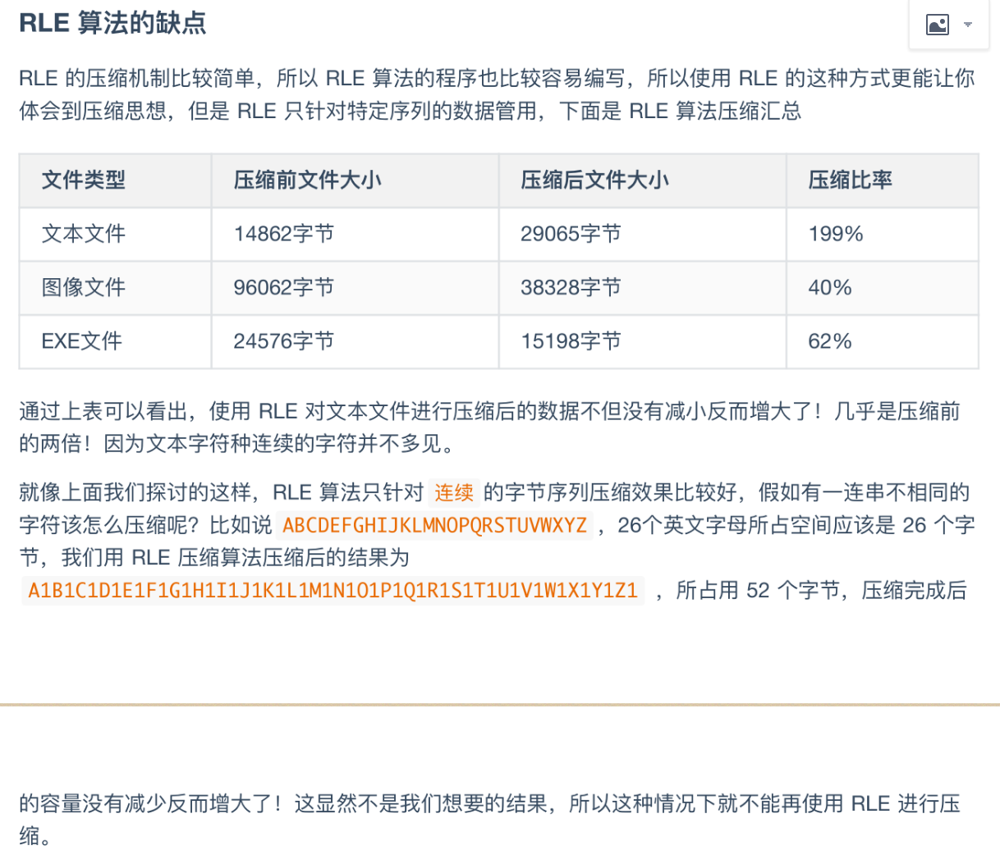

## 一、数组

### 1、杨辉三角

给定一个非负整数 *`numRows`，*生成「杨辉三角」的前 *`numRows`* 行。

在「杨辉三角」中，每个数是它左上方和右上方的数的和。


示例 1:

输入: numRows = 5
输出: [[1],[1,1],[1,2,1],[1,3,3,1],[1,4,6,4,1]]
示例 2:

输入: numRows = 1
输出: [[1]]

解题：

```java
class Solution {
    public List<List<Integer>> generate(int numRows) {
        List<List<Integer>> rowList = new ArrayList<>();
        
        //每一行各自执行一次循环，然后把改行执行循环获得的值存放到最外层list里
        for(int i=0; i<=numRows-1; i++){
            //每一行用于存放各个下标对应值的list
            List<Integer> colList = new ArrayList<>();
            //如果是第一行和第二行，那么每一行的list，各个下标对应位置存放的都是1
            if(i<=1){
                for(int j=0; j<=i; j++){
                    colList.add(1);
                }
            //从第三行开始，开始出现例外
            }else{
                  for(int j=0; j<=i; j++){
                    //除去第一个位置与最后一个位置都是1之外，其他数字，都是它左上方和右上方的数的和
                    if(j==0 || j==i){
                        colList.add(1);
                    }else{
                        //左上方和右上方的数的和，本质是上一行list列表，j-1位置与j位置上数的和
                        //因此，只需要获取上一个列表，然后获取其j-1位置与j位置上数的和就可以了
                        colList.add(rowList.get(i-1).get(j-1)+rowList.get(i-1).get(j));
                    }
                   
                }
            }
            //将每一行所得list存放到最外层的list列表
            rowList.add(colList);
        }
        return rowList;
    }
}
```


### 2、买卖股票的最佳时机

给定一个数组 prices ，它的第 i 个元素 prices[i] 表示一支给定股票第 i 天的价格。

你只能选择 某一天 买入这只股票，并选择在 未来的某一个不同的日子 卖出该股票。设计一个算法来计算你所能获取的最大利润。

返回你可以从这笔交易中获取的最大利润。如果你不能获取任何利润，返回 0 。

示例 1：

输入：[7,1,5,3,6,4]
输出：5
解释：在第 2 天（股票价格 = 1）的时候买入，在第 5 天（股票价格 = 6）的时候卖出，最大利润 = 6-1 = 5 。
     注意利润不能是 7-1 = 6, 因为卖出价格需要大于买入价格；同时，你不能在买入前卖出股票。
示例 2：

输入：prices = [7,6,4,3,1]
输出：0
解释：在这种情况下, 没有交易完成, 所以最大利润为 0。

```java
class Solution {
    public int maxProfit(int[] prices) {
        //暴力破解
        // int max = 0;
        // for(int i=0; i<prices.length-1; i++){
        //     for(int j=i+1; j<prices.length;j++){
        //         int num = prices[j]-prices[i];
        //         if( num>max){
        //             max = num;
        //         }
        //     }
        // }
        // return max;

        //单循环
        int minPrice = Integer.MAX_VALUE;
        int maxPrice = 0;
        //找到最小
        for(int i=0;i<prices.length;i++){
            if(prices[i]<minPrice){
                minPrice = prices[i];
            //保存利润最大的
            }else if(prices[i] - minPrice > maxPrice){
                maxPrice = prices[i] - minPrice;
            }
        }

        return maxPrice;

    }
}
```


### 3、比特位计数

给你一个整数 n ，对于 0 <= i <= n 中的每个 i ，计算其二进制表示中 1 的个数 ，返回一个长度为 n + 1 的数组 ans 作为答案。

示例 1：

输入：n = 2
输出：[0,1,1]
解释：
0 --> 0
1 --> 1
2 --> 10
示例 2：

输入：n = 5
输出：[0,1,1,2,1,2]
解释：
0 --> 0
1 --> 1
2 --> 10
3 --> 11
4 --> 100
5 --> 101

解析——


```java
class Solution {
    public int[] countBits(int n) {
        int[] num = new int[n+1];
        for(int i=0;i<=n;i++){
            if(i%2==0){
                num[i] = num[i/2];//判断，如果为偶数，则1的个数不变，只是在后面加了0
            }else{
                num[i] = num[i-1]+1;//判断为奇数，则在之前的加上1
            }
        }

        return num;
    }
}
```


### 4、存在重复元素

给定一个整数数组，判断是否存在重复元素。

如果存在一值在数组中出现至少两次，函数返回 true 。如果数组中每个元素都不相同，则返回 false 。

 

示例 1:

输入: [1,2,3,1]
输出: true
示例 2:

输入: [1,2,3,4]
输出: false
示例 3:

输入: [1,1,1,3,3,4,3,2,4,2]
输出: true

解析——

```java
class Solution {
    public boolean containsDuplicate(int[] nums) {
        // Map<Integer,Integer> map = new HashMap<>();
        // for(int i = 0; i<nums.length; i++){
        //     if(map.containsKey(nums[i])){
        //         return true;
        //     }else{
        //         map.put(nums[i],1);
        //     }
        // }
        // return false;
        Set<Integer> set = new HashSet<>();
        int len = nums.length;
        for(int i = 0; i<len; i++){
           if(!set.add(nums[i])){
               return true;
           }
        }
        return false;
        
    }
}
```


### 5、存在重复元素 II

给定一个整数数组和一个整数 k，判断数组中是否存在两个不同的索引 i 和 j，使得 nums [i] = nums [j]，并且 i 和 j 的差的 绝对值 至多为 k。

 

示例 1:

输入: nums = [1,2,3,1], k = 3
输出: true
示例 2:

输入: nums = [1,0,1,1], k = 1
输出: true
示例 3:

输入: nums = [1,2,3,1,2,3], k = 2
输出: false

```java
class Solution {
    public boolean containsNearbyDuplicate(int[] nums, int k) {
        Map<Integer,Integer> map = new HashMap<>();
        for(int i = 0; i< nums.length ; i++){
           if(map.containsKey(nums[i])){
               if(i-map.get(nums[i])<=k){
                   return true;
               }
               //第一次提交，案例[1,0,1,1]  1出错，发现这里需要增加该行代码，如果不增加，每次出现相同的，都是减最早出现的那个，但题目要求 i 和 j 的差的 绝对值 至多为 k，也就是说，取最小值就可以
               map.put(nums[i],i);
           }else{
               map.put(nums[i],i);
           }
        }
        return false;
    }
}
```


### 6、丢失的数字

给定一个包含 [0, n] 中 n 个数的数组 nums ，找出 [0, n] 这个范围内没有出现在数组中的那个数。

 

示例 1：

输入：nums = [3,0,1]
输出：2
解释：n = 3，因为有 3 个数字，所以所有的数字都在范围 [0,3] 内。2 是丢失的数字，因为它没有出现在 nums 中。
示例 2：

输入：nums = [0,1]
输出：2
解释：n = 2，因为有 2 个数字，所以所有的数字都在范围 [0,2] 内。2 是丢失的数字，因为它没有出现在 nums 中。
示例 3：

输入：nums = [9,6,4,2,3,5,7,0,1]
输出：8
解释：n = 9，因为有 9 个数字，所以所有的数字都在范围 [0,9] 内。8 是丢失的数字，因为它没有出现在 nums 中。
示例 4：

输入：nums = [0]
输出：1
解释：n = 1，因为有 1 个数字，所以所有的数字都在范围 [0,1] 内。1 是丢失的数字，因为它没有出现在 nums 中。


解析：

求和法：

数学法则：1+2+3+4+5+6......+n=n（n+1）/2

解析——

```java
class Solution {
    public int missingNumber(int[] nums) {
        int len = nums.length;
        int total = len*(len+1)/2;
        for(int i = 0; i<nums.length; i++){
            total = total - nums[i];
        }
        return total;
    }
}
```


## 二、字符串

### 1、验证回文串

给定一个字符串，验证它是否是回文串，只考虑字母和数字字符，可以忽略字母的大小写。

说明：本题中，我们将空字符串定义为有效的回文串。

 

示例 1:

输入: "A man, a plan, a canal: Panama"
输出: true
解释："amanaplanacanalpanama" 是回文串
示例 2:

输入: "race a car"
输出: false
解释："raceacar" 不是回文串

解析——

```java
class Solution {
    public boolean isPalindrome(String s) {
        
        String str = s.toUpperCase();
        StringBuffer result = new StringBuffer();
        String newStr = "";
        boolean flag = true;
        //保留字母或者数字，去掉其他字符
        for(int i=0; i<s.length();i++){
            char ch =  str.charAt(i);
            if(Character.isLetterOrDigit(ch)){
                result.append(ch);
            }
        }
        //使用双指针，左边递增，右边递减，过程有某个字符不相同，代表不对称
        int p = 0,q = result.length()-1;
        while(p<q){
            if(!(result.charAt(p++)+"").equals((result.charAt(q--)+""))){
                flag=false;
                break;
            }
        }
        return flag;
    }
}
```


### 2、Excel 表列序号

给你一个字符串 columnTitle ，表示 Excel 表格中的列名称。返回该列名称对应的列序号。

 

例如，

    A -> 1
    B -> 2
    C -> 3
    ...
    Z -> 26
    AA -> 27
    AB -> 28 
    ...


示例 1:

输入: columnTitle = "A"
输出: 1
示例 2:

输入: columnTitle = "AB"
输出: 28
示例 3:

输入: columnTitle = "ZY"
输出: 701

解析——

```java
class Solution {
    public int titleToNumber(String columnTitle) {
        int num = 0;
        int len = columnTitle.length();
        int multiple = 1;
        for( int i=len-1; 0<=i;i--){
         //倒数获取最后一个字符开始
            char str = columnTitle.charAt(i);
         //将字符减去'A'后加1，即得到该字符所在位置
            int val = str - 'A'+1;
         //将对应字符乘上multiple，假如是BA，就相当是2*26,
            num +=  multiple*val;
         //每前进一位，例如，二位数情况，相当是第一位有26种情况，第二位有26种情况，那么就有26*26种情况
            multiple=multiple*26;
        }
    return num;
    }
}
```


### 3、Excel表列名称

给你一个整数 columnNumber ，返回它在 Excel 表中相对应的列名称。

例如：

A -> 1
B -> 2
C -> 3
...
Z -> 26
AA -> 27
AB -> 28 
...


示例 1：

输入：columnNumber = 1
输出："A"
示例 2：

输入：columnNumber = 28
输出："AB"
示例 3：

输入：columnNumber = 701
输出："ZY"
示例 4：

输入：columnNumber = 2147483647
输出："FXSHRXW"

解题——

```java
class Solution {
    public String convertToTitle(int columnNumber) {
        StringBuilder sb = new StringBuilder();
        while(columnNumber>0){
            //找到第一个字符的位置
            int col = (columnNumber - 1)%26 +1;
            //将位置从'A'开始算起，即可转换成对应的字符
            sb.append((char)(col-1+'A'));
            //可以得到剩余还有多少位
            columnNumber = (columnNumber - col)/26;
        }
        return sb.reverse().toString();
    }
}
```


### 4、同构字符串

给定两个字符串 s 和 t，判断它们是否是同构的。

如果 s 中的字符可以按某种映射关系替换得到 t ，那么这两个字符串是同构的。

每个出现的字符都应当映射到另一个字符，同时不改变字符的顺序。不同字符不能映射到同一个字符上，相同字符只能映射到同一个字符上，字符可以映射到自己本身。

 

示例 1:

输入：s = "egg", t = "add"
输出：true
示例 2：

输入：s = "foo", t = "bar"
输出：false
示例 3：

输入：s = "paper", t = "title"
输出：true

解析——

```java
class Solution {
    public boolean isIsomorphic(String s, String t) {
        //使用双指针算法
        int p = 0,q = 0;
     
        Map<Character,Character> map1 = new HashMap<>();
        Map<Character,Character> map2 = new HashMap<>();

        while(p< s.length()){

            Character pc = s.charAt(p);
            Character qc = t.charAt(q);
            //一、判断哈希是否已经包含该字符，若包含，说明是字符重复的
            //二、字符重复情况下，判断是否是映射关系，即 map.get(pc)!=qc，若都不满足，即非映射，即非同构字符串
            if(map1.containsKey(pc)&&map1.get(pc)!=qc || map2.containsKey(qc)&&map2.get(qc)!=pc){
                return false;
            }
		   //相互进行映射
            map1.put(pc,qc);
            map2.put(qc,pc);

            p++;
            q++;
            
        }
        return true;
    }
}
```


### 5、判定是否互为字符重排

给定两个字符串 s1 和 s2，请编写一个程序，确定其中一个字符串的字符重新排列后，能否变成另一个字符串。

示例 1：

输入: s1 = "abc", s2 = "bca"
输出: true 
示例 2：

输入: s1 = "abc", s2 = "bad"
输出: false
说明：

0 <= len(s1) <= 100
0 <= len(s2) <= 100

```java
class Solution {
    //思路一
    public boolean CheckPermutation(String s1, String s2) {
        int len1 = s1.length(),len2 = s2.length();

        if(len1!=len2){
            return false;
        }
        //1、前提：长度一样长的字符串，
        //2、map1存储s1当中各个字符出现次数，map2存储s2当中各个字符出现次数
        Map<Character,Integer> map1 = new HashMap<>();
        Map<Character,Integer> map2 = new HashMap<>();
        for(int i = 0; i<len1;i++){
            char ch1 = s1.charAt(i);
            char ch2 = s2.charAt(i);
            // if(map1.containsKey(ch1)){
            //     map1.put(ch1,map1.get(ch1)+1);
            // }else{
            //     map1.put(ch1,1);
            // }
            int int1 = map1.containsKey(ch1)?map1.get(ch1):0;
            map1.put(ch1,int1+1);

            //  if(map2.containsKey(ch2)){
            //     map2.put(ch2,map2.get(ch2)+1);
            // }else{
            //     map2.put(ch2,1);
            // }
            int int2 = map2.containsKey(ch2)?map2.get(ch2):0;
            map2.put(ch2,int2+1);
          
        }
        //3、循环map1中各字符与map2当中比较出现次数是否一样，若不一样，说明无法进行重排
        for(Map.Entry<Character,Integer> entry:map1.entrySet()){
            Character ch = entry.getKey();
            //若map1存在map2没有的字符，说明无法进行重排
            if(!map2.containsKey(ch)){
                return false;
            }
            //若map1存在map2出现次数不一致的字符，说明无法进行重排
            if(entry.getValue()!=map2.get(ch)){
                return false;
            }
        }
        return true;
    }


//思路二
     public boolean CheckPermutation(String s1, String s2) {
        int len1 = s1.length(),len2 = s2.length();

        if(len1!=len2){
            return false;
        }

        Map<Character,Integer> map = new HashMap<>();
        //统计s1各字符出现次数
        for(int i = 0; i<len1;i++){
            char ch1 = s1.charAt(i);
            int int1 = map.containsKey(ch1)?map.get(ch1):0;
            map.put(ch1,int1+1);     
        }
		//将s2各字符通过map.get(字符)形式取出存储在map的字符对应出现次数,
        //每次取出次数进行减1，当该字符出现次数递减到1时，就remove掉该key,
        //若是重排字符串，最后map里的key是可以被全部remove掉的,
        for(int i = 0; i<len1;i++){
            char ch2 = s2.charAt(i);
            
            if(map.containsKey(ch2)){
                int value = map.get(ch2);
                if(value!=1){
                    map.put(ch2,value-1);
                }else{
                    map.remove(ch2);
                }
            //若s2中某个字符不存在于map当中，说明s2存在着是s1没有的字符，说明两字符无法互为字符重排   
            }else{
                return false;
            }
        }
        return map.size()==0?true:false;
    }
}
```


### 6、字符串压缩

字符串压缩。利用字符重复出现的次数，编写一种方法，实现基本的字符串压缩功能。比如，字符串aabcccccaaa会变为a2b1c5a3。若“压缩”后的字符串没有变短，则返回原先的字符串。你可以假设字符串中只包含大小写英文字母（a至z）。

示例1:

 输入："aabcccccaaa"
 输出："a2b1c5a3"
示例2:

 输入："abbccd"
 输出："abbccd"
 解释："abbccd"压缩后为"a1b2c2d1"，比原字符串长度更长。

```java
class Solution {
    public String compressString(String S) {
        int oldLen = S.length();
        if(oldLen == 0){
            return S;
        }
        //设置比较的字符
        char ch = S.charAt(0);
        //第一个开始，即有一个
        int num = 1;
        StringBuilder sb = new StringBuilder();
        //模拟遍历压缩
        for(int i = 1; i<oldLen; i++){
            //如果与比较的字符相等，说明压缩数量增加
            if(ch == S.charAt(i)){
                num++;
            }else{
                //如果不相等，先保存已经压缩的，然后从下一个不同的字符开始继续压缩
                sb.append(ch).append(num);
                ch = S.charAt(i);
                num = 1;
            }
        } 
       //拼接最后已经压缩完成的字符
       sb.append(ch);
       sb.append(num);
       //最后一步，即比较压缩前的字符串与压缩后的字符串长度比较，如果比压缩前的字符还长，故而不需要压缩
       return sb.length()>=oldLen?S:sb.toString();

    }
}
```


### 7、有效的字母异位词

给定两个字符串 s 和 t ，编写一个函数来判断 t 是否是 s 的字母异位词。

注意：若 s 和 t 中每个字符出现的次数都相同，则称 s 和 t 互为字母异位词。

 

示例 1:

输入: s = "anagram", t = "nagaram"
输出: true
示例 2:

输入: s = "rat", t = "car"
输出: false


提示:

1 <= s.length, t.length <= 5 * 104
s 和 t 仅包含小写字母

解析——

```java
class Solution {
    public boolean isAnagram(String s, String t) {
        if(s.length() != t.length()){
            return false;
        }
        //通过哈希来统计s字符串各个字符出现的次数
        Map<Character,Integer> map = new HashMap<>();
        for(int i = 0; i<s.length(); i++){
            char str = s.charAt(i);
            if(map.containsKey(str)){
                map.put(str,map.get(str)+1);
            }else{
                map.put(str,1);
            }
        }
        //根据t字符串来递减map各字符出现的次数
        for(int i = 0; i<t.length(); i++){
             char str = t.charAt(i);
            
            if(map.containsKey(str)){
               //根据出现的次数来递减map缓存的字符，递减到剩余一个时，直接移除
               if(map.get(str)!=1){
                    map.put(str,map.get(str)-1);
               }else{
                   map.remove(str);
               }
            }else{
                //若出现t字符在map不存在的情况，那么就不符合字母异或位
                return false;
            } 
        }
        //异或字符串情况时，map.size()应该等于1
        return map.size()>1?false:true;
    }
}
```


## 三、动态规划

### 1、爬楼梯

假设你正在爬楼梯。需要 n 阶你才能到达楼顶。

每次你可以爬 1 或 2 个台阶。你有多少种不同的方法可以爬到楼顶呢？

注意：给定 n 是一个正整数。

示例 1：

输入： 2
输出： 2
解释： 有两种方法可以爬到楼顶。
1.  1 阶 + 1 阶
2.  2 阶
示例 2：

输入： 3
输出： 3
解释： 有三种方法可以爬到楼顶。
1.  1 阶 + 1 阶 + 1 阶
2.  1 阶 + 2 阶
3.  2 阶 + 1 阶

解析——

```java
class Solution {
    public int climbStairs(int n) {
        int[] data = new int[n+1];
        return climbS(n,data);
    }
    public int climbS(int n,int[] data) {
        if(data[n]>0){
            return data[n];
        }
        if(n==1){
           data[n]=1;
        }else if(n==2){
            data[n]=2;
        }else{
             data[n]=climbS(n-2,data)+climbS(n-1,data);
        }
        return data[n];
    }
}
```

### 2、斐波那契数

斐波那契数，通常用 F(n) 表示，形成的序列称为 斐波那契数列 。该数列由 0 和 1 开始，后面的每一项数字都是前面两项数字的和。也就是：

F(0) = 0，F(1) = 1
F(n) = F(n - 1) + F(n - 2)，其中 n > 1
给你 n ，请计算 F(n) 。

 

示例 1：

输入：2
输出：1
解释：F(2) = F(1) + F(0) = 1 + 0 = 1
示例 2：

输入：3
输出：2
解释：F(3) = F(2) + F(1) = 1 + 1 = 2
示例 3：

输入：4
输出：3
解释：F(4) = F(3) + F(2) = 2 + 1 = 3


提示：

0 <= n <= 30


解析——

```java
class Solution {
    public int fib(int n) {
        //n等于0情况，直接返回0
        if (n < 1) return 0;
        int[] data = new int[n+1];
        return fn(n,data);
    }


    public int fn(int n,int[] data){
        //不等于0，可以直接返回值
        if(data[n]!=0){
            return data[n];
        }
        if(n == 1 || n == 2){
            data[n] = 1;
        }else{
            data[n] = fn(n-2,data)+fn(n-1,data);
        }
        return data[n];
    }
}
```

### 3、第 N 个泰波那契数

泰波那契序列 Tn 定义如下： 

T0 = 0, T1 = 1, T2 = 1, 且在 n >= 0 的条件下 Tn+3 = Tn + Tn+1 + Tn+2

给你整数 n，请返回第 n 个泰波那契数 Tn 的值。

示例 1：

输入：n = 4
输出：4
解释：
T_3 = 0 + 1 + 1 = 2
T_4 = 1 + 1 + 2 = 4
示例 2：

输入：n = 25
输出：1389537


提示：

0 <= n <= 37
答案保证是一个 32 位整数，即 answer <= 2^31 - 1。

解析——

```java
class Solution {
    public int tribonacci(int n) {
       int[] dp = new int[n+1];
       if(n==0){
           return 0;
       }
       if(n<=2){
           return 1;
       }
       dp[0] = 0;dp[1] =1 ; dp[2] = 1;
       for(int i = 3;i <= n; i++){
           dp[i] = dp[i-1] + dp[i-2] +dp[i-3];
       }
       return dp[n];
    }
}
```


## 四、哈希表

### 1、回文排列

给定一个字符串，编写一个函数判定其是否为某个回文串的排列之一。

回文串是指正反两个方向都一样的单词或短语。排列是指字母的重新排列。

回文串不一定是字典当中的单词。

示例1：

输入："tactcoa"
输出：true（排列有"tacocat"、"atcocta"，等等）

```java
class Solution {
    public boolean canPermutePalindrome(String s) {
        int len = s.length();
        if(len == 0){
            return true;
        }
        Map<Character,Integer> map = new HashMap<>();
        //通过哈希map来缓存与移除，若是能实现回文排列，奇数只剩一个key，偶数剩零个key
        for(int i = 0;i<len;i++){
            char ch = s.charAt(i);
            if(map.containsKey(ch)){
                map.remove(ch);
            }else{
                map.put(ch,1);
            }
        }
        return (map.size()<=1)?true:false;
    }
}
```


## 五、排序


## 六、二叉树

### 1、相同的树

给你两棵二叉树的根节点 `p` 和 `q` ，编写一个函数来检验这两棵树是否相同。

如果两个树在结构上相同，并且节点具有相同的值，则认为它们是相同的。

```java
/**
 * Definition for a binary tree node.
 * public class TreeNode {
 *     int val;
 *     TreeNode left;
 *     TreeNode right;
 *     TreeNode() {}
 *     TreeNode(int val) { this.val = val; }
 *     TreeNode(int val, TreeNode left, TreeNode right) {
 *         this.val = val;
 *         this.left = left;
 *         this.right = right;
 *     }
 * }
 */
class Solution {
    //使用左子树递归 与右子树递归的方式判断
    public boolean isSameTree(TreeNode p, TreeNode q) {
        //如果两棵树都为空，则表示相同，可提前结束
        if(p == null && q == null){
            return true;
        }
        /**两棵树在同一位置处：
        1、若p的节点为空，q的节点不为空，说明两棵树不相同；
        2、若p的节点不为空，q的节点为空，说明两棵树不相同；
        3、若p的节点值与q的节点值不相等，说明两棵树不相同；
        4、分别对p和q的左子树递归，p和q的右子树递归，这样可以依次对两棵树同一位置的节点进行判断，若存在返回false情况，说明有某个节点是不相同的，也就是两棵树不同
        **/
        if((p == null && q != null) ||  (p != null && q == null)||(p.val != q.val)
        ||!isSameTree(p.left, q.left)||!isSameTree(p.right, q.right)){
            return false;
        }
        //若都无上述现象，说明两棵树是相同；
        return true;
    }

}
```

### 2、对称二叉树

给定一个二叉树，检查它是否是镜像对称的。

例如，二叉树 `[1,2,2,3,4,4,3]` 是对称的。

```
    1
   / \
  2   2
 / \ / \
3  4 4  3
```

但是下面这个 `[1,2,2,null,3,null,3]` 则不是镜像对称的:

```
    1
   / \
  2   2
   \   \
   3    3
```

解法——

```java
/**
 * Definition for a binary tree node.
 * public class TreeNode {
 *     int val;
 *     TreeNode left;
 *     TreeNode right;
 *     TreeNode() {}
 *     TreeNode(int val) { this.val = val; }
 *     TreeNode(int val, TreeNode left, TreeNode right) {
 *         this.val = val;
 *         this.left = left;
 *         this.right = right;
 *     }
 * }
 */
 
 /**
  * 可以拆解为一个 p顶点与p.left树与p.right树，这样，就可以按照类似  两棵相同树的解法
  */
class Solution {
    public boolean isSymmetric(TreeNode root) {
        //若左右子树都为null，那么，就只剩一个父节点，肯定是镜像对称
        if(root.left == null && root.right == null){
            return true;
        }
        //若左右任一节点为null，另外节点不为null，则不是镜像对称
        if((root.left == null && root.right !=null)||(root.left != null && root.right ==null)){
            return false;
        }
        //通过递归方式，也就是转换成判断 两棵树是否对称的做法
        return isTowBothSymmetric(root.left,root.right);
    }
    
    public boolean isTowBothSymmetric(TreeNode p,TreeNode q){
        //若两棵树的父节点都null，那么就直接返回true
        if(p == null && q == null){
            return true;
        }
        //若同位置上，两棵子树任意一个节点null，另外一个节点不为null，那么就说明非镜像对称
        if((p == null && q !=null)||(p != null && q ==null)){
            return false;
        }
        //若不相同，则非镜像对称
        if(p.val != q.val){
            return false;
        }
        //这行代码最核心，这里用到递归，但这里的递归，传进来的参数，需要左右对称，而不是左右同一个位置
        if(!isTowBothSymmetric(p.left,q.right)||!isTowBothSymmetric(p.right,q.left)){
            return false;
        }
        return true;
    }
}
```


### 3、二叉树的最大深度

给定一个二叉树，找出其最大深度。

二叉树的深度为根节点到最远叶子节点的最长路径上的节点数。

说明: 叶子节点是指没有子节点的节点。

示例：
给定二叉树 [3,9,20,null,null,15,7]

```
   3
   / \
  9  20
    /  \
   15   7
```

返回它的最大深度 3 。

```java
/**
 * Definition for a binary tree node.
 * public class TreeNode {
 *     int val;
 *     TreeNode left;
 *     TreeNode right;
 *     TreeNode() {}
 *     TreeNode(int val) { this.val = val; }
 *     TreeNode(int val, TreeNode left, TreeNode right) {
 *         this.val = val;
 *         this.left = left;
 *         this.right = right;
 *     }
 * }
 */
class Solution {
    //用于保留最大深度
    private int MaxNum = 0;

    public int maxDepth(TreeNode root) {
        if(root == null){
            return 0;
        }
        if(root.left == null && root.right ==null){
            return 1;
        }
        Integer leftNum = 0;
        Integer rightNum = 0;
        //递归左右子树，找到最大值MaxNum
        maxDepth(root.left,leftNum);
        maxDepth(root.right,rightNum);
        //需要把父节点加上，即加1
        return MaxNum+1;
    }
    public void maxDepth(TreeNode root,Integer num){
        //若节点为null，意味着，已经到最末，这时候，可以用最大值判断，保留每一条路径所比较的最大值就可以了，然后将num置空，继续下一次递归判断，这样，最终，最大MaxNum即为最大深度
        if(root == null){
            if(num>MaxNum){
                MaxNum = num;
            }
            num = 0;
            return;
        }
        //用Integer定义的num，可以在递归里一直递增
        ++num;
        maxDepth(root.left,num);
        maxDepth(root.right,num);
      }
}
```

### 4、将有序数组转换为二叉搜索树

给你一个整数数组 nums ，其中元素已经按 升序 排列，请你将其转换为一棵 高度平衡 二叉搜索树。

高度平衡 二叉树是一棵满足「每个节点的左右两个子树的高度差的绝对值不超过 1 」的二叉树。

 


输入：nums = [-10,-3,0,5,9]
输出：[0,-3,9,-10,null,5]
解释：[0,-10,5,null,-3,null,9] 也将被视为正确答案：


示例 2：


输入：nums = [1,3]
输出：[3,1]
解释：[1,3] 和 [3,1] 都是高度平衡二叉搜索树。

```java
/**
 * Definition for a binary tree node.
 * public class TreeNode {
 *     int val;
 *     TreeNode left;
 *     TreeNode right;
 *     TreeNode() {}
 *     TreeNode(int val) { this.val = val; }
 *     TreeNode(int val, TreeNode left, TreeNode right) {
 *         this.val = val;
 *         this.left = left;
 *         this.right = right;
 *     }
 * }
 */
class Solution {
    public TreeNode sortedArrayToBST(int[] nums) {
         return charToTree(nums,0,nums.length-1);
    }
    //通过递归的方式，然后按照二分查找，每次取中间mid指标对应的数值当做父节点
    public TreeNode charToTree(int[] nums,int left,int right){
        if(left>right){
            return null;
        }
        //取中间mid位置
        int mid = (right-left)/2+left;
        TreeNode root = new TreeNode(nums[mid]);
        root.left = charToTree(nums,left,mid-1);
        root.right = charToTree(nums,mid+1,right);
        return root;
    }
}
```


### 5、检查平衡性

实现一个函数，检查二叉树是否平衡。在这个问题中，平衡树的定义如下：任意一个节点，其两棵子树的高度差不超过 1。

示例 1:
给定二叉树 [3,9,20,null,null,15,7]
    3
   / \
  9  20
    /  \
   15   7
返回 true 。
示例 2:
给定二叉树 [1,2,2,3,3,null,null,4,4]
      1
     / \
    2   2
   / \
  3   3
 / \
4   4
返回 false 。

解析——

```java
/**
 * Definition for a binary tree node.
 * public class TreeNode {
 *     int val;
 *     TreeNode left;
 *     TreeNode right;
 *     TreeNode(int x) { val = x; }
 * }
 */
class Solution {
    boolean flag = true;
    public boolean isBalanced(TreeNode root) {
       
       deept(root);
       return flag;
    }

    public int deept(TreeNode root){
        if(root == null){
            return 0;
        }
        int left = deept(root.left);
        int right = deept(root.right);
        if(Math.abs(left - right)>1){
            flag = false;
        }
        return Math.max(left,right)+1;
    }

}
```

### 6、翻转二叉树

翻转一棵二叉树。

**示例：**


```java
class Solution {
    public TreeNode invertTree(TreeNode root) {
        if(root == null ){
            return null;
        }
        TreeNode left = invertTree(root.left);
        TreeNode right = invertTree(root.right);
        root.left = right;
        root.right = left;
        return root;
    }
}
```

### 7、路径总和

给你二叉树的根节点 root 和一个表示目标和的整数 targetSum ，判断该树中是否存在 根节点到叶子节点 的路径，这条路径上所有节点值相加等于目标和 targetSum 。

叶子节点 是指没有子节点的节点。


```java
class Solution {

    public boolean hasPathSum(TreeNode root, int targetSum) {
        if(root == null){
            return false;
        }
		//递归结束
        if(root.left == null && root.right == null){
            return targetSum - root.val == 0;
        }
		//递归使用或运算，只要其中有一个满足就返回true
        return hasPathSum(root.left,targetSum-root.val) || hasPathSum(root.right,targetSum-root.val);

    }   
}
```


### 8、二叉树的所有路径

给你一个二叉树的根节点 `root` ，按 **任意顺序** ，返回所有从根节点到叶子节点的路径。

**叶子节点** 是指没有子节点的节点。


方法一：深度优先搜索
思路与算法

最直观的方法是使用深度优先搜索。在深度优先搜索遍历二叉树时，我们需要考虑当前的节点以及它的孩子节点。

如果当前节点不是叶子节点，则在当前的路径末尾添加该节点，并继续递归遍历该节点的每一个孩子节点。
如果当前节点是叶子节点，则在当前路径末尾添加该节点后我们就得到了一条从根节点到叶子节点的路径，将该路径加入到答案即可。
如此，当遍历完整棵二叉树以后我们就得到了所有从根节点到叶子节点的路径。当然，深度优先搜索也可以使用非递归的方式实现，这里不再赘述。

```java
class Solution {
    public List<String> binaryTreePaths(TreeNode root) {
        List<String> paths = new ArrayList<String>();
        constructPaths(root, "", paths);
        return paths;
    }

    public void constructPaths(TreeNode root, String path, List<String> paths) {
        if (root != null) {
            //每次递归，都是新建一个字符串，就可以避免最外层用同一个字符串了
            StringBuffer pathSB = new StringBuffer(path);
            pathSB.append(Integer.toString(root.val));
            if (root.left == null && root.right == null) {  // 当前节点是叶子节点
                paths.add(pathSB.toString());  // 把路径加入到答案中
            } else {
                pathSB.append("->");  // 当前节点不是叶子节点，继续递归遍历
                constructPaths(root.left, pathSB.toString(), paths);
                constructPaths(root.right, pathSB.toString(), paths);
            }
        }
    }
}

```

方法二：广度优先搜索
思路与算法

我们也可以用广度优先搜索来实现。我们维护一个队列，存储节点以及根到该节点的路径。一开始这个队列里只有根节点。在每一步迭代中，我们取出队列中的首节点，如果它是叶子节点，则将它对应的路径加入到答案中。如果它不是叶子节点，则将它的所有孩子节点加入到队列的末尾。当队列为空时广度优先搜索结束，我们即能得到答案。

```java
class Solution {
    public List<String> binaryTreePaths(TreeNode root) {
        List<String> paths = new ArrayList<String>();
        if (root == null) {
            return paths;
        }
        Queue<TreeNode> nodeQueue = new LinkedList<TreeNode>();
        Queue<String> pathQueue = new LinkedList<String>();

        nodeQueue.offer(root);
        pathQueue.offer(Integer.toString(root.val));

        while (!nodeQueue.isEmpty()) {
            TreeNode node = nodeQueue.poll(); 
            String path = pathQueue.poll();

            if (node.left == null && node.right == null) {
                paths.add(path);
            } else {
                if (node.left != null) {
                    nodeQueue.offer(node.left);
                    pathQueue.offer(new StringBuffer(path).append("->").append(node.left.val).toString());
                }

                if (node.right != null) {
                    nodeQueue.offer(node.right);
                    pathQueue.offer(new StringBuffer(path).append("->").append(node.right.val).toString());
                }
            }
        }
        return paths;
    }
}
```


### 9、左叶子之和

计算给定二叉树的所有左叶子之和。

**示例：**

```
    3
   / \
  9  20
    /  \
   15   7

在这个二叉树中，有两个左叶子，分别是 9 和 15，所以返回 24
```

```java
class Solution {
    private int num=0;
    public int sumOfLeftLeaves(TreeNode root) {
        if(root == null){
            return 0;
        }
        //只统计左子树
        if(root.left != null && (root.left.right == null&&root.left.left == null)){
            num+=root.left.val;
        }
        //递归
        sumOfLeftLeaves(root.left);
        sumOfLeftLeaves(root.right);
       return num;
    }
}
```

### 10、二叉搜索树中的众数

给定一个有相同值的二叉搜索树（BST），找出 BST 中的所有众数（出现频率最高的元素）。

假定 BST 有如下定义：

结点左子树中所含结点的值小于等于当前结点的值
结点右子树中所含结点的值大于等于当前结点的值
左子树和右子树都是二叉搜索树
例如：
给定 BST [1,null,2,2],

   1
    \
     2
    /
   2
返回[2].

提示：如果众数超过1个，不需考虑输出顺序

进阶：你可以不使用额外的空间吗？（假设由递归产生的隐式调用栈的开销不被计算在内）

解析——

```java
class Solution {
    public int max = Integer.MIN_VALUE;
    public int count = 0;
    public int pre = -1;
    List<Integer> list = new ArrayList<>();
    public int[] findMode(TreeNode root) {
        
        find(root);
        int[] intVal = new int[list.size()];
        for(int i=0;i<list.size();i++){
            intVal[i] = list.get(i);
        }
        return intVal;

    }
    //中序遍历二叉搜索树等于遍历有序数组
    public void find(TreeNode root){
        if(root == null){
            return;
        }
        find(root.left);
        int val = root.val;
        if(val == pre){
            count++;
        }else{
            pre = val;
            count = 0;
        }
           if(count > max){
                max = count;
                //清空数组
                //将最大值缓存到数组
                list.clear();
                list.add(val);
            }else if(count == max){
                 list.add(val);
            }
        find(root.right);
    }
}
```


## 七、链表

### 1、存在一个按升序排列的链表，给你这个链表的头节点 `head` ，请你删除所有重复的元素，使每个元素 **只出现一次** 。

```java
class Solution {
    public ListNode deleteDuplicates(ListNode head) {
        if(head == null){
            return null;
        }
        ListNode index = head;
        //如果next为空，就可以直接返回
        while(index.next != null){
            //因为是升序排序，那么相同的就是靠近的，若当前数据与下一个数据相同，那么就将下一个地址指向下一个的下一个地址
            if(index.val == index.next.val){
                index.next = index.next.next;
            }else{
                //如果不相同，则把指针前进一位
                index = index.next;
            }
        }
        //返回改造过的链表
        return head;

    }
}
```

### 2、环形链表

给定一个链表，判断链表中是否有环。

如果链表中有某个节点，可以通过连续跟踪 next 指针再次到达，则链表中存在环。 为了表示给定链表中的环，我们使用整数 pos 来表示链表尾连接到链表中的位置（索引从 0 开始）。 如果 pos 是 -1，则在该链表中没有环。注意：pos 不作为参数进行传递，仅仅是为了标识链表的实际情况。

如果链表中存在环，则返回 true 。 否则，返回 false 。

 

进阶：

你能用 O(1)（即，常量）内存解决此问题吗？


解析——

```java
/**
 * Definition for singly-linked list.
 * class ListNode {
 *     int val;
 *     ListNode next;
 *     ListNode(int x) {
 *         val = x;
 *         next = null;
 *     }
 * }
 */
public class Solution {
    public boolean hasCycle(ListNode head) {
        int p = 0;
        Map<ListNode,Integer> map = new HashMap<>();
        if(head == null ){
            return false;
        }
        //将下标存储以节点为key存储在map中，无循环链表情况下，下标与p同步，若是小于p，则说明，节点回到了前边的某个节点上了，这就意味着，出现回环问题。
        while(head.next!=null){
            if(map.containsKey(head) && map.get(head)<p){
                return true;
            }
            map.put(head,p++);
            head = head.next;
        }
        return false;
    }
}
```

### 3、移除重复节点

编写代码，移除未排序链表中的重复节点。保留最开始出现的节点。

示例1:

 输入：[1, 2, 3, 3, 2, 1]
 输出：[1, 2, 3]
示例2:

 输入：[1, 1, 1, 1, 2]
 输出：[1, 2]
提示：

链表长度在[0, 20000]范围内。
链表元素在[0, 20000]范围内。
进阶：

如果不得使用临时缓冲区，该怎么解决？

解析——

```java
/**
 * Definition for singly-linked list.
 * public class ListNode {
 *     int val;
 *     ListNode next;
 *     ListNode(int x) { val = x; }
 * }
 */
class Solution {
    public ListNode removeDuplicateNodes(ListNode head) {
        ListNode p = head;
        while(p != null){
            //每次都从该节点开始遍历循环
            ListNode q = p;
            while(q.next != null){
                if(p.val == q.next.val){
                    q.next = q.next.next;
                }else{
                    q = q.next;
                }
            }
            p = p.next;
        }
        return head;
    }
}
```


### 4、返回倒数第 k 个节点

实现一种算法，找出单向链表中倒数第 k 个节点。返回该节点的值。

注意：本题相对原题稍作改动

示例：

输入： 1->2->3->4->5 和 k = 2
输出： 4
说明：

给定的 k 保证是有效的。

反转链表解析——

```java
/**
 * Definition for singly-linked list.
 * public class ListNode {
 *     int val;
 *     ListNode next;
 *     ListNode(int x) { val = x; }
 * }
 */
class Solution {
    public int kthToLast(ListNode head, int k) {
        ListNode pre = null;
        ListNode cur = head;
        while(cur!=null){
            ListNode next = cur.next;
            cur.next = pre;
            pre = cur;
            cur = next;
        }
        int num = 0;
        int result = 0;
        while(pre!=null){
            num++;
           if( k == num){
                result = pre.val;
           } 
           pre = pre.next;
        }
        return result;
    }
}
```

链表方法——

```java
 public int kthToLast(ListNode head, int k) {
        ListNode p = head;
        List<Integer> list = new ArrayList<>();
        while(p != null){
            list.add(p.val);
            p = p.next;
        }
        return list.get(list.size() - k);
    }
```

快慢指针解析——

```java
class Solution {
    public int kthToLast(ListNode head, int k) {
        ListNode fast = head;
        ListNode slow = head;
        while(k>0){
            fast = fast.next;
            k--;
        }
        while(fast !=null ){
            fast = fast.next;
            slow = slow.next;
        }
        return slow.val;
    }
}
```


### 5、删除中间节点

若链表中的某个节点，既不是链表头节点，也不是链表尾节点，则称其为该链表的「中间节点」。

假定已知链表的某一个中间节点，请实现一种算法，将该节点从链表中删除。

例如，传入节点 c（位于单向链表 a->b->c->d->e->f 中），将其删除后，剩余链表为 a->b->d->e->f

 

示例：

输入：节点 5 （位于单向链表 4->5->1->9 中）
输出：不返回任何数据，从链表中删除传入的节点 5，使链表变为 4->1->9

```java
/**
 * Definition for singly-linked list.
 * public class ListNode {
 *     int val;
 *     ListNode next;
 *     ListNode(int x) { val = x; }
 * }
 */
class Solution {
    public void deleteNode(ListNode node) {
        //把当前节点值以下一个节点值替换，然后next指向下一个节点的next，意思是，当前节点没被删掉，替换成了下一个节点，但下一个节点就被删掉了
        node.val = node.next.val;
        node.next = node.next.next;
    }
}
```


## 八、二分查找

### 1、两数之和 II - 输入有序数组

给定一个已按照 非递减顺序排列  的整数数组 numbers ，请你从数组中找出两个数满足相加之和等于目标数 target 。

函数应该以长度为 2 的整数数组的形式返回这两个数的下标值。numbers 的下标 从 1 开始计数 ，所以答案数组应当满足 1 <= answer[0] < answer[1] <= numbers.length 。

你可以假设每个输入 只对应唯一的答案 ，而且你 不可以 重复使用相同的元素。


示例 1：

输入：numbers = [2,7,11,15], target = 9
输出：[1,2]
解释：2 与 7 之和等于目标数 9 。因此 index1 = 1, index2 = 2 。
示例 2：

输入：numbers = [2,3,4], target = 6
输出：[1,3]

```java
class Solution {
    public int[] twoSum(int[] numbers, int target) {
        int[] result = new int[2];
        //循环查找，然后再从i+1之后使用二分查找法查询
        for(int i = 0; i<numbers.length; i++){
           //使用二分查找法
           int left = i+1,right = numbers.length-1,mid = 0;
           //目标值-数组下标对应的值=需要查询的值，然后将需要查找的值通过二分查找
           int key = target -numbers[i];
           
           while(left <= right){
               mid = (right - left)/2+left;
               if(numbers[mid] == key){
                   return new int[]{i+1,mid+1};
               }else if(numbers[mid] > key){
                   right = mid -1;
               }else if(numbers[mid]<key){
                   left = mid + 1;
               }
           }

        }
        return new int[]{-1,-1};
    }
}
```


#### 


## 九、双指针

### 1、合并两个有序数组

给你两个按 非递减顺序 排列的整数数组 nums1 和 nums2，另有两个整数 m 和 n ，分别表示 nums1 和 nums2 中的元素数目。

请你 合并 nums2 到 nums1 中，使合并后的数组同样按 非递减顺序 排列。

注意：最终，合并后数组不应由函数返回，而是存储在数组 nums1 中。为了应对这种情况，nums1 的初始长度为 m + n，其中前 m 个元素表示应合并的元素，后 n 个元素为 0 ，应忽略。nums2 的长度为 n 。

 

示例 1：

输入：nums1 = [1,2,3,0,0,0], m = 3, nums2 = [2,5,6], n = 3
输出：[1,2,2,3,5,6]
解释：需要合并 [1,2,3] 和 [2,5,6] 。
合并结果是 [1,2,2,3,5,6] ，其中斜体加粗标注的为 nums1 中的元素。

解题：

```java
class Solution {
    public void merge(int[] nums1, int m, int[] nums2, int n) {
        int p = 0, q = 0;
        int[] newSort = new int[m+n];
        int val = 0;
        while(p < m || q < n){
            //左数组已经计算完，那么就可以直接把右数组遍历
            if(p == m){
                val = nums2[q++];
            //右数组已经计算完，那么就可以直接把左数组遍历
            }else if(q == n){
                val = nums1[p++];
         //通过双指针方式，若左数组对应下标的数值大于右数组对应下标的数值，那么将最小的插入到新数组当中
            }else if(nums1[p]<nums2[q]){
                val = nums1[p++];
            }else{
                val = nums2[q++];
            }
            //将比较得到的值插入新数组，因为下标从0开始，故而需要减一
            newSort[p+q-1] = val;
        } 
        //题目要求，返回的是num1数组，故而需要将新数组存入到num1数组
        for(int i=0; i<m+n;i++){
            nums1[i] = newSort[i];
        }
    }
}
```


### 2、一次编辑

字符串有三种编辑操作:插入一个字符、删除一个字符或者替换一个字符。 给定两个字符串，编写一个函数判定它们是否只需要一次(或者零次)编辑。

 

示例 1:

输入: 
first = "pale"
second = "ple"
输出: True


示例 2:

输入: 
first = "pales"
second = "pal"
输出: False

解题——

```java
class Solution {
    public boolean oneEditAway(String first, String second) {
        int fp =0 ,sq = 0;
        //根据长度交换位置，不同长度情况下，first最短，second最长
        if(first.length() > second.length()){
            String temp = first;
            first = second;
            second = temp;
        }
        //如果两者长度差大于2，表示无法编辑一次实现
        int pq = second.length()-first.length();
        if(pq >= 2){
            return false;
        }

        int flen = first.length(), slen = second.length();
        int num = 0;
        //双指针遍历两个字符串
        while(fp<flen && sq<slen){
            //first长度小于second长度时，
            if(flen<slen){
                //若出现字符不一致时，滑动长度长的字符串，指到下一个字符，并且记录出现一次字符不同情况，即num加1;
              if(first.charAt(fp) != second.charAt(sq)){
                 sq++;
                 ++num;
              }else{
                  //如果比较的两个字符都相同，那么一次滑动到下一个字符
                  fp++;
                  sq++;
              }
            }else{
                //如果两个字符串长度相同，只需双指针滑动，将出现不同字符的情况记录下来
               if(first.charAt(fp++) != second.charAt(sq++)){
                 ++num;
              }
            }
            //当出现不同字符情况超过1次，说明无法通过一次编辑实现两个字符操作，可以提前返回
            if(num>1){
                return false;
            }
        }  
        return true;
    }
}
```


### 3、盛最多水的容器

给你 n 个非负整数 a1，a2，...，an，每个数代表坐标中的一个点 (i, ai) 。在坐标内画 n 条垂直线，垂直线 i 的两个端点分别为 (i, ai) 和 (i, 0) 。找出其中的两条线，使得它们与 x 轴共同构成的容器可以容纳最多的水。

说明：你不能倾斜容器。


双指针解法的正确性

```java
public int maxArea(int[] height) {
    int res = 0;
    int i = 0;
    int j = height.length - 1;
    while (i < j) {
        int area = (j - i) * Math.min(height[i], height[j]);
        res = Math.max(res, area);
        if (height[i] < height[j]) {
            i++;
        } else {
            j--;
        }
    }
    return res;
}

```

用一句话概括双指针解法的要点：指针每一次移动，都意味着排除掉了一个柱子。

如下图所示，在一开始，我们考虑相距最远的两个柱子所能容纳水的面积。水的宽度是两根柱子之间的距离 d = 8d=8；水的高度取决于两根柱子之间较短的那个，即左边柱子的高度 h = 3h=3。水的面积就是 3 \times 8 = 243×8=24。


如果选择固定一根柱子，另外一根变化，水的面积会有什么变化吗？稍加思考可得：

当前柱子是最两侧的柱子，水的宽度 dd 为最大，其他的组合，水的宽度都比这个小。
左边柱子较短，决定了水的高度为 3。如果移动左边的柱子，新的水面高度不确定，一定不会超过右边的柱子高度 7。
如果移动右边的柱子，新的水面高度一定不会超过左边的柱子高度 3，也就是不会超过现在的水面高度。


由此可见，如果固定左边的柱子，移动右边的柱子，那么水的高度一定不会增加，且宽度一定减少，所以水的面积一定减少。这个时候，左边的柱子和任意一个其他柱子的组合，其实都可以排除了。也就是我们可以排除掉左边的柱子了。

这个排除掉左边柱子的操作，就是双指针代码里的 i++。i 和 j 两个指针中间的区域都是还未排除掉的区域。随着不断的排除，i 和 j 都会往中间移动。当 i 和 j 相遇，算法就结束了。


## 十、递归


## 十一、贪心


## 十二、栈

### 1、化栈为队

实现一个MyQueue类，该类用两个栈来实现一个队列。


示例：

MyQueue queue = new MyQueue();

queue.push(1);
queue.push(2);
queue.peek();  // 返回 1
queue.pop();   // 返回 1
queue.empty(); // 返回 false

说明：

你只能使用标准的栈操作 -- 也就是只有 push to top, peek/pop from top, size 和 is empty 操作是合法的。
你所使用的语言也许不支持栈。你可以使用 list 或者 deque（双端队列）来模拟一个栈，只要是标准的栈操作即可。
假设所有操作都是有效的 （例如，一个空的队列不会调用 pop 或者 peek 操作）。

题目解析——

```java
class MyQueue {

    Stack<Integer> writeStack = null;
    Stack<Integer> readStack = null;

    //一个写栈，一个读栈
    public MyQueue() {
        this.writeStack = new Stack<Integer>();
        this.readStack = new Stack<Integer>();
    }
    
    /** Push element x to the back of queue. */
    public void push(int x) {
        this.writeStack.push(x);
    }
    
    //
    public int pop() {
       peek();
       return  this.readStack.pop();
    }
    
    //每次读取，如果写栈还有数据，就将写栈的数据循环读出，插入到读栈，这样，读栈的数据，就是先进先出
    public int peek() {
        if(!this.readStack.isEmpty()){
            return this.readStack.peek();
        }
        
        while(!this.writeStack.isEmpty()){
            this.readStack.push(this.writeStack.pop());
        }
        return this.readStack.peek();

    }
    
    /** Returns whether the queue is empty. */
    public boolean empty() {
        return this.writeStack.isEmpty()&&this.readStack.isEmpty();
    }
}

/**
 * Your MyQueue object will be instantiated and called as such:
 * MyQueue obj = new MyQueue();
 * obj.push(x);
 * int param_2 = obj.pop();
 * int param_3 = obj.peek();
 * boolean param_4 = obj.empty();
 */
```


### 2、栈的最小值

请设计一个栈，除了常规栈支持的pop与push函数以外，还支持min函数，该函数返回栈元素中的最小值。执行push、pop和min操作的时间复杂度必须为O(1)。


示例：

MinStack minStack = new MinStack();
minStack.push(-2);
minStack.push(0);
minStack.push(-3);
minStack.getMin();   --> 返回 -3.
minStack.pop();
minStack.top();      --> 返回 0.
minStack.getMin();   --> 返回 -2.

解析——

```java
class MinStack {
    
    private Stack<Integer> stack = null;
    private Stack<Integer> minStack = null;
    private int min = Integer.MAX_VALUE; 
   

    /** initialize your data structure here. */
    public MinStack() {
        this.stack = new Stack<>();
        this.minStack = new Stack<>();
    }
    
    public void push(int x) {
        //维护一个存储最小值的栈，也就是插入x时，对应的最小值是什么，这样，当读取对应的x时，从最小值栈获取到对应就是该x存储进来后对应的最小值
        this.stack.push(x);
        if(x<min){
            min = x;
        }
        this.minStack.push(min);
    }
    
    public void pop() {
       this.stack.pop();
       this.minStack.pop();
       if (minStack.isEmpty()) {
            min = Integer.MAX_VALUE;
        } else {
            min = minStack.peek();  
        }
    }
    
    public int top() {
        return this.stack.peek();
    }
    
    public int getMin() {
        return min;
    }
}

/**
 * Your MinStack object will be instantiated and called as such:
 * MinStack obj = new MinStack();
 * obj.push(x);
 * obj.pop();
 * int param_3 = obj.top();
 * int param_4 = obj.getMin();
 */
```


## 十三、队列

### 1、动物收容所

动物收容所。有家动物收容所只收容狗与猫，且严格遵守“先进先出”的原则。在收养该收容所的动物时，收养人只能收养所有动物中“最老”（由其进入收容所的时间长短而定）的动物，或者可以挑选猫或狗（同时必须收养此类动物中“最老”的）。换言之，收养人不能自由挑选想收养的对象。请创建适用于这个系统的数据结构，实现各种操作方法，比如enqueue、dequeueAny、dequeueDog和dequeueCat。允许使用Java内置的LinkedList数据结构。

enqueue方法有一个animal参数，animal[0]代表动物编号，animal[1]代表动物种类，其中 0 代表猫，1 代表狗。

dequeue*方法返回一个列表[动物编号, 动物种类]，若没有可以收养的动物，则返回[-1,-1]。

示例1:

 输入：
["AnimalShelf", "enqueue", "enqueue", "dequeueCat", "dequeueDog", "dequeueAny"]
[[], [[0, 0]], [[1, 0]], [], [], []]
 输出：
[null,null,null,[0,0],[-1,-1],[1,0]]
示例2:

 输入：
["AnimalShelf", "enqueue", "enqueue", "enqueue", "dequeueDog", "dequeueCat", "dequeueAny"]
[[], [[0, 0]], [[1, 0]], [[2, 1]], [], [], []]
 输出：
[null,null,null,null,[2,1],[0,0],[1,0]]
说明:

收纳所的最大容量为20000

解析——

```java
class AnimalShelf {
	//链表模拟队列，先进的放在头，从头取出可实现先进先出
    List<int[]> list = new LinkedList<int[]>();
  

    public AnimalShelf() {
      
    }
    
    public void enqueue(int[] animal) {
        this.list.add(animal);
    }
    
    //直接取头部，即是最老的数字
    public int[] dequeueAny() {
        if(this.list.size() !=0){
            int[] temp = this.list.get(0);
            list.remove(0);
            return temp;
          }
          return new int[]{-1,-1};

    }
    //需先循环判断是狗，即animal[1]==1，再remove掉同时返回该节点
    public int[] dequeueDog() {
       int[] num = null;
        for(int i = 0; i<this.list.size();i++){
            if(this.list.get(i)[1] == 1){ 
                num = this.list.remove(i);
                ;
                break;
            }
        }
        return num == null ? new int[]{-1,-1}:num;
    }
     //需先循环判断是猫，即animal[1]==0，再remove掉同时返回该节点
    public int[] dequeueCat() {
         int[] num = null;
        for(int i = 0; i<this.list.size();i++){
            if(this.list.get(i)[1] == 0){
                num = this.list.remove(i);
                break;
            }
        }
         return num == null ? new int[]{-1,-1}:num;
    }
}

/**
 * Your AnimalShelf object will be instantiated and called as such:
 * AnimalShelf obj = new AnimalShelf();
 * obj.enqueue(animal);
 * int[] param_2 = obj.dequeueAny();
 * int[] param_3 = obj.dequeueDog();
 * int[] param_4 = obj.dequeueCat();
 */
```


## 十四、异或

### 1、只出现一次的数字

给定一个非空整数数组，除了某个元素只出现一次以外，其余每个元素均出现两次。找出那个只出现了一次的元素。

说明：

你的算法应该具有线性时间复杂度。 你可以不使用额外空间来实现吗？

示例 1:

输入: [2,2,1]
输出: 1
示例 2:

输入: [4,1,2,1,2]
输出: 4

解题思路——

1. 交换律：a ^ b ^ c <=> a ^ c ^ b
2. 任何数于0异或为任何数 0 ^ n => n
3. 相同的数异或为0: n ^ n => 0

```
var a = [2,3,2,4,4]
2 ^ 3 ^ 2 ^ 4 ^ 4等价于 2 ^ 2 ^ 4 ^ 4 ^ 3 => 0 ^ 0 ^3 => 3
```

```java
class Solution {
    public int singleNumber(int[] nums) {
        int res = 0;
        for(int i = 0; i<nums.length; i++){
           res = res ^ nums[i];
        }
        return res;
    }
}
```


## 十五、压缩算法


