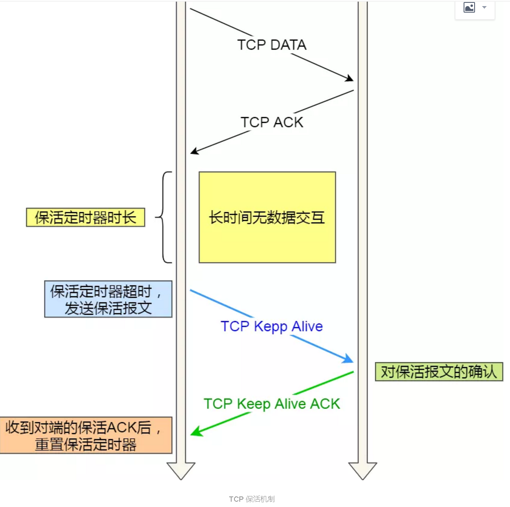

## 一、基础概念

### 1、TCP/IP 协议族

**应用层**

应用层( application-layer ）的任务是通过应用进程间的交互来完成特定网络应用。应用层协议定义的是应用进程（进程：主机中正在运行的程序）间的通信和交互的规则。
对于不同的网络应用需要不同的应用层协议。在互联网中应用层协议很多，如域名系统 DNS，支持万维网应用的 HTTP 协议，支持电子邮件的 SMTP 协议等等。

**运输层**

运输层(transport layer)的主要任务就是负责向两台主机进程之间的通信提供通用的数据传输服务。应用进程利用该服务传送应用层报文。
运输层主要使用一下两种协议

1. 传输控制协议-TCP：提供面向连接的，可靠的数据传输服务。
2. 用户数据协议-UDP：提供无连接的，尽最大努力的数据传输服务（不保证数据传输的可靠性）。


**网络层**

网络层的任务就是选择合适的网间路由和交换结点，确保计算机通信的数据及时传送。在发送数据时，网络层把运输层产生的报文段或用户数据报封装成分组和包进行传送。在 TCP/IP 体系结构中，由于网络层使用 IP 协议，因此分组也叫
IP 数据报 ，简称数据报。
互联网是由大量的异构（heterogeneous）网络通过路由器（router）相互连接起来的。互联网使用的网络层协议是无连接的网际协议（Intert Prococol）和许多路由选择协议，因此互联网的网络层也叫做网际层或 IP 层。

**数据链路层**

数据链路层(data link layer)通常简称为链路层。两台主机之间的数据传输，总是在一段一段的链路上传送的，这就需要使用专门的链路层的协议。
在两个相邻节点之间传送数据时，数据链路层将网络层交下来的 IP 数据报组装成帧，在两个相邻节点间的链路上传送帧。每一帧包括数据和必要的控制信息（如同步信息，地址信息，差错控制等）。
在接收数据时，控制信息使接收端能够知道一个帧从哪个比特开始和到哪个比特结束。

一般的web应用的通信传输流是这样的：


发送端在层与层之间传输数据时，每经过一层时会被打上一个该层所属的首部信息。反之，接收端在层与层之间传输数据时，每经过一层时会把对应的首部信息去除。

**物理层**

在物理层上所传送的数据单位是比特。 物理层(physical layer)的作用是实现相邻计算机节点之间比特流的透明传送，尽可能屏蔽掉具体传输介质和物理设备的差异。使其上面的数据链路层不必考虑网络的具体传输介质是什么。“透明传送
比特流”表示经实际电路传送后的比特流没有发生变化，对传送的比特流来说，这个电路好像是看不见的。


### 2、TCP/IP 协议族

在互联网使用的各种协议中最重要和最著名的就是 TCP/IP 两个协议。现在人们经常提到的 TCP/IP 并不一定是单指 TCP 和 IP 这两个具体的协议，而往往是表示互联网所使用的整个 TCP/IP 协议族。


互联网协议套件（英语：Internet Protocol Suite，缩写IPS）是一个网络通讯模型，以及一整个网络传输协议家族，为网际网络的基础通讯架构。它常被通称为TCP/IP协议族（英语：TCP/IP Protocol Suite，或TCP/IP Protocols），简称TCP/IP。因为该协定家族的两个核心协定：TCP（传输控制协议）和IP（网际协议），为该家族中最早通过的标准。


### 3、TCP的三次握手四次挥手

TCP是一种面向连接的、可靠的、基于字节流的传输层通信协议，在发送数据前，通信双方必须在彼此间建立一条连接。所谓的“连接”，其实是客户端和服务端保存的一份关于对方的信息，如ip地址、端口号等。
TCP可以看成是一种字节流，它会处理IP层或以下的层的丢包、重复以及错误问题。在连接的建立过程中，双方需要交换一些连接的参数。这些参数可以放在TCP头部。
一个TCP连接由一个4元组构成，分别是两个IP地址和两个端口号。一个TCP连接通常分为三个阶段：连接、数据传输、退出（关闭）。通过三次握手建立一个链接，通过四次挥手来关闭一个连接。
当一个连接被建立或被终止时，交换的报文段只包含TCP头部，而没有数据。

**TCP报文的头部结构**

在了解TCP连接之前先来了解一下TCP报文的头部结构。


上图中有几个字段需要重点介绍下：

（1）序号：seq序号，占32位，用来标识从TCP源端向目的端发送的字节流，发起方发送数据时对此进行标记。
（2）确认序号：ack序号，占32位，只有ACK标志位为1时，确认序号字段才有效，ack=seq+1。
（3）标志位：共6个，即URG、ACK、PSH、RST、SYN、FIN等，具体含义如下：
ACK：确认序号有效。
FIN：释放一个连接。
PSH：接收方应该尽快将这个报文交给应用层。
RST：重置连接。
SYN：发起一个新连接。
URG：紧急指针（urgent pointer）有效。
需要注意的是：
不要将确认序号ack与标志位中的ACK搞混了。
确认方ack=发起方seq+1，两端配对。


#### 1、**三次握手**

**三次握手的本质是确认通信双方收发数据的能力**

首先，我让信使运输一份信件给对方，对方收到了，那么他就知道了我的发件能力和他的收件能力是可以的。
于是他给我回信，我若收到了，我便知我的发件能力和他的收件能力是可以的，并且他的发件能力和我的收件能力是可以。
然而此时他还不知道他的发件能力和我的收件能力到底可不可以，于是我最后回馈一次，他若收到了，他便清楚了他的发件能力和我的收件能力是可以的。
这，就是三次握手，这样说，你理解了吗？


**第一次握手**：客户端要向服务端发起连接请求，首先客户端随机生成一个起始序列号ISN(比如是100)，那客户端向服务端发送的报文段包含SYN标志位(也就是SYN=1)，序列号seq=100。

**第二次握手**：服务端收到客户端发过来的报文后，发现SYN=1，知道这是一个连接请求，于是将客户端的起始序列号100存起来，并且随机生成一个服务端的起始序列号(比如是300)。然后给客户端回复一段报文，回复报文包含SYN和ACK标志(也就是SYN=1,ACK=1)、序列号seq=300、确认号ack=101(客户端发过来的序列号+1)。

**第三次握手**：客户端收到服务端的回复后发现ACK=1并且ack=101,于是知道服务端已经收到了序列号为100的那段报文；同时发现SYN=1，知道了服务端同意了这次连接，于是就将服务端的序列号300给存下来。然后客户端再回复一段报文给服务端，报文包含ACK标志位(ACK=1)、ack=301(服务端序列号+1)、seq=101(第一次握手时发送报文是占据一个序列号的，所以这次seq就从101开始，需要注意的是不携带数据的ACK报文是不占据序列号的，所以后面第一次正式发送数据时seq还是101)。当服务端收到报文后发现ACK=1并且ack=301，就知道客户端收到序列号为300的报文了，就这样客户端和服务端通过TCP建立了连接。


#### 2、四次挥手

**四次挥手的目的是关闭一个连接**


比如客户端初始化的序列号ISA=100，服务端初始化的序列号ISA=300。TCP连接成功后客户端总共发送了1000个字节的数据，服务端在客户端发FIN报文前总共回复了2000个字节的数据。

**第一次挥手**：当客户端的数据都传输完成后，客户端向服务端发出连接释放报文(当然数据没发完时也可以发送连接释放报文并停止发送数据)，释放连接报文包含FIN标志位(FIN=1)、序列号seq=1101(100+1+1000，其中的1是建立连接时占的一
个序列号)。需要注意的是客户端发出FIN报文段后只是不能发数据了，但是还可以正常收数据；另外FIN报文段即使不携带数据也要占据一个序列号。

**第二次挥手**：服务端收到客户端发的FIN报文后给客户端回复确认报文，确认报文包含ACK标志位(ACK=1)、确认号ack=1102(客户端FIN报文序列号1101+1)、序列号seq=2300(300+2000)。此时服务端处于关闭等待状态，而不是立马给客户端发FIN报文，这个状态还要持续一段时间，因为服务端可能还有数据没发完。

**第三次挥手**：服务端将最后数据(比如50个字节)发送完毕后就向客户端发出连接释放报文，报文包含FIN和ACK标志位(FIN=1,ACK=1)、确认号和第二次挥手一样ack=1102、序列号seq=2350(2300+50)。

**第四次挥手**：客户端收到服务端发的FIN报文后，向服务端发出确认报文，确认报文包含ACK标志位(ACK=1)、确认号ack=2351、序列号seq=1102。**注意客户端发出确认报文后不是立马释放TCP连接，而是要经过2MSL(最长报文段寿命的2倍时长)后才释放TCP连接。**而服务端一旦收到客户端发出的确认报文就会立马释放TCP接，所以服务端结束TCP连接的时间要比客户端早一些。


## 二、常见面试题

### 1、为什么TCP连接的时候是3次？2次不可以吗？

因为需要考虑连接时丢包的问题，如果只握手2次，**第二次握手时如果服务端发给客户端的确认报文段丢失**，此时服务端已经准备好了收发数(可以理解服务端已经连接成功)据，而客户端一直没收到服务端的确认报文，所以客户端就不知
道服务端是否已经准备好了(可以理解为客户端未连接成功)，这种情况下客户端不会给服务端发数据，也会忽略服务端发过来的数据。
如果是三次握手，即便发生丢包也不会有问题，比如如果第三次握手客户端发的确认ack报文丢失，服务端在一段时间内没有收到确认ack报文的话就会重新进行第二次握手，也就是服务端会重发SYN报文段，客户端收到重发的报文段后会再次给服务端发送确认ack报文。


### 2、为什么TCP连接的时候是3次，关闭的时候却是4次？

因为只有在客户端和服务端都没有数据要发送的时候才能断开TCP。而客户端发出FIN报文时只能保证客户端没有数据发了，服务端还有没有数据发客户端是不知道的。而服务端收到客户端的FIN报文后只能先回复客户端一个确认报文来告
诉客户端我服务端已经收到你的FIN报文了，但我服务端还有一些数据没发完，等这些数据发完了服务端才能给客户端发FIN报文(所以不能一次性将确认报文和FIN报文发给客户端，就是这里多出来了一次)。

### 3、为什么客户端发出第四次挥手的确认报文后要等2MSL的时间才能释放TCP连接？

这里同样是要考虑丢包的问题，如果第四次挥手的报文丢失，服务端没收到确认ack报文就会重发第三次挥手的报文，这样报文一去一回最长时间就是2MSL，所以需要等这么长时间来确认服务端确实已经收到了。

### 4、如果已经建立了连接，但是客户端突然出现故障了怎么办？

TCP设有一个保活计时器，客户端如果出现故障，服务器不能一直等下去，白白浪费资源。服务器每收到一次客户端的请求后都会重新复位这个计时器，时间通常是设置为2小时，若两小时还没有收到客户端的任何数据，服务器就会发送一
个探测报文段，以后每隔75秒钟发送一次。若一连发送10个探测报文仍然没反应，服务器就认为客户端出了故障，接着就关闭连接。

### 5、常用HTTP状态码

HTTP状态码表示客户端HTTP请求的返回结果、标识服务器处理是否正常、表明请求出现的错误等。
状态码的类别：


常用HTTP状态码：


### 6、Session、Cookie和Token的主要区别

HTTP协议本身是无状态的。什么是无状态呢，即服务器无法判断用户身份。

**什么是cookie**

cookie是由Web服务器保存在用户浏览器上的小文件（key-value格式），包含用户相关的信息。客户端向服务器发起请求，如果服务器需要记录该用户状态，就使用response向客户端浏览器颁发一个Cookie。客户端浏览器会把Cookie保
存起来。当浏览器再请求该网站时，浏览器把请求的网址连同该Cookie一同提交给服务器。服务器检查该Cookie，以此来辨认用户身份。

**什么是session**

session是依赖Cookie实现的。session是服务器端对象

session 是浏览器和服务器会话过程中，服务器分配的一块储存空间。服务器默认为浏览器在cookie中设置 sessionid，浏览器在向服务器请求过程中传输cookie 包含 sessionid ，服务器根据 sessionid 获取出会话中存储的信息，然后确定会话的身份信息。

**cookie与session区别**

存储位置与安全性：cookie数据存放在客户端上，安全性较差，session数据放在服务器上，安全性相对更高；
存储空间：单个cookie保存的数据不能超过4K，很多浏览器都限制一个站点最多保存20个cookie，session无此限制
占用服务器资源：session一定时间内保存在服务器上，当访问增多，占用服务器性能，考虑到服务器性能方面，应当使用cookie。

**什么是Token**

Token的引入：Token是在客户端频繁向服务端请求数据，服务端频繁的去数据库查询用户名和密码并进行对比，判断用户名和密码正确与否，并作出相应提示，在这样的背景下，Token便应运而生。
Token的定义：Token是服务端生成的一串字符串，以作客户端进行请求的一个令牌，当第一次登录后，服务器生成一个Token便将此Token返回给客户端，以后客户端只需带上这个Token前来请求数据即可，无需再次带上用户名和密码。
使用Token的目的：Token的目的是为了减轻服务器的压力，减少频繁的查询数据库，使服务器更加健壮。
Token 是在服务端产生的。如果前端使用用户名/密码向服务端请求认证，服务端认证成功，那么在服务端会返回 Token 给前端。前端可以在每次请求的时候带上 Token 证明自己的合法地位

**session与token区别**

session机制存在服务器压力增大，CSRF跨站伪造请求攻击，扩展性不强等问题；
session存储在服务器端，token存储在客户端
token提供认证和授权功能，作为身份认证，token安全性比session好；
session这种会话存储方式方式只适用于客户端代码和服务端代码运行在同一台服务器上，token适用于项目级的前后端分离（前后端代码运行在不同的服务器下）

### 7、如果客户端禁止 cookie 能实现 session 还能用吗？

Cookie 与 Session，一般认为是两个独立的东西，Session采用的是在服务器端保持状态的方案，而Cookie采用的是在客户端保持状态的方案。但为什么禁用Cookie就不能得到Session呢？因为Session是用Session ID来确定当前对话所对应的服务器Session，而Session ID是通过Cookie来传递的，禁用Cookie相当于失去了Session ID，也就得不到Session了。
假定用户关闭Cookie的情况下使用Session，其实现途径有以下几种：

1. 手动通过URL传值、隐藏表单传递Session ID。
2. 用文件、数据库等形式保存Session ID，在跨页过程中手动调用。


## 三、正文图解 TCP 重传、滑动窗口、流量控制、拥塞控制

### 重传机制


#### 1、重传机制

TCP 实现可靠传输的方式之一，是通过序列号与确认应答。

在 TCP 中，当发送端的数据到达接收主机时，接收端主机会返回一个确认应答消息，表示已收到消息。


正常的数据传输

但在错综复杂的网络，并不一定能如上图那么顺利能正常的数据传输，万一数据在传输过程中丢失了呢？

所以 TCP 针对数据包丢失的情况，会用重传机制解决。

接下来说说常见的重传机制：

- 超时重传
- 快速重传
- SACK
- D-SACK

**超时重传**

重传机制的其中一个方式，就是在发送数据时，设定一个定时器，当超过指定的时间后，没有收到对方的 ACK 确认应答报文，就会重发该数据，也就是我们常说的超时重传。

TCP 会在以下两种情况发生超时重传：

1、数据包丢失

2、确认应答丢失


超时时间应该设置为多少呢？

我们先来了解一下什么是 RTT（Round-Trip Time 往返时延），从下图我们就可以知道：


**RTT**

RTT 就是数据从网络一端传送到另一端所需的时间，也就是包的往返时间。

超时重传时间是以 RTO （Retransmission Timeout 超时重传时间）表示。

假设在重传的情况下，超时时间 RTO 「较长或较短」时，会发生什么事情呢？


超时时间较长与较短

上图中有两种超时时间不同的情况：

- 当超时时间 RTO 较大时，重发就慢，丢了老半天才重发，没有效率，性能差；
- 当超时时间 RTO 较小时，会导致可能并没有丢就重发，于是重发的就快，会增加网络拥塞，导致更多的超时，更多的超时导致更多的重发。

精确的测量超时时间 RTO 的值是非常重要的，这可让我们的重传机制更高效。

根据上述的两种情况，我们可以得知，超时重传时间 RTO 的值应该略大于报文往返 RTT 的值。


RTO 应略大于 RTT

至此，可能大家觉得超时重传时间 RTO 的值计算，也不是很复杂嘛。

好像就是在发送端发包时记下 t0 ，然后接收端再把这个 ack 回来时再记一个 t1，于是 RTT = t1 – t0。没那么简单，这只是一个采样，不能代表普遍情况。

实际上「报文往返 RTT 的值」是经常变化的，因为我们的网络也是时常变化的。也就因为「报文往返 RTT 的值」 是经常波动变化的，所以「超时重传时间 RTO 的值」应该是一个动态变化的值。

我们来看看 Linux 是如何计算 RTO 的呢？

估计往返时间，通常需要采样以下两个：

- 需要 TCP 通过采样 RTT 的时间，然后进行加权平均，算出一个平滑 RTT 的值，而且这个值还是要不断变化的，因为网络状况不断地变化。
- 除了采样 RTT，还要采样 RTT 的波动范围，这样就避免如果 RTT 有一个大的波动的话，很难被发现的情况。

RFC6289 建议使用以下的公式计算 RTO：


RFC6289 建议的 RTO 计算

其中 SRTT 是计算平滑的RTT ，DevRTR 是计算平滑的RTT 与 最新 RTT 的差距。

在 Linux 下，α = 0.125，β = 0.25， μ = 1，∂ = 4。别问怎么来的，问就是大量实验中调出来的。

如果超时重发的数据，再次超时的时候，又需要重传的时候，TCP 的策略是超时间隔加倍。

也就是每当遇到一次超时重传的时候，都会将下一次超时时间间隔设为先前值的两倍。两次超时，就说明网络环境差，不宜频繁反复发送。

超时触发重传存在的问题是，超时周期可能相对较长。那是不是可以有更快的方式呢？

于是就可以用「快速重传」机制来解决超时重发的时间等待。

#### 2、快速重传

TCP 还有另外一种快速重传（Fast Retransmit）机制，它不以时间为驱动，而是以数据驱动重传。

快速重传机制，是如何工作的呢？其实很简单，一图胜千言。


快速重传机制

在上图，发送方发出了 1，2，3，4，5 份数据：

第一份 Seq1 先送到了，于是就 Ack 回 2；

结果 Seq2 因为某些原因没收到，Seq3 到达了，于是还是 Ack 回 2；

后面的 Seq4 和 Seq5 都到了，但还是 Ack 回 2，因为 Seq2 还是没有收到；

发送端收到了三个 Ack = 2 的确认，知道了 Seq2 还没有收到，就会在定时器过期之前，重传丢失的 Seq2。

最后，接收到收到了 Seq2，此时因为 Seq3，Seq4，Seq5 都收到了，于是 Ack 回 6 。

所以，快速重传的工作方式是当收到三个相同的 ACK 报文时，会在定时器过期之前，重传丢失的报文段。

快速重传机制只解决了一个问题，就是超时时间的问题，但是它依然面临着另外一个问题。就是重传的时候，是重传之前的一个，还是重传所有的问题。

比如对于上面的例子，是重传 Seq2 呢？还是重传 Seq2、Seq3、Seq4、Seq5 呢？因为发送端并不清楚这连续的三个 Ack 2 是谁传回来的。

根据 TCP 不同的实现，以上两种情况都是有可能的。可见，这是一把双刃剑。

为了解决不知道该重传哪些 TCP 报文，于是就有 SACK 方法。

#### 3、SACK 方法

还有一种实现重传机制的方式叫：SACK（ Selective Acknowledgment 选择性确认）。

这种方式需要在 TCP 头部「选项」字段里加一个 SACK 的东西，它可以将缓存的地图发送给发送方，这样发送方就可以知道哪些数据收到了，哪些数据没收到，知道了这些信息，就可以只重传丢失的数据。

如下图，发送方收到了三次同样的 ACK 确认报文，于是就会触发快速重发机制，通过SACK 信息发现只有 200~299 这段数据丢失，则重发时，就只选择了这个 TCP 段进行重复。


选择性确认

如果要支持 SACK，必须双方都要支持。在 Linux 下，可以通过 net.ipv4.tcp_sack参数打开这个功能（Linux 2.4 后默认打开）。

#### 4、Duplicate SACK

Duplicate SACK 又称 D-SACK，其主要使用了 SACK 来告诉「发送方」有哪些数据被重复接收了。

下面举例两个栗子，来说明 D-SACK 的作用。

栗子一号：ACK 丢包


ACK 丢包

「接收方」发给「发送方」的两个 ACK 确认应答都丢失了，所以发送方超时后，重传第一个数据包（3000 ~ 3499）

于是「接收方」发现数据是重复收到的，于是回了一个 SACK = 3000~3500，告诉「发送方」 3000~3500 的数据早已被接收了，因为 ACK 都到了 4000 了，已经意味着 4000 之前的所有数据都已收到，所以这个 SACK 就代表着 D-SACK。

这样「发送方」就知道了，数据没有丢，是「接收方」的 ACK 确认报文丢了。

栗子二号：网络延时


**网络延时**

数据包（1000~1499） 被网络延迟了，导致「发送方」没有收到 Ack 1500 的确认报文。

而后面报文到达的三个相同的 ACK 确认报文，就触发了快速重传机制，但是在重传后，被延迟的数据包（1000~1499）又到了「接收方」；

所以「接收方」回了一个 SACK=1000~1500，因为 ACK 已经到了 3000，所以这个 SACK 是 D-SACK，表示收到了重复的包。

这样发送方就知道快速重传触发的原因不是发出去的包丢了，也不是因为回应的 ACK 包丢了，而是因为网络延迟了。

可见，D-SACK 有这么几个好处：

可以让「发送方」知道，是发出去的包丢了，还是接收方回应的 ACK 包丢了;

可以知道是不是「发送方」的数据包被网络延迟了;

可以知道网络中是不是把「发送方」的数据包给复制了;

在 Linux 下可以通过 net.ipv4.tcp_dsack 参数开启/关闭这个功能（Linux 2.4 后默认打开）。

### 滑动窗口

引入窗口概念的原因

我们都知道 TCP 是每发送一个数据，都要进行一次确认应答。当上一个数据包收到了应答了， 再发送下一个。

这个模式就有点像我和你面对面聊天，你一句我一句。但这种方式的缺点是效率比较低的。

如果你说完一句话，我在处理其他事情，没有及时回复你，那你不是要干等着我做完其他事情后，我回复你，你才能说下一句话，很显然这不现实。


按数据包进行确认应答

所以，这样的传输方式有一个缺点：数据包的往返时间越长，通信的效率就越低。

为解决这个问题，TCP 引入了窗口这个概念。即使在往返时间较长的情况下，它也不会降低网络通信的效率。

那么有了窗口，就可以指定窗口大小，窗口大小就是指无需等待确认应答，而可以继续发送数据的最大值。

窗口的实现实际上是操作系统开辟的一个缓存空间，发送方主机在等到确认应答返回之前，必须在缓冲区中保留已发送的数据。如果按期收到确认应答，此时数据就可以从缓存区清除。

假设窗口大小为 3 个 TCP 段，那么发送方就可以「连续发送」 3 个 TCP 段，并且中途若有 ACK 丢失，可以通过「下一个确认应答进行确认」。如下图：


用滑动窗口方式并行处理

图中的 ACK 600 确认应答报文丢失，也没关系，因为可以通话下一个确认应答进行确认，只要发送方收到了 ACK 700 确认应答，就意味着 700 之前的所有数据「接收方」都收到了。这个模式就叫累计确认或者累计应答。

窗口大小由哪一方决定？

TCP 头里有一个字段叫 Window，也就是窗口大小。

这个字段是接收端告诉发送端自己还有多少缓冲区可以接收数据。于是发送端就可以根据这个接收端的处理能力来发送数据，而不会导致接收端处理不过来。

**所以，通常窗口的大小是由接收方的决定的。**

发送方发送的数据大小不能超过接收方的窗口大小，否则接收方就无法正常接收到数据。

发送方的滑动窗口

我们先来看看发送方的窗口，下图就是发送方缓存的数据，根据处理的情况分成四个部分，其中深蓝色方框是发送窗口，紫色方框是可用窗口：


\#1 是已发送并收到 ACK确认的数据：1~31 字节

\#2 是已发送但未收到 ACK确认的数据：32~45 字节

\#3 是未发送但总大小在接收方处理范围内（接收方还有空间）：46~51字节

\#4 是未发送但总大小超过接收方处理范围（接收方没有空间）：52字节以后

在下图，当发送方把数据「全部」都一下发送出去后，可用窗口的大小就为 0 了，表明可用窗口耗尽，在没收到 ACK 确认之前是无法继续发送数据了。


可用窗口耗尽

在下图，当收到之前发送的数据 32~36 字节的 ACK 确认应答后，如果发送窗口的大小没有变化，则滑动窗口往右边移动 5 个字节，因为有 5 个字节的数据被应答确认，接下来 52~56 字节又变成了可用窗口，那么后续也就可以发送 52~56 这 5 个字节的数据了。


32 ~ 36 字节已确认

程序是如何表示发送方的四个部分的呢？

TCP 滑动窗口方案使用三个指针来跟踪在四个传输类别中的每一个类别中的字节。其中两个指针是绝对指针（指特定的序列号），一个是相对指针（需要做偏移）。


SND.WND、SND.UN、SND.NXT

SND.WND：表示发送窗口的大小（大小是由接收方指定的）；

SND.UNA：是一个绝对指针，它指向的是已发送但未收到确认的第一个字节的序列号，也就是 #2 的第一个字节。

SND.NXT：也是一个绝对指针，它指向未发送但可发送范围的第一个字节的序列号，也就是 #3 的第一个字节。

指向 #4 的第一个字节是个相对指针，它需要 SND.NXT 指针加上 SND.WND大小的偏移量，就可以指向 #4 的第一个字节了。

那么可用窗口大小的计算就可以是：

可用窗口大 = SND.WND -（SND.NXT - SND.UNA）

接收方的滑动窗口

接下来我们看看接收方的窗口，接收窗口相对简单一些，根据处理的情况划分成三个部分：

\#1 + #2 是已成功接收并确认的数据（等待应用进程读取）；

\#3 是未收到数据但可以接收的数据；

\#4 未收到数据并不可以接收的数据；


接收窗口

其中三个接收部分，使用两个指针进行划分:

RCV.WND：表示接收窗口的大小，它会通告给发送方。

RCV.NXT：是一个指针，它指向期望从发送方发送来的下一个数据字节的序列号，也就是 #3 的第一个字节。

指向 #4 的第一个字节是个相对指针，它需要 RCV.NXT 指针加上 RCV.WND大小的偏移量，就可以指向 #4 的第一个字节了。

接收窗口和发送窗口的大小是相等的吗？

并不是完全相等，接收窗口的大小是约等于发送窗口的大小的。

因为滑动窗口并不是一成不变的。比如，当接收方的应用进程读取数据的速度非常快的话，这样的话接收窗口可以很快的就空缺出来。那么新的接收窗口大小，是通过 TCP 报文中的 Windows 字段来告诉发送方。那么这个传输过程是存在时延的，所以接收窗口和发送窗口是约等于的关系。

### 流量控制

发送方不能无脑的发数据给接收方，要考虑接收方处理能力。

如果一直无脑的发数据给对方，但对方处理不过来，那么就会导致触发重发机制，从而导致网络流量的无端的浪费。

为了解决这种现象发生，TCP 提供一种机制可以让「发送方」根据「接收方」的实际接收能力控制发送的数据量，这就是所谓的流量控制。

下面举个栗子，为了简单起见，假设以下场景：

客户端是接收方，服务端是发送方

假设接收窗口和发送窗口相同，都为 200

假设两个设备在整个传输过程中都保持相同的窗口大小，不受外界影响


流量控制

根据上图的流量控制，说明下每个过程：

客户端向服务端发送请求数据报文。这里要说明下，本次例子是把服务端作为发送方，所以没有画出服务端的接收窗口。

服务端收到请求报文后，发送确认报文和 80 字节的数据，于是可用窗口 Usable减少为 120 字节，同时 SND.NXT 指针也向右偏移 80 字节后，指向 321，这意味着下次发送数据的时候，序列号是 321。

客户端收到 80 字节数据后，于是接收窗口往右移动 80 字节，RCV.NXT 也就指向 321，这意味着客户端期望的下一个报文的序列号是 321，接着发送确认报文给服务端。

服务端再次发送了 120 字节数据，于是可用窗口耗尽为 0，服务端无法在继续发送数据。

客户端收到 120 字节的数据后，于是接收窗口往右移动 120 字节，RCV.NXT 也就指向 441，接着发送确认报文给服务端。

服务端收到对 80 字节数据的确认报文后，SND.UNA 指针往右偏移后指向 321，于是可用窗口 Usable 增大到 80。

服务端收到对 120 字节数据的确认报文后，SND.UNA 指针往右偏移后指向 441，于是可用窗口 Usable 增大到 200。

服务端可以继续发送了，于是发送了 160 字节的数据后，SND.NXT 指向 601，于是可用窗口 Usable 减少到 40。

客户端收到 160 字节后，接收窗口往右移动了 160 字节，RCV.NXT 也就是指向了 601，接着发送确认报文给服务端。

服务端收到对 160 字节数据的确认报文后，发送窗口往右移动了 160 字节，于是SND.UNA 指针偏移了 160 后指向 601，可用窗口 Usable 也就增大至了 200。

操作系统缓冲区与滑动窗口的关系

前面的流量控制例子，我们假定了发送窗口和接收窗口是不变的，但是实际上，发送窗口和接收窗口中所存放的字节数，都是放在操作系统内存缓冲区中的，而操作系统的缓冲区，会被操作系统调整。

当应用进程没办法及时读取缓冲区的内容时，也会对我们的缓冲区造成影响。

那操作系统的缓冲区，是如何影响发送窗口和接收窗口的呢？

我们先来看看第一个例子。

当应用程序没有及时读取缓存时，发送窗口和接收窗口的变化。

考虑以下场景：

客户端作为发送方，服务端作为接收方，发送窗口和接收窗口初始大小为 360；

服务端非常的繁忙，当收到客户端的数据时，应用层不能及时读取数据。


根据上图的流量控制，说明下每个过程：

客户端发送 140 字节数据后，可用窗口变为 220 （360 - 140）。

服务端收到 140 字节数据，但是服务端非常繁忙，应用进程只读取了 40 个字节，还有 100 字节占用着缓冲区，于是接收窗口收缩到了 260 （360 - 100），最后发送确认信息时，将窗口大小通过给客户端。

客户端收到确认和窗口通告报文后，发送窗口减少为 260。

客户端发送 180 字节数据，此时可用窗口减少到 80。

服务端收到 180 字节数据，但是应用程序没有读取任何数据，这 180 字节直接就留在了缓冲区，于是接收窗口收缩到了 80 （260 - 180），并在发送确认信息时，通过窗口大小给客户端。

客户端收到确认和窗口通告报文后，发送窗口减少为 80。

客户端发送 80 字节数据后，可用窗口耗尽。

服务端收到 80 字节数据，但是应用程序依然没有读取任何数据，这 80 字节留在了缓冲区，于是接收窗口收缩到了 0，并在发送确认信息时，通过窗口大小给客户端。

客户端收到确认和窗口通告报文后，发送窗口减少为 0。

可见最后窗口都收缩为 0 了，也就是发生了窗口关闭。当发送方可用窗口变为 0 时，发送方实际上会定时发送窗口探测报文，以便知道接收方的窗口是否发生了改变，这个内容后面会说，这里先简单提一下。

我们先来看看第二个例子。

当服务端系统资源非常紧张的时候，操心系统可能会直接减少了接收缓冲区大小，这时应用程序又无法及时读取缓存数据，那么这时候就有严重的事情发生了，会出现数据包丢失的现象。


说明下每个过程：

客户端发送 140 字节的数据，于是可用窗口减少到了 220。

服务端因为现在非常的繁忙，操作系统于是就把接收缓存减少了 100 字节，当收到 对 140 数据确认报文后，又因为应用程序没有读取任何数据，所以 140 字节留在了缓冲区中，于是接收窗口大小从 360 收缩成了 100，最后发送确认信息时，通告窗口大小给对方。

此时客户端因为还没有收到服务端的通告窗口报文，所以不知道此时接收窗口收缩成了 100，客户端只会看自己的可用窗口还有 220，所以客户端就发送了 180 字节数据，于是可用窗口减少到 40。

服务端收到了 180 字节数据时，发现数据大小超过了接收窗口的大小，于是就把数据包丢失了。

客户端收到第 2 步时，服务端发送的确认报文和通告窗口报文，尝试减少发送窗口到 100，把窗口的右端向左收缩了 80，此时可用窗口的大小就会出现诡异的负值。

所以，如果发生了先减少缓存，再收缩窗口，就会出现丢包的现象。

为了防止这种情况发生，TCP 规定是不允许同时减少缓存又收缩窗口的，而是采用先收缩窗口，过段时间在减少缓存，这样就可以避免了丢包情况。

### 窗口关闭

在前面我们都看到了，TCP 通过让接收方指明希望从发送方接收的数据大小（窗口大小）来进行流量控制。

如果窗口大小为 0 时，就会阻止发送方给接收方传递数据，直到窗口变为非 0 为止，这就是窗口关闭。

窗口关闭潜在的危险

接收方向发送方通告窗口大小时，是通过 ACK 报文来通告的。

那么，当发生窗口关闭时，接收方处理完数据后，会向发送方通告一个窗口非 0 的 ACK 报文，如果这个通告窗口的 ACK 报文在网络中丢失了，那麻烦就大了。


窗口关闭潜在的危险

这会导致发送方一直等待接收方的非 0 窗口通知，接收方也一直等待发送方的数据，如不不采取措施，这种相互等待的过程，会造成了死锁的现象。

TCP 是如何解决窗口关闭时，潜在的死锁现象呢？

为了解决这个问题，TCP 为每个连接设有一个持续定时器，只要 TCP 连接一方收到对方的零窗口通知，就启动持续计时器。

如果持续计时器超时，就会发送窗口探测 ( Window probe ) 报文，而对方在确认这个探测报文时，给出自己现在的接收窗口大小。


窗口探测

如果接收窗口仍然为 0，那么收到这个报文的一方就会重新启动持续计时器；

如果接收窗口不是 0，那么死锁的局面就可以被打破了。

窗口探查探测的次数一般为 3 此次，每次次大约 30-60 秒（不同的实现可能会不一样）。如果 3 次过后接收窗口还是 0 的话，有的 TCP 实现就会发 RST 报文来中断连接。

### 拥塞控制

为什么要有拥塞控制呀，不是有流量控制了吗？

前面的流量控制是避免「发送方」的数据填满「接收方」的缓存，但是并不知道网络的中发生了什么。

一般来说，计算机网络都处在一个共享的环境。因此也有可能会因为其他主机之间的通信使得网络拥堵。

在网络出现拥堵时，如果继续发送大量数据包，可能会导致数据包时延、丢失等，这时 TCP 就会重传数据，但是一重传就会导致网络的负担更重，于是会导致更大的延迟以及更多的丢包，这个情况就会进入恶性循环被不断地放大….

所以，TCP 不能忽略网络上发生的事，它被设计成一个无私的协议，当网络发送拥塞时，TCP 会自我牺牲，降低发送的数据量。

于是，就有了拥塞控制，控制的目的就是避免「发送方」的数据填满整个网络。

为了在「发送方」调节所要发送数据的量，定义了一个叫做「拥塞窗口」的概念。

什么是拥塞窗口？和发送窗口有什么关系呢？

拥塞窗口 cwnd是发送方维护的一个 的状态变量，它会根据网络的拥塞程度动态变化的。

我们在前面提到过发送窗口 swnd 和接收窗口 rwnd 是约等于的关系，那么由于入了拥塞窗口的概念后，此时发送窗口的值是swnd = min(cwnd, rwnd)，也就是拥塞窗口和接收窗口中的最小值。

拥塞窗口 cwnd 变化的规则：

只要网络中没有出现拥塞，cwnd 就会增大；

但网络中出现了拥塞，cwnd 就减少；

那么怎么知道当前网络是否出现了拥塞呢？

其实只要「发送方」没有在规定时间内接收到 ACK 应答报文，也就是发生了超时重传，就会认为网络出现了用拥塞。

拥塞控制有哪些控制算法？

拥塞控制主要是四个算法：

- 慢启动
- 拥塞避免
- 拥塞发生
- 快速恢复

#### 慢启动

TCP 在刚建立连接完成后，首先是有个慢启动的过程，**这个慢启动的意思就是一点一点的提高发送数据包的数量**，如果一上来就发大量的数据，这不是给网络添堵吗？

慢启动的算法记住一个规则就行：当发送方每收到一个 ACK，就拥塞窗口 cwnd 的大小就会加 1。

这里假定拥塞窗口 cwnd 和发送窗口 swnd 相等，下面举个栗子：

连接建立完成后，一开始初始化 cwnd = 1，表示可以传一个 MSS 大小的数据。

当收到一个 ACK 确认应答后，cwnd 增加 1，于是一次能够发送 2 个

当收到 2 个的 ACK 确认应答后， cwnd 增加 2，于是就可以比之前多发2 个，所以这一次能够发送 4 个

当这 4 个的 ACK 确认到来的时候，每个确认 cwnd 增加 1， 4 个确认 cwnd 增加 4，于是就可以比之前多发 4 个，所以这一次能够发送 8 个。


慢启动算法

可以看出慢启动算法，发包的个数是指数性的增长。

那慢启动涨到什么时候是个头呢？

有一个叫慢启动门限 ssthresh （slow start threshold）状态变量。

当 cwnd < ssthresh 时，使用慢启动算法。

当 cwnd >= ssthresh 时，就会使用「拥塞避免算法」。

#### 拥塞避免算法

前面说道，当拥塞窗口 cwnd 「超过」慢启动门限 ssthresh 就会进入拥塞避免算法。

一般来说 ssthresh 的大小是 65535 字节。

那么进入拥塞避免算法后，它的规则是：每当收到一个 ACK 时，cwnd 增加 1/cwnd。

接上前面的慢启动的栗子，现假定 ssthresh 为 8：

当 8 个 ACK 应答确认到来时，每个确认增加 1/8，8 个 ACK 确认 cwnd 一共增加 1，于是这一次能够发送 9 个 MSS 大小的数据，变成了线性增长。


拥塞避免

所以，我们可以发现，拥塞避免算法就是将原本慢启动算法的指数增长变成了线性增长，还是增长阶段，但是增长速度缓慢了一些。

就这么一直增长着后，网络就会慢慢进入了拥塞的状况了，于是就会出现丢包现象，这时就需要对丢失的数据包进行重传。

当触发了重传机制，也就进入了「拥塞发生算法」。

#### 拥塞发生

当网络出现拥塞，也就是会发生数据包重传，重传机制主要有两种：

超时重传

快速重传


这两种使用的拥塞发送算法是不同的，接下来分别来说说。

发生超时重传的拥塞发生算法

当发生了「超时重传」，则就会使用拥塞发生算法。

这个时候，sshresh 和 cwnd 的值会发生变化：

ssthresh 设为 cwnd/2，

cwnd 重置为 1


拥塞发送 —— 超时重传

接着，就重新开始慢启动，慢启动是会突然减少数据流的。这真是一旦「超时重传」，马上回到解放前。但是这种方式太激进了，反应也很强烈，会造成网络卡顿。

就好像本来在秋名山高速漂移着，突然来个紧急刹车，轮胎受得了吗。。。

发生快速重传的拥塞发生算法

还有更好的方式，前面我们讲过「快速重传算法」。当接收方发现丢了一个中间包的时候，发送三次前一个包的 ACK，于是发送端就会快速地重传，不必等待超时再重传。

TCP 认为这种情况不严重，因为大部分没丢，只丢了一小部分，则 ssthresh 和cwnd 变化如下：

cwnd = cwnd/2 ，也就是设置为原来的一半;

ssthresh = cwnd;

进入快速恢复算法


#### 快速恢复

快速重传和快速恢复算法一般同时使用，快速恢复算法是认为，你还能收到 3 个重复 ACK 说明网络也不那么糟糕，所以没有必要像 RTO 超时那么强烈。

正如前面所说，进入快速恢复之前，cwnd 和 ssthresh 已被更新了：

cwnd = cwnd/2 ，也就是设置为原来的一半;

ssthresh = cwnd;

然后，进入快速恢复算法如下：

拥塞窗口 cwnd = ssthresh + 3 （ 3 的意思是确认有 3 个数据包被收到了）

重传丢失的数据包

如果再收到重复的 ACK，那么 cwnd 增加 1

如果收到新数据的 ACK 后，设置 cwnd 为 ssthresh，接着就进入了拥塞避免算法


快速重传和快速恢复

也就是没有像「超时重传」一夜回到解放前，而是还在比较高的值，后续呈线性增长。


## 四、socket

对TCP/IP、UDP、Socket编程这些词你不会很陌生吧？随着网络技术的发展，这些词充斥着我们的耳朵。那么我想问：

1. 什么是TCP/IP、UDP？

2. Socket在哪里呢？

3. Socket是什么呢？

4. 你会使用它们吗？

**什么是TCP/IP、UDP？**

​     TCP/IP（Transmission Control Protocol/Internet Protocol）即传输控制协议/网间协议，是一个工业标准的协议集，它是为广域网（WANs）设计的。

​     UDP（User Data Protocol，用户数据报协议）是与TCP相对应的协议。它是属于TCP/IP协议族中的一种。

​    这里有一张图，表明了这些协议的关系。


  TCP/IP协议族包括运输层、网络层、链路层。现在你知道TCP/IP与UDP的关系了吧。

**Socket在哪里呢？**

在图1中，我们没有看到Socket的影子，那么它到底在哪里呢？还是用图来说话，一目了然。


 原来Socket在这里。

**Socket是什么呢？**

​    Socket是应用层与TCP/IP协议族通信的中间软件抽象层，它是一组接口。在设计模式中，**Socket其实就是一个门面模式**，它把复杂的TCP/IP协议族隐藏在Socket接口后面，对用户来说，一组简单的接口就是全部，让Socket去组织数据，以符合指定的协议。

**你会使用它们吗？**

​    前人已经给我们做了好多的事了，网络间的通信也就简单了许多，但毕竟还是有挺多工作要做的。以前听到Socket编程，觉得它是比较高深的编程知识，但是只要弄清Socket编程的工作原理，神秘的面纱也就揭开了。

​    一个生活中的场景。你要打电话给一个朋友，先拨号，朋友听到电话铃声后提起电话，这时你和你的朋友就建立起了连接，就可以讲话了。等交流结束，挂断电话结束此次交谈。  生活中的场景就解释了这工作原理，也许TCP/IP协议族就是诞生于生活中，这也不一定。


 先从服务器端说起。服务器端先初始化Socket，然后与端口绑定(bind)，对端口进行监听(listen)，调用accept阻塞，等待客户端连接。在这时如果有个客户端初始化一个Socket，然后连接服务器(connect)，如果连接成功，这时客户端与服务器端的连接就建立了。客户端发送数据请求，服务器端接收请求并处理请求，然后把回应数据发送给客户端，客户端读取数据，最后关闭连接，一次交互结束。

我们深谙信息交流的价值，那网络中进程之间如何通信，如我们每天打开浏览器浏览网页 时，浏览器的进程怎么与web服务器通信的？当你用QQ聊天时，QQ进程怎么与服务器或你好友所在的QQ进程通信？这些都得靠socket？那什么是 socket？socket的类型有哪些？还有socket的基本函数，这些都是本文想介绍的。本文的主要内容如下：

- 1、网络中进程之间如何通信？
- 2、Socket是什么？
- 3、socket的基本操作

- - 3.1、socket()函数
  - 3.2、bind()函数
  - 3.3、listen()、connect()函数
  - 3.4、accept()函数
  - 3.5、read()、write()函数等
  - 3.6、close()函数

- 4、socket中TCP的三次握手建立连接详解
- 5、socket中TCP的四次握手释放连接详解
- 6、一个例子

**1、网络中进程之间如何通信？**

本地的进程间通信（IPC）有很多种方式，但可以总结为下面4类：

- 消息传递（管道、FIFO、消息队列）
- 同步（互斥量、条件变量、读写锁、文件和写记录锁、信号量）
- 共享内存（匿名的和具名的）
- 远程过程调用（Solaris门和Sun RPC）

但这些都不是本文的主题！我们要讨论的是网络中进程之间如何通信？首要解决的问题是如何唯一标识一个进程，否则通信无从谈起！在本地可以通过进程PID来唯一标识一个进程，但是在网络中这是行不通的。其实TCP/IP协议族已经帮我们解决了这个问题，网络层的“**ip地址**”可以唯一标识网络中的主机，而传输层的“**协议+端口**”可以唯一标识主机中的应用程序（进程）。这样利用三元组（ip地址，协议，端口）就可以标识网络的进程了，网络中的进程通信就可以利用这个标志与其它进程进行交互。

使用TCP/IP协议的应用程序通常采用应用编程接口：UNIX BSD的套接字（socket）和UNIX System V的TLI（已经被淘汰），来实现网络进程之间的通信。就目前而言，几乎所有的应用程序都是采用socket，而现在又是网络时代，网络中进程通信是无处不在，这就是我为什么说“一切皆socket”。

**2、什么是Socket？**

上面我们已经知道网络中的进程是通过socket来通信的，那什么是socket呢？socket起源于Unix，而Unix/Linux基本哲学之一就是“一切皆文件”，都可以用“打开open –> 读写write/read –> 关闭close”模式来操作。我的理解就是Socket就是该模式的一个实现，socket即是一种特殊的文件，一些socket函数就是对其进行的操作（读/写IO、打开、关闭），这些函数我们在后面进行介绍。

**socket一词的起源**

在组网领域的首次使用是在1970年2月12日发布的文献[IETF RFC33](http://datatracker.ietf.org/doc/rfc33/)中发现的，撰写者为Stephen Carr、Steve Crocker和Vint Cerf。根据美国计算机历史博物馆的记载，Croker写道：“命名空间的元素都可称为套接字接口。一个套接字接口构成一个连接的一端，而一个连接可完全由一对套接字接口规定。”计算机历史博物馆补充道：“这比BSD的套接字接口定义早了大约12年。”

**3、socket的基本操作**

既然socket是“open—write/read—close”模式的一种实现，那么socket就提供了这些操作对应的函数接口。下面以TCP为例，介绍几个基本的socket接口函数。

**3.1、socket()函数**

int **socket**(int domain, int type, int protocol);

socket函数对应于普通文件的打开操作。普通文件的打开操作返回一个文件描述字，而**socket()**用于创建一个socket描述符（socket descriptor），它唯一标识一个socket。这个socket描述字跟文件描述字一样，后续的操作都有用到它，把它作为参数，通过它来进行一些读写操作。

正如可以给fopen的传入不同参数值，以打开不同的文件。创建socket的时候，也可以指定不同的参数创建不同的socket描述符，socket函数的三个参数分别为：

- domain：即协议域，又称为协议族（family）。常用的协议族有，AF_INET、AF_INET6、AF_LOCAL（或称AF_UNIX，Unix域socket）、AF_ROUTE等等。协议族决定了socket的地址类型，在通信中必须采用对应的地址，如AF_INET决定了要用ipv4地址（32位的）与端口号（16位的）的组合、AF_UNIX决定了要用一个绝对路径名作为地址。
- type：指定socket类型。常用的socket类型有，SOCK_STREAM、SOCK_DGRAM、SOCK_RAW、SOCK_PACKET、SOCK_SEQPACKET等等（socket的类型有哪些？）。
- protocol：故名思意，就是指定协议。常用的协议有，IPPROTO_TCP、IPPTOTO_UDP、IPPROTO_SCTP、IPPROTO_TIPC等，它们分别对应TCP传输协议、UDP传输协议、STCP传输协议、TIPC传输协议（这个协议我将会单独开篇讨论！）。

注意：并不是上面的type和protocol可以随意组合的，如SOCK_STREAM不可以跟IPPROTO_UDP组合。当protocol为0时，会自动选择type类型对应的默认协议。

当我们调用**socket**创建一个socket时，返回的socket描述字它存在于协议族（address family，AF_XXX）空间中，但没有一个具体的地址。如果想要给它赋值一个地址，就必须调用bind()函数，否则就当调用connect()、listen()时系统会自动随机分配一个端口。

**3.2、bind()函数**

正如上面所说bind()函数把一个地址族中的特定地址赋给socket。例如对应AF_INET、AF_INET6就是把一个ipv4或ipv6地址和端口号组合赋给socket。

int bind(int sockfd, const struct sockaddr *addr, socklen_t addrlen);

函数的三个参数分别为：

- sockfd：即socket描述字，它是通过socket()函数创建了，唯一标识一个socket。bind()函数就是将给这个描述字绑定一个名字。
- addr：一个const struct sockaddr *指针，指向要绑定给sockfd的协议地址。这个地址结构根据地址创建socket时的地址协议族的不同而不同，如ipv4对应的是：

```c
struct sockaddr_in {
    sa_family_t    sin_family; 
    in_port_t      sin_port;   
    struct in_addr sin_addr;   
};


struct in_addr {
    uint32_t       s_addr;     
};
```

ipv6对应的是：

```c
struct sockaddr_in6 { 
    sa_family_t     sin6_family;    
    in_port_t       sin6_port;      
    uint32_t        sin6_flowinfo;  
    struct in6_addr sin6_addr;      
    uint32_t        sin6_scope_id;  
};

struct in6_addr { 
    unsigned char   s6_addr[16];    
};
```

Unix域对应的是：

```c
#define UNIX_PATH_MAX    108

struct sockaddr_un { 
    sa_family_t sun_family;                
    char        sun_path[UNIX_PATH_MAX];   
};
```

- addrlen：对应的是地址的长度。

通常服务器在启动的时候都会绑定一个众所周知的地址（如ip地址+端口号），用于提供服务，客户就可以通过它来接连服务器；而客户端就不用指定，有系统自动分配一个端口号和自身的ip地址组合。这就是为什么通常服务器端在listen之前会调用bind()，而客户端就不会调用，而是在connect()时由系统随机生成一个。

**网络字节序与主机字节序**

**主机字节序**就是我们平常说的大端和小端模式：不同的CPU有不同的字节序类型，这些字节序是指整数在内存中保存的顺序，这个叫做主机序。引用标准的Big-Endian和Little-Endian的定义如下：

　　a) Little-Endian就是低位字节排放在内存的低地址端，高位字节排放在内存的高地址端。

　　b) Big-Endian就是高位字节排放在内存的低地址端，低位字节排放在内存的高地址端。

**网络字节序**：4个字节的32 bit值以下面的次序传输：首先是0～7bit，其次8～15bit，然后16～23bit，最后是24~31bit。这种传输次序称作大端字节序。**由于TCP/IP首部中所有的二进制整数在网络中传输时都要求以这种次序，因此它又称作网络字节序。**字节序，顾名思义字节的顺序，就是大于一个字节类型的数据在内存中的存放顺序，一个字节的数据没有顺序的问题了。

所以： 在将一个地址绑定到socket的时候，请先将主机字节序转换成为网络字节序，而不要假定主机字节序跟网络字节序一样使用的是Big-Endian。由于 这个问题曾引发过血案！公司项目代码中由于存在这个问题，导致了很多莫名其妙的问题，所以请谨记对主机字节序不要做任何假定，务必将其转化为网络字节序再 赋给socket。

**3.3、listen()、connect()函数**

如果作为一个服务器，在调用socket()、bind()之后就会调用listen()来监听这个socket，如果客户端这时调用connect()发出连接请求，服务器端就会接收到这个请求。

int listen(int sockfd, int backlog); int connect(int sockfd, const struct sockaddr *addr, socklen_t addrlen);

listen函数的第一个参数即为要监听的socket描述字，第二个参数为相应socket可以排队的最大连接个数。socket()函数创建的socket默认是一个主动类型的，listen函数将socket变为被动类型的，等待客户的连接请求。

connect函数的第一个参数即为客户端的socket描述字，第二参数为服务器的socket地址，第三个参数为socket地址的长度。客户端通过调用connect函数来建立与TCP服务器的连接。

**3.4、accept()函数**

TCP服务器端依次调用socket()、bind()、listen()之后，就会监听指定的socket地址了。TCP客户端依次调用socket()、connect()之后就想TCP服务器发送了一个连接请求。TCP服务器监听到这个请求之后，就会调用accept()函数取接收请求，这样连接就建立好了。之后就可以开始网络I/O操作了，即类同于普通文件的读写I/O操作。

int accept(int sockfd, struct sockaddr *addr, socklen_t *addrlen);

accept函数的第一个参数为服务器的socket描述字，第二个参数为指向struct sockaddr *的指针，用于返回客户端的协议地址，第三个参数为协议地址的长度。如果accpet成功，那么其返回值是由内核自动生成的一个全新的描述字，代表与返回客户的TCP连接。

注意：accept的第一个参数为服务器的socket描述字，是服务器开始调用socket()函数生成的，称为监听socket描述字；而accept函数返回的是已连接的socket描述字。一个服务器通常通常仅仅只创建一个监听socket描述字，它在该服务器的生命周期内一直存在。内核为每个由服务器进程接受的客户连接创建了一个已连接socket描述字，当服务器完成了对某个客户的服务，相应的已连接socket描述字就被关闭。

**3.5、read()、write()等函数**

万事具备只欠东风，至此服务器与客户已经建立好连接了。可以调用网络I/O进行读写操作了，即实现了网咯中不同进程之间的通信！网络I/O操作有下面几组：

- read()/write()
- recv()/send()
- readv()/writev()
- recvmsg()/sendmsg()
- recvfrom()/sendto()

我推荐使用recvmsg()/sendmsg()函数，这两个函数是最通用的I/O函数，实际上可以把上面的其它函数都替换成这两个函数。它们的声明如下：

```c
  #include 

       ssize_t read(int fd, void *buf, size_t count);
       ssize_t write(int fd, const void *buf, size_t count);

       #include 
       #include 

       ssize_t send(int sockfd, const void *buf, size_t len, int flags);
       ssize_t recv(int sockfd, void *buf, size_t len, int flags);

       ssize_t sendto(int sockfd, const void *buf, size_t len, int flags,
                      const struct sockaddr *dest_addr, socklen_t addrlen);
       ssize_t recvfrom(int sockfd, void *buf, size_t len, int flags,
                        struct sockaddr *src_addr, socklen_t *addrlen);

       ssize_t sendmsg(int sockfd, const struct msghdr *msg, int flags);
       ssize_t recvmsg(int sockfd, struct msghdr *msg, int flags);
```

read函数是负责从fd中读取内容.当读成功时，read返回实际所读的字节数，如果返回的值是0表示已经读到文件的结束了，小于0表示出现了错误。如果错误为EINTR说明读是由中断引起的，如果是ECONNREST表示网络连接出了问题。

write函数将buf中的nbytes字节内容写入文件描述符fd.成功时返回写的字节 数。失败时返回-1，并设置errno变量。在网络程序中，当我们向套接字文件描述符写时有俩种可能。1)write的返回值大于0，表示写了部分或者是 全部的数据。2)返回的值小于0，此时出现了错误。我们要根据错误类型来处理。如果错误为EINTR表示在写的时候出现了中断错误。如果为EPIPE表示 网络连接出现了问题(对方已经关闭了连接)。

其它的我就不一一介绍这几对I/O函数了，具体参见man文档或者baidu、Google，下面的例子中将使用到send/recv。

**3.6、close()函数**

在服务器与客户端建立连接之后，会进行一些读写操作，完成了读写操作就要关闭相应的socket描述字，好比操作完打开的文件要调用fclose关闭打开的文件。

\#include  int close(int fd);

close一个TCP socket的缺省行为时把该socket标记为以关闭，然后立即返回到调用进程。该描述字不能再由调用进程使用，也就是说不能再作为read或write的第一个参数。

注意：close操作只是使相应socket描述字的引用计数-1，只有当引用计数为0的时候，才会触发TCP客户端向服务器发送终止连接请求。

**4、socket中TCP的三次握手建立连接详解**

我们知道tcp建立连接要进行“三次握手”，即交换三个分组。大致流程如下：

- 客户端向服务器发送一个SYN J
- 服务器向客户端响应一个SYN K，并对SYN J进行确认ACK J+1
- 客户端再想服务器发一个确认ACK K+1

只有就完了三次握手，但是这个三次握手发生在socket的那几个函数中呢？请看下图：


从图中可以看出，当客户端调用connect时，触发了连接请求，向服务器发送了SYN J包，这时connect进入阻塞状态；服务器监听到连接请求，即收到SYN J包，调用accept函数接收请求向客户端发送SYN K ，ACK J+1，这时accept进入阻塞状态；客户端收到服务器的SYN K ，ACK J+1之后，这时connect返回，并对SYN K进行确认；服务器收到ACK K+1时，accept返回，至此三次握手完毕，连接建立。

总结：客户端的connect在三次握手的第二个次返回，而服务器端的accept在三次握手的第三次返回。

**5、socket中TCP的四次握手释放连接详解**

上面介绍了socket中TCP的三次握手建立过程，及其涉及的socket函数。现在我们介绍socket中的四次握手释放连接的过程，请看下图：


图示过程如下：

- 某个应用进程首先调用close主动关闭连接，这时TCP发送一个FIN M；
- 另一端接收到FIN M之后，执行被动关闭，对这个FIN进行确认。它的接收也作为文件结束符传递给应用进程，因为FIN的接收意味着应用进程在相应的连接上再也接收不到额外数据；
- 一段时间之后，接收到文件结束符的应用进程调用close关闭它的socket。这导致它的TCP也发送一个FIN N；
- 接收到这个FIN的源发送端TCP对它进行确认。

这样每个方向上都有一个FIN和ACK。

6.下面给出实现的一个实例

 

首先，先给出实现的截图


## 五、TCP 的 Keepalive 和 HTTP 的 Keep-Alive 是一个东西吗？

事实上，**这两个完全是两样不同东西**，实现的层面也不同：

- HTTP 的 Keep-Alive，是由**应用层（用户态）** 实现的，称为 HTTP 长连接；
- TCP 的 Keepalive，是由 **TCP 层（内核态）** 实现的，称为 TCP 保活机制；

接下来，分别说说它们。

HTTP 的 Keep-Alive

HTTP 协议采用的是「请求-应答」的模式，也就是客户端发起了请求，服务端才会返回响应，一来一回这样子


由于 HTTP 是基于 TCP 传输协议实现的，客户端与服务端要进行 HTTP 通信前，需要先建立 TCP 连接，然后客户端发送 HTTP  请求，服务端收到后就返回响应，至此「请求-应答」的模式就完成了，随后就会释放 TCP 连接。


如果每次请求都要经历这样的过程：建立 TCP -> 请求资源 -> 响应资源 -> 释放连接，那么此方式就是 **HTTP 短连接**，如下图：


这样实在太累人了，一次连接只能请求一次资源。

能不能在第一个 HTTP 请求完后，先不断开 TCP 连接，让后续的 HTTP 请求继续使用此连接？

当然可以，HTTP 的 Keep-Alive 就是实现了这个功能，可以使用同一个 TCP 连接来发送和接收多个 HTTP 请求/应答，避免了连接建立和释放的开销，这个方法称为 **HTTP 长连接**。


HTTP 长连接的特点是，只要任意一端没有明确提出断开连接，则保持 TCP 连接状态。

怎么才能使用 HTTP 的 Keep-Alive 功能？

在 HTTP 1.0 中默认是关闭的，如果浏览器要开启 Keep-Alive，它必须在请求的包头中添加：

Connection: Keep-Alive

然后当服务器收到请求，作出回应的时候，它也添加一个头在响应中：

Connection: Keep-Alive

这样做，连接就不会中断，而是保持连接。当客户端发送另一个请求时，它会使用同一个连接。这一直继续到客户端或服务器端提出断开连接。

**从 HTTP 1.1 开始， 就默认是开启了 Keep-Alive**，如果要关闭 Keep-Alive，需要在 HTTP 请求的包头里添加：

Connection:close

现在大多数浏览器都默认是使用 HTTP/1.1，所以 Keep-Alive 都是默认打开的。一旦客户端和服务端达成协议，那么长连接就建立好了。

HTTP 长连接不仅仅减少了 TCP 连接资源的开销，而且这给 **HTTP 流水线**技术提供了可实现的基础。

所谓的 HTTP 流水线，是**客户端可以先一次性发送多个请求，而在发送过程中不需先等待服务器的回应**，可以减少整体的响应时间。

举例来说，客户端需要请求两个资源。以前的做法是，在同一个 TCP 连接里面，先发送 A 请求，然后等待服务器做出回应，收到后再发出 B 请求。HTTP 流水线机制则允许客户端同时发出 A 请求和 B 请求。


但是**服务器还是按照顺序响应**，先回应 A 请求，完成后再回应 B 请求。

而且要等服务器响应完客户端第一批发送的请求后，客户端才能发出下一批的请求，也就说如果服务器响应的过程发生了阻塞，那么客户端就无法发出下一批的请求，此时就造成了「队头阻塞」的问题。

可能有的同学会问，如果使用了 HTTP 长连接，如果客户端完成一个 HTTP 请求后，就不再发起新的请求，此时这个 TCP 连接一直占用着不是挺浪费资源的吗？

对没错，所以为了避免资源浪费的情况，web 服务软件一般都会提供 keepalive_timeout 参数，用来指定 HTTP 长连接的超时时间。

比如设置了 HTTP 长连接的超时时间是 60 秒，web 服务软件就会**启动一个定时器**，如果客户端在完后一个 HTTP 请求后，在 60 秒内都没有再发起新的请求，**定时器的时间一到，就会触发回调函数来释放该连接。**


**TCP 的 Keepalive**

TCP 的 Keepalive 这东西其实就是 **TCP 的保活机制**，它的工作原理我之前的文章写过，这里就直接贴下以前的内容。


如果两端的 TCP 连接一直没有数据交互，达到了触发 TCP 保活机制的条件，那么内核里的 TCP 协议栈就会发送探测报文。

- 如果对端程序是正常工作的。当 TCP 保活的探测报文发送给对端, 对端会正常响应，这样 **TCP 保活时间会被重置**，等待下一个 TCP 保活时间的到来。
- 如果对端主机崩溃，或对端由于其他原因导致报文不可达。当 TCP 保活的探测报文发送给对端后，石沉大海，没有响应，连续几次，达到保活探测次数后，**TCP 会报告该 TCP 连接已经死亡**。

所以，TCP 保活机制可以在双方没有数据交互的情况，通过探测报文，来确定对方的 TCP 连接是否存活，这个工作是在内核完成的。



注意，应用程序若想使用 TCP 保活机制需要通过 socket 接口设置 SO_KEEPALIVE 选项才能够生效，如果没有设置，那么就无法使用 TCP 保活机制。

总结

HTTP 的 Keep-Alive 也叫 HTTP 长连接，该功能是由「应用程序」实现的，可以使得用同一个 TCP 连接来发送和接收多个 HTTP 请求/应答，减少了 HTTP 短连接带来的多次 TCP 连接建立和释放的开销。

TCP 的 Keepalive 也叫 TCP 保活机制，该功能是由「内核」实现的，当客户端和服务端长达一定时间没有进行数据交互时，内核为了确保该连接是否还有效，就会发送探测报文，来检测对方是否还在线，然后来决定是否要关闭该连接。


## 六、握手


序列号seq：占4个字节，用来标记数据段的顺序，TCP把连接中发送的所有数据字节都编上一个序号，第一个字节的编号由本地随机产生；给字节编上序号后，就给每一个报文段指派一个序号；序列号seq就是这个报文段中的第一个字节的数据编号。

  确认号ack：占4个字节，期待收到对方下一个报文段的第一个数据字节的序号；序列号表示报文段携带数据的第一个字节的编号；而确认号指的是期望接收到下一个字节的编号；因此当前报文段最后一个字节的编号+1即为确认号。

  确认ACK：占1位，仅当ACK=1时，确认号字段才有效。ACK=0时，确认号无效

  同步SYN：连接建立时用于同步序号。当SYN=1，ACK=0时表示：这是一个连接请求报文段。若同意连接，则在响应报文段中使得SYN=1，ACK=1。因此，SYN=1表示这是一个连接请求，或连接接受报文。SYN这个标志位只有在TCP建产连接时才会被置1，握手完成后SYN标志位被置0。

  终止FIN：用来释放一个连接。FIN=1表示：此报文段的发送方的数据已经发送完毕，并要求释放运输连接

  PS：ACK、SYN和FIN这些大写的单词表示标志位，其值要么是1，要么是0；ack、seq小写的单词表示序号。


第一次握手：建立连接时，客户端发送syn包（syn=j）到服务器，并进入SYN_SENT状态，等待服务器确认；SYN：同步序列编号（Synchronize Sequence Numbers）。

第二次握手：服务器收到syn包，必须确认客户的SYN（ack=j+1），同时自己也发送一个SYN包（syn=k），即SYN+ACK包，此时服务器进入SYN_RECV状态；

第三次握手：客户端收到服务器的SYN+ACK包，向服务器发送确认包ACK(ack=k+1），此包发送完毕，客户端和服务器进入ESTABLISHED（TCP连接成功）状态，完成三次握手。

四次挥手过程理解 


1）客户端进程发出连接释放报文，并且停止发送数据。释放数据报文首部，FIN=1，其序列号为seq=u（等于前面已经传送过来的数据的最后一个字节的序号加1），此时，客户端进入FIN-WAIT-1（终止等待1）状态。 TCP规定，FIN报文段即使不携带数据，也要消耗一个序号。

2）服务器收到连接释放报文，发出确认报文，ACK=1，ack=u+1，并且带上自己的序列号seq=v，此时，服务端就进入了CLOSE-WAIT（关闭等待）状态。TCP服务器通知高层的应用进程，客户端向服务器的方向就释放了，这时候处于半关闭状态，即客户端已经没有数据要发送了，但是服务器若发送数据，客户端依然要接受。这个状态还要持续一段时间，也就是整个CLOSE-WAIT状态持续的时间。

3）客户端收到服务器的确认请求后，此时，客户端就进入FIN-WAIT-2（终止等待2）状态，等待服务器发送连接释放报文（在这之前还需要接受服务器发送的最后的数据）。

4）服务器将最后的数据发送完毕后，就向客户端发送连接释放报文，FIN=1，ack=u+1，由于在半关闭状态，服务器很可能又发送了一些数据，假定此时的序列号为seq=w，此时，服务器就进入了LAST-ACK（最后确认）状态，等待客户端的确认。

5）客户端收到服务器的连接释放报文后，必须发出确认，ACK=1，ack=w+1，而自己的序列号是seq=u+1，此时，客户端就进入了TIME-WAIT（时间等待）状态。**注意此时TCP连接还没有释放，必须经过2MSL（最长报文段寿命）的时间后，当客户端撤销相应的TCB后，才进入CLOSED状态。**

6）服务器只要收到了客户端发出的确认，立即进入CLOSED状态。同样，撤销TCB后，就结束了这次的TCP连接。可以看到，服务器结束TCP连接的时间要比客户端早一些。

 **常见面试题**

【问题1】为什么连接的时候是三次握手，关闭的时候却是四次握手？

答：因为当Server端收到Client端的SYN连接请求报文后，可以直接发送SYN+ACK报文。其中ACK报文是用来应答的，SYN报文是用来同步的。但是关闭连接时，当Server端收到FIN报文时，很可能并不会立即关闭SOCKET，所以只能先回复一个ACK报文，告诉Client端，"你发的FIN报文我收到了"。只有等到我Server端所有的报文都发送完了，我才能发送FIN报文，因此不能一起发送。故需要四步握手。

【问题2】为什么TIME_WAIT状态需要经过2MSL(最大报文段生存时间)才能返回到CLOSE状态？

答：虽然按道理，四个报文都发送完毕，我们可以直接进入CLOSE状态了，但是我们必须假象网络是不可靠的，有可以最后一个ACK丢失。所以TIME_WAIT状态就是用来重发可能丢失的ACK报文。在Client发送出最后的ACK回复，但该ACK可能丢失。Server如果没有收到ACK，将不断重复发送FIN片段。所以Client不能立即关闭，它必须确认Server接收到了该ACK。Client会在发送出ACK之后进入到TIME_WAIT状态。Client会设置一个计时器，等待2MSL的时间。如果在该时间内再次收到FIN，那么Client会重发ACK并再次等待2MSL。所谓的2MSL是两倍的MSL(Maximum Segment Lifetime)。MSL指一个片段在网络中最大的存活时间，2MSL就是一个发送和一个回复所需的最大时间。如果直到2MSL，Client都没有再次收到FIN，那么Client推断ACK已经被成功接收，则结束TCP连接。

【问题3】为什么不能用两次握手进行连接？

答：3次握手完成两个重要的功能，既要双方做好发送数据的准备工作(双方都知道彼此已准备好)，也要允许双方就初始序列号进行协商，这个序列号在握手过程中被发送和确认。

​    现在把三次握手改成仅需要两次握手，死锁是可能发生的。作为例子，考虑计算机S和C之间的通信，假定C给S发送一个连接请求分组，S收到了这个分组，并发 送了确认应答分组。按照两次握手的协定，S认为连接已经成功地建立了，可以开始发送数据分组。可是，C在S的应答分组在传输中被丢失的情况下，将不知道S 是否已准备好，不知道S建立什么样的序列号，C甚至怀疑S是否收到自己的连接请求分组。在这种情况下，C认为连接还未建立成功，将忽略S发来的任何数据分 组，只等待连接确认应答分组。而S在发出的分组超时后，重复发送同样的分组。这样就形成了死锁。

【问题4】如果已经建立了连接，但是客户端突然出现故障了怎么办？

TCP还设有一个保活计时器，显然，客户端如果出现故障，服务器不能一直等下去，白白浪费资源。服务器每收到一次客户端的请求后都会重新复位这个计时器，时间通常是设置为2小时，若两小时还没有收到客户端的任何数据，服务器就会发送一个探测报文段，以后每隔75秒钟发送一次。若一连发送10个探测报文仍然没反应，服务器就认为客户端出了故障，接着就关闭连接。